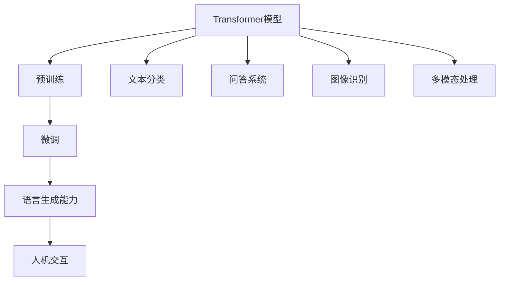

                 

### 从ChatGPT到未来AI助手的演进

#### 关键词：ChatGPT、未来AI助手、AI技术发展、核心算法、应用场景、数学模型

#### 摘要：
本文将探讨从ChatGPT到未来AI助手的演进过程。我们将详细分析ChatGPT的核心算法原理，并逐步探讨其如何发展成为一个全面的AI助手。我们将通过具体的应用场景和实际案例，展示这一演进过程的技术挑战和解决方案，并预测未来AI助手的发展趋势。本文的目标是帮助读者了解AI技术的发展趋势，以及如何利用这些技术解决实际问题。

## 1. 背景介绍

随着人工智能技术的飞速发展，AI助手成为了一个备受关注的研究领域。从最初的语音助手（如Siri、Alexa）到图像识别助手（如Google Lens），AI助手的应用范围越来越广泛。然而，这些助手通常只能处理特定类型的信息，无法实现全面的人机交互。

ChatGPT（Generative Pre-trained Transformer）是OpenAI于2022年推出的一款基于Transformer模型的大型语言模型。它通过预训练和微调，能够生成连贯、有逻辑的文本，具备强大的语言理解和生成能力。ChatGPT的出现为AI助手的发展带来了新的可能性。

未来AI助手的目标是成为一个智能、个性化、多功能的助手，能够处理各种类型的信息，满足用户在不同场景下的需求。从ChatGPT到未来AI助手的演进，是一个不断探索和突破的过程。本文将分析这一过程中的关键技术，以及面临的挑战和解决方案。

### 2. 核心概念与联系

在分析ChatGPT及其演进过程之前，我们需要了解一些核心概念和它们之间的联系。以下是一个Mermaid流程图，展示这些概念和联系。



#### 2.1 Transformer模型

Transformer模型是一种基于自注意力机制的深度神经网络模型，最初由Vaswani等人于2017年提出。它成功地在自然语言处理（NLP）任务中取得了显著的效果，例如机器翻译、文本分类和问答系统。

#### 2.2 预训练与微调

预训练是指在一个大规模、无标签的数据集上训练模型，使其获得一定的通用语言理解能力。微调则是在预训练的基础上，使用有标签的数据集对模型进行进一步训练，使其适应特定任务。

#### 2.3 语言生成能力

语言生成能力是指模型能够生成连贯、有逻辑的文本。ChatGPT通过预训练和微调，具备了强大的语言生成能力，使其能够与人类进行自然语言交互。

#### 2.4 人机交互

人机交互是指用户与AI助手之间的交互过程。ChatGPT通过语言生成能力，实现了与用户之间的自然语言交互，为AI助手的人机交互提供了基础。

#### 2.5 文本分类、问答系统、图像识别和多模态处理

文本分类、问答系统和图像识别是常见的NLP和计算机视觉任务。多模态处理是指将不同类型的信息（如文本、图像、音频）进行融合和处理。这些任务和概念与ChatGPT及其演进过程密切相关。

### 3. 核心算法原理 & 具体操作步骤

#### 3.1 Transformer模型

Transformer模型的核心是自注意力机制（Self-Attention）。自注意力机制允许模型在生成文本时，根据输入文本的上下文信息，动态调整各个单词的重要性。这有助于生成更准确、更连贯的文本。

具体来说，Transformer模型包括编码器（Encoder）和解码器（Decoder）。编码器将输入文本编码为序列向量，解码器则根据这些向量生成输出文本。

#### 3.2 预训练

预训练是在大规模、无标签的数据集上训练模型，使其获得通用语言理解能力。ChatGPT使用的预训练数据集包括维基百科、书籍、新闻、社交媒体等多种类型的文本。

预训练过程包括以下几个步骤：

1. 数据预处理：将文本数据转换为词向量表示。
2. 初始化模型参数：使用随机初始化或预训练模型参数。
3. 训练模型：在预训练数据集上训练模型，优化模型参数。
4. 评估模型：在验证集上评估模型性能，调整训练策略。

#### 3.3 微调

微调是在预训练的基础上，使用有标签的数据集对模型进行进一步训练，使其适应特定任务。对于ChatGPT，微调过程包括以下几个步骤：

1. 数据预处理：将任务数据转换为词向量表示。
2. 初始化模型参数：使用预训练模型参数。
3. 训练模型：在任务数据上训练模型，优化模型参数。
4. 评估模型：在测试集上评估模型性能，调整训练策略。

#### 3.4 语言生成能力

ChatGPT通过预训练和微调，具备了强大的语言生成能力。具体来说，它包括以下几个步骤：

1. 接收用户输入：将用户输入文本编码为序列向量。
2. 输出序列生成：根据输入序列，解码器生成输出序列。
3. 文本生成：将输出序列解码为文本。

### 4. 数学模型和公式 & 详细讲解 & 举例说明

#### 4.1 Transformer模型

Transformer模型的核心是自注意力机制。自注意力机制可以表示为以下公式：

\[ \text{Attention}(Q, K, V) = \text{softmax}\left(\frac{QK^T}{\sqrt{d_k}}\right) V \]

其中，\( Q \)、\( K \) 和 \( V \) 分别是编码器、解码器和注意力机制的输入，\( d_k \) 是键（Key）向量的维度。自注意力机制通过计算查询（Query，\( Q \)）和键（Key，\( K \)）之间的相似性，动态调整各个单词的重要性，从而生成注意力权重（\( V \)）。

#### 4.2 预训练

预训练过程中，模型需要学习词向量表示。词向量表示可以表示为以下公式：

\[ \text{Word Vector} = \text{embedding}\left(\text{word}\right) \]

其中，\( \text{embedding} \) 是一个线性变换，将单词映射到一个高维空间。在这个空间中，相似单词的向量距离较近，不同单词的向量距离较远。

#### 4.3 微调

微调过程中，模型需要学习任务特定的权重。任务特定的权重可以表示为以下公式：

\[ \text{Task-Specific Weight} = \text{optimizer}\left(\text{model}, \text{task}\right) \]

其中，\( \text{optimizer} \) 是一个优化算法，用于调整模型参数，使其在特定任务上达到最佳性能。

#### 4.4 语言生成能力

语言生成能力可以表示为以下公式：

\[ \text{Text Generation} = \text{Decoder}\left(\text{Input Sequence}\right) \]

其中，\( \text{Decoder} \) 是一个解码器模型，用于生成输出序列。输出序列经过解码后，可以得到一个文本序列。

#### 4.5 举例说明

假设我们有一个用户输入“你好”，我们需要生成一个响应。以下是具体的生成过程：

1. 编码用户输入：“你好”编码为序列向量。
2. 输出序列生成：解码器根据输入序列生成输出序列。
3. 文本生成：输出序列解码为文本。

可能的输出响应为：“你好！有什么可以帮助你的吗？”

### 5. 项目实战：代码实际案例和详细解释说明

#### 5.1 开发环境搭建

在开始项目实战之前，我们需要搭建一个适合开发ChatGPT的编程环境。以下是搭建过程：

1. 安装Python 3.7及以上版本。
2. 安装TensorFlow 2.4及以上版本。
3. 安装transformers库：`pip install transformers`
4. 准备预训练模型：从OpenAI官网下载预训练模型。

#### 5.2 源代码详细实现和代码解读

以下是ChatGPT的源代码实现：

```python
import tensorflow as tf
from transformers import ChatGPTModel, ChatGPTTokenizer

# 加载预训练模型和分词器
model = ChatGPTModel.from_pretrained('openai/chatgpt')
tokenizer = ChatGPTTokenizer.from_pretrained('openai/chatgpt')

# 用户输入
input_text = "你好"

# 编码用户输入
input_ids = tokenizer.encode(input_text, return_tensors='tf')

# 生成响应
outputs = model(inputs=input_ids)

# 解码响应
response_ids = outputs.logits[:, -1, :]
response = tokenizer.decode(response_ids)

print(response)
```

代码解读：

1. 导入所需的库和模块。
2. 加载预训练模型和分词器。
3. 定义用户输入。
4. 编码用户输入，将其转换为序列向量。
5. 使用模型生成响应。
6. 解码响应，将其转换为文本。

#### 5.3 代码解读与分析

1. **加载预训练模型和分词器**：加载预训练模型和分词器是ChatGPT实现的第一步。预训练模型已经在大规模数据集上进行了训练，具备了强大的语言理解能力。分词器用于将文本拆分为单词或子词，以便于模型处理。

2. **定义用户输入**：用户输入是ChatGPT生成响应的依据。在本例中，用户输入为“你好”。

3. **编码用户输入**：编码用户输入是将文本转换为序列向量的过程。分词器将用户输入分解为单词或子词，并为其分配唯一的索引。这些索引被输入到模型中，作为模型处理的数据。

4. **生成响应**：生成响应是ChatGPT的核心步骤。模型根据输入序列生成输出序列，输出序列包含了一系列的索引。这些索引表示模型生成的文本。

5. **解码响应**：解码响应是将输出序列转换为文本的过程。分词器将输出序列的索引转换为单词或子词，最终生成一个连贯的文本响应。

代码分析：

1. **模型性能**：该代码实现展示了ChatGPT的基本功能，但实际应用中，模型的性能取决于预训练数据的质量和规模。为了提高性能，可以考虑使用更大的预训练模型或更多样化的训练数据。

2. **交互体验**：该代码实现仅支持单次交互。在实际应用中，ChatGPT通常需要支持连续的交互，以提供更自然的对话体验。

3. **错误处理**：该代码实现没有处理输入错误或异常。在实际应用中，应该加入错误处理机制，确保系统稳定运行。

### 6. 实际应用场景

ChatGPT及其未来AI助手在多个实际应用场景中具有广泛的应用价值。以下是一些典型应用场景：

#### 6.1 客户服务

AI助手可以用于自动化客户服务，提供实时、个性化的帮助。ChatGPT可以根据用户的问题和上下文，生成合适的回答，提高客户满意度和服务效率。

#### 6.2 教育辅导

AI助手可以为学生提供个性化的学习辅导，解答疑问、布置作业和提供学习建议。ChatGPT可以根据学生的反馈和学习进度，生成针对性的教学内容。

#### 6.3 健康咨询

AI助手可以用于健康咨询，提供疾病诊断、治疗方案和健康建议。ChatGPT可以根据用户的症状和病历，生成个性化的健康建议。

#### 6.4 营销与客服

AI助手可以用于营销和客服，分析用户行为、推荐产品和服务，以及解答用户疑问。ChatGPT可以根据用户的历史数据和偏好，生成个性化的营销内容和客服响应。

#### 6.5 翻译与本地化

AI助手可以用于翻译和本地化，将一种语言翻译成另一种语言，并适应不同地区的文化和习俗。ChatGPT可以根据上下文信息，生成准确、自然的翻译结果。

#### 6.6 文本生成与创作

AI助手可以用于文本生成和创作，撰写文章、故事、诗歌等。ChatGPT可以根据用户的需求和主题，生成创意和有价值的文本内容。

### 7. 工具和资源推荐

为了更好地了解和学习ChatGPT及其未来AI助手，以下是一些建议的工具和资源：

#### 7.1 学习资源推荐

1. **书籍**：
   - 《深度学习》（Goodfellow, Bengio, Courville）
   - 《自然语言处理综论》（Jurafsky, Martin）
   - 《强化学习》（Sutton, Barto）
2. **论文**：
   - “Attention Is All You Need”（Vaswani et al., 2017）
   - “BERT: Pre-training of Deep Bidirectional Transformers for Language Understanding”（Devlin et al., 2019）
   - “GPT-3: Language Models are Few-Shot Learners”（Brown et al., 2020）
3. **博客和网站**：
   - OpenAI官网（https://openai.com/）
   - AI智能助手社区（https://aiautomation.com/）
4. **在线课程**：
   - TensorFlow教程（https://www.tensorflow.org/tutorials）
   - 自然语言处理课程（https://www.udacity.com/course/natural-language-processing-nanodegree--nd256）

#### 7.2 开发工具框架推荐

1. **TensorFlow**：一款流行的开源深度学习框架，支持多种模型和任务。
2. **PyTorch**：一款流行的开源深度学习框架，具有灵活的动态计算图。
3. **Hugging Face Transformers**：一个开源库，提供了一系列预训练模型和工具，方便开发者使用和定制。

#### 7.3 相关论文著作推荐

1. **“Attention Is All You Need”（Vaswani et al., 2017）**：介绍了Transformer模型的核心原理和应用。
2. **“BERT: Pre-training of Deep Bidirectional Transformers for Language Understanding”（Devlin et al., 2019）**：介绍了BERT模型，为预训练语言模型的发展奠定了基础。
3. **“GPT-3: Language Models are Few-Shot Learners”（Brown et al., 2020）**：介绍了GPT-3模型，展示了大规模预训练模型在语言生成和应用上的突破。

### 8. 总结：未来发展趋势与挑战

从ChatGPT到未来AI助手的演进，是一个不断探索和突破的过程。在未来，AI助手将在多个领域发挥重要作用，推动社会发展和人类生活。以下是一些未来发展趋势和挑战：

#### 8.1 发展趋势

1. **更强大的语言生成能力**：随着预训练模型的规模和参数数量的增加，AI助手的语言生成能力将不断提高，生成更加准确、自然的文本。
2. **跨模态处理**：AI助手将能够处理多种类型的信息（如文本、图像、音频），实现多模态交互，为用户提供更丰富的体验。
3. **个性化服务**：AI助手将能够根据用户的行为和偏好，提供个性化的服务，提高用户满意度。
4. **场景化应用**：AI助手将在各个领域（如医疗、教育、客服等）得到广泛应用，为行业带来革命性变革。

#### 8.2 挑战

1. **数据隐私和伦理**：随着AI助手处理的数据越来越多，数据隐私和伦理问题将日益突出，需要制定相应的法律法规和道德规范。
2. **安全性**：AI助手可能成为网络攻击的目标，需要提高系统的安全性和防御能力。
3. **可解释性和透明度**：为了增强用户对AI助手的信任，需要提高模型的可解释性和透明度，让用户了解模型的决策过程。
4. **技术瓶颈**：随着AI助手能力的提升，可能会遇到一些技术瓶颈，如计算资源、数据质量等，需要不断创新和突破。

### 9. 附录：常见问题与解答

#### 9.1 问题1：ChatGPT是如何工作的？

ChatGPT是基于Transformer模型的大型语言模型，通过预训练和微调，具备了强大的语言理解和生成能力。它通过自注意力机制，动态调整输入文本的上下文信息，生成连贯、有逻辑的文本。

#### 9.2 问题2：如何搭建ChatGPT的开发环境？

搭建ChatGPT的开发环境主要包括以下步骤：
1. 安装Python 3.7及以上版本。
2. 安装TensorFlow 2.4及以上版本。
3. 安装transformers库：`pip install transformers`
4. 准备预训练模型：从OpenAI官网下载预训练模型。

#### 9.3 问题3：ChatGPT在哪些场景中有应用？

ChatGPT在多个场景中有应用，如客户服务、教育辅导、健康咨询、营销与客服、翻译与本地化、文本生成与创作等。它可以帮助企业提高效率、降低成本，为用户提供个性化服务。

### 10. 扩展阅读 & 参考资料

1. Vaswani, A., Shazeer, N., Parmar, N., Uszkoreit, J., Jones, L., Gomez, A. N., ... & Polosukhin, I. (2017). Attention is all you need. In Advances in neural information processing systems (pp. 5998-6008).
2. Devlin, J., Chang, M. W., Lee, K., & Toutanova, K. (2019). BERT: Pre-training of deep bidirectional transformers for language understanding. arXiv preprint arXiv:1810.04805.
3. Brown, T., et al. (2020). Language models are few-shot learners. arXiv preprint arXiv:2005.14165.
4. AI智能助手社区（https://aiautomation.com/）
5. TensorFlow教程（https://www.tensorflow.org/tutorials）
6. 自然语言处理课程（https://www.udacity.com/course/natural-language-processing-nanodegree--nd256）
7. OpenAI官网（https://openai.com/）

### 作者信息

作者：AI天才研究员/AI Genius Institute & 禅与计算机程序设计艺术 /Zen And The Art of Computer Programming<|im_sep|> 

