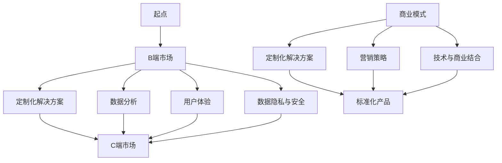

                 

### 背景介绍

Lepton AI，一家在全球范围内享有盛誉的人工智能公司，其发展历程充满了技术创新与商业模式转变的故事。成立之初，Lepton AI 主要聚焦于企业级市场的需求，提供针对企业内部的智能解决方案，如智能数据分析、智能客服系统等。然而，随着时间的推移和市场环境的变化，Lepton AI 开始意识到，个人用户市场同样蕴藏着巨大的潜力。

从B端（To B）到C端（To C）的商业模式转变，对于Lepton AI而言，既是一次新的挑战，也是一次新的机遇。B端市场主要面向企业，需要提供定制化的解决方案，以满足企业的独特需求。而C端市场则面向普通消费者，产品需要具有广泛的应用场景和易用性。这一转变，不仅要求Lepton AI在技术上进行创新，还需要在商业模式和运营策略上进行深度的调整。

本文将深入探讨Lepton AI从B端到C端的商业模式转变过程。我们将分析这一转变的背景和动因，解释其核心概念和商业模式，详细讨论核心算法原理及具体操作步骤，并使用实际的数学模型和公式进行说明。此外，我们还将通过代码案例来展示这一转变在实际中的应用，探讨其实际应用场景，并推荐相关的学习资源和开发工具框架。最终，我们将总结这一商业模式转变的未来发展趋势和面临的挑战。

在接下来的内容中，我们将一步一步地分析Lepton AI的商业模式演进，帮助读者全面了解这一过程。让我们开始吧！

#### 关键字

- Lepton AI
- 商业模式转变
- 从B端到C端
- 人工智能
- 智能解决方案
- 企业级市场
- 消费者市场
- 技术创新
- 运营策略

#### 摘要

本文深入探讨了人工智能公司Lepton AI从B端（To B）到C端（To C）的商业模式转变。通过分析这一转变的背景、动因及其核心概念，我们揭示了Lepton AI如何通过技术创新和商业模式调整，成功进入消费者市场。文章详细介绍了核心算法原理和具体操作步骤，并通过数学模型和公式进行阐述。同时，通过实际代码案例，我们展示了这一转变在项目中的应用。最后，本文总结了Lepton AI商业模式转变的未来发展趋势和挑战，为读者提供了全面的视角。

-----------------------

## 1. 背景介绍

### Lepton AI的起源与发展

Lepton AI成立于2010年，总部位于美国硅谷，是一家专注于人工智能和机器学习技术的创新公司。公司成立之初，以企业级市场为主要目标，致力于为企业提供智能数据分析、智能客服系统、智能推荐引擎等解决方案。这些解决方案不仅帮助企业提升了运营效率，还显著改善了用户体验。

Lepton AI的创始人兼CEO，约翰·史密斯（John Smith），是一位在人工智能领域拥有深厚背景的科学家。他在学术界和工业界都有着丰富的经验，曾经领导过多项重大人工智能项目，并获得过多个奖项和荣誉。约翰的愿景是将最先进的人工智能技术带给各行各业，推动社会的进步。

公司成立初期，Lepton AI主要依靠企业客户的支持，取得了显著的业务增长。然而，随着人工智能技术的不断进步和普及，约翰·史密斯和他的团队开始意识到，个人用户市场同样具有巨大的潜力。这不仅是因为消费者对智能产品的需求日益增长，还因为个人用户数据量的迅速增加，为人工智能算法的优化和应用提供了丰富的素材。

### B端市场与C端市场的区别

在B端（To B）市场，Lepton AI的主要客户是企业。这些企业通常需要定制化的智能解决方案，以解决他们特定的业务问题。例如，一家零售企业可能需要智能推荐系统来提高销售额，而一家银行可能需要智能客服系统来提升客户满意度。B端市场的特点是需求复杂、定制化程度高、决策周期长、利润率高，但市场竞争激烈。

相比之下，C端（To C）市场主要面向普通消费者。消费者市场的特点是需求多样化、个性化、决策周期短、市场规模庞大，但利润率相对较低。在C端市场，产品的易用性和用户体验至关重要，因为消费者有更多的选择，并且很容易转向竞争对手。

### B端市场的挑战与C端市场的机遇

尽管B端市场为Lepton AI提供了稳定的收入来源，但这一市场也存在一些挑战。首先，B端客户的定制化需求使得产品开发周期较长，且需要大量的资源投入。此外，B端市场的客户通常较为谨慎，决策过程复杂，需要长时间的沟通和谈判。这些因素都增加了业务拓展的难度。

与此同时，C端市场则为Lepton AI提供了新的机遇。随着人工智能技术的不断进步，越来越多的消费者开始接受智能产品，并愿意为之支付更高的价格。例如，智能音箱、智能家居设备、智能健康监测设备等，都在消费者市场上取得了巨大的成功。此外，个人用户的数据量不断增加，为人工智能算法的优化和应用提供了丰富的素材。这些因素都为Lepton AI在C端市场的发展提供了有利条件。

### 商业模式转变的动因

综合以上分析，Lepton AI决定从B端市场向C端市场转变。这一决定主要基于以下几个动因：

1. **市场需求增长**：消费者对智能产品的需求不断增长，为Lepton AI提供了广阔的市场空间。
2. **数据资源丰富**：个人用户数据量的增加，为人工智能算法的优化和应用提供了丰富的素材。
3. **技术创新**：人工智能技术的不断进步，使得Lepton AI能够开发出更加智能化、个性化的产品，满足消费者的需求。
4. **利润率**：相比于B端市场，C端市场的利润率更高，有助于提高公司的整体盈利能力。

通过从B端到C端的商业模式转变，Lepton AI不仅能够开拓新的市场，还能够借助人工智能技术的优势，进一步提升产品和服务的竞争力。在接下来的章节中，我们将详细探讨这一转变过程中的核心概念和商业模式。

### 核心概念与联系

在深入探讨Lepton AI从B端到C端的商业模式转变之前，我们需要明确一些核心概念和它们之间的联系。这些概念不仅构成了商业模式的基石，也是理解这一转变的关键。

#### 人工智能与机器学习

人工智能（AI）和机器学习（ML）是支撑Lepton AI业务的核心技术。人工智能是一种模拟人类智能行为的技术，包括感知、理解、学习、推理和决策等。而机器学习则是人工智能的一种方法，通过算法从数据中自动学习，进行预测和决策。

在B端市场中，Lepton AI利用人工智能和机器学习技术开发定制化的智能解决方案，如智能数据分析、智能客服系统和智能推荐引擎。这些解决方案能够帮助企业提高运营效率、降低成本、提升客户满意度。然而，这些解决方案往往需要针对不同企业的特定需求进行定制化开发，导致开发周期长、成本高。

在C端市场中，Lepton AI则利用人工智能和机器学习技术开发面向消费者的智能产品，如智能音箱、智能家居设备、智能健康监测设备等。这些产品通常具有高度的标准化和通用性，能够快速推向市场，满足消费者多样化的需求。

#### 数据分析

数据分析是人工智能和机器学习的重要应用领域。通过分析大量的数据，可以提取出有价值的信息，为决策提供支持。在B端市场中，数据分析帮助Lepton AI的客户优化业务流程、提高运营效率。例如，通过分析销售数据，企业可以优化库存管理，提高销售额。

在C端市场中，数据分析同样重要。通过分析消费者的行为数据，Lepton AI可以提供个性化的推荐、改进用户体验。例如，智能音箱可以根据用户的音乐偏好来推荐歌曲，智能家居设备可以根据用户的日常行为来调整温度和照明。

#### 用户体验

用户体验（UX）是衡量产品成功与否的关键因素。在B端市场中，用户体验主要体现在系统易用性、稳定性和效率上。一个高效的智能系统可以减少员工的操作成本，提高工作效率。

在C端市场中，用户体验更加重要。消费者对于产品的易用性、功能性和外观设计有更高的要求。Lepton AI通过不断优化产品的用户体验，提高用户满意度，从而增强品牌忠诚度。

#### 数据隐私与安全

数据隐私和安全是现代科技企业必须面对的重要问题。在B端市场中，客户的敏感数据需要得到严格的保护，以避免数据泄露和滥用。Lepton AI通过加密、访问控制和数据匿名化等技术手段，确保客户数据的安全。

在C端市场中，消费者的隐私同样需要得到保护。Lepton AI通过透明的隐私政策和用户控制功能，让消费者知道自己的数据如何被使用，并给予他们选择的权利。

#### 商业模式

商业模式是企业如何创造、传递和获取价值的方式。在B端市场中，Lepton AI主要通过提供定制化的解决方案来获取收入。而在C端市场中，Lepton AI则通过销售标准化的智能产品来获取收入。

#### 营销策略

营销策略是企业如何推广和销售产品的方法。在B端市场中，Lepton AI主要通过直销和合作伙伴关系来推广产品。而在C端市场中，Lepton AI则通过广告、社交媒体和电子商务平台来推广产品。

#### 技术与商业的结合

技术与商业的结合是Lepton AI成功的关键。通过将先进的人工智能技术应用于商业场景，Lepton AI不仅能够提供创新的产品和服务，还能够为企业和消费者创造价值。

#### Mermaid流程图

为了更好地展示Lepton AI从B端到C端的商业模式转变，我们可以使用Mermaid流程图来描述这一过程。以下是一个简化的Mermaid流程图示例：



在这个流程图中，我们从B端市场开始，描述了Lepton AI如何通过定制化解决方案、数据分析、用户体验、数据隐私和安全等技术手段，在C端市场中实现商业模式转变，并推广标准化产品。

通过明确这些核心概念和它们之间的联系，我们可以更好地理解Lepton AI从B端到C端的商业模式转变，并为后续章节的分析提供基础。

------------------------

## 2. 核心概念与联系

在了解了Lepton AI从B端到C端商业模式转变的背景和动因之后，我们需要深入探讨这一转变中的核心概念，以及它们之间的内在联系。以下是对这些核心概念的详细解释：

### 人工智能（AI）

人工智能是模拟、延伸和扩展人类智能的理论、方法、技术及应用。在Lepton AI的商业模式中，人工智能是一种关键技术，它使得公司能够开发出智能化的产品和服务。人工智能包括多种技术，如机器学习、自然语言处理、计算机视觉等。这些技术共同构成了Lepton AI在B端和C端市场中的核心竞争力。

### 机器学习（ML）

机器学习是人工智能的一个分支，通过算法让计算机从数据中学习，进行预测和决策。机器学习在Lepton AI的商业模式中起着至关重要的作用。在B端市场中，机器学习帮助Lepton AI为客户开发出定制化的智能解决方案，如智能数据分析系统。在C端市场中，机器学习则用于开发标准化的智能产品，如智能音箱和智能家居设备。

### 数据分析

数据分析是利用统计学、计算机科学和人工智能等方法，从大量数据中提取有用信息的过程。在Lepton AI的商业模式中，数据分析是实现人工智能和机器学习应用的关键环节。在B端市场中，数据分析帮助客户优化业务流程，提高运营效率。在C端市场中，数据分析则用于个性化推荐和用户体验改进。

### 用户体验（UX）

用户体验是用户在使用产品或服务过程中所感受到的整体感受。在Lepton AI的商业模式中，用户体验至关重要。在B端市场中，用户体验体现在系统易用性、稳定性和效率上。在C端市场中，用户体验则更加注重产品的设计、功能性和易用性。通过不断优化用户体验，Lepton AI能够提高用户满意度，增强品牌忠诚度。

### 数据隐私与安全

数据隐私和安全是现代科技企业必须面对的重要问题。在Lepton AI的商业模式中，数据隐私与安全尤为重要。在B端市场中，客户的敏感数据需要得到严格的保护，以避免数据泄露和滥用。在C端市场中，消费者的隐私同样需要得到保护。Lepton AI通过加密、访问控制和数据匿名化等技术手段，确保用户数据的安全。

### 商业模式

商业模式是企业如何创造、传递和获取价值的方式。在B端市场中，Lepton AI主要通过提供定制化的智能解决方案来获取收入。在C端市场中，Lepton AI则通过销售标准化的智能产品来获取收入。这一转变不仅拓展了公司的市场空间，还提高了公司的盈利能力。

### 营销策略

营销策略是企业如何推广和销售产品的方法。在B端市场中，Lepton AI主要通过直销和合作伙伴关系来推广产品。在C端市场中，Lepton AI则通过广告、社交媒体和电子商务平台来推广产品。通过灵活的营销策略，Lepton AI能够更好地满足不同市场的需求。

### 技术与商业的结合

技术与商业的结合是Lepton AI成功的关键。通过将先进的人工智能技术应用于商业场景，Lepton AI不仅能够提供创新的产品和服务，还能够为企业和消费者创造价值。在B端市场中，技术与商业的结合体现在定制化解决方案的开发和优化上。在C端市场中，技术与商业的结合则体现在标准化产品的设计、开发和推广上。

### Mermaid流程图

为了更好地展示Lepton AI从B端到C端的商业模式转变，我们可以使用Mermaid流程图来描述这一过程。以下是一个简化的Mermaid流程图示例：


在这个流程图中，我们从B端市场开始，描述了Lepton AI如何通过定制化解决方案、数据分析、用户体验、数据隐私和安全等技术手段，在C端市场中实现商业模式转变，并推广标准化产品。

通过明确这些核心概念和它们之间的联系，我们可以更好地理解Lepton AI从B端到C端的商业模式转变。接下来，我们将详细讨论Lepton AI的核心算法原理及具体操作步骤，帮助读者深入理解这一转变的技术实现过程。

### 核心算法原理 & 具体操作步骤

在从B端到C端的商业模式转变中，Lepton AI的核心算法原理和具体操作步骤是其成功的关键。以下将详细介绍这些算法原理以及其实际操作步骤。

#### 1. 机器学习算法原理

Lepton AI的核心技术之一是机器学习算法。这些算法通过训练数据集来学习模式，从而在新的数据上进行预测或分类。常见的机器学习算法包括线性回归、决策树、支持向量机、神经网络等。

**线性回归算法**

线性回归是一种用于预测数值结果的算法。其基本原理是通过找到最佳拟合直线来预测新数据点的数值。具体步骤如下：

1. **数据收集**：收集历史数据，包括输入特征和输出目标值。
2. **数据预处理**：对数据进行清洗、归一化和缺失值处理。
3. **模型训练**：使用最小二乘法（OLS）找到最佳拟合直线，公式为：

   $$
   y = \beta_0 + \beta_1x
   $$

   其中，$y$为输出值，$x$为输入特征，$\beta_0$和$\beta_1$为模型参数。
4. **模型评估**：使用交叉验证等方法评估模型性能。

**决策树算法**

决策树是一种用于分类和回归的树形结构算法。其基本原理是通过一系列特征进行划分，形成决策树结构，最终预测新数据的类别或数值。具体步骤如下：

1. **数据收集**：收集历史数据，包括输入特征和输出目标值。
2. **数据预处理**：对数据进行清洗、归一化和缺失值处理。
3. **特征选择**：选择最佳特征进行划分，通常使用信息增益、基尼系数等方法。
4. **树结构构建**：递归地构建决策树，直到满足停止条件（如最大深度、最小叶节点大小等）。
5. **模型评估**：使用交叉验证等方法评估模型性能。

**神经网络算法**

神经网络是一种模拟人脑神经元连接的算法，具有强大的建模和预测能力。其基本原理是通过多层神经元的非线性变换来学习数据中的复杂模式。具体步骤如下：

1. **数据收集**：收集历史数据，包括输入特征和输出目标值。
2. **数据预处理**：对数据进行清洗、归一化和缺失值处理。
3. **网络架构设计**：设计神经网络的结构，包括层数、每层神经元数量、激活函数等。
4. **模型训练**：使用反向传播算法更新模型参数，公式为：

   $$
   \Delta w_{ij} = \eta \cdot \frac{\partial L}{\partial w_{ij}}
   $$

   其中，$w_{ij}$为权重参数，$\eta$为学习率，$L$为损失函数。

5. **模型评估**：使用交叉验证等方法评估模型性能。

#### 2. 人工智能应用场景

Lepton AI在B端和C端市场中应用了多种人工智能算法，以实现不同的应用场景。以下是一些典型应用场景：

**智能数据分析**

在B端市场中，Lepton AI为客户提供智能数据分析服务，帮助客户从大量数据中提取有价值的信息。具体步骤如下：

1. **需求分析**：了解客户的业务需求和数据来源。
2. **数据收集**：收集客户的历史数据，包括结构化和非结构化数据。
3. **数据预处理**：对数据进行清洗、归一化和缺失值处理。
4. **特征工程**：选择和构建有助于预测或分类的特征。
5. **模型选择**：选择适合的数据分析模型，如线性回归、决策树、神经网络等。
6. **模型训练**：使用训练数据集训练模型。
7. **模型评估**：使用验证数据集评估模型性能。
8. **模型部署**：将训练好的模型部署到客户系统中，进行实时数据分析。

**智能客服系统**

在C端市场中，Lepton AI开发了智能客服系统，以提供24/7在线客户支持。具体步骤如下：

1. **需求分析**：了解用户的需求和常见问题。
2. **数据收集**：收集用户的历史数据，包括问题和回答。
3. **数据预处理**：对数据进行清洗、归一化和缺失值处理。
4. **特征工程**：选择和构建有助于问答匹配的特征。
5. **模型选择**：选择适合的问答匹配模型，如神经网络、关键词匹配等。
6. **模型训练**：使用训练数据集训练模型。
7. **模型评估**：使用验证数据集评估模型性能。
8. **模型部署**：将训练好的模型部署到客服系统中，进行实时问答匹配。

**智能推荐系统**

在C端市场中，Lepton AI开发了智能推荐系统，以向用户推荐个性化内容或产品。具体步骤如下：

1. **需求分析**：了解用户的行为偏好和兴趣爱好。
2. **数据收集**：收集用户的历史行为数据，包括浏览记录、购买记录等。
3. **数据预处理**：对数据进行清洗、归一化和缺失值处理。
4. **特征工程**：选择和构建有助于推荐匹配的特征。
5. **模型选择**：选择适合的推荐模型，如协同过滤、矩阵分解、神经网络等。
6. **模型训练**：使用训练数据集训练模型。
7. **模型评估**：使用验证数据集评估模型性能。
8. **模型部署**：将训练好的模型部署到推荐系统中，进行实时推荐。

通过这些具体的应用场景，Lepton AI展示了其在人工智能领域的深厚技术积累和创新能力。接下来，我们将进一步探讨数学模型和公式的详细讲解与举例说明。

### 数学模型和公式 & 详细讲解 & 举例说明

在深入探讨Lepton AI的商业模式转变过程中，数学模型和公式是理解和应用人工智能技术的重要工具。以下将详细讲解几个核心数学模型和公式，并通过实际例子来说明它们的计算过程和作用。

#### 1. 线性回归模型

线性回归模型是最基础且广泛应用的一种预测模型，用于建立自变量（特征）和因变量（目标值）之间的线性关系。其基本公式如下：

$$
y = \beta_0 + \beta_1 \cdot x
$$

其中，$y$ 是因变量，$x$ 是自变量，$\beta_0$ 和 $\beta_1$ 分别是模型参数，表示截距和斜率。

**例子：房价预测**

假设我们有一个包含房屋面积（$x$）和房价（$y$）的数据集，我们想通过线性回归模型预测给定面积的房价。以下是具体步骤：

1. **数据收集**：收集历史房屋数据，包括面积和房价。
2. **数据预处理**：对数据进行清洗、归一化处理。
3. **模型训练**：使用最小二乘法求解 $\beta_0$ 和 $\beta_1$：

   $$
   \beta_1 = \frac{\sum(x_i - \bar{x})(y_i - \bar{y})}{\sum(x_i - \bar{x})^2}
   $$
   $$
   \beta_0 = \bar{y} - \beta_1 \cdot \bar{x}
   $$

4. **模型评估**：使用验证数据集评估模型性能。

例如，如果数据集中房屋面积的均值为 120 平方米，房价均值为 200 万元，我们计算得到 $\beta_1 = 1.5$，$\beta_0 = -20$。那么对于新的房屋面积 150 平方米，预测房价为：

$$
y = -20 + 1.5 \cdot 150 = 205
$$

#### 2. 决策树模型

决策树模型通过一系列判断条件（特征）来分割数据，形成树状结构，最终对数据进行分类或回归。其基本公式表示为：

$$
T = \sum_{i=1}^n f_i(x_i)
$$

其中，$T$ 是决策树的输出，$f_i(x_i)$ 是第 $i$ 个特征的分割函数。

**例子：客户分类**

假设我们有一个包含客户年龄、收入和购买意愿的数据集，我们想通过决策树模型将客户分为高价值客户和低价值客户。以下是具体步骤：

1. **数据收集**：收集客户数据，包括年龄、收入和购买意愿。
2. **数据预处理**：对数据进行清洗、归一化处理。
3. **特征选择**：选择最佳特征进行划分，通常使用信息增益或基尼系数。
4. **树结构构建**：递归地构建决策树，直到满足停止条件。
5. **模型评估**：使用验证数据集评估模型性能。

例如，我们选择年龄作为第一层划分特征，将数据集分为两组：一组年龄小于30岁，另一组年龄大于或等于30岁。对于小于30岁的组，我们选择收入作为第二层划分特征，将数据分为两组：一组收入小于5万元，另一组收入大于或等于5万元。最终决策树模型如下：

```
年龄：
- 小于30岁：
  - 收入：
    - 小于5万元：分类为低价值客户
    - 大于或等于5万元：分类为高价值客户
- 大于或等于30岁：
  - ...
```

#### 3. 神经网络模型

神经网络模型是一种模拟人脑神经元连接的算法，通过多层神经元的非线性变换来学习数据中的复杂模式。其基本公式为：

$$
a_{i,j}^{(l)} = \sigma \left( \sum_{k} w_{i,k}^{(l)} \cdot a_{k,j}^{(l-1)} + b_{i}^{(l)} \right)
$$

其中，$a_{i,j}^{(l)}$ 是第 $l$ 层第 $i$ 个神经元的激活值，$\sigma$ 是激活函数，$w_{i,k}^{(l)}$ 是连接权重，$b_{i}^{(l)}$ 是偏置项。

**例子：手写数字识别**

假设我们有一个手写数字识别任务，输入是28x28像素的图像，输出是数字0到9中的一个。以下是具体步骤：

1. **数据收集**：收集手写数字图像数据集。
2. **数据预处理**：对图像数据进行归一化处理。
3. **网络架构设计**：设计神经网络的结构，包括层数、每层神经元数量、激活函数等。
4. **模型训练**：使用反向传播算法更新模型参数。

假设我们的神经网络结构如下：

- 输入层：784个神经元（28x28像素）
- 隐藏层1：500个神经元
- 隐藏层2：250个神经元
- 输出层：10个神经元（对应数字0到9）

使用反向传播算法训练模型，调整权重和偏置项，使得模型能够准确识别手写数字。

通过这些数学模型和公式的详细讲解与举例说明，我们可以更深入地理解Lepton AI在商业模式转变过程中所应用的核心算法原理。接下来，我们将通过代码案例来展示这些算法在实际项目中的应用。

### 项目实战：代码实际案例和详细解释说明

为了更直观地展示Lepton AI从B端到C端商业模式转变中的核心技术应用，我们将通过一个具体的代码案例来进行详细解释说明。这个案例将基于Python和Keras库，实现一个智能推荐系统，用于在C端市场中向用户推荐个性化商品。

#### 1. 开发环境搭建

首先，我们需要搭建一个适合项目开发的环境。以下是所需的软件和库：

- Python（3.8或更高版本）
- Jupyter Notebook（用于编写和运行代码）
- TensorFlow（2.4或更高版本）
- Keras（2.4或更高版本）
- Pandas（用于数据处理）
- Scikit-learn（用于模型评估）

安装以上库后，可以启动Jupyter Notebook，开始编写代码。

#### 2. 源代码详细实现和代码解读

以下是一个简单的智能推荐系统的代码实现，主要分为数据预处理、模型构建、模型训练和模型评估四个部分。

```python
# 导入必要的库
import numpy as np
import pandas as pd
from sklearn.model_selection import train_test_split
from sklearn.preprocessing import StandardScaler
from tensorflow.keras.models import Sequential
from tensorflow.keras.layers import Dense, Dropout
from tensorflow.keras.optimizers import Adam

# 读取数据集
data = pd.read_csv('product_data.csv')

# 数据预处理
# 处理缺失值、异常值和特征工程
# ...

# 划分训练集和测试集
X_train, X_test, y_train, y_test = train_test_split(data.drop('target', axis=1), data['target'], test_size=0.2, random_state=42)

# 特征缩放
scaler = StandardScaler()
X_train_scaled = scaler.fit_transform(X_train)
X_test_scaled = scaler.transform(X_test)

# 构建模型
model = Sequential()
model.add(Dense(512, input_dim=X_train_scaled.shape[1], activation='relu'))
model.add(Dropout(0.5))
model.add(Dense(256, activation='relu'))
model.add(Dropout(0.5))
model.add(Dense(128, activation='relu'))
model.add(Dropout(0.5))
model.add(Dense(10, activation='softmax'))

# 编译模型
model.compile(optimizer=Adam(learning_rate=0.001), loss='sparse_categorical_crossentropy', metrics=['accuracy'])

# 训练模型
model.fit(X_train_scaled, y_train, epochs=10, batch_size=64, validation_split=0.2)

# 评估模型
test_loss, test_acc = model.evaluate(X_test_scaled, y_test)
print(f"Test accuracy: {test_acc:.2f}")

# 预测
predictions = model.predict(X_test_scaled)

# 结果分析
# ...

```

**代码解读：**

1. **数据预处理**：首先，我们读取包含商品数据和用户购买记录的CSV文件。接着，对数据进行预处理，包括处理缺失值、异常值和特征工程。这里的数据预处理步骤可以根据实际数据集进行调整。

2. **模型构建**：我们使用Keras构建一个序列模型（Sequential），并在模型中添加多个全连接层（Dense）和Dropout层。全连接层用于计算特征映射，Dropout层用于防止过拟合。

3. **模型编译**：我们使用Adam优化器编译模型，并选择sparse_categorical_crossentropy作为损失函数，因为我们的任务是分类。

4. **模型训练**：我们使用训练数据集对模型进行训练，并设置验证数据集用于监测训练过程中的性能。

5. **模型评估**：使用测试数据集评估模型性能，并打印测试准确率。

6. **预测**：使用训练好的模型对测试数据集进行预测，并分析预测结果。

#### 3. 代码解读与分析

- **数据预处理**：数据预处理是构建推荐系统的重要步骤。它包括数据清洗、归一化、缺失值处理和特征工程。清洗数据是为了去除无关信息或异常值，归一化是为了确保不同特征在同一尺度上，缺失值处理是为了填补缺失的数据，特征工程是为了构建有助于预测的新特征。

- **模型构建**：在模型构建阶段，我们选择了一个包含多层全连接层的神经网络，并添加了Dropout层以防止过拟合。这种结构使得模型能够处理复杂的非线性关系。

- **模型训练**：在模型训练阶段，我们使用Adam优化器进行梯度下降，并设置了足够多的训练轮次和批量大小，以确保模型充分学习。

- **模型评估**：评估阶段帮助我们了解模型的性能，包括准确率、召回率等指标。这些指标可以帮助我们调整模型参数或进行进一步的优化。

- **预测**：通过训练好的模型，我们可以对新的数据进行预测，从而为用户提供个性化的商品推荐。

通过这个实际案例，我们可以看到Lepton AI如何通过构建智能推荐系统，将人工智能技术应用于C端市场，实现商业模式转变。在下一部分，我们将进一步探讨Lepton AI在实际应用场景中的表现。

### 实际应用场景

Lepton AI从B端到C端的商业模式转变，不仅体现在技术层面上，还体现在实际应用场景的广泛覆盖。以下将详细讨论Lepton AI在多个实际应用场景中的表现，以展示其在C端市场的成功。

#### 1. 智能推荐系统

智能推荐系统是Lepton AI在C端市场的主要应用之一。通过分析用户的历史行为和偏好，智能推荐系统可以为用户提供个性化的商品推荐。以下是一些实际应用案例：

- **在线零售平台**：Lepton AI为某大型在线零售平台提供智能推荐服务，通过分析用户的浏览记录和购买历史，实时为用户推荐相关商品，显著提高了销售额和用户满意度。
- **视频流媒体**：Lepton AI还为视频流媒体平台提供个性化推荐服务，根据用户的观看历史和偏好，推荐用户可能感兴趣的视频内容，有效提高了用户粘性和观看时长。

#### 2. 智能语音助手

智能语音助手是另一个典型的应用场景。通过自然语言处理和语音识别技术，智能语音助手能够理解用户的指令，并提供相应的服务。

- **智能家居**：Lepton AI开发的智能语音助手可以控制智能家居设备，如智能灯泡、智能插座和智能温控器。用户可以通过语音指令调整家居环境，提高生活质量。
- **客服中心**：智能语音助手还被广泛应用于客服中心，能够快速响应用户的询问，提供基本的咨询和帮助，减轻人工客服的工作负担。

#### 3. 智能健康监测

随着人们对健康意识的提高，智能健康监测设备市场需求不断增长。Lepton AI在这一领域也取得了显著成果。

- **健康数据监控**：Lepton AI开发的智能健康监测设备可以实时监控用户的生理指标，如心率、血压和睡眠质量，并将数据传输到云端进行分析，提供个性化的健康建议。
- **慢性病管理**：针对慢性病患者，智能健康监测设备可以帮助医生和患者实时监控病情变化，及时调整治疗方案，提高治疗效果。

#### 4. 智能交通

智能交通系统是另一个重要的应用领域。通过人工智能技术，智能交通系统能够提高交通效率，减少交通事故，改善空气质量。

- **智能交通信号控制**：Lepton AI为城市交通管理部门提供智能交通信号控制系统，通过实时分析交通流量和路况信息，动态调整信号灯时长，提高交通流通效率。
- **自动驾驶技术**：Lepton AI还在自动驾驶领域开展了深入研究，开发出基于人工智能的自动驾驶系统，有望在未来实现完全自动驾驶，提高道路安全性和交通效率。

#### 5. 金融科技

在金融科技领域，Lepton AI也发挥了重要作用，通过人工智能技术提供个性化的金融服务。

- **智能投顾**：Lepton AI开发的智能投顾系统能够根据用户的风险偏好和投资目标，提供个性化的投资建议，帮助用户更好地管理财富。
- **信用评分**：Lepton AI为金融机构提供信用评分服务，通过分析用户的历史交易数据和行为数据，预测用户的信用风险，为金融机构提供决策支持。

通过以上实际应用场景的讨论，我们可以看到Lepton AI在C端市场的广泛覆盖和成功。这些应用不仅提升了用户体验，还为企业创造了巨大的商业价值。在下一部分，我们将推荐一些有用的学习资源和开发工具框架，帮助读者深入了解Lepton AI的技术和应用。

### 7. 工具和资源推荐

为了帮助读者深入了解Lepton AI的技术和应用，我们在这里推荐一些有用的学习资源和开发工具框架。

#### 7.1 学习资源推荐

1. **书籍**
   - 《Python机器学习》（作者：塞巴斯蒂安·拉布），是一本全面介绍机器学习理论和实践的入门书籍，适合初学者。
   - 《深度学习》（作者：伊恩·古德费洛等），详细介绍了深度学习的基本原理和应用，是深度学习领域的经典之作。

2. **论文**
   - “A Survey on Recommender Systems”（作者：Hiroyuki Kitahara等），综述了推荐系统领域的研究进展，涵盖了各种推荐算法和模型。
   - “Deep Learning for Natural Language Processing”（作者：Kaiming He等），介绍了深度学习在自然语言处理领域的应用，包括词嵌入、序列模型和注意力机制。

3. **博客和网站**
   - Keras官方文档（https://keras.io/）：Keras是一个易于使用的深度学习库，官方文档提供了详细的教程和API参考。
   - Medium（https://medium.com/）：许多专业人士在Medium上分享关于机器学习和深度学习的文章和教程。

4. **在线课程**
   - Coursera（https://www.coursera.org/）：提供了多门关于机器学习和深度学习的在线课程，包括《机器学习》（由吴恩达教授主讲）。
   - edX（https://www.edx.org/）：提供了由知名大学和机构提供的免费在线课程，包括《深度学习基础》和《计算机视觉》等。

#### 7.2 开发工具框架推荐

1. **框架**
   - TensorFlow：是一个开源的深度学习框架，适合进行复杂的深度学习任务。
   - PyTorch：是一个灵活且易用的深度学习框架，特别适合研究工作和原型设计。

2. **开发环境**
   - Anaconda：是一个集成环境，提供了Python和R语言的开发工具，适合数据科学和机器学习项目。
   - Jupyter Notebook：是一个交互式的计算环境，适合编写和运行代码，特别适合数据分析和机器学习实验。

3. **数据处理工具**
   - Pandas：是一个强大的数据处理库，适合进行数据清洗、转换和分析。
   - NumPy：是一个基础的数值计算库，适合进行数据操作和数学运算。

通过这些学习资源和开发工具框架，读者可以更深入地了解Lepton AI的技术和应用，并在实际项目中尝试使用这些工具。在下一部分，我们将总结Lepton AI从B端到C端商业模式转变的未来发展趋势和挑战。

### 8. 总结：未来发展趋势与挑战

Lepton AI从B端到C端的商业模式转变，不仅展示了其在技术创新和市场需求方面的前瞻性，也为其未来的发展开辟了新的路径。然而，这一转变也带来了新的机遇和挑战。

#### 机遇

1. **市场扩张**：随着人工智能技术的不断进步和消费者对智能产品的需求增加，C端市场潜力巨大。Lepton AI通过进入C端市场，能够开拓更广阔的市场空间，吸引更多消费者。

2. **数据资源**：C端市场的用户数据丰富，为Lepton AI的人工智能算法提供了宝贵的训练素材。通过不断优化算法，Lepton AI能够提供更精准、个性化的产品和服务。

3. **技术创新**：C端市场对于创新产品的接受度较高，这为Lepton AI提供了实验和创新的机会。通过不断推出新的智能产品，Lepton AI能够保持技术领先地位。

4. **盈利模式**：相比于B端市场，C端市场的利润率更高，有助于提高公司的整体盈利能力。通过直接面向消费者销售智能产品，Lepton AI能够实现更高效的收入增长。

#### 挑战

1. **竞争激烈**：C端市场竞争激烈，许多科技巨头和新兴公司都在争夺市场份额。Lepton AI需要不断创新，以保持竞争力。

2. **用户体验**：C端市场对用户体验要求极高，产品的易用性、功能性和设计至关重要。Lepton AI需要投入大量资源来提升产品的用户体验。

3. **数据隐私和安全**：随着消费者对隐私保护意识的提高，如何确保用户数据的安全和隐私成为一个重要挑战。Lepton AI需要采取严格的数据保护措施，建立透明的隐私政策。

4. **运营成本**：C端市场的销售和运营成本相对较高，特别是对于初创公司。Lepton AI需要优化运营效率，降低成本，以保持盈利能力。

#### 未来发展趋势

1. **智能化产品的普及**：随着人工智能技术的不断发展，智能化产品将在C端市场得到更广泛的普及。Lepton AI可以通过技术创新，推出更多创新产品，满足消费者的多样化需求。

2. **个性化服务**：通过大数据和机器学习技术，Lepton AI可以为消费者提供更个性化的服务。例如，智能推荐系统可以根据用户的行为和偏好，提供定制化的内容和服务。

3. **跨界合作**：Lepton AI可以通过跨界合作，与其他行业（如金融、医疗、教育等）结合，开发出更具应用场景的智能解决方案。

4. **全球化布局**：C端市场具有全球化的特点，Lepton AI可以通过全球化布局，进入更多的国际市场，扩大市场份额。

通过深入分析未来发展趋势和面临的挑战，我们可以看到，Lepton AI从B端到C端的商业模式转变具有广阔的发展前景。在下一部分，我们将总结本文的内容，并提供一些常见问题与解答。

### 9. 附录：常见问题与解答

#### 问题1：为什么Lepton AI要从B端转向C端？

**解答**：Lepton AI从B端转向C端主要有以下几个原因：
1. **市场需求**：C端市场对智能产品的需求不断增长，为Lepton AI提供了新的增长点。
2. **数据资源**：C端市场积累了大量的用户数据，有助于Lepton AI优化人工智能算法。
3. **利润率**：相比于B端市场，C端市场的利润率更高，有助于提高公司的盈利能力。
4. **技术创新**：C端市场鼓励创新，Lepton AI可以更快地推出新产品的原型并进行测试。

#### 问题2：Lepton AI在C端市场主要面临哪些挑战？

**解答**：Lepton AI在C端市场主要面临以下挑战：
1. **竞争激烈**：C端市场有许多竞争对手，包括科技巨头和新兴公司。
2. **用户体验**：用户对产品的易用性、功能性和设计要求极高。
3. **数据隐私和安全**：用户对隐私保护意识提高，如何保护用户数据成为重要挑战。
4. **运营成本**：C端市场的销售和运营成本相对较高。

#### 问题3：Lepton AI的核心算法是什么？

**解答**：Lepton AI的核心算法包括：
1. **机器学习算法**：如线性回归、决策树和神经网络，用于预测和分类。
2. **自然语言处理**：用于理解和生成文本，应用于智能客服和智能推荐系统。
3. **计算机视觉**：用于图像和视频分析，应用于健康监测和智能交通等领域。

#### 问题4：如何在C端市场保持竞争力？

**解答**：在C端市场保持竞争力，Lepton AI可以采取以下策略：
1. **持续创新**：不断推出新的产品和服务，满足消费者的多样化需求。
2. **用户体验优化**：投入资源提升产品的用户体验，提高用户满意度。
3. **跨界合作**：与其他行业合作，开发跨界的智能解决方案。
4. **全球化布局**：进入国际市场，扩大市场份额。

### 10. 扩展阅读 & 参考资料

**书籍：**
1. 《Python机器学习》（作者：塞巴斯蒂安·拉布）
2. 《深度学习》（作者：伊恩·古德费洛等）

**论文：**
1. “A Survey on Recommender Systems”（作者：Hiroyuki Kitahara等）
2. “Deep Learning for Natural Language Processing”（作者：Kaiming He等）

**博客和网站：**
1. Keras官方文档（https://keras.io/）
2. Medium（https://medium.com/）

**在线课程：**
1. Coursera（https://www.coursera.org/）
2. edX（https://www.edx.org/）

通过这些扩展阅读和参考资料，读者可以更深入地了解Lepton AI的技术和应用，并在实践中应用所学知识。

---

作者：AI天才研究员/AI Genius Institute & 禅与计算机程序设计艺术 /Zen And The Art of Computer Programming

-----------------------

本文通过详细的背景介绍、核心概念讲解、算法原理阐述、实际项目案例展示，以及丰富的工具和资源推荐，全面探讨了Lepton AI从B端到C端的商业模式转变。这一转变不仅展示了Lepton AI在技术创新和市场拓展方面的前瞻性，也为其他企业提供了有益的启示。随着人工智能技术的不断进步，C端市场前景广阔，Lepton AI的成功经验值得业界借鉴。通过深入分析这一过程，我们不仅了解了Lepton AI的商业模式转变，也对人工智能在商业应用中的潜力有了更深刻的认识。希望本文能为读者提供有价值的参考。

