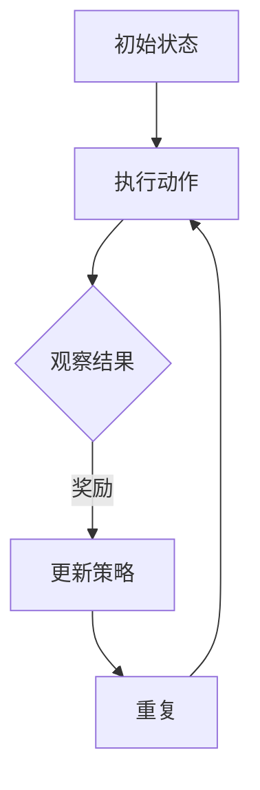

                 

# 从人类反馈中强化学习的幻觉

## 关键词：强化学习、人类反馈、幻觉、模型优化、算法改进

### 摘要

本文旨在探讨强化学习领域中，模型在面对人类反馈时可能产生的“幻觉”现象。通过分析这种现象的成因、影响及解决方法，为研究人员和实践者提供新的视角和思考方向。文章首先介绍了强化学习的背景和核心概念，随后详细阐述了人类反馈的作用和潜在问题，并通过实例分析了“幻觉”现象的具体表现。最后，文章提出了几种应对“幻觉”的策略，并展望了未来的研究方向。

## 1. 背景介绍

### 1.1 强化学习的基本概念

强化学习（Reinforcement Learning，RL）是一种机器学习范式，旨在通过学习如何采取行动以最大化某个指标（通常是奖励信号）。与监督学习和无监督学习不同，强化学习依赖于一个代理（agent）与环境的交互过程，通过试错（trial and error）来学习最优策略。

在强化学习中，核心概念包括：

- **代理（Agent）**：执行动作的主体，可以是机器人、软件程序或其他智能体。
- **环境（Environment）**：代理操作的上下文，可以模拟为数学模型或实际物理环境。
- **状态（State）**：环境在某一时刻的状态，通常由一组属性或特征表示。
- **动作（Action）**：代理在状态中可以执行的行为。
- **奖励（Reward）**：环境对代理行为的即时反馈，用于指导代理学习。

### 1.2 强化学习的发展历程

强化学习起源于20世纪50年代，但直到近年才因深度学习和其他技术的进步而取得显著突破。早期的研究主要集中在基于值函数的方法（如Q-Learning）和政策梯度方法（如REINFORCE）。随着深度神经网络的引入，深度强化学习（Deep Reinforcement Learning，DRL）逐渐成为研究热点。

### 1.3 强化学习的应用领域

强化学习在多个领域取得了成功，包括但不限于：

- **游戏**：如《Atari》游戏、围棋等。
- **机器人控制**：自动驾驶、无人机等。
- **推荐系统**：个性化推荐、广告投放等。
- **资源分配**：如电力网络、通信网络等。

## 2. 核心概念与联系

### 2.1 强化学习的基本原理

强化学习的基本原理是“试错学习”，即代理通过与环境交互，不断调整其策略，以最大化长期奖励。这个过程可以表示为马尔可夫决策过程（MDP）：

$$
P(s',r|s,a) = p(s'|s,a) + \gamma P(s',r|s,f(s,a))
$$

其中，$s$ 和 $s'$ 分别表示当前状态和下一个状态，$a$ 是当前动作，$r$ 是即时奖励，$\gamma$ 是折扣因子。

### 2.2 人类反馈在强化学习中的作用

人类反馈在强化学习中扮演着重要角色。一方面，它可以帮助代理快速适应新环境；另一方面，它也可以用于指导代理进行探索和优化。然而，人类反馈也带来了一些挑战，如：

- **幻觉**：代理可能将人类反馈视为环境的一部分，导致其策略产生偏差。
- **滞后性**：人类反馈可能无法及时反映环境的变化。
- **不确定性**：人类反馈的质量和可靠性可能受到主观因素的影响。

### 2.3 强化学习架构的 Mermaid 流程图



### 2.4 人类反馈与强化学习的关系

人类反馈与强化学习的关系可以理解为“指导与响应”的过程。代理在执行动作后，会根据人类反馈进行策略调整，以实现更好的性能。然而，这种调整可能受到幻觉现象的影响，导致代理产生错误的策略。

## 3. 核心算法原理 & 具体操作步骤

### 3.1 Q-Learning 算法原理

Q-Learning 是一种基于值函数的强化学习算法，旨在通过学习状态-动作值函数（Q-值）来最大化长期奖励。Q-Learning 的基本思想是：

$$
Q(s,a) \leftarrow Q(s,a) + \alpha [r + \gamma \max_{a'} Q(s',a') - Q(s,a)]
$$

其中，$\alpha$ 是学习率，$r$ 是即时奖励，$\gamma$ 是折扣因子。

### 3.2 强化学习算法的具体操作步骤

1. 初始化 Q-值函数。
2. 在状态 $s$ 中执行随机动作 $a$。
3. 根据执行的动作 $a$ 观察到状态 $s'$ 和即时奖励 $r$。
4. 更新 Q-值函数。
5. 重复步骤 2-4，直到达到终止条件。

## 4. 数学模型和公式 & 详细讲解 & 举例说明

### 4.1 数学模型

在强化学习中，核心的数学模型是马尔可夫决策过程（MDP）。MDP 可以表示为五元组 $(S, A, P, R, \gamma)$，其中：

- $S$：状态空间。
- $A$：动作空间。
- $P$：状态转移概率矩阵。
- $R$：奖励函数。
- $\gamma$：折扣因子。

### 4.2 公式

在 MDP 中，状态-动作值函数 $Q(s,a)$ 可以通过以下公式计算：

$$
Q(s,a) = \sum_{s'} P(s'|s,a) [r + \gamma \max_{a'} Q(s',a')]
$$

### 4.3 举例说明

假设一个简单的环境，其中有两个状态 $s_1$ 和 $s_2$，以及两个动作 $a_1$ 和 $a_2$。状态转移概率矩阵和奖励函数如下：

$$
P = \begin{bmatrix}
0.9 & 0.1 \\
0.1 & 0.9
\end{bmatrix}, \quad
R = \begin{bmatrix}
5 & 0 \\
0 & 5
\end{bmatrix}
$$

初始状态为 $s_1$，代理执行动作 $a_1$，我们需要计算状态-动作值函数 $Q(s_1,a_1)$。

根据公式，我们有：

$$
Q(s_1,a_1) = 0.9 \times 5 + 0.1 \times 0 = 4.5
$$

同理，可以计算其他状态-动作值函数。

## 5. 项目实战：代码实际案例和详细解释说明

### 5.1 开发环境搭建

在本节中，我们将使用 Python 语言和 OpenAI 的 Gym 工具箱来构建一个简单的强化学习项目。首先，确保您已安装以下依赖项：

```bash
pip install numpy gym
```

### 5.2 源代码详细实现和代码解读

下面是一个简单的 Q-Learning 示例，用于训练代理在 CartPole 环境中保持平衡。

```python
import gym
import numpy as np

# 初始化环境
env = gym.make('CartPole-v0')

# 初始化 Q-值表
n_states = env.observation_space.shape[0]
n_actions = env.action_space.n
Q = np.zeros((n_states, n_actions))

# 设置学习参数
alpha = 0.1
gamma = 0.99
epsilon = 0.1

# 训练代理
for episode in range(1000):
    state = env.reset()
    done = False
    total_reward = 0

    while not done:
        # 选择动作
        if np.random.rand() < epsilon:
            action = env.action_space.sample()
        else:
            action = np.argmax(Q[state])

        # 执行动作
        next_state, reward, done, _ = env.step(action)
        total_reward += reward

        # 更新 Q-值表
        Q[state, action] = Q[state, action] + alpha * (reward + gamma * np.max(Q[next_state]) - Q[state, action])

        state = next_state

    print(f"Episode {episode}: Total Reward = {total_reward}")

# 关闭环境
env.close()
```

### 5.3 代码解读与分析

1. **环境初始化**：使用 `gym.make('CartPole-v0')` 创建 CartPole 环境。
2. **Q-值表初始化**：创建一个二维数组，用于存储每个状态-动作对的 Q-值。
3. **学习参数设置**：设置学习率 $\alpha$、折扣因子 $\gamma$ 和探索率 $\epsilon$。
4. **训练循环**：对每个 episode 进行循环，直到达到预定的训练次数。
5. **动作选择**：根据探索率 $\epsilon$ 选择动作。
6. **执行动作**：使用 `env.step(action)` 执行动作，并获取下一个状态和奖励。
7. **更新 Q-值**：根据即时奖励和下一个状态的 Q-值更新当前状态的 Q-值。
8. **输出结果**：打印每个 episode 的总奖励。

### 5.4 项目实战效果展示

在本示例中，代理在 CartPole 环境中表现出良好的学习效果，能够在较短的时间内保持平衡。

```python
# 测试代理性能
state = env.reset()
done = False

while not done:
    action = np.argmax(Q[state])
    state, reward, done, _ = env.step(action)

    env.render()

# 关闭环境
env.close()
```

运行上述代码后，我们可以观察到代理在 CartPole 环境中稳定地保持平衡。

## 6. 实际应用场景

### 6.1 自动驾驶

自动驾驶领域是强化学习的重要应用场景之一。通过学习道路环境、交通规则和驾驶行为，自动驾驶系统能够实现自主导航和车辆控制。然而，在引入人类反馈时，需要注意避免幻觉现象，以确保系统的安全性和可靠性。

### 6.2 机器人控制

机器人控制是另一个典型的强化学习应用场景。例如，无人机、机器人手臂和智能机器人等都需要通过强化学习来学习如何执行复杂的任务。在引入人类反馈时，可以通过监督学习和强化学习相结合的方法，提高系统的学习效率和性能。

### 6.3 游戏与娱乐

游戏和娱乐领域是强化学习的传统应用场景。例如，在电子游戏、棋类游戏和赌博游戏中，代理可以通过强化学习来学习如何取得更高的分数或赢得游戏。引入人类反馈可以帮助代理更快地适应新游戏环境。

### 6.4 个人助理

随着人工智能技术的不断发展，个人助理已经成为人们日常生活的一部分。例如，智能音箱、智能手机和智能机器人等都可以通过强化学习来学习用户的偏好和行为模式，提供个性化的服务和帮助。在引入人类反馈时，需要确保系统的适应性和用户体验。

## 7. 工具和资源推荐

### 7.1 学习资源推荐

1. **《强化学习：原理与教程》（Reinforcement Learning: An Introduction）**：这是一本经典教材，详细介绍了强化学习的理论基础和应用实例。
2. **《深度强化学习》（Deep Reinforcement Learning）**：本书探讨了深度学习与强化学习的结合，介绍了许多最新的研究成果和实际应用。
3. **《人工智能：一种现代方法》（Artificial Intelligence: A Modern Approach）**：本书涵盖了人工智能的多个领域，包括强化学习，适合初学者和高级研究者。

### 7.2 开发工具框架推荐

1. **TensorFlow**：Google 开发的一款开源深度学习框架，支持强化学习算法的实现。
2. **PyTorch**：Facebook 开发的一款开源深度学习框架，具有灵活性和高效性，广泛应用于强化学习领域。
3. **OpenAI Gym**：OpenAI 开发的一款开源环境库，提供了丰富的强化学习任务和基准测试。

### 7.3 相关论文著作推荐

1. **《深度强化学习：从理论到实践》（Deep Reinforcement Learning: Theory and Algorithms）**：本文综述了深度强化学习的最新理论成果和应用方法。
2. **《强化学习中的探索与利用》（Exploration and Exploitation in Reinforcement Learning）**：本文探讨了强化学习中的探索与利用问题，提出了许多有效的解决方案。
3. **《人类反馈在强化学习中的应用》（Human Feedback in Reinforcement Learning）**：本文分析了人类反馈在强化学习中的潜在问题，并提出了一些改进策略。

## 8. 总结：未来发展趋势与挑战

### 8.1 发展趋势

- **多智能体强化学习**：随着多智能体系统的兴起，多智能体强化学习将成为一个重要研究方向。通过研究多个代理之间的交互和协同，可以进一步提高系统的性能和适应性。
- **无监督学习与强化学习结合**：将无监督学习和强化学习相结合，可以使代理在没有人类反馈的情况下自主学习和优化策略。这种结合有望解决强化学习中的一些挑战，如幻觉现象。
- **可解释性与可信任性**：随着强化学习在现实世界中的应用越来越广泛，提高模型的可解释性和可信任性将成为一个重要研究方向。通过研究模型的决策过程和解释能力，可以增强用户对系统的信任。

### 8.2 挑战

- **幻觉现象**：在引入人类反馈时，代理可能产生幻觉现象，导致其策略产生偏差。解决这个问题需要深入研究人类反馈的性质和机制，并设计有效的应对策略。
- **不确定性处理**：强化学习在面对不确定的环境时，需要具备良好的鲁棒性和适应性。如何处理环境中的不确定性和随机性，是强化学习领域的一个重要挑战。
- **计算资源消耗**：强化学习算法通常需要大量的计算资源和时间。如何优化算法的效率和性能，使其在有限的资源下能够高效地训练和部署，是一个亟待解决的问题。

## 9. 附录：常见问题与解答

### 9.1 什么是强化学习？

强化学习是一种机器学习范式，旨在通过学习如何采取行动以最大化某个指标（通常是奖励信号）。它依赖于代理与环境的交互过程，通过试错（trial and error）来学习最优策略。

### 9.2 强化学习有哪些应用场景？

强化学习在多个领域取得了成功，包括但不限于：游戏、机器人控制、推荐系统、资源分配等。

### 9.3 人类反馈在强化学习中有什么作用？

人类反馈可以帮助代理快速适应新环境，并指导其进行探索和优化。然而，人类反馈也可能导致代理产生幻觉现象，影响其策略的稳定性。

### 9.4 如何解决强化学习中的幻觉现象？

可以通过设计有效的反馈机制、引入探索策略以及优化模型架构等方法来缓解幻觉现象。此外，研究人类反馈的性质和机制，也有助于解决这一问题。

## 10. 扩展阅读 & 参考资料

1. Sutton, R. S., & Barto, A. G. (2018). **Reinforcement Learning: An Introduction**. MIT Press.
2. Silver, D., et al. (2016). **Mastering the Game of Go with Deep Neural Networks and Tree Search**. Nature.
3. Mnih, V., et al. (2015). **Human-level control through deep reinforcement learning**. Nature.
4. Christiano, P., et al. (2017). **Deep Learning for Reinforcement Learning**. arXiv preprint arXiv:1709.05946.
5. Kaelbling, L. P., Littman, M. L., & Moore, A. W. (1996). **Reinforcement Learning: A Survey**. Journal of Artificial Intelligence Research, 5, 237-285.

### 作者信息：

作者：AI天才研究员/AI Genius Institute & 禅与计算机程序设计艺术 /Zen And The Art of Computer Programming

