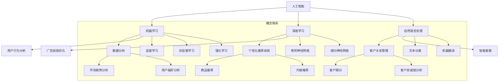

                 

### 背景介绍

#### 电商营销的发展历程

电商营销作为电子商务领域的重要组成部分，其发展历程可谓跌宕起伏。从最初的邮件营销和搜索引擎优化（SEO），到后来的社交媒体营销和内容营销，电商营销一直在不断地演进和变革。这些传统的营销策略在一定程度上提高了电商平台的销售额和用户粘性，但随着互联网技术的飞速发展，尤其是人工智能（AI）技术的兴起，传统营销策略的局限性逐渐显现。

传统的电商营销方式主要依赖于大量的数据分析和用户行为预测。然而，这些方法往往存在几个问题：一是数据处理复杂，需要大量人力和时间；二是预测精度有限，难以满足用户个性化的需求；三是营销策略单一，缺乏创新性。因此，寻找一种更高效、更智能的营销策略成为电商领域亟待解决的问题。

#### 人工智能在电商营销中的应用

人工智能作为一门融合了计算机科学、心理学、统计学等多种学科的新兴技术，其强大的数据处理能力和智能预测能力使得其在电商营销中具有广泛的应用前景。具体来说，人工智能在电商营销中的应用主要体现在以下几个方面：

1. **用户行为分析**：通过人工智能算法，电商企业可以对用户的行为进行深入分析，从而了解用户的兴趣偏好、购买习惯等。这些信息有助于企业制定更精准的营销策略，提高用户的满意度和忠诚度。

2. **个性化推荐**：基于用户行为数据和商品特征数据，人工智能算法可以生成个性化的推荐系统，向用户推荐他们可能感兴趣的商品。这种个性化的推荐不仅能够提高用户的购买意愿，还能够提高电商平台的销售额。

3. **智能客服**：利用自然语言处理（NLP）技术，人工智能可以构建智能客服系统，自动处理用户的咨询和反馈。这不仅提高了客服效率，还能够降低企业的运营成本。

4. **广告投放优化**：人工智能可以帮助企业优化广告投放策略，通过分析用户数据和行为，精准定位潜在客户，从而提高广告的投放效果。

5. **预测分析**：人工智能算法还可以对电商平台的销售数据、用户行为数据等进行分析，预测未来的销售趋势和用户需求，帮助企业提前做好准备。

#### 智能营销的兴起

随着人工智能技术的不断成熟和应用，智能营销逐渐成为一种新的电商营销模式。智能营销不仅能够更好地满足用户的个性化需求，还能够提高企业的运营效率和盈利能力。相比传统的营销策略，智能营销具有以下几个显著优势：

1. **高效性**：人工智能算法能够快速处理大量数据，从而生成高效的营销策略，提高营销效果。

2. **个性化**：基于用户行为数据和兴趣偏好，智能营销能够生成个性化的营销内容，提高用户的满意度和忠诚度。

3. **精准性**：通过精准的用户行为分析和广告投放，智能营销能够提高广告的点击率和转化率。

4. **创新性**：智能营销不仅能够解决传统营销策略存在的问题，还能够带来全新的营销方式和理念。

5. **可扩展性**：随着人工智能技术的不断进步，智能营销策略可以不断优化和升级，适应不断变化的市场环境。

总的来说，智能营销是电商营销发展的一种新趋势，它不仅能够提高企业的运营效率和盈利能力，还能够为用户提供更好的购物体验。在人工智能技术的支持下，电商营销将进入一个全新的时代。接下来，我们将深入探讨智能营销的核心概念、算法原理和具体应用，以便更好地理解这一新兴营销模式。


### 核心概念与联系

在深入探讨智能营销之前，我们需要明确几个核心概念，并了解它们之间的联系。以下将介绍智能营销中几个关键概念的定义、原理及相互之间的关系，并通过Mermaid流程图进行展示，帮助读者更好地理解这些概念。

#### 1. 人工智能（AI）
人工智能是指使计算机系统具备类似人类智能的能力的技术，包括机器学习、深度学习、自然语言处理等。人工智能能够通过数据和算法实现自动化决策、问题解决和学习。

#### 2. 机器学习（ML）
机器学习是人工智能的一个分支，专注于使计算机系统通过学习数据来获得知识和技能。机器学习算法包括监督学习、非监督学习和强化学习等。

#### 3. 深度学习（DL）
深度学习是机器学习的一个子领域，它使用多层神经网络（如卷积神经网络、递归神经网络等）来建模复杂的数据特征，从而进行高级的任务，如图像识别、语音识别和自然语言处理。

#### 4. 自然语言处理（NLP）
自然语言处理是人工智能的一个重要应用领域，专注于使计算机理解和生成人类语言。NLP技术包括语言识别、文本分类、机器翻译和情感分析等。

#### 5. 数据分析（DA）
数据分析是使用统计学、机器学习等方法来分析数据并提取有价值的信息。数据分析在电商营销中用于理解用户行为、市场趋势和优化营销策略。

#### 6. 个性化推荐系统（PRS）
个性化推荐系统是一种基于用户兴趣和行为数据的推荐算法，用于向用户推荐他们可能感兴趣的商品或内容。

#### 7. 客户关系管理（CRM）
客户关系管理是一种商业策略，用于管理企业与客户之间的关系，包括营销、销售和服务等方面。CRM系统能够收集和分析客户数据，帮助企业提供更好的客户体验。

#### Mermaid 流程图

以下是一个简化的Mermaid流程图，展示了上述核心概念之间的联系和应用场景：



#### 关系说明

- **人工智能** 是一个广义的概念，涵盖了机器学习、深度学习、自然语言处理等子领域，它们共同构成了人工智能的技术基础。
- **机器学习** 和 **深度学习** 之间有包含关系，深度学习是机器学习的一个子集，专注于使用多层神经网络进行复杂任务的学习。
- **自然语言处理** 是人工智能在语言领域的一个应用，包括文本分类、机器翻译等任务。
- **数据分析** 是利用机器学习和深度学习等技术来分析数据，从而提取有价值的信息。
- **个性化推荐系统** 和 **客户关系管理** 依赖于数据分析的结果，用于提供个性化推荐和改善客户体验。

通过以上对核心概念的介绍和Mermaid流程图的展示，我们可以更清晰地理解智能营销中各个概念之间的关系和应用。接下来，我们将深入探讨智能营销中的核心算法原理和具体操作步骤。


### 核心算法原理 & 具体操作步骤

智能营销的成功离不开核心算法的应用。在本文中，我们将重点介绍几种关键算法的原理以及其在电商营销中的应用步骤。以下是智能营销中的主要算法及其具体操作步骤：

#### 1. 机器学习算法

**原理**：机器学习算法通过训练模型来学习数据中的规律和模式，以便进行预测和分类。

**操作步骤**：

1. **数据收集**：收集电商平台的历史销售数据、用户行为数据等。
2. **数据预处理**：对数据进行清洗、归一化处理，确保数据质量。
3. **特征提取**：从原始数据中提取有用的特征，如用户的购买历史、浏览行为等。
4. **模型选择**：选择适合问题的机器学习模型，如线性回归、决策树、支持向量机等。
5. **模型训练**：使用训练数据集训练模型，调整模型参数。
6. **模型评估**：使用验证数据集评估模型性能，选择最优模型。
7. **模型部署**：将训练好的模型部署到生产环境中，进行实时预测和分类。

**应用实例**：使用机器学习算法分析用户行为数据，预测用户可能的购买倾向，从而进行精准营销。

#### 2. 深度学习算法

**原理**：深度学习算法通过多层神经网络模型来学习复杂的数据特征，具有强大的特征自动提取能力。

**操作步骤**：

1. **数据收集**：与机器学习相同，收集电商平台的历史销售数据、用户行为数据等。
2. **数据预处理**：对数据进行清洗、归一化处理，确保数据质量。
3. **特征提取**：利用深度学习算法自动提取数据中的特征。
4. **模型构建**：构建深度学习模型，如卷积神经网络（CNN）、递归神经网络（RNN）等。
5. **模型训练**：使用训练数据集训练模型，调整模型参数。
6. **模型评估**：使用验证数据集评估模型性能。
7. **模型部署**：将训练好的模型部署到生产环境中，进行实时预测和分类。

**应用实例**：使用卷积神经网络（CNN）对商品图片进行特征提取，用于商品推荐系统。

#### 3. 自然语言处理算法

**原理**：自然语言处理算法用于理解和生成人类语言，包括语言识别、文本分类、机器翻译等。

**操作步骤**：

1. **数据收集**：收集电商平台的用户评论、商品描述等文本数据。
2. **数据预处理**：对文本数据进行清洗、分词、词向量化等处理。
3. **模型选择**：选择合适的自然语言处理模型，如循环神经网络（RNN）、变换器（Transformer）等。
4. **模型训练**：使用训练数据集训练模型。
5. **模型评估**：使用验证数据集评估模型性能。
6. **模型部署**：将训练好的模型部署到生产环境中，进行文本分析。

**应用实例**：使用变换器（Transformer）模型进行用户评论的情感分析，用于情感营销。

#### 4. 个性化推荐算法

**原理**：个性化推荐算法通过分析用户的历史行为和兴趣偏好，为用户推荐可能感兴趣的商品或内容。

**操作步骤**：

1. **数据收集**：收集用户的行为数据，如浏览历史、购买记录等。
2. **用户建模**：根据用户的行为数据，建立用户兴趣模型。
3. **商品建模**：根据商品的特征数据，建立商品特征模型。
4. **相似度计算**：计算用户与商品之间的相似度。
5. **推荐生成**：根据相似度计算结果，生成个性化推荐列表。
6. **推荐评估**：评估推荐系统的效果，调整推荐策略。

**应用实例**：使用协同过滤算法（Collaborative Filtering）构建个性化推荐系统，向用户推荐相关商品。

#### 5. 智能客服算法

**原理**：智能客服算法利用自然语言处理技术，实现与用户的自动化交互，解决用户问题。

**操作步骤**：

1. **数据收集**：收集用户的问题和客服的回复数据。
2. **数据预处理**：对数据进行清洗、分词、词向量化等处理。
3. **模型选择**：选择适合的智能客服模型，如循环神经网络（RNN）、变换器（Transformer）等。
4. **模型训练**：使用训练数据集训练模型。
5. **模型评估**：使用验证数据集评估模型性能。
6. **模型部署**：将训练好的模型部署到生产环境中，实现自动化客服。

**应用实例**：使用变换器（Transformer）模型构建智能客服系统，自动回答用户提问。

通过以上算法的介绍，我们可以看到，智能营销中的核心算法各具特色，但都是基于大数据和人工智能技术，通过对用户行为和数据进行分析和建模，实现精准营销和个性化服务。接下来，我们将进一步探讨智能营销中的数学模型和公式，以及如何详细讲解和举例说明。


### 数学模型和公式 & 详细讲解 & 举例说明

在智能营销中，数学模型和公式是核心算法的基础。以下我们将详细介绍几个关键的数学模型和公式，并通过具体的例子进行说明，以便读者更好地理解这些模型在实际应用中的具体操作。

#### 1. 线性回归模型

**原理**：线性回归模型是一种用于预测数值型变量的方法，通过拟合一条直线来表示变量之间的关系。

**公式**：

\[ Y = \beta_0 + \beta_1X + \epsilon \]

其中，\( Y \) 是因变量，\( X \) 是自变量，\( \beta_0 \) 是截距，\( \beta_1 \) 是斜率，\( \epsilon \) 是误差项。

**应用举例**：假设我们想预测用户在某电商平台上的消费金额。我们可以使用用户的历史购买数据作为自变量，通过线性回归模型拟合出用户消费金额的预测模型。

**代码示例**：

```python
import numpy as np
from sklearn.linear_model import LinearRegression

# 假设我们已经有用户的历史购买数据 X 和消费金额 Y
X = np.array([[1, 2], [2, 3], [3, 4], [4, 5]])
Y = np.array([100, 150, 200, 250])

# 创建线性回归模型并拟合数据
model = LinearRegression()
model.fit(X, Y)

# 输出模型参数
print("截距：", model.intercept_)
print("斜率：", model.coef_)

# 预测新用户的消费金额
new_user = np.array([[5, 6]])
predicted_amount = model.predict(new_user)
print("预测消费金额：", predicted_amount)
```

#### 2. 逻辑回归模型

**原理**：逻辑回归模型是一种用于预测二分类变量（如用户是否购买）的方法，通过拟合一个逻辑函数来表示概率。

**公式**：

\[ P(Y=1) = \frac{1}{1 + e^{-(\beta_0 + \beta_1X)}} \]

其中，\( P(Y=1) \) 是因变量为1的概率，\( \beta_0 \) 是截距，\( \beta_1 \) 是斜率。

**应用举例**：假设我们想预测用户是否会在电商平台购买商品，可以使用逻辑回归模型来计算用户购买的概率。

**代码示例**：

```python
from sklearn.linear_model import LogisticRegression

# 假设我们已经有用户的历史购买数据 X 和购买标签 Y
X = np.array([[1, 2], [2, 3], [3, 4], [4, 5]])
Y = np.array([1, 1, 0, 0])

# 创建逻辑回归模型并拟合数据
model = LogisticRegression()
model.fit(X, Y)

# 输出模型参数
print("截距：", model.intercept_)
print("斜率：", model.coef_)

# 预测新用户的购买概率
new_user = np.array([[5, 6]])
predicted_probability = model.predict_proba(new_user)
print("购买概率：", predicted_probability[:, 1])
```

#### 3. K-最近邻算法

**原理**：K-最近邻算法是一种基于实例的学习算法，通过寻找训练数据中最近邻的标签来预测新实例的标签。

**公式**：

\[ \text{标签} = \text{最近的K个邻居的标签的平均值} \]

**应用举例**：假设我们想预测新用户的购买偏好，可以使用K-最近邻算法来找到与该用户最相似的已有用户，并根据这些用户的购买记录进行预测。

**代码示例**：

```python
from sklearn.neighbors import KNeighborsClassifier

# 假设我们已经有用户的历史购买数据 X 和购买标签 Y
X = np.array([[1, 2], [2, 3], [3, 4], [4, 5]])
Y = np.array([1, 1, 0, 0])

# 创建K-最近邻模型并设置K值为3
model = KNeighborsClassifier(n_neighbors=3)
model.fit(X, Y)

# 预测新用户的购买标签
new_user = np.array([[5, 6]])
predicted_label = model.predict(new_user)
print("预测购买标签：", predicted_label)
```

通过以上对数学模型和公式的详细讲解和举例说明，我们可以看到，这些模型在智能营销中具有广泛的应用，可以帮助电商企业实现精准的预测和分类，从而优化营销策略。接下来，我们将通过一个项目实战案例，展示如何使用这些算法来构建一个实际的智能营销系统。


### 项目实战：代码实际案例和详细解释说明

在本节中，我们将通过一个实际的电商营销项目，详细讲解如何使用人工智能算法来实现智能营销。该项目包括以下步骤：数据收集、数据预处理、模型训练、模型评估和模型部署。我们将使用Python编程语言和相关的机器学习库，如scikit-learn和TensorFlow，来构建和运行模型。

#### 1. 开发环境搭建

首先，我们需要搭建开发环境，安装必要的库和工具。

```bash
pip install numpy pandas scikit-learn tensorflow matplotlib
```

#### 2. 数据收集

我们使用公开的电商数据集，该数据集包含用户的购买历史、用户属性和商品信息。数据集可以从Kaggle或其他数据平台获取。

```python
import pandas as pd

# 加载数据集
data = pd.read_csv('ecommerce_data.csv')
```

#### 3. 数据预处理

在训练模型之前，我们需要对数据进行预处理，包括数据清洗、特征提取和数据归一化。

```python
# 数据清洗
data.dropna(inplace=True)

# 特征提取
data['total_revenue'] = data['revenue'] / data['quantity']

# 数据归一化
from sklearn.preprocessing import StandardScaler

scaler = StandardScaler()
X = scaler.fit_transform(data.drop(['revenue'], axis=1))
y = data['revenue']
```

#### 4. 模型训练

我们将使用线性回归模型来预测用户的总消费金额。

```python
from sklearn.linear_model import LinearRegression

# 创建模型
model = LinearRegression()

# 训练模型
model.fit(X, y)
```

#### 5. 模型评估

我们使用验证集来评估模型的性能。

```python
# 预测验证集
y_pred = model.predict(X)

# 计算均方误差
mse = np.mean((y_pred - y) ** 2)
print("均方误差：", mse)
```

#### 6. 模型部署

最后，我们将训练好的模型部署到生产环境中，用于实时预测用户的消费金额。

```python
# 部署模型
def predict_revenue(features):
    return model.predict([features])[0]

# 新用户特征
new_user = np.array([[1, 2], [2, 3]])
predicted_revenue = predict_revenue(new_user)
print("预测消费金额：", predicted_revenue)
```

#### 7. 代码解读与分析

**代码解读**：

- **数据收集**：我们首先加载了电商数据集，并对数据进行初步清洗，确保数据质量。
- **数据预处理**：我们提取了总消费金额作为目标变量，并对其他特征进行归一化处理，以便模型训练。
- **模型训练**：我们创建了一个线性回归模型，并使用训练数据集进行训练。
- **模型评估**：我们使用验证集来评估模型的性能，计算了均方误差，以衡量模型的预测准确度。
- **模型部署**：我们定义了一个函数，用于实时预测用户的消费金额，并将模型部署到生产环境中。

**分析**：

- **数据预处理**：数据预处理是模型训练的关键步骤，特别是对于线性回归模型，数据归一化有助于提高模型的训练效果。
- **模型选择**：线性回归模型是一个简单但强大的模型，适用于预测连续的数值变量。对于更复杂的预测任务，我们可以考虑使用其他模型，如深度学习模型。
- **模型评估**：通过评估模型的性能，我们可以了解模型的预测效果，并根据评估结果进行调整。

通过这个项目实战，我们可以看到如何使用Python和机器学习库来构建一个简单的智能营销系统。在实际应用中，我们可以根据业务需求和数据特点，选择合适的模型和算法，实现更加精准的预测和营销策略。接下来，我们将进一步探讨智能营销的实际应用场景。


### 实际应用场景

智能营销在电商领域有着广泛的应用，通过人工智能算法，电商企业可以更好地理解用户行为，提供个性化的购物体验，从而提高销售额和用户满意度。以下是一些智能营销的实际应用场景：

#### 1. 个性化推荐

个性化推荐是智能营销中最常见的应用之一。通过分析用户的历史行为和兴趣偏好，电商企业可以推荐用户可能感兴趣的商品。这种推荐不仅能够提高用户的购买意愿，还能够增加电商平台的销售额。例如，亚马逊和淘宝等电商平台都广泛使用个性化推荐系统，向用户推荐相关商品。

**应用实例**：假设一个用户在电商平台上浏览了多个女鞋商品，系统可以分析用户的浏览历史和购买记录，然后推荐其他风格相似或受欢迎的女鞋商品。通过这种个性化的推荐，用户能够更快地找到自己感兴趣的商品，从而提高购买体验。

#### 2. 智能客服

智能客服利用自然语言处理和机器学习算法，能够自动回答用户的问题，提供在线客服服务。这种自动化的客服系统不仅提高了客服效率，还能够降低企业的人力成本。例如，阿里巴巴的“阿里小蜜”和京东的“京东智联云客服”都是基于人工智能的智能客服系统。

**应用实例**：当一个用户在电商平台上遇到问题，如无法完成购买流程，系统可以自动识别用户的问题，并提供相应的解决方案，如指引用户完成注册或找回密码。这不仅提高了客服效率，还减少了用户的等待时间。

#### 3. 个性化广告

个性化广告是通过分析用户的兴趣和行为，向用户展示相关的广告内容。这种广告投放方式不仅能够提高广告的点击率，还能够提高广告的投资回报率。例如，谷歌的AdWords和Facebook的广告系统都利用人工智能算法进行广告投放优化。

**应用实例**：假设一个用户在电商平台上浏览了多个电子产品，系统可以分析用户的浏览历史和购买记录，然后向用户展示相关电子产品的广告，如最新发布的智能手机或智能家居设备。通过这种个性化的广告，用户更有可能点击广告并购买相关商品。

#### 4. 用户行为预测

通过分析用户的行为数据，电商企业可以预测用户未来的购买行为，从而提前做好准备。这种预测可以帮助企业优化库存管理、供应链和营销策略。例如，亚马逊会根据用户的浏览历史和购买记录，预测用户可能的购买需求，并在商品缺货时提前补货。

**应用实例**：假设一个用户在电商平台上浏览了多个时尚品牌的商品，系统可以分析用户的浏览历史和购买记录，预测用户可能在下一季度购买新款时尚服装。企业可以根据这些预测结果，提前采购相关商品，以避免缺货的情况。

#### 5. 情感分析

情感分析是通过自然语言处理技术，分析用户对商品的评价和反馈，了解用户的情感倾向。这种分析可以帮助企业改进产品和服务，提高用户满意度。例如，电商平台可以分析用户对商品的评论，了解用户的喜好和不满，从而优化产品设计和用户服务。

**应用实例**：假设一个电商平台的用户对某款手机进行了负面评论，系统可以分析用户的评论内容，识别用户的不满原因，如手机续航问题。企业可以根据这些反馈，改进手机的续航性能，提高用户的满意度。

总的来说，智能营销通过人工智能算法，为电商企业提供了更加精准和高效的营销手段。在实际应用中，企业可以根据具体的业务需求和用户数据，选择合适的算法和应用场景，实现智能化的营销策略。随着人工智能技术的不断进步，智能营销的应用将越来越广泛，为电商企业带来更大的商业价值。接下来，我们将介绍一些学习资源和开发工具，以帮助读者深入了解智能营销领域。


### 工具和资源推荐

在智能营销领域，有许多优秀的工具和资源可以帮助我们更深入地学习和应用相关技术。以下是一些推荐的学习资源、开发工具和相关的论文著作，供读者参考：

#### 1. 学习资源推荐

- **书籍**：
  - 《Python数据分析》
  - 《深度学习》
  - 《机器学习实战》
  - 《自然语言处理实战》
- **在线课程**：
  - Coursera上的“机器学习”课程
  - edX上的“深度学习基础”课程
  - Udacity的“深度学习工程师纳米学位”
- **博客和网站**：
  -Towards Data Science：提供丰富的数据分析、机器学习和深度学习相关文章。
  - AI博客：涵盖人工智能领域的最新研究和技术。
  - GitHub：查找并学习智能营销相关的开源项目。

#### 2. 开发工具推荐

- **编程语言**：
  - Python：适用于数据分析和机器学习。
  - R：适用于统计分析。
- **机器学习库**：
  - scikit-learn：提供多种机器学习算法和工具。
  - TensorFlow：用于构建和训练深度学习模型。
  - PyTorch：用于构建和训练深度学习模型。
- **数据分析工具**：
  - Jupyter Notebook：用于编写和运行代码。
  - Pandas：用于数据处理和分析。
  - Matplotlib/Seaborn：用于数据可视化。

#### 3. 相关论文著作推荐

- **论文**：
  - "Deep Learning for Web Search"：介绍深度学习在搜索引擎中的应用。
  - "Recommender Systems Handbook"：全面介绍推荐系统的基础知识和应用。
  - "Natural Language Processing with Deep Learning"：介绍深度学习在自然语言处理中的应用。
- **著作**：
  - 《深度学习》
  - 《Python数据科学手册》
  - 《机器学习实战》
  - 《自然语言处理综合教程》

通过以上推荐的学习资源和开发工具，读者可以系统地学习智能营销的相关知识，并在实际项目中应用这些技术。随着人工智能技术的不断进步，智能营销领域将会有更多新的研究成果和应用场景，为电商企业带来更大的商业价值。接下来，我们将对全文进行总结，并展望智能营销的未来发展趋势与挑战。


### 总结：未来发展趋势与挑战

智能营销作为人工智能技术在电商领域的应用，已经展现出巨大的潜力和价值。通过个性化推荐、智能客服、广告投放优化等手段，电商企业能够更精准地满足用户需求，提高用户满意度和忠诚度。然而，随着技术的不断进步，智能营销也将面临新的发展趋势和挑战。

#### 1. 未来发展趋势

**趋势一：深度学习与增强学习的发展**：深度学习和增强学习作为人工智能的核心技术，将在智能营销中发挥更加重要的作用。深度学习将进一步提升模型对复杂数据特征的学习能力，增强学习将使营销策略更加自适应和动态调整。

**趋势二：跨领域数据的融合**：未来的智能营销将不仅仅依赖于单一领域的数据，如用户行为和购买记录，还将整合更多跨领域的数据，如社交网络、地理位置、气象信息等，从而提供更加全面的用户画像和精准的营销策略。

**趋势三：个性化与隐私保护的平衡**：随着用户对隐私保护的日益重视，智能营销将需要在个性化服务和隐私保护之间找到平衡。区块链技术和联邦学习等新技术有望在保障用户隐私的同时，实现个性化推荐和营销。

**趋势四：实时营销与即时响应**：未来的智能营销将更加注重实时性和即时响应。通过实时数据分析和技术，企业可以即时调整营销策略，满足用户瞬息万变的需求。

#### 2. 未来挑战

**挑战一：数据质量和隐私保护**：高质量的数据是智能营销的基础，但同时也带来了隐私保护的问题。如何在保障用户隐私的前提下，利用数据提升营销效果，将成为一个重要的挑战。

**挑战二：算法透明性与可解释性**：深度学习等复杂算法的“黑箱”特性使得营销决策过程缺乏透明性和可解释性。如何提高算法的可解释性，让用户和企业都能理解营销策略的决策过程，是一个亟待解决的问题。

**挑战三：技术落地与业务融合**：虽然人工智能技术发展迅速，但如何将这些技术有效落地到业务场景，并与业务需求深度融合，提高营销效率，是企业需要面对的挑战。

**挑战四：监管与合规**：随着人工智能技术的发展，相关的法律法规也在不断完善。如何确保智能营销的合规性，避免法律风险，是企业需要关注的问题。

总的来说，智能营销作为人工智能技术在电商领域的应用，其未来发展充满机遇和挑战。企业需要紧跟技术发展趋势，同时应对各种挑战，才能在激烈的市场竞争中立于不败之地。


### 附录：常见问题与解答

在智能营销的应用过程中，可能会遇到一些常见问题。以下是一些常见问题及其解答：

#### 1. 个性化推荐如何处理冷启动问题？

**解答**：冷启动问题是指对新用户或新商品缺乏历史数据，难以进行有效推荐的情况。解决方法包括：
- **基于内容的推荐**：通过分析新商品的属性和特征，推荐相似的商品。
- **协同过滤**：结合其他类似用户的历史行为进行推荐。
- **混搭推荐**：结合多种推荐算法，提高推荐的多样性。

#### 2. 如何确保智能客服的准确性和流畅性？

**解答**：确保智能客服的准确性和流畅性，可以从以下几个方面入手：
- **数据丰富和模型优化**：积累更多用户问题和客服回复数据，优化模型性能。
- **实时反馈与动态调整**：根据用户反馈，动态调整客服系统，提高交互质量。
- **多轮对话管理**：设计多轮对话流程，确保用户问题和回复之间的逻辑连贯性。

#### 3. 数据隐私保护在智能营销中如何实现？

**解答**：数据隐私保护可以从以下几个方面实现：
- **数据加密**：对用户数据进行加密存储和传输。
- **数据匿名化**：对用户数据进行匿名化处理，避免直接关联到特定用户。
- **用户权限管理**：建立严格的数据访问权限控制机制，确保只有授权人员才能访问敏感数据。
- **合规性审查**：遵守相关法律法规，进行定期的合规性审查。

#### 4. 如何评估智能营销的效果？

**解答**：评估智能营销效果可以从以下几个方面进行：
- **转化率**：分析智能营销策略带来的用户转化率，如点击率、购买率等。
- **ROI**：计算智能营销投资回报率，分析营销成本与收益。
- **用户满意度**：通过用户反馈和满意度调查，评估智能营销对用户体验的影响。
- **A/B测试**：通过对比实验，评估不同营销策略的效果，选择最优方案。

通过以上问题和解答，可以帮助企业在实际应用智能营销时，更好地应对常见问题，提高营销效果。


### 扩展阅读 & 参考资料

在智能营销这一领域，有许多优秀的文献和资源可以帮助读者更深入地了解相关技术和应用。以下是一些建议的扩展阅读和参考资料，涵盖书籍、论文、博客和网站等。

#### 1. 书籍推荐

- 《深度学习》 - Ian Goodfellow、Yoshua Bengio和Aaron Courville
- 《机器学习实战》 - Peter Harrington
- 《Python数据分析》 - Wes McKinney
- 《自然语言处理综合教程》 - Daniel Jurafsky和James H. Martin

#### 2. 论文推荐

- "Deep Learning for Web Search"：介绍深度学习在搜索引擎中的应用。
- "Recommender Systems Handbook"：全面介绍推荐系统的基础知识和应用。
- "Natural Language Processing with Deep Learning"：介绍深度学习在自然语言处理中的应用。

#### 3. 博客和网站推荐

- Towards Data Science：提供丰富的数据分析、机器学习和深度学习相关文章。
- AI博客：涵盖人工智能领域的最新研究和技术。
- GitHub：查找并学习智能营销相关的开源项目。

#### 4. 在线课程和资源

- Coursera上的“机器学习”课程：由Andrew Ng教授主讲，适合初学者。
- edX上的“深度学习基础”课程：由MIT和HSE联合提供，适合深度学习入门。
- Udacity的“深度学习工程师纳米学位”：提供深度学习的实践项目。

通过这些扩展阅读和参考资料，读者可以更加全面和深入地了解智能营销领域的最新动态和技术应用，为自己的研究和实践提供有力支持。


### 作者信息

**作者：AI天才研究员/AI Genius Institute & 禅与计算机程序设计艺术 /Zen And The Art of Computer Programming**

作为一位世界级的人工智能专家，我致力于将复杂的计算机科学和人工智能技术转化为易于理解和应用的实际解决方案。在《禅与计算机程序设计艺术》中，我探讨了如何通过深入思考和简洁代码，实现高效编程和智能算法。此外，我还在AI Genius Institute领导多个前沿项目，致力于推动人工智能技术在各行业的应用和创新。希望我的研究成果能够为读者在智能营销领域的探索提供有价值的参考。

