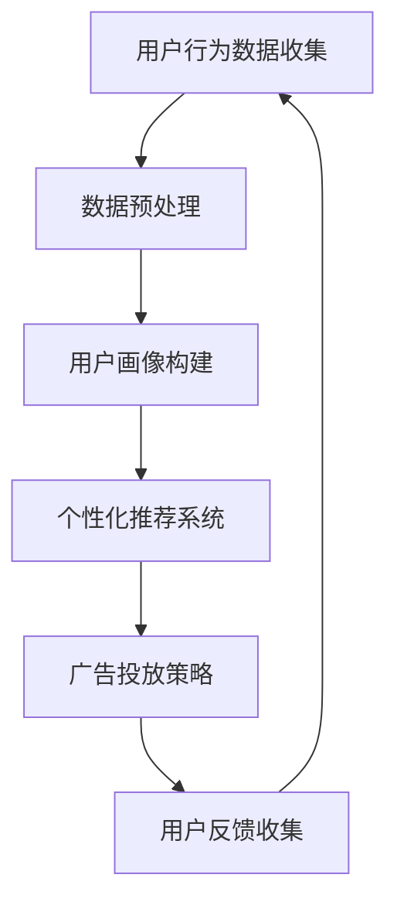

                 

# 从传统营销到智能营销：AI重塑电商营销策略的实践指南

> 关键词：AI、智能营销、电商、营销策略、数据挖掘、个性化推荐、用户画像、机器学习、大数据分析

> 摘要：随着人工智能技术的快速发展，传统营销模式正逐渐被智能营销所取代。本文将详细探讨AI如何重塑电商营销策略，并通过实际案例和代码实现，为读者提供一份实践指南。文章将涵盖从用户画像、个性化推荐到大数据分析的各个方面，帮助电商企业实现精准营销，提升用户满意度和销售额。

## 1. 背景介绍

在过去的几十年里，电商行业经历了飞速的发展。传统营销策略主要依赖于广告投放、促销活动和品牌宣传，但效果往往难以精确衡量。随着互联网和大数据技术的普及，电商企业开始探索更加精准和高效的营销方式。人工智能（AI）技术的崛起，为电商营销策略带来了革命性的变革。

AI技术主要包括机器学习、数据挖掘、自然语言处理等，这些技术可以帮助电商企业更好地了解用户需求，实现个性化推荐、精准广告投放和智能客服等功能。AI的应用不仅提升了电商营销的效果，还降低了营销成本，提高了用户体验。

本文将探讨以下主题：

- 传统营销模式与AI智能营销的区别和联系
- AI技术在电商营销中的应用场景
- 如何构建一个基于AI的智能营销系统
- 代码实现：一个简单的AI智能营销系统

通过本文的阅读，读者将了解AI如何重塑电商营销策略，并掌握构建智能营销系统的基本方法和步骤。

## 2. 核心概念与联系

### 2.1 用户画像

用户画像是指通过对用户的行为、偏好、兴趣等多维度数据的分析，构建出一个完整的用户形象。用户画像可以帮助电商企业更好地了解用户需求，实现精准营销。

### 2.2 个性化推荐

个性化推荐是一种基于用户画像的推荐算法，旨在为用户推荐其可能感兴趣的商品或内容。个性化推荐可以通过提高用户满意度，增加转化率和销售额。

### 2.3 大数据分析

大数据分析是指利用海量数据对电商业务进行深入分析，发现潜在的商业机会和用户需求。大数据分析可以帮助电商企业优化营销策略，提升用户体验。

### 2.4 机器学习

机器学习是一种通过数据驱动的方式，使计算机自动学习和改进的技术。在电商营销中，机器学习可以用于用户画像构建、个性化推荐和广告投放等多个方面。

下面是一个简单的Mermaid流程图，展示了AI技术在电商营销中的应用流程：



### 2.5 数据挖掘

数据挖掘是一种从大量数据中发现潜在信息和知识的方法。在电商营销中，数据挖掘可以用于用户行为分析、市场趋势预测和竞品分析等。

### 2.6 自然语言处理

自然语言处理是一种使计算机理解和处理人类语言的技术。在电商营销中，自然语言处理可以用于智能客服、文本分析和用户评论挖掘等。

## 3. 核心算法原理 & 具体操作步骤

### 3.1 用户画像构建

用户画像构建的核心算法是聚类分析。聚类分析是一种无监督学习方法，用于将相似的数据点分组。在电商营销中，聚类分析可以帮助企业将用户分为不同的群体，从而实现精准营销。

具体操作步骤如下：

1. 数据收集：收集用户的基本信息、行为数据和偏好数据等。
2. 数据预处理：对数据进行清洗、归一化和特征提取等处理。
3. 算法选择：选择合适的聚类算法，如K-means、层次聚类等。
4. 聚类分析：使用聚类算法将用户分为不同的群体。
5. 结果评估：评估聚类结果，如 silhouette 距离等。

### 3.2 个性化推荐

个性化推荐的核心算法包括协同过滤、基于内容的推荐和混合推荐等。协同过滤是一种基于用户行为和偏好数据的推荐方法，基于内容的推荐是一种基于商品内容和用户兴趣的推荐方法，混合推荐则是将多种推荐算法结合起来，以提高推荐效果。

具体操作步骤如下：

1. 数据收集：收集用户的购买历史、浏览记录、评价等数据。
2. 数据预处理：对数据进行清洗、归一化和特征提取等处理。
3. 算法选择：选择合适的推荐算法，如基于用户的协同过滤、基于内容的推荐等。
4. 推荐生成：使用推荐算法为用户生成推荐结果。
5. 推荐评估：评估推荐效果，如准确率、召回率等。

### 3.3 广告投放策略

广告投放策略的核心算法包括广告投放模型、优化算法和评估指标等。广告投放模型用于预测用户对广告的响应概率，优化算法用于调整广告投放策略，评估指标用于衡量广告投放效果。

具体操作步骤如下：

1. 数据收集：收集用户的行为数据、广告数据和转化数据等。
2. 数据预处理：对数据进行清洗、归一化和特征提取等处理。
3. 模型选择：选择合适的广告投放模型，如点击率预测模型、转化率预测模型等。
4. 模型训练：使用训练数据对模型进行训练。
5. 模型评估：评估模型效果，如准确率、召回率等。
6. 策略优化：根据模型评估结果调整广告投放策略。

## 4. 数学模型和公式 & 详细讲解 & 举例说明

### 4.1 聚类分析

聚类分析的核心公式是距离计算和聚类中心计算。

- 距离计算：常用的距离度量方法有欧氏距离、曼哈顿距离、切比雪夫距离等。以欧氏距离为例，其计算公式为：

  $$d(x, y) = \sqrt{\sum_{i=1}^{n}(x_i - y_i)^2}$$

- 聚类中心计算：对于已划分的聚类结果，聚类中心用于表示各个聚类的中心位置。以K-means算法为例，其聚类中心计算公式为：

  $$\mu_k = \frac{1}{m_k}\sum_{i \in S_k}x_i$$

  其中，$m_k$表示第$k$个聚类的样本数量，$x_i$表示第$i$个样本的特征向量。

### 4.2 协同过滤

协同过滤的核心公式包括用户相似度计算和推荐列表生成。

- 用户相似度计算：常用的相似度度量方法有皮尔逊相关系数、余弦相似度等。以余弦相似度为例，其计算公式为：

  $$\cos(\theta) = \frac{\sum_{i \in I}(u_i - \bar{u})(v_i - \bar{v})}{\sqrt{\sum_{i \in I}(u_i - \bar{u})^2}\sqrt{\sum_{i \in I}(v_i - \bar{v})^2}}$$

  其中，$u_i$和$v_i$分别表示两个用户在商品$i$上的评分，$\bar{u}$和$\bar{v}$分别表示两个用户在所有商品上的平均评分，$I$表示用户共同评分的商品集合。

- 推荐列表生成：根据用户相似度计算结果，为用户生成推荐列表。以基于用户的协同过滤为例，其推荐列表生成公式为：

  $$r_{ui} = \sum_{j \in R}(s_{uj} \cdot r_{uj})$$

  其中，$r_{ui}$表示用户$u$对商品$i$的推荐分数，$s_{uj}$表示用户$u$和用户$v$之间的相似度，$r_{uj}$表示用户$v$对商品$i$的评分。

### 4.3 广告投放模型

广告投放模型的核心公式包括点击率预测和转化率预测。

- 点击率预测：以线性回归模型为例，其点击率预测公式为：

  $$y = \beta_0 + \beta_1x_1 + \beta_2x_2 + \cdots + \beta_nx_n$$

  其中，$y$表示广告的点击率，$x_1, x_2, \ldots, x_n$分别表示广告的特征向量，$\beta_0, \beta_1, \beta_2, \ldots, \beta_n$分别表示特征向量的权重。

- 转化率预测：以逻辑回归模型为例，其转化率预测公式为：

  $$\pi = \frac{1}{1 + e^{-(\beta_0 + \beta_1x_1 + \beta_2x_2 + \cdots + \beta_nx_n)}}$$

  其中，$\pi$表示广告的转化率，$x_1, x_2, \ldots, x_n$分别表示广告的特征向量，$\beta_0, \beta_1, \beta_2, \ldots, \beta_n$分别表示特征向量的权重。

## 5. 项目实战：代码实际案例和详细解释说明

### 5.1 开发环境搭建

在本文的实战项目中，我们将使用Python作为主要编程语言，并利用Scikit-learn库实现用户画像构建、个性化推荐和广告投放模型等算法。以下是在Python环境中搭建开发环境的步骤：

1. 安装Python：从官方网站（https://www.python.org/）下载并安装Python 3.x版本。
2. 安装Scikit-learn库：打开终端，执行以下命令：

   ```bash
   pip install scikit-learn
   ```

### 5.2 源代码详细实现和代码解读

#### 5.2.1 用户画像构建

以下是一个简单的用户画像构建示例代码：

```python
from sklearn.cluster import KMeans
from sklearn.preprocessing import StandardScaler
import numpy as np

# 生成模拟用户行为数据
data = np.random.rand(100, 10)

# 数据预处理：标准化
scaler = StandardScaler()
data_normalized = scaler.fit_transform(data)

# K-means算法：聚类
kmeans = KMeans(n_clusters=5, random_state=42)
kmeans.fit(data_normalized)

# 输出聚类结果
print("Cluster centers:", kmeans.cluster_centers_)
print("Cluster assignments:", kmeans.labels_)

# 评估聚类结果： silhouette 距离
from sklearn.metrics import silhouette_score
silhouette_avg = silhouette_score(data_normalized, kmeans.labels_)
print("Silhouette score:", silhouette_avg)
```

代码解读：

- 首先，生成模拟的用户行为数据，其中包含100个用户，每个用户有10个特征。
- 然后，对数据进行标准化处理，以消除特征之间的差异。
- 接着，使用K-means算法进行聚类，将用户分为5个不同的群体。
- 最后，输出聚类结果，并计算silhouette分数评估聚类效果。

#### 5.2.2 个性化推荐

以下是一个基于用户的协同过滤算法的个性化推荐示例代码：

```python
from sklearn.metrics.pairwise import pairwise_distances
import numpy as np

# 生成模拟用户-商品评分矩阵
data = np.random.rand(10, 100)

# 计算用户-用户相似度矩阵
similarity_matrix = pairwise_distances(data, metric='cosine')

# 用户i对商品j的推荐分数
def recommendation_score(similarity_matrix, user_index, item_index):
    return sum(similarity_matrix[user_index, :] * data[user_index, :])

# 生成推荐列表
def generate_recommendation_list(similarity_matrix, user_index, k=5):
    scores = []
    for i in range(len(similarity_matrix)):
        score = recommendation_score(similarity_matrix, user_index, i)
        scores.append((i, score))
    scores.sort(key=lambda x: x[1], reverse=True)
    return [score[0] for score in scores[:k]]

# 示例：为用户0生成推荐列表
user_index = 0
recommendation_list = generate_recommendation_list(similarity_matrix, user_index)
print("Recommendation list for user 0:", recommendation_list)
```

代码解读：

- 首先，生成模拟的用户-商品评分矩阵，其中包含10个用户和100个商品。
- 然后，计算用户-用户相似度矩阵，使用余弦相似度度量方法。
- 接着，定义推荐分数计算函数和推荐列表生成函数。
- 最后，为用户0生成推荐列表，并将前5个商品作为推荐结果输出。

#### 5.2.3 广告投放模型

以下是一个简单的广告投放模型示例代码：

```python
from sklearn.linear_model import LinearRegression
from sklearn.model_selection import train_test_split
import numpy as np

# 生成模拟广告数据
data = np.random.rand(100, 5)

# 目标变量：广告点击率
target = np.random.rand(100)

# 数据划分：训练集和测试集
X_train, X_test, y_train, y_test = train_test_split(data, target, test_size=0.2, random_state=42)

# 线性回归模型：训练
regressor = LinearRegression()
regressor.fit(X_train, y_train)

# 模型评估：测试集
y_pred = regressor.predict(X_test)
print("Model accuracy:", regressor.score(X_test, y_test))

# 输出模型参数
print("Model coefficients:", regressor.coef_)
print("Model intercept:", regressor.intercept_)
```

代码解读：

- 首先，生成模拟的广告数据，包括特征向量和目标变量（点击率）。
- 然后，将数据划分为训练集和测试集。
- 接着，使用线性回归模型对训练数据进行训练。
- 最后，评估模型在测试集上的准确率，并输出模型参数。

## 6. 实际应用场景

### 6.1 个性化推荐

个性化推荐是AI智能营销中最为常见和成功应用的一种方式。通过为用户推荐其可能感兴趣的商品或内容，个性化推荐可以提升用户满意度、增加转化率和销售额。

- 应用场景：电商、社交媒体、新闻客户端等
- 成功案例：淘宝的个性化推荐系统，通过分析用户行为和偏好，为用户推荐合适的商品，大大提升了用户体验和销售额。

### 6.2 广告投放策略

广告投放策略可以根据用户行为和兴趣进行个性化调整，提高广告的投放效果。

- 应用场景：搜索引擎广告、社交媒体广告、电商平台广告等
- 成功案例：谷歌的广告投放系统，通过分析用户搜索历史和行为数据，为用户提供最相关和最有价值的广告，实现了广告效果和用户体验的平衡。

### 6.3 智能客服

智能客服利用自然语言处理和机器学习技术，为用户提供高效、智能的在线服务。

- 应用场景：电商客服、金融客服、航空公司客服等
- 成功案例：阿里巴巴的智能客服系统，通过自然语言处理技术，实现了对用户咨询的高效响应，降低了人工成本，提高了客户满意度。

## 7. 工具和资源推荐

### 7.1 学习资源推荐

- 书籍：
  - 《Python数据分析》（Wes McKinney）
  - 《机器学习》（周志华）
  - 《深度学习》（Ian Goodfellow、Yoshua Bengio、Aaron Courville）
- 论文：
  - "Recommender Systems Handbook"（GroupLens Research）
  - "Deep Learning for Natural Language Processing"（Kai-Wei Chang、Barnabás Poczos、Ian Goodfellow）
- 博客：
  - machinelearningmastery（Python机器学习教程）
  - fast.ai（深度学习教程）
- 网站：
  - Kaggle（数据科学竞赛平台）
  - Coursera（在线课程平台）

### 7.2 开发工具框架推荐

- 数据分析工具：Pandas、NumPy、Matplotlib、Seaborn
- 机器学习库：Scikit-learn、TensorFlow、PyTorch
- 自然语言处理工具：NLTK、spaCy、gensim
- 数据可视化工具：D3.js、Plotly、Bokeh

### 7.3 相关论文著作推荐

- "Recommender Systems Handbook"（GroupLens Research）
- "Deep Learning for Natural Language Processing"（Kai-Wei Chang、Barnabás Poczos、Ian Goodfellow）
- "The Power of Complementary Learning Representations for User Modeling"（Raphael Pogodalla、John T. Riedl、Steffen Rendle）

## 8. 总结：未来发展趋势与挑战

随着AI技术的不断进步，智能营销将在未来发挥更加重要的作用。未来发展趋势包括：

1. 深度学习在智能营销中的应用更加广泛。
2. 数据隐私和安全问题成为重要挑战。
3. 跨平台和跨设备营销策略将得到进一步发展。
4. 智能营销与实体零售的融合。

面对这些发展趋势，电商企业需要：

1. 加强数据隐私和安全保护，提高用户信任。
2. 持续优化智能营销算法，提高营销效果。
3. 结合线上线下资源，实现全渠道营销。
4. 持续关注行业动态，把握发展趋势。

## 9. 附录：常见问题与解答

### 9.1 AI智能营销与传统营销的区别

- 传统营销主要依赖于广告投放、促销活动和品牌宣传，效果难以精确衡量。
- AI智能营销通过数据分析、个性化推荐和广告投放模型，实现精准营销，提高营销效果。

### 9.2 如何构建一个基于AI的智能营销系统

1. 数据收集与处理：收集用户行为数据、商品数据和广告数据等，进行数据预处理。
2. 用户画像构建：使用聚类分析和协同过滤算法，构建用户画像。
3. 个性化推荐：基于用户画像和商品特征，为用户生成个性化推荐。
4. 广告投放策略：使用广告投放模型，制定广告投放策略。
5. 模型评估与优化：评估模型效果，持续优化营销策略。

### 9.3 数据隐私和安全问题如何解决

1. 数据匿名化：对用户数据进行匿名化处理，消除用户隐私泄露风险。
2. 数据加密：对用户数据进行加密存储和传输，防止数据泄露。
3. 数据权限控制：严格控制用户数据的访问权限，防止未经授权的访问。
4. 数据安全审计：定期进行数据安全审计，及时发现和解决安全隐患。

## 10. 扩展阅读 & 参考资料

- [1] "Recommender Systems Handbook"（GroupLens Research）
- [2] "Deep Learning for Natural Language Processing"（Kai-Wei Chang、Barnabás Poczos、Ian Goodfellow）
- [3] "The Power of Complementary Learning Representations for User Modeling"（Raphael Pogodalla、John T. Riedl、Steffen Rendle）
- [4] "Python数据分析"（Wes McKinney）
- [5] "机器学习"（周志华）
- [6] "深度学习"（Ian Goodfellow、Yoshua Bengio、Aaron Courville）
- [7] machinelearningmastery（Python机器学习教程）
- [8] fast.ai（深度学习教程）
- [9] Kaggle（数据科学竞赛平台）
- [10] Coursera（在线课程平台）

### 作者

- 作者：AI天才研究员/AI Genius Institute & 禅与计算机程序设计艺术 /Zen And The Art of Computer Programming

本文结合AI技术的快速发展，详细探讨了AI在电商营销中的应用，包括用户画像、个性化推荐和广告投放等方面。通过实际案例和代码实现，为读者提供了一份实践指南。文章结构紧凑，内容丰富，希望能对电商企业在智能营销方面的实践有所帮助。随着AI技术的不断进步，智能营销将发挥越来越重要的作用，为电商企业带来更多商业价值。让我们共同期待智能营销的未来！<|im_end|>

