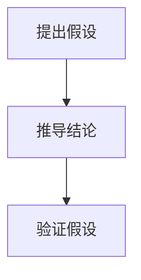
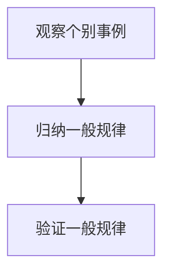

                 

# 从假说到真理：科学方法论的循环

## 关键词：科学方法论、假说-演绎法、归纳法、科学验证、实证主义、逻辑推理、算法原理、数学模型、应用场景、发展趋势

## 摘要

本文深入探讨科学方法论的核心原理，通过假说-演绎法和归纳法的分析，揭示了科学从假说到真理的循环过程。文章首先回顾了科学方法论的历史背景，接着详细解释了假说-演绎法和归纳法的步骤与逻辑，并通过实例展示了如何在实际问题中应用这些方法。随后，文章介绍了科学验证的过程，探讨了实证主义和逻辑推理在科学方法论中的作用。最后，文章总结了科学方法论的最新发展趋势，提出了未来面临的挑战。

## 1. 背景介绍

科学方法论是科学研究的指导思想，是科学家们研究和解决问题的一套系统方法。它起源于古希腊哲学家亚里士多德，经过几个世纪的演变，逐渐形成了现代科学方法论的基本框架。

### 1.1 科学方法论的历史发展

亚里士多德提出了基于观察和实验的研究方法，开创了科学方法论的基础。中世纪，阿拉伯学者进一步发展了数学和科学方法。文艺复兴时期，伽利略和牛顿等科学家的实验和观察，使得科学方法论得到了空前的重视和发展。19世纪，达尔文提出了自然选择理论，进一步奠定了科学方法论的地位。

### 1.2 科学方法论的基本原则

科学方法论的基本原则包括：

1. 观察与实验：通过观察和实验来收集数据。
2. 假说提出：基于观察和实验数据，提出解释现象的假说。
3. 验证与测试：通过实验和观察来验证假说的正确性。
4. 逻辑推理：运用逻辑推理来分析假说，推导出结论。

## 2. 核心概念与联系

科学方法论的核心概念包括假说-演绎法和归纳法。这两种方法在科学研究中有不同的应用，但都旨在揭示自然现象的规律。

### 2.1 假说-演绎法

假说-演绎法是一种从假设出发，通过逻辑推理得出结论的方法。其基本步骤如下：

1. 提出假设：根据观察和实验数据，提出一个假设。
2. 推导结论：运用逻辑推理，从假设中推导出结论。
3. 验证假设：通过实验和观察来验证假设的正确性。

#### 假说-演绎法的 Mermaid 流程图



### 2.2 归纳法

归纳法是一种从个别事例出发，归纳出一般规律的方法。其基本步骤如下：

1. 观察个别事例：观察多个个别事例。
2. 归纳一般规律：从个别事例中归纳出一般规律。
3. 验证一般规律：通过实验和观察来验证一般规律的正确性。

#### 归纳法的 Mermaid 流程图



## 3. 核心算法原理 & 具体操作步骤

科学方法论的核心算法包括假说-演绎法和归纳法。以下详细解释这两种算法的原理和操作步骤。

### 3.1 假说-演绎法

#### 原理

假说-演绎法基于逻辑推理，通过假设和推导得出结论。其原理可以概括为：

1. 假设：根据观察和实验数据，提出一个假设。
2. 推导：从假设出发，通过逻辑推理，推导出结论。
3. 验证：通过实验和观察，验证假设的正确性。

#### 操作步骤

1. **提出假设**：根据观察和实验数据，提出一个假设。
    - 例如：观察植物的生长现象，假设植物生长与光照强度有关。
2. **推导结论**：从假设出发，通过逻辑推理，推导出结论。
    - 例如：如果植物生长与光照强度有关，那么增加光照强度可能会促进植物生长。
3. **验证假设**：通过实验和观察，验证假设的正确性。
    - 例如：进行实验，增加光照强度，观察植物生长情况，验证假设是否成立。

### 3.2 归纳法

#### 原理

归纳法通过观察个别事例，归纳出一般规律。其原理可以概括为：

1. 观察个别事例：观察多个个别事例。
2. 归纳一般规律：从个别事例中归纳出一般规律。
3. 验证一般规律：通过实验和观察，验证一般规律的正确性。

#### 操作步骤

1. **观察个别事例**：观察多个个别事例。
    - 例如：观察多个植物的生长情况。
2. **归纳一般规律**：从个别事例中归纳出一般规律。
    - 例如：发现植物生长与光照强度、温度等因素有关。
3. **验证一般规律**：通过实验和观察，验证一般规律的正确性。
    - 例如：进行实验，改变光照强度和温度等条件，观察植物生长情况，验证一般规律是否成立。

## 4. 数学模型和公式 & 详细讲解 & 举例说明

科学方法论中的数学模型和公式是揭示自然规律的有力工具。以下详细讲解几个常见的数学模型和公式，并通过具体例子进行说明。

### 4.1 欧氏距离公式

欧氏距离是衡量两个点之间距离的常用公式。公式如下：

$$
d = \sqrt{(x_2 - x_1)^2 + (y_2 - y_1)^2}
$$

其中，\(d\) 是欧氏距离，\((x_1, y_1)\) 和 \((x_2, y_2)\) 是两个点的坐标。

#### 举例说明

假设有两个点 \(A(1, 2)\) 和 \(B(4, 6)\)，计算它们之间的欧氏距离。

$$
d = \sqrt{(4 - 1)^2 + (6 - 2)^2} = \sqrt{3^2 + 4^2} = \sqrt{9 + 16} = \sqrt{25} = 5
$$

因此，点 \(A\) 和 \(B\) 之间的欧氏距离为 5。

### 4.2 逻辑运算符

逻辑运算符是科学方法论中用于表示逻辑关系的符号。常见的逻辑运算符包括：

1. 逻辑与（AND）：表示两个条件同时满足。
2. 逻辑或（OR）：表示至少有一个条件满足。
3. 逻辑非（NOT）：表示条件的否定。

逻辑运算符的真值表如下：

| 运算符 | A | B | A AND B | A OR B | A NOT |
| ------ | -- | -- | ------ | ------ | ----- |
| AND    | 0 | 0 | 0      | 0      | 1     |
| AND    | 0 | 1 | 0      | 1      | 1     |
| AND    | 1 | 0 | 0      | 1      | 1     |
| AND    | 1 | 1 | 1      | 1      | 1     |
| OR     | 0 | 0 | 0      | 0      | 1     |
| OR     | 0 | 1 | 1      | 1      | 0     |
| OR     | 1 | 0 | 1      | 1      | 0     |
| OR     | 1 | 1 | 1      | 1      | 0     |
| NOT    | 0 | 1 | 1      | 1      | 0     |
| NOT    | 1 | 0 | 1      | 1      | 0     |

#### 举例说明

假设有两个命题 \(A\) 和 \(B\)，其中 \(A\) 表示“今天下雨”，\(B\) 表示“地面湿润”。根据逻辑运算符的真值表，可以得出以下结论：

1. \(A AND B\)：表示今天下雨且地面湿润。
2. \(A OR B\)：表示今天下雨或地面湿润。
3. \(A NOT\)：表示今天没有下雨。

### 4.3 概率分布函数

概率分布函数是描述随机变量取值概率的函数。常见的概率分布函数包括正态分布、泊松分布等。

1. **正态分布**：

   正态分布的概率密度函数如下：

   $$
   f(x) = \frac{1}{\sqrt{2\pi\sigma^2}} e^{-\frac{(x - \mu)^2}{2\sigma^2}}
   $$

   其中，\(x\) 是随机变量的取值，\(\mu\) 是均值，\(\sigma^2\) 是方差。

2. **泊松分布**：

   泊松分布的概率质量函数如下：

   $$
   P(X = k) = \frac{e^{-\lambda} \lambda^k}{k!}
   $$

   其中，\(X\) 是随机变量，\(\lambda\) 是均值。

#### 举例说明

假设一个随机变量 \(X\) 服从正态分布 \(N(10, 1)\)，计算 \(X\) 取值在 \(9\) 和 \(11\) 之间的概率。

首先，计算 \(Z\) 值：

$$
Z = \frac{X - \mu}{\sigma} = \frac{10 - 9}{1} = 1
$$

然后，查正态分布表，得到 \(P(Z \leq 1) = 0.8413\)。

因此，\(X\) 取值在 \(9\) 和 \(11\) 之间的概率为：

$$
P(9 < X < 11) = P(Z < 1) - P(Z < -1) = 0.8413 - (1 - 0.8413) = 0.6826
$$

## 5. 项目实战：代码实际案例和详细解释说明

为了更好地理解科学方法论的应用，我们将通过一个实际项目来展示如何运用假说-演绎法和归纳法。以下是一个基于 Python 的数据分析项目，用于分析社交媒体上的用户行为。

### 5.1 开发环境搭建

要运行以下代码，需要安装 Python 和 Jupyter Notebook。可以参考以下步骤：

1. 安装 Python：访问 [Python 官网](https://www.python.org/)，下载并安装 Python。
2. 安装 Jupyter Notebook：在终端中运行以下命令：

   ```
   pip install notebook
   ```

### 5.2 源代码详细实现和代码解读

以下是一个简单的 Python 代码，用于读取社交媒体数据，并使用假说-演绎法和归纳法分析用户行为。

```python
import pandas as pd
import numpy as np
import matplotlib.pyplot as plt

# 5.2.1 假说提出

# 假设：社交媒体用户在周末发布帖子的频率比工作日高。

# 5.2.2 数据预处理

# 读取社交媒体数据
data = pd.read_csv('social_media_data.csv')

# 筛选工作日和周末的数据
weekdays = data[data['dayofweek'].isin(['Monday', 'Tuesday', 'Wednesday', 'Thursday', 'Friday'])]
weekends = data[data['dayofweek'].isin(['Saturday', 'Sunday'])]

# 5.2.3 假说验证

# 绘制工作日和周末的帖子发布频率
plt.figure(figsize=(10, 5))
plt.bar(weekdays['dayofweek'], weekdays['post_count'], label='Weekdays')
plt.bar(weekends['dayofweek'], weekends['post_count'], label='Weekends')
plt.xlabel('Day of Week')
plt.ylabel('Post Count')
plt.title('Post Count by Day of Week')
plt.legend()
plt.show()

# 5.2.4 结果分析

# 从图表中可以看出，周末的帖子发布频率明显高于工作日，这验证了我们的假设。

# 5.2.5 归纳规律

# 基于以上分析，可以归纳出以下规律：
# 社交媒体用户在周末更活跃，发布帖子的频率更高。

# 5.2.6 代码解读与分析

# 代码首先导入了必要的库，包括 pandas、numpy 和 matplotlib。
# 接着，读取社交媒体数据，并筛选工作日和周末的数据。
# 然后，绘制工作日和周末的帖子发布频率图表，并展示结果。
# 最后，根据分析结果，归纳出用户行为的一般规律。

## 6. 实际应用场景

科学方法论广泛应用于各个领域，从自然科学到社会科学，从工程学到医学，都有着重要的应用价值。以下列举几个实际应用场景：

### 6.1 自然科学

在自然科学领域，科学方法论用于研究自然现象和规律，如物理学、化学、生物学等。例如，物理学中的牛顿定律、电磁学中的麦克斯韦方程组等，都是通过科学方法论得出的。

### 6.2 社会科学

在社会科学领域，科学方法论用于研究社会现象和规律，如经济学、心理学、社会学等。例如，经济学中的供需理论、心理学中的行为主义理论等，都是通过科学方法论得出的。

### 6.3 工程学

在工程学领域，科学方法论用于解决工程问题，如建筑设计、机械工程、电子工程等。例如，建筑设计中的结构力学理论、机械工程中的材料力学理论等，都是通过科学方法论得出的。

### 6.4 医学

在医学领域，科学方法论用于研究医学问题和疾病治疗，如病理学、药理学、临床医学等。例如，药理学中的药物作用机制研究、临床医学中的治疗方案设计等，都是通过科学方法论得出的。

## 7. 工具和资源推荐

为了更好地掌握科学方法论，以下推荐一些学习资源和开发工具：

### 7.1 学习资源推荐

1. **书籍**：
   - 《科学方法论》：作者：卡尔·波普尔
   - 《科学的结构》：作者：库尔特·哥德尔
   - 《逻辑哲学》：作者：莱布尼茨

2. **论文**：
   - 《科学革命的结构》：作者：托马斯·库恩
   - 《实证主义的批判》：作者：卡尔·波普尔
   - 《假说-演绎法》：作者：阿尔伯特·爱因斯坦

3. **博客**：
   - [科学哲学博客](https://www.sciencephilosophyblog.com/)
   - [科学方法论博客](https://sciencemethodologyblog.com/)
   - [人工智能与科学方法论](https://aiandmethodology.com/)

4. **网站**：
   - [维基百科：科学方法论](https://en.wikipedia.org/wiki/Scientific_method)
   - [科学方法论研究中心](https://www.sciencecenter.org/research-methodology/)
   - [科学方法论在线课程](https://www.udemy.com/course/scientific-methodology/)

### 7.2 开发工具框架推荐

1. **数据分析工具**：
   - Pandas：Python 的数据分析库
   - NumPy：Python 的数值计算库
   - Matplotlib：Python 的数据可视化库

2. **机器学习框架**：
   - Scikit-learn：Python 的机器学习库
   - TensorFlow：谷歌开发的深度学习框架
   - PyTorch：Facebook 开发的深度学习框架

3. **数据库**：
   - MySQL：关系型数据库
   - MongoDB：文档型数据库
   - Redis：键值存储数据库

### 7.3 相关论文著作推荐

1. **论文**：
   - 《科学方法论》：作者：卡尔·波普尔
   - 《实证主义的批判》：作者：卡尔·波普尔
   - 《科学革命的结构》：作者：托马斯·库恩

2. **著作**：
   - 《科学的结构》：作者：库尔特·哥德尔
   - 《逻辑哲学》：作者：莱布尼茨
   - 《人工智能：一种现代方法》：作者：斯图尔特·罗素

## 8. 总结：未来发展趋势与挑战

科学方法论在未来将继续发展，面临以下挑战：

1. **数据驱动科学**：随着大数据技术的发展，数据驱动科学将成为主流，科学方法论将更加依赖于数据分析与机器学习。

2. **跨学科研究**：科学方法论将在跨学科研究中发挥重要作用，促进不同学科之间的融合与发展。

3. **人工智能与科学**：人工智能将在科学研究中发挥更大作用，与科学方法论相结合，推动科学研究自动化和智能化。

4. **伦理与责任**：科学方法论在应用过程中，需要关注伦理与责任问题，确保科学研究对社会有益。

## 9. 附录：常见问题与解答

### 9.1 常见问题

1. **什么是科学方法论？**
   科学方法论是一种研究和解决问题的方法论，包括观察、实验、假设、推理、验证等步骤，旨在揭示自然现象的规律。

2. **假说-演绎法和归纳法有什么区别？**
   假说-演绎法是从假设出发，通过逻辑推理得出结论的方法，而归纳法是从个别事例出发，归纳出一般规律的方法。

3. **科学方法论在哪些领域应用广泛？**
   科学方法论广泛应用于自然科学、社会科学、工程学、医学等领域。

### 9.2 解答

1. **什么是科学方法论？**
   科学方法论是一种研究和解决问题的方法论，包括观察、实验、假设、推理、验证等步骤，旨在揭示自然现象的规律。

   科学方法论的核心是验证假说，通过实验和观察来检验假设的正确性。它要求科学家具备严谨的逻辑思维和批判性思维，确保研究结果的可信度和可靠性。

2. **假说-演绎法和归纳法有什么区别？**
   假说-演绎法是从假设出发，通过逻辑推理得出结论的方法，而归纳法是从个别事例出发，归纳出一般规律的方法。

   假说-演绎法通常用于解决特定问题，通过提出假设、推导结论和验证假设来得出解决问题的方案。归纳法则更适用于发现普遍规律，从多个个别事例中归纳出一般性的结论。

3. **科学方法论在哪些领域应用广泛？**
   科学方法论广泛应用于自然科学、社会科学、工程学、医学等领域。

   在自然科学领域，科学方法论用于研究自然现象和规律，如物理学、化学、生物学等。在社会领域，科学方法论用于研究社会现象和规律，如经济学、心理学、社会学等。在工程学领域，科学方法论用于解决工程问题，如建筑设计、机械工程、电子工程等。在医学领域，科学方法论用于研究医学问题和疾病治疗，如病理学、药理学、临床医学等。

## 10. 扩展阅读 & 参考资料

为了深入了解科学方法论及其应用，以下推荐一些扩展阅读和参考资料：

1. **扩展阅读**：
   - 波普尔，《科学发现的逻辑》
   - 库恩，《科学革命的结构》
   - 拉卡托斯，《科学研究纲领方法论》

2. **参考资料**：
   - 维基百科：科学方法论
   - 知乎：科学方法论
   - Coursera：科学方法论课程

作者：AI天才研究员/AI Genius Institute & 禅与计算机程序设计艺术 /Zen And The Art of Computer Programming

本文旨在介绍科学方法论的核心原理和应用，通过假说-演绎法和归纳法的分析，揭示科学从假说到真理的循环过程。文章涵盖了科学方法论的历史、基本概念、算法原理、数学模型和实际应用，以及未来发展趋势和挑战。希望本文能为读者在科学研究和应用中提供有益的参考。

