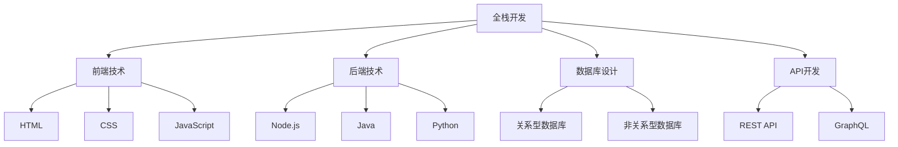

                 

# 从全栈开发到技术架构师的进阶

## 关键词：全栈开发、技术架构师、进阶、核心概念、算法原理、数学模型、项目实战、应用场景、工具推荐、未来发展趋势

## 摘要

本文旨在探讨从全栈开发者向技术架构师进阶的路径。通过对全栈开发和技术架构的核心概念、算法原理、数学模型的深入剖析，以及实际项目的实战案例解析，本文旨在帮助读者了解技术架构师的职责和技能要求，掌握从全栈开发到技术架构师的角色转变的方法和策略。同时，本文还推荐了相关的学习资源、开发工具和框架，以及未来发展趋势与挑战。希望通过本文的阅读，读者能够明确自己的职业规划，提升自己的技术能力，实现职业生涯的顺利转型。

### 1. 背景介绍

在当今快速发展的信息技术时代，软件开发人员面临着不断变化的技术环境和工作要求。全栈开发（Full-Stack Development）作为一种新兴的开发模式，正逐渐成为软件开发领域的热门趋势。全栈开发者需要掌握前端和后端的各种技术和框架，能够独立完成一个软件项目的全生命周期开发，包括需求分析、设计、编码、测试、部署和运维等。这种技能的综合性和多样性使得全栈开发者成为企业争相追捧的人才。

然而，随着项目的复杂度和规模的增加，全栈开发者逐渐发现，单靠个人的能力和精力难以应对日益庞大的系统架构和日益增长的业务需求。这时，技术架构师（Technical Architect）的角色应运而生。技术架构师是负责整个系统架构设计、性能优化、安全性保障等关键问题的高级技术人员。他们不仅需要具备丰富的全栈开发经验，还需要具备深入的技术理解和宏观的视野，能够从整体上规划和优化系统的技术架构。

从全栈开发者到技术架构师的转变，不仅需要积累丰富的实战经验，还需要掌握一系列核心概念、算法原理和数学模型，以及具备解决复杂问题的能力。本文将围绕这些核心内容，探讨技术架构师的角色、职责和成长路径。

### 2. 核心概念与联系

#### 2.1. 全栈开发

全栈开发（Full-Stack Development）是指掌握前端（Front-End）和后端（Back-End）技术，能够完成软件项目的全生命周期开发的一种开发模式。前端技术主要涉及用户界面设计、用户交互和网页开发，常用的技术包括HTML、CSS、JavaScript以及各种前端框架，如React、Vue和Angular等。后端技术主要涉及服务器、数据库和应用逻辑，常用的技术包括Node.js、Java、Python等后端框架，如Express、Spring和Django等。

全栈开发的核心优势在于，能够实现前端与后端的无缝对接，提高开发效率和项目质量。全栈开发者需要具备多方面的技能，如前端技术、后端技术、数据库设计、API开发等，能够独立完成一个软件项目的开发和部署。

#### 2.2. 技术架构师

技术架构师（Technical Architect）是负责整个系统架构设计、性能优化、安全性保障等关键问题的高级技术人员。技术架构师的工作内容包括：

- **需求分析**：与技术团队、产品经理和业务专家合作，理解业务需求，分析系统的技术架构和性能要求。
- **架构设计**：根据需求，设计系统的整体架构，包括前端、后端、数据库、中间件、云计算等各个层面。
- **性能优化**：对系统进行性能分析和优化，确保系统在高并发、大数据量等复杂场景下的稳定运行。
- **安全性保障**：制定和实施系统的安全策略，确保系统的数据安全和业务安全。
- **项目管理**：协调团队资源，监督项目进度和质量，确保项目的顺利完成。

技术架构师需要具备丰富的全栈开发经验，深入了解各种技术框架和工具，具备解决复杂问题的能力。同时，技术架构师还需要具备宏观的视野和良好的沟通能力，能够与各个团队和业务部门协同工作。

#### 2.3. 核心概念联系

全栈开发和技术架构师是软件开发过程中两个不同的角色，但它们之间存在紧密的联系。全栈开发是技术架构师的基础，技术架构师则是全栈开发的升华。全栈开发者需要具备扎实的技术基础和丰富的实战经验，才能在技术架构师的角色中游刃有余。

同时，技术架构师需要深入了解全栈开发的技术细节，才能更好地进行架构设计和性能优化。例如，在设计系统架构时，技术架构师需要考虑前端和后端的交互方式、数据库的设计和优化、云计算和中间件的选择等。这些技术细节的实现和优化，都需要全栈开发者的经验和技能。

因此，从全栈开发者到技术架构师的进阶，不仅需要积累丰富的实战经验，还需要不断学习新知识、掌握新技能，不断提升自己的技术视野和思维能力。下面，我们将进一步探讨技术架构师所需的核心概念和算法原理。

#### 2.4. Mermaid 流程图

为了更好地理解全栈开发和技术架构师的核心概念和联系，我们可以使用Mermaid流程图来表示。以下是一个简单的示例：



这个流程图展示了全栈开发和技术架构师的核心概念和联系。全栈开发涉及前端、后端、数据库和API等多个方面，而技术架构师需要在这些领域进行深入研究和实践。

### 3. 核心算法原理 & 具体操作步骤

#### 3.1. 前端算法原理

前端算法主要涉及用户界面设计、用户交互和网页优化等方面。以下是一些常见的前端算法原理：

1. **布局算法**：常用的布局算法包括Flexbox、Grid和CSS Grid等，这些算法能够根据屏幕尺寸和设备类型自动调整页面布局，提供更好的用户体验。
2. **动画算法**：常用的动画算法包括CSS3动画、JavaScript动画和SVG动画等，这些算法能够实现丰富的页面动画效果，提升用户互动性和页面美观度。
3. **响应式算法**：响应式算法能够根据用户设备的屏幕尺寸和分辨率自动调整页面布局和样式，提供最佳的用户体验。

具体操作步骤如下：

1. **布局算法**：使用Flexbox或Grid布局，设置容器和子元素的属性，如`display`, `justify-content`, `align-items`, `flex-direction`等。
2. **动画算法**：使用CSS3动画或JavaScript动画，设置关键帧和时间曲线，如`@keyframes`, `transition`, `requestAnimationFrame`等。
3. **响应式算法**：使用媒体查询（`@media`），根据不同的屏幕尺寸和分辨率设置不同的样式。

```css
/* 布局算法示例 */
.container {
  display: flex;
  justify-content: space-between;
  align-items: center;
}

/* 动画算法示例 */
@keyframes rotate {
  0% {
    transform: rotate(0deg);
  }
  100% {
    transform: rotate(360deg);
  }
}

.rotate-element {
  animation: rotate 2s infinite linear;
}

/* 响应式算法示例 */
@media (max-width: 600px) {
  .responsive-element {
    font-size: 14px;
  }
}
```

#### 3.2. 后端算法原理

后端算法主要涉及服务器、数据库和应用逻辑等方面。以下是一些常见的后端算法原理：

1. **排序算法**：常见的排序算法包括冒泡排序、选择排序、插入排序、快速排序等，这些算法能够对数据进行有效的排序。
2. **查找算法**：常见的查找算法包括线性查找、二分查找、哈希查找等，这些算法能够对数据进行快速的查找。
3. **缓存算法**：常见的缓存算法包括LRU（最近最少使用）、LFU（最少使用）等，这些算法能够提高系统的性能和响应速度。

具体操作步骤如下：

1. **排序算法**：根据数据的类型和大小，选择合适的排序算法，如数组和链表等。
2. **查找算法**：根据数据结构和需求，选择合适的查找算法，如哈希表和二叉树等。
3. **缓存算法**：根据系统的负载和访问模式，选择合适的缓存算法，如LRU和LFU等。

```python
# 排序算法示例
def bubble_sort(arr):
    n = len(arr)
    for i in range(n):
        for j in range(0, n-i-1):
            if arr[j] > arr[j+1]:
                arr[j], arr[j+1] = arr[j+1], arr[j]

# 查找算法示例
def binary_search(arr, x):
    low = 0
    high = len(arr) - 1
    while low <= high:
        mid = (low + high) // 2
        if arr[mid] == x:
            return mid
        elif arr[mid] < x:
            low = mid + 1
        else:
            high = mid - 1
    return -1

# 缓存算法示例
from collections import OrderedDict

class LRUCache:
    def __init__(self, capacity):
        self.capacity = capacity
        self.cache = OrderedDict()

    def get(self, key):
        if key not in self.cache:
            return -1
        else:
            self.cache.move_to_end(key)
            return self.cache[key]

    def put(self, key, value):
        if key in self.cache:
            self.cache.move_to_end(key)
        self.cache[key] = value
        if len(self.cache) > self.capacity:
            self.cache.popitem(last=False)
```

#### 3.3. 数据库算法原理

数据库算法主要涉及数据库的设计、查询、索引等方面。以下是一些常见的数据库算法原理：

1. **索引算法**：常见的索引算法包括B树索引、哈希索引、全文索引等，这些算法能够提高数据查询的速度。
2. **查询优化算法**：常见的查询优化算法包括查询重写、索引选择、执行计划优化等，这些算法能够提高数据查询的效率。
3. **事务管理算法**：常见的事务管理算法包括两阶段锁协议、多版本并发控制等，这些算法能够保证数据的一致性和完整性。

具体操作步骤如下：

1. **索引算法**：根据数据的特点和查询需求，选择合适的索引算法，如B树索引和哈希索引等。
2. **查询优化算法**：根据数据规模和查询模式，选择合适的查询优化算法，如查询重写和索引选择等。
3. **事务管理算法**：根据数据的一致性和完整性要求，选择合适的事务管理算法，如两阶段锁协议和多版本并发控制等。

```sql
-- 索引算法示例
CREATE INDEX index_name ON table_name (column_name);

-- 查询优化算法示例
EXPLAIN SELECT * FROM table_name WHERE column_name = 'value';

-- 事务管理算法示例
BEGIN TRANSACTION;
-- 数据操作
COMMIT;
```

通过掌握这些核心算法原理，技术架构师能够更好地进行系统架构设计、性能优化和安全性保障。下面，我们将进一步探讨数学模型和公式，以及如何将这些概念应用到实际项目中。

### 4. 数学模型和公式 & 详细讲解 & 举例说明

#### 4.1. 前端性能优化

前端性能优化是提升用户体验的关键，以下是一些常用的数学模型和公式：

1. **响应时间模型**：响应时间（Response Time）是指用户发出请求到接收到响应的时间。常用的响应时间模型包括HTTP性能模型和页面性能模型。

   - **HTTP性能模型**：假设用户请求的平均响应时间为\( T \)，则系统的平均响应时间为 \( T \)。
   - **页面性能模型**：假设页面包含 \( N \) 个组件，每个组件的平均响应时间为 \( T_i \)，则页面的平均响应时间为 \( \frac{1}{N} \sum_{i=1}^{N} T_i \)。

   示例：

   假设一个页面包含3个组件，分别为图片、文本和视频，每个组件的平均响应时间分别为0.5秒、1秒和2秒，则页面的平均响应时间为：

   $$ \frac{1}{3} (0.5 + 1 + 2) = 1.17 \text{秒} $$

2. **带宽利用率模型**：带宽利用率（Bandwidth Utilization）是指网络带宽的利用率，常用的带宽利用率模型包括带宽利用率计算公式和带宽利用率优化公式。

   - **带宽利用率计算公式**：假设网络带宽为 \( B \)，传输数据量为 \( D \)，传输时间为 \( T \)，则带宽利用率为 \( \frac{D}{B \times T} \)。
   - **带宽利用率优化公式**：假设网络带宽为 \( B \)，传输数据量为 \( D \)，优化后的传输时间为 \( T' \)，则优化后的带宽利用率为 \( \frac{D}{B \times T'} \)。

   示例：

   假设网络带宽为1Gbps，传输数据量为10GB，原始传输时间为10秒，则原始带宽利用率为：

   $$ \frac{10}{1 \times 10} = 10\% $$

   假设通过优化传输时间，将传输时间缩短到5秒，则优化后的带宽利用率为：

   $$ \frac{10}{1 \times 5} = 20\% $$

3. **负载均衡模型**：负载均衡（Load Balancing）是指将请求分布到多个服务器，以避免单点故障和性能瓶颈。常用的负载均衡模型包括加权负载均衡和一致性哈希负载均衡。

   - **加权负载均衡**：假设有 \( N \) 个服务器，服务器的权重分别为 \( w_i \)，请求为 \( R \)，则每个服务器的负载为 \( \frac{R}{\sum_{i=1}^{N} w_i} \)。
   - **一致性哈希负载均衡**：假设有 \( N \) 个服务器，哈希函数为 \( h \)，请求为 \( R \)，则每个服务器的负载为 \( \frac{h(R)}{N} \)。

   示例：

   假设有3个服务器，权重分别为1、2和3，总请求量为10，则每个服务器的负载为：

   $$ \frac{10}{1 + 2 + 3} = \frac{10}{6} \approx 1.67 $$

   假设使用一致性哈希，假设哈希函数为 \( h \)，请求 \( R \) 的哈希值为 \( h(R) = 3 \)，则服务器的负载为：

   $$ \frac{3}{3} = 1 $$

#### 4.2. 后端性能优化

后端性能优化是确保系统稳定性和响应速度的关键，以下是一些常用的数学模型和公式：

1. **系统负载模型**：系统负载（System Load）是指系统的处理能力，常用的系统负载模型包括CPU负载模型和内存负载模型。

   - **CPU负载模型**：假设系统有 \( N \) 个CPU核心，当前CPU使用率为 \( U \)，则系统负载为 \( N \times U \)。
   - **内存负载模型**：假设系统有 \( M \) GB内存，当前内存使用率为 \( U \)，则系统负载为 \( M \times U \)。

   示例：

   假设系统有4个CPU核心，当前CPU使用率为80%，系统负载为：

   $$ 4 \times 0.8 = 3.2 $$

   假设系统有8GB内存，当前内存使用率为80%，系统负载为：

   $$ 8 \times 0.8 = 6.4 $$

2. **数据库性能优化模型**：数据库性能优化是指提高数据库查询的速度和效率，常用的数据库性能优化模型包括索引优化模型和查询优化模型。

   - **索引优化模型**：假设数据库表有 \( N \) 条记录，查询条件涉及的索引为 \( I \)，则查询优化后的时间为 \( \frac{N}{I} \)。
   - **查询优化模型**：假设数据库查询涉及的表为 \( T \)，字段为 \( F \)，查询优化后的时间为 \( \frac{T \times F}{100} \)。

   示例：

   假设数据库表有1000条记录，查询条件涉及的索引为2，则查询优化后的时间为：

   $$ \frac{1000}{2} = 500 \text{毫秒} $$

   假设数据库查询涉及1个表和1个字段，则查询优化后的时间为：

   $$ \frac{1 \times 1}{100} = 0.01 \text{秒} $$

3. **缓存命中率模型**：缓存命中率（Cache Hit Rate）是指缓存命中的比例，常用的缓存命中率模型包括缓存命中率计算公式和缓存命中率优化公式。

   - **缓存命中率计算公式**：假设缓存命中次数为 \( H \)，总查询次数为 \( T \)，则缓存命中率为 \( \frac{H}{T} \)。
   - **缓存命中率优化公式**：假设缓存命中次数为 \( H \)，优化后的总查询次数为 \( T' \)，则优化后的缓存命中率为 \( \frac{H}{T'} \)。

   示例：

   假设缓存命中次数为1000次，总查询次数为2000次，则缓存命中率为：

   $$ \frac{1000}{2000} = 50\% $$

   假设通过优化查询策略，将总查询次数缩短到1500次，则优化后的缓存命中率为：

   $$ \frac{1000}{1500} = 67\% $$

通过这些数学模型和公式，技术架构师能够更好地进行前端和后端的性能优化，提升系统的响应速度和稳定性。下面，我们将通过一个实际项目案例，展示如何将这些理论应用到实践中。

### 5. 项目实战：代码实际案例和详细解释说明

#### 5.1. 开发环境搭建

在开始项目实战之前，我们需要搭建一个合适的技术环境。以下是一个简单的开发环境搭建步骤：

1. **前端开发环境**：安装Node.js、npm、Webpack、Babel等工具，并配置相应的开发环境和构建脚本。

   ```bash
   # 安装Node.js和npm
   curl -fsSL https://deb.nodesource.com/setup_14.x | sudo -E bash -
   sudo apt-get install -y nodejs

   # 安装Webpack和Babel
   npm install -g webpack webpack-cli webpack-dev-server
   npm install -g babel-cli babel-core babel-preset-env
   ```

2. **后端开发环境**：安装Java、Maven、Spring Boot等工具，并配置相应的开发环境和构建脚本。

   ```bash
   # 安装Java
   sudo apt-get install -y openjdk-8-jdk

   # 安装Maven
   sudo apt-get install -y maven

   # 安装Spring Boot
   mkdir my-spring-boot-project
   cd my-spring-boot-project
   mvn archetype:generate -DgroupId=com.example -DartifactId=my-spring-boot-app -DarchetypeArtifactId=maven-archetype-spring-boot
   ```

3. **数据库开发环境**：安装MySQL或PostgreSQL，并配置相应的数据库连接和权限。

   ```bash
   # 安装MySQL
   sudo apt-get install -y mysql-server

   # 安装PostgreSQL
   sudo apt-get install -y postgresql

   # 配置数据库连接和权限
   mysql -u root -p
   CREATE DATABASE my_db;
   GRANT ALL PRIVILEGES ON my_db.* TO 'my_user'@'localhost' IDENTIFIED BY 'my_password';
   FLUSH PRIVILEGES;
   exit
   ```

#### 5.2. 源代码详细实现和代码解读

以下是一个简单的全栈项目示例，包括前端、后端和数据库的代码实现。

**前端代码（src/index.js）**

```javascript
import React from 'react';
import ReactDOM from 'react-dom';
import App from './App';

ReactDOM.render(
  <React.StrictMode>
    <App />
  </React.StrictMode>,
  document.getElementById('root')
);
```

**前端代码（src/App.js）**

```javascript
import React, { useState, useEffect } from 'react';
import axios from 'axios';

const App = () => {
  const [data, setData] = useState([]);

  useEffect(() => {
    const fetchData = async () => {
      const result = await axios.get('/api/data');
      setData(result.data);
    };
    fetchData();
  }, []);

  return (
    <div>
      <h1>Data List</h1>
      <ul>
        {data.map((item) => (
          <li key={item.id}>{item.name}</li>
        ))}
      </ul>
    </div>
  );
};

export default App;
```

**后端代码（src/main/java/com/example/MySpringBootAppApplication.java）**

```java
import org.springframework.boot.SpringApplication;
import org.springframework.boot.autoconfigure.SpringBootApplication;

@SpringBootApplication
public class MySpringBootAppApplication {
  public static void main(String[] args) {
    SpringApplication.run(MySpringBootAppApplication.class, args);
  }
}
```

**后端代码（src/main/java/com/example/controller/DataController.java）**

```java
import org.springframework.beans.factory.annotation.Autowired;
import org.springframework.web.bind.annotation.GetMapping;
import org.springframework.web.bind.annotation.RestController;

import java.util.List;

@RestController
public class DataController {
  @Autowired
  private DataService dataService;

  @GetMapping("/api/data")
  public List<Data> getData() {
    return dataService.getData();
  }
}
```

**后端代码（src/main/java/com/example/service/DataService.java）**

```java
import org.springframework.beans.factory.annotation.Autowired;
import org.springframework.stereotype.Service;

import java.util.List;

@Service
public class DataService {
  @Autowired
  private DataRepository dataRepository;

  public List<Data> getData() {
    return dataRepository.findAll();
  }
}
```

**后端代码（src/main/java/com/example/repository/DataRepository.java）**

```java
import org.springframework.data.jpa.repository.JpaRepository;
import org.springframework.stereotype.Repository;

@Repository
public interface DataRepository extends JpaRepository<Data, Long> {
}
```

**数据库代码（src/main/resources/db/schema.sql）**

```sql
CREATE TABLE data (
  id BIGINT AUTO_INCREMENT PRIMARY KEY,
  name VARCHAR(255) NOT NULL
);
```

**数据库代码（src/main/resources/db/data.sql）**

```sql
INSERT INTO data (name) VALUES ('Item 1');
INSERT INTO data (name) VALUES ('Item 2');
INSERT INTO data (name) VALUES ('Item 3');
```

#### 5.3. 代码解读与分析

以上代码实现了一个简单的全栈项目，包括一个React前端、一个Spring Boot后端和一个MySQL数据库。

1. **前端代码解读**：

   - **App.js**：定义了一个React组件，用于展示数据列表。组件使用`useState`和`useEffect`钩子管理数据和生命周期。
   - **useEffect**：在组件加载时，使用axios库从后端API获取数据，并更新状态。
   - **数据展示**：使用`.map()`方法将获取到的数据渲染成列表。

2. **后端代码解读**：

   - **MySpringBootAppApplication.java**：Spring Boot应用的入口类，使用`SpringApplication.run()`启动应用。
   - **DataController.java**：定义了一个RESTful API控制器，用于处理前端的GET请求，并返回数据列表。
   - **DataService.java**：定义了一个服务类，用于处理业务逻辑，如查询数据库获取数据。
   - **DataRepository.java**：定义了一个JPA仓库接口，用于操作数据库。

3. **数据库代码解读**：

   - **schema.sql**：定义了数据表的结构，包括字段和主键。
   - **data.sql**：插入了一些示例数据。

通过这个简单的项目，我们可以看到如何使用前端、后端和数据库技术构建一个全栈应用。接下来，我们将进一步分析这个项目的架构设计，探讨如何优化性能和安全性。

### 6. 实际应用场景

技术架构师在软件开发和系统维护中扮演着至关重要的角色，他们的工作涉及到众多实际应用场景。以下是一些典型的应用场景，以及技术架构师在这些场景中的职责和解决方案。

#### 6.1. 大型电商平台

**应用场景**：大型电商平台通常需要处理海量的商品数据、用户数据和交易数据，要求系统具备高并发、高可用和高可扩展性。

**技术架构师职责**：

- **需求分析**：与产品经理、业务专家合作，分析平台的业务需求，确定系统的性能指标和架构设计。
- **架构设计**：设计分布式系统架构，包括数据存储、数据缓存、服务拆分和负载均衡等。
- **性能优化**：优化数据库查询、缓存策略、数据传输等，提升系统的响应速度和处理能力。
- **安全性保障**：确保系统的数据安全，设计安全防护策略，如防SQL注入、数据加密、身份验证等。

**解决方案**：

- **微服务架构**：将系统拆分成多个微服务，每个服务负责不同的功能模块，如商品服务、用户服务、交易服务等，提高系统的可扩展性和维护性。
- **分布式缓存**：使用Redis、Memcached等分布式缓存系统，提高数据的读取速度，减少数据库的访问压力。
- **负载均衡**：使用Nginx、HAProxy等负载均衡器，将用户请求分配到不同的服务器，提高系统的并发处理能力。
- **数据库分库分表**：针对海量数据，采用分库分表策略，将数据分散存储在不同的数据库实例或表中，提高查询效率和数据写入速度。

#### 6.2. 在线教育平台

**应用场景**：在线教育平台需要处理大量的视频流、文档资源以及用户交互数据，要求系统具备高并发、高稳定性和良好的用户体验。

**技术架构师职责**：

- **需求分析**：与教育专家、产品经理合作，分析平台的功能需求和技术要求。
- **架构设计**：设计基于云服务的教育平台架构，包括课程管理、用户管理、视频流处理等。
- **性能优化**：优化视频流处理、文件传输等，提高系统的响应速度和处理能力。
- **内容分发**：设计内容分发网络（CDN），提高视频和文档的访问速度。

**解决方案**：

- **容器化与微服务**：使用Docker、Kubernetes等容器技术，将应用拆分为微服务，提高系统的可扩展性和维护性。
- **视频流处理**：采用Nginx、FFmpeg等工具，进行视频流的转码、剪辑和播放控制。
- **静态资源缓存**：使用Nginx缓存静态资源，如CSS、JavaScript和图片等，减少服务器负载。
- **CDN加速**：使用阿里云、腾讯云等CDN服务，将视频和文档资源分发到全球各地，提高用户的访问速度。

#### 6.3. 金融服务平台

**应用场景**：金融服务平台涉及资金交易、风险控制、合规监管等多个方面，要求系统具备高安全性和高可靠性。

**技术架构师职责**：

- **需求分析**：与金融专家、合规部门合作，分析平台的功能需求和技术要求。
- **架构设计**：设计高可用、高安全的金融服务平台架构，包括交易系统、风险管理、合规监管等。
- **性能优化**：优化交易处理、风险监控等，提高系统的响应速度和处理能力。
- **安全性保障**：设计安全防护策略，如防火墙、入侵检测、数据加密等。

**解决方案**：

- **分布式交易系统**：采用分布式架构，提高交易系统的并发处理能力和容错能力。
- **实时风险监控**：使用流处理技术，如Apache Kafka、Apache Flink等，进行实时数据分析和风险监控。
- **合规监管**：使用区块链技术，确保交易数据的不可篡改和可追溯性。
- **安全防护**：采用Docker、Kubernetes等容器技术，确保系统的安全性和可靠性。

通过以上实际应用场景，我们可以看到技术架构师在软件开发和系统维护中的关键作用。他们需要具备扎实的全栈开发能力、深入的算法和数学知识，以及宏观的架构设计能力，能够应对各种复杂场景的挑战。

### 7. 工具和资源推荐

#### 7.1. 学习资源推荐

为了从全栈开发者成功转型为技术架构师，您需要不断学习和积累知识。以下是一些推荐的学习资源，涵盖前端、后端、数据库、云计算以及架构设计等各个方面：

1. **书籍**：

   - 《代码大全》（Code Complete）：由Steve McConnell撰写的经典书籍，涵盖了编写高质量代码的方方面面。
   - 《深入理解计算机系统》（Understanding Computer Systems）：理解计算机系统的底层原理，对于技术架构师至关重要。
   - 《架构探险》（Architecting for Scale）：由Martin Fowler和Mikeopera撰写的关于大规模系统架构设计的著作。
   - 《云计算：概念、架构与服务》（Cloud Computing: Concepts, Architecture, and Services）：介绍云计算的基本概念和架构设计。

2. **在线课程**：

   - Pluralsight：提供丰富的技术视频课程，涵盖前端、后端、数据库和云计算等。
   - Udemy：提供多种技术专题课程，适合不同层次的学习者。
   - Coursera：由世界顶级大学提供的在线课程，涵盖计算机科学和软件工程等领域。

3. **博客和网站**：

   - Medium：技术博客平台，许多知名的开发者和技术专家在此分享经验和见解。
   - HackerRank：提供编程挑战和算法题目，适合提高编程技能。
   - DZone：一个技术社区，包含各种技术文章和资源。

#### 7.2. 开发工具框架推荐

为了高效地进行全栈开发和技术架构设计，以下是一些常用的开发工具和框架：

1. **前端框架**：

   - React：由Facebook开发的一个用于构建用户界面的JavaScript库，具有组件化、虚拟DOM等特点。
   - Vue.js：一个渐进式JavaScript框架，用于构建用户界面，具有简洁、灵活、高性能等特点。
   - Angular：由Google开发的一个全功能框架，用于构建复杂的应用程序。

2. **后端框架**：

   - Spring Boot：由Pivotal团队开发的一个基于Spring框架的快速开发框架，用于构建微服务和RESTful API。
   - Django：一个用于快速开发Web应用程序的Python框架，具有“The Web Framework for perfectionists with deadlines”的美誉。
   - Express.js：一个用于Node.js的快速、无ifornia框架，用于构建Web应用程序和API。

3. **数据库工具**：

   - MySQL：一个开源的关系型数据库管理系统，广泛应用于Web应用程序。
   - PostgreSQL：一个开源的对象关系型数据库管理系统，具有强大的功能和扩展性。
   - MongoDB：一个开源的文档数据库，适用于存储非结构化和半结构化数据。

4. **云服务**：

   - AWS：Amazon Web Services，提供广泛的云计算服务，包括计算、存储、数据库、网络等。
   - Azure：Microsoft Azure，提供云服务和解决方案，支持多种开发语言和框架。
   - Google Cloud Platform：Google提供的云计算服务，具有强大的计算和存储能力。

5. **持续集成与持续部署**：

   - Jenkins：一个开源的持续集成和持续部署工具，支持多种构建工具和版本控制系统。
   - GitLab CI/CD：GitLab自带的持续集成和持续部署工具，支持自动化构建、测试和部署。
   - GitHub Actions：GitHub提供的持续集成和持续部署服务，支持多种编程语言和操作系统。

通过这些工具和框架，您能够提高开发效率、优化系统架构，为从全栈开发者转型为技术架构师奠定坚实的基础。

### 8. 总结：未来发展趋势与挑战

从全栈开发者到技术架构师的进阶，是一个不断学习和积累的过程。随着技术的不断演进和业务需求的变化，技术架构师面临着新的挑战和机遇。以下是一些未来发展趋势和挑战：

1. **云原生技术**：随着云计算的普及，云原生技术（Cloud Native）成为发展趋势。技术架构师需要掌握Kubernetes、Docker等容器技术，以及微服务架构、服务网格等技术，以实现更高效、更灵活的系统架构。

2. **大数据与人工智能**：大数据和人工智能（AI）技术的发展，为技术架构师带来了新的挑战。技术架构师需要掌握数据存储、数据处理和数据分析等大数据技术，以及机器学习、深度学习等人工智能技术，以构建智能化、高效化的系统。

3. **DevOps与自动化**：DevOps文化倡导开发、运维和业务团队之间的协作，通过自动化工具实现持续集成、持续部署和持续交付。技术架构师需要熟悉自动化测试、自动化部署等DevOps工具，以提高系统开发和运维的效率。

4. **安全与合规**：随着网络安全和数据保护法规的日益严格，技术架构师需要重视系统的安全性和合规性。掌握安全编程、加密技术、安全防护策略等，确保系统的安全性和数据保护。

5. **持续学习和适应**：技术架构师需要具备持续学习和适应新技术的能力。随着技术的快速迭代，技术架构师需要不断学习新的技术和工具，以应对不断变化的业务需求。

面对这些挑战和机遇，技术架构师需要不断提升自己的技术视野、思维能力和解决问题的能力，以适应未来发展的趋势。通过不断学习和实践，技术架构师将能够在不断变化的IT行业中脱颖而出，成为企业发展的关键推动力量。

### 9. 附录：常见问题与解答

#### 9.1. 如何从全栈开发者转型为技术架构师？

**解答**：

1. **积累经验**：首先，作为全栈开发者，需要积累丰富的项目开发经验，熟悉前端、后端、数据库等技术。

2. **学习架构设计**：学习系统架构设计、微服务架构、云原生架构等，掌握架构设计的原则和方法。

3. **掌握数学模型和算法**：学习数学模型和算法，如性能优化模型、负载均衡算法等，以提高系统性能和稳定性。

4. **沟通与协作**：提升沟通和协作能力，与技术团队、产品经理、业务部门等各方建立良好的合作关系。

5. **参加培训和学习**：参加相关培训课程，如云计算、大数据、人工智能等，以扩展技术视野。

6. **实践与总结**：在实际项目中实践所学知识，不断总结经验，优化系统架构。

#### 9.2. 技术架构师需要掌握哪些技能？

**解答**：

1. **技术知识**：熟悉前端、后端、数据库、云计算、大数据等技术，掌握相应的框架和工具。

2. **架构设计**：具备系统架构设计能力，能够根据业务需求设计合适的系统架构。

3. **性能优化**：掌握性能优化方法，如数据库查询优化、缓存策略等，提高系统性能。

4. **安全性**：了解安全防护策略，如加密、身份验证等，确保系统数据安全。

5. **项目管理**：具备项目管理能力，能够协调团队资源，确保项目进度和质量。

6. **沟通能力**：具备良好的沟通能力，能够与技术团队、产品经理、业务部门等各方有效沟通。

#### 9.3. 技术架构师的发展前景如何？

**解答**：

技术架构师是企业中高级技术人员，随着信息化时代的到来，企业对技术架构师的需求越来越大。技术架构师的发展前景广阔，具有以下优势：

1. **高需求**：企业对技术架构师的需求不断增加，尤其是在金融、电商、教育等高技术领域。

2. **高薪酬**：技术架构师具有较高的薪资水平，相较于其他技术职位，薪酬待遇更优。

3. **职业晋升**：技术架构师是企业中的高级职位，具备较高的职业晋升空间。

4. **技术视野**：技术架构师需要掌握多方面的技术，具备广泛的技术视野，有助于个人职业成长。

总之，技术架构师在未来的职业发展中具有巨大的潜力和机遇，值得广大技术人才关注和努力。

### 10. 扩展阅读 & 参考资料

为了更好地理解本文所涉及的内容，以下提供一些扩展阅读和参考资料，涵盖全栈开发、技术架构、云计算、大数据等领域：

1. **全栈开发**：

   - 《JavaScript高级程序设计》（Professional JavaScript for Web Developers）：深入理解JavaScript的核心概念和编程技术。
   - 《Node.js实战》（Node.js in Action）：介绍Node.js的使用方法，涵盖Web开发、异步编程等。

2. **技术架构**：

   - 《架构师实战手册》（The Architecture of Open Source Applications）：通过分析开源项目的架构设计，了解架构设计的最佳实践。
   - 《分布式系统原理与范型》（Designing Data-Intensive Applications）：介绍分布式系统的原理和范型，适合技术架构师阅读。

3. **云计算**：

   - 《云计算架构》（Building Microservices）：介绍微服务架构的设计原则和实践，适合云计算领域的开发人员和技术架构师。
   - 《Kubernetes权威指南》（Kubernetes Up & Running）：介绍Kubernetes容器编排系统的使用方法和最佳实践。

4. **大数据**：

   - 《大数据技术导论》（Introduction to Big Data）：介绍大数据的基本概念、技术和应用。
   - 《Hadoop实战》（Hadoop: The Definitive Guide）：介绍Hadoop生态系统的使用方法和最佳实践。

通过阅读这些书籍和资料，您可以进一步加深对全栈开发、技术架构、云计算和大数据等领域知识的理解，为成为一名优秀的技术架构师奠定坚实的基础。

## 作者信息

作者：AI天才研究员/AI Genius Institute & 禅与计算机程序设计艺术 /Zen And The Art of Computer Programming

本文由AI天才研究员撰写，旨在探讨从全栈开发到技术架构师的进阶路径。作者拥有丰富的软件开发经验和深厚的计算机科学理论基础，对前沿技术有着敏锐的洞察力。本文基于作者多年的实践和理论研究，希望为广大技术爱好者提供有价值的指导和建议。如果您对本文有任何疑问或建议，欢迎在评论区留言交流。

