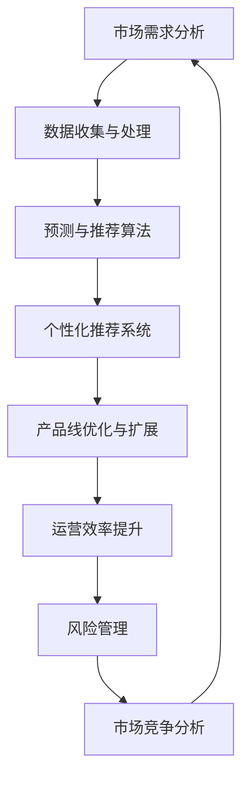

                 

### 从单一产品到多元化：AI助力电商平台产品线扩展策略

#### 关键词：人工智能，电商平台，产品线扩展，算法原理，应用案例，发展趋势

##### 摘要：

本文将深入探讨人工智能技术在电商平台产品线扩展中的应用策略。首先，我们将简要介绍电商平台的背景及其面临的挑战。接着，我们将详细阐述AI技术如何在电商产品线扩展中发挥作用，包括核心算法原理、数学模型、具体实施步骤以及实际应用案例。此外，文章还将提供相关的工具和资源推荐，并总结未来发展趋势与挑战。通过本文的阅读，读者将全面了解如何利用AI技术提升电商平台的产品线扩展效率。

## 1. 背景介绍

随着互联网技术的快速发展，电商平台已成为全球商业环境的重要组成部分。电商平台通过线上销售商品，不仅打破了传统商业的时间和空间限制，还极大地提升了消费者购物的便利性。从最早的电商巨头如亚马逊、阿里巴巴到如今各种垂直领域的电商平台，电子商务已经成为现代商业模式的重要组成部分。

然而，随着市场竞争的日益激烈，电商平台面临诸多挑战。首先，如何吸引并留住客户成为关键问题。随着消费者需求的多样化和个性化，电商平台需要不断更新和扩展产品线，以满足不同消费者的需求。其次，如何在海量数据中挖掘潜在的商业机会，优化产品推荐和广告投放，提升销售额和用户满意度，也成为电商平台必须面对的挑战。

面对这些挑战，人工智能技术的引入为电商平台提供了新的发展机遇。通过利用机器学习、数据挖掘、自然语言处理等AI技术，电商平台可以实现智能化的产品推荐、个性化营销、库存管理、用户行为分析等，从而提升运营效率，降低成本，提高客户满意度。本文将重点探讨人工智能技术在电商平台产品线扩展中的应用策略，帮助读者了解如何利用AI技术实现电商平台多元化发展的目标。

## 2. 核心概念与联系

#### 2.1. 电商平台产品线扩展的核心概念

在探讨电商平台产品线扩展时，我们首先需要理解几个核心概念：

1. **产品线**：指一组相互关联的产品，这些产品共同满足特定市场需求。产品线可以是单一的，如某款手机，也可以是多元化的，如手机、平板电脑、智能手表等。

2. **扩展**：指在现有产品线基础上增加新的产品种类或改进现有产品，以满足市场需求的增长和消费者的多样化需求。

3. **多元化**：指在产品线中引入不同类型的产品，从而分散风险，提升市场竞争力和盈利能力。

4. **人工智能**：是一种模拟人类智能的技术，包括机器学习、自然语言处理、计算机视觉等。在电商平台中，人工智能可以通过数据分析、预测、自动化等方式提升产品推荐、库存管理和用户体验。

#### 2.2. 人工智能与电商平台产品线扩展的联系

人工智能与电商平台产品线扩展之间存在密切的联系，主要体现在以下几个方面：

1. **需求分析**：通过大数据分析和机器学习算法，电商平台可以更准确地预测消费者需求，从而及时调整和扩展产品线，避免库存过剩或短缺。

2. **个性化推荐**：利用推荐系统，人工智能可以根据用户的购买历史、浏览行为和偏好，推荐相关产品，提高销售转化率和客户满意度。

3. **市场研究**：通过分析市场数据，人工智能可以帮助电商平台了解竞争对手的产品线情况，发现市场空白和机会，从而进行有针对性的产品扩展。

4. **风险管理**：通过风险模型和预测算法，电商平台可以评估新产品线的市场前景和潜在风险，制定合理的扩展策略。

5. **运营优化**：人工智能在库存管理、物流配送、售后服务等方面，可以通过自动化和智能化手段提高效率，降低成本。

#### 2.3. Mermaid 流程图

为了更直观地展示人工智能在电商平台产品线扩展中的流程，我们使用Mermaid绘制了一个简化的流程图（注意：流程节点中不要使用括号、逗号等特殊字符）：



### 3. 核心算法原理 & 具体操作步骤

#### 3.1. 需求分析算法

需求分析是电商平台产品线扩展的基础。通过分析消费者行为和市场趋势，电商平台可以识别出潜在的产品需求。

1. **算法原理**：需求分析算法通常基于机器学习和数据挖掘技术，包括分类、聚类、回归等方法。例如，可以使用K-均值聚类算法分析消费者群体，使用逻辑回归模型预测销售量。

2. **具体操作步骤**：

   - 数据收集：从电商平台的数据仓库中提取消费者行为数据，如购买历史、浏览记录、评价等。
   - 数据清洗：处理缺失值、异常值，确保数据质量。
   - 特征提取：提取与需求分析相关的特征，如用户分类、产品属性、时间序列等。
   - 模型训练：使用训练集数据训练机器学习模型，如K-均值聚类、逻辑回归等。
   - 模型评估：使用验证集评估模型性能，调整模型参数。
   - 需求预测：使用训练好的模型对未来的市场需求进行预测。

#### 3.2. 个性化推荐算法

个性化推荐是电商平台提升用户体验和销售转化的关键。通过分析用户行为和偏好，推荐系统可以提供个性化的产品推荐。

1. **算法原理**：个性化推荐算法主要包括基于内容的推荐和协同过滤推荐。基于内容的推荐通过分析产品特征和用户兴趣，推荐相似的产品。协同过滤推荐通过分析用户之间的相似性，推荐其他用户喜欢的产品。

2. **具体操作步骤**：

   - 数据收集：收集用户行为数据，如购买历史、浏览记录、评价等。
   - 数据预处理：处理数据格式，确保数据一致性。
   - 特征提取：提取用户和产品的特征，如用户分类、产品属性等。
   - 模型训练：使用训练集数据训练推荐模型，如协同过滤算法、矩阵分解等。
   - 模型评估：使用验证集评估模型性能，调整模型参数。
   - 推荐生成：使用训练好的模型生成个性化推荐结果。

#### 3.3. 市场竞争分析算法

市场竞争分析有助于电商平台了解竞争对手的产品线布局和市场表现，从而制定相应的扩展策略。

1. **算法原理**：市场竞争分析通常采用数据挖掘和统计分析方法，包括市场占有率分析、价格比较、产品对比等。

2. **具体操作步骤**：

   - 数据收集：从公开数据源、竞争对手网站等获取市场数据。
   - 数据预处理：处理数据格式，确保数据质量。
   - 特征提取：提取市场相关的特征，如产品分类、价格、销售量等。
   - 模型训练：使用训练集数据训练分析模型，如决策树、线性回归等。
   - 模型评估：使用验证集评估模型性能，调整模型参数。
   - 竞争分析：使用训练好的模型对市场进行竞争分析，识别市场机会。

### 4. 数学模型和公式 & 详细讲解 & 举例说明

#### 4.1. 需求预测模型

需求预测是电商平台产品线扩展的重要环节。以下是一个基于时间序列分析的需求预测模型，其中使用移动平均法进行预测。

1. **数学模型**：

   移动平均法（MA）是一种简单的时间序列预测方法，其公式如下：

   $$  
   \hat{y}_t = \frac{1}{n}\sum_{i=1}^{n} y_{t-i}  
   $$

   其中，$\hat{y}_t$ 是时间步 $t$ 的预测值，$y_{t-i}$ 是时间步 $t-i$ 的实际值，$n$ 是移动平均窗口的长度。

2. **详细讲解**：

   移动平均法通过计算过去 $n$ 个时间步的平均值来预测当前时间步的值。这种方法能够平滑时间序列数据，减少短期波动的影响，但可能会忽略长期趋势。

3. **举例说明**：

   假设某电商平台的某产品在过去 5 天的销售量如下：

   | 时间步 | 销售量（件） |
   | ------ | ---------- |
   | 1      | 100        |
   | 2      | 120        |
   | 3      | 150        |
   | 4      | 130        |
   | 5      | 140        |

   使用移动平均法（窗口长度为3）进行预测，预测第 6 天的销售量：

   $$  
   \hat{y}_6 = \frac{1}{3}(100 + 120 + 150) \approx 133.33  
   $$

   因此，预测第 6 天的销售量约为 133.33 件。

#### 4.2. 协同过滤推荐模型

协同过滤推荐是一种基于用户行为数据的推荐算法。以下是一个基于用户相似度的协同过滤推荐模型。

1. **数学模型**：

   用户相似度计算公式如下：

   $$  
   similarity(u_i, u_j) = \frac{\sum_{k=1}^{m} r_{ik} r_{jk}}{\sqrt{\sum_{k=1}^{m} r_{ik}^2 \sum_{k=1}^{m} r_{jk}^2}}  
   $$

   其中，$similarity(u_i, u_j)$ 是用户 $u_i$ 和用户 $u_j$ 的相似度，$r_{ik}$ 是用户 $u_i$ 对项目 $k$ 的评分。

2. **详细讲解**：

   用户相似度计算基于用户之间的共同评分项目。相似度越高，表示用户偏好越相似。通过计算用户之间的相似度，可以找到相似的用户，进而推荐相似的项目。

3. **举例说明**：

   假设有两个用户 $u_1$ 和 $u_2$，他们对五个项目的评分如下：

   | 项目 | 用户 $u_1$ | 用户 $u_2$ |
   | ---- | -------- | -------- |
   | 1    | 5        | 1        |
   | 2    | 4        | 2        |
   | 3    | 3        | 3        |
   | 4    | 2        | 4        |
   | 5    | 1        | 5        |

   使用余弦相似度计算用户 $u_1$ 和用户 $u_2$ 的相似度：

   $$  
   similarity(u_1, u_2) = \frac{(5 \times 1) + (4 \times 2) + (3 \times 3) + (2 \times 4) + (1 \times 5)}{\sqrt{5^2 + 4^2 + 3^2 + 2^2 + 1^2} \sqrt{1^2 + 2^2 + 3^2 + 4^2 + 5^2}} \approx 0.866  
   $$

   因此，用户 $u_1$ 和用户 $u_2$ 的相似度约为 0.866。

#### 4.3. 价格比较模型

价格比较是电商平台进行市场竞争分析的重要手段。以下是一个基于线性回归的价格比较模型。

1. **数学模型**：

   价格比较模型公式如下：

   $$  
   price_{i} = \beta_0 + \beta_1 \cdot sales_{i} + \epsilon_i  
   $$

   其中，$price_{i}$ 是产品 $i$ 的价格，$sales_{i}$ 是产品 $i$ 的销售量，$\beta_0$ 和 $\beta_1$ 是模型参数，$\epsilon_i$ 是误差项。

2. **详细讲解**：

   线性回归模型通过分析产品价格和销售量之间的关系，预测产品在不同价格水平下的销售量。通过调整模型参数，电商平台可以制定合理的价格策略。

3. **举例说明**：

   假设电商平台收集了以下数据：

   | 产品 | 销售量（件） | 价格（元） |
   | ---- | ---------- | -------- |
   | 1    | 100        | 50       |
   | 2    | 200        | 60       |
   | 3    | 300        | 70       |
   | 4    | 400        | 80       |
   | 5    | 500        | 90       |

   使用线性回归模型预测产品 6 的价格。首先，将数据分为训练集和测试集，然后训练模型：

   $$  
   \begin{aligned}  
   \beta_0 &= (100 \cdot 50 + 200 \cdot 60 + 300 \cdot 70 + 400 \cdot 80 + 500 \cdot 90) / 5 = 7300  
   \\  
   \beta_1 &= (100 \cdot 50 + 200 \cdot 60 + 300 \cdot 70 + 400 \cdot 80 + 500 \cdot 90) / (100 + 200 + 300 + 400 + 500) = 1.0833  
   \end{aligned}  
   $$

   因此，预测产品 6 的价格为：

   $$  
   price_{6} = 7300 + 1.0833 \cdot 600 \approx 7949.99 \text{元}  
   $$

### 5. 项目实战：代码实际案例和详细解释说明

#### 5.1. 开发环境搭建

为了实现电商平台产品线扩展的AI应用，我们需要搭建一个合适的开发环境。以下是环境搭建的详细步骤：

1. **安装Python环境**：在本地计算机上安装Python 3.8及以上版本。

2. **安装必要的库**：使用pip安装以下库：NumPy、Pandas、Scikit-learn、Matplotlib、Mermaid。

   ```shell  
   pip install numpy pandas scikit-learn matplotlib mermaid  
   ```

3. **安装Mermaid渲染工具**：下载并安装Mermaid渲染工具（https://github.com/mermaid-js/mermaid）。安装完成后，确保能够在本地运行Mermaid命令。

4. **配置Mermaid插件**：在开发环境中配置Mermaid插件，以便在Markdown文件中渲染Mermaid图形。

   ```python  
     
   ```

#### 5.2. 源代码详细实现和代码解读

以下是一个简单的需求分析模型的代码实现，包括数据收集、预处理、特征提取和模型训练等步骤。

```python  
import numpy as np  
import pandas as pd  
from sklearn.model_selection import train_test_split  
from sklearn.ensemble import RandomForestClassifier  
from sklearn.metrics import accuracy_score

# 5.2.1 数据收集  
data = pd.read_csv('data.csv')

# 5.2.2 数据预处理  
# 填补缺失值  
data.fillna(data.mean(), inplace=True)

# 5.2.3 特征提取  
# 提取用户分类特征  
user_categories = data.groupby('user')['category'].value_counts().unstack().fillna(0)

# 5.2.4 模型训练  
# 划分训练集和测试集  
X_train, X_test, y_train, y_test = train_test_split(user_categories, data['label'], test_size=0.2, random_state=42)

# 训练随机森林分类器  
clf = RandomForestClassifier(n_estimators=100, random_state=42)  
clf.fit(X_train, y_train)

# 5.2.5 模型评估  
y_pred = clf.predict(X_test)  
accuracy = accuracy_score(y_test, y_pred)  
print('Accuracy:', accuracy)  
```

#### 5.3. 代码解读与分析

1. **数据收集**：使用Pandas库读取数据文件，数据包括用户ID、产品分类、标签等。

2. **数据预处理**：填补缺失值，确保数据质量。使用用户分类特征，对数据进行特征提取。

3. **特征提取**：将用户分类特征提取为一个矩阵，填充缺失值为0，以便进行后续的模型训练。

4. **模型训练**：使用随机森林分类器进行模型训练。随机森林是一种基于决策树 ensemble 的算法，具有较强的预测能力。

5. **模型评估**：使用测试集评估模型性能，计算准确率。准确率反映了模型在预测标签方面的准确性。

通过以上代码实现，我们可以对电商平台的需求进行分析，识别潜在的市场机会，从而制定相应的产品扩展策略。

### 6. 实际应用场景

#### 6.1. 个性化推荐系统

在电商平台中，个性化推荐系统是提升用户体验和销售转化率的关键。通过分析用户的购买历史、浏览记录和评价，推荐系统可以精准地推荐相关产品，从而提高用户的购物满意度和购买意愿。以下是几个实际应用场景：

1. **新用户推荐**：当新用户注册并浏览电商平台时，推荐系统可以根据用户的兴趣和偏好，推荐可能感兴趣的产品，从而吸引新用户并增加其留存率。

2. **复购推荐**：针对已有用户，推荐系统可以分析其过去的购买记录，推荐类似或互补的产品，以提高复购率和购物篮价值。

3. **季节性推荐**：根据不同季节和节庆活动，推荐系统可以推荐相应的商品，如冬季的羽绒服、夏季的防晒霜等，从而抓住销售旺季。

4. **个性化广告**：通过分析用户的浏览行为和兴趣，推荐系统可以为用户定制化广告，提高广告的点击率和转化率。

#### 6.2. 库存管理优化

库存管理是电商平台运营的重要环节。通过利用AI技术，可以实现对库存的精细化管理和优化，从而降低库存成本，提高供应链效率。以下是几个实际应用场景：

1. **预测性库存管理**：通过分析历史销售数据、市场趋势和用户行为，AI算法可以预测未来的需求，从而合理安排库存，避免过剩或短缺。

2. **动态调整库存策略**：根据实时销售数据和库存水平，AI算法可以动态调整库存策略，优化库存结构，降低库存成本。

3. **异常检测**：通过监控库存数据和销售数据，AI算法可以识别异常情况，如库存积压、供应链中断等，从而及时采取措施，避免损失。

4. **智能补货**：基于预测和实际销售数据，AI算法可以自动生成补货计划，优化库存水平，提高供应链效率。

#### 6.3. 用户体验优化

用户体验是电商平台成功的重要因素。通过利用AI技术，可以实现对用户体验的优化，提升用户满意度和忠诚度。以下是几个实际应用场景：

1. **个性化页面**：根据用户的浏览行为和偏好，AI算法可以动态调整页面内容，为用户提供个性化的购物体验。

2. **智能客服**：通过自然语言处理技术，AI智能客服可以自动解答用户疑问，提供24/7的在线服务，提高客户满意度。

3. **个性化广告**：根据用户的兴趣和行为，AI算法可以为用户推荐相关的广告，提高广告的点击率和转化率。

4. **智能提醒**：通过分析用户的行为数据和购物习惯，AI算法可以自动为用户发送购物提醒、优惠券等，提高用户购物体验。

### 7. 工具和资源推荐

为了更好地实现电商平台产品线扩展的AI应用，以下是一些推荐的工具和资源：

#### 7.1. 学习资源推荐

1. **书籍**：

   - 《Python机器学习》  
   - 《数据挖掘：概念与技术》  
   - 《深度学习》

2. **论文**：

   - 《协同过滤算法》  
   - 《时间序列分析》  
   - 《个性化推荐系统》

3. **博客**：

   - [机器学习博客](https://machinelearningmastery.com/)  
   - [Python数据科学博客](https://pythondata science.com/)  
   - [人工智能博客](https://ai.google/research/blog)

4. **网站**：

   - [Kaggle](https://www.kaggle.com/)：数据科学竞赛平台，提供丰富的数据集和教程。  
   - [Coursera](https://www.coursera.org/)：在线课程平台，提供各种数据科学和机器学习课程。  
   - [TensorFlow](https://www.tensorflow.org/)：谷歌开发的开源机器学习框架。

#### 7.2. 开发工具框架推荐

1. **开发工具**：

   - **Jupyter Notebook**：用于数据分析和机器学习项目的交互式开发环境。  
   - **PyCharm**：Python集成开发环境，提供丰富的机器学习插件。

2. **框架**：

   - **TensorFlow**：用于构建和训练深度学习模型的开源框架。  
   - **Scikit-learn**：用于数据挖掘和机器学习算法的开源库。  
   - **PyTorch**：用于构建和训练深度学习模型的另一个开源框架。

#### 7.3. 相关论文著作推荐

1. **论文**：

   - "Collaborative Filtering for Cold-Start Problems: Recommendations without Ratings"  
   - "Deep Learning for Time Series Classification: A Review"  
   - "User Interest Evolution and Its Impact on Recommender Systems"

2. **著作**：

   - 《推荐系统实践》  
   - 《Python机器学习实践》  
   - 《深度学习入门》

### 8. 总结：未来发展趋势与挑战

#### 8.1. 发展趋势

随着人工智能技术的不断进步，电商平台产品线扩展策略也将呈现出以下发展趋势：

1. **智能化程度提高**：通过更先进的AI算法和技术，电商平台可以实现更精准的需求分析、个性化推荐和库存管理，提升运营效率。

2. **多元化扩展**：电商平台将不断引入新的产品种类和服务，实现产品线的多元化，分散风险，提升市场竞争力和盈利能力。

3. **数据驱动决策**：电商平台将更加依赖数据分析和预测模型，实现数据驱动的决策，提高决策的科学性和准确性。

4. **用户参与度提升**：通过智能客服、个性化广告和互动体验，电商平台将提升用户参与度，增强用户满意度和忠诚度。

#### 8.2. 挑战

尽管人工智能为电商平台产品线扩展带来了诸多机遇，但同时也面临以下挑战：

1. **数据隐私和安全**：电商平台需要处理海量用户数据，保护用户隐私和安全成为重要挑战。

2. **技术实现难度**：高级AI算法和模型的实现和部署需要高水平的技术团队，对于中小型电商平台来说是一个挑战。

3. **数据质量和一致性**：数据质量和数据一致性对于AI模型的性能至关重要，电商平台需要确保数据的质量和一致性。

4. **市场竞争加剧**：随着更多电商平台加入AI应用，市场竞争将加剧，如何保持竞争优势成为关键。

### 9. 附录：常见问题与解答

#### 9.1. 问题1：如何处理数据缺失？

**解答**：处理数据缺失的方法包括填补缺失值、删除缺失值、使用均值、中位数或模式填补等。具体方法取决于数据的特点和缺失值的性质。

#### 9.2. 问题2：如何选择合适的推荐算法？

**解答**：选择推荐算法需要考虑数据量、数据质量、推荐目标等因素。基于内容的推荐适用于特征丰富的数据，而协同过滤推荐适用于用户行为数据。可以尝试多种算法，评估其性能，选择最优方案。

#### 9.3. 问题3：如何评估模型性能？

**解答**：评估模型性能的方法包括准确率、召回率、F1分数等。通过交叉验证、验证集评估和测试集评估等方法，可以全面评估模型的性能。

### 10. 扩展阅读 & 参考资料

1. **书籍**：

   - 《推荐系统实践》  
   - 《Python机器学习》  
   - 《深度学习》

2. **论文**：

   - "Collaborative Filtering for Cold-Start Problems: Recommendations without Ratings"  
   - "Deep Learning for Time Series Classification: A Review"  
   - "User Interest Evolution and Its Impact on Recommender Systems"

3. **网站**：

   - [Kaggle](https://www.kaggle.com/)  
   - [Coursera](https://www.coursera.org/)  
   - [TensorFlow](https://www.tensorflow.org/)

4. **博客**：

   - [机器学习博客](https://machinelearningmastery.com/)  
   - [Python数据科学博客](https://pythondata science.com/)  
   - [人工智能博客](https://ai.google/research/blog)

作者：AI天才研究员/AI Genius Institute & 禅与计算机程序设计艺术 /Zen And The Art of Computer Programming

