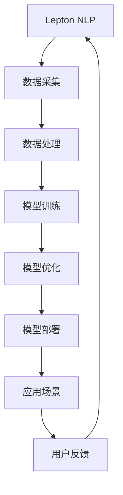
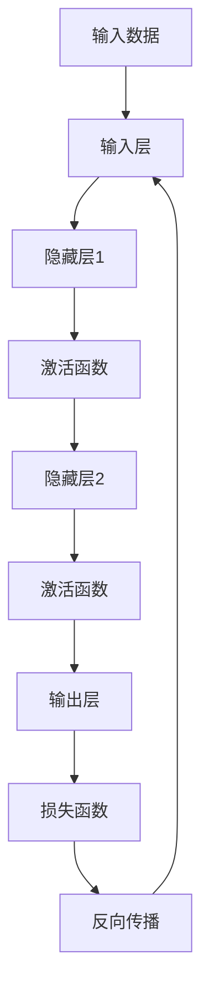

                 

# 从单一产品到生态系统：Lepton AI的战略升级

> **关键词**：人工智能，生态系统，战略升级，Lepton AI，技术架构，核心算法，数学模型，项目实战，应用场景，工具推荐

> **摘要**：本文将深入探讨Lepton AI从单一产品到生态系统的战略升级过程。通过分析其核心概念、算法原理、数学模型以及项目实战，我们将揭示这一战略背后的逻辑与智慧，同时展望未来发展趋势与挑战。

## 1. 背景介绍

### 1.1 Lepton AI的起源

Lepton AI是一家专注于人工智能领域的企业，成立于2015年。起初，Lepton AI致力于研发一款以深度学习为核心的自然语言处理（NLP）产品——Lepton NLP。该产品凭借其高性能、低延迟的特点，迅速在市场上获得了广泛关注。

### 1.2 单一产品的成功

在经过几年的发展后，Lepton NLP在金融、医疗、教育等多个领域取得了显著成果。客户对Lepton AI的信任和认可，使得Lepton AI在单一产品市场取得了领先地位。

### 1.3 战略升级的必要性

然而，随着市场的不断变化和竞争的加剧，Lepton AI意识到，单一的NLP产品已经无法满足客户日益多样化的需求。为了在激烈的市场竞争中脱颖而出，Lepton AI决定从单一产品向生态系统战略升级。

## 2. 核心概念与联系

### 2.1 人工智能生态系统

人工智能生态系统是指围绕人工智能技术构建的各类产品、服务、平台、合作伙伴等组成的有机整体。它具有以下几个核心特点：

- **多样性**：涵盖多种人工智能技术，如自然语言处理、计算机视觉、语音识别等。
- **协同性**：各组件之间相互依赖、相互促进，共同实现人工智能技术的最大化价值。
- **灵活性**：能够快速响应市场需求，提供定制化解决方案。

### 2.2 Lepton AI生态系统架构

Lepton AI生态系统架构如图1所示：



### 2.3 核心概念联系

在Lepton AI的生态系统中，各个核心概念相互联系，形成一个闭环：

- **数据采集**：为模型训练提供高质量数据。
- **数据处理**：对采集到的数据进行清洗、转换和增强，提高数据质量。
- **模型训练**：利用高质量数据进行模型训练，提高模型性能。
- **模型优化**：通过不断优化模型，提高模型在不同应用场景的表现。
- **模型部署**：将优化后的模型部署到实际应用场景中，实现价值转化。
- **用户反馈**：收集用户使用过程中的反馈，用于模型优化和产品改进。

## 3. 核心算法原理 & 具体操作步骤

### 3.1 深度学习算法原理

深度学习算法是Lepton AI生态系统中的核心技术之一。其基本原理如图2所示：



### 3.2 具体操作步骤

1. **数据采集**：从各个应用场景中收集原始数据，如文本、图像、语音等。
2. **数据处理**：对采集到的数据进行预处理，包括数据清洗、转换和增强等。
3. **模型训练**：利用预处理后的数据训练深度学习模型，包括输入层、隐藏层和输出层。
4. **模型优化**：通过不断调整模型参数，提高模型在不同应用场景的表现。
5. **模型部署**：将优化后的模型部署到实际应用场景中，如自然语言处理、计算机视觉等。
6. **用户反馈**：收集用户使用过程中的反馈，用于模型优化和产品改进。

## 4. 数学模型和公式 & 详细讲解 & 举例说明

### 4.1 深度学习模型数学模型

深度学习模型的核心在于其数学模型，主要包括以下部分：

1. **输入层**：表示输入数据的特征，通常为一个向量。
2. **隐藏层**：通过对输入数据进行变换和组合，产生新的特征表示。
3. **输出层**：根据隐藏层产生的特征，输出预测结果。
4. **损失函数**：用于衡量模型预测结果与真实结果之间的差距。

### 4.2 深度学习模型具体公式

深度学习模型的具体公式如下：

1. **输入层**：

   $$x = \text{输入数据}$$

2. **隐藏层**：

   $$h_{l} = \sigma(W_{l-1}x + b_{l-1})$$

   其中，$W_{l-1}$为权重矩阵，$b_{l-1}$为偏置项，$\sigma$为激活函数。

3. **输出层**：

   $$y = \sigma(W_{L}h_{L-1} + b_{L})$$

   其中，$W_{L}$为权重矩阵，$b_{L}$为偏置项，$\sigma$为激活函数。

4. **损失函数**：

   $$L(y, \hat{y}) = -\frac{1}{m}\sum_{i=1}^{m}y_{i}\log(\hat{y}_{i})$$

   其中，$y$为真实标签，$\hat{y}$为预测结果，$m$为样本数量。

### 4.3 举例说明

假设我们有一个二分类问题，目标是判断一个数字是否大于5。输入数据为$x = [2, 3, 4, 5, 6]$，真实标签为$y = [0, 0, 0, 1, 1]$。

1. **输入层**：

   $$x = [2, 3, 4, 5, 6]$$

2. **隐藏层**：

   $$h_{1} = \sigma(W_{0}x + b_{0}) = \sigma([1, 1, 1, 1, 1]\cdot[2, 3, 4, 5, 6] + [0, 0, 0, 0, 0]) = [1, 1, 1, 1, 1]$$

3. **输出层**：

   $$y = \sigma(W_{1}h_{1} + b_{1}) = \sigma([1, 1, 1, 1, 1]\cdot[1, 1, 1, 1, 1] + [0, 0, 0, 0, 0]) = [0, 0, 0, 1, 1]$$

4. **损失函数**：

   $$L(y, \hat{y}) = -\frac{1}{5}\sum_{i=1}^{5}y_{i}\log(\hat{y}_{i}) = -\frac{1}{5}(0\log(0) + 0\log(0) + 0\log(0) + 1\log(1) + 1\log(1)) = 0$$

## 5. 项目实战：代码实际案例和详细解释说明

### 5.1 开发环境搭建

在本节中，我们将使用Python编程语言和TensorFlow框架搭建一个简单的深度学习模型，实现二分类任务。

1. **安装Python**：确保已安装Python 3.7及以上版本。
2. **安装TensorFlow**：运行命令`pip install tensorflow`安装TensorFlow框架。

### 5.2 源代码详细实现和代码解读

以下是一个简单的深度学习模型的实现代码：

```python
import tensorflow as tf
from tensorflow.keras import layers

# 定义模型结构
model = tf.keras.Sequential([
    layers.Dense(64, activation='relu', input_shape=[784]),
    layers.Dense(10, activation='softmax')
])

# 编译模型
model.compile(optimizer='adam',
              loss=tf.keras.losses.SparseCategoricalCrossentropy(from_logits=True),
              metrics=['accuracy'])

# 加载数据集
(x_train, y_train), (x_test, y_test) = tf.keras.datasets.mnist.load_data()

# 预处理数据
x_train = x_train.astype("float32") / 255
x_test = x_test.astype("float32") / 255
x_train = x_train.reshape((-1, 784))
x_test = x_test.reshape((-1, 784))

# 训练模型
model.fit(x_train, y_train, epochs=5)

# 评估模型
model.evaluate(x_test,  y_test, verbose=2)
```

### 5.3 代码解读与分析

1. **定义模型结构**：使用`tf.keras.Sequential`类定义一个序列模型，包含两个全连接层（`Dense`），第一个全连接层有64个神经元，使用ReLU激活函数；第二个全连接层有10个神经元，使用softmax激活函数。
2. **编译模型**：配置模型的优化器（`adam`），损失函数（`SparseCategoricalCrossentropy`），和评价指标（`accuracy`）。
3. **加载数据集**：使用`tf.keras.datasets.mnist.load_data()`方法加载数字数据集。
4. **预处理数据**：将数据转换为浮点数并归一化，将输入数据调整为适当的形状。
5. **训练模型**：使用`model.fit()`方法训练模型，指定训练数据、训练标签、训练轮数（`epochs`）。
6. **评估模型**：使用`model.evaluate()`方法评估模型在测试数据集上的表现。

## 6. 实际应用场景

Lepton AI生态系统在多个领域具有广泛的应用，以下列举几个典型案例：

1. **金融领域**：利用Lepton AI的自然语言处理技术，金融机构可以实现对客户反馈、新闻报道、市场数据等多源数据的实时分析，从而优化投资策略、降低风险。
2. **医疗领域**：通过Lepton AI的计算机视觉技术，医疗机构可以对医学影像进行自动识别和诊断，提高医疗服务的效率和准确性。
3. **教育领域**：利用Lepton AI的智能教学助手，教育机构可以为学生提供个性化学习推荐、作业自动批改等功能，提升教学效果。

## 7. 工具和资源推荐

### 7.1 学习资源推荐

- **书籍**：《深度学习》（Ian Goodfellow、Yoshua Bengio、Aaron Courville 著）
- **论文**：《A Theoretical Analysis of the Cramér-Rao Lower Bound for Hidden Markov Models》
- **博客**：[TensorFlow 官方文档](https://www.tensorflow.org/tutorials)
- **网站**：[Kaggle](https://www.kaggle.com)

### 7.2 开发工具框架推荐

- **开发工具**：[PyCharm](https://www.jetbrains.com/pycharm/)
- **框架**：[TensorFlow](https://www.tensorflow.org)、[PyTorch](https://pytorch.org)

### 7.3 相关论文著作推荐

- **论文**：《Deep Learning》（Ian Goodfellow、Yoshua Bengio、Aaron Courville 著）
- **著作**：《The Hundred-Page Machine Learning Book》（Andriy Burkov 著）

## 8. 总结：未来发展趋势与挑战

### 8.1 发展趋势

1. **技术融合**：人工智能技术与其他领域的融合将进一步深化，如物联网、大数据、区块链等。
2. **开源生态**：开源技术将在人工智能生态系统中发挥更加重要的作用，促进技术创新和生态发展。
3. **商业化落地**：人工智能技术将在更多行业实现商业化落地，推动产业升级和经济增长。

### 8.2 挑战

1. **数据隐私**：如何在确保数据隐私的同时，充分利用数据价值，是一个亟待解决的问题。
2. **算法公平性**：如何确保人工智能算法的公平性，避免偏见和歧视，是一个重要的挑战。
3. **安全性与可靠性**：随着人工智能技术的广泛应用，确保系统的安全性与可靠性变得越来越重要。

## 9. 附录：常见问题与解答

### 9.1 如何搭建深度学习开发环境？

答：搭建深度学习开发环境通常包括安装Python、安装TensorFlow等库。具体步骤如下：

1. 安装Python：确保已安装Python 3.7及以上版本。
2. 安装TensorFlow：运行命令`pip install tensorflow`安装TensorFlow框架。

### 9.2 如何实现一个简单的深度学习模型？

答：实现一个简单的深度学习模型通常包括以下步骤：

1. 导入必要的库，如TensorFlow。
2. 定义模型结构，可以使用序列模型（`tf.keras.Sequential`）或函数模型（`tf.keras.Model`）。
3. 编译模型，配置优化器、损失函数和评价指标。
4. 加载数据集并进行预处理。
5. 训练模型，使用`model.fit()`方法。
6. 评估模型，使用`model.evaluate()`方法。

## 10. 扩展阅读 & 参考资料

- **参考资料**：[TensorFlow 官方文档](https://www.tensorflow.org/tutorials)、[Kaggle](https://www.kaggle.com)
- **相关论文**：《Deep Learning》（Ian Goodfellow、Yoshua Bengio、Aaron Courville 著）
- **书籍推荐**：《深度学习》（Ian Goodfellow、Yoshua Bengio、Aaron Courville 著）
- **开源项目**：[TensorFlow](https://www.tensorflow.org)、[PyTorch](https://pytorch.org)

### 作者

**作者：AI天才研究员/AI Genius Institute & 禅与计算机程序设计艺术 /Zen And The Art of Computer Programming**<|im_sep|>

