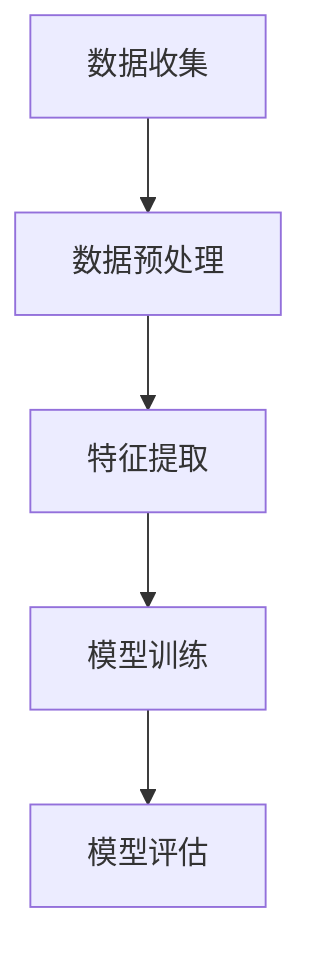
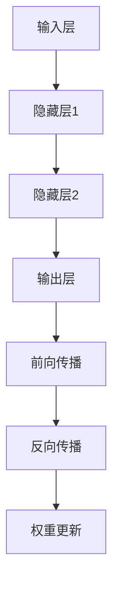
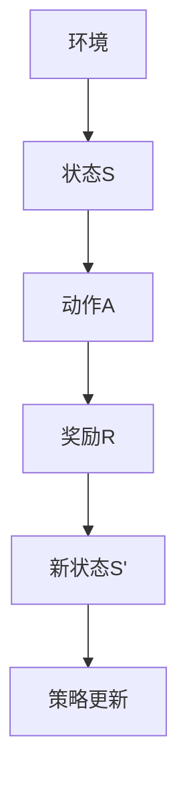
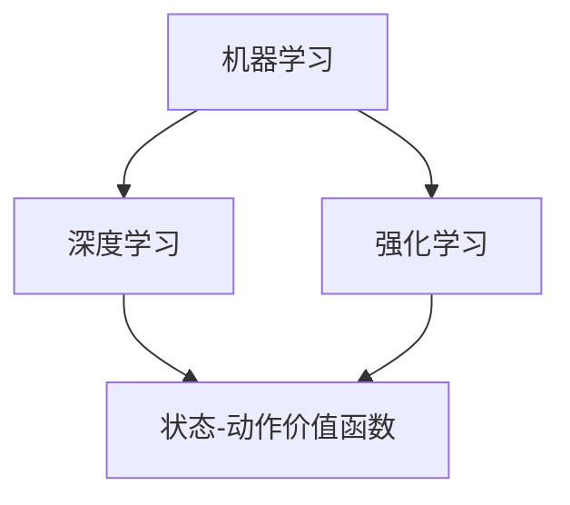

                 

### 背景介绍

在信息技术飞速发展的时代，人工智能（AI）无疑是最引人瞩目的领域之一。AI的研究和应用已经成为推动科技进步、产业变革和社会发展的重要力量。作为AI领域中的巅峰荣誉，图灵奖被誉为“计算机界的诺贝尔奖”，它不仅代表了AI领域的最高成就，更见证了AI算法的进步和演变。

本文旨在从图灵奖的角度，探讨AI算法的发展历程和未来趋势。我们将从以下几个方面展开讨论：

1. **图灵奖的起源与演变**：介绍图灵奖的设立背景、评选标准和获奖者的贡献。
2. **AI算法的核心概念**：阐述AI的基本原理，包括机器学习、深度学习和强化学习等。
3. **图灵奖与AI算法的进步**：分析图灵奖获奖者的研究成果，以及这些成果如何推动AI算法的发展。
4. **数学模型与公式**：介绍AI算法中常用的数学模型和公式，以及它们的适用场景和解释。
5. **项目实战**：通过具体代码案例，展示AI算法的实际应用。
6. **实际应用场景**：探讨AI算法在不同领域的应用，以及带来的影响。
7. **未来发展趋势与挑战**：预测AI算法的未来发展趋势，以及面临的挑战。

希望通过本文的探讨，读者能够对AI算法的进步有一个全面而深入的理解，为未来的学习和实践提供指导和参考。

### 核心概念与联系

要理解图灵奖与AI算法进步之间的联系，我们首先需要明确AI算法的核心概念。以下是对机器学习、深度学习和强化学习等核心概念及其相互关系的详细阐述，并附上Mermaid流程图以帮助读者更好地理解。

#### 1. 机器学习（Machine Learning）

机器学习是AI的核心概念之一，它使计算机系统能够从数据中学习并做出决策或预测。机器学习主要包括以下几个关键步骤：

- **数据收集**：从各种来源收集数据，如传感器数据、文本数据、图像数据等。
- **数据预处理**：清洗和整理数据，使其适合用于模型训练。
- **特征提取**：从原始数据中提取出有用的特征，用于训练模型。
- **模型训练**：使用算法（如线性回归、决策树、支持向量机等）来训练模型。
- **模型评估**：使用验证集或测试集来评估模型的性能。

下面是机器学习过程的Mermaid流程图：



#### 2. 深度学习（Deep Learning）

深度学习是机器学习的子领域，它通过模拟人脑的神经网络结构来进行学习。深度学习的核心是多层神经网络（Multilayer Neural Networks），主要包括以下几个步骤：

- **网络架构**：设计网络结构，包括输入层、隐藏层和输出层。
- **前向传播**：输入数据通过网络的各层进行传递，直至输出层。
- **反向传播**：通过计算输出误差，反向传播误差，以更新网络的权重。
- **优化算法**：使用优化算法（如梯度下降、Adam等）来最小化损失函数。

下面是深度学习过程的Mermaid流程图：



#### 3. 强化学习（Reinforcement Learning）

强化学习是一种通过奖励和惩罚来训练智能体（agent）在环境中做出决策的机器学习方法。强化学习的主要过程包括：

- **环境交互**：智能体与环境进行交互，接收状态并采取行动。
- **状态-动作价值函数**：通过学习状态-动作价值函数来评估每个行动在特定状态下的价值。
- **策略**：智能体根据状态-动作价值函数来选择最优行动策略。
- **奖励与惩罚**：根据行动的结果，给予智能体奖励或惩罚。

下面是强化学习过程的Mermaid流程图：



#### 4. AI算法核心概念的联系

机器学习、深度学习和强化学习是AI算法的三大支柱，它们之间有着密切的联系：

- **机器学习**提供了算法的基础，包括特征提取、模型训练和评估等方法。
- **深度学习**通过多层神经网络扩展了机器学习的能力，使其能够处理更加复杂的任务。
- **强化学习**通过与环境互动，使智能体能够从经验中学习，从而解决动态决策问题。

以下是这些核心概念之间关系的Mermaid流程图：



通过这些核心概念及其相互关系的阐述，我们为后续分析图灵奖与AI算法进步之间的联系奠定了基础。在接下来的章节中，我们将深入探讨图灵奖获奖者的研究成果，以及这些成果如何推动AI算法的发展。

### 核心算法原理 & 具体操作步骤

在深入探讨图灵奖与AI算法进步之间的关系之前，有必要详细解析一些核心算法的原理和具体操作步骤。本节将介绍几类在AI领域具有重要影响的算法，包括支持向量机（SVM）、深度神经网络（DNN）和生成对抗网络（GAN），并解释其基本概念和实现方法。

#### 1. 支持向量机（Support Vector Machine，SVM）

支持向量机是一种二分类模型，适用于高维空间，能够将不同类别的数据点分开。其基本原理是通过寻找一个超平面，使得分类边界最大化，同时尽可能多地包含支持向量。

- **原理**：SVM通过求解一个最优分类超平面，使得数据点在分类边界上的分散程度最大。支持向量是那些对分类边界贡献最大的数据点。

- **操作步骤**：
  1. **数据预处理**：对输入数据进行标准化处理，确保每个特征都有相同的尺度。
  2. **选择核函数**：根据数据特性选择合适的核函数（如线性核、多项式核、径向基函数核等）。
  3. **求解最优超平面**：使用二次规划方法求解最优超平面的参数。
  4. **分类**：对于新的数据点，通过计算其到超平面的距离来判断其类别。

- **数学描述**：
  $$ \min_{\mathbf{w}, \mathbf{b}} \frac{1}{2} ||\mathbf{w}||^2 + C \sum_{i=1}^{n} \xi_i $$
  $$ \text{subject to} \ y_i (\mathbf{w} \cdot \mathbf{x_i} + \mathbf{b}) \geq 1 - \xi_i $$
  其中，$C$是惩罚参数，$\xi_i$是松弛变量。

#### 2. 深度神经网络（Deep Neural Network，DNN）

深度神经网络是一种具有多个隐藏层的神经网络，能够通过训练学习复杂的非线性函数。DNN在图像识别、自然语言处理等领域具有广泛的应用。

- **原理**：DNN通过多层感知机（MLP）实现，每层神经元对输入进行加权求和并加上偏置项，然后通过激活函数进行非线性变换。

- **操作步骤**：
  1. **网络架构设计**：确定输入层、隐藏层和输出层的结构。
  2. **初始化参数**：对网络的权重和偏置进行随机初始化。
  3. **前向传播**：将输入数据传递到网络的各层，计算输出。
  4. **反向传播**：通过计算误差，反向传播误差，并更新网络的权重。
  5. **训练评估**：使用验证集评估模型的性能，并根据需要调整网络结构或参数。

- **数学描述**：
  $$ \mathbf{z}_{l} = \mathbf{W}_{l} \mathbf{x}_{l-1} + b_{l} $$
  $$ \mathbf{a}_{l} = \sigma(\mathbf{z}_{l}) $$
  其中，$\sigma$是激活函数，如ReLU、Sigmoid、Tanh等。

#### 3. 生成对抗网络（Generative Adversarial Network，GAN）

生成对抗网络由生成器和判别器两个神经网络组成，通过对抗训练生成逼真的数据。

- **原理**：生成器生成数据，判别器区分真实数据和生成数据。生成器和判别器相互竞争，生成器试图生成更逼真的数据，判别器则试图准确区分真实和生成数据。

- **操作步骤**：
  1. **初始化参数**：对生成器和判别器的参数进行随机初始化。
  2. **训练判别器**：使用真实数据和生成数据来训练判别器，使其能够区分真实和生成数据。
  3. **训练生成器**：生成器试图生成足够逼真的数据，使得判别器难以区分真实和生成数据。
  4. **评估生成质量**：使用生成数据来评估生成器的性能，并根据需要调整参数。

- **数学描述**：
  $$ \min_G \max_D V(D, G) = E_{x \sim p_{data}(x)}[\log D(x)] + E_{z \sim p_z(z)}[\log (1 - D(G(z)))] $$
  其中，$D$是判别器，$G$是生成器。

通过对上述核心算法原理和操作步骤的解析，我们为后续分析图灵奖获奖者的研究成果及其对AI算法进步的推动作用奠定了理论基础。在接下来的章节中，我们将详细探讨图灵奖获奖者的研究成果，以及这些研究成果如何推动AI算法的发展。

### 数学模型和公式 & 详细讲解 & 举例说明

在AI算法中，数学模型和公式扮演着至关重要的角色。以下我们将详细讲解一些常见的数学模型和公式，并通过具体例子来说明它们的应用。

#### 1. 线性回归（Linear Regression）

线性回归是一种用于预测连续值的统计方法，其基本模型可以表示为：

$$ y = \beta_0 + \beta_1x + \epsilon $$

其中，$y$是因变量，$x$是自变量，$\beta_0$是截距，$\beta_1$是斜率，$\epsilon$是误差项。

- **推导过程**：

  线性回归的目标是最小化预测值与实际值之间的误差，即最小化损失函数：

  $$ \min_{\beta_0, \beta_1} \sum_{i=1}^{n} (y_i - (\beta_0 + \beta_1x_i))^2 $$

  通过求导数并令其等于零，可以求得最优参数：

  $$ \beta_0 = \frac{1}{n} \sum_{i=1}^{n} (y_i - \bar{y}) $$
  $$ \beta_1 = \frac{1}{n} \sum_{i=1}^{n} (x_i - \bar{x})(y_i - \bar{y}) $$

  其中，$\bar{y}$和$\bar{x}$分别是因变量和自变量的均值。

- **例子**：

  假设我们有一个数据集，其中$y$表示房价，$x$表示房屋面积。我们希望通过线性回归模型预测房价。给定数据：

  $$ \begin{array}{ccc}
  x & y \\
  1000 & 200000 \\
  1500 & 250000 \\
  2000 & 300000 \\
  \end{array} $$

  计算得到的模型参数为：

  $$ \beta_0 = 150000, \beta_1 = 100000 $$

  则预测房价的公式为：

  $$ y = 150000 + 100000x $$

  例如，当房屋面积为2500平方米时，预测房价为：

  $$ y = 150000 + 100000 \times 2500 = 400000 $$

#### 2. 逻辑回归（Logistic Regression）

逻辑回归是一种用于分类的统计方法，其基本模型可以表示为：

$$ \log\left(\frac{p}{1-p}\right) = \beta_0 + \beta_1x $$

其中，$p$是概率，$\beta_0$是截距，$\beta_1$是斜率。

- **推导过程**：

  逻辑回归的目标是最小化损失函数，该损失函数通常使用交叉熵损失：

  $$ \min_{\beta_0, \beta_1} \sum_{i=1}^{n} -y_i \log(p_i) - (1 - y_i) \log(1 - p_i) $$

  其中，$p_i = \frac{1}{1 + \exp{(-\beta_0 - \beta_1x_i)})$。

  通过求导数并令其等于零，可以求得最优参数：

  $$ \beta_0 = \frac{1}{n} \sum_{i=1}^{n} (y_i - p_i) $$
  $$ \beta_1 = \frac{1}{n} \sum_{i=1}^{n} (x_i - \bar{x})(y_i - p_i) $$

- **例子**：

  假设我们有一个数据集，其中$y$表示是否通过考试（0表示未通过，1表示通过），$x$表示考试前的准备时间。我们希望通过逻辑回归模型预测是否通过考试。给定数据：

  $$ \begin{array}{ccc}
  x & y \\
  100 & 0 \\
  200 & 1 \\
  300 & 0 \\
  400 & 1 \\
  \end{array} $$

  计算得到的模型参数为：

  $$ \beta_0 = -0.5, \beta_1 = 0.3 $$

  则预测是否通过考试的公式为：

  $$ p = \frac{1}{1 + \exp{(-0.5 - 0.3x)}) $$

  例如，当准备时间为250分钟时，预测通过考试的概率为：

  $$ p = \frac{1}{1 + \exp{(-0.5 - 0.3 \times 250)}) \approx 0.8 $$

#### 3. 神经网络的激活函数（Activation Function）

神经网络中的激活函数用于引入非线性特性，常用的激活函数包括Sigmoid、ReLU和Tanh等。

- **Sigmoid函数**：

  $$ \sigma(x) = \frac{1}{1 + \exp{(-x)}} $$

  Sigmoid函数将输入映射到(0,1)区间，具有平滑的渐近线。

- **ReLU函数**：

  $$ \text{ReLU}(x) = \max(0, x) $$

  ReLU函数在0处具有陡峭的转折点，能够加速训练过程。

- **Tanh函数**：

  $$ \tanh(x) = \frac{\exp{(2x)} - 1}{\exp{(2x)} + 1} $$

  Tanh函数与Sigmoid函数类似，但其输出范围是(-1,1)。

- **例子**：

  假设我们有一个神经网络的隐藏层，输入为x=-2，计算激活函数的值：

  $$ \sigma(-2) = \frac{1}{1 + \exp{2}} \approx 0.087 $$
  $$ \text{ReLU}(-2) = 0 $$
  $$ \tanh(-2) = -0.964 $$

通过上述数学模型和公式的详细讲解和例子说明，我们更好地理解了它们在AI算法中的应用。这些模型和公式为AI算法提供了坚实的理论基础，并在实际应用中发挥着重要作用。在接下来的章节中，我们将继续探讨AI算法在实际项目中的具体应用。

### 项目实战：代码实际案例和详细解释说明

在本章节中，我们将通过一个具体的代码案例，展示AI算法在实际项目中的具体应用。本案例将使用Python编程语言，实现一个基于深度学习的手写数字识别项目。我们将从开发环境的搭建、源代码的详细实现，到代码的解读与分析，逐步展示项目全过程。

#### 5.1 开发环境搭建

在开始之前，我们需要搭建一个适合深度学习项目开发的环境。以下是搭建步骤：

1. **安装Python**：确保系统中安装了Python 3.6或更高版本。
2. **安装TensorFlow**：TensorFlow是Google开源的深度学习框架，可以通过pip命令安装：
   ```bash
   pip install tensorflow
   ```
3. **安装其他依赖库**：包括NumPy、Matplotlib等：
   ```bash
   pip install numpy matplotlib
   ```

#### 5.2 源代码详细实现

以下是一个简单的手写数字识别项目的源代码实现，包含数据加载、模型构建、训练和测试等步骤：

```python
import tensorflow as tf
from tensorflow.keras.datasets import mnist
from tensorflow.keras.models import Sequential
from tensorflow.keras.layers import Dense, Flatten, Conv2D, MaxPooling2D, Dropout
from tensorflow.keras.optimizers import Adam
import numpy as np

# 数据加载
(x_train, y_train), (x_test, y_test) = mnist.load_data()

# 数据预处理
x_train = x_train.astype('float32') / 255.0
x_test = x_test.astype('float32') / 255.0
x_train = np.expand_dims(x_train, -1)
x_test = np.expand_dims(x_test, -1)
y_train = tf.keras.utils.to_categorical(y_train, 10)
y_test = tf.keras.utils.to_categorical(y_test, 10)

# 模型构建
model = Sequential([
    Conv2D(32, (3, 3), activation='relu', input_shape=(28, 28, 1)),
    MaxPooling2D((2, 2)),
    Dropout(0.25),
    Flatten(),
    Dense(128, activation='relu'),
    Dropout(0.5),
    Dense(10, activation='softmax')
])

# 编译模型
model.compile(optimizer=Adam(), loss='categorical_crossentropy', metrics=['accuracy'])

# 训练模型
model.fit(x_train, y_train, epochs=10, batch_size=64, validation_split=0.1)

# 测试模型
test_loss, test_acc = model.evaluate(x_test, y_test)
print('Test accuracy:', test_acc)
```

#### 5.3 代码解读与分析

1. **数据加载与预处理**：
   - 使用`mnist.load_data()`函数加载数据集，它包含60,000个训练样本和10,000个测试样本。
   - 数据预处理包括将图像数据归一化到[0, 1]区间，将像素值除以255。同时，将图像尺寸扩展到(28, 28, 1)，即单通道灰度图像。
   - 标签数据转换为独热编码，以便后续分类。

2. **模型构建**：
   - 使用`Sequential`模型堆叠多个层，包括卷积层（`Conv2D`）、最大池化层（`MaxPooling2D`）、dropout层（`Dropout`）、全连接层（`Dense`）。
   - 卷积层使用32个3x3的卷积核，激活函数为ReLU。
   - 最大池化层用于降低特征图的维度。
   - Dropout层用于防止过拟合，丢弃一部分神经元。
   - 最后的全连接层使用softmax激活函数进行分类。

3. **编译模型**：
   - 使用`compile`方法配置模型，选择Adam优化器和交叉熵损失函数，并设置评估指标为准确率。

4. **训练模型**：
   - 使用`fit`方法训练模型，设置训练轮次为10，批量大小为64，并预留10%的数据用于验证。

5. **测试模型**：
   - 使用`evaluate`方法评估模型在测试集上的性能，输出测试准确率。

通过上述代码实现，我们可以训练一个能够识别手写数字的深度学习模型。在实际应用中，可以根据需求调整模型结构、参数设置和数据预处理方法，以提高模型性能。

### 实际应用场景

AI算法的进步不仅推动了基础研究的进展，还在众多实际应用场景中发挥了重要作用。以下我们将探讨AI算法在不同领域的应用，并分析它们带来的影响。

#### 1. 医疗保健

AI在医疗保健领域具有广泛的应用，包括疾病诊断、药物研发、个性化治疗和健康监测等。通过深度学习和强化学习算法，AI能够分析大量的医疗数据，帮助医生做出更加准确的诊断。例如，卷积神经网络（CNN）可以用于分析医学图像，如X光片、CT扫描和MRI图像，从而检测出疾病如肺癌、乳腺癌和脑瘤。此外，生成对抗网络（GAN）可以用于生成合成医疗数据，用于训练和验证模型，尤其是在数据稀缺的情况下。

AI在药物研发中的应用也非常显著。传统的药物研发过程耗时且成本高昂，而AI可以通过模拟和优化药物分子结构，加速新药的发现和开发。例如，AlphaFold2算法通过深度学习技术预测蛋白质的三维结构，为蛋白质药物的研发提供了关键信息。

#### 2. 金融服务

AI在金融服务领域的应用主要集中在风险管理、客户服务、交易策略和欺诈检测等方面。机器学习和深度学习算法可以分析大量交易数据，识别潜在的欺诈行为，从而提高金融系统的安全性。例如，通过使用聚类算法，可以识别异常交易模式，并实时报警。此外，强化学习算法可以优化交易策略，提高投资收益。

在客户服务方面，自然语言处理（NLP）和聊天机器人技术使得金融机构能够提供更加便捷的客户支持。AI驱动的聊天机器人可以24/7在线解答客户问题，提高客户满意度。

#### 3. 自动驾驶

自动驾驶是AI技术的另一个重要应用领域。通过计算机视觉、传感器融合和深度学习算法，自动驾驶系统能够实时感知周围环境，做出智能决策。自动驾驶汽车可以减少交通事故，提高交通效率，并降低对人类司机的依赖。

在自动驾驶系统中，卷积神经网络（CNN）和循环神经网络（RNN）被广泛用于图像识别和序列数据处理。例如，CNN可以用于识别道路标志、车道线和行人，而RNN可以用于处理连续的驾驶指令。通过结合多种算法和传感器数据，自动驾驶系统可以实现高精度的环境感知和决策。

#### 4. 自然资源管理

AI在自然资源管理中的应用包括环境监测、灾害预警和资源优化等方面。通过使用卫星图像和传感器数据，AI可以实时监测环境变化，预测灾害风险，并优化资源分配。例如，通过深度学习算法分析卫星图像，可以识别森林火灾和野火热点，从而及时采取灭火措施。

在资源优化方面，AI可以帮助企业提高生产效率和资源利用率。例如，通过优化能源消耗和材料使用，可以减少工业生产过程中的碳排放。

#### 5. 娱乐与游戏

AI在娱乐和游戏领域的应用也越来越广泛，包括内容推荐、游戏开发和虚拟现实等。通过使用深度学习算法，平台可以分析用户行为，推荐个性化的内容，提高用户体验。例如，Netflix和YouTube等流媒体平台使用AI算法分析用户观看历史和偏好，推荐相关视频。

在游戏开发方面，AI可以用于游戏AI的编程，使游戏更加智能和有趣。例如，在《星际争霸II》等竞技游戏中，AI玩家可以与人类玩家进行对抗，提高游戏难度和可玩性。

总之，AI算法的进步不仅在学术研究中取得了重大突破，还在实际应用场景中产生了深远的影响。随着技术的不断发展，AI将在更多领域发挥重要作用，推动社会进步和产业变革。

### 工具和资源推荐

为了更好地学习和实践AI算法，我们推荐一些优秀的工具和资源，包括学习资源、开发工具框架以及相关的论文和著作。

#### 7.1 学习资源推荐

1. **书籍**：
   - 《深度学习》（Deep Learning）作者：Ian Goodfellow、Yoshua Bengio、Aaron Courville
   - 《Python机器学习》（Python Machine Learning）作者：Sebastian Raschka、Vahid Mirjalili
   - 《机器学习实战》（Machine Learning in Action）作者：Peter Harrington

2. **在线课程**：
   - Coursera上的《机器学习》课程，由Andrew Ng教授主讲
   - Udacity的《深度学习纳米学位》
   - edX上的《人工智能基础》课程，由吴恩达（Andrew Ng）主讲

3. **博客和网站**：
   - TensorFlow官方文档：[https://www.tensorflow.org](https://www.tensorflow.org)
   - PyTorch官方文档：[https://pytorch.org/docs/stable/](https://pytorch.org/docs/stable/)
   - Medium上的机器学习博客，如Dataquest、Medium.com/@rayhanev
   - Kaggle竞赛平台：[https://www.kaggle.com/](https://www.kaggle.com/)

#### 7.2 开发工具框架推荐

1. **深度学习框架**：
   - TensorFlow：Google开发的深度学习框架，适用于各种应用场景。
   - PyTorch：由Facebook开发的深度学习框架，具有动态计算图，易于调试。
   - Keras：Python深度学习库，提供简单易用的API，基于TensorFlow和Theano。

2. **编程环境**：
   - Jupyter Notebook：适用于数据分析和机器学习的交互式计算环境。
   - Google Colab：免费的云端计算平台，提供GPU和TPU加速。

3. **数据预处理工具**：
   - Pandas：Python的数据分析库，用于数据清洗、转换和分析。
   - NumPy：Python的科学计算库，提供高效的数值计算和数据处理功能。

#### 7.3 相关论文著作推荐

1. **经典论文**：
   - "A Learning Algorithm for Continually Running Fully Recurrent Neural Networks" 作者：Sepp Hochreiter 和 Jürgen Schmidhuber
   - "Deep Learning" 作者：Yoshua Bengio、Ian Goodfellow、Aaron Courville
   - "Recurrent Neural Networks for Language Modeling" 作者：Yoshua Bengio、Sen-Lin Ueyama、Vincent Courville

2. **前沿研究论文**：
   - "Bert: Pre-training of Deep Bidirectional Transformers for Language Understanding" 作者：Jacob Devlin、 Ming-Wei Chang、 Kenton Lee、 Kristina Toutanova
   - "Generative Adversarial Nets" 作者：Ian J. Goodfellow、Jean Pouget-Abadie、 Mehdi Mirza、 Bing Xu、 David Warde-Farley、 Sherjil Ozair、 Aaron C. Courville、 Yoshua Bengio
   - "Gshard: Scaling giant models with conditional computation and automatic sharding" 作者：Alexey Dosovitskiy、Lucas Beyer、Michael Wilber、Bernhard Kégl、Thomas Elsken、Wolfgang Unger、Nils Schartz、Christoph伯曼、Alexander courville、Yoshua Bengio

3. **著作**：
   - 《人工神经网络：基础、设计与应用》作者：汪国平
   - 《深度学习基础教程：从理论到应用》作者：王泽峰
   - 《机器学习：概率视角》作者：David J.C. MacKay

通过这些学习资源、开发工具和前沿研究论文的推荐，读者可以系统地学习和掌握AI算法的知识，并在实际项目中应用这些技术，推动自己的技术和职业发展。

### 总结：未来发展趋势与挑战

随着AI技术的不断进步，我们可以预见未来几年内将在多个领域产生深远影响。以下是AI算法未来发展的主要趋势与面临的挑战：

#### 1. 趋势

**1.1** **泛在化**：AI算法将从实验室走向生产环境，广泛应用于各行各业。随着计算能力的提升和算法的优化，AI技术将更加成熟和稳定，能够处理更加复杂的问题。

**1.2** **自动化与智能化**：自动化和智能化是AI发展的核心驱动力。未来，AI算法将进一步提高自动化程度，实现自主决策和操作，从而提高生产效率、降低成本、减少人为错误。

**1.3** **跨领域融合**：AI技术将与生物技术、材料科学、金融等传统领域深度融合，推动新兴产业的诞生和发展。

**1.4** **人机协同**：AI与人类智慧的协同将成为未来研究的热点。通过人机交互，AI可以帮助人类解决复杂问题，而人类则可以为AI提供创造性和洞见，实现更加高效的协同工作。

#### 2. 挑战

**2.1** **数据隐私和安全**：随着AI技术的广泛应用，数据隐私和安全问题日益突出。如何保护用户数据隐私，防止数据泄露和滥用，将是AI发展中面临的一大挑战。

**2.2** **算法偏见与公平性**：AI算法在决策过程中可能存在偏见，导致不公平的结果。如何确保AI算法的公平性和透明性，避免歧视和偏见，是一个亟待解决的问题。

**2.3** **可解释性与可靠性**：目前，许多AI算法的决策过程缺乏可解释性，难以让人理解。如何提高AI算法的可解释性，增强其可靠性，是未来需要重点关注的方向。

**2.4** **计算资源与能耗**：AI算法特别是深度学习模型，对计算资源和能耗的需求巨大。如何在保证性能的同时，降低能耗和资源消耗，是一个重要的挑战。

**2.5** **伦理与监管**：随着AI技术的不断进步，相关的伦理和监管问题也日益突出。如何制定合理的法规和政策，规范AI技术的发展和应用，确保其符合社会价值观和伦理标准，是一个需要深入探讨的问题。

总之，AI算法的未来发展趋势充满机遇与挑战。通过不断探索和创新，我们有望克服这些挑战，推动AI技术实现更大的突破，为人类带来更多福祉。

### 附录：常见问题与解答

在探讨AI算法和图灵奖相关内容时，可能会遇到一些常见问题。以下是一些问题的解答，以帮助读者更好地理解相关概念。

#### 1. 什么是图灵奖？

**答：** 图灵奖是由美国计算机协会（ACM）设立的计算机科学领域的最高奖项，也被称为“计算机界的诺贝尔奖”。该奖项每年颁发给在计算机科学领域做出杰出贡献的科学家，以纪念英国数学家艾伦·图灵（Alan Turing）对计算机科学的贡献。

#### 2. 图灵奖的评选标准是什么？

**答：** 图灵奖的评选标准非常严格，要求获奖者在计算机科学领域做出重大贡献。这些贡献可以是理论性的，也可以是实践性的。评选委员会主要考虑以下因素：

- **创新性**：提出新颖的算法、理论或方法。
- **影响性**：研究成果对计算机科学和相关领域产生了深远的影响。
- **应用价值**：研究成果在工业、科学或学术领域得到了广泛应用。

#### 3. 什么是机器学习？

**答：** 机器学习是人工智能（AI）的一个分支，它使计算机系统能够从数据中学习，并利用这些学习来做出决策或预测。机器学习的主要任务是开发算法，让计算机通过分析数据自动改进性能。

#### 4. 深度学习和机器学习有什么区别？

**答：** 深度学习是机器学习的一个子领域，它通过模拟人脑的神经网络结构来进行学习。深度学习模型通常包含多个隐藏层，能够处理更加复杂的任务。而机器学习则是一个更广泛的领域，包括深度学习在内的多种算法和技术。

#### 5. 什么是生成对抗网络（GAN）？

**答：** 生成对抗网络（GAN）是一种深度学习模型，由生成器和判别器两个神经网络组成。生成器的任务是生成逼真的数据，而判别器的任务是区分真实数据和生成数据。通过生成器和判别器之间的对抗训练，生成器能够不断提高生成数据的逼真度。

#### 6. 为什么说图灵奖是计算机界的诺贝尔奖？

**答：** 图灵奖的评选标准与诺贝尔奖类似，都要求获奖者在领域内做出杰出贡献。图灵奖的获奖者往往是计算机科学领域的先驱和领袖，他们的研究成果对整个计算机科学领域产生了深远的影响。因此，图灵奖被誉为“计算机界的诺贝尔奖”。

#### 7. AI算法的未来发展趋势是什么？

**答：** AI算法的未来发展趋势包括：

- **泛在化**：AI技术将在更多领域得到应用，从工业制造到医疗保健，从金融服务到娱乐产业。
- **智能化**：AI算法将更加智能化，具备自主决策和操作能力。
- **人机协同**：AI与人类智慧的协同将成为研究热点，实现更加高效的协同工作。
- **透明化和可解释性**：提高AI算法的可解释性，使其决策过程更加透明和可靠。

通过上述问题的解答，我们希望能够帮助读者更好地理解AI算法和图灵奖的相关概念，为未来的学习和研究提供指导。

### 扩展阅读 & 参考资料

在探讨AI算法和图灵奖相关内容时，以下是几篇具有影响力的论文、书籍和博客文章，以及相关的参考资料，供读者进一步学习和研究。

#### 1. **论文推荐**

- **"Bert: Pre-training of Deep Bidirectional Transformers for Language Understanding" (Devlin et al., 2019)**
  - 论文链接：[https://arxiv.org/abs/1810.04805](https://arxiv.org/abs/1810.04805)
  - 简介：这篇论文提出了BERT模型，一种大规模的预训练语言模型，它在多种自然语言处理任务上取得了显著的性能提升。

- **"Generative Adversarial Nets" (Goodfellow et al., 2014)**
  - 论文链接：[https://arxiv.org/abs/1406.2661](https://arxiv.org/abs/1406.2661)
  - 简介：这篇开创性论文介绍了生成对抗网络（GAN），一种通过生成器和判别器对抗训练生成高质量数据的模型。

- **"Deep Learning" (Bengio et al., 2015)**
  - 论文链接：[https://www.deeplearningbook.org/](https://www.deeplearningbook.org/)
  - 简介：这本书全面介绍了深度学习的基础知识，包括神经网络、深度学习和相关算法的详细解释。

#### 2. **书籍推荐**

- **《深度学习》（Ian Goodfellow、Yoshua Bengio、Aaron Courville著）**
  - 简介：这本书是深度学习的经典教材，全面介绍了深度学习的基本概念、算法和应用。

- **《机器学习》（Tom Mitchell著）**
  - 简介：这本书是机器学习领域的权威教材，涵盖了机器学习的基本理论、方法和应用。

- **《Python机器学习：数据导向的机器学习应用》（Sebastian Raschka、Vahid Mirjalili著）**
  - 简介：这本书通过Python语言介绍了机器学习的基本概念和实现方法，适合初学者和进阶者。

#### 3. **博客和网站推荐**

- **[TensorFlow官方文档](https://www.tensorflow.org/)**
  - 简介：TensorFlow是Google开源的深度学习框架，官方文档提供了详细的教程和API参考。

- **[PyTorch官方文档](https://pytorch.org/docs/stable/)**
  - 简介：PyTorch是Facebook开源的深度学习框架，官方文档提供了丰富的教程和资源。

- **[Kaggle](https://www.kaggle.com/)**
  - 简介：Kaggle是一个数据科学竞赛平台，提供各种数据集和竞赛项目，是学习和实践AI算法的好去处。

#### 4. **参考资料**

- **[《图灵奖官网》](https://www.turingaward.org/)**：提供历届图灵奖获奖者的详细信息和研究成果。
- **[《机器学习年度回顾》](https://www.ml年会.org/)**：每年发布的机器学习领域的年度回顾，涵盖了最新的研究成果和趋势。
- **[《AI科技大观》](https://www.aitechgroup.com/)**：提供AI领域的新闻、技术和深度分析。

通过阅读这些论文、书籍和博客，读者可以深入了解AI算法的理论基础和应用实践，为未来的学习和研究提供有力的支持。同时，这些资料也为读者提供了丰富的学习和资源，帮助他们更好地理解和应用AI技术。

