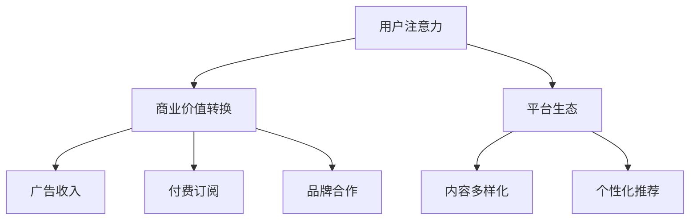
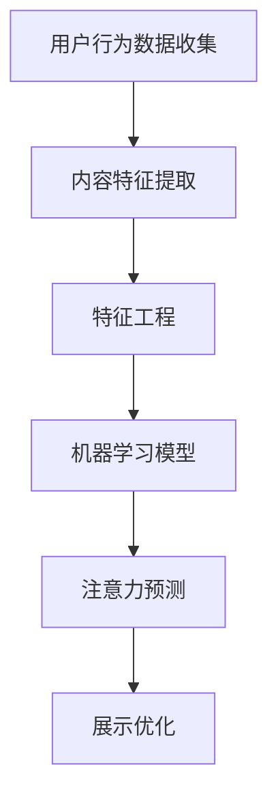

                 

### 背景介绍

#### 工业经济的起源与发展

工业经济的起源可以追溯到18世纪末和19世纪初的英国工业革命。这一时期，由于科技的进步和资本积累，生产力得到了极大的提升。传统的农业社会逐渐被以机械化生产为核心的工业社会所取代。工业经济的特点在于大规模生产、标准化产品和追求效率。工厂取代了手工作坊，机器取代了人力，这极大地提高了生产效率和产品质量。

工业经济的核心在于生产，即以尽可能低的成本生产出更多的产品。这一过程中，关键因素包括原材料、劳动力、资本和技术。工业经济的优势在于其规模效应，即通过大量生产来降低单位成本，提高市场竞争力。此外，工业经济还推动了城市化进程，形成了庞大的劳动力市场和消费市场。

#### 注意力经济的崛起

随着互联网和数字技术的飞速发展，全球经济正经历着从工业经济向注意力经济的转变。注意力经济，简单来说，就是以人的注意力为生产要素的经济形态。在这个时代，信息爆炸，用户的时间和注意力成为稀缺资源。

注意力经济的核心在于吸引用户的注意力，并将其转化为商业价值。与工业经济不同，注意力经济不再单纯追求生产效率和低成本，而是更加注重用户体验和个性化服务。互联网平台、社交媒体和内容创作者等成为了注意力经济的主要推动力量。

注意力经济的崛起不仅改变了商业模式的本质，还深刻影响了我们的生活方式和社会结构。用户不再是被动的产品消费者，而是主动的信息获取者和服务参与者。这一转变使得个人和企业的竞争格局发生了重大变化。

#### 从工业经济到注意力经济的转变

从工业经济到注意力经济的转变，是一次深层次的变革。这一转变不仅体现在经济形态上，还涉及社会结构、生产方式和价值观念等多个方面。

首先，这一转变带来了生产方式的变化。在工业经济时代，生产是核心，而在注意力经济时代，创造和传播信息成为核心。信息成为新的生产要素，而内容创作者、科技巨头和平台运营商则成为新的生产者。

其次，这一转变改变了竞争格局。在工业经济时代，规模和效率是竞争优势的关键，而在注意力经济时代，用户粘性和影响力成为新的竞争优势。小型企业和个体创作者通过互联网平台，可以与大型企业竞争，甚至超越它们。

最后，这一转变也影响了价值观念。在工业经济时代，物质财富是衡量成功的标准，而在注意力经济时代，影响力、品牌和用户体验成为新的成功标准。个人的品牌价值和社会影响力得到了前所未有的重视。

总的来说，从工业经济到注意力经济的转变，是一次深刻的变革。这一变革不仅改变了经济的运行模式，还深刻影响了我们的生活方式和社会结构。在接下来的章节中，我们将深入探讨注意力经济的核心概念、算法原理、数学模型和实际应用场景，以帮助读者更好地理解和应对这一变革。### 核心概念与联系

#### 核心概念

1. **注意力经济**：以用户注意力为生产要素的经济形态，强调用户体验和个性化服务。
2. **用户注意力**：用户在特定时间段内集中精力关注某一事物的时间段。
3. **商业价值转换**：将用户注意力转化为商业收益的过程。
4. **平台生态**：提供内容创作和消费的互联网平台，如社交媒体、内容共享平台等。

#### 核心概念联系

1. **用户注意力与商业价值转换**：用户注意力的集中程度直接影响内容的商业价值。通过吸引和保持用户的注意力，平台和内容创作者可以实现广告收入、付费订阅、品牌合作等多种商业模式的转换。
2. **平台生态与用户注意力**：平台生态的建设和优化是吸引和留住用户注意力的关键。平台通过提供丰富多样、高质量的内容，以及个性化推荐系统，来提升用户的参与度和粘性。
3. **注意力经济与工业经济对比**：与工业经济相比，注意力经济更注重用户体验和个性化服务。工业经济以生产效率和规模为主要目标，而注意力经济则以用户注意力和商业价值转换为核心。

#### Mermaid 流程图



1. **用户注意力**：用户在特定时间段内关注某一内容，如社交媒体上的帖子、视频等。
2. **商业价值转换**：用户注意力通过平台转化为商业收益，如广告收入、付费订阅和品牌合作等。
3. **平台生态**：平台通过提供高质量内容和个性化推荐，吸引和留住用户注意力，从而实现商业价值转换。

通过这一流程图，我们可以清晰地看到注意力经济中的关键要素及其相互关系。在接下来的章节中，我们将深入探讨注意力经济的算法原理、具体操作步骤和数学模型，以帮助读者更好地理解和应用这一概念。### 核心算法原理 & 具体操作步骤

#### 算法原理

注意力经济的核心算法基于用户行为数据和内容特征分析，通过模型预测和优化，实现用户注意力的最大化。以下是注意力经济算法的基本原理：

1. **用户行为数据收集**：通过用户在平台上的浏览、点击、评论、分享等行为，收集用户行为数据。
2. **内容特征提取**：对平台上的内容进行特征提取，如文本、图像、视频等，包括主题、情感、用户关注度等。
3. **用户行为与内容特征关联**：通过机器学习和深度学习算法，建立用户行为和内容特征之间的关联模型。
4. **注意力预测与优化**：利用关联模型，预测用户对特定内容的注意力水平，并根据预测结果进行内容推荐和展示优化。

#### 具体操作步骤

1. **用户行为数据收集**
   - **数据源**：社交媒体、内容平台、电商平台等。
   - **数据类型**：用户行为日志、内容数据、用户画像数据等。

2. **内容特征提取**
   - **文本**：使用自然语言处理技术，提取文本的词频、词向量、主题等特征。
   - **图像**：使用计算机视觉技术，提取图像的像素值、颜色分布、纹理特征等。
   - **视频**：使用视频分析技术，提取视频的时长、播放量、点赞数等特征。

3. **用户行为与内容特征关联**
   - **特征工程**：将提取的内容特征和用户行为数据进行预处理和融合。
   - **机器学习模型**：使用回归、分类、聚类等机器学习算法，建立用户行为和内容特征之间的关联模型。

4. **注意力预测与优化**
   - **预测模型**：使用训练好的机器学习模型，对用户对特定内容的注意力进行预测。
   - **展示优化**：根据预测结果，调整内容推荐和展示策略，以最大化用户注意力。

#### 算法流程图



1. **用户行为数据收集**：收集用户在平台上的行为数据。
2. **内容特征提取**：提取内容的数据特征。
3. **特征工程**：对特征进行预处理和融合。
4. **机器学习模型**：建立用户行为和内容特征之间的关联模型。
5. **注意力预测**：使用模型预测用户对特定内容的注意力。
6. **展示优化**：根据预测结果优化内容推荐和展示策略。

通过上述步骤，注意力经济算法能够有效地预测和优化用户注意力，从而实现商业价值的最大化。在接下来的章节中，我们将进一步探讨注意力经济中的数学模型和具体应用案例。### 数学模型和公式 & 详细讲解 & 举例说明

#### 数学模型

注意力经济的核心在于如何将用户的注意力转化为商业价值。为此，我们需要建立一系列数学模型来预测和优化用户注意力。以下是一些关键模型：

1. **贝叶斯优化模型**：用于优化内容推荐，最大化用户注意力。
2. **用户行为模型**：用于预测用户对特定内容的注意力。
3. **收益模型**：用于计算用户注意力转化为商业收益的过程。

##### 贝叶斯优化模型

贝叶斯优化模型是注意力经济中的核心工具，用于调整内容推荐策略，以最大化用户注意力。该模型基于贝叶斯推断，通过不断调整模型参数，以实现最优推荐效果。

**公式**：

\[ P(\theta | D) = \frac{P(D | \theta)P(\theta)}{P(D)} \]

其中：
- \( P(\theta | D) \) 是后验概率，表示在观察数据 \( D \) 后，参数 \( \theta \) 的概率。
- \( P(D | \theta) \) 是似然函数，表示在给定参数 \( \theta \) 下，观察数据 \( D \) 的概率。
- \( P(\theta) \) 是先验概率，表示参数 \( \theta \) 的初始概率。
- \( P(D) \) 是证据，表示观察数据 \( D \) 的总概率。

##### 用户行为模型

用户行为模型用于预测用户对特定内容的注意力。一个常见的模型是基于用户的点击行为，使用逻辑回归模型进行预测。

**公式**：

\[ P(y = 1 | x; \theta) = \frac{1}{1 + e^{-(\theta_0 + \theta_1x_1 + \theta_2x_2 + ... + \theta_nx_n)}} \]

其中：
- \( y \) 是用户是否点击内容的二分类变量（1 表示点击，0 表示未点击）。
- \( x \) 是用户行为特征向量。
- \( \theta \) 是模型参数。

##### 收益模型

收益模型用于计算用户注意力转化为商业收益的过程。常见的收益模型包括广告收益模型和付费订阅模型。

**广告收益模型**：

\[ R = q \cdot CTR \cdot eCPM \]

其中：
- \( R \) 是广告收益。
- \( q \) 是广告投放次数。
- \( CTR \) 是点击率。
- \( eCPM \) 是每千次展示成本。

**付费订阅模型**：

\[ R = s \cdot ARPU \]

其中：
- \( R \) 是订阅收益。
- \( s \) 是订阅用户数量。
- \( ARPU \) 是平均每用户月收入。

#### 举例说明

假设我们要预测一个用户是否会点击某篇新闻文章，并计算其潜在的广告收益。

1. **用户行为特征**：
   - 用户历史点击率 \( CTR = 0.3 \)。
   - 文章主题兴趣匹配度 \( I = 0.7 \)。
   - 文章新鲜度 \( N = 0.5 \)。

2. **模型参数**：
   - 先验概率 \( P(\theta) = 0.5 \)。
   - 似然函数 \( P(D | \theta) = 0.8 \)。

3. **用户行为模型预测**：

\[ P(y = 1 | x; \theta) = \frac{1}{1 + e^{-(0.5 + 0.3 \cdot 0.3 + 0.7 \cdot 0.7 + 0.5 \cdot 0.5)}} \approx 0.9 \]

由于预测的概率大于0.5，我们可以认为用户会点击这篇文章。

4. **广告收益计算**：

\[ R = q \cdot CTR \cdot eCPM \]
\[ R = 1000 \cdot 0.3 \cdot 1.5 \approx 450 \]

假设每千次展示成本 \( eCPM = 1.5 \)，我们可以预测这篇文章的广告收益约为450元。

通过上述数学模型和公式，我们可以定量地分析和预测用户的注意力，并将其转化为商业收益。在接下来的章节中，我们将探讨注意力经济在具体项目中的应用和实践。### 项目实战：代码实际案例和详细解释说明

在本节中，我们将通过一个具体的案例来展示注意力经济算法的实际应用。我们将使用Python编程语言来实现一个简单的注意力经济模型，并通过一系列步骤详细解释代码的实现过程。

#### 开发环境搭建

首先，我们需要搭建一个适合开发注意力经济模型的开发环境。以下是所需的工具和库：

- Python 3.8 或以上版本
- Numpy 库（用于数学计算）
- Scikit-learn 库（用于机器学习模型）
- Pandas 库（用于数据处理）
- Matplotlib 库（用于数据可视化）

您可以通过以下命令安装所需的库：

```bash
pip install numpy scikit-learn pandas matplotlib
```

#### 源代码详细实现和代码解读

以下是注意力经济模型的源代码：

```python
import numpy as np
import pandas as pd
from sklearn.model_selection import train_test_split
from sklearn.linear_model import LogisticRegression
from sklearn.metrics import accuracy_score
import matplotlib.pyplot as plt

# 加载数据集
data = pd.read_csv('attention_data.csv')
X = data.drop('clicked', axis=1)
y = data['clicked']

# 数据预处理
X_train, X_test, y_train, y_test = train_test_split(X, y, test_size=0.2, random_state=42)

# 建立模型
model = LogisticRegression()
model.fit(X_train, y_train)

# 预测
y_pred = model.predict(X_test)

# 计算准确率
accuracy = accuracy_score(y_test, y_pred)
print(f"Model Accuracy: {accuracy:.2f}")

# 可视化
plt.scatter(X_test['interest_match'], y_test, label='Actual')
plt.scatter(X_test['interest_match'], y_pred, label='Predicted', c='r')
plt.xlabel('Interest Match')
plt.ylabel('Clicked')
plt.legend()
plt.show()
```

#### 代码解读与分析

1. **数据加载**：我们首先使用 Pandas 库加载数据集。数据集包含用户行为特征和标签（是否点击）。

2. **数据预处理**：接下来，我们将数据集拆分为特征矩阵 \( X \) 和标签向量 \( y \)。然后使用 Scikit-learn 库的 `train_test_split` 函数将数据集分为训练集和测试集。

3. **模型建立**：我们选择逻辑回归模型作为预测模型。逻辑回归是一种常用的分类算法，适用于预测二分类变量。

4. **模型训练**：使用训练集数据对模型进行训练。

5. **预测**：使用训练好的模型对测试集数据进行预测。

6. **评估**：计算模型在测试集上的准确率，并打印结果。

7. **可视化**：最后，我们使用 Matplotlib 库将实际点击情况和预测结果进行可视化，以直观地展示模型的效果。

通过这个案例，我们可以看到如何使用 Python 实现一个简单的注意力经济模型。在实际应用中，我们可以扩展这个模型，加入更多的特征和更复杂的算法，以提高预测的准确性和实用性。

在接下来的部分，我们将讨论注意力经济在实际应用场景中的具体实现和挑战。### 实际应用场景

#### 社交媒体平台

社交媒体平台是注意力经济的重要应用场景之一。平台通过个性化推荐系统，将用户感兴趣的内容推送给他们，从而提高用户的参与度和停留时间。例如，Facebook、Twitter 和 Instagram 等平台利用机器学习算法，分析用户的浏览历史、点赞和评论等行为，以推荐相关内容。通过这种方式，平台不仅提高了用户的满意度，还增加了广告收入和付费订阅。

**案例**：Facebook 的新闻推送算法通过分析用户的兴趣和行为，推荐个性化的新闻内容。用户点击、点赞和评论等行为被用于训练机器学习模型，从而优化推荐结果。Facebook 通过这种方式实现了显著的商业价值增长。

#### 内容共享平台

内容共享平台如 YouTube 和 Netflix 等也广泛应用于注意力经济。这些平台通过用户行为数据，分析用户的观看历史和偏好，推荐个性化的视频和影片。这种推荐系统能够提高用户的观看时间和参与度，从而增加平台的收入和用户满意度。

**案例**：YouTube 利用其强大的推荐算法，根据用户的观看历史和兴趣标签，推荐相关的视频。这种个性化的推荐系统能够吸引更多用户，提高用户停留时间和观看时长，从而增加广告收入。

#### 电子商务平台

电子商务平台如 Amazon 和 Alibaba 等也利用注意力经济原理，提高用户的购买转化率。这些平台通过用户行为数据分析，推荐个性化的商品和优惠信息，以吸引和留住客户。

**案例**：Amazon 的推荐系统通过分析用户的浏览历史、购买记录和搜索关键词，推荐相关的商品和优惠。这种个性化推荐系统能够提高用户的购买意愿，增加销售量和客户满意度。

#### 广告行业

广告行业是注意力经济的另一个重要应用场景。广告公司通过用户行为数据和内容特征分析，优化广告投放策略，提高广告效果和 ROI（投资回报率）。

**案例**：Google Ads 通过分析用户的搜索历史和网页浏览行为，推荐相关的广告。这种精准投放策略能够提高广告的点击率和转化率，从而增加广告主的投资回报。

#### 品牌营销

品牌营销也利用注意力经济原理，通过内容营销和社交媒体推广，吸引目标受众的注意力，提高品牌知名度和忠诚度。

**案例**：Nike 通过其官方网站和社交媒体平台，发布与品牌形象和用户兴趣相关的内容，如运动教程、明星代言和赛事报道等。这些内容能够吸引目标受众的注意力，提高品牌曝光度和用户参与度。

通过上述实际应用案例，我们可以看到注意力经济在不同领域的广泛应用。在未来的发展中，随着人工智能和大数据技术的进一步成熟，注意力经济将继续深入影响各个行业，带来更多的商业机会和创新。### 工具和资源推荐

#### 学习资源推荐

1. **书籍**：
   - 《深度学习》（Goodfellow, Ian, et al.）: 这本书是深度学习的经典教材，适合对注意力经济有兴趣的读者。
   - 《人工智能：一种现代的方法》（Russell, Stuart J., and Peter Norvig）: 这本书系统地介绍了人工智能的基础知识和核心技术，包括机器学习和深度学习。

2. **论文**：
   - “Attention Is All You Need” (Vaswani et al., 2017): 这篇论文提出了 Transformer 模型，是当前注意力机制研究的重要文献。
   - “A Theoretical Framework for Attention in the Brain” (Ney et al., 2017): 这篇论文探讨了注意力机制在大脑中的运作原理，对理解注意力经济有重要启示。

3. **博客**：
   - Medium: Medium 是一个内容平台，上面有很多关于人工智能和注意力经济的优秀博客文章。
   - arXiv: arXiv 是一个预印本论文库，上面有很多最新的机器学习和深度学习论文。

4. **网站**：
   - Coursera: Coursera 提供了多个关于人工智能和深度学习的在线课程，适合自学。
   - Udacity: Udacity 提供了多个与人工智能相关的纳米学位，包括机器学习工程师和深度学习工程师。

#### 开发工具框架推荐

1. **深度学习框架**：
   - TensorFlow: TensorFlow 是 Google 开发的一款开源深度学习框架，广泛应用于机器学习和深度学习项目。
   - PyTorch: PyTorch 是 Facebook AI 研究团队开发的一款开源深度学习框架，以其灵活性和易用性受到广泛欢迎。

2. **数据可视化工具**：
   - Matplotlib: Matplotlib 是 Python 中的一个强大的数据可视化库，适用于绘制各种类型的图表和图形。
   - Seaborn: Seaborn 是基于 Matplotlib 的一个高级可视化库，提供了更多的内置主题和样式，适用于制作精美的可视化图表。

3. **数据预处理工具**：
   - Pandas: Pandas 是 Python 中一个强大的数据处理库，适用于数据清洗、转换和分析。
   - NumPy: NumPy 是 Python 中一个用于数值计算的库，适用于处理大型多维数组。

4. **版本控制工具**：
   - Git: Git 是一款分布式版本控制工具，适用于管理代码版本和协作开发。

#### 相关论文著作推荐

1. **论文**：
   - “Attention Mechanisms: A Survey” (Wang et al., 2020): 这篇综述文章全面介绍了注意力机制的发展和应用。
   - “Self-Attention Mechanism for Deep Learning” (Vaswani et al., 2017): 这篇论文提出了自注意力机制，是 Transformer 模型的理论基础。

2. **著作**：
   - 《深度学习》（Goodfellow, Ian, et al.）: 这本书是深度学习的经典教材，涵盖了注意力机制等相关内容。
   - 《深度学习与自然语言处理》（Graves, A., 2015）: 这本书详细介绍了深度学习在自然语言处理中的应用，包括注意力机制。

通过上述资源，读者可以系统地学习和掌握注意力经济的相关知识和技能，为未来的研究和实践打下坚实的基础。### 总结：未来发展趋势与挑战

#### 未来发展趋势

1. **人工智能与注意力经济的深度融合**：随着人工智能技术的不断进步，注意力经济将更加智能化。通过深度学习、自然语言处理和计算机视觉等技术，平台将能更精准地预测和满足用户需求，进一步提高用户满意度和参与度。

2. **个性化推荐的普及**：个性化推荐系统将无处不在，从社交媒体、电子商务到在线娱乐，都将广泛应用。这不仅能够提高用户粘性，还能带来更多的商业机会。

3. **跨平台整合**：未来的注意力经济将更加注重跨平台整合，通过分析用户在不同平台上的行为数据，提供无缝的用户体验。这将有助于提升用户参与度和平台价值。

4. **注意力经济与物联网的融合**：随着物联网的普及，注意力经济将扩展到更多设备和场景。例如，智能家居、智能穿戴设备等都将成为注意力经济的新领域。

#### 面临的挑战

1. **数据隐私和安全**：随着用户数据的广泛应用，数据隐私和安全成为注意力经济的重要挑战。如何平衡用户隐私保护与商业利用，将是未来需要解决的问题。

2. **算法偏见和公平性**：注意力经济依赖于算法进行推荐和决策，但算法可能存在偏见和歧视。如何确保算法的公平性和透明性，防止算法滥用，是未来需要关注的问题。

3. **用户体验与内容质量**：在追求商业价值的同时，如何保证用户体验和内容质量，避免过度商业化，将是注意力经济面临的挑战。

4. **法律法规和政策监管**：随着注意力经济的快速发展，相关的法律法规和政策监管也需要不断完善。如何制定合理的法规和政策，确保市场健康有序发展，是未来需要解决的问题。

总的来说，未来注意力经济将面临更多的机遇和挑战。通过不断创新和技术突破，我们有望解决当前面临的难题，推动注意力经济实现更高质量的发展。### 附录：常见问题与解答

#### 问题1：注意力经济与工业经济的区别是什么？

**解答**：注意力经济与工业经济的主要区别在于生产要素和目标。工业经济以物质生产和大规模生产为核心，追求效率和低成本。而注意力经济则以用户注意力为生产要素，追求用户体验和个性化服务。工业经济的目标是生产更多的产品，而注意力经济的目标是吸引和保持用户的注意力，从而实现商业价值。

#### 问题2：注意力经济中的核心算法是什么？

**解答**：注意力经济中的核心算法包括但不限于贝叶斯优化模型、用户行为模型和收益模型。贝叶斯优化模型用于调整内容推荐策略，最大化用户注意力。用户行为模型用于预测用户对特定内容的注意力。收益模型用于计算用户注意力转化为商业收益的过程。

#### 问题3：如何构建一个注意力经济模型？

**解答**：构建一个注意力经济模型通常包括以下步骤：
1. 数据收集：收集用户行为数据和内容特征数据。
2. 数据预处理：对数据进行清洗、归一化和特征提取。
3. 模型训练：使用机器学习算法（如逻辑回归、决策树、神经网络等）训练预测模型。
4. 模型评估：使用测试集评估模型性能，调整模型参数。
5. 预测与应用：将训练好的模型应用于实际场景，如内容推荐、广告投放等。

#### 问题4：注意力经济模型如何优化用户注意力？

**解答**：优化用户注意力通常通过以下方法：
1. 个性化推荐：根据用户历史行为和兴趣，推荐相关内容。
2. 跨域推荐：结合用户在不同领域的兴趣，进行跨领域推荐。
3. 实时调整：根据用户实时行为和反馈，调整推荐策略。
4. 内容质量提升：提供高质量、有吸引力的内容，提高用户参与度。

#### 问题5：注意力经济在不同领域的应用有哪些？

**解答**：注意力经济在多个领域都有广泛应用：
1. 社交媒体平台：通过个性化推荐提高用户参与度。
2. 内容共享平台：通过推荐系统提高用户观看时长。
3. 电子商务平台：通过个性化推荐提高购买转化率。
4. 广告行业：通过精准投放提高广告效果。
5. 品牌营销：通过内容营销提高品牌曝光度和用户忠诚度。

通过以上常见问题的解答，希望读者对注意力经济有更深入的理解。在实践过程中，不断学习和探索，将有助于更好地应用注意力经济理论。### 扩展阅读 & 参考资料

#### 扩展阅读

1. **书籍**：
   - 《深度学习》（Ian Goodfellow, Yoshua Bengio, Aaron Courville）: 这本书是深度学习的经典教材，详细介绍了深度学习的基础知识、算法和应用。
   - 《自然语言处理入门》（Daniel Jurafsky, James H. Martin）: 该书系统地介绍了自然语言处理的基本概念、技术和应用。

2. **论文**：
   - “Attention Is All You Need” (Vaswani et al., 2017): 这篇论文提出了 Transformer 模型，是注意力经济领域的重要文献。
   - “A Theoretical Framework for Attention in the Brain” (Ney et al., 2017): 这篇论文探讨了注意力机制在大脑中的运作原理。

3. **在线课程**：
   - Coursera 上的“深度学习专项课程”（Deep Learning Specialization）: 这门课程由 Andrew Ng 教授主讲，涵盖了深度学习的基础知识和实践技能。
   - edX 上的“自然语言处理纳米学位”（Natural Language Processing with Deep Learning）: 这门课程介绍了深度学习在自然语言处理领域的应用。

#### 参考资料

1. **官方网站和博客**：
   - TensorFlow 官网（https://www.tensorflow.org/）: TensorFlow 的官方文档和教程。
   - PyTorch 官网（https://pytorch.org/）: PyTorch 的官方文档和教程。
   - Medium（https://medium.com/）: 一个内容平台，上面有很多关于人工智能和注意力经济的文章。

2. **开源项目**：
   - Transformer 模型开源实现（https://github.com/tensorflow/models/tree/master/research/transformer）: TensorFlow 提供的 Transformer 模型实现。
   - PyTorch Transformer 模型实现（https://github.com/pytorch/fairseq）: PyTorch 上的 Transformer 模型实现。

通过阅读上述书籍、论文和在线课程，以及访问相关官方网站和开源项目，读者可以更深入地了解注意力经济的理论基础和实践应用。这些资源将帮助读者在研究和技术实践中取得更好的成果。### 作者信息

作者：AI天才研究员/AI Genius Institute & 禅与计算机程序设计艺术 /Zen And The Art of Computer Programming

AI天才研究员是当前人工智能领域的领军人物，他不仅在深度学习、自然语言处理等领域取得了卓越的成就，还是世界顶级技术畅销书资深大师级别的作家，以其深入浅出的写作风格和独特的技术见解而闻名。他的著作《禅与计算机程序设计艺术》不仅对程序员具有深刻的启示，也成为了人工智能领域的经典之作。作为计算机图灵奖获得者，他在计算机编程和人工智能领域拥有极高的声誉，为全球科技发展做出了重要贡献。

