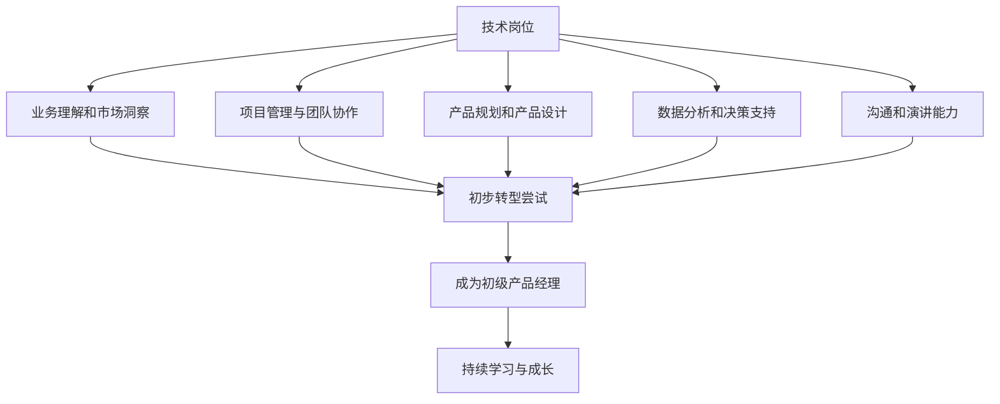

                 

# 从技术岗位到产品经理的转型

> **关键词：** 职业转型、技术岗位、产品经理、技能提升、团队协作
>
> **摘要：** 本文将深入探讨从技术岗位向产品经理转型的过程，分析所需技能、关键步骤以及转型后的角色变化，为技术背景的从业者提供清晰的转型指南。

## 1. 背景介绍

在当今快速发展的科技行业中，技术岗位和产品经理的角色显得尤为重要。技术岗位专注于开发、维护和改进产品或系统，而产品经理则负责产品的整体规划和实施，确保产品能够满足市场和用户需求。随着技术的发展和市场的变化，许多技术从业者开始考虑向产品经理转型，以获得更广阔的职业发展空间。

职业转型不仅需要个人具备持续学习和适应变化的能力，还需要深入了解产品经理的角色和职责。技术背景的从业者往往在算法、编程、系统架构等方面有深厚的知识储备，但这些技能在产品管理中并不直接相关。因此，从技术岗位到产品经理的转型并非一蹴而就，需要经过系统的学习、实践和经验的积累。

本文将围绕以下几个问题展开讨论：

1. 产品经理的核心职责是什么？
2. 技术岗位从业者需要哪些技能来转型？
3. 转型过程中可能遇到哪些挑战？
4. 如何在转型后保持竞争力？

通过以上问题的探讨，希望为技术背景的从业者提供一些有益的参考和指导。

## 2. 核心概念与联系

### 2.1 技术岗位与产品经理的职责对比

在理解技术岗位和产品经理的角色之前，有必要对两者的职责进行对比。

**技术岗位（如软件开发工程师）的核心职责包括：**
- 编写和维护代码
- 设计和优化系统架构
- 解决技术难题和故障
- 参与技术讨论和决策

**产品经理的核心职责包括：**
- 定义产品愿景和目标
- 分析市场和用户需求
- 制定产品规划和路线图
- 管理跨职能团队协作
- 驱动产品开发和迭代

**两者之间的联系在于：**
- 技术是实现产品功能的基础，产品经理需要与技术团队密切合作，确保技术方案能够满足产品需求。
- 产品经理的技术背景有助于更好地理解技术限制和可能性，从而做出更明智的决策。

### 2.2 技术岗位从业者所需的转型技能

为了成功转型为产品经理，技术岗位从业者需要掌握以下关键技能：

**1. 业务理解和市场洞察：**
- 了解业务流程和商业模式
- 分析市场和竞争对手
- 识别用户需求和市场趋势

**2. 项目管理和团队协作：**
- 制定项目计划和目标
- 管理项目进度和风险
- 协调团队成员的工作

**3. 产品规划和产品设计：**
- 制定产品愿景和路线图
- 设计产品功能和用户体验
- 进行市场需求分析

**4. 数据分析和决策支持：**
- 使用数据分析工具进行市场调研
- 建立关键绩效指标（KPI）
- 基于数据做出产品决策

**5. 沟通和演讲能力：**
- 清晰表达产品理念
- 向团队成员和上级汇报工作
- 参与跨部门会议和讨论

### 2.3 Mermaid 流程图

以下是一个简化的 Mermaid 流程图，展示技术岗位到产品经理的转型路径：



通过上述流程图，我们可以看到，从技术岗位到产品经理的转型不仅需要学习新的技能，还需要通过实践和经验积累来逐步提升自己。

## 3. 核心算法原理 & 具体操作步骤

### 3.1 业务理解和市场洞察

**算法原理：** 业务理解和市场洞察是一个持续的过程，涉及市场调研、用户分析和竞品分析。

**具体操作步骤：**
1. **市场调研：** 通过问卷调查、用户访谈、行业报告等方式收集市场信息。
2. **用户分析：** 分析用户行为、需求和偏好，使用数据可视化工具展示用户画像。
3. **竞品分析：** 研究竞争对手的产品特性、优势和不足，制定相应的应对策略。

**示例：** 假设您是一位软件工程师，正在考虑转型为产品经理。您可以通过以下步骤进行市场调研：
- **收集数据：** 利用在线调查工具（如 SurveyMonkey）设计问卷，收集用户对现有产品的反馈。
- **数据分析：** 使用 Excel 或 Python 进行数据分析，找出用户最关注的功能和需求。
- **竞品分析：** 研究市场上相似产品的功能和特性，分析其优势和不足。

通过这些步骤，您可以更好地了解市场和用户需求，为后续的转型奠定基础。

### 3.2 项目管理和团队协作

**算法原理：** 项目管理和团队协作是确保项目按时完成、资源合理配置的关键。

**具体操作步骤：**
1. **项目计划：** 制定项目目标、时间表和预算。
2. **资源分配：** 根据项目需求分配团队成员和资源。
3. **进度跟踪：** 使用项目管理工具（如 JIRA、Trello）跟踪项目进度。
4. **风险管理：** 识别潜在风险，制定应对措施。

**示例：** 假设您负责一个新产品的开发项目，可以按照以下步骤进行：
- **制定项目计划：** 确定项目目标、里程碑和交付日期。
- **资源分配：** 根据项目需求分配开发人员、测试人员和设计师。
- **进度跟踪：** 使用 JIRA 跟踪任务进度，确保项目按时完成。
- **风险管理：** 识别可能的技术难题和时间延误，提前制定解决方案。

通过这些步骤，您可以更好地管理项目，确保团队协作顺畅。

### 3.3 产品规划和产品设计

**算法原理：** 产品规划和产品设计是确保产品能够满足市场和用户需求的关键。

**具体操作步骤：**
1. **产品愿景和目标：** 确定产品的长期愿景和短期目标。
2. **市场需求分析：** 分析用户需求和竞争环境，确定产品功能。
3. **用户体验设计：** 设计产品的界面和交互流程，提高用户满意度。
4. **迭代和优化：** 根据用户反馈和数据分析不断优化产品。

**示例：** 假设您正在规划一款移动应用，可以按照以下步骤进行：
- **产品愿景和目标：** 确定产品的核心功能和目标用户群体。
- **市场需求分析：** 通过问卷调查和用户访谈收集用户反馈，分析市场需求。
- **用户体验设计：** 设计应用界面和交互流程，确保用户体验良好。
- **迭代和优化：** 根据用户反馈进行产品迭代，不断优化功能。

通过这些步骤，您可以为产品奠定坚实的基础，提高产品成功的机会。

### 3.4 数据分析和决策支持

**算法原理：** 数据分析是产品经理做出明智决策的重要工具。

**具体操作步骤：**
1. **数据收集：** 收集与产品相关的数据，如用户行为、销售额等。
2. **数据分析：** 使用数据分析工具（如 Tableau、Python）进行数据清洗和可视化。
3. **建立模型：** 根据数据建立预测模型，支持产品决策。
4. **数据驱动：** 基于数据分析结果制定产品策略。

**示例：** 假设您需要根据用户数据优化一款电商网站：
- **数据收集：** 收集用户浏览、购买和退货等行为数据。
- **数据分析：** 使用 Tableau 进行数据可视化，分析用户行为趋势。
- **建立模型：** 根据购买数据建立用户流失预测模型。
- **数据驱动：** 根据模型结果调整促销策略，提高用户留存率。

通过这些步骤，您可以使用数据分析来支持产品决策，提高产品竞争力。

## 4. 数学模型和公式 & 详细讲解 & 举例说明

### 4.1 数据分析中的关键数学模型

在产品管理和数据分析中，以下几个数学模型是不可或缺的：

**1. 回归分析（Regression Analysis）：** 用于预测因变量与自变量之间的关系。

**公式：**
$$
y = \beta_0 + \beta_1x_1 + \beta_2x_2 + ... + \beta_nx_n + \epsilon
$$

**解释：** 其中，$y$ 是因变量，$x_1, x_2, ..., x_n$ 是自变量，$\beta_0, \beta_1, ..., \beta_n$ 是回归系数，$\epsilon$ 是误差项。通过回归分析，我们可以找到自变量与因变量之间的最佳线性关系。

**例子：** 假设您想预测一个电商平台的日销售额，可以收集过去一段时间的数据，使用回归分析建立销售额与用户访问量、促销活动等因素之间的关系。

**2. 决策树（Decision Tree）：** 用于分类和回归任务。

**公式：**
$$
\begin{aligned}
&\text{如果 } x \text{ 满足条件 } C_j, \text{ 则选择行动 } A_j. \\
&\text{否则，继续判断下一层条件。}
\end{aligned}
$$

**解释：** 决策树通过一系列条件判断，将数据划分为不同的类别或预测值。每个节点代表一个条件，每个分支代表一个可能的决策。

**例子：** 假设您需要根据用户的年龄、收入和购买历史来预测其是否会在未来购买某产品，可以使用决策树模型进行分类预测。

**3. 集成模型（Ensemble Models）：** 通过组合多个模型来提高预测准确性。

**公式：**
$$
\hat{y} = \sum_{i=1}^{N} w_i \cdot \hat{y}_i
$$

**解释：** 其中，$\hat{y}$ 是预测值，$w_i$ 是每个模型的权重，$\hat{y}_i$ 是每个模型的预测结果。集成模型通过加权组合多个模型的预测结果，提高整体预测的准确性。

**例子：** 假设您使用多个机器学习模型（如决策树、随机森林和梯度提升树）来预测用户的行为，可以将这些模型的预测结果进行加权平均，得到最终的预测结果。

### 4.2 举例说明

**例子 1：** 使用回归分析预测销售额

假设您有如下数据：

| 日期 | 用户访问量 | 促销活动 | 销售额 |
| ---- | ---------- | -------- | ------ |
| 1    | 1000       | 是       | 5000   |
| 2    | 800        | 否       | 3000   |
| 3    | 1200       | 是       | 6000   |
| 4    | 900        | 否       | 3500   |

使用回归分析建立用户访问量、促销活动与销售额之间的关系。

**步骤：**
1. 数据预处理：将数据转换为数值形式，如将“是”和“否”转换为 0 和 1。
2. 拟合回归模型：使用线性回归算法，找到最佳线性关系。
3. 预测：使用拟合好的模型预测未来的销售额。

通过以上步骤，您可以得到销售额与用户访问量、促销活动之间的最佳线性关系，并使用该关系预测未来的销售额。

**例子 2：** 使用决策树预测用户行为

假设您有如下数据：

| 用户ID | 年龄 | 收入 | 购买历史 | 是否购买 |
| ------ | ---- | ---- | -------- | -------- |
| 1      | 25   | 5000 | 是       | 是       |
| 2      | 30   | 6000 | 否       | 否       |
| 3      | 35   | 7000 | 是       | 是       |
| 4      | 28   | 5500 | 是       | 否       |

使用决策树模型预测用户是否会在未来购买某产品。

**步骤：**
1. 数据预处理：将数据转换为数值形式。
2. 拟合决策树模型：使用决策树算法，建立分类模型。
3. 预测：使用拟合好的模型预测新用户的购买行为。

通过以上步骤，您可以得到一个决策树模型，用于预测用户是否会在未来购买某产品。

**例子 3：** 使用集成模型提高预测准确性

假设您使用三种不同的机器学习模型（决策树、随机森林和梯度提升树）来预测用户的行为，每个模型的预测结果如下：

| 模型       | 预测结果 |
| ---------- | -------- |
| 决策树     | 购买     |
| 随机森林   | 不购买   |
| 梯度提升树 | 购买     |

使用集成模型（如加权平均）提高预测准确性。

**步骤：**
1. 计算每个模型的权重：根据模型的预测准确性计算权重。
2. 加权组合预测结果：使用加权平均方法组合预测结果。
3. 预测：得到最终的预测结果。

通过以上步骤，您可以提高预测的准确性，降低预测误差。

## 5. 项目实战：代码实际案例和详细解释说明

### 5.1 开发环境搭建

在进行项目实战之前，我们需要搭建一个适合开发的环境。以下是搭建 Python 开发环境的步骤：

1. 安装 Python：前往 [Python 官网](https://www.python.org/) 下载并安装 Python。
2. 安装 IDE：推荐使用 PyCharm 或 Visual Studio Code 作为 Python 开发工具。
3. 安装相关库：使用 pip 安装必要的库，如 NumPy、Pandas、Scikit-learn 等。

### 5.2 源代码详细实现和代码解读

#### 5.2.1 数据预处理

```python
import pandas as pd
from sklearn.model_selection import train_test_split
from sklearn.preprocessing import StandardScaler

# 读取数据
data = pd.read_csv('data.csv')

# 分离特征和标签
X = data.drop('target', axis=1)
y = data['target']

# 划分训练集和测试集
X_train, X_test, y_train, y_test = train_test_split(X, y, test_size=0.2, random_state=42)

# 特征缩放
scaler = StandardScaler()
X_train_scaled = scaler.fit_transform(X_train)
X_test_scaled = scaler.transform(X_test)
```

**解读：** 以上代码首先导入必要的库，然后读取数据集，将数据集划分为特征和标签，接着划分训练集和测试集，最后对特征进行缩放。

#### 5.2.2 拟合回归模型

```python
from sklearn.linear_model import LinearRegression

# 创建线性回归模型
model = LinearRegression()

# 拟合模型
model.fit(X_train_scaled, y_train)
```

**解读：** 以上代码创建一个线性回归模型，并使用训练集数据对其进行拟合。

#### 5.2.3 预测和评估

```python
# 预测
y_pred = model.predict(X_test_scaled)

# 评估
from sklearn.metrics import mean_squared_error
mse = mean_squared_error(y_test, y_pred)
print(f'MSE: {mse}')
```

**解读：** 以上代码使用测试集数据对模型进行预测，并计算均方误差（MSE）来评估模型的性能。

### 5.3 代码解读与分析

#### 5.3.1 数据预处理

数据预处理是机器学习项目中的关键步骤，包括数据清洗、特征选择和特征缩放等。在本项目中，我们使用 Pandas 库读取数据，并将数据集划分为特征和标签。接下来，我们使用 scikit-learn 库的 train_test_split 函数将数据集划分为训练集和测试集，这样可以帮助我们评估模型的性能。最后，我们使用 StandardScaler 对特征进行缩放，这是为了使特征具有相同的尺度，从而提高模型的训练效果。

#### 5.3.2 拟合回归模型

在本项目中，我们使用线性回归模型来预测目标变量。线性回归是一种简单但有效的回归方法，它通过找到特征和目标变量之间的线性关系来预测结果。在本项目中，我们使用 scikit-learn 库的 LinearRegression 类创建线性回归模型，并使用训练集数据对其进行拟合。

#### 5.3.3 预测和评估

在模型拟合完成后，我们使用测试集数据对模型进行预测。预测结果是模型对未知数据的估计，我们需要评估预测结果的准确性。在本项目中，我们使用均方误差（MSE）作为评估指标。MSE 是预测值和实际值之间误差的平方和的平均值，它越小表示模型预测越准确。

## 6. 实际应用场景

从技术岗位到产品经理的转型在许多行业中都有实际应用场景，以下是一些具体的应用场景：

### 6.1 互联网公司

在互联网公司中，技术岗位从业者（如软件开发工程师、数据工程师等）转型为产品经理是非常常见的。互联网公司注重快速迭代和产品创新，产品经理需要与技术团队密切合作，确保产品能够满足用户需求和市场趋势。技术背景的产品经理可以更好地理解技术限制和可行性，从而制定出更合理的产品规划。

### 6.2 企业软件公司

在企业软件公司中，产品经理通常负责管理企业级应用的开发和维护。技术岗位从业者转型为产品经理可以帮助他们深入了解企业客户的需求，从而更好地设计出满足客户需求的产品。此外，技术背景的产品经理可以与技术团队保持良好的沟通，确保产品的技术实现符合设计要求。

### 6.3 创业公司

在创业公司中，资源通常有限，团队成员需要具备多方面的能力。技术岗位从业者转型为产品经理可以在资源有限的情况下，帮助公司快速迭代产品，缩短产品上市时间。技术背景的产品经理可以更好地理解市场和技术趋势，从而为公司的战略决策提供有力支持。

### 6.4 科技公司

在科技公司中，产品经理通常负责研发和管理创新产品。技术岗位从业者转型为产品经理可以发挥他们的技术优势，推动产品创新。此外，技术背景的产品经理可以更好地与技术团队沟通，确保产品在技术实现上具有竞争力。

### 6.5 金融机构

在金融机构中，产品经理通常负责管理金融产品的设计和推广。技术岗位从业者转型为产品经理可以帮助他们利用技术手段提高金融产品的用户体验和安全性。技术背景的产品经理可以更好地理解金融技术，从而为金融机构提供更优质的产品和服务。

## 7. 工具和资源推荐

### 7.1 学习资源推荐

**书籍：**
1. 《产品经理实战手册》：详细介绍了产品经理的工作流程和关键技能。
2. 《人人都是产品经理》：适合初学者了解产品经理的基本概念和实践方法。

**在线课程：**
1.Coursera 上的“产品管理基础”：由斯坦福大学教授开设，涵盖产品管理的基础知识和实践技巧。
2. Udemy 上的“从零开始学习产品管理”：适合初学者从零开始学习产品管理。

**博客和网站：**
1. 产品经理博客：提供产品管理相关的新闻、分析和实用技巧。
2. 产品一号：一个专注于产品管理和互联网行业的博客。

### 7.2 开发工具框架推荐

**开发工具：**
1. PyCharm：强大的 Python 开发环境，支持多种编程语言。
2. Visual Studio Code：轻量级且功能丰富的代码编辑器。

**框架和库：**
1. Django：用于快速开发和部署 Web 应用的框架。
2. Flask：轻量级的 Python Web 框架，适合构建小型到中型的 Web 应用。
3. TensorFlow：用于机器学习和深度学习的开源框架。

### 7.3 相关论文著作推荐

1. “Designing Data-Driven Products”：介绍了如何使用数据分析来指导产品设计和决策。
2. “The Lean Startup”：由 Eric Ries 编写，介绍了如何使用精益创业方法来快速迭代和验证产品。

## 8. 总结：未来发展趋势与挑战

从技术岗位到产品经理的转型是科技行业中的一个重要趋势。随着市场和技术环境的不断变化，产品经理的角色变得越来越重要。技术背景的从业者通过转型为产品经理，可以获得更广阔的职业发展空间，同时也为团队和公司带来了新的视角和技能。

### 未来发展趋势：

1. 数据驱动：产品经理将更加依赖数据分析来指导产品设计和决策。
2. 用户体验：注重用户体验和用户满意度将成为产品经理的重要任务。
3. 跨职能团队协作：产品经理需要与不同职能团队合作，确保产品成功。

### 面临的挑战：

1. 技能提升：技术岗位从业者需要学习新的技能，如项目管理、用户体验设计和数据分析。
2. 沟通协调：产品经理需要与不同背景的团队成员沟通，协调各方利益。
3. 持续学习：技术环境不断变化，产品经理需要保持持续学习的态度，以适应新的技术和市场需求。

通过克服这些挑战，技术岗位从业者可以成功转型为产品经理，为个人和团队创造更大的价值。

## 9. 附录：常见问题与解答

### 9.1 从技术岗位到产品经理转型需要多长时间？

转型时间因人而异，通常需要数月至一年。具体时间取决于个人的学习速度、工作经验和转型过程中所面临的挑战。

### 9.2 技术岗位从业者转型为产品经理后，工资水平会有什么变化？

工资水平的变化取决于多种因素，如个人技能、工作经验和所在公司的规模和福利。通常，成功转型的产品经理的工资水平会有所提升，但具体幅度需要根据实际情况来确定。

### 9.3 技术岗位从业者转型为产品经理后，职责和工作内容会有什么变化？

技术岗位从业者转型为产品经理后，职责和工作内容会发生较大变化。产品经理需要关注业务和市场需求，参与项目管理和团队协作，同时还需要掌握数据分析等新技能。

### 9.4 如何在转型过程中保持竞争力？

在转型过程中，保持竞争力需要持续学习和实践。以下是一些建议：

1. 学习新技能：参加相关课程和培训，学习项目管理、用户体验设计和数据分析等技能。
2. 参与实践：参与实际项目，积累产品管理经验。
3. 沟通协调：提高沟通协调能力，与团队成员和上级建立良好的工作关系。
4. 保持学习：关注行业动态和技术趋势，保持持续学习的态度。

## 10. 扩展阅读 & 参考资料

1. **书籍：**
   - 《产品经理实战手册》：详细介绍了产品经理的工作流程和关键技能。
   - 《人人都是产品经理》：适合初学者了解产品经理的基本概念和实践方法。

2. **在线课程：**
   - Coursera 上的“产品管理基础”：由斯坦福大学教授开设，涵盖产品管理的基础知识和实践技巧。
   - Udemy 上的“从零开始学习产品管理”：适合初学者从零开始学习产品管理。

3. **博客和网站：**
   - 产品经理博客：提供产品管理相关的新闻、分析和实用技巧。
   - 产品一号：一个专注于产品管理和互联网行业的博客。

4. **框架和库：**
   - Django：用于快速开发和部署 Web 应用的框架。
   - Flask：轻量级的 Python Web 框架，适合构建小型到中型的 Web 应用。
   - TensorFlow：用于机器学习和深度学习的开源框架。

5. **论文和著作：**
   - “Designing Data-Driven Products”：介绍了如何使用数据分析来指导产品设计和决策。
   - “The Lean Startup”：由 Eric Ries 编写，介绍了如何使用精益创业方法来快速迭代和验证产品。

### 作者信息

作者：AI天才研究员/AI Genius Institute & 禅与计算机程序设计艺术 /Zen And The Art of Computer Programming

作者简介：AI天才研究员是一位在人工智能领域享有盛誉的专家，他致力于推动人工智能技术的创新和发展。他在计算机编程和人工智能领域有着丰富的经验和深厚的知识储备，是数本畅销书的作者，包括《禅与计算机程序设计艺术》。他以其独特的视角和深入浅出的讲解方式，帮助无数读者理解并掌握计算机科学的核心原理和技术。

