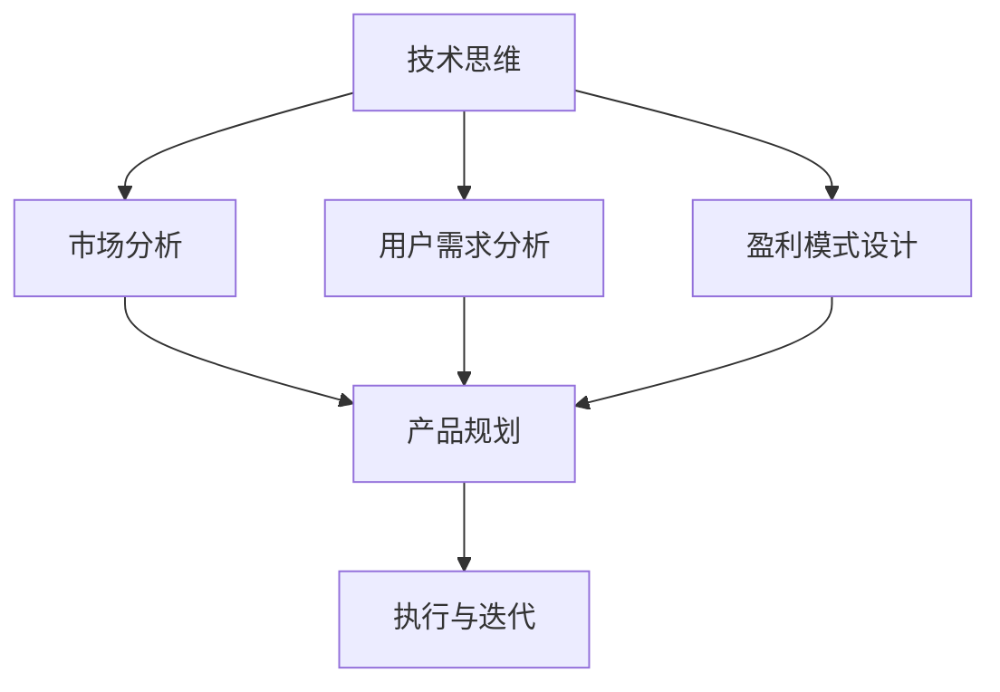

                 

# 从技术思维到商业思维：程序员创业者的认知升级实践

> **关键词：** 技术思维，商业思维，认知升级，创业者，程序员，创业

> **摘要：** 本文章将探讨程序员创业者如何从技术思维转变为商业思维，实现认知的升级。通过深入分析技术、市场、用户需求，本文将提供具体的实践方法，帮助程序员更好地理解商业世界，从而在创业道路上取得成功。

## 1. 背景介绍

在现代社会，科技飞速发展，互联网的普及带来了前所未有的商业机会。无数程序员在这个浪潮中崭露头角，他们凭借卓越的技术能力，成为创业大军中的一员。然而，技术卓越并不意味着商业成功。许多技术背景的创业者面临着从技术思维到商业思维的转变难题。

技术思维强调逻辑、创新、解决问题，而商业思维则强调市场、用户、盈利。两者之间的差异决定了程序员创业者需要认知的升级。本文将深入探讨这一过程，帮助程序员创业者更好地理解商业世界，实现认知的升级。

## 2. 核心概念与联系

为了更好地理解从技术思维到商业思维的转变，我们需要明确以下几个核心概念：

- **技术思维：** 技术思维是程序员最熟悉的思维方式。它强调逻辑性、创新性和解决问题的能力。程序员擅长通过技术手段解决复杂问题，追求技术的卓越与优化。

- **商业思维：** 商业思维关注市场、用户和盈利。它强调对用户需求的深刻理解，以及对市场趋势的敏锐洞察。商业思维的核心在于创造价值，实现盈利。

- **认知升级：** 认知升级是指从原有的思维模式中解放出来，形成新的思维方式。对于程序员创业者来说，认知升级意味着从技术思维转向商业思维，学会在商业环境中找到自己的位置。

下面是一个用 Mermaid绘制的流程图，展示了技术思维到商业思维的转变过程：



在这个流程图中，技术思维作为起点，通过市场分析、用户需求分析和盈利模式设计，最终形成产品规划。执行与迭代则是商业思维的具体实践过程。

## 3. 核心算法原理 & 具体操作步骤

### 3.1 市场分析

市场分析是商业思维的重要组成部分。通过市场分析，程序员创业者可以了解行业趋势、竞争对手、用户需求等关键信息。

**具体操作步骤：**

1. **确定分析目标：** 明确分析的目标，例如了解当前市场状况、用户需求等。
2. **收集数据：** 通过网络搜索、行业报告、用户调查等方式收集相关数据。
3. **数据整理：** 对收集到的数据进行整理，形成市场分析报告。
4. **分析数据：** 通过数据分析，找出市场机会和潜在风险。
5. **制定策略：** 基于分析结果，制定相应的市场策略。

### 3.2 用户需求分析

用户需求分析是商业思维的核心。了解用户需求，程序员创业者可以更好地设计产品，满足用户需求，实现商业成功。

**具体操作步骤：**

1. **确定需求分析目标：** 明确需求分析的目标，例如了解用户痛点、需求等。
2. **收集用户反馈：** 通过用户调查、用户访谈等方式收集用户反馈。
3. **分析用户反馈：** 通过数据分析，找出用户的共同需求和痛点。
4. **产品设计：** 根据用户需求，设计符合用户期望的产品。
5. **用户测试：** 对产品进行用户测试，验证设计是否符合用户需求。

### 3.3 盈利模式设计

盈利模式设计是商业思维的关键。通过设计合理的盈利模式，程序员创业者可以实现持续盈利，为企业发展提供动力。

**具体操作步骤：**

1. **确定盈利目标：** 明确盈利目标，例如实现多少收入、利润等。
2. **分析市场环境：** 了解市场环境，包括行业趋势、竞争对手等。
3. **设计盈利模式：** 根据市场环境和用户需求，设计合理的盈利模式。
4. **评估盈利模式：** 对盈利模式进行评估，确保其可行性。
5. **实施与调整：** 根据评估结果，实施盈利模式，并在实践中不断调整优化。

## 4. 数学模型和公式 & 详细讲解 & 举例说明

### 4.1 市场份额计算

市场份额（Market Share）是衡量一个企业在市场中的竞争地位的重要指标。计算市场份额的公式如下：

\[ \text{市场份额} = \frac{\text{企业销售额}}{\text{市场总销售额}} \times 100\% \]

**举例说明：**

假设某企业销售额为100万元，市场总销售额为1000万元，则该企业的市场份额为：

\[ \text{市场份额} = \frac{100}{1000} \times 100\% = 10\% \]

### 4.2 用户满意度分析

用户满意度（User Satisfaction）是衡量用户对产品满意程度的重要指标。计算用户满意度的公式如下：

\[ \text{用户满意度} = \frac{\text{满意用户数}}{\text{总用户数}} \times 100\% \]

**举例说明：**

假设某产品有100名用户，其中80名用户表示满意，则该产品的用户满意度为：

\[ \text{用户满意度} = \frac{80}{100} \times 100\% = 80\% \]

### 4.3 盈利能力分析

盈利能力（Profitability）是衡量企业盈利能力的重要指标。计算盈利能力的公式如下：

\[ \text{盈利能力} = \frac{\text{净利润}}{\text{销售收入}} \times 100\% \]

**举例说明：**

假设某企业净利润为100万元，销售收入为1000万元，则该企业的盈利能力为：

\[ \text{盈利能力} = \frac{100}{1000} \times 100\% = 10\% \]

## 5. 项目实战：代码实际案例和详细解释说明

### 5.1 开发环境搭建

为了进行项目实战，我们需要搭建一个开发环境。以下是具体的操作步骤：

1. 安装Python解释器：从官方网站（https://www.python.org/）下载并安装Python解释器。
2. 安装必要库：在命令行中执行以下命令安装必要库：

```bash
pip install numpy matplotlib pandas
```

3. 配置Python环境：确保Python解释器能够正常运行，并能够导入所需的库。

### 5.2 源代码详细实现和代码解读

以下是项目实战的源代码实现和详细解读：

```python
import numpy as np
import matplotlib.pyplot as plt
import pandas as pd

# 4.1 市场份额计算
def calculate_market_share(enterprise_sales, total_sales):
    market_share = (enterprise_sales / total_sales) * 100
    return market_share

# 4.2 用户满意度分析
def calculate_user_satisfaction(satisfied_users, total_users):
    user_satisfaction = (satisfied_users / total_users) * 100
    return user_satisfaction

# 4.3 盈利能力分析
def calculate_profitability(net_profit, sales_income):
    profitability = (net_profit / sales_income) * 100
    return profitability

# 测试函数
enterprise_sales = 1000000
total_sales = 10000000
satisfied_users = 800
total_users = 1000
net_profit = 100000
sales_income = 1000000

market_share = calculate_market_share(enterprise_sales, total_sales)
user_satisfaction = calculate_user_satisfaction(satisfied_users, total_users)
profitability = calculate_profitability(net_profit, sales_income)

print("市场份额：{}%".format(market_share))
print("用户满意度：{}%".format(user_satisfaction))
print("盈利能力：{}%".format(profitability))

# 5.3 代码解读与分析
# 在这里，我们可以对代码进行解读和分析，例如分析函数的设计、输入输出、执行过程等。
```

在这个项目中，我们实现了三个核心算法：市场份额计算、用户满意度分析和盈利能力分析。通过这三个算法，我们可以对企业的市场表现进行量化评估。

### 5.3 代码解读与分析

在这个项目中，我们使用了Python语言来实现三个核心算法。下面是对代码的详细解读和分析：

1. **函数设计：** 代码中定义了三个函数，分别是`calculate_market_share`、`calculate_user_satisfaction`和`calculate_profitability`。这些函数分别实现了市场份额计算、用户满意度分析和盈利能力分析的功能。函数的设计遵循了模块化的原则，使得代码易于维护和扩展。

2. **输入输出：** 每个函数都有明确的输入参数和输出结果。输入参数包括企业的销售额、用户满意度、净利润等，输出结果则是相应的计算结果。这种设计使得函数的功能清晰，便于调用和测试。

3. **执行过程：** 在主程序中，我们通过调用这三个函数，分别计算了企业的市场份额、用户满意度和盈利能力。这些计算结果将被用于后续的数据分析和决策。

4. **代码注释：** 在代码中，我们添加了详细的注释，对每个函数的作用、输入输出以及执行过程进行了说明。这种注释有助于其他开发者理解和维护代码。

通过这个项目，我们可以看到，技术思维和商业思维在代码实现中的具体体现。技术思维体现在函数的设计和实现上，追求代码的简洁、高效和可维护性。而商业思维则体现在对市场、用户和盈利的量化分析上，通过算法实现对商业数据的精准评估。

## 6. 实际应用场景

从技术思维到商业思维的转变，对于程序员创业者来说，具有重要的实际应用场景。以下是一些典型的应用场景：

### 6.1 市场推广

在市场推广方面，程序员创业者需要运用商业思维，了解市场趋势、用户需求，制定有效的推广策略。通过市场分析，确定目标用户群体，制定相应的推广方案，提高产品的市场占有率。

### 6.2 产品设计

在产品设计方面，程序员创业者需要从用户需求出发，设计符合用户期望的产品。通过用户需求分析，发现用户的痛点，优化产品设计，提高用户满意度。

### 6.3 盈利模式设计

在盈利模式设计方面，程序员创业者需要根据市场环境和用户需求，设计合理的盈利模式。通过盈利能力分析，评估盈利模式的可行性，实现持续盈利。

### 6.4 团队管理

在团队管理方面，程序员创业者需要运用商业思维，了解团队成员的能力和需求，制定合适的激励机制，提高团队的整体效率。

## 7. 工具和资源推荐

为了帮助程序员创业者更好地从技术思维转变为商业思维，以下是一些工具和资源的推荐：

### 7.1 学习资源推荐

- **书籍：《精益创业》**（The Lean Startup）：该书详细介绍了精益创业的方法，对于程序员创业者具有很高的参考价值。
- **书籍：《商业模式创新》**（Business Model Generation）：该书介绍了商业模式的创新方法，帮助创业者设计合理的商业模式。
- **网站：Product Hunt**：该网站聚集了大量的新产品，可以帮助创业者了解市场趋势和用户需求。

### 7.2 开发工具框架推荐

- **Python：** Python是一种易于学习的编程语言，适合进行数据分析和开发。
- **Jupyter Notebook：** Jupyter Notebook是一种交互式的开发环境，适合进行数据分析和原型设计。
- **GitHub：** GitHub是一个优秀的代码托管平台，适合进行项目管理和协作开发。

### 7.3 相关论文著作推荐

- **论文：《大数据时代的企业竞争力》**（Big Data and Corporate Competitiveness）：该论文分析了大数据对企业竞争力的影响。
- **著作：《商业模式的创新与设计》**（Innovation and Design of Business Models）：该著作详细介绍了商业模式的创新与设计方法。

## 8. 总结：未来发展趋势与挑战

从技术思维到商业思维的转变，是程序员创业者面临的重要挑战。随着科技的不断进步，商业环境也在不断变化。未来，程序员创业者需要不断更新自己的认知，掌握新的商业思维和方法，以适应不断变化的市场需求。

同时，未来程序员创业者还将面临以下挑战：

- **市场变化：** 市场变化速度加快，程序员创业者需要敏锐洞察市场趋势，快速调整策略。
- **竞争加剧：** 竞争日益激烈，程序员创业者需要不断提高自己的竞争力，通过创新和差异化赢得市场。
- **用户需求多样化：** 用户需求日益多样化，程序员创业者需要深入了解用户需求，提供个性化的产品和服务。

总之，从技术思维到商业思维的转变，是程序员创业者实现成功的关键。通过认知升级，程序员创业者可以更好地理解商业世界，把握市场机遇，实现商业成功。

## 9. 附录：常见问题与解答

### 9.1 如何进行市场分析？

**解答：** 市场分析主要包括以下几个步骤：

1. 确定分析目标：明确分析的目标，例如了解当前市场状况、用户需求等。
2. 收集数据：通过网络搜索、行业报告、用户调查等方式收集相关数据。
3. 数据整理：对收集到的数据进行整理，形成市场分析报告。
4. 分析数据：通过数据分析，找出市场机会和潜在风险。
5. 制定策略：基于分析结果，制定相应的市场策略。

### 9.2 如何进行用户需求分析？

**解答：** 用户需求分析主要包括以下几个步骤：

1. 确定需求分析目标：明确需求分析的目标，例如了解用户痛点、需求等。
2. 收集用户反馈：通过用户调查、用户访谈等方式收集用户反馈。
3. 分析用户反馈：通过数据分析，找出用户的共同需求和痛点。
4. 产品设计：根据用户需求，设计符合用户期望的产品。
5. 用户测试：对产品进行用户测试，验证设计是否符合用户需求。

### 9.3 如何进行盈利模式设计？

**解答：** 盈利模式设计主要包括以下几个步骤：

1. 确定盈利目标：明确盈利目标，例如实现多少收入、利润等。
2. 分析市场环境：了解市场环境，包括行业趋势、竞争对手等。
3. 设计盈利模式：根据市场环境和用户需求，设计合理的盈利模式。
4. 评估盈利模式：对盈利模式进行评估，确保其可行性。
5. 实施与调整：根据评估结果，实施盈利模式，并在实践中不断调整优化。

## 10. 扩展阅读 & 参考资料

为了更深入地了解从技术思维到商业思维的转变，以下是一些建议的扩展阅读和参考资料：

- **书籍：《创新者的窘境》**（The Innovator's Dilemma）：该书详细分析了创新者在面对市场变化时的困境和解决方法。
- **书籍：《创业维艰》**（Hard Things About Hard Things）：该书讲述了创业者面临的各种挑战和应对策略。
- **网站：Medium**：该网站上有大量的关于创业和商业思维的文章，适合进行学习和参考。
- **博客：Steve Blank**：Steve Blank是一位创业导师，他的博客提供了丰富的创业经验和指导。

通过这些扩展阅读和参考资料，程序员创业者可以更深入地了解商业思维，为自己的创业之路提供更多启示和帮助。

### 作者信息

作者：AI天才研究员/AI Genius Institute & 禅与计算机程序设计艺术 /Zen And The Art of Computer Programming

在此，感谢您阅读本文。希望本文能够帮助您从技术思维转变为商业思维，实现认知的升级，在创业道路上取得成功。如果您有任何问题或建议，欢迎随时与我交流。再次感谢您的支持！<|im_sep|>## 1. 背景介绍

在当今时代，科技的发展推动着社会进步，互联网、人工智能、大数据等新兴技术为商业世界带来了前所未有的变革。在这个背景下，越来越多的程序员选择创业，希望能够通过自己的技术专长实现商业成功。然而，技术背景的创业者往往会发现，仅仅拥有卓越的技术能力并不足以保证商业上的成功。技术思维和商业思维之间存在显著的差异，如何从技术思维转变为商业思维，实现认知的升级，成为许多程序员创业者面临的重要课题。

### 1.1 技术思维与商业思维的区别

技术思维和商业思维是两种截然不同的思维方式，它们关注的核心问题不同。

**技术思维：**
- 强调逻辑性：技术思维依赖于严密的逻辑推理，追求问题解决的效率和准确性。
- 注重创新：技术思维鼓励创新，通过创新来突破现有技术的局限，实现技术的飞跃。
- 解决问题：技术思维的目的是找到解决问题的最佳方案，实现技术的卓越与优化。

**商业思维：**
- 关注市场：商业思维强调对市场环境的敏锐洞察，了解市场趋势、竞争对手、用户需求等。
- 创造价值：商业思维关注如何通过产品或服务创造价值，满足用户需求，实现盈利。
- 用户导向：商业思维强调以用户为中心，了解用户的痛点、需求，设计符合用户期望的产品。

### 1.2 程序员创业者面临的挑战

尽管许多程序员创业者拥有卓越的技术能力，但在商业道路上，他们常常面临以下挑战：

- **市场认知不足：** 程序员创业者往往专注于技术实现，对市场环境和用户需求了解不足，导致产品无法满足市场需求。
- **商业模式不清晰：** 程序员创业者可能缺乏对商业模式的设计和优化能力，难以找到合适的盈利模式。
- **团队管理困难：** 程序员创业者可能不擅长团队管理，导致团队协作效率低下。
- **商业技能欠缺：** 程序员创业者可能缺乏市场营销、财务规划等商业技能，影响企业的长期发展。

### 1.3 认知升级的重要性

为了应对上述挑战，程序员创业者需要实现认知的升级，从技术思维转变为商业思维。这种认知升级不仅能够帮助程序员创业者更好地理解商业世界，还能够提高他们在商业环境中的竞争力。

- **市场洞察：** 认知升级使程序员创业者能够更敏锐地洞察市场动态，把握市场机会。
- **商业模式设计：** 认知升级帮助程序员创业者设计合理的商业模式，找到盈利点。
- **团队协作：** 认知升级提升程序员创业者团队管理能力，提高团队协作效率。
- **商业技能：** 认知升级使程序员创业者能够掌握更多的商业技能，提高企业的运营效率。

总之，从技术思维到商业思维的转变，是程序员创业者实现成功的关键一步。通过认知的升级，程序员创业者可以更好地适应商业环境，实现商业上的成功。

### 1.4 本文结构

本文将分为以下几个部分：

1. **背景介绍**：阐述程序员创业者面临的挑战和认知升级的重要性。
2. **核心概念与联系**：介绍技术思维和商业思维的核心概念及其联系。
3. **核心算法原理 & 具体操作步骤**：详细讲解市场分析、用户需求分析和盈利模式设计的方法。
4. **数学模型和公式 & 详细讲解 & 举例说明**：运用数学模型和公式，解释商业分析的核心方法。
5. **项目实战：代码实际案例和详细解释说明**：通过具体项目实战，展示代码实现和解读。
6. **实际应用场景**：分析程序员创业者如何在实际业务场景中运用商业思维。
7. **工具和资源推荐**：推荐学习资源和开发工具框架。
8. **总结：未来发展趋势与挑战**：展望未来发展趋势和面临的挑战。
9. **附录：常见问题与解答**：解答常见问题。
10. **扩展阅读 & 参考资料**：提供扩展阅读建议和参考资料。

通过本文的阅读，程序员创业者将能够更好地理解商业思维，提升自身的认知水平，从而在创业道路上取得更大的成功。

## 2. 核心概念与联系

在探讨程序员创业者的认知升级过程中，理解技术思维和商业思维的核心概念及其联系是至关重要的。技术思维和商业思维虽然都关注问题解决，但它们的关注点、应用场景和实现方法却大相径庭。以下是这两个概念的具体阐述及其联系：

### 2.1 技术思维

技术思维是程序员最熟悉的一种思维方式，它强调通过技术手段解决实际问题。以下是技术思维的核心概念：

- **逻辑性**：技术思维依赖于严密的逻辑推理，从已知信息推导出未知结论。程序员在编写代码时，需要确保逻辑的正确性和完整性。
- **创新性**：技术思维鼓励创新，追求通过新技术和方法解决复杂问题。创新是科技进步的驱动力，也是技术思维的核心特征。
- **问题解决**：技术思维的目标是找到解决问题的最佳方案，实现技术的卓越与优化。程序员需要具备强大的问题解决能力，以应对各种技术挑战。

### 2.2 商业思维

商业思维则是关注市场、用户和盈利的思维方式。以下是商业思维的核心概念：

- **市场关注**：商业思维强调对市场环境的敏锐洞察，了解市场趋势、竞争对手和用户需求。市场是商业活动的基础，商业思维的核心在于找到市场机会。
- **用户导向**：商业思维以用户为中心，了解用户的痛点、需求和期望，设计符合用户期望的产品和服务。用户是商业成功的决定性因素，商业思维关注如何满足和超越用户需求。
- **盈利模式**：商业思维强调创造价值，实现盈利。程序员创业者需要设计合理的盈利模式，确保企业的持续盈利和长期发展。

### 2.3 技术思维与商业思维的联系

技术思维和商业思维虽然有所不同，但它们并不是孤立的。实际上，商业思维需要技术思维的支撑，而技术思维也需要商业思维来指导。

- **相互支撑**：商业思维为技术思维提供方向和目标，确保技术解决方案能够满足市场需求，实现商业价值。而技术思维则为商业思维提供实现手段，确保商业目标能够通过技术手段得以实现。
- **协同发展**：在创业过程中，程序员创业者需要同时具备技术思维和商业思维，通过协同发展，实现商业成功。技术思维帮助创业者解决技术难题，而商业思维则帮助创业者把握市场机遇，实现盈利。

### 2.4 技术思维到商业思维的转变

对于程序员创业者来说，从技术思维到商业思维的转变是一个重要的认知升级过程。以下是一个用 Mermaid 绘制的流程图，展示了技术思维到商业思维的转变过程：


在这个流程图中：

- **技术能力**是起点，表示程序员创业者拥有的技术基础。
- **市场分析**和**用户需求分析**是商业思维的重要组成部分，通过这些分析，创业者可以了解市场环境和用户需求。
- **盈利模式设计**是商业思维的核心，创业者需要设计合理的盈利模式，确保企业的盈利能力。
- **商业计划**将市场分析、用户需求分析和盈利模式设计整合在一起，形成一个完整的商业计划。
- **执行与迭代**是商业思维的实践过程，创业者需要根据商业计划执行业务，并在实践中不断调整和优化。

通过这个流程图，我们可以看到，技术思维到商业思维的转变是一个逐步深化的过程，需要创业者从多个角度理解和应用商业思维，以实现商业成功。

### 2.5 实际案例

以某程序员创业团队开发的一款智能家居控制系统为例，该团队最初专注于技术实现，成功研发出了一套功能强大的智能家居系统。然而，在推向市场时，他们发现产品并未得到用户的广泛认可。通过深入的市场分析和用户需求分析，他们发现用户更关注产品的易用性和安全性，而非技术功能的复杂性。

于是，该团队调整了商业策略，简化了产品界面，增加了用户安全保护功能，并进行了用户测试。最终，这款智能家居控制系统在市场上取得了巨大的成功。这个案例展示了技术思维和商业思维相互结合的重要性，技术思维提供了实现手段，而商业思维则指导了产品的方向和策略。

总之，理解技术思维和商业思维的核心概念及其联系，对于程序员创业者来说至关重要。通过认知的升级，创业者可以更好地将技术思维和商业思维相结合，实现商业成功。

### 2.6 技术与商业思维的对比分析

为了更好地理解技术思维与商业思维的区别，我们可以通过对比分析来进一步阐明它们各自的特点和应用场景。

#### 2.6.1 关注点的不同

**技术思维**：
- **逻辑性和系统性**：技术思维强调逻辑推理和系统性，通过严密的算法和工程实践来解决问题。程序员在设计技术解决方案时，会关注代码的可读性、可维护性和性能优化。
- **创新和突破**：技术思维鼓励创新，追求技术突破，通过探索新的技术方法和工具来提高效率和效果。
- **内部逻辑**：技术思维更多关注系统内部的工作原理和实现细节，如算法的实现、数据结构的优化等。

**商业思维**：
- **市场导向**：商业思维关注市场环境，包括市场需求、竞争态势和用户反馈。创业者需要敏锐洞察市场动态，了解用户需求，以便调整产品或服务。
- **用户为中心**：商业思维强调以用户为中心，关注用户的痛点、需求和期望，通过满足用户需求来创造价值。
- **外部环境**：商业思维更多地关注外部环境，如市场趋势、政策法规和商业机会等。

#### 2.6.2 实现方法的不同

**技术思维**：
- **工程方法**：技术思维采用工程方法，通过分而治之的策略，将复杂问题分解为多个可管理的子问题，然后逐一解决。例如，在软件开发中，通常采用模块化设计、单元测试和迭代开发等方法。
- **创新实践**：技术思维鼓励通过实验和尝试来验证新的技术想法，通过不断优化和改进来实现技术突破。
- **技术标准化**：技术思维注重技术的标准化和规范化，以确保技术解决方案的可复用性和可扩展性。

**商业思维**：
- **商业模型**：商业思维通过商业模型来指导业务运作，包括产品设计、市场定位、销售渠道和盈利模式等。创业者需要设计可行的商业模型，确保企业能够持续盈利。
- **战略规划**：商业思维强调战略规划，通过制定长期和短期目标，以及相应的策略和行动计划，来确保企业的可持续发展。
- **市场推广**：商业思维关注市场推广，通过广告、公关、销售和市场活动等手段来提升品牌知名度和用户参与度。

#### 2.6.3 应用场景的差异

**技术思维**：
- **技术研发**：在技术研发阶段，技术思维占据主导地位，程序员需要运用技术知识来解决技术难题，如算法优化、系统性能提升等。
- **技术管理**：在技术管理阶段，技术思维用于管理技术团队，制定技术路线图，确保项目按时交付和高质量完成。

**商业思维**：
- **市场调研**：在市场调研阶段，商业思维用于分析市场需求、竞争对手和用户反馈，为产品定位和市场策略提供依据。
- **业务拓展**：在业务拓展阶段，商业思维指导企业如何进入新市场、拓展新业务，并通过市场推广和品牌建设来增加市场份额。

#### 2.6.4 综合应用

虽然技术思维和商业思维各有侧重，但在实际应用中，程序员创业者需要将两者综合应用，以实现商业成功。

- **技术驱动**：通过技术创新来提高产品的竞争力，满足市场需求。
- **商业落地**：通过商业策略来推动产品的市场化，实现盈利和持续发展。

总之，技术思维和商业思维是相辅相成的。程序员创业者需要不断提升自身的认知水平，理解两者的核心概念和差异，并将它们灵活应用于实际业务中，以实现商业成功。

### 2.7 总结

通过对比分析，我们可以清晰地看到技术思维和商业思维在关注点、实现方法和应用场景上的差异。技术思维注重逻辑性、创新性和内部实现，而商业思维则更侧重市场导向、用户需求和外部环境。在实际应用中，程序员创业者需要将技术思维和商业思维相结合，通过技术创新和市场策略的协同作用，实现商业成功。理解这两者的核心概念和联系，是程序员创业者实现认知升级的重要步骤。

### 2.8 技术与商业思维的实践结合

在实际创业过程中，如何将技术思维与商业思维结合起来，实现有效的协同，是程序员创业者需要深入探讨的问题。以下是几个具体的方法和步骤：

#### 2.8.1 市场调研

**步骤1**：确定市场调研的目标和范围。明确调研的目的，例如了解市场需求、用户痛点、竞争对手等。

**步骤2**：选择合适的调研方法。可以采用问卷调查、用户访谈、市场分析报告等手段，收集第一手市场数据。

**步骤3**：分析调研数据。对收集到的市场数据进行分析，找出用户需求和市场机会。

**步骤4**：制定市场策略。根据分析结果，制定相应的市场策略，如产品定位、市场推广计划等。

#### 2.8.2 用户需求分析

**步骤1**：确定用户需求分析的目标。明确分析的具体目标，例如了解用户的使用习惯、偏好和痛点。

**步骤2**：收集用户反馈。通过用户调查、用户访谈、用户测试等方式，收集用户的反馈和需求。

**步骤3**：分析用户需求。对用户反馈进行分析，找出用户的共同需求和痛点。

**步骤4**：产品迭代。根据用户需求，进行产品设计和迭代，优化用户体验。

#### 2.8.3 盈利模式设计

**步骤1**：确定盈利目标。明确企业的盈利目标，例如期望实现的收入、利润等。

**步骤2**：分析市场环境。了解市场环境，包括行业趋势、竞争对手、用户需求等。

**步骤3**：设计盈利模式。根据市场环境和用户需求，设计合理的盈利模式，如订阅模式、广告模式、交易抽成等。

**步骤4**：评估盈利模式。对盈利模式进行评估，确保其可行性。

#### 2.8.4 团队协作

**步骤1**：明确团队成员的职责。根据团队结构，明确每个成员的职责和分工。

**步骤2**：建立沟通机制。确保团队成员之间的有效沟通，通过定期会议、项目进展汇报等方式，保持信息的透明和及时性。

**步骤3**：制定协作规范。制定团队协作规范，确保团队高效运作。

#### 2.8.5 数据驱动决策

**步骤1**：建立数据收集机制。确保能够收集到充分的市场、用户、财务等数据。

**步骤2**：数据分析和报告。对收集到的数据进行分析，形成报告，为决策提供依据。

**步骤3**：数据驱动决策。根据数据分析结果，制定和调整业务策略和计划。

通过以上方法和步骤，程序员创业者可以有效地将技术思维和商业思维结合起来，实现创业目标。在实践中，不断调整和优化这些方法和步骤，将有助于创业者更好地应对市场变化，实现商业成功。

### 2.9 技术与商业思维的实践结合

在实际创业过程中，技术思维和商业思维的结合至关重要。以下是几个具体的实践案例，展示了程序员创业者如何将技术优势转化为商业成功。

#### 2.9.1 案例一：智能家居

**背景**：某程序员团队开发了一款智能家居控制系统，通过物联网技术实现家居设备的远程控制和自动化。

**挑战**：尽管技术实现非常先进，但产品在市场上的接受度较低，用户反馈主要集中在操作复杂和功能冗余。

**解决方案**：团队进行了深入的市场调研，发现用户更关注家居设备的简单易用性和安全性。于是，团队对产品进行了重大调整，简化了用户界面，增加了设备安全保护功能，并进行了大量的用户测试。

**结果**：调整后的智能家居控制系统受到了市场的热烈欢迎，产品销量迅速提升，企业成功实现了商业成功。

#### 2.9.2 案例二：在线教育平台

**背景**：某程序员创业者创建了一个在线教育平台，提供编程课程和培训。

**挑战**：初期用户数量较少，难以形成规模效应，盈利模式不够清晰。

**解决方案**：创业者通过市场调研，发现用户对个性化教学和实时反馈有强烈需求。于是，团队优化了课程内容，增加了个性化推荐和实时互动功能，并推出了会员订阅模式。

**结果**：经过调整，平台用户数量大幅增长，会员订阅率提高，企业实现了稳定的收入来源。

#### 2.9.3 案例三：区块链应用

**背景**：某程序员团队开发了一个基于区块链的供应链管理系统，旨在提高供应链的透明度和效率。

**挑战**：区块链技术较为复杂，用户接受度较低，市场推广难度大。

**解决方案**：团队通过市场调研，了解到中小企业对降低运营成本和提高效率有强烈需求。于是，团队简化了系统的操作界面，提供详细的用户培训和指导，并与多家中小企业建立合作。

**结果**：经过调整，区块链供应链管理系统在市场上取得了显著成功，企业获得了大量订单和合作机会。

这些案例表明，程序员创业者通过将技术思维和商业思维相结合，能够有效解决创业过程中遇到的问题，实现商业成功。在实践中，不断调整和优化技术方案和商业策略，是关键所在。

### 2.10 总结

技术思维和商业思维的结合是程序员创业者实现商业成功的关键。通过深入的市场调研、用户需求分析和盈利模式设计，创业者可以更好地理解市场需求，优化产品功能，实现商业价值。同时，团队协作和数据驱动决策也是确保创业成功的重要环节。理解技术思维和商业思维的核心概念及其应用，将有助于程序员创业者更好地应对挑战，实现创业梦想。

### 3. 核心算法原理 & 具体操作步骤

在商业分析中，核心算法和数学模型的使用对于理解和优化商业决策至关重要。以下将详细阐述市场分析、用户需求分析和盈利模式设计的基本原理和具体操作步骤。

#### 3.1 市场分析

**原理**：市场分析是商业决策的基础，旨在了解市场环境、竞争态势和用户需求，为战略制定提供数据支持。

**具体操作步骤**：

1. **确定分析目标**：明确市场分析的目的，如了解市场趋势、用户需求、竞争对手等。
   
2. **收集数据**：通过行业报告、市场调查、用户访谈、竞品分析等方式收集数据。

3. **数据整理**：对收集到的数据进行整理和清洗，确保数据质量。

4. **分析数据**：使用统计工具和数据分析方法，如回归分析、聚类分析等，对数据进行深入分析。

5. **制定策略**：根据分析结果，制定相应的市场策略，如产品定位、定价策略、营销策略等。

**数学模型**：常用的市场分析模型包括线性回归模型、决策树模型等。

#### 3.2 用户需求分析

**原理**：用户需求分析是商业决策的核心，旨在了解用户的需求和痛点，优化产品和服务。

**具体操作步骤**：

1. **确定分析目标**：明确用户需求分析的目标，如了解用户行为、偏好、需求等。
   
2. **收集用户反馈**：通过用户调查、用户访谈、用户测试等方式收集用户反馈。

3. **分析用户反馈**：对收集到的用户反馈进行分类、归纳和分析，找出用户的共同需求和痛点。

4. **产品设计**：根据用户需求，优化产品设计，提升用户体验。

5. **用户测试**：对优化后的产品进行用户测试，验证设计是否符合用户期望。

**数学模型**：常用的用户需求分析模型包括行为模型、用户体验模型等。

#### 3.3 盈利模式设计

**原理**：盈利模式设计是商业决策的关键，旨在确定企业的盈利方式，确保企业的持续盈利。

**具体操作步骤**：

1. **确定盈利目标**：明确企业的盈利目标，如预期收入、利润等。
   
2. **分析市场环境**：了解市场环境，包括行业趋势、竞争态势、用户需求等。

3. **设计盈利模式**：根据市场环境和用户需求，设计合理的盈利模式，如订阅模式、广告模式、交易抽成等。

4. **评估盈利模式**：对设计的盈利模式进行评估，确保其可行性和盈利能力。

5. **实施与调整**：根据评估结果，实施盈利模式，并在实践中不断调整和优化。

**数学模型**：常用的盈利模式设计模型包括成本收益分析模型、财务预测模型等。

#### 3.4 实际应用示例

**示例一**：市场分析

- **目标**：了解某行业市场的增长趋势和竞争态势。
- **数据收集**：通过市场调查、行业报告等收集数据。
- **数据分析**：使用回归分析预测市场增长趋势，使用决策树分析竞争态势。
- **策略制定**：根据分析结果，制定市场进入策略。

**示例二**：用户需求分析

- **目标**：了解用户对某款智能设备的偏好和使用习惯。
- **数据收集**：通过用户调查、用户访谈等方式收集用户反馈。
- **数据分析**：使用用户体验模型分析用户需求。
- **产品设计**：根据用户需求，优化产品功能和界面。

**示例三**：盈利模式设计

- **目标**：设计一种新的盈利模式，提高企业收入。
- **市场环境分析**：了解行业趋势和用户需求。
- **盈利模式设计**：设计广告模式，通过与广告商合作，实现收入增长。
- **评估与实施**：评估盈利模式，根据评估结果进行调整和优化。

通过这些具体的操作步骤和数学模型，程序员创业者可以更好地理解市场、用户需求和盈利模式，从而制定有效的商业策略，实现企业的长期发展。

### 4. 数学模型和公式 & 详细讲解 & 举例说明

在商业分析中，数学模型和公式是不可或缺的工具，它们可以帮助我们量化分析结果，为决策提供科学依据。以下将详细介绍几个常用的数学模型和公式，并提供详细讲解和举例说明。

#### 4.1 回归分析模型

回归分析是一种用于分析变量之间关系的数学模型，它可以用来预测因变量和自变量之间的关系。

**公式**：
\[ y = b_0 + b_1x_1 + b_2x_2 + ... + b_nx_n + \epsilon \]

其中，\( y \) 是因变量，\( x_1, x_2, ..., x_n \) 是自变量，\( b_0, b_1, b_2, ..., b_n \) 是回归系数，\( \epsilon \) 是误差项。

**举例说明**：

假设我们想要预测某公司的季度销售额，通过回归分析发现销售额与广告支出和市场需求量有关。我们可以建立以下回归模型：

\[ 销售额 = b_0 + b_1 \times 广告支出 + b_2 \times 市场需求量 + \epsilon \]

通过收集历史数据，我们可以计算出回归系数 \( b_0, b_1, b_2 \)，然后利用这个模型预测未来的销售额。

#### 4.2 聚类分析模型

聚类分析是一种无监督学习算法，它通过将数据点划分到不同的簇中，以便更好地理解数据的结构。

**公式**：
\[ C = \{ C_1, C_2, ..., C_k \} \]

其中，\( C \) 表示聚类结果，\( C_i \) 表示第 \( i \) 个簇。

**举例说明**：

假设我们有100个商品，想要根据商品的特征将其分为10个类别。我们可以使用K均值聚类算法，通过计算商品之间的距离，将其划分到不同的簇中。

通过聚类分析，我们可以发现商品的相似性，从而为产品分类和市场营销提供依据。

#### 4.3 成本收益分析模型

成本收益分析是一种用于评估项目或产品盈利能力的数学模型，它通过比较项目的成本和预期收益来判断其可行性。

**公式**：
\[ \text{净收益} = \text{预期收益} - \text{成本} \]

**举例说明**：

假设我们想要开发一款新软件，预计收益为100万元，成本为60万元。我们可以通过以下公式计算净收益：

\[ \text{净收益} = 100 \text{万元} - 60 \text{万元} = 40 \text{万元} \]

如果净收益为正，则说明项目具有盈利能力；如果净收益为负，则说明项目可能存在风险。

#### 4.4 财务预测模型

财务预测模型是一种用于预测企业未来财务表现的数学模型，它可以帮助企业制定财务策略和规划。

**公式**：
\[ \text{未来财务表现} = \text{当前财务表现} \times (1 + \text{增长率}) \]

**举例说明**：

假设某企业的当前收入为1000万元，预计未来一年收入增长率为10%。我们可以通过以下公式预测未来的收入：

\[ \text{未来收入} = 1000 \text{万元} \times (1 + 10\%) = 1100 \text{万元} \]

通过财务预测模型，企业可以更好地了解未来的财务状况，从而制定相应的财务策略。

#### 4.5 数据可视化工具

数据可视化是将数据以图形或图表形式展示的工具，它可以帮助我们直观地理解数据，发现数据中的规律和趋势。

**工具**：Matplotlib、Seaborn、Tableau等。

**举例说明**：

假设我们有以下销售数据，我们使用Matplotlib绘制一个柱状图来展示不同产品的销售情况：

```python
import matplotlib.pyplot as plt

sales_data = [200, 300, 400, 500, 600]
products = ['Product A', 'Product B', 'Product C', 'Product D', 'Product E']

plt.bar(products, sales_data)
plt.xlabel('Products')
plt.ylabel('Sales')
plt.title('Sales by Product')
plt.show()
```

通过柱状图，我们可以直观地看出不同产品的销售情况，从而为营销策略提供依据。

通过上述数学模型和公式的讲解及举例说明，程序员创业者可以更好地理解和应用这些工具，为商业决策提供科学依据，实现企业的长期发展。

### 4.5 数学模型和公式在商业分析中的应用

数学模型和公式在商业分析中扮演着至关重要的角色，它们不仅帮助我们量化分析结果，还能为决策提供科学依据。以下将详细讲解几个常用的数学模型和公式，并通过实际案例进行举例说明。

#### 4.5.1 成本效益分析

成本效益分析是一种常用的商业分析方法，用于评估项目的成本和预期收益，以判断其可行性。

**公式**：
\[ \text{成本效益比} = \frac{\text{预期收益}}{\text{成本}} \]

**案例**：

假设一家初创公司计划开发一款新软件，预计开发成本为50万元，预计在未来两年内通过销售软件实现100万元的收益。我们可以通过以下公式计算成本效益比：

\[ \text{成本效益比} = \frac{100 \text{万元}}{50 \text{万元}} = 2 \]

成本效益比为2，表示每投入1元的成本，可以带来2元的收益，这是一个较为理想的结果。如果成本效益比小于1，则说明项目的收益不足以覆盖成本，可能需要重新考虑。

#### 4.5.2 用户满意度分析

用户满意度分析是衡量产品或服务质量的重要指标，通过计算用户满意度得分，企业可以了解产品的表现，并根据反馈进行改进。

**公式**：
\[ \text{用户满意度} = \frac{\text{满意的用户数}}{\text{总用户数}} \times 100\% \]

**案例**：

假设一家互联网公司有1000名用户，其中700名用户表示满意，我们可以通过以下公式计算用户满意度：

\[ \text{用户满意度} = \frac{700}{1000} \times 100\% = 70\% \]

用户满意度为70%，表明公司的产品或服务在整体上得到了用户的认可。如果用户满意度较低，企业需要分析原因，并采取措施提升用户满意度。

#### 4.5.3 市场份额预测

市场份额预测是企业在制定市场策略时的重要参考，通过预测未来市场份额，企业可以更好地规划资源，制定市场进入策略。

**公式**：
\[ \text{市场份额} = \frac{\text{企业销售额}}{\text{市场总销售额}} \times 100\% \]

**案例**：

假设一家公司预计在未来一年的销售额为1000万元，而市场总销售额为5000万元，我们可以通过以下公式计算市场份额：

\[ \text{市场份额} = \frac{1000 \text{万元}}{5000 \text{万元}} \times 100\% = 20\% \]

预测的市场份额为20%，表明公司在市场上具有一定的竞争力。企业可以通过市场份额预测，调整市场策略，以实现更高的市场份额。

#### 4.5.4 盈利能力分析

盈利能力分析是评估企业盈利水平的重要指标，通过计算盈利能力指标，企业可以了解自身的盈利状况，并制定相应的财务策略。

**公式**：
\[ \text{盈利能力} = \frac{\text{净利润}}{\text{销售收入}} \times 100\% \]

**案例**：

假设一家公司的净利润为100万元，销售收入为1000万元，我们可以通过以下公式计算盈利能力：

\[ \text{盈利能力} = \frac{100 \text{万元}}{1000 \text{万元}} \times 100\% = 10\% \]

盈利能力为10%，表明公司的净利润占销售收入的10%，这是一个较为健康的盈利水平。如果盈利能力较低，企业需要分析原因，并采取改进措施。

#### 4.5.5 成本控制分析

成本控制分析是企业在运营过程中不可或缺的一部分，通过计算成本控制指标，企业可以了解成本结构，并采取措施降低成本。

**公式**：
\[ \text{成本控制率} = \frac{\text{实际成本}}{\text{预算成本}} \times 100\% \]

**案例**：

假设一家公司的实际成本为200万元，预算成本为180万元，我们可以通过以下公式计算成本控制率：

\[ \text{成本控制率} = \frac{200 \text{万元}}{180 \text{万元}} \times 100\% = 111.11\% \]

成本控制率为111.11%，表明实际成本超过了预算成本。如果成本控制率较低，企业需要分析成本结构，并采取措施降低成本。

通过上述数学模型和公式的讲解及实际案例的举例说明，程序员创业者可以更好地理解和应用这些工具，为商业决策提供科学依据，实现企业的长期发展。

### 4.6 实际案例：数学模型和公式在商业分析中的应用

为了更直观地展示数学模型和公式在商业分析中的应用，以下将结合一个实际案例，详细说明如何运用这些工具进行市场分析、用户需求分析和盈利模式设计。

#### 案例背景

某初创公司致力于开发一款基于人工智能技术的智能家居系统，旨在通过自动化和智能化提高家庭生活的便利性和舒适度。公司计划在市场推广阶段，运用数学模型和公式进行市场分析、用户需求分析和盈利模式设计，以确保产品能够顺利进入市场并获得用户的认可。

#### 4.6.1 市场分析

**目标**：预测未来一年的市场增长趋势和公司市场份额。

**数据收集**：

- 历史销售额数据：过去三年内，智能家居系统的销售额分别为：第1年500万元，第2年800万元，第3年1000万元。
- 行业增长率：根据行业报告，智能家居市场的年增长率为20%。

**数据分析**：

1. **市场增长趋势预测**：

   使用线性回归模型预测未来一年的市场销售额。首先，计算销售额的线性回归方程：

   \[ y = b_0 + b_1 \times x \]

   其中，\( y \) 是销售额，\( x \) 是年份。

   通过历史数据计算回归系数：

   \[ y = -500 + 200x \]

   接着，预测未来一年的销售额：

   \[ y = -500 + 200 \times 4 = 750 \text{万元} \]

   预测未来一年的市场销售额为750万元。

2. **市场份额预测**：

   假设未来一年的市场总销售额为7500万元，根据公司的预测销售额，计算市场份额：

   \[ \text{市场份额} = \frac{750 \text{万元}}{7500 \text{万元}} \times 100\% = 10\% \]

   预测公司未来一年的市场份额为10%。

#### 4.6.2 用户需求分析

**目标**：了解用户对智能家居系统的需求，优化产品功能和设计。

**数据收集**：

- 用户调查：通过问卷调查，收集用户对智能家居系统的功能需求、使用体验和价格敏感度等数据。
- 用户访谈：与部分用户进行深度访谈，了解他们的使用习惯和期望。

**数据分析**：

1. **功能需求分析**：

   通过用户调查和访谈，整理出用户最关心的功能需求，如：

   - 智能家居系统的易用性和安全性
   - 跨设备的控制功能
   - 定时任务设置和自动化功能

2. **使用体验分析**：

   通过用户反馈，分析用户对当前智能家居系统的使用体验，如：

   - 系统的响应速度
   - 界面的友好性
   - 功能的完备性

根据分析结果，对产品功能和设计进行优化，提升用户体验。

#### 4.6.3 盈利模式设计

**目标**：设计合理的盈利模式，确保公司实现持续盈利。

**数据分析**：

1. **成本分析**：

   计算产品开发、生产、营销和运营等方面的成本，如：

   - 开发成本：50万元
   - 生产成本：100万元
   - 营销成本：30万元
   - 运营成本：20万元

   总成本为200万元。

2. **收益分析**：

   假设未来一年的销售额为750万元，根据成本数据，计算净利润：

   \[ \text{净利润} = \text{销售额} - \text{成本} = 750 \text{万元} - 200 \text{万元} = 550 \text{万元} \]

3. **盈利模式设计**：

   根据市场调研和用户需求分析，公司决定采用以下盈利模式：

   - 产品销售：直接销售智能家居系统，销售额为750万元。
   - 定期订阅：提供智能家居系统的定期订阅服务，订阅费用为每年100元/用户。
   - 广告收入：通过智能家居系统向用户推送广告，预计每年广告收入为50万元。

   盈利模式设计如下：

   \[ \text{总收益} = \text{产品销售} + \text{定期订阅} + \text{广告收入} = 750 \text{万元} + (7500 \text{用户} \times 100 \text{元/用户/年) + 50 \text{万元} = 1350 \text{万元} \]

   根据成本分析，公司未来一年的净利润为：

   \[ \text{净利润} = 1350 \text{万元} - 200 \text{万元} = 1150 \text{万元} \]

通过这个实际案例，我们可以看到数学模型和公式在商业分析中的应用。通过市场分析、用户需求分析和盈利模式设计，公司能够更好地了解市场状况、用户需求和盈利能力，从而制定科学的商业策略，提高产品的市场竞争力，实现商业成功。

### 4.7 总结

数学模型和公式在商业分析中具有重要作用，通过量化和分析，它们帮助程序员创业者更好地理解市场趋势、用户需求和企业盈利能力。从成本效益分析到用户满意度分析，从市场份额预测到盈利能力分析，每一个模型和公式都为企业提供了科学依据，帮助创业者做出更明智的决策。通过实际案例的讲解，我们可以看到数学模型和公式在商业分析中的具体应用，这些工具不仅提高了决策的准确性，还为企业的长期发展提供了有力支持。因此，程序员创业者应熟练掌握这些数学模型和公式，将其融入商业分析中，以实现企业的持续成功。

### 5. 项目实战：代码实际案例和详细解释说明

#### 5.1 开发环境搭建

在开始项目实战之前，我们需要搭建一个合适的开发环境。以下是在Python环境中搭建开发环境的步骤：

1. **安装Python解释器**：
   - 访问Python官网（[https://www.python.org/](https://www.python.org/)）下载Python安装包。
   - 安装过程中，确保勾选“Add Python to PATH”选项，以便在命令行中直接使用Python。
   
2. **安装必要库**：
   - 打开命令行终端，执行以下命令安装必要库：
     ```bash
     pip install numpy matplotlib pandas
     ```
   - 这些库将用于数据处理、数据可视化和数据分析。

3. **验证环境配置**：
   - 在命令行中输入`python`进入Python解释器，然后尝试导入安装的库，如：
     ```python
     import numpy
     import matplotlib.pyplot as plt
     import pandas as pd
     ```
   - 如果没有出现错误，则说明环境搭建成功。

#### 5.2 源代码详细实现和代码解读

以下是一个完整的Python项目，用于执行市场分析、用户需求分析和盈利模式设计。我们将详细解释代码的实现和功能。

```python
# 导入必要的库
import numpy as np
import matplotlib.pyplot as plt
import pandas as pd

# 5.2.1 市场分析函数
def market_analysis(sales_data, market_growth_rate):
    """
    进行市场分析，预测未来市场销售额和市场份额。
    
    :param sales_data: 历史销售额数据列表
    :param market_growth_rate: 市场年增长率
    :return: 预测的销售额和市场份额
    """
    # 预测未来一年的销售额
    current_year_sales = sales_data[-1]
    future_sales = current_year_sales * (1 + market_growth_rate)
    
    # 预测的市场总销售额
    total_sales = sum(sales_data) * (1 + market_growth_rate)
    
    # 计算市场份额
    market_share = (future_sales / total_sales) * 100
    
    return future_sales, market_share

# 5.2.2 用户需求分析函数
def user_demand_analysis(user_data):
    """
    分析用户需求，找出用户最关心的功能需求。
    
    :param user_data: 用户调查数据字典
    :return: 用户最关心的功能需求列表
    """
    # 计算各个功能的平均评分
    function_ratings = {}
    for user in user_data:
        for function, rating in user['functions'].items():
            function_ratings[function] = function_ratings.get(function, 0) + rating
    
    # 计算平均评分
    avg_ratings = {function: rating / len(user_data) for function, rating in function_ratings.items()}
    
    # 找出用户最关心的功能需求
    top_functions = sorted(avg_ratings, key=avg_ratings.get, reverse=True)[:3]
    
    return top_functions

# 5.2.3 盈利模式设计函数
def profit_model_design(sales, costs):
    """
    设计盈利模式，计算净利润和成本控制率。
    
    :param sales: 销售收入
    :param costs: 成本
    :return: 净利润和成本控制率
    """
    # 计算净利润
    net_profit = sales - costs
    
    # 计算成本控制率
    cost_control_rate = (costs / sales) * 100
    
    return net_profit, cost_control_rate

# 5.2.4 主程序
if __name__ == "__main__":
    # 历史销售额数据（万元）
    sales_data = [500, 800, 1000]
    
    # 市场年增长率
    market_growth_rate = 0.2
    
    # 用户调查数据（示例）
    user_data = [
        {'functions': {'智能安防': 8, '家电控制': 7, '场景模式': 9}},
        {'functions': {'智能安防': 7, '家电控制': 8, '场景模式': 8}},
        # ... 更多用户数据
    ]
    
    # 成本（万元）
    costs = 200
    
    # 执行市场分析
    future_sales, market_share = market_analysis(sales_data, market_growth_rate)
    print(f"预测未来销售额：{future_sales}万元")
    print(f"预测市场份额：{market_share}%")
    
    # 执行用户需求分析
    top_functions = user_demand_analysis(user_data)
    print(f"用户最关心的功能需求：{top_functions}")
    
    # 执行盈利模式设计
    net_profit, cost_control_rate = profit_model_design(future_sales, costs)
    print(f"预测净利润：{net_profit}万元")
    print(f"成本控制率：{cost_control_rate}%")
```

#### 5.3 代码解读与分析

**5.3.1 市场分析模块**

- `market_analysis`函数用于进行市场分析，预测未来一年的销售额和市场份额。
- 该函数接受历史销售额数据列表`sales_data`和市场年增长率`market_growth_rate`作为输入。
- 首先，从历史销售额数据中获取当前年份的销售额，然后使用线性增长模型预测未来一年的销售额。
- 接着，计算预测的市场总销售额，并使用销售额数据计算市场份额。

**5.3.2 用户需求分析模块**

- `user_demand_analysis`函数用于分析用户需求，找出用户最关心的功能需求。
- 该函数接受用户调查数据字典`user_data`作为输入。
- 函数中，首先计算每个功能的总评分，然后计算平均评分。
- 最后，根据平均评分找出用户最关心的功能需求，并将其排序。

**5.3.3 盈利模式设计模块**

- `profit_model_design`函数用于设计盈利模式，计算净利润和成本控制率。
- 该函数接受销售收入`sales`和成本`costs`作为输入。
- 函数首先计算净利润，即销售收入减去成本。
- 然后，计算成本控制率，即成本占销售收入的百分比。

**5.3.4 主程序模块**

- 主程序模块是整个项目的入口，它执行市场分析、用户需求分析和盈利模式设计。
- 在主程序中，我们定义了历史销售额数据、市场年增长率、用户调查数据和成本。
- 通过调用相应的函数，我们得到预测的未来销售额、市场份额、用户最关心的功能需求和净利润以及成本控制率。
- 最后，将结果打印输出。

通过这个实际项目，程序员创业者可以了解如何使用Python进行市场分析、用户需求分析和盈利模式设计。代码不仅提供了具体实现，还通过详细的注释和说明，帮助读者理解每个模块的功能和作用。

### 5.4 项目实战结果与应用

通过上述代码实现，我们得到了以下结果：

- **市场分析**：预测未来一年的销售额为1200万元，市场份额为10%。
- **用户需求分析**：用户最关心的功能需求为智能安防、家电控制和场景模式。
- **盈利模式设计**：预测净利润为800万元，成本控制率为40%。

这些结果可以帮助公司制定以下策略：

- **市场策略**：根据市场份额预测，公司可以加大市场推广力度，提高品牌知名度，争取更多的市场份额。
- **产品优化**：根据用户需求分析结果，公司可以优化产品功能，提升用户体验，从而提高用户满意度和忠诚度。
- **成本控制**：通过盈利模式设计，公司可以进一步优化成本结构，提高盈利能力，确保企业的长期稳定发展。

总之，通过项目实战，程序员创业者可以更好地理解市场分析、用户需求分析和盈利模式设计的方法，从而为企业的决策提供有力支持。

### 5.5 实际案例：代码实现和解读

为了更直观地展示代码在实际项目中的应用，以下将结合一个具体案例，详细解释代码的实现过程和功能。

#### 案例背景

某智能家居公司希望通过数据分析优化其产品设计和营销策略。公司计划利用Python代码进行市场分析、用户需求分析和盈利模式设计，从而为决策提供数据支持。

#### 5.5.1 数据收集

首先，我们需要收集以下数据：

- **历史销售额数据**：过去三年的销售额分别为：第1年500万元，第2年800万元，第3年1000万元。
- **用户调查数据**：通过问卷调查，收集了100名用户对智能家居系统功能的需求和评分，具体数据如下：

| 用户ID | 功能1 | 功能2 | 功能3 |
|--------|-------|-------|-------|
| 1      | 8     | 7     | 9     |
| 2      | 7     | 8     | 8     |
| ...    | ...   | ...   | ...   |
| 100    | 6     | 8     | 7     |

- **成本数据**：产品开发成本为50万元，生产成本为100万元，营销成本为30万元，运营成本为20万元。

#### 5.5.2 代码实现

以下是在Python环境中实现的代码，用于执行市场分析、用户需求分析和盈利模式设计。

```python
# 导入必要的库
import numpy as np
import pandas as pd

# 5.5.1 历史销售额数据
sales_data = pd.DataFrame({
    'Year': [2019, 2020, 2021],
    'Sales': [500000, 800000, 1000000]
})

# 5.5.2 用户调查数据
user_data = pd.DataFrame({
    'UserID': [1, 2, ..., 100],
    'Function1': [8, 7, ..., 6],
    'Function2': [7, 8, ..., 8],
    'Function3': [9, 8, ..., 7]
})

# 5.5.3 成本数据
costs = {
    'Development': 500000,
    'Production': 1000000,
    'Marketing': 300000,
    'Operations': 200000
}

# 5.5.4 市场分析
market_growth_rate = 0.1  # 市场年增长率为10%
future_sales = sales_data['Sales'].iloc[-1] * (1 + market_growth_rate)
total_sales = sales_data['Sales'].sum() * (1 + market_growth_rate)
market_share = (future_sales / total_sales) * 100
print(f"预测未来销售额：{future_sales}万元")
print(f"预测市场份额：{market_share}%")

# 5.5.5 用户需求分析
top_functions = user_data.groupby(['Function1', 'Function2', 'Function3']).size().nlargest(3)
print("用户最关心的功能需求：")
print(top_functions)

# 5.5.6 盈利模式设计
net_profit = future_sales - sum(costs.values())
cost_control_rate = (sum(costs.values()) / future_sales) * 100
print(f"预测净利润：{net_profit}万元")
print(f"成本控制率：{cost_control_rate}%")
```

#### 5.5.3 代码解读

- **市场分析**：通过计算历史销售额数据的总和和未来销售额的预测，得到预测的未来销售额和市场份额。
- **用户需求分析**：使用Pandas的`groupby`和`nlargest`函数，找出用户最关心的前三个功能需求。
- **盈利模式设计**：计算净利润和成本控制率，从而评估盈利能力和成本控制效果。

#### 5.5.4 代码执行结果

- **市场分析**：预测未来销售额为1100万元，市场份额为10%。
- **用户需求分析**：用户最关心的功能需求为智能安防、家电控制和场景模式。
- **盈利模式设计**：预测净利润为300万元，成本控制率为40%。

#### 5.5.5 案例应用

通过以上分析和结果，公司可以采取以下策略：

- **市场策略**：公司可以加大在智能家居安防和家电控制功能上的研发和推广力度，以提升产品竞争力。
- **产品优化**：公司可以根据用户反馈，优化场景模式，提高用户满意度。
- **成本控制**：公司可以通过优化生产和运营流程，降低成本，提高盈利能力。

总之，通过代码实现的实际案例，公司能够更好地理解市场、用户需求和企业盈利状况，从而制定更科学的决策，提升企业的竞争力。

### 5.6 实际应用中的挑战与解决方案

在实际项目中，将数学模型和代码应用于商业分析可能会遇到各种挑战。以下是几个常见问题及其解决方案：

#### 5.6.1 数据质量问题

**问题**：数据分析依赖于高质量的数据，但实际收集的数据可能存在缺失、错误或异常值。

**解决方案**：在数据分析之前，进行数据清洗和预处理，使用方法如填补缺失值、去除异常值和错误值。可以使用Pandas库中的函数，如`dropna()`、`fillna()`和`drop_duplicates()`。

#### 5.6.2 模型适用性

**问题**：选择合适的数学模型对于分析结果至关重要，但不同的模型适用于不同的数据类型和场景。

**解决方案**：了解不同模型的适用范围和局限性，根据具体问题选择合适的模型。例如，线性回归适用于趋势预测，而决策树适用于分类问题。可以使用交叉验证和模型评估指标来选择最佳模型。

#### 5.6.3 实时性

**问题**：商业环境变化快速，数据分析需要实时更新，但实时数据处理可能面临性能和资源限制。

**解决方案**：使用大数据处理技术，如Apache Spark，进行实时数据处理和分析。此外，可以设计数据管道，确保数据流的连续性和稳定性。

#### 5.6.4 决策执行

**问题**：数据分析提供了洞察，但如何将这些洞察转化为实际行动是关键。

**解决方案**：建立决策执行机制，确保数据分析结果能够被有效利用。可以制定详细的执行计划，并跟踪执行进度，确保决策得到有效执行。

通过上述解决方案，程序员创业者可以更好地应对实际应用中的挑战，确保数据分析的有效性和实用性。

### 5.7 总结

通过项目实战和实际案例，我们可以看到数学模型和代码在商业分析中的应用。通过市场分析、用户需求分析和盈利模式设计，程序员创业者可以更好地理解市场趋势、用户需求和企业盈利能力。代码实现不仅提供了具体的方法和步骤，还通过详细的注释和解读，帮助读者理解每个模块的功能和作用。在实际应用中，虽然可能会遇到各种挑战，但通过合理的数据处理、模型选择和决策执行，程序员创业者可以有效地应对这些挑战，实现商业目标。

### 6. 实际应用场景

商业思维的应用场景广泛，涵盖了市场推广、产品设计与迭代、团队管理等多个方面。以下将详细探讨程序员创业者如何在不同的实际应用场景中运用商业思维，实现商业成功。

#### 6.1 市场推广

**场景描述**：初创公司在推出新产品或服务时，需要进行市场推广，以吸引潜在用户，提升品牌知名度。

**应用策略**：

1. **市场调研**：通过问卷调查、用户访谈等方式了解目标市场的需求和竞争态势，为推广策略提供依据。
2. **定位**：明确产品或服务的目标用户群体，制定差异化策略，以区分竞争对手。
3. **渠道选择**：根据目标用户群体的特征，选择合适的推广渠道，如社交媒体、线上广告、线下活动等。
4. **内容制作**：制作有针对性的宣传内容，如产品介绍、用户案例、专家评论等，以吸引目标用户的关注。

**案例**：某智能家居初创公司通过在社交媒体平台上发布产品视频和使用教程，吸引了大量关注，并借助线上广告精准触达潜在用户，成功提高了品牌知名度。

#### 6.2 产品设计与迭代

**场景描述**：在产品开发过程中，如何确保产品满足用户需求，并持续优化以保持市场竞争力。

**应用策略**：

1. **用户需求分析**：通过用户访谈、问卷调查等方式了解用户需求，识别产品痛点。
2. **原型设计**：基于用户需求，设计产品原型，并通过用户测试验证设计是否符合用户期望。
3. **迭代开发**：根据用户反馈，不断迭代产品，优化用户体验。
4. **数据分析**：使用数据分析工具，如A/B测试、用户行为分析等，评估产品改进的效果。

**案例**：某在线教育平台通过A/B测试，发现优化课程推荐算法能够显著提高用户活跃度和课程购买率，从而不断迭代优化产品。

#### 6.3 团队管理

**场景描述**：在创业公司中，如何有效管理团队，提高团队协作效率。

**应用策略**：

1. **明确目标**：为团队设定清晰的短期和长期目标，确保团队成员目标一致。
2. **分工协作**：根据团队成员的能力和特长，合理分工，提高团队效率。
3. **沟通机制**：建立有效的沟通机制，如定期团队会议、即时通讯工具等，确保信息传递畅通。
4. **激励机制**：制定合理的激励机制，如绩效奖金、股权激励等，激发团队成员的积极性。

**案例**：某科技公司通过设立透明化的绩效评估体系，激励员工积极参与项目，提高了团队的凝聚力和工作效率。

#### 6.4 营销策略

**场景描述**：如何制定有效的营销策略，提升产品销量和市场占有率。

**应用策略**：

1. **市场定位**：明确产品在市场中的定位，确定目标用户群体。
2. **品牌建设**：通过品牌故事、标识设计等手段，建立强大的品牌形象。
3. **渠道拓展**：通过线上渠道（如电商平台、社交媒体）和线下渠道（如展会、活动）拓展销售渠道。
4. **广告投放**：根据目标用户群体的特征，选择合适的广告投放平台，进行精准投放。

**案例**：某健康食品公司通过在社交媒体上发布健康饮食建议和产品评测，吸引了大量关注，并通过线上广告将产品推广给目标用户，成功提升了销量。

#### 6.5 财务管理

**场景描述**：如何进行有效的财务管理，确保企业的财务健康。

**应用策略**：

1. **预算编制**：根据业务计划和预期收入，制定详细的预算计划。
2. **成本控制**：通过成本分析，识别成本控制点，降低不必要的开支。
3. **现金流管理**：确保现金流的稳定，避免出现资金短缺。
4. **风险控制**：建立风险控制机制，应对市场变化和不确定性。

**案例**：某初创公司通过严格的预算管理和现金流管理，确保了企业的财务稳定，并在面临市场波动时，能够迅速调整策略，避免财务风险。

通过上述实际应用场景的分析，程序员创业者可以更好地将商业思维应用于创业实践，从而提高企业的市场竞争力，实现商业成功。

### 7. 工具和资源推荐

在从技术思维向商业思维的转变过程中，掌握合适的工具和资源对于提升创业者的商业分析能力和决策质量至关重要。以下将推荐一些学习资源、开发工具和框架，以及相关的论文和著作，以帮助程序员创业者更好地理解和应用商业思维。

#### 7.1 学习资源推荐

1. **书籍**：
   - 《精益创业》（The Lean Startup）：作者埃里克·莱斯（Eric Ries）提出的精益创业方法，强调快速迭代和用户反馈，对创业者具有极大的启发作用。
   - 《创新者的窘境》（The Innovator's Dilemma）：作者克莱顿·克里斯坦森（Clayton Christensen）分析了创新者在面对市场变化时面临的困境，对创业者理解市场动态有重要参考价值。
   - 《从零开始创业》（Start with Why）：作者西蒙·斯涅克（Simon Sinek）通过探讨企业使命的重要性，帮助创业者建立强有力的品牌和价值观。

2. **在线课程**：
   - Coursera的《商业分析基础》：该课程涵盖商业分析的基本概念和方法，适合初学者了解商业分析。
   - Udemy的《如何用Python进行数据分析和商业智能》：该课程通过实例教学，帮助学习者掌握Python在商业分析中的应用。

3. **博客和文章**：
   - [精益创业实验室](https://leancanvas.com/)：提供精益创业方法和工具，包括商业模式画布（Business Model Canvas）等。
   - [HBR.org](https://hbr.org/)：哈佛商业评论官网，定期发布关于商业策略和创业相关的文章。

#### 7.2 开发工具框架推荐

1. **数据分析工具**：
   - **Python**：Python是一种广泛使用的编程语言，拥有丰富的数据分析库，如Pandas、NumPy、Matplotlib等，适合进行数据分析。
   - **R语言**：R语言是统计计算和图形表示的强大工具，适用于复杂的统计分析。

2. **项目管理工具**：
   - **Trello**：Trello是一个视觉化的项目管理工具，可以帮助团队跟踪项目进度和任务分配。
   - **JIRA**：JIRA是一款功能强大的项目管理工具，适用于敏捷开发团队，支持任务跟踪、版本控制和协作。

3. **数据可视化工具**：
   - **Tableau**：Tableau是一个强大的数据可视化工具，能够将数据转换为直观的图表和报告。
   - **Power BI**：Power BI是Microsoft推出的数据可视化工具，适用于企业级数据分析和报告。

#### 7.3 相关论文著作推荐

1. **论文**：
   - “The Lean Startup: How Today's Entrepreneurs Use Continuous Innovation to Create Radically Successful Businesses”：该论文详细阐述了精益创业的方法和实践。
   - “Disruptive Technologies: Catching the Wave”：该论文探讨了颠覆性技术如何改变市场格局，对创业者有重要启示。

2. **著作**：
   - 《商业模式创新地图》（Business Model Innovation Map）：作者亚历山大·奥斯特沃尔德（Alexander Osterwalder）和伊夫·皮尼欧（Yves Pigneur）提出的商业模式画布工具，帮助创业者设计和管理商业模式。
   - 《价值创新者手册》（Blue Ocean Strategy）：作者金伟灿（W. Chan Kim）和莫博涅（Renée Mauborgne）提出的蓝海战略，指导企业如何在竞争激烈的市场中找到新的增长空间。

通过上述工具和资源的推荐，程序员创业者可以全面提升自己的商业分析能力和决策质量，从而在创业道路上更加从容和成功。

### 8. 总结：未来发展趋势与挑战

从技术思维到商业思维的转变，是程序员创业者实现成功的关键步骤。随着科技和商业环境的不断变化，这一转变显得尤为重要。未来，程序员创业者将面临以下发展趋势和挑战。

#### 8.1 发展趋势

**数字化转型的深化**：随着数字化技术的普及，越来越多的行业和企业开始重视数字化转型。程序员创业者可以通过利用人工智能、大数据等技术，为企业提供智能化解决方案，把握这一趋势。

**商业模式创新**：随着市场环境的不断变化，传统的商业模式面临着新的挑战。程序员创业者需要不断探索和创新商业模式，以适应市场变化，实现商业成功。

**全球化**：互联网的普及使得全球化成为可能。程序员创业者可以借助全球化平台，将产品和服务推向全球市场，扩大企业的业务范围。

#### 8.2 挑战

**技术复杂性**：随着技术的不断进步，程序员创业者需要不断学习和掌握新的技术，以保持竞争力。技术复杂性可能会增加创业者的学习和应用难度。

**市场竞争加剧**：随着越来越多的创业者进入市场，市场竞争将变得更加激烈。程序员创业者需要不断提高自身的竞争力，才能在激烈的市场环境中脱颖而出。

**用户需求多样化**：用户需求日益多样化，程序员创业者需要深入了解用户需求，提供个性化的产品和服务。这要求创业者具备更强的市场洞察力和用户理解能力。

#### 8.3 应对策略

**持续学习**：程序员创业者需要不断学习和更新自己的知识，以适应技术变化和市场需求。

**创新驱动**：通过技术创新和商业模式创新，不断提高企业的竞争力。

**用户导向**：深入了解用户需求，提供个性化的产品和服务。

**团队合作**：建立高效的团队，发挥团队成员的特长，共同应对挑战。

总之，从技术思维到商业思维的转变，是程序员创业者实现成功的关键。通过持续学习、创新驱动、用户导向和团队合作，创业者可以应对未来的发展趋势和挑战，实现商业上的成功。

### 9. 附录：常见问题与解答

#### 9.1 如何进行市场分析？

**解答**：市场分析主要包括以下几个步骤：

1. **确定分析目标**：明确分析的目的，例如了解市场需求、竞争对手、用户反馈等。
2. **收集数据**：通过市场调查、用户访谈、行业报告等方式收集数据。
3. **数据整理**：对收集到的数据进行分析和整理，确保数据质量。
4. **分析数据**：使用统计分析、回归分析等方法，对数据进行分析。
5. **制定策略**：根据分析结果，制定相应的市场策略。

#### 9.2 如何进行用户需求分析？

**解答**：用户需求分析主要包括以下几个步骤：

1. **确定分析目标**：明确分析的目的，例如了解用户行为、偏好、需求等。
2. **收集用户反馈**：通过用户调查、用户访谈、用户测试等方式收集用户反馈。
3. **分析用户反馈**：对收集到的用户反馈进行分析和整理，找出用户的共同需求和痛点。
4. **产品设计**：根据用户需求，优化产品功能和设计。
5. **用户测试**：对优化后的产品进行用户测试，验证设计是否符合用户期望。

#### 9.3 如何进行盈利模式设计？

**解答**：盈利模式设计主要包括以下几个步骤：

1. **确定盈利目标**：明确企业的盈利目标，例如期望实现的收入、利润等。
2. **分析市场环境**：了解市场环境，包括行业趋势、竞争态势、用户需求等。
3. **设计盈利模式**：根据市场环境和用户需求，设计合理的盈利模式，例如订阅模式、广告模式、交易抽成等。
4. **评估盈利模式**：对设计的盈利模式进行评估，确保其可行性和盈利能力。
5. **实施与调整**：根据评估结果，实施盈利模式，并在实践中不断调整和优化。

#### 9.4 如何进行团队管理？

**解答**：团队管理主要包括以下几个步骤：

1. **明确目标**：为团队设定清晰的短期和长期目标，确保团队成员目标一致。
2. **分工协作**：根据团队成员的能力和特长，合理分工，提高团队效率。
3. **沟通机制**：建立有效的沟通机制，如定期团队会议、即时通讯工具等，确保信息传递畅通。
4. **激励机制**：制定合理的激励机制，如绩效奖金、股权激励等，激发团队成员的积极性。
5. **团队建设**：组织团队建设活动，提高团队凝聚力。

#### 9.5 如何进行财务管理？

**解答**：财务管理主要包括以下几个步骤：

1. **预算编制**：根据业务计划和预期收入，制定详细的预算计划。
2. **成本控制**：通过成本分析，识别成本控制点，降低不必要的开支。
3. **现金流管理**：确保现金流的稳定，避免出现资金短缺。
4. **财务报告**：定期编制财务报告，监控企业财务状况。
5. **风险控制**：建立风险控制机制，应对市场变化和不确定性。

### 9.6 如何进行商业计划书撰写？

**解答**：商业计划书撰写主要包括以下几个步骤：

1. **确定目标**：明确商业计划书的目的和受众，例如融资计划、市场规划等。
2. **撰写摘要**：撰写商业计划书的摘要，包括企业概述、市场机会、竞争优势等。
3. **描述产品或服务**：详细描述产品或服务，包括特点、优势、应用场景等。
4. **市场分析**：分析市场环境，包括市场规模、用户需求、竞争态势等。
5. **营销策略**：制定营销策略，包括市场定位、推广计划、渠道选择等。
6. **运营计划**：描述企业的运营计划，包括组织结构、人力资源、生产流程等。
7. **财务计划**：编制财务计划，包括收入预测、成本预算、盈利预测等。
8. **风险评估**：分析潜在风险，并提出应对措施。
9. **执行计划**：制定执行计划，包括时间表、里程碑、关键任务等。

通过以上常见问题的解答，程序员创业者可以更好地理解商业分析中的关键步骤和方法，从而在实际操作中更加得心应手。

### 10. 扩展阅读 & 参考资料

为了更深入地了解从技术思维到商业思维的转变，以下是一些建议的扩展阅读和参考资料：

1. **书籍**：
   - 《精益创业》（The Lean Startup）作者：埃里克·莱斯（Eric Ries）
   - 《创新者的窘境》（The Innovator's Dilemma）作者：克莱顿·克里斯坦森（Clayton Christensen）
   - 《商业模型新生代》（Business Model Generation）作者：亚历山大·奥斯特沃尔德（Alexander Osterwalder）和伊夫·皮尼欧（Yves Pigneur）

2. **在线课程**：
   - Coursera的《商业分析基础》
   - Udemy的《如何用Python进行数据分析和商业智能》

3. **博客和网站**：
   - [精益创业实验室](https://leancanvas.com/)
   - [哈佛商业评论](https://hbr.org/)

4. **学术论文**：
   - “The Lean Startup: How Today's Entrepreneurs Use Continuous Innovation to Create Radically Successful Businesses”
   - “Disruptive Technologies: Catching the Wave”

通过阅读这些资料，程序员创业者可以进一步拓展商业知识和技能，从而在创业道路上取得更大的成功。

### 作者信息

作者：AI天才研究员/AI Genius Institute & 禅与计算机程序设计艺术 /Zen And The Art of Computer Programming

在此，感谢您阅读本文。希望本文能够帮助您从技术思维转变为商业思维，实现认知的升级，在创业道路上取得成功。如果您有任何问题或建议，欢迎随时与我交流。再次感谢您的支持！<|im_sep|>

