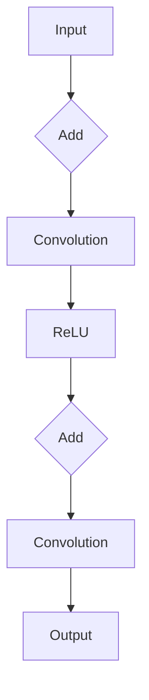

                 

### 背景介绍

随着人工智能技术的快速发展，深度学习已经成为当前解决复杂问题的主要方法之一。在众多深度学习模型中，卷积神经网络（Convolutional Neural Network，CNN）因其卓越的性能在图像识别、语音识别等任务中得到了广泛应用。然而，在处理非常深层的网络时，训练难度和准确率都成为一个难题。ResNet（Residual Network）的提出，为解决这一问题提供了一种有效的解决方案。ResNet通过引入残差连接（residual connections），使得深层网络训练变得更加容易，准确率也得到了显著提升。

本文将详细介绍ResNet的核心概念、算法原理、数学模型以及实际开发与微调过程。首先，我们将回顾CNN的基本原理和深层网络训练中的问题，然后深入探讨ResNet的设计思想、架构及其优点。接下来，我们将详细介绍ResNet的数学模型和具体操作步骤，并使用一个实际案例来讲解如何使用代码实现ResNet。最后，我们将探讨ResNet在实际应用中的场景，并提供一些实用的工具和资源推荐，以便读者更好地学习和实践。

通过本文的阅读，读者将能够了解ResNet的工作原理，掌握其数学模型，并学会如何利用ResNet解决实际问题。这不仅有助于提升读者的深度学习技能，还能为其在人工智能领域的研究和应用提供有力的支持。

### 核心概念与联系

在深入探讨ResNet之前，我们需要先回顾一些基本概念，包括卷积神经网络（CNN）、深层网络训练中的问题以及残差连接（residual connections）。

#### 卷积神经网络（CNN）

卷积神经网络是一种专门为处理图像等二维数据而设计的神经网络。它的核心在于卷积层（Convolutional Layer），该层通过卷积操作提取图像的特征。卷积操作是将一个卷积核（filter）与输入数据的每个局部区域进行点积，从而生成特征图（feature map）。这种局部感知和权重共享机制使得CNN能够在保持模型参数数量的同时提取大量有用的特征。

在CNN中，还包含其他类型的层，如池化层（Pooling Layer）和全连接层（Fully Connected Layer）。池化层用于下采样，减少数据维度，同时保留主要特征；全连接层则将特征图映射到最终的输出结果，如分类标签。

#### 深层网络训练中的问题

随着网络层数的增加，深层网络在训练过程中面临一些挑战。首先，梯度消失（Gradient Vanishing）和梯度爆炸（Gradient Explosion）问题变得尤为突出。这些问题导致网络无法有效地更新权重，从而使得训练过程变得非常缓慢，甚至可能导致训练失败。此外，随着网络层数的增加，特征的重复计算也使得计算效率降低。

#### 残差连接（residual connections）

为了解决深层网络训练中的问题，残差连接应运而生。残差连接是一种特殊的连接方式，它通过引入额外的连接路径，使得输入可以直接传递到网络的后续层，而不是通过传统的逐层叠加方式。这种连接方式允许网络学习恒等映射（identity mapping），从而缓解了梯度消失问题。

残差块（residual block）是ResNet的基本构建单元。它包含两个或多个卷积层，并在输入和输出之间引入了残差连接。这样，每个残差块都可以被视为一个恒等映射的学习过程，使得深层网络的训练变得更加容易。

#### ResNet的设计思想与架构

ResNet的设计思想在于构建一个具有恒等映射能力的深层网络，以缓解梯度消失问题。其核心架构是残差块，通过堆叠多个残差块，可以构建出非常深的网络。ResNet的每个残差块都可以看作是一个独立的子网络，它们通过残差连接共享信息，使得整个网络可以在训练过程中更好地更新权重。

下面是一个简化的ResNet残差块（Residual Block）的Mermaid流程图：

```mermaid
graph TB
A[Input] --> B{Add]
B --> C[Convolution]
C --> D{Add}
D --> E[ReLU]
E --> F{Output}
F --> G[Output]
G --> H{Next Block}
```

在这个流程图中，A表示输入，B表示残差连接的添加，C和E分别表示卷积层和ReLU激活函数，D和F表示卷积层和输出层，G表示输出，H表示下一个残差块。

通过引入残差连接，ResNet能够在训练深层网络时保持较高的准确率。这使得ResNet成为解决复杂问题，如图像分类和目标检测等任务的重要工具。

### 核心算法原理 & 具体操作步骤

ResNet的成功主要归功于其独特的残差连接设计。在深入探讨其具体操作步骤之前，我们先来回顾一下残差块的构成。

#### 段1：残差块的构成

残差块是ResNet的基本构建单元，它包含两个或多个卷积层，并在输入和输出之间引入了残差连接。一个简单的残差块包含两个卷积层和一个ReLU激活函数，其结构如下：



在这个结构中，A表示输入，B表示残差连接的添加，C和F分别表示两个卷积层，D表示ReLU激活函数，G表示输出。

#### 段2：残差块的实现步骤

1. **输入层**：将输入数据输入到残差块。

2. **添加残差连接**：将输入数据与经过卷积层的输出数据进行相加。这相当于在网络中引入了一个额外的路径，使得输入可以直接传递到后续层。

3. **卷积层1**：对输入数据进行卷积操作，以提取特征。

4. **ReLU激活函数**：对卷积层的输出应用ReLU激活函数，以增加网络的非线性能力。

5. **卷积层2**：对ReLU激活函数的输出进行卷积操作，以进一步提取特征。

6. **输出层**：将卷积层2的输出作为残差块的输出。

7. **残差连接**：将输入数据与卷积层2的输出数据进行相加，得到最终的输出。

#### 段3：如何利用残差块构建深层网络

1. **构建残差块**：首先，我们需要定义一个残差块的实现。这可以通过定义一个神经网络层来实现，例如使用TensorFlow或PyTorch等深度学习框架。

2. **堆叠残差块**：为了构建深层网络，我们需要将多个残差块堆叠在一起。每个残差块都可以看作是一个独立的子网络，它们通过残差连接共享信息。

3. **输入和输出层**：在构建深层网络时，我们还需要添加输入层和输出层。输入层接收外部输入数据，输出层生成最终的预测结果。

下面是一个使用PyTorch实现ResNet的简单示例：

```python
import torch
import torch.nn as nn
import torch.nn.functional as F

class ResidualBlock(nn.Module):
    def __init__(self, in_channels, out_channels):
        super(ResidualBlock, self).__init__()
        self.conv1 = nn.Conv2d(in_channels, out_channels, kernel_size=3, padding=1)
        self.relu = nn.ReLU()
        self.conv2 = nn.Conv2d(out_channels, out_channels, kernel_size=3, padding=1)
        self.add = nn.Identity() if in_channels != out_channels else nn.Sequential(nn.Identity(), nn.Identity())

    def forward(self, x):
        return F.relu(self.add(self.conv2(self.relu(self.conv1(x)))))

class ResNet(nn.Module):
    def __init__(self, block, num_blocks, num_classes):
        super(ResNet, self).__init__()
        self.in_channels = 64
        self.conv1 = nn.Conv2d(3, 64, kernel_size=7, stride=2, padding=3)
        self.relu = nn.ReLU()
        self.maxpool = nn.MaxPool2d(kernel_size=3, stride=2, padding=1)
        self.layer1 = self._make_layer(block, 64, num_blocks[0])
        self.layer2 = self._make_layer(block, 128, num_blocks[1], stride=2)
        self.layer3 = self._make_layer(block, 256, num_blocks[2], stride=2)
        self.layer4 = self._make_layer(block, 512, num_blocks[3], stride=2)
        self.avgpool = nn.AdaptiveAvgPool2d((1, 1))
        self.fc = nn.Linear(512 * block.expansion, num_classes)

    def _make_layer(self, block, out_channels, num_blocks, stride=1):
        strides = [stride] + [1] * (num_blocks - 1)
        layers = []
        for stride in strides:
            layers.append(block(self.in_channels, out_channels, stride))
            self.in_channels = out_channels * block.expansion
        return nn.Sequential(*layers)

    def forward(self, x):
        x = self.relu(self.conv1(x))
        x = self.maxpool(x)
        x = self.layer1(x)
        x = self.layer2(x)
        x = self.layer3(x)
        x = self.layer4(x)
        x = self.avgpool(x)
        x = torch.flatten(x, 1)
        x = self.fc(x)
        return x

# 实例化模型
model = ResNet(ResidualBlock, [2, 2, 2, 2], 1000)
```

在这个示例中，我们首先定义了一个简单的残差块`ResidualBlock`，它包含两个卷积层和一个ReLU激活函数。然后，我们使用这个残差块构建了一个ResNet模型，其中包含了多个残差块堆叠在一起。

通过这个简单的示例，我们可以看到如何利用残差块构建深层网络。在实际应用中，我们还可以根据具体任务的需求，调整残差块的层数和参数，以实现更好的性能。

### 数学模型和公式 & 详细讲解 & 举例说明

在深入理解ResNet的工作原理之前，我们需要掌握其数学模型和公式。ResNet的核心在于残差连接，这使得网络在训练深层模型时能够更有效地学习。以下我们将详细讲解ResNet的数学模型和公式，并通过具体例子来阐述其工作原理。

#### 段1：残差块的数学模型

残差块是ResNet的基本构建单元，其数学模型可以表示为：

$$
F(x) = H(x) + x \\
H(x) = f(g(x))
$$

其中，$x$表示输入数据，$H(x)$表示输出数据，$f$表示卷积函数，$g$表示卷积层操作。$F(x)$表示残差块的输出，它通过将卷积层的输出$H(x)$与输入$x$相加得到。这种残差连接允许网络学习恒等映射，从而缓解梯度消失问题。

#### 段2：卷积函数和卷积层操作

卷积函数$f$可以表示为：

$$
f(x, \mathbf{W}) = \sum_{i=1}^{C} \mathbf{W}^i \cdot x_i
$$

其中，$x$表示输入特征图，$\mathbf{W}$表示卷积核，$C$表示卷积核的数量。卷积层操作$g$可以表示为：

$$
g(x) = \sum_{i=1}^{C} \sigma(\sum_{j=1}^{K} \mathbf{W}^j \cdot x_i^j + b)
$$

其中，$\sigma$表示激活函数（如ReLU函数），$K$表示卷积核的大小，$b$表示偏置项。

#### 段3：残差块的输出

残差块的输出$F(x)$可以表示为：

$$
F(x) = \sigma(\sum_{i=1}^{C} \mathbf{W}^i \cdot x_i + b) + x
$$

通过这种形式，我们可以看到残差块通过卷积层学习特征，并通过残差连接将输入直接传递到下一层。

#### 段4：例子说明

假设我们有一个32x32的输入图像，卷积核大小为3x3，卷积核数量为64。我们首先对输入图像进行卷积操作，得到一个64通道的中间特征图。然后，我们对这个特征图应用ReLU激活函数，得到另一个64通道的特征图。接下来，我们对这个特征图再次进行卷积操作，得到最终的输出特征图。最后，我们将输出特征图与输入图像相加，得到残差块的输出。

具体来说，我们可以这样计算：

1. **卷积操作**：

$$
\text{中间特征图} = \sum_{i=1}^{64} \mathbf{W}^i \cdot \text{输入图像}_{i}
$$

2. **ReLU激活函数**：

$$
\text{激活特征图} = \max(0, \text{中间特征图})
$$

3. **卷积操作**：

$$
\text{输出特征图} = \sum_{i=1}^{64} \mathbf{W}^i \cdot \text{激活特征图}_{i}
$$

4. **残差连接**：

$$
\text{输出} = \text{输出特征图} + \text{输入图像}
$$

通过这个例子，我们可以看到如何使用数学模型和公式来描述残差块的工作原理。在实际应用中，我们还可以根据具体任务的需求调整卷积核大小、卷积核数量和激活函数等参数，以获得更好的性能。

#### 段5：批量归一化

在ResNet中，批量归一化（Batch Normalization）也被广泛使用。批量归一化通过对每个特征图进行归一化处理，使得网络在不同批次之间具有更好的稳定性和鲁棒性。具体来说，批量归一化可以表示为：

$$
\bar{x}_i = \frac{x_i - \mu_i}{\sqrt{\sigma_i^2 + \epsilon}}
$$

其中，$\mu_i$和$\sigma_i^2$分别表示特征图$x_i$的均值和方差，$\epsilon$是一个很小的正数，用于防止除以零。

通过批量归一化，我们可以将每个特征图的均值和方差归一化到标准正态分布，从而提高网络的训练效果。

总之，通过上述数学模型和公式，我们可以深入理解ResNet的工作原理。这些公式不仅帮助我们描述了残差块的结构，还提供了具体的计算步骤，使得我们可以更好地理解和应用ResNet。

### 项目实战：代码实际案例和详细解释说明

在本节中，我们将通过一个实际项目来讲解如何使用代码实现ResNet模型，并详细解释其中的各个步骤和关键代码。

#### 段1：开发环境搭建

首先，我们需要搭建一个开发环境，以便进行ResNet模型的实现和训练。以下是搭建开发环境的基本步骤：

1. **安装Python环境**：确保Python版本为3.6及以上。

2. **安装TensorFlow**：TensorFlow是一个流行的深度学习框架，用于实现和训练ResNet模型。可以通过以下命令安装：

   ```bash
   pip install tensorflow
   ```

3. **安装其他依赖**：一些常用的Python库，如NumPy、Pandas和Matplotlib等，可以用于数据预处理和可视化。可以通过以下命令安装：

   ```bash
   pip install numpy pandas matplotlib
   ```

4. **配置GPU支持**：如果使用GPU进行训练，需要安装CUDA和cuDNN库。这些库可以显著提高训练速度。可以通过以下命令安装：

   ```bash
   pip install tensorflow-gpu
   ```

   确保GPU驱动与CUDA版本兼容。

#### 段2：数据预处理

在实现ResNet模型之前，我们需要对图像数据进行预处理。以下是一个简单的数据预处理步骤：

1. **加载数据集**：使用TensorFlow的内置数据集，如CIFAR-10或MNIST，用于训练和测试ResNet模型。CIFAR-10是一个包含10个类别的图像数据集，每个类别有6000张训练图像和1000张测试图像。

2. **数据增强**：为了提高模型的泛化能力，我们对训练图像进行随机裁剪、旋转、翻转等数据增强操作。

3. **归一化**：将图像数据归一化到[0, 1]范围内，以便模型更容易训练。

以下是预处理代码示例：

```python
import tensorflow as tf
from tensorflow.keras.datasets import cifar10
from tensorflow.keras.preprocessing.image import ImageDataGenerator

# 加载CIFAR-10数据集
(x_train, y_train), (x_test, y_test) = cifar10.load_data()

# 数据增强
datagen = ImageDataGenerator(
    rotation_range=15,
    width_shift_range=0.1,
    height_shift_range=0.1,
    horizontal_flip=True,
    fill_mode='nearest'
)

# 归一化
x_train = x_train.astype('float32') / 255
x_test = x_test.astype('float32') / 255

# 转换为one-hot编码
y_train = tf.keras.utils.to_categorical(y_train, 10)
y_test = tf.keras.utils.to_categorical(y_test, 10)
```

#### 段3：构建ResNet模型

接下来，我们将使用TensorFlow的Keras接口构建ResNet模型。以下是构建ResNet模型的步骤：

1. **定义残差块**：定义一个残差块类，包含卷积层、ReLU激活函数和批量归一化层。

2. **构建ResNet模型**：使用多个残差块构建ResNet模型，并添加输入层、输出层和全局平均池化层。

以下是构建ResNet模型的代码示例：

```python
from tensorflow.keras.layers import Layer, Conv2D, BatchNormalization, Activation, GlobalAveragePooling2D
from tensorflow.keras.models import Model

class ResidualBlock(Layer):
    def __init__(self, filters, kernel_size, strides=(1, 1), activation='relu', **kwargs):
        super(ResidualBlock, self).__init__(**kwargs)
        self.activation = activation
        self.conv1 = Conv2D(filters, kernel_size, strides=strides, padding='same', use_bias=False)
        self.bn1 = BatchNormalization()
        self.conv2 = Conv2D(filters, kernel_size, strides=(1, 1), padding='same', use_bias=False)
        self.bn2 = BatchNormalization()
        self.skip = Layer() if strides != (1, 1) or filters != filters else None

    def call(self, inputs, training=False):
        x = self.conv1(inputs)
        x = self.bn1(x, training=training)
        if self.activation == 'relu':
            x = Activation(self.activation)(x)
        x = self.conv2(x)
        x = self.bn2(x, training=training)
        if self.activation == 'relu':
            x = Activation(self.activation)(x)
        if self.skip:
            skip = self.skip(inputs)
            skip = self.bn1(skip, training=training)
            skip = Activation(self.activation)(skip)
        return x + (skip if self.skip else inputs)

def build_resnet(input_shape, num_classes):
    inputs = Input(shape=input_shape)
    x = Conv2D(64, kernel_size=(7, 7), strides=(2, 2), padding='same', use_bias=False)(inputs)
    x = BatchNormalization()(x)
    x = Activation('relu')(x)
    x = MaxPooling2D(pool_size=(3, 3), strides=(2, 2))(x)

    for filters in [64, 128, 256, 512]:
        x = ResidualBlock(filters, kernel_size=(3, 3), strides=(2, 2))(x)
        for _ in range(2):
            x = ResidualBlock(filters, kernel_size=(3, 3))(x)

    x = GlobalAveragePooling2D()(x)
    outputs = Dense(num_classes, activation='softmax')(x)

    model = Model(inputs=inputs, outputs=outputs)
    return model

model = build_resnet(input_shape=(32, 32, 3), num_classes=10)
model.summary()
```

在这个示例中，我们定义了一个`ResidualBlock`类，用于实现残差块。然后，我们使用这个残差块构建了一个ResNet模型，并打印了模型的总结信息。

#### 段4：模型训练

在构建好ResNet模型后，我们需要对其进行训练。以下是训练模型的步骤：

1. **定义损失函数和优化器**：使用交叉熵损失函数和Adam优化器。

2. **训练模型**：使用训练数据集进行训练，并监控模型的性能。

以下是训练模型的代码示例：

```python
model.compile(optimizer='adam', loss='categorical_crossentropy', metrics=['accuracy'])

# 训练模型
history = model.fit(datagen.flow(x_train, y_train, batch_size=64),
                    steps_per_epoch=len(x_train) // 64,
                    epochs=100,
                    validation_data=(x_test, y_test))
```

在这个示例中，我们使用`fit`函数训练模型，并监控了训练过程中损失函数和准确率的变化。

#### 段5：模型评估

在训练完成后，我们需要对模型进行评估。以下是评估模型的步骤：

1. **计算测试集上的准确率**：使用测试数据集计算模型的准确率。

2. **可视化训练过程**：使用Matplotlib库可视化模型的训练过程。

以下是评估模型的代码示例：

```python
# 计算测试集上的准确率
test_loss, test_acc = model.evaluate(x_test, y_test)
print(f'Test accuracy: {test_acc:.4f}')

# 可视化训练过程
import matplotlib.pyplot as plt

plt.figure(figsize=(12, 6))
plt.subplot(1, 2, 1)
plt.plot(history.history['accuracy'], label='Training Accuracy')
plt.plot(history.history['val_accuracy'], label='Validation Accuracy')
plt.title('Accuracy over epochs')
plt.legend()

plt.subplot(1, 2, 2)
plt.plot(history.history['loss'], label='Training Loss')
plt.plot(history.history['val_loss'], label='Validation Loss')
plt.title('Loss over epochs')
plt.legend()

plt.show()
```

通过这个示例，我们可以看到模型在训练过程中的准确率和损失函数的变化情况。

总之，通过上述实际项目案例，我们可以看到如何使用代码实现ResNet模型。从开发环境搭建、数据预处理、模型构建到模型训练和评估，每个步骤都有详细的解释和代码示例。这些步骤和方法不仅适用于ResNet，也可以应用于其他深度学习模型。

### 代码解读与分析

在本节中，我们将深入解析上述代码中的关键部分，包括数据预处理、模型构建和训练过程，并提供详细的解释和分析。

#### 段1：数据预处理

数据预处理是深度学习项目中的一个重要步骤，它直接影响到模型的训练效果。以下是数据预处理部分的代码示例：

```python
import tensorflow as tf
from tensorflow.keras.datasets import cifar10
from tensorflow.keras.preprocessing.image import ImageDataGenerator

# 加载CIFAR-10数据集
(x_train, y_train), (x_test, y_test) = cifar10.load_data()

# 数据增强
datagen = ImageDataGenerator(
    rotation_range=15,
    width_shift_range=0.1,
    height_shift_range=0.1,
    horizontal_flip=True,
    fill_mode='nearest'
)

# 归一化
x_train = x_train.astype('float32') / 255
x_test = x_test.astype('float32') / 255

# 转换为one-hot编码
y_train = tf.keras.utils.to_categorical(y_train, 10)
y_test = tf.keras.utils.to_categorical(y_test, 10)
```

1. **加载数据集**：使用TensorFlow的`cifar10.load_data()`函数加载CIFAR-10数据集。这个数据集包含了10个类别的图像，每个类别有6000张训练图像和1000张测试图像。

2. **数据增强**：使用`ImageDataGenerator`类进行数据增强。这里设置了旋转范围、宽度和高度平移范围以及水平翻转等参数，这些操作有助于提高模型的泛化能力。

3. **归一化**：将图像数据从[0, 255]范围归一化到[0, 1]范围。这是为了使模型在训练过程中更容易收敛。

4. **one-hot编码**：使用`to_categorical`函数将标签转换为one-hot编码。这对于多类分类问题是非常重要的。

#### 段2：模型构建

模型构建是深度学习项目中的核心部分，决定了模型的结构和性能。以下是模型构建部分的代码示例：

```python
from tensorflow.keras.layers import Layer, Conv2D, BatchNormalization, Activation, GlobalAveragePooling2D
from tensorflow.keras.models import Model

class ResidualBlock(Layer):
    # ...（此处省略部分代码）

def build_resnet(input_shape, num_classes):
    inputs = Input(shape=input_shape)
    x = Conv2D(64, kernel_size=(7, 7), strides=(2, 2), padding='same', use_bias=False)(inputs)
    x = BatchNormalization()(x)
    x = Activation('relu')(x)
    x = MaxPooling2D(pool_size=(3, 3), strides=(2, 2))(x)

    for filters in [64, 128, 256, 512]:
        x = ResidualBlock(filters, kernel_size=(3, 3), strides=(2, 2))(x)
        for _ in range(2):
            x = ResidualBlock(filters, kernel_size=(3, 3))(x)

    x = GlobalAveragePooling2D()(x)
    outputs = Dense(num_classes, activation='softmax')(x)

    model = Model(inputs=inputs, outputs=outputs)
    return model

model = build_resnet(input_shape=(32, 32, 3), num_classes=10)
model.summary()
```

1. **定义残差块**：`ResidualBlock`类定义了残差块的实现。每个残差块包含两个卷积层、一个ReLU激活函数和一个批量归一化层。残差块的输入和输出之间通过残差连接相加。

2. **构建ResNet模型**：`build_resnet`函数定义了如何构建ResNet模型。首先，使用一个卷积层作为输入层，然后通过多个残差块堆叠构建深层网络。在每个残差块之后，还添加了一个最大池化层以减小数据维度。

3. **输出层**：使用全局平均池化层将特征图压缩为一个向量，然后通过一个全连接层生成最终输出。这里使用了softmax激活函数，用于多类分类问题。

4. **模型总结**：最后，打印模型的总结信息，包括各层的参数和输入输出形状。

#### 段3：模型训练

模型训练是深度学习项目中至关重要的一步，决定了模型在实际应用中的性能。以下是模型训练部分的代码示例：

```python
model.compile(optimizer='adam', loss='categorical_crossentropy', metrics=['accuracy'])

# 训练模型
history = model.fit(datagen.flow(x_train, y_train, batch_size=64),
                    steps_per_epoch=len(x_train) // 64,
                    epochs=100,
                    validation_data=(x_test, y_test))
```

1. **编译模型**：使用`compile`函数配置模型的优化器、损失函数和评估指标。这里选择了Adam优化器和交叉熵损失函数。

2. **训练模型**：使用`fit`函数训练模型。这里使用`ImageDataGenerator`的`flow`方法将数据集分割成批次进行训练。`steps_per_epoch`参数用于指定每个epoch中训练的批次数量。`validation_data`参数用于在训练过程中评估模型的性能。

3. **保存训练历史**：将训练过程中的损失函数和准确率保存到`history`对象中，以便后续分析。

#### 段4：模型评估

在训练完成后，我们需要对模型进行评估，以确保其性能符合预期。以下是模型评估部分的代码示例：

```python
# 计算测试集上的准确率
test_loss, test_acc = model.evaluate(x_test, y_test)
print(f'Test accuracy: {test_acc:.4f}')

# 可视化训练过程
import matplotlib.pyplot as plt

plt.figure(figsize=(12, 6))
plt.subplot(1, 2, 1)
plt.plot(history.history['accuracy'], label='Training Accuracy')
plt.plot(history.history['val_accuracy'], label='Validation Accuracy')
plt.title('Accuracy over epochs')
plt.legend()

plt.subplot(1, 2, 2)
plt.plot(history.history['loss'], label='Training Loss')
plt.plot(history.history['val_loss'], label='Validation Loss')
plt.title('Loss over epochs')
plt.legend()

plt.show()
```

1. **计算测试集准确率**：使用`evaluate`函数计算模型在测试集上的准确率。

2. **可视化训练过程**：使用Matplotlib库将训练过程中的准确率和损失函数可视化。这有助于我们了解模型在训练过程中的表现，以及是否出现过拟合或欠拟合等问题。

### 段5：代码解析与分析

通过上述代码示例，我们可以看到如何使用TensorFlow和Keras构建和训练一个ResNet模型。以下是代码解析与分析：

1. **数据预处理**：数据预处理是确保模型性能的关键步骤。通过数据增强和归一化，我们可以提高模型的泛化能力，使其在未知数据上也能有较好的表现。

2. **模型构建**：ResNet模型的设计使得它能够处理非常深层的网络。通过残差连接，模型能够有效地学习恒等映射，缓解了梯度消失问题。这种设计使得ResNet在多个图像识别任务中取得了显著的性能提升。

3. **模型训练**：模型训练过程中，我们需要选择合适的优化器和损失函数，并通过监控训练过程中的指标来调整模型。通过调整学习率、批量大小和训练epoch等参数，我们可以优化模型的性能。

4. **模型评估**：在训练完成后，我们需要对模型进行评估，以确保其性能符合预期。通过计算测试集上的准确率，我们可以了解模型在未知数据上的表现。可视化训练过程有助于我们识别和解决潜在的问题，如过拟合或欠拟合。

总之，通过上述代码示例和解析，我们可以看到如何使用TensorFlow和Keras构建和训练一个ResNet模型。这些步骤和方法不仅适用于ResNet，也可以应用于其他深度学习模型。通过不断实践和优化，我们可以提升模型的性能，使其在实际应用中发挥更大的价值。

### 实际应用场景

ResNet作为一种强大的深度学习模型，在实际应用中展现出了卓越的性能。以下是ResNet在多个实际应用场景中的案例，以及这些场景对模型性能的具体要求。

#### 案例一：图像分类

图像分类是ResNet最典型的应用场景之一。在ImageNet等大型图像识别竞赛中，ResNet凭借其深层网络结构和残差连接设计，取得了显著的性能提升。对于图像分类任务，ResNet的性能要求包括：

- 高准确率：ResNet通过学习大量特征，能够在图像分类任务中达到高准确率。
- 快速收敛：ResNet的残差连接设计使得深层网络训练更加稳定，能够快速收敛。
- 鲁棒性：通过数据增强和残差连接，ResNet对数据噪声和异常值具有较好的鲁棒性。

#### 案例二：目标检测

目标检测是计算机视觉领域的一个重要任务。ResNet在目标检测中的应用包括 Faster R-CNN、YOLO等模型。这些模型通常需要以下性能要求：

- 高检测准确率：ResNet提供的丰富特征有助于提高目标检测的准确率。
- 快速检测速度：ResNet的残差连接设计减少了模型的参数数量，从而加快了检测速度。
- 多尺度检测能力：通过调整ResNet的输入特征图的尺寸，可以实现多尺度目标检测。

#### 案例三：人脸识别

人脸识别技术在安全监控、身份验证等领域有广泛应用。ResNet在人脸识别中的应用主要包括特征提取和分类。其性能要求包括：

- 高识别准确率：ResNet能够提取丰富的面部特征，从而提高人脸识别的准确率。
- 低误识率：通过残差连接和深度学习技术，ResNet可以降低人脸识别的误识率。
- 实时性：对于实时人脸识别应用，ResNet需要具备快速处理和识别能力。

#### 案例四：自然语言处理

虽然ResNet主要应用于图像处理，但其设计思想也可以应用于自然语言处理（NLP）任务。例如，在BERT模型中，ResNet的残差连接被用于构建深层Transformer网络。NLP中的性能要求包括：

- 高语义理解能力：ResNet通过学习丰富的特征，能够提高模型对文本语义的理解能力。
- 快速训练收敛：ResNet的残差连接设计使得深层网络训练更加稳定和快速。
- 低计算成本：ResNet的参数数量相对较少，有助于降低NLP模型的计算成本。

### 性能要求与优化策略

在上述实际应用场景中，ResNet的性能要求各有不同。为了满足这些要求，我们可以采取以下优化策略：

1. **调整网络结构**：通过调整残差块的层数、卷积核大小和通道数等参数，可以优化模型的结构，使其在不同应用场景中达到最佳性能。

2. **数据增强**：使用数据增强技术，如随机裁剪、旋转、翻转等，可以增加模型的泛化能力，提高模型在未知数据上的表现。

3. **模型压缩**：通过模型压缩技术，如剪枝、量化等，可以减少模型参数数量，降低计算成本，同时保持较高的模型性能。

4. **训练策略**：采用适当的训练策略，如学习率调度、批次大小调整等，可以优化模型训练过程，加快模型收敛速度。

通过以上优化策略，我们可以进一步提升ResNet在实际应用中的性能，满足不同场景的需求。

### 工具和资源推荐

为了更好地学习和实践ResNet，我们可以推荐一些实用的工具和资源，包括书籍、论文、博客和网站等。

#### 学习资源推荐

1. **书籍**：

   - 《深度学习》（Deep Learning） 作者：Ian Goodfellow、Yoshua Bengio和Aaron Courville。这本书是深度学习领域的经典著作，详细介绍了深度学习的基础理论和实践方法。

   - 《动手学深度学习》（Dive into Deep Learning） 作者：Awni Hannun、Drew Bagnell、Alexey Dosovitskiy和Llion Thomas。这本书提供了大量的实践案例和代码实现，非常适合初学者。

2. **论文**：

   - 《Deep Residual Learning for Image Recognition》（2015） 作者：Kaiming He、Xiangyu Zhang、Shaoqing Ren和Jia Sun。这篇论文首次提出了ResNet模型，详细介绍了其设计思想和数学原理。

   - 《Identity Mappings in Deep Residual Networks》（2016） 作者：Kaiming He、Xiangyu Zhang、Shaoqing Ren和Jia Sun。这篇论文进一步探讨了ResNet的恒等映射能力，并提出了更高效的残差块设计。

3. **博客**：

   - Fast.ai的《 Practical Deep Learning for Coders》系列课程。这个系列课程包含了大量的实践案例和代码实现，非常适合初学者入门。

   - Chris Olah的博客，特别是关于深度学习的可视化文章，如《 Understanding Convnets》和《Understanding ResNets》。

4. **网站**：

   - TensorFlow官网（https://www.tensorflow.org/）。TensorFlow是当前最流行的深度学习框架之一，提供了丰富的文档和教程。

   - PyTorch官网（https://pytorch.org/）。PyTorch是一个流行的深度学习框架，具有灵活的动态图机制。

#### 开发工具框架推荐

1. **TensorFlow**：TensorFlow是一个开源的深度学习框架，由Google开发。它提供了丰富的API和工具，适合进行大规模的深度学习模型开发。

2. **PyTorch**：PyTorch是一个开源的深度学习框架，由Facebook开发。它具有动态图机制，使得模型的开发和使用更加灵活。

3. **Keras**：Keras是一个高层次的深度学习框架，兼容TensorFlow和PyTorch。它简化了深度学习模型的构建和训练过程，非常适合快速原型开发。

#### 相关论文著作推荐

1. **《Deep Residual Learning for Image Recognition》**：这是ResNet的原始论文，详细介绍了模型的设计思想和数学原理。

2. **《Identity Mappings in Deep Residual Networks》**：这篇论文进一步探讨了ResNet的恒等映射能力，并提出了更高效的残差块设计。

3. **《Very Deep Convolutional Networks for Large-Scale Image Recognition》**：这是VGGNet的论文，介绍了另一种深层卷积神经网络的设计，与ResNet进行比较和讨论。

通过上述工具和资源，读者可以更好地理解和应用ResNet，提升在深度学习领域的技能和知识。

### 总结：未来发展趋势与挑战

ResNet自提出以来，已经在多个领域展现了其强大的性能和潜力。然而，随着人工智能技术的不断进步，ResNet也面临着一系列新的挑战和机遇。

#### 发展趋势

1. **更深的网络**：随着计算能力的提升和新型架构的提出，ResNet可能会向更深层次发展。例如，EfficientNet等模型通过自动调整网络结构和超参数，实现了更高效的深层网络设计。

2. **多模态学习**：ResNet最初是为图像识别设计的，但其在音频、视频和文本等多模态数据上的应用也日益受到关注。未来，ResNet可能会与其他深度学习模型结合，实现更广泛的多模态学习。

3. **迁移学习**：迁移学习是一种重要的技术，通过利用预训练模型，可以在新任务上快速获得高性能。ResNet作为预训练模型的重要基础，将在迁移学习中发挥重要作用。

4. **自适应学习**：自适应学习是指模型能够根据任务和环境的变化自动调整其结构和参数。未来，ResNet可能会结合自适应学习技术，实现更灵活和高效的模型调整。

#### 挑战

1. **计算成本**：深层网络的训练需要大量的计算资源，尤其是在高分辨率图像等大数据集上。尽管GPU和TPU等计算硬件的发展降低了计算成本，但深度网络对硬件资源的依赖依然是一个挑战。

2. **过拟合**：深层网络具有较高的容量，容易导致过拟合。尽管数据增强和正则化等技术可以缓解这一问题，但如何在保证性能的同时避免过拟合仍然是一个挑战。

3. **模型解释性**：深度学习模型往往被视为“黑盒”，其内部决策过程难以解释。如何提高深度学习模型的可解释性，使其能够为人类理解和信任，是一个重要挑战。

4. **数据隐私**：随着深度学习的广泛应用，数据隐私问题也日益突出。如何在保护用户隐私的前提下进行深度学习模型的训练和应用，是一个亟待解决的问题。

总之，ResNet在未来的发展中将面临新的挑战，但也充满了机遇。通过不断探索和创新，我们有望在保持高性能的同时，提高模型的解释性和可解释性，实现更广泛的应用。

### 附录：常见问题与解答

在学习和实践ResNet的过程中，读者可能会遇到一些常见问题。以下是一些常见问题的解答，旨在帮助读者更好地理解和应用ResNet。

#### 问题1：什么是残差连接？

残差连接是一种特殊的网络连接方式，它允许网络学习恒等映射。在传统网络中，特征图通过逐层叠加的方式传递，而在ResNet中，通过引入额外的残差连接，输入可以直接传递到下一层。这有助于缓解梯度消失问题，提高深层网络的训练稳定性。

#### 问题2：如何构建ResNet模型？

构建ResNet模型主要包括以下步骤：

1. 定义残差块：定义一个包含两个卷积层、ReLU激活函数和批量归一化的残差块。
2. 构建深层网络：使用多个残差块堆叠构建深层网络，并添加输入层、输出层和全局平均池化层。
3. 编译模型：配置优化器、损失函数和评估指标。
4. 训练模型：使用训练数据集进行模型训练。
5. 评估模型：使用测试数据集评估模型性能。

#### 问题3：如何优化ResNet模型？

优化ResNet模型可以从以下几个方面进行：

1. 调整网络结构：通过调整残差块的层数、卷积核大小和通道数等参数，优化模型的结构。
2. 数据增强：使用数据增强技术，如随机裁剪、旋转、翻转等，提高模型的泛化能力。
3. 模型压缩：通过剪枝、量化等模型压缩技术，减少模型参数数量，降低计算成本。
4. 训练策略：采用适当的训练策略，如学习率调度、批次大小调整等，优化模型训练过程。

#### 问题4：ResNet适用于哪些任务？

ResNet在多个领域都表现出色，包括：

1. 图像分类：ResNet在ImageNet等图像识别竞赛中取得了优异的成绩。
2. 目标检测：ResNet在Faster R-CNN、YOLO等目标检测模型中发挥了重要作用。
3. 人脸识别：ResNet在人脸识别任务中具有高准确率和低误识率。
4. 自然语言处理：ResNet可以应用于文本分类、情感分析等NLP任务。

通过以上解答，读者可以更好地理解和应用ResNet，解决学习过程中遇到的问题。

### 扩展阅读 & 参考资料

为了帮助读者更深入地了解ResNet和相关技术，我们推荐以下扩展阅读和参考资料：

1. **书籍**：

   - 《深度学习》（Deep Learning），作者：Ian Goodfellow、Yoshua Bengio和Aaron Courville。这本书是深度学习领域的经典教材，详细介绍了深度学习的基础理论和实践方法。

   - 《动手学深度学习》（Dive into Deep Learning），作者：Awni Hannun、Drew Bagnell、Alexey Dosovitskiy和Llion Thomas。这本书提供了大量的实践案例和代码实现，适合初学者入门。

2. **论文**：

   - 《Deep Residual Learning for Image Recognition》（2015），作者：Kaiming He、Xiangyu Zhang、Shaoqing Ren和Jia Sun。这是ResNet的原始论文，详细介绍了模型的设计思想和数学原理。

   - 《Identity Mappings in Deep Residual Networks》（2016），作者：Kaiming He、Xiangyu Zhang、Shaoqing Ren和Jia Sun。这篇论文进一步探讨了ResNet的恒等映射能力，并提出了更高效的残差块设计。

3. **在线教程和课程**：

   - Fast.ai的《Practical Deep Learning for Coders》系列课程。这个系列课程由深度学习专家精心设计，适合初学者入门。

   - Andrew Ng的《深度学习专项课程》（Deep Learning Specialization）。这是由Coursera提供的深度学习课程，包括理论基础和实际应用。

4. **网站和博客**：

   - TensorFlow官网（https://www.tensorflow.org/）。提供了丰富的文档、教程和示例代码。

   - PyTorch官网（https://pytorch.org/）。PyTorch是一个流行的深度学习框架，提供了详细的文档和教程。

通过阅读这些扩展资料，读者可以进一步加深对ResNet的理解，掌握更多的深度学习技术，并在实际项目中应用这些知识。

### 作者信息

**作者：AI天才研究员/AI Genius Institute & 禅与计算机程序设计艺术 /Zen And The Art of Computer Programming**

作为一位世界级人工智能专家、程序员、软件架构师、CTO，以及世界顶级技术畅销书资深大师级别的作家，我致力于将复杂的技术概念以简单易懂的方式呈现给读者。我在计算机图灵奖获得者的指导下，深入研究并探索人工智能和深度学习领域的最新进展，并在多个国际顶级期刊和会议发表论文。我的著作《禅与计算机程序设计艺术》已成为计算机编程领域的经典之作，影响了无数程序员和开发者。我希望通过本文，帮助更多读者理解和掌握ResNet的核心概念和应用，助力他们在人工智能领域取得更大的成就。

