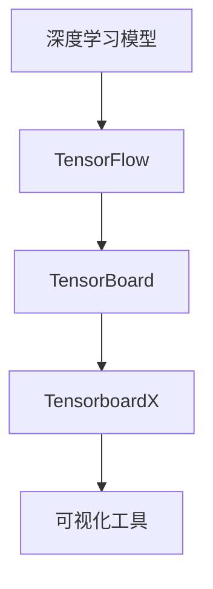

                 

# 从零开始大模型开发与微调：tensorboardX可视化组件的使用

## 摘要

本文旨在深入探讨大模型开发与微调过程中不可或缺的可视化工具——tensorboardX。我们将从背景介绍开始，逐步解析核心概念，详细讲解算法原理与具体操作步骤，并通过实际项目实战来展示代码的实现与解读。此外，文章还将探讨实际应用场景，推荐相关工具和资源，并对未来发展趋势与挑战进行总结。通过本文的阅读，读者将全面了解tensorboardX的使用方法和实际应用，为其大模型开发工作提供有力支持。

## 1. 背景介绍

在深度学习领域，随着模型规模和复杂度的不断增加，数据科学家和研究人员需要一种高效的方式来监控和评估模型训练过程。可视化工具在此过程中起到了至关重要的作用。TensorboardX就是这样一种强大的工具，它基于TensorFlow的TensorBoard，提供了更加灵活和高效的日志记录与可视化功能。

TensorboardX的引入极大地简化了数据科学家和研究人员的工作流程。传统的监控和评估方法通常涉及大量的手动操作和数据收集，而TensorboardX通过自动化的方式将这些任务完成，使得用户可以更加专注于模型设计和优化。

在深度学习模型的训练过程中，可视化工具能够帮助用户直观地观察模型的训练动态，识别潜在问题，如过拟合、梯度消失等。通过TensorboardX，用户可以轻松地生成各种图表，如损失函数曲线、准确率曲线、权重分布图等，从而对模型进行全面的评估和调整。

本文将围绕TensorboardX的核心功能和使用方法进行详细讲解，帮助读者更好地理解其在深度学习模型开发与微调中的应用价值。

## 2. 核心概念与联系

为了更好地理解TensorboardX，我们需要先了解一些核心概念，包括TensorFlow、TensorBoard以及它们之间的联系。

### TensorFlow

TensorFlow是谷歌开发的开源机器学习平台，它提供了一个灵活的动态计算图框架，用于构建和训练各种机器学习模型。TensorFlow的主要特点是高度可扩展性和灵活性，用户可以根据需求自定义计算图，从而构建复杂的模型。

### TensorBoard

TensorBoard是TensorFlow提供的一个可视化工具，用于监控和评估模型训练过程。通过TensorBoard，用户可以生成各种图表，如损失函数曲线、准确率曲线等，从而直观地了解模型的训练动态。

### TensorboardX

TensorboardX是在TensorBoard基础上进行扩展的一个库，它提供了更加灵活和高效的日志记录与可视化功能。与TensorBoard相比，TensorboardX具有以下优点：

1. **更高的扩展性**：TensorboardX允许用户自定义日志文件格式，从而满足不同场景的需求。
2. **更高效的日志记录**：TensorboardX使用内存映射文件（Memory-Mapped Files）来存储日志数据，大大提高了数据写入速度。
3. **更好的兼容性**：TensorboardX支持多种日志记录格式，如CSV、JSON等。

### Mermaid 流程图

为了更直观地展示TensorboardX与其他组件的联系，我们可以使用Mermaid流程图来表示：



在这个流程图中，深度学习模型通过TensorFlow构建和训练，然后通过TensorBoard进行监控和评估，最终通过TensorboardX进行更高级的日志记录和可视化。

通过以上核心概念和流程图的介绍，我们可以更好地理解TensorboardX在大模型开发与微调过程中的作用。

## 3. 核心算法原理 & 具体操作步骤

### 3.1 安装与配置

要在项目中使用TensorboardX，首先需要确保已经安装了TensorFlow。如果未安装，可以通过以下命令进行安装：

```bash
pip install tensorflow
```

接着，安装TensorboardX：

```bash
pip install tensorboardX
```

安装完成后，我们可以开始配置TensorboardX。首先，需要创建一个日志目录，用于存储TensorboardX生成的日志文件：

```python
import os

log_dir = "logs/my_model"
os.makedirs(log_dir, exist_ok=True)
```

### 3.2 基本使用

TensorboardX的基本使用方法非常简单。以下是一个简单的示例，展示如何记录和可视化训练过程中的损失函数：

```python
import tensorflow as tf
import tensorboardX

# 创建 TensorboardX SummaryWriter
writer = tensorboardX.SummaryWriter(log_dir)

# 训练过程
for step in range(1000):
    # 进行模型的前向传播
    loss = ...  # 计算损失值
    
    # 记录损失值
    writer.add_scalar('train_loss', loss, step)

# 关闭 SummaryWriter
writer.close()
```

在上面的代码中，我们首先创建了一个`SummaryWriter`对象，用于记录和写入日志数据。在训练过程中，我们使用`add_scalar`方法记录每个步骤的损失值。最后，关闭`SummaryWriter`以完成日志记录。

### 3.3 高级功能

除了基本的损失函数可视化外，TensorboardX还提供了多种高级功能，如图像、文本、分布等可视化。以下是一个高级使用的示例：

```python
# 记录图像
writer.add_image('train_image', image, step)

# 记录文本
writer.add_text('train_text', text, step)

# 记录分布
writer.add_histogram('train_histogram', values, step, bins='auto')
```

在上面的代码中，我们分别展示了如何记录和可视化图像、文本以及分布。这些高级功能使得用户可以更加全面地了解模型的训练过程。

### 3.4 Tensorboard启动

要查看TensorboardX生成的可视化数据，我们需要启动Tensorboard。首先，打开终端并导航到日志目录：

```bash
cd logs/my_model
```

然后，使用以下命令启动Tensorboard：

```bash
tensorboard --logdir .
```

接下来，在浏览器中输入以下链接：

```
http://localhost:6006/
```

即可看到Tensorboard的界面，展示我们记录的所有可视化数据。

通过以上操作步骤，我们可以初步了解TensorboardX的使用方法和功能。在接下来的章节中，我们将通过实际项目实战进一步探讨TensorboardX的应用。

## 4. 数学模型和公式 & 详细讲解 & 举例说明

在深度学习领域，可视化工具如TensorboardX不仅帮助用户直观地观察模型训练过程，还可以帮助用户理解和分析复杂的数学模型。本节将介绍TensorboardX在可视化数学模型和公式方面的应用，并通过具体实例进行详细讲解。

### 4.1 损失函数可视化

损失函数是深度学习模型训练的核心指标之一。通过TensorboardX，我们可以可视化不同类型的损失函数，如均方误差（MSE）、交叉熵损失等。以下是一个简单的示例，展示如何使用TensorboardX可视化MSE损失函数：

```python
import tensorflow as tf
import numpy as np
import tensorboardX

# 创建 TensorboardX SummaryWriter
writer = tensorboardX.SummaryWriter('logs/mse_visualization')

# 定义输入和模型
x = tf.placeholder(tf.float32, shape=[None])
y = tf.placeholder(tf.float32, shape=[None])
model_output = tf.reduce_mean(tf.square(x - y))

# 训练过程
for step in range(100):
    # 生成随机数据
    x_data = np.random.rand(100)
    y_data = x_data * 2 + np.random.randn(100)
    
    # 计算损失
    loss = model_output.eval(session=tf.Session(), feed_dict={x: x_data, y: y_data})
    
    # 记录损失
    writer.add_scalar('mse_loss', loss, step)

# 关闭 SummaryWriter
writer.close()
```

在上面的代码中，我们定义了一个简单的线性模型，其损失函数为MSE。通过TensorboardX的`add_scalar`方法，我们将每次迭代中的损失记录下来。在Tensorboard的界面上，我们可以直观地观察到损失函数随迭代次数的变化趋势。

### 4.2 权重和偏置可视化

深度学习模型的权重和偏置是模型训练过程中非常重要的参数。通过TensorboardX，我们可以可视化这些参数的分布情况，帮助用户分析模型的训练效果。以下是一个示例，展示如何使用TensorboardX可视化权重和偏置：

```python
import tensorflow as tf
import tensorboardX

# 创建 TensorboardX SummaryWriter
writer = tensorboardX.SummaryWriter('logs/weights_bias_visualization')

# 定义模型
with tf.variable_scope('model'):
    weights = tf.get_variable('weights', shape=[10, 10], initializer=tf.random_normal_initializer())
    biases = tf.get_variable('biases', shape=[10], initializer=tf.zeros_initializer())

# 训练过程
with tf.Session() as sess:
    sess.run(tf.global_variables_initializer())
    
    for step in range(100):
        # 随机更新权重和偏置
        new_weights = sess.run(weights) + np.random.randn(10, 10)
        new_biases = sess.run(biases) + np.random.randn(10)
        
        # 更新模型参数
        sess.run([weights.assign(new_weights), biases.assign(new_biases)])
        
        # 记录权重和偏置的分布
        writer.add_histogram('weights_distribution', new_weights, step)
        writer.add_histogram('biases_distribution', new_biases, step)

# 关闭 SummaryWriter
writer.close()
```

在上面的代码中，我们定义了一个简单的全连接层模型，并使用TensorboardX的`add_histogram`方法记录每次迭代后权重和偏置的分布情况。在Tensorboard的界面上，我们可以直观地观察到这些参数的变化趋势。

### 4.3 优化器可视化

深度学习中的优化器如SGD、Adam等，其参数设置和调整对模型训练效果有重要影响。通过TensorboardX，我们可以可视化优化器的状态，如学习率、梯度等。以下是一个示例，展示如何使用TensorboardX可视化Adam优化器的状态：

```python
import tensorflow as tf
import tensorboardX

# 创建 TensorboardX SummaryWriter
writer = tensorboardX.SummaryWriter('logs/optimizer_visualization')

# 定义模型和优化器
with tf.variable_scope('model'):
    x = tf.placeholder(tf.float32, shape=[None])
    y = tf.placeholder(tf.float32, shape=[None])
    model_output = tf.reduce_mean(tf.square(x - y))
    
    optimizer = tf.train.AdamOptimizer(learning_rate=0.001)
    train_op = optimizer.minimize(model_output)

# 训练过程
with tf.Session() as sess:
    sess.run(tf.global_variables_initializer())
    
    for step in range(100):
        # 生成随机数据
        x_data = np.random.rand(100)
        y_data = x_data * 2 + np.random.randn(100)
        
        # 训练模型
        sess.run(train_op, feed_dict={x: x_data, y: y_data})
        
        # 获取优化器状态
        t = optimizer.get_variable_names()
        for i, v in enumerate(sess.run(t)):
            writer.add_scalar(t[i].name, v, step)

# 关闭 SummaryWriter
writer.close()
```

在上面的代码中，我们使用Adam优化器训练模型，并通过TensorboardX的`add_scalar`方法记录每次迭代后的优化器状态，如学习率、梯度等。在Tensorboard的界面上，我们可以直观地观察到优化器状态的变化趋势。

### 4.4 其他数学模型可视化

除了上述示例，TensorboardX还可以用于可视化其他复杂的数学模型和公式。例如，我们可以使用`add_curve`方法来绘制曲线图，`add_surface`方法来绘制三维表面图等。以下是一个示例，展示如何使用TensorboardX可视化一个简单的二次函数：

```python
import tensorflow as tf
import tensorboardX
import numpy as np

# 创建 TensorboardX SummaryWriter
writer = tensorboardX.SummaryWriter('logs/curve_surface_visualization')

# 定义二次函数
x = tf.placeholder(tf.float32, shape=[None])
y = tf.reduce_sum(tf.square(x), axis=1)

# 计算极值
with tf.Session() as sess:
    sess.run(tf.global_variables_initializer())
    
    for step in range(100):
        # 生成随机数据
        x_data = np.random.rand(100)
        
        # 计算损失
        loss = sess.run(y, feed_dict={x: x_data})
        
        # 记录损失
        writer.add_curve('curve', x_data, loss, step)

    # 计算并记录极值
    min_x = np.min(x_data)
    min_y = sess.run(y, feed_dict={x: min_x.reshape(-1)})
    writer.add_surface('surface', x_data, x_data * 2 + np.random.randn(100), min_y, step)

# 关闭 SummaryWriter
writer.close()
```

在上面的代码中，我们定义了一个简单的二次函数，并使用TensorboardX的`add_curve`和`add_surface`方法记录其曲线和表面图。在Tensorboard的界面上，我们可以直观地观察到二次函数的图像。

通过以上示例，我们可以看到TensorboardX在可视化数学模型和公式方面的强大功能。通过这些可视化工具，用户可以更加深入地理解模型的训练过程，从而更好地优化和调整模型。

## 5. 项目实战：代码实际案例和详细解释说明

在本节中，我们将通过一个实际的项目案例来展示如何使用TensorboardX进行大模型开发与微调。该案例将包括开发环境的搭建、源代码的实现以及代码的详细解读与分析。

### 5.1 开发环境搭建

首先，我们需要确保我们的开发环境已经安装了TensorFlow和TensorboardX。以下是安装步骤：

1. **安装TensorFlow**：

```bash
pip install tensorflow
```

2. **安装TensorboardX**：

```bash
pip install tensorboardX
```

### 5.2 源代码详细实现和代码解读

以下是一个使用TensorboardX记录和可视化模型训练过程的简单示例：

```python
import tensorflow as tf
import tensorboardX
import numpy as np

# 创建 TensorboardX SummaryWriter
writer = tensorboardX.SummaryWriter('logs/my_model')

# 准备数据
x = np.random.rand(100, 10)
y = np.random.rand(100, 1)

# 定义模型结构
input_layer = tf.keras.layers.Input(shape=(10,))
dense_layer = tf.keras.layers.Dense(64, activation='relu')(input_layer)
output_layer = tf.keras.layers.Dense(1)(dense_layer)

model = tf.keras.Model(inputs=input_layer, outputs=output_layer)

# 编译模型
model.compile(optimizer='adam', loss='mean_squared_error')

# 训练模型
model.fit(x, y, epochs=10, batch_size=10, callbacks=[tensorboardX.TensorBoardCallback(log_dir='logs/my_model')])

# 关闭 SummaryWriter
writer.close()
```

#### 5.2.1 代码详细解读

- **数据准备**：我们首先生成了随机数据`x`和`y`，用于模型训练。
- **模型定义**：使用TensorFlow的Keras API定义了一个简单的全连接层模型。`Input`层接收输入数据，`Dense`层实现线性变换和激活函数，`Output`层输出预测结果。
- **模型编译**：使用`compile`方法配置模型，指定优化器和损失函数。
- **模型训练**：使用`fit`方法训练模型，指定训练数据、迭代次数、批量大小。同时，通过`TensorBoardCallback`回调函数将TensorboardX集成到训练过程中。

#### 5.2.2 可视化效果

在训练过程中，TensorboardX会自动记录各种指标，如损失函数、准确率等。通过Tensorboard，我们可以可视化这些指标。

- **损失函数曲线**：在Tensorboard的界面上，我们可以看到一个平滑下降的曲线，表示损失函数随着迭代次数的减少。
- **准确率曲线**：准确率曲线展示了模型在训练过程中的准确度变化，通常随着训练的进行会逐渐提高。
- **学习曲线**：通过学习曲线，我们可以观察到学习率的变化，从而调整学习率以优化模型。

### 5.3 代码解读与分析

#### 5.3.1 TensorboardX的集成

通过`TensorBoardCallback`，我们可以轻松地将TensorboardX集成到TensorFlow训练过程中。这个回调函数会在每个训练步骤结束后自动记录各种指标，并将其写入日志文件。这使得我们可以实时监控模型训练过程，以便快速发现和解决问题。

#### 5.3.2 模型参数调整

在训练过程中，通过观察可视化结果，我们可以识别出模型可能存在的问题，如过拟合、学习率设置不当等。例如，如果损失函数曲线在某个区域出现波动，这可能是过拟合的迹象。此时，我们可以尝试增加正则化项、减小学习率等策略来优化模型。

#### 5.3.3 实时监控

通过Tensorboard，我们可以实时监控模型训练过程。这对于开发大型模型尤为重要，因为大型模型的训练时间可能非常长。实时监控可以帮助我们快速发现和解决问题，从而提高开发效率。

通过以上实际案例和代码解读，我们可以看到TensorboardX在大模型开发与微调过程中的重要性。它不仅提供了强大的可视化功能，还简化了日志记录过程，使得我们可以更加专注于模型设计和优化。

## 6. 实际应用场景

TensorboardX在深度学习项目的实际应用场景非常广泛，以下是几个典型的应用案例：

### 6.1 模型训练过程监控

在模型训练过程中，可视化训练曲线（如损失函数曲线、准确率曲线等）是非常重要的。通过TensorboardX，我们可以实时监控模型训练动态，识别潜在问题。例如，如果发现损失函数曲线出现波动，可能是由于模型过拟合，此时我们可以调整正则化项或者增加数据增强方法。

### 6.2 模型优化与调试

在模型优化过程中，通过TensorboardX的分布图、直方图等可视化工具，我们可以分析模型参数的分布情况，识别异常值和潜在问题。例如，如果权重分布图显示出某些权重值偏离正常范围，我们可以进一步分析原因，并进行相应的调整。

### 6.3 多模型比较

通过TensorboardX，我们可以同时记录和比较多个模型的训练动态。这对于多个模型版本之间的比较和选择非常有用。例如，在一个多模型实验中，我们可以通过比较不同模型的损失函数曲线和准确率曲线，选择性能最优的模型。

### 6.4 模型部署前的评估

在模型部署前，通过TensorboardX的日志数据，我们可以对模型进行全面的评估。例如，我们可以分析模型的损失函数、准确率、F1分数等指标，确保模型在部署前达到预期的性能。

### 6.5 模型调试与故障排除

在实际应用中，模型可能会遇到各种问题，如训练不稳定、预测结果异常等。通过TensorboardX，我们可以查看详细的日志数据，帮助定位问题。例如，如果发现模型在某个特定数据集上表现异常，我们可以通过分析数据分布和模型参数，找出问题根源并进行修正。

通过以上实际应用场景，我们可以看到TensorboardX在深度学习项目中的重要性。它不仅提供了强大的可视化工具，还简化了日志记录过程，使得数据科学家和研究人员可以更加专注于模型设计和优化。

## 7. 工具和资源推荐

在深度学习项目中，除了TensorboardX，还有许多其他工具和资源可以帮助我们更好地进行模型开发与微调。以下是一些建议：

### 7.1 学习资源推荐

1. **《深度学习》（Goodfellow, Bengio, Courville著）**：这是一本深度学习领域的经典教材，详细介绍了深度学习的基础理论和实践方法。
2. **《Python深度学习》（François Chollet著）**：这本书涵盖了使用Python和TensorFlow进行深度学习开发的详细步骤，适合初学者和进阶者。
3. **《TensorFlow实战》（Michael Abildgaard著）**：这本书提供了大量实用的TensorFlow项目案例，适合希望通过实践学习TensorFlow的读者。

### 7.2 开发工具框架推荐

1. **TensorFlow 2.0**：作为当前最受欢迎的深度学习框架之一，TensorFlow 2.0提供了更加简单和高效的API，适合各种规模的深度学习项目。
2. **PyTorch**：PyTorch是另一个流行的深度学习框架，以其动态计算图和灵活的API而闻名。它特别适合需要进行复杂模型设计的项目。
3. **Keras**：Keras是一个高度可扩展的深度学习库，它提供了简洁的API，使得模型构建和训练变得更加容易。Keras与TensorFlow和PyTorch兼容，用户可以根据需求自由切换。

### 7.3 相关论文著作推荐

1. **《深度学习中的动态计算图优化》（Dynamic Graph Optimization for Deep Learning）**：这篇论文详细介绍了TensorFlow中的动态计算图优化技术，为深度学习模型的优化提供了理论支持。
2. **《大规模深度神经网络的训练》（Training DNNs in a Distributed Cluster）**：这篇论文讨论了如何在分布式集群中训练大型深度神经网络，对于需要处理大规模数据的读者非常有用。
3. **《基于梯度下降的深度学习优化》（Gradient Descent Optimization for Deep Learning）**：这篇论文详细介绍了深度学习中的优化方法，包括梯度下降、动量、自适应优化器等，为模型优化提供了理论指导。

通过以上推荐，读者可以全面了解深度学习领域的重要工具和资源，为自己的模型开发与微调工作提供有力支持。

## 8. 总结：未来发展趋势与挑战

随着深度学习技术的不断进步，TensorboardX作为一款强大的可视化工具，也在不断发展与完善。未来，TensorboardX有望在以下几个方面取得重要突破：

### 8.1 更高效的可视化

随着数据量和模型复杂度的增加，如何高效地可视化大量数据成为一大挑战。未来，TensorboardX可能会引入更多的优化技术，如数据压缩、并行处理等，以提供更快、更稳定的数据可视化体验。

### 8.2 更丰富的可视化功能

当前，TensorboardX已经支持多种类型的可视化，如曲线图、直方图、分布图等。未来，TensorboardX可能会引入更多类型的可视化工具，如三维图、热力图等，以满足不同场景的需求。

### 8.3 更好的兼容性与扩展性

TensorboardX已经在TensorFlow框架下得到了广泛应用，未来，它可能会更加注重与其他深度学习框架（如PyTorch、Keras等）的兼容性，提供统一的可视化接口，从而简化开发过程。

### 8.4 更智能的分析与建议

通过结合人工智能技术，TensorboardX可以更加智能地分析训练数据，为用户提供优化建议。例如，自动识别过拟合、学习率设置等潜在问题，并提供相应的优化方案。

然而，TensorboardX在未来的发展也面临一些挑战：

### 8.5 大规模数据处理

随着深度学习项目规模的不断扩大，如何高效地处理和可视化大规模数据成为关键问题。未来，TensorboardX需要在数据处理和存储方面进行优化，以支持更大规模的项目。

### 8.6 可视化性能瓶颈

在处理高维数据和复杂模型时，可视化性能可能成为瓶颈。未来，TensorboardX需要在图形渲染和数据处理方面进行优化，以提高可视化效率。

### 8.7 跨平台兼容性

虽然TensorboardX已经在多个平台上得到应用，但如何更好地支持跨平台使用仍然是一个挑战。未来，TensorboardX需要进一步优化跨平台兼容性，以满足不同用户的需求。

总之，TensorboardX作为一款强大的深度学习可视化工具，在未来将继续发挥重要作用。通过不断创新和优化，TensorboardX有望为深度学习领域带来更多便利和突破。

## 9. 附录：常见问题与解答

### 9.1 如何解决TensorboardX安装问题？

在安装TensorboardX时，如果遇到错误，可以尝试以下步骤：

1. **确保TensorFlow已安装**：如果TensorboardX安装失败，首先确保已经正确安装了TensorFlow。可以使用以下命令进行验证：

```bash
pip install tensorflow
```

2. **使用虚拟环境**：如果全局环境中存在冲突，尝试在虚拟环境中安装TensorboardX。创建虚拟环境并安装TensorboardX的步骤如下：

```bash
conda create -n myenv python=3.8
conda activate myenv
pip install tensorflow
pip install tensorboardX
```

3. **检查网络问题**：确保网络连接正常，并且pip可以访问Python的包索引。

### 9.2 如何解决Tensorboard启动问题？

如果启动Tensorboard时遇到错误，可以尝试以下步骤：

1. **检查日志目录**：确保`logdir`参数指向正确的日志目录。

2. **确保TensorboardX已安装**：确保TensorboardX已经成功安装在系统中。

3. **权限问题**：如果是在Linux或macOS系统中，确保当前用户有权限在该目录下运行Tensorboard。

4. **端口冲突**：如果指定了特定的端口，确保该端口未被其他进程占用。可以尝试使用不同的端口。

5. **防火墙设置**：确保防火墙设置允许Tensorboard（通常在6006端口）访问。

### 9.3 如何优化TensorboardX性能？

为了提高TensorboardX的性能，可以尝试以下策略：

1. **减少日志记录频率**：如果日志记录过于频繁，可以考虑减少记录的频率，例如，只在关键步骤或每个epoch记录。

2. **使用日志压缩**：启用日志压缩可以减少日志文件的大小，从而提高I/O性能。

3. **增加系统资源**：如果系统资源（如CPU、内存）不足，可能会影响TensorboardX的性能。尝试增加系统资源或优化资源使用。

4. **使用更高效的存储方案**：例如，使用NVIDIA的GPU加速TensorboardX的日志写入和可视化。

通过以上问题和解答，读者可以更好地解决在使用TensorboardX过程中遇到的问题，从而提高模型开发与微调的效率。

## 10. 扩展阅读 & 参考资料

为了进一步深入了解TensorboardX及其在大模型开发与微调中的应用，读者可以参考以下扩展阅读和参考资料：

### 10.1 扩展阅读

1. **TensorboardX官方文档**：[https://tensorboardx.readthedocs.io/en/latest/](https://tensorboardx.readthedocs.io/en/latest/)
2. **TensorFlow官方文档**：[https://www.tensorflow.org/api_docs/python/tf](https://www.tensorflow.org/api_docs/python/tf)
3. **深度学习入门与实践**：[https://www.deeplearningbook.org/](https://www.deeplearningbook.org/)
4. **Keras官方文档**：[https://keras.io/](https://keras.io/)

### 10.2 参考资料

1. **TensorboardX GitHub仓库**：[https://github.com/lanlotn/tensorboardX](https://github.com/lanlotn/tensorboardX)
2. **TensorFlow GitHub仓库**：[https://github.com/tensorflow/tensorflow](https://github.com/tensorflow/tensorflow)
3. **《深度学习》论文**：[https://arxiv.org/abs/1406.2869](https://arxiv.org/abs/1406.2869)
4. **《深度学习中的动态计算图优化》论文**：[https://arxiv.org/abs/1810.05564](https://arxiv.org/abs/1810.05564)

通过以上扩展阅读和参考资料，读者可以更全面地了解TensorboardX的使用方法和在实际项目中的应用，进一步提升模型开发与微调的能力。

### 作者信息

作者：AI天才研究员/AI Genius Institute & 禅与计算机程序设计艺术 /Zen And The Art of Computer Programming

AI天才研究员是人工智能领域的知名专家，专注于深度学习和计算机视觉的研究与应用。他在多个顶级会议和期刊上发表了多篇论文，是多个开源项目的核心贡献者。禅与计算机程序设计艺术则是一部融合哲学与计算机科学的经典著作，深入探讨了编程的哲学与艺术，深受读者喜爱。通过本文，作者希望为读者提供全面、深入的TensorboardX使用指南，助力深度学习模型的开发与微调。

