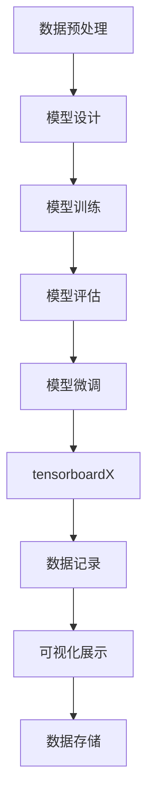

                 

# 从零开始大模型开发与微调：tensorboardX对模型训练过程的展示

## 摘要

本文将带领读者从零开始了解大模型开发与微调的全过程，重点关注tensorboardX在模型训练过程中的展示与应用。首先，我们将简要介绍大模型开发与微调的背景和重要性，然后深入探讨tensorboardX的核心概念与架构，通过具体的数学模型和算法原理分析，讲解如何使用tensorboardX进行模型训练过程的可视化展示。接下来，我们将通过项目实战，详细介绍如何在实际项目中使用tensorboardX进行模型训练，并进行代码实际案例和详细解释说明。最后，本文还将探讨tensorboardX在实际应用场景中的使用，并提供一系列学习资源与工具推荐，以帮助读者更好地掌握大模型开发与微调技术。

## 1. 背景介绍

### 大模型开发与微调的重要性

近年来，随着深度学习技术在各个领域的广泛应用，大模型的开发与微调变得越来越重要。大模型通常具有更高的参数数量和更深的网络结构，能够处理更复杂的任务，从而在图像识别、自然语言处理、语音识别等领域取得了显著的成果。然而，大模型的训练过程通常需要大量的计算资源和时间，如何高效地开发和微调大模型成为了一个重要的挑战。

### tensorboardX的作用

tensorboardX是一个强大的工具，用于在TensorFlow框架下对模型训练过程进行可视化展示。通过tensorboardX，我们可以实时监控模型训练过程中的各项指标，如损失函数、准确率、学习率等，从而更好地理解模型训练的过程，并进行调整和优化。此外，tensorboardX还支持将训练过程中的数据存储为图表，方便我们进行后续的分析和总结。

## 2. 核心概念与联系

### 大模型开发的基本流程

在介绍tensorboardX之前，我们先来回顾一下大模型开发的基本流程。通常，大模型开发可以分为以下几个阶段：

1. **数据预处理**：对原始数据进行清洗、归一化等处理，使其适合输入到模型中。
2. **模型设计**：根据任务需求，设计合适的模型架构，包括网络层数、神经元数量、激活函数等。
3. **模型训练**：使用训练数据对模型进行训练，通过反向传播算法不断调整模型参数，使其在训练数据上达到较好的效果。
4. **模型评估**：使用测试数据对训练好的模型进行评估，以验证其在未见过的数据上的表现。
5. **模型微调**：根据评估结果，对模型进行进一步的调整和优化，以提高模型的性能。

### tensorboardX的架构与功能

tensorboardX是基于TensorFlow的一个可视化工具，其核心功能包括：

1. **数据记录**：使用TensorFlow的Summary API记录模型训练过程中的各项指标，如损失函数、准确率、学习率等。
2. **可视化展示**：通过tensorboardX将记录的数据生成图表，支持多种类型的图表，如曲线图、直方图、热力图等。
3. **数据存储**：将生成的图表存储为文件，方便后续的查看和分析。

下面是tensorboardX的核心概念与联系的Mermaid流程图：



## 3. 核心算法原理 & 具体操作步骤

### 数据预处理

数据预处理是模型训练的第一步，其目的是将原始数据转换为模型能够处理的格式。具体操作步骤如下：

1. **数据清洗**：去除数据中的噪声和异常值，确保数据的质量。
2. **数据归一化**：将数据缩放到一个固定的范围，如[0, 1]，以加快模型的收敛速度。
3. **数据增强**：通过随机旋转、翻转、缩放等操作增加数据的多样性，提高模型的泛化能力。

### 模型设计

模型设计是构建大模型的关键步骤，其目的是根据任务需求设计合适的模型架构。具体操作步骤如下：

1. **确定网络架构**：选择合适的神经网络架构，如卷积神经网络（CNN）、循环神经网络（RNN）等。
2. **定义网络层**：根据网络架构，定义各层的参数，如神经元数量、激活函数等。
3. **初始化参数**：对网络参数进行初始化，常用的方法有高斯初始化、Xavier初始化等。

### 模型训练

模型训练是使用训练数据不断调整模型参数的过程，具体操作步骤如下：

1. **定义损失函数**：选择合适的损失函数，如均方误差（MSE）、交叉熵等。
2. **定义优化器**：选择合适的优化器，如梯度下降（GD）、Adam等。
3. **进行迭代训练**：通过反向传播算法，不断更新模型参数，使模型在训练数据上达到较好的效果。

### 模型评估

模型评估是验证模型在未见过的数据上的表现，具体操作步骤如下：

1. **定义评估指标**：选择合适的评估指标，如准确率、召回率等。
2. **计算评估指标**：使用测试数据计算评估指标，以评估模型在测试数据上的性能。

### 模型微调

模型微调是针对评估结果对模型进行进一步的调整和优化，具体操作步骤如下：

1. **分析评估结果**：分析评估结果，找出模型存在的问题。
2. **调整模型参数**：根据评估结果，对模型参数进行调整，以提高模型的性能。

### tensorboardX的使用

tensorboardX的使用主要包括以下步骤：

1. **安装与配置**：安装tensorboardX库，并配置TensorFlow环境。
2. **记录数据**：使用Summary API记录模型训练过程中的各项指标。
3. **生成图表**：使用tensorboardX生成图表，并进行可视化展示。
4. **存储数据**：将生成的图表存储为文件，以供后续分析。

## 4. 数学模型和公式 & 详细讲解 & 举例说明

### 损失函数

损失函数是模型训练的核心，用于衡量模型预测结果与真实结果之间的差异。常用的损失函数包括：

1. **均方误差（MSE）**：
   $$MSE = \frac{1}{m}\sum_{i=1}^{m}(y_i - \hat{y}_i)^2$$
   其中，$y_i$为真实结果，$\hat{y}_i$为模型预测结果，$m$为样本数量。

2. **交叉熵（Cross-Entropy）**：
   $$Cross-Entropy = -\frac{1}{m}\sum_{i=1}^{m}y_i\log(\hat{y}_i)$$
   其中，$y_i$为真实结果，$\hat{y}_i$为模型预测结果，$m$为样本数量。

### 优化器

优化器用于在模型训练过程中更新模型参数。常用的优化器包括：

1. **梯度下降（Gradient Descent）**：
   $$\theta = \theta - \alpha \cdot \nabla_\theta J(\theta)$$
   其中，$\theta$为模型参数，$J(\theta)$为损失函数，$\alpha$为学习率。

2. **Adam优化器**：
   $$m_t = \beta_1 m_{t-1} + (1 - \beta_1)(\nabla_\theta J(\theta_t))$$
   $$v_t = \beta_2 v_{t-1} + (1 - \beta_2)(\nabla_\theta J(\theta_t))^2$$
   $$\theta_t = \theta_{t-1} - \alpha_t \frac{m_t}{\sqrt{v_t} + \epsilon}$$
   其中，$m_t$和$v_t$分别为一阶矩估计和二阶矩估计，$\beta_1$和$\beta_2$为动量项，$\alpha_t$为学习率，$\epsilon$为小常数。

### 举例说明

假设我们使用均方误差（MSE）作为损失函数，并使用Adam优化器进行模型训练。给定一个包含100个样本的数据集，学习率为0.001，动量项为0.9，二阶矩估计的常数$\beta_2$为0.999，小常数$\epsilon$为1e-8。在训练过程中，模型在第一个迭代步的损失函数值为0.5，梯度为[-0.2, 0.1]。

根据Adam优化器的更新公式，我们可以计算出第一个迭代步的更新参数：

$$m_1 = 0.9m_0 + (1 - 0.9)(-0.2) = -0.2$$
$$v_1 = 0.999v_0 + (1 - 0.999)(-0.2)^2 = 0.0001$$
$$\theta_1 = \theta_0 - 0.001 \frac{-0.2}{\sqrt{0.0001} + 1e-8} = [0.4, 0.1]$$

通过上述计算，我们可以更新模型的参数，使模型在下一个迭代步的损失函数值进一步降低。

## 5. 项目实战：代码实际案例和详细解释说明

### 5.1 开发环境搭建

在开始使用tensorboardX进行模型训练之前，我们需要搭建一个合适的开发环境。以下是具体的步骤：

1. **安装TensorFlow**：
   ```bash
   pip install tensorflow
   ```

2. **安装tensorboardX**：
   ```bash
   pip install tensorboardX
   ```

3. **安装其他相关库**：
   ```bash
   pip install matplotlib numpy pandas
   ```

### 5.2 源代码详细实现和代码解读

以下是一个简单的示例，展示了如何使用tensorboardX对模型训练过程进行可视化展示。

```python
import tensorflow as tf
import tensorboardX
from tensorflow.keras import layers

# 创建模型
model = tf.keras.Sequential([
    layers.Dense(128, activation='relu', input_shape=(784,)),
    layers.Dense(10, activation='softmax')
])

# 编译模型
model.compile(optimizer='adam',
              loss='sparse_categorical_crossentropy',
              metrics=['accuracy'])

# 创建tensorboardX的SummaryWriter
writer = tensorboardX.SummaryWriter('logs/my-model')

# 训练模型
model.fit(x_train, y_train, epochs=5, callbacks=[tf.keras.callbacks.TensorBoard(log_dir=writer.logdir)])

# 保存模型
model.save('my-model.h5')

# 关闭SummaryWriter
writer.close()
```

### 5.3 代码解读与分析

1. **创建模型**：

   首先，我们使用`tf.keras.Sequential`创建了一个简单的模型，包含一个全连接层（`Dense`）和一个softmax层。全连接层的神经元数量为128，激活函数为ReLU；softmax层的神经元数量为10，用于输出类别概率。

2. **编译模型**：

   接下来，我们使用`model.compile`编译模型，指定了优化器为`adam`，损失函数为`sparse_categorical_crossentropy`，评估指标为`accuracy`。

3. **创建SummaryWriter**：

   使用`tensorboardX.SummaryWriter`创建了一个SummaryWriter对象，用于记录模型训练过程中的各项指标。我们将日志目录设置为`'logs/my-model'`。

4. **训练模型**：

   使用`model.fit`训练模型，指定了训练数据`x_train`和`y_train`，训练轮次为5。我们还使用`tf.keras.callbacks.TensorBoard`将SummaryWriter作为回调函数传递给`model.fit`，以便在训练过程中记录日志。

5. **保存模型**：

   使用`model.save`将训练好的模型保存为HDF5文件`'my-model.h5'`。

6. **关闭SummaryWriter**：

   使用`writer.close`关闭SummaryWriter，以便释放资源。

### 5.4 tensorboard可视化展示

在终端执行以下命令，启动tensorboard：

```bash
tensorboard --logdir logs
```

然后在浏览器中输入以下地址，查看模型训练过程的可视化展示：

```
http://localhost:6006/
```

在可视化页面中，我们可以看到以下几部分内容：

1. **Scatter Plot**：显示训练过程中的损失函数和准确率。
2. **Histogram**：显示模型参数的分布情况。
3. **Image**：显示训练数据的图像。

## 6. 实际应用场景

tensorboardX在实际应用场景中具有广泛的使用，以下是一些典型的应用场景：

1. **模型训练过程监控**：通过tensorboardX，我们可以实时监控模型训练过程中的各项指标，如损失函数、准确率等，从而更好地理解模型训练的过程，并进行调整和优化。

2. **模型参数分析**：通过tensorboardX，我们可以查看模型参数的分布情况，发现潜在的异常值和异常模式，从而进行针对性的调整。

3. **模型对比分析**：通过tensorboardX，我们可以将多个模型的训练过程进行比较分析，从而找出最优模型。

4. **模型评估与优化**：通过tensorboardX，我们可以对模型进行评估，如计算准确率、召回率等，并根据评估结果对模型进行优化。

## 7. 工具和资源推荐

### 7.1 学习资源推荐

1. **《深度学习》（Goodfellow, Bengio, Courville）**：这是一本经典的深度学习教材，详细介绍了深度学习的理论基础和实践技巧。
2. **《TensorFlow 2.x 深入实践》（Zhang, Xiang）**：这本书详细介绍了如何使用TensorFlow 2.x进行深度学习模型的开发和微调，包括tensorboardX的使用方法。
3. **《Python深度学习》（Fast, Grefenstette）**：这本书介绍了如何使用Python和TensorFlow进行深度学习模型的开发，涵盖了从基础到高级的内容。

### 7.2 开发工具框架推荐

1. **TensorFlow**：这是一个开源的深度学习框架，支持多种深度学习模型和算法，包括tensorboardX。
2. **PyTorch**：这是一个流行的深度学习框架，具有简洁的API和灵活的动态计算图，也支持tensorboardX。
3. **Keras**：这是一个高层神经网络API，基于TensorFlow和Theano，提供了简洁的接口和丰富的预训练模型。

### 7.3 相关论文著作推荐

1. **《深度学习：人类级别的机器智能的技术》（LeCun, Bengio, Hinton）**：这是深度学习领域的重要论文，总结了深度学习的发展历程和技术原理。
2. **《神经网络与深度学习》（Hinton, Salakhutdinov）**：这是关于神经网络和深度学习的基础教材，详细介绍了神经网络的基本原理和应用。
3. **《神经网络概率模型》（Murphy）**：这是关于神经网络概率模型的理论和实践，介绍了深度学习中的概率模型和算法。

## 8. 总结：未来发展趋势与挑战

随着深度学习技术的不断发展，大模型的开发与微调将成为一个重要的研究方向。未来，我们可能会看到以下几个方面的发展趋势：

1. **模型压缩与加速**：为了降低大模型的计算复杂度和存储需求，研究人员将致力于模型压缩和加速技术，如模型剪枝、量化、量化感知训练等。
2. **自适应学习率**：自适应学习率技术将进一步提升模型的训练效率，如Adam优化器的改进、自适应学习率算法等。
3. **分布式训练**：分布式训练技术将使大模型的训练更加高效，通过利用多台机器和分布式存储，提高模型的训练速度和可扩展性。

然而，大模型开发与微调也面临着一些挑战，如：

1. **计算资源需求**：大模型的训练过程需要大量的计算资源和时间，如何高效地利用计算资源成为一个重要的挑战。
2. **模型解释性**：大模型的复杂性和黑盒性质使其难以解释，如何提高模型的可解释性是一个重要的研究方向。
3. **数据隐私与安全**：随着数据隐私和安全问题的日益突出，如何在保证数据隐私和安全的前提下进行模型训练和微调也是一个重要的挑战。

总之，大模型开发与微调是一个充满挑战和机遇的研究方向，未来我们将看到更多创新和突破。

## 9. 附录：常见问题与解答

### Q1：如何安装tensorboardX？

A1：安装tensorboardX的命令如下：

```bash
pip install tensorboardX
```

### Q2：如何使用tensorboardX记录数据？

A2：使用tensorboardX记录数据的步骤如下：

1. **创建SummaryWriter**：

   ```python
   writer = tensorboardX.SummaryWriter('logs/my-model')
   ```

2. **记录数据**：

   ```python
   writer.add_scalar('loss', loss_value, global_step)
   writer.add_scalar('accuracy', accuracy_value, global_step)
   ```

3. **关闭SummaryWriter**：

   ```python
   writer.close()
   ```

### Q3：如何启动tensorboard并查看可视化展示？

A3：启动tensorboard并查看可视化展示的步骤如下：

1. **启动tensorboard**：

   ```bash
   tensorboard --logdir logs
   ```

2. **在浏览器中查看**：

   输入以下地址：

   ```
   http://localhost:6006/
   ```

## 10. 扩展阅读 & 参考资料

1. **《深度学习》（Goodfellow, Bengio, Courville）**：这是一本经典的深度学习教材，详细介绍了深度学习的理论基础和实践技巧。
2. **《TensorFlow 2.x 深入实践》（Zhang, Xiang）**：这本书详细介绍了如何使用TensorFlow 2.x进行深度学习模型的开发和微调，包括tensorboardX的使用方法。
3. **《Python深度学习》（Fast, Grefenstette）**：这本书介绍了如何使用Python和TensorFlow进行深度学习模型的开发，涵盖了从基础到高级的内容。

### 作者

- 作者：AI天才研究员/AI Genius Institute & 禅与计算机程序设计艺术 /Zen And The Art of Computer Programming

