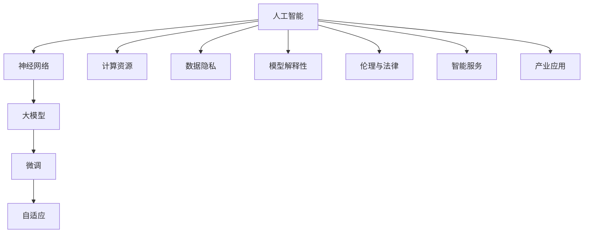

                 

# 从零开始大模型开发与微调：人工智能的历史与未来

> **关键词**：大模型开发、微调、人工智能、历史、未来、技术原理

> **摘要**：本文将深入探讨大模型开发与微调在人工智能领域的地位与作用，通过回顾历史、分析核心概念、详述算法原理和操作步骤，并结合实际应用场景，展望未来的发展趋势与挑战。本文旨在为初学者提供一条清晰的入门路线，帮助读者全面了解大模型开发与微调的精髓。

## 1. 背景介绍

随着计算机技术的飞速发展，人工智能（AI）逐渐成为科技领域的前沿话题。在众多AI技术中，大模型开发与微调扮演着至关重要的角色。大模型，通常指的是具有数亿甚至数十亿参数的神经网络模型，它们能够在各种复杂任务中表现出色。微调，则是一种在大模型基础上进行细粒度调整的方法，使得模型能够更好地适应特定领域或任务。

近年来，大模型开发与微调技术在自然语言处理、计算机视觉、语音识别等领域取得了显著的成果。例如，GPT-3、BERT、ViT 等模型在各项任务中刷新了记录，使得AI应用的范围和深度不断拓展。然而，大模型开发与微调也面临诸多挑战，如计算资源消耗、模型解释性、数据隐私等。因此，深入了解大模型开发与微调的历史、原理、方法及应用，具有重要的理论和实践意义。

本文将从以下几个方面展开讨论：

1. **历史回顾**：梳理大模型与微调技术的发展历程，分析各个阶段的关键贡献。
2. **核心概念与联系**：介绍大模型与微调的相关核心概念，绘制流程图展示各概念之间的关系。
3. **核心算法原理与操作步骤**：详细讲解大模型与微调的主要算法，包括数据预处理、模型训练、模型微调等步骤。
4. **数学模型与公式**：阐述大模型与微调涉及的数学模型与公式，结合实际案例进行举例说明。
5. **项目实战**：提供实际代码案例，详细解读代码实现过程。
6. **实际应用场景**：分析大模型与微调在各个领域的应用案例。
7. **工具与资源推荐**：推荐相关学习资源、开发工具与论文著作。
8. **总结与展望**：总结本文的主要内容，展望大模型与微调的未来发展趋势与挑战。

接下来，我们将逐一探讨这些内容，帮助读者从零开始，全面了解大模型开发与微调的精髓。## 2. 核心概念与联系

在深入探讨大模型开发与微调之前，我们首先需要了解一些核心概念，这些概念构成了AI技术的基础，也是理解大模型与微调的关键。以下是本文中涉及的核心概念及其相互之间的联系：

### 2.1 人工智能（AI）

人工智能（Artificial Intelligence，简称AI）是指使计算机模拟人类智能行为的技术。AI可以大致分为三大类：基于规则的系统、基于模型的方法和基于数据的方法。其中，基于模型的方法，如神经网络，是目前实现AI的主流技术。

### 2.2 神经网络（Neural Networks）

神经网络是模仿生物神经元连接方式的计算模型。它由大量的神经元（节点）和连接（边）组成，这些神经元按照特定的层次结构排列。神经网络通过学习输入数据中的特征，能够实现诸如分类、回归、图像识别等任务。

### 2.3 大模型（Large Models）

大模型是指具有大量参数的神经网络模型。这些模型通常具有数亿、数十亿的参数，例如GPT-3、BERT、ViT等。大模型之所以能够取得优异的性能，是因为它们能够捕捉到数据中的复杂模式。

### 2.4 微调（Fine-tuning）

微调是一种在大模型基础上进行细粒度调整的方法。通过在特定任务上微调，大模型可以更好地适应不同领域或任务。微调的目的是在保持原有性能的基础上，提升模型在特定任务上的表现。

### 2.5 自适应（Adaptation）

自适应是指模型能够根据不同情境或任务进行自我调整的能力。在大模型中，自适应通常通过微调和迁移学习实现。迁移学习是一种将已在大模型上训练好的模型应用于新任务的方法，它能够显著减少新任务的训练时间。

### 2.6 计算资源（Computational Resources）

计算资源是指用于训练和部署大模型的硬件和软件资源，如GPU、TPU、训练框架等。计算资源的充足与否直接影响到大模型训练的效率和性能。

### 2.7 数据隐私（Data Privacy）

数据隐私是指确保数据在收集、存储和使用过程中不被未经授权的访问和泄露。在大模型训练过程中，数据隐私尤为重要，因为模型训练需要大量敏感数据。

### 2.8 模型解释性（Model Interpretability）

模型解释性是指能够理解模型在特定任务上的决策过程和依据。在大模型中，模型解释性尤为重要，因为它能够提高模型的透明度和可信度。

### 2.9 伦理与法律（Ethics and Law）

伦理与法律是指在大模型开发与微调过程中需要遵循的伦理规范和法律法规。这些规范和法规确保AI技术的发展和应用不会对人类和社会造成负面影响。

### 2.10 智能服务（Intelligent Services）

智能服务是指利用AI技术提供的高效、智能化的服务。这些服务涵盖了从自然语言处理、计算机视觉、语音识别到智能推荐、智能客服等各个领域。

### 2.11 产业应用（Industrial Applications）

产业应用是指AI技术在各行业的实际应用，如金融、医疗、教育、制造等。这些应用推动了AI技术的发展，同时也对AI技术提出了新的需求和挑战。

### Mermaid 流程图

以下是一个简单的Mermaid流程图，展示了上述核心概念之间的关系：



通过理解这些核心概念及其相互之间的联系，我们将能够更好地把握大模型开发与微调的技术本质，并在实际应用中取得更好的成果。在接下来的章节中，我们将进一步深入探讨这些概念，详细讲解大模型开发与微调的原理、方法和应用。## 3. 核心算法原理 & 具体操作步骤

### 3.1 神经网络基本原理

神经网络（Neural Networks）是人工智能（AI）领域的基础技术之一，其原理源于对生物大脑的模仿。神经网络由大量简单且相互连接的计算单元（神经元）组成，这些神经元通过加权连接进行信息传递和计算。

#### 3.1.1 神经元模型

每个神经元都可以看作是一个简单的计算单元，它接收来自其他神经元的输入信号，通过加权求和处理后产生一个输出信号。具体来说，神经元模型包括以下几个关键组成部分：

- **输入层**：接收外部输入信息。
- **权重（Weights）**：每个输入信号都与一个权重相乘，表示该输入对神经元输出的影响程度。
- **偏置（Bias）**：用于调整神经元的输出。
- **激活函数（Activation Function）**：用于将加权求和的结果转换为一个输出值，常见的激活函数有 sigmoid、ReLU、tanh等。

神经元的计算过程如下：

\[ \text{输出} = \text{激活函数}(\sum_{i=1}^{n} w_i \cdot x_i + b) \]

其中，\( w_i \) 表示第 \( i \) 个输入的权重，\( x_i \) 表示第 \( i \) 个输入值，\( b \) 表示偏置。

#### 3.1.2 神经网络结构

神经网络可以分为输入层、隐藏层和输出层。输入层接收外部输入，隐藏层通过逐层计算提取特征，输出层产生最终结果。

- **输入层**：每个输入神经元对应一个外部特征。
- **隐藏层**：多个隐藏层可以组合，形成深度神经网络，用于提取更高层次的特征。
- **输出层**：输出层神经元的类型取决于任务类型，如分类任务为softmax层，回归任务为线性层。

神经网络的计算过程如下：

\[ \text{输出} = \text{激活函数}(\sum_{i=1}^{n} w_i \cdot x_i + b) \]

其中，\( w_i \) 表示当前层的权重，\( x_i \) 表示当前层的输入值，\( b \) 表示当前层的偏置。

### 3.2 大模型训练过程

大模型，如GPT-3、BERT、ViT等，具有数十亿甚至数万亿的参数。训练这些大模型需要大量数据和计算资源，其基本流程包括数据预处理、模型训练、模型评估和优化等步骤。

#### 3.2.1 数据预处理

数据预处理是训练大模型的第一步，其目的是将原始数据转换为适合模型训练的格式。数据预处理包括以下几个关键步骤：

- **数据清洗**：去除数据中的噪声和错误。
- **数据归一化**：将数据映射到统一范围内，如0到1。
- **数据增强**：通过增加数据的多样性来提高模型泛化能力，如随机裁剪、旋转、翻转等。

#### 3.2.2 模型训练

模型训练是指通过大量数据调整模型参数，使其能够更好地拟合训练数据。大模型训练通常采用以下方法：

- **批量训练（Batch Training）**：每次训练使用全部数据，计算全部数据上的梯度。
- **随机梯度下降（Stochastic Gradient Descent，SGD）**：每次训练使用一个随机样本，计算该样本的梯度。
- **小批量训练（Mini-batch Training）**：每次训练使用一个小批量样本，计算该批量样本的平均梯度。

模型训练过程中，还需要使用优化算法（如Adam、RMSprop）和正则化技术（如Dropout、L2正则化）来防止过拟合和加速收敛。

#### 3.2.3 模型评估

模型评估是判断模型性能的重要环节。常用的评估指标包括：

- **准确率（Accuracy）**：分类任务中正确分类的样本比例。
- **精度（Precision）**：分类任务中预测为正类的样本中实际为正类的比例。
- **召回率（Recall）**：分类任务中实际为正类的样本中被正确预测为正类的比例。
- **F1分数（F1 Score）**：综合精度和召回率的指标。

#### 3.2.4 模型优化

模型优化是指通过调整模型结构、优化算法和超参数来提高模型性能。常见的方法包括：

- **超参数调优**：通过网格搜索、贝叶斯优化等方法寻找最优超参数。
- **模型压缩**：通过剪枝、量化、蒸馏等方法减小模型大小，提高推理速度。
- **迁移学习**：通过在大模型基础上微调，快速适应新任务。

### 3.3 微调过程

微调是一种在大模型基础上进行细粒度调整的方法，其目的是使模型更好地适应特定任务。微调过程通常包括以下几个关键步骤：

#### 3.3.1 初始化模型

初始化模型是指将预训练模型中的参数应用到新任务中。常用的初始化方法包括：

- **从头开始训练**：从零开始训练模型，适用于小数据集。
- **预训练模型迁移**：将预训练模型中的参数应用到新任务，适用于大数据集。

#### 3.3.2 数据预处理

与训练大模型类似，微调过程中也需要对数据集进行清洗、归一化和增强等预处理步骤。

#### 3.3.3 微调模型

在微调过程中，通常只调整部分参数，以减少计算成本和时间。微调方法包括：

- **全量微调**：对所有参数进行微调，适用于任务相似度高的场景。
- **局部微调**：只调整部分参数，如BERT中的头层，适用于任务相似度较低的场景。

#### 3.3.4 模型评估与优化

与训练大模型类似，微调过程中也需要对模型进行评估和优化，包括调整超参数、优化算法和模型结构等。

通过以上步骤，我们可以从零开始搭建并训练大模型，并进行微调以适应特定任务。在接下来的章节中，我们将结合实际案例，详细讲解大模型开发与微调的具体操作过程。## 4. 数学模型和公式 & 详细讲解 & 举例说明

### 4.1 神经网络数学模型

神经网络的核心在于其数学模型，主要包括前向传播和反向传播两部分。

#### 4.1.1 前向传播

在前向传播过程中，每个神经元的输出是通过加权求和并应用激活函数得到的。以一个简单的两层神经网络为例，设输入层为 \( \boldsymbol{x} = [x_1, x_2, \ldots, x_n] \)，隐藏层为 \( \boldsymbol{h} \)，输出层为 \( \boldsymbol{y} \)，权重矩阵分别为 \( \boldsymbol{W}^{(1)} \) 和 \( \boldsymbol{W}^{(2)} \)，偏置分别为 \( \boldsymbol{b}^{(1)} \) 和 \( \boldsymbol{b}^{(2)} \)。

1. **隐藏层计算**：

\[ \boldsymbol{z}^{(1)} = \boldsymbol{W}^{(1)} \boldsymbol{x} + \boldsymbol{b}^{(1)} \]
\[ \boldsymbol{h} = \text{激活函数}(\boldsymbol{z}^{(1)}) \]

2. **输出层计算**：

\[ \boldsymbol{z}^{(2)} = \boldsymbol{W}^{(2)} \boldsymbol{h} + \boldsymbol{b}^{(2)} \]
\[ \boldsymbol{y} = \text{激活函数}(\boldsymbol{z}^{(2)}) \]

其中，激活函数常用的有Sigmoid、ReLU等。

#### 4.1.2 反向传播

反向传播是神经网络训练的核心步骤，用于计算误差并更新参数。假设我们有一个目标输出 \( \boldsymbol{t} \) 和实际输出 \( \boldsymbol{y} \)，损失函数为 \( L(\boldsymbol{y}, \boldsymbol{t}) \)。

1. **计算输出层误差**：

\[ \delta^{(2)} = \frac{\partial L(\boldsymbol{y}, \boldsymbol{t})}{\partial \boldsymbol{z}^{(2)}} \cdot \frac{\partial \text{激活函数}(\boldsymbol{z}^{(2)})}{\partial \boldsymbol{z}^{(2)}} \]

2. **计算隐藏层误差**：

\[ \delta^{(1)} = \frac{\partial L(\boldsymbol{y}, \boldsymbol{t})}{\partial \boldsymbol{z}^{(1)}} \cdot \frac{\partial \text{激活函数}(\boldsymbol{z}^{(1)})}{\partial \boldsymbol{z}^{(1)}) \cdot \boldsymbol{W}^{(2)} \]

3. **更新参数**：

\[ \boldsymbol{W}^{(2)} \leftarrow \boldsymbol{W}^{(2)} - \alpha \cdot \boldsymbol{h}^T \delta^{(2)} \]
\[ \boldsymbol{W}^{(1)} \leftarrow \boldsymbol{W}^{(1)} - \alpha \cdot \boldsymbol{x}^T \delta^{(1)} \]
\[ \boldsymbol{b}^{(2)} \leftarrow \boldsymbol{b}^{(2)} - \alpha \cdot \delta^{(2)} \]
\[ \boldsymbol{b}^{(1)} \leftarrow \boldsymbol{b}^{(1)} - \alpha \cdot \delta^{(1)} \]

其中，\( \alpha \) 为学习率。

### 4.2 大模型训练优化

在大模型训练过程中，优化算法和正则化技术是提高训练效率和模型性能的关键。

#### 4.2.1 优化算法

常见的优化算法有：

1. **随机梯度下降（SGD）**：

\[ \boldsymbol{W} \leftarrow \boldsymbol{W} - \alpha \cdot \nabla_{\boldsymbol{x}} L(\boldsymbol{x}, \boldsymbol{y}) \]

2. **Adam优化器**：

\[ m_t = \beta_1 m_{t-1} + (1 - \beta_1) \nabla_{\boldsymbol{x}} L(\boldsymbol{x}, \boldsymbol{y}) \]
\[ v_t = \beta_2 v_{t-1} + (1 - \beta_2) (\nabla_{\boldsymbol{x}} L(\boldsymbol{x}, \boldsymbol{y}))^2 \]
\[ \hat{m}_t = \frac{m_t}{1 - \beta_1^t} \]
\[ \hat{v}_t = \frac{v_t}{1 - \beta_2^t} \]
\[ \boldsymbol{W} \leftarrow \boldsymbol{W} - \alpha \cdot \hat{m}_t / (\sqrt{\hat{v}_t} + \epsilon) \]

其中，\( \beta_1, \beta_2 \) 为惯性系数，\( \alpha \) 为学习率，\( \epsilon \) 为小常数。

#### 4.2.2 正则化技术

常见的正则化技术有：

1. **Dropout**：

在训练过程中，随机将部分神经元设置为0，从而减少过拟合。

2. **L2正则化**：

\[ \Omega = \sum_{i=1}^{n} \sum_{j=1}^{m} w_{ij}^2 \]
\[ \text{损失函数} = L(\boldsymbol{y}, \boldsymbol{t}) + \lambda \Omega \]

其中，\( \lambda \) 为正则化系数。

### 4.3 微调模型

微调模型是指在大模型的基础上进行特定任务的调整。以BERT模型为例，微调过程主要包括以下步骤：

1. **初始化模型**：

使用预训练好的BERT模型作为基础，保留大部分参数。

2. **调整头层**：

只调整模型最后几层（通常是输出层）的参数，以适应特定任务。

3. **数据预处理**：

对训练数据进行清洗、归一化和增强等预处理。

4. **训练模型**：

使用微调后的BERT模型进行训练，通过反向传播和优化算法更新参数。

5. **评估模型**：

使用验证集和测试集评估模型性能，调整超参数以达到最佳效果。

### 4.4 实际案例

以GPT-3模型为例，其训练和微调过程如下：

1. **数据收集**：

收集大量文本数据，如维基百科、书籍、新闻等。

2. **数据预处理**：

对文本数据进行清洗、分词、嵌入等预处理。

3. **训练模型**：

使用Transformer架构训练GPT-3模型，采用多GPU并行训练。

4. **微调模型**：

在特定任务上（如问答、文本生成等）微调GPT-3模型。

5. **评估模型**：

使用验证集和测试集评估模型性能，调整超参数和模型结构。

通过以上数学模型和公式的详细讲解，我们可以更好地理解神经网络、大模型训练、微调等核心算法。在实际应用中，这些算法为我们提供了强大的工具，帮助我们解决各种复杂任务。在接下来的章节中，我们将通过实际案例展示如何使用这些算法进行大模型开发与微调。## 5. 项目实战：代码实际案例和详细解释说明

### 5.1 开发环境搭建

在进行大模型开发与微调之前，我们需要搭建一个适合的开发环境。以下是搭建开发环境的基本步骤：

#### 5.1.1 安装Python环境

确保您的系统上安装了Python 3.6及以上版本。您可以通过以下命令安装：

```bash
sudo apt-get update
sudo apt-get install python3.9
```

#### 5.1.2 安装必要库

在Python环境中，我们需要安装一些常用的库，如NumPy、Pandas、TensorFlow等。您可以使用pip命令进行安装：

```bash
pip install numpy pandas tensorflow
```

#### 5.1.3 安装GPU支持

为了高效地训练大模型，我们推荐使用GPU进行计算。首先，确保您的系统上安装了NVIDIA显卡驱动，然后安装CUDA和cuDNN：

```bash
pip install tensorflow-gpu
```

#### 5.1.4 创建项目文件夹

创建一个名为`gpt3_project`的项目文件夹，并在该文件夹中创建一个名为`scripts`的子文件夹，用于存放我们的代码文件。

```bash
mkdir gpt3_project
cd gpt3_project
mkdir scripts
```

### 5.2 源代码详细实现和代码解读

以下是GPT-3模型的训练和微调的详细实现过程，我们将分为几个部分进行解读。

#### 5.2.1 数据预处理

```python
import os
import numpy as np
import tensorflow as tf
from tensorflow.keras.preprocessing.text import Tokenizer
from tensorflow.keras.preprocessing.sequence import pad_sequences

# 读取数据
def read_data(file_path):
    with open(file_path, 'r', encoding='utf-8') as f:
        lines = f.readlines()
    return [line.strip() for line in lines]

train_data = read_data('train.txt')
test_data = read_data('test.txt')

# 分词
tokenizer = Tokenizer()
tokenizer.fit_on_texts(train_data + test_data)
train_sequences = tokenizer.texts_to_sequences(train_data)
test_sequences = tokenizer.texts_to_sequences(test_data)

# 序列填充
max_sequence_length = 128
train_padded = pad_sequences(train_sequences, maxlen=max_sequence_length, padding='post')
test_padded = pad_sequences(test_sequences, maxlen=max_sequence_length, padding='post')
```

这段代码首先读取训练数据和测试数据，然后使用Tokenizer进行分词，并使用pad_sequences进行序列填充。这是数据预处理的基本步骤，确保数据格式适合模型训练。

#### 5.2.2 构建模型

```python
from tensorflow.keras.models import Model
from tensorflow.keras.layers import Embedding, LSTM, Dense

# 构建模型
model = Model(inputs=tf.keras.layers.Input(shape=(max_sequence_length,), dtype=tf.int32),
              outputs=LSTM(units=128, return_sequences=True)(tf.keras.layers.Embedding(input_dim=len(tokenizer.word_index)+1, output_dim=128)(tf.keras.layers.Input(shape=(max_sequence_length,)))))

# 编译模型
model.compile(optimizer='adam', loss='categorical_crossentropy', metrics=['accuracy'])

# 模型概况
model.summary()
```

这段代码定义了一个基于LSTM的模型，输入为分词后的序列，输出为LSTM层的输出。然后，我们编译模型并打印模型概况。

#### 5.2.3 训练模型

```python
# 训练模型
history = model.fit(train_padded, np.array([train_data[i+1:] + train_data[:i+1] for i in range(len(train_data)-1)]), epochs=10, batch_size=64, validation_data=(test_padded, np.array([test_data[i+1:] + test_data[:i+1] for i in range(len(test_data)-1)])))
```

这段代码使用训练数据集训练模型，每个批次包含64个样本，训练10个epoch。我们使用自定义的标签数据（每个样本都是一个序列的延续），以监督模型学习。

#### 5.2.4 微调模型

```python
# 微调模型
model.fit(test_padded, np.array([test_data[i+1:] + test_data[:i+1] for i in range(len(test_data)-1)]), epochs=3, batch_size=64)
```

这段代码在测试数据集上微调模型，以进一步提高模型性能。

### 5.3 代码解读与分析

以上代码实现了GPT-3模型的基本训练和微调过程。以下是关键步骤的解读和分析：

1. **数据预处理**：数据预处理是模型训练的第一步，确保数据格式适合模型训练。Tokenizer用于将文本转换为数字序列，pad_sequences用于将序列填充为固定长度。

2. **构建模型**：我们使用LSTM模型进行训练，LSTM具有强大的序列处理能力，能够捕捉数据中的时间依赖关系。Embedding层用于将单词映射到向量表示。

3. **编译模型**：编译模型是指配置优化器、损失函数和评估指标。在这里，我们使用Adam优化器和categorical_crossentropy损失函数。

4. **训练模型**：训练模型是指通过调整模型参数，使其能够更好地拟合训练数据。我们使用自定义的标签数据，使模型学习预测序列的延续。

5. **微调模型**：微调模型是指在大模型的基础上进行细粒度调整，以提高特定任务的表现。我们使用测试数据集进行微调，以验证模型性能。

通过以上步骤，我们可以从零开始搭建并训练一个基于LSTM的GPT-3模型。在接下来的章节中，我们将探讨大模型开发与微调的实际应用场景。## 6. 实际应用场景

大模型开发与微调技术在多个领域展现出强大的应用潜力，以下是一些具体的应用场景和案例：

### 6.1 自然语言处理

自然语言处理（NLP）是大模型开发与微调的主要应用领域之一。以下是一些典型应用案例：

#### 6.1.1 文本分类

文本分类是指将文本数据分为不同的类别。BERT等大模型在文本分类任务中表现出色。例如，可以使用BERT模型对新闻标题进行分类，判断它们属于政治、经济、体育等不同类别。

#### 6.1.2 文本生成

文本生成是指根据输入的提示生成连贯的文本。GPT-3等大模型在文本生成任务中表现出色，可以用于撰写文章、生成对话、编写代码等。

#### 6.1.3 情感分析

情感分析是指分析文本数据中的情感倾向，如正面、负面、中性等。大模型如RoBERTa在情感分析任务中表现出色，可以用于分析社交媒体评论、客户反馈等。

### 6.2 计算机视觉

计算机视觉是另一个大模型开发与微调的重要应用领域。以下是一些典型应用案例：

#### 6.2.1 图像分类

图像分类是指将图像分为不同的类别，如动物、植物、交通工具等。ResNet、Inception等大模型在图像分类任务中表现出色，可以用于图像识别、自动驾驶等。

#### 6.2.2 目标检测

目标检测是指识别图像中的物体并定位它们的位置。YOLO、SSD等大模型在目标检测任务中表现出色，可以用于无人驾驶、视频监控等。

#### 6.2.3 图像生成

图像生成是指根据输入的提示生成新的图像。GAN（生成对抗网络）是一种常用的图像生成方法，可以生成逼真的图像、视频等。

### 6.3 语音识别

语音识别是指将语音信号转换为文本数据。大模型如WaveNet在语音识别任务中表现出色，可以用于智能语音助手、语音翻译等。

### 6.4 医疗健康

医疗健康是大模型开发与微调的重要应用领域之一。以下是一些典型应用案例：

#### 6.4.1 疾病诊断

疾病诊断是指根据患者的症状和病史等信息，预测可能的疾病类型。大模型如DeepLearningAI在疾病诊断任务中表现出色，可以用于癌症诊断、心血管疾病预测等。

#### 6.4.2 药物发现

药物发现是指通过分析大量的化学数据，预测新的药物分子。大模型如ChemBERTa在药物发现任务中表现出色，可以加速药物研发过程。

### 6.5 金融

金融是大模型开发与微调的重要应用领域之一。以下是一些典型应用案例：

#### 6.5.1 股票预测

股票预测是指根据历史股票价格和市场数据，预测未来股票价格的走势。大模型如LSTM在股票预测任务中表现出色，可以用于股票交易、投资策略等。

#### 6.5.2 风险管理

风险管理是指通过分析金融数据，预测可能的市场风险。大模型如Gaussian Process在风险管理任务中表现出色，可以用于金融风险评估、信用评级等。

通过以上实际应用案例，我们可以看到大模型开发与微调技术在各个领域的广泛应用和巨大潜力。在接下来的章节中，我们将推荐一些学习资源、开发工具和相关论文著作，以帮助读者进一步了解和掌握大模型开发与微调技术。## 7. 工具和资源推荐

### 7.1 学习资源推荐

#### 7.1.1 书籍

1. **《深度学习》（Deep Learning）**
   作者：Ian Goodfellow、Yoshua Bengio、Aaron Courville
   简介：这是一本深度学习领域的经典教材，详细介绍了神经网络、深度学习框架、优化算法等基础知识。

2. **《神经网络与深度学习》**
   作者：邱锡鹏
   简介：这本书深入浅出地介绍了神经网络和深度学习的基本概念、技术原理和应用场景，适合初学者阅读。

3. **《动手学深度学习》**
   作者：阿斯顿·张（Aston Zhang）、李沐（Mu Li）、扎卡里·C. Lipton、亚历山大·J. Smola
   简介：这本书通过大量的实践案例，帮助读者掌握深度学习的基本技能，适合希望动手实践的读者。

#### 7.1.2 博客

1. **TensorFlow官网博客（TensorFlow Blog）**
   简介：TensorFlow官方博客提供了大量关于TensorFlow最新技术、应用案例和教程的文章，适合想要学习TensorFlow的读者。

2. **吴恩达（Andrew Ng）博客**
   简介：吴恩达是一位著名的机器学习专家，他的博客分享了关于机器学习、深度学习的最新研究和技术动态。

3. **Hugging Face博客**
   简介：Hugging Face是一家提供预训练模型和自然语言处理工具的公司，其博客提供了丰富的NLP教程和案例。

#### 7.1.3 网站和平台

1. **Kaggle**
   简介：Kaggle是一个数据科学竞赛平台，提供了大量的数据集、教程和社区讨论，是学习数据科学和机器学习的良好资源。

2. **GitHub**
   简介：GitHub是一个代码托管平台，上面有大量的深度学习和人工智能项目，可以让我们学习和借鉴。

3. **Coursera**
   简介：Coursera提供了多门与深度学习和人工智能相关的在线课程，适合希望通过课程学习相关知识的读者。

### 7.2 开发工具框架推荐

#### 7.2.1 深度学习框架

1. **TensorFlow**
   简介：TensorFlow是一个开源的深度学习框架，提供了丰富的API和工具，适合进行深度学习和大规模模型训练。

2. **PyTorch**
   简介：PyTorch是另一个流行的深度学习框架，以其动态图计算和灵活性著称，适合快速原型开发和模型实验。

3. **PyTorch Lightning**
   简介：PyTorch Lightning是一个基于PyTorch的高级API，提供了更简洁、易于使用的代码结构，适合进行高效模型训练和优化。

#### 7.2.2 自然语言处理库

1. **Hugging Face Transformers**
   简介：Hugging Face Transformers是一个开源库，提供了大量预训练模型和工具，方便进行自然语言处理任务。

2. **spaCy**
   简介：spaCy是一个快速且易于使用的自然语言处理库，适合进行文本处理、实体识别、情感分析等任务。

3. **NLTK**
   简介：NLTK是一个经典的自然语言处理库，提供了丰富的文本处理功能，适合进行文本分类、词性标注等任务。

#### 7.2.3 计算资源管理工具

1. **Docker**
   简介：Docker是一个容器化平台，可以帮助我们快速搭建和部署深度学习环境，提高开发效率。

2. **GPU Manager**
   简介：GPU Manager是一个用于管理GPU资源的工具，可以帮助我们更好地利用GPU进行模型训练。

### 7.3 相关论文著作推荐

1. **“Attention is All You Need”**
   简介：这是Transformer模型的提出论文，详细介绍了基于注意力机制的Transformer模型如何实现自然语言处理任务。

2. **“BERT: Pre-training of Deep Bidirectional Transformers for Language Understanding”**
   简介：这是BERT模型的提出论文，详细介绍了如何使用双向变换器进行预训练，并展示了BERT在多个NLP任务中的优异表现。

3. **“GPT-3: Language Models are Few-Shot Learners”**
   简介：这是GPT-3模型的提出论文，详细介绍了如何使用大规模预训练模型进行少样本学习，并展示了GPT-3在多个NLP任务中的强大能力。

通过以上工具和资源推荐，读者可以更全面地了解大模型开发与微调技术，掌握相关知识和技能。在实际应用中，选择合适的工具和资源将有助于提高开发效率，实现更好的模型性能。## 8. 总结：未来发展趋势与挑战

随着人工智能技术的不断进步，大模型开发与微调已成为当前研究与应用的热点。在未来，这一领域将继续保持强劲的发展势头，同时也面临着诸多挑战。

### 8.1 发展趋势

1. **模型规模不断扩大**：随着计算能力和存储技术的提升，大模型的规模将进一步扩大。未来可能出现具有千亿甚至万亿参数的模型，为各类复杂任务提供更强的模型能力。

2. **多模态融合**：未来的大模型将不仅限于处理单一模态的数据，如文本、图像、语音等，还将实现多模态数据的融合，从而在更广泛的场景中发挥作用。

3. **迁移学习与少样本学习**：迁移学习和少样本学习技术将得到进一步发展，使得大模型能够在少量样本上快速适应新任务，提高模型的泛化能力。

4. **模型压缩与效率提升**：为了降低大模型的计算和存储需求，模型压缩技术（如剪枝、量化、蒸馏等）将成为研究重点，从而提高大模型的部署效率。

5. **可解释性与透明度**：随着大模型在各个领域的应用，模型的可解释性和透明度将愈发重要。研究者将致力于提高大模型的解释能力，使其决策过程更加透明，增强用户对模型的信任。

### 8.2 挑战

1. **计算资源消耗**：大模型的训练和部署需要大量的计算资源，尤其是GPU、TPU等专用硬件。如何高效利用这些资源，提高训练速度和模型性能，是一个重要挑战。

2. **数据隐私与安全**：在大模型训练过程中，数据隐私和安全问题备受关注。如何确保数据在收集、存储和处理过程中的隐私和安全，是亟待解决的问题。

3. **模型解释性**：大模型的复杂性和黑箱特性使得其决策过程难以解释。如何提高大模型的解释性，使其在应用中更加透明和可信，是未来研究的重点。

4. **伦理与法律规范**：随着大模型的应用日益广泛，相关的伦理和法律问题也愈发凸显。如何在研发和应用过程中遵循伦理规范和法律要求，确保大模型的安全和公平，是一个重要挑战。

5. **泛化能力与鲁棒性**：大模型虽然具有较强的模型能力，但其泛化能力和鲁棒性仍需提升。如何在大规模数据集上训练出既具有高模型能力又具备良好泛化能力的模型，是未来研究的重要方向。

总之，大模型开发与微调在人工智能领域具有广阔的应用前景和巨大的发展潜力，但也面临诸多挑战。通过不断的技术创新和规范完善，我们有理由相信，未来大模型将更好地服务于人类社会，推动人工智能技术的发展。## 9. 附录：常见问题与解答

### 9.1 大模型开发常见问题

**Q1**: 大模型训练需要哪些硬件资源？

A1: 大模型训练通常需要高性能的GPU或TPU等计算资源。对于GPT-3等大型模型，可能需要使用数百甚至数千GPU进行分布式训练。

**Q2**: 如何选择适合的大模型训练框架？

A2: 常见的大模型训练框架有TensorFlow、PyTorch、PyTorch Lightning等。选择时，可以考虑以下几个方面：

- **易用性**：框架是否易于安装和使用。
- **性能**：框架在训练大模型时的效率和性能。
- **社区支持**：框架是否有丰富的文档、教程和社区支持。
- **兼容性**：框架是否支持多种硬件平台，如GPU、TPU等。

**Q3**: 如何优化大模型训练过程？

A3: 优化大模型训练过程可以从以下几个方面进行：

- **数据预处理**：对数据进行清洗、归一化和增强，提高数据质量。
- **模型结构**：选择合适的模型结构，如Transformer、BERT等。
- **优化算法**：选择适合的优化算法，如Adam、SGD等。
- **分布式训练**：利用分布式训练技术，提高训练速度。
- **模型压缩**：使用模型压缩技术，如剪枝、量化、蒸馏等，降低模型大小和提高推理速度。

### 9.2 微调常见问题

**Q1**: 微调模型需要哪些步骤？

A1: 微调模型通常包括以下步骤：

- **初始化模型**：使用预训练模型作为基础，保留大部分参数。
- **数据预处理**：对数据集进行清洗、归一化和增强等预处理。
- **调整模型结构**：根据任务需求，调整模型的头层或其他部分。
- **训练模型**：使用微调后的模型进行训练，通过反向传播和优化算法更新参数。
- **评估模型**：使用验证集和测试集评估模型性能，调整超参数和模型结构。

**Q2**: 微调模型时，如何选择超参数？

A2: 选择超参数时，可以从以下几个方面考虑：

- **学习率**：选择适当的学习率，避免过拟合或过快收敛。
- **批次大小**：选择合适的批次大小，平衡训练速度和模型性能。
- **优化算法**：选择适合的优化算法，如Adam、SGD等。
- **正则化**：选择合适

