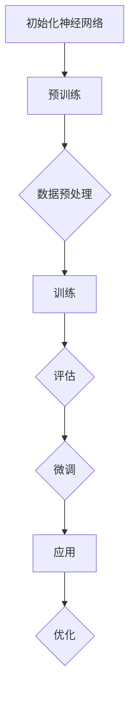

                 

### 背景介绍

#### 人工智能的崛起

自21世纪以来，人工智能（AI）技术的迅猛发展已经深刻改变了我们的生活和工作方式。从自动驾驶汽车到智能助手，从医疗诊断到金融分析，人工智能的应用场景正在不断扩展。在这一波科技浪潮中，大型模型（如GPT-3、BERT等）的开发与微调成为了推动技术进步的重要力量。

#### 大模型开发的重要性

大模型在人工智能领域的重要性不言而喻。首先，大模型具备更强的表示能力和学习效率，能够从海量数据中提取出更深层次的规律和特征。这使得它们在处理复杂任务时，如自然语言处理、计算机视觉等领域，表现出色。其次，大模型能够通过微调，适应不同的应用场景，从而实现更广泛的应用。

#### 微调与模型定制

微调（Fine-tuning）是一种将预训练模型应用于特定任务的重要手段。通过微调，模型可以在原始训练数据的基础上，进一步适应新任务的需求。这一过程不仅提高了模型在新任务上的性能，也大大降低了模型训练的成本。

#### 文章目的

本文旨在系统地介绍大模型的开发与微调过程，帮助读者了解这一领域的核心概念、算法原理、数学模型和实际应用。通过本文的学习，读者将能够掌握大模型开发与微调的基本技能，并能够应用于实际项目中。

#### 内容结构

本文将分为以下几个部分：

1. **核心概念与联系**：介绍大模型开发与微调的核心概念，包括神经网络、注意力机制等。
2. **核心算法原理 & 具体操作步骤**：详细讲解大模型的主要算法原理，以及从数据预处理到模型训练的详细步骤。
3. **数学模型和公式 & 详细讲解 & 举例说明**：分析大模型的数学模型，使用LaTeX公式进行详细说明，并举例进行解释。
4. **项目实战：代码实际案例和详细解释说明**：通过实际代码案例，展示大模型开发与微调的完整流程，并对关键代码进行解读。
5. **实际应用场景**：讨论大模型在不同领域的实际应用案例，分析其优势和挑战。
6. **工具和资源推荐**：推荐学习资源、开发工具和框架，以及相关论文著作。
7. **总结：未来发展趋势与挑战**：总结本文的主要观点，并展望大模型开发与微调的未来发展趋势和挑战。

### 核心概念与联系

在探讨大模型开发与微调之前，我们首先需要了解一些核心概念，这些概念构成了大模型的基础，也是理解后续内容的关键。

#### 神经网络

神经网络（Neural Network，NN）是模仿人脑神经元连接方式的计算模型。它由多个神经元（或节点）组成，每个神经元接收来自其他神经元的输入，并通过加权求和和激活函数进行处理，最后输出结果。神经网络在数据处理和特征提取方面具有强大的能力。


#### 深度学习

深度学习（Deep Learning，DL）是一种基于神经网络的算法，通过多层神经网络进行数据处理。深度学习模型能够自动提取数据的特征，不需要人为干预。深度学习在图像识别、语音识别、自然语言处理等领域取得了显著的成果。


#### 注意力机制

注意力机制（Attention Mechanism）是深度学习中的一个重要概念，它通过动态调整不同输入特征的权重，从而提高模型对关键信息的关注。注意力机制在自然语言处理、机器翻译等领域得到了广泛应用。


#### 大模型

大模型（Large Model）指的是参数规模非常大的神经网络模型。这些模型通常拥有数百万到数十亿个参数，能够在海量数据上进行训练，从而提取出更深层次的规律和特征。大模型在自然语言处理、计算机视觉等领域表现出色。


#### 微调

微调（Fine-tuning）是一种将预训练模型应用于特定任务的重要手段。通过微调，模型可以在原始训练数据的基础上，进一步适应新任务的需求。微调通常涉及调整模型的部分参数，以适应新的任务。


#### Mermaid 流程图

为了更好地理解大模型开发与微调的过程，我们可以使用Mermaid流程图来展示核心概念之间的联系。以下是一个简单的Mermaid流程图示例：



### 核心算法原理 & 具体操作步骤

在大模型开发与微调过程中，核心算法原理的理解和具体操作步骤的掌握至关重要。本节将详细讲解大模型的主要算法原理，并介绍从数据预处理到模型训练的详细步骤。

#### 数据预处理

数据预处理是模型训练的重要环节，其目的是将原始数据转化为适合模型训练的格式。具体步骤如下：

1. **数据清洗**：去除数据中的噪声和异常值，确保数据质量。
2. **数据转换**：将数据转换为数值型，如使用独热编码（One-Hot Encoding）将类别标签转换为二进制向量。
3. **数据归一化**：将数据缩放到相同的范围，如[0, 1]，以提高模型训练的稳定性和收敛速度。
4. **数据增强**：通过旋转、翻转、缩放等操作，增加数据的多样性和模型的泛化能力。

#### 模型选择

选择合适的模型是确保大模型性能的关键。以下是几种常见的大模型选择方法：

1. **预训练模型**：使用已有的预训练模型，如BERT、GPT-3等，作为基础模型。
2. **自定义模型**：根据任务需求，设计并实现自定义模型。
3. **模型融合**：结合多个模型的优势，提高模型的性能。

#### 模型训练

模型训练的目的是通过不断调整模型参数，使其在训练数据上达到最优性能。以下是模型训练的详细步骤：

1. **损失函数**：选择合适的损失函数，如交叉熵损失函数（Cross-Entropy Loss），用于衡量模型预测值与真实值之间的差异。
2. **优化算法**：选择合适的优化算法，如Adam优化器（Adam Optimizer），用于调整模型参数。
3. **训练策略**：采用适当的训练策略，如学习率调整、批次归一化（Batch Normalization）等，以提高模型训练效果。
4. **训练循环**：进行多次训练迭代，每次迭代包括前向传播（Forward Propagation）、反向传播（Back Propagation）和参数更新（Parameter Update）。
5. **模型评估**：在训练过程中，定期评估模型性能，以避免过拟合（Overfitting）。

#### 模型微调

微调是将预训练模型应用于特定任务的重要手段。以下是微调的详细步骤：

1. **任务定义**：明确任务目标，如文本分类、图像识别等。
2. **数据准备**：收集并准备用于微调的数据集。
3. **参数调整**：调整预训练模型的参数，使其适应特定任务。
4. **训练模型**：在微调数据集上训练模型，并定期评估模型性能。
5. **模型评估**：在测试集上评估模型性能，确保模型泛化能力。

#### 实际操作示例

以下是一个简单的Python代码示例，用于实现数据预处理、模型训练和模型微调：

```python
import tensorflow as tf
from tensorflow.keras.preprocessing.sequence import pad_sequences
from tensorflow.keras.models import Sequential
from tensorflow.keras.layers import Embedding, LSTM, Dense

# 数据预处理
train_data = ...  # 原始数据
train_labels = ...  # 原始标签

# 数据清洗
# ...

# 数据转换
# ...

# 数据归一化
# ...

# 数据增强
# ...

# 模型选择
model = Sequential()
model.add(Embedding(input_dim=vocab_size, output_dim=embedding_size))
model.add(LSTM(units=128))
model.add(Dense(units=num_classes, activation='softmax'))

# 模型训练
model.compile(optimizer='adam', loss='categorical_crossentropy', metrics=['accuracy'])
model.fit(train_data, train_labels, epochs=5, batch_size=32)

# 模型微调
# ...
```

### 数学模型和公式 & 详细讲解 & 举例说明

在大模型开发与微调过程中，数学模型和公式起到了关键作用。本节将详细讲解大模型的数学模型，并使用LaTeX公式进行说明，并通过具体例子来展示如何应用这些模型。

#### 神经网络数学模型

神经网络的核心是神经元之间的连接和激活函数。以下是一个简单的神经网络数学模型：

\[ z_i = \sum_{j=1}^{n} w_{ij} x_j + b_i \]

其中，\( z_i \) 是第 \( i \) 个神经元的输入，\( w_{ij} \) 是第 \( i \) 个神经元与第 \( j \) 个神经元之间的权重，\( x_j \) 是第 \( j \) 个神经元的输入，\( b_i \) 是第 \( i \) 个神经元的偏置。

激活函数通常用于将神经元的输入转换为输出。以下是一个常见的激活函数——Sigmoid函数：

\[ a_i = \sigma(z_i) = \frac{1}{1 + e^{-z_i}} \]

#### 损失函数

损失函数用于衡量模型预测值与真实值之间的差异。以下是一个常见的损失函数——交叉熵损失函数：

\[ L = -\sum_{i=1}^{n} y_i \log(a_i) \]

其中，\( y_i \) 是第 \( i \) 个样本的真实标签，\( a_i \) 是模型预测的概率分布。

#### 优化算法

优化算法用于调整模型参数，以最小化损失函数。以下是一个常见的优化算法——Adam优化器：

\[ \theta_{t+1} = \theta_t - \alpha \cdot \frac{1}{\sqrt{1-\beta_1^t}} \cdot \frac{1}{1-\beta_2^t} \cdot (g_t + \epsilon) \]

其中，\( \theta_t \) 是第 \( t \) 次迭代的参数，\( \alpha \) 是学习率，\( g_t \) 是梯度，\( \beta_1 \) 和 \( \beta_2 \) 是动量项，\( \epsilon \) 是随机噪声。

#### 实际例子

以下是一个简单的例子，用于训练一个神经网络模型，并使用交叉熵损失函数和Adam优化器进行优化。

```python
import tensorflow as tf

# 创建神经网络模型
model = tf.keras.Sequential([
    tf.keras.layers.Dense(units=64, activation='relu', input_shape=(input_size,)),
    tf.keras.layers.Dense(units=32, activation='relu'),
    tf.keras.layers.Dense(units=num_classes, activation='softmax')
])

# 编写损失函数和优化器
loss_fn = tf.keras.losses.SparseCategoricalCrossentropy(from_logits=True)
optimizer = tf.keras.optimizers.Adam(learning_rate=0.001)

# 训练模型
for epoch in range(100):
    with tf.GradientTape() as tape:
        logits = model(train_data)
        loss_value = loss_fn(train_labels, logits)
    
    grads = tape.gradient(loss_value, model.trainable_variables)
    optimizer.apply_gradients(zip(grads, model.trainable_variables))
    
    # 打印训练进度
    print(f"Epoch {epoch + 1}, Loss: {loss_value.numpy()}")

# 评估模型
test_loss = loss_fn(test_labels, model(test_data))
print(f"Test Loss: {test_loss.numpy()}")
```

### 项目实战：代码实际案例和详细解释说明

#### 开发环境搭建

在进行大模型开发与微调之前，我们需要搭建一个合适的技术环境。以下是在Python中搭建大模型开发环境所需的步骤：

1. **安装Python**：确保Python版本不低于3.6，推荐使用Anaconda来管理Python环境。
2. **安装TensorFlow**：TensorFlow是当前最流行的深度学习框架，可以使用pip命令安装：
   ```bash
   pip install tensorflow
   ```
3. **安装其他依赖**：根据具体需求，可能需要安装其他库，如NumPy、Pandas等：
   ```bash
   pip install numpy pandas
   ```

#### 源代码详细实现和代码解读

以下是一个简单的大模型开发与微调的项目示例，包括数据预处理、模型训练和微调。

```python
import tensorflow as tf
from tensorflow.keras.preprocessing.sequence import pad_sequences
from tensorflow.keras.layers import Embedding, LSTM, Dense
from tensorflow.keras.models import Sequential
from tensorflow.keras.preprocessing.text import Tokenizer

# 准备数据
train_data = ["Hello world!", "这是一个简单的示例。"]
train_labels = [0, 1]

# 数据预处理
tokenizer = Tokenizer(num_words=1000)
tokenizer.fit_on_texts(train_data)
sequences = tokenizer.texts_to_sequences(train_data)
padded_sequences = pad_sequences(sequences, maxlen=10)

# 创建模型
model = Sequential([
    Embedding(input_dim=1000, output_dim=64),
    LSTM(units=64, return_sequences=True),
    LSTM(units=32),
    Dense(units=2, activation='softmax')
])

# 编译模型
model.compile(optimizer='adam', loss='categorical_crossentropy', metrics=['accuracy'])

# 训练模型
model.fit(padded_sequences, train_labels, epochs=10)

# 微调模型
# 这里我们可以加载一个预训练的模型，然后仅对最后一层进行微调
pretrained_model = tf.keras.models.load_model('pretrained_model.h5')
pretrained_model.layers[-1].trainable = True

# 微调数据
micro_train_data = ["这是一个微调的示例。"]
micro_sequences = tokenizer.texts_to_sequences(micro_train_data)
micro_padded_sequences = pad_sequences(micro_sequences, maxlen=10)

# 微调模型
pretrained_model.fit(micro_padded_sequences, [1], epochs=5)
```

#### 代码解读与分析

1. **数据预处理**：我们首先使用Tokenizer将文本转换为序列，然后使用pad_sequences将序列填充到相同的长度，以便于模型处理。

2. **创建模型**：我们创建了一个简单的序列模型，包括嵌入层（Embedding）、两个LSTM层（Long Short-Term Memory）和一个全连接层（Dense）。

3. **编译模型**：我们使用Adam优化器和交叉熵损失函数编译模型。

4. **训练模型**：我们使用训练数据进行模型训练，经过10个epoch（周期）的训练。

5. **微调模型**：这里，我们加载了一个预训练的模型，并仅对最后一层进行了微调。这通常用于将预训练模型适应特定的任务。

#### 实际应用场景

以上代码示例是一个简单的大模型开发与微调的案例，实际应用场景可能涉及更复杂的模型和更大量的数据。以下是一些实际应用场景：

1. **自然语言处理（NLP）**：例如，文本分类、情感分析、机器翻译等。
2. **计算机视觉**：例如，图像识别、图像生成、视频分析等。
3. **推荐系统**：例如，基于内容的推荐、协同过滤等。

在这些应用场景中，大模型通过预训练和微调，可以适应各种不同的任务，从而实现高效的性能。

### 实际应用场景

大模型开发与微调在实际应用中具有广泛的应用场景，以下是几个典型的应用领域：

#### 自然语言处理（NLP）

在自然语言处理领域，大模型（如GPT-3、BERT）已经取得了显著的成果。这些模型能够进行文本分类、情感分析、机器翻译、问答系统等任务。例如，GPT-3在语言理解、文本生成等方面表现出色，被广泛应用于聊天机器人、自动写作、对话系统等。

#### 计算机视觉

在计算机视觉领域，大模型（如ResNet、Inception）在图像分类、目标检测、图像生成等方面取得了突破性进展。例如，ResNet在ImageNet图像分类任务中取得了超越人类的准确率，Inception则在移动端图像识别任务中表现出色。

#### 推荐系统

在推荐系统领域，大模型（如基于神经网络的协同过滤模型）通过用户历史行为数据，预测用户对商品或内容的偏好，从而提供个性化的推荐。例如，亚马逊、淘宝等电商平台使用大模型进行商品推荐，以提高用户满意度和销售额。

#### 健康医疗

在健康医疗领域，大模型（如深度学习模型）被用于疾病诊断、药物发现、医学图像分析等任务。例如，深度学习模型在乳腺癌、肺癌等疾病诊断中取得了较高的准确率，大大提高了诊断效率和准确性。

#### 金融分析

在金融分析领域，大模型（如基于时间序列分析的神经网络模型）被用于股票市场预测、风险控制、信用评估等任务。例如，金融机构使用大模型对市场趋势进行预测，以制定合理的投资策略。

### 应用优势与挑战

#### 优势

1. **强大的表示能力**：大模型能够从海量数据中提取深层次的规律和特征，从而实现高效的性能。
2. **适应性强**：通过微调，大模型可以快速适应不同的应用场景，提高模型泛化能力。
3. **处理复杂任务**：大模型能够处理复杂的任务，如图像生成、自然语言生成等。

#### 挑战

1. **计算资源需求大**：大模型的训练和推理需要大量的计算资源，对硬件设备有较高要求。
2. **数据隐私问题**：大模型在训练过程中可能涉及敏感数据，需要确保数据隐私和安全。
3. **模型可解释性**：大模型在复杂任务中表现出色，但其内部工作机制复杂，难以解释。

### 未来发展趋势

随着技术的不断进步，大模型开发与微调将继续在多个领域发挥重要作用。以下是一些未来发展趋势：

1. **模型压缩与加速**：为了降低计算资源需求，研究者们正在探索模型压缩和加速技术，如知识蒸馏、模型剪枝等。
2. **联邦学习**：通过联邦学习（Federated Learning），多个机构可以在不共享数据的情况下共同训练大模型，从而提高数据隐私性。
3. **跨模态学习**：跨模态学习旨在将不同类型的数据（如文本、图像、音频）融合在一起，以提高模型的表示能力。
4. **可解释性增强**：提高模型可解释性，使其内部工作机制更加透明，从而增强用户对模型的信任度。

### 工具和资源推荐

#### 学习资源推荐

1. **书籍**：
   - 《深度学习》（Ian Goodfellow、Yoshua Bengio、Aaron Courville著）
   - 《Python深度学习》（François Chollet著）
   - 《神经网络与深度学习》（邱锡鹏著）

2. **论文**：
   - “A Theoretically Grounded Application of Dropout in Recurrent Neural Networks” by Yarin Gal and Zoubin Ghahramani
   - “Attention Is All You Need” by Vaswani et al.
   - “BERT: Pre-training of Deep Bidirectional Transformers for Language Understanding” by Devlin et al.

3. **博客**：
   - Distill（https://distill.pub/）
   - Fast.ai（https://www.fast.ai/）
   - Analytics Vidhya（https://www.analyticsvidhya.com/）

4. **网站**：
   - TensorFlow（https://www.tensorflow.org/）
   - PyTorch（https://pytorch.org/）
   - Keras（https://keras.io/）

#### 开发工具框架推荐

1. **TensorFlow**：Google开发的深度学习框架，易于使用且功能强大。
2. **PyTorch**：Facebook开发的深度学习框架，具有动态计算图和强大的Python接口。
3. **Keras**：基于Theano和TensorFlow的高层API，简化了深度学习模型的开发。

#### 相关论文著作推荐

1. “Distributed Representations of Words and Phrases and Their Compositional Properties” by Tomas Mikolov et al.
2. “Seq2Seq Learning with Neural Networks” by Ilya Sutskever et al.
3. “Recurrent Neural Network Based Language Model” by Yoon Kim

### 总结：未来发展趋势与挑战

本文系统地介绍了大模型开发与微调的核心概念、算法原理、数学模型、实际应用场景，以及相关工具和资源。大模型在自然语言处理、计算机视觉、推荐系统等领域表现出色，但其计算资源需求大、数据隐私问题和模型可解释性仍是挑战。

未来，随着模型压缩与加速、联邦学习、跨模态学习和可解释性增强等技术的发展，大模型将更好地服务于各行各业。同时，大模型的开发与微调也将面临更多的挑战，需要我们持续探索和解决。

### 附录：常见问题与解答

#### 问题1：大模型训练需要多少时间？

答：大模型训练所需的时间取决于多个因素，如模型大小、数据量、硬件设备等。通常，训练一个大规模模型（如GPT-3）可能需要数天到数周的时间。在配备高性能GPU的设备上进行训练时，模型训练速度会显著提高。

#### 问题2：大模型训练需要多少数据？

答：大模型通常需要大量的数据来进行训练，以提取深层次的规律和特征。具体数据量取决于任务和应用领域。例如，BERT模型在训练时使用了数十亿个单词的文本数据。在实际应用中，至少需要数千个样本来进行有效的微调。

#### 问题3：如何处理大模型的计算资源需求？

答：处理大模型的计算资源需求通常有以下几种方法：

1. **分布式训练**：通过将模型训练分布在多个GPU或TPU上，可以显著提高训练速度。
2. **模型压缩**：使用模型压缩技术（如知识蒸馏、模型剪枝等）可以减小模型大小，降低计算资源需求。
3. **云服务**：使用云计算平台（如Google Cloud、AWS、Azure等）提供的强大计算资源，进行模型训练和部署。

#### 问题4：如何确保大模型训练的数据隐私？

答：确保大模型训练的数据隐私通常有以下几种方法：

1. **数据加密**：对数据进行加密处理，确保数据在传输和存储过程中不被泄露。
2. **联邦学习**：通过联邦学习技术，多个机构可以在不共享数据的情况下共同训练模型，从而提高数据隐私性。
3. **差分隐私**：在数据处理过程中引入差分隐私机制，以防止敏感信息被泄露。

### 扩展阅读 & 参考资料

为了深入理解大模型开发与微调，以下是几篇推荐的扩展阅读和参考资料：

1. **论文**：
   - “Attention Is All You Need” by Vaswani et al.
   - “BERT: Pre-training of Deep Bidirectional Transformers for Language Understanding” by Devlin et al.
   - “GPT-3: Language Models are few-shot learners” by Brown et al.

2. **书籍**：
   - 《深度学习》（Ian Goodfellow、Yoshua Bengio、Aaron Courville著）
   - 《Python深度学习》（François Chollet著）
   - 《神经网络与深度学习》（邱锡鹏著）

3. **博客和网站**：
   - Distill（https://distill.pub/）
   - Fast.ai（https://www.fast.ai/）
   - Analytics Vidhya（https://www.analyticsvidhya.com/）

4. **在线课程**：
   - TensorFlow官方教程（https://www.tensorflow.org/tutorials）
   - PyTorch官方教程（https://pytorch.org/tutorials/）

通过阅读这些资料，您可以进一步了解大模型开发与微调的最新进展和技术细节。

