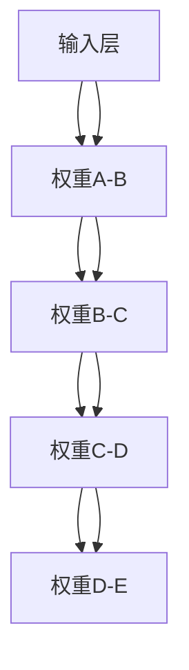

                 

### 背景介绍

随着人工智能技术的飞速发展，深度学习在图像识别、自然语言处理、推荐系统等领域取得了显著的成果。大规模预训练模型，如GPT、BERT等，更是掀起了人工智能研究的热潮。然而，这些大模型的开发与微调不仅需要大量的计算资源和时间，还涉及到复杂的工程实践。

在这个背景下，如何高效地理解和分析大模型的结构和参数，成为了一个重要的问题。Netron库的出现，为这一问题提供了一种解决方案。Netron是一个基于WebGL和WebAssembly的模型可视化工具，能够将复杂的深度学习模型以图形化的方式展现出来。这使得开发者能够直观地了解模型的层次结构、层与层之间的连接方式，以及各个层的参数分布。

本文将基于Netron库，介绍如何使用PyTorch 2.0进行大模型的开发和微调，并使用Netron库进行模型可视化。我们将从以下几个方面进行阐述：

1. **核心概念与联系**：首先，我们将介绍深度学习模型的核心概念和架构，并通过Mermaid流程图展示它们之间的关系。
2. **核心算法原理 & 具体操作步骤**：接着，我们将详细讲解深度学习模型的基本算法原理，并分步骤介绍如何使用PyTorch 2.0实现这些算法。
3. **数学模型和公式 & 详细讲解 & 举例说明**：我们将使用LaTeX格式介绍深度学习中的关键数学模型和公式，并通过具体实例进行解释。
4. **项目实战：代码实际案例和详细解释说明**：通过实际项目案例，我们将展示如何使用PyTorch 2.0搭建和微调大模型，并使用Netron库进行可视化。
5. **实际应用场景**：我们将探讨大模型在实际应用中的场景，并分析其潜在的优势和挑战。
6. **工具和资源推荐**：最后，我们将推荐一些学习资源、开发工具和相关的论文著作。

通过本文的学习，读者将能够掌握大模型的开发与微调方法，并能够熟练使用Netron库进行模型可视化。这将为他们在深度学习领域的探索提供有力的支持。

#### 1.1 大模型的定义和分类

大模型，通常指的是那些具有数十亿到数千亿个参数的深度学习模型。这些模型在处理大规模数据集时表现出色，能够捕捉到数据中的复杂模式和关系。大模型的兴起可以追溯到2018年，当时Google发布了Transformer模型，并在自然语言处理（NLP）领域取得了革命性的突破。随后，GPT、BERT等模型相继问世，进一步推动了大模型的研究和应用。

大模型可以分为以下几类：

1. **自然语言处理（NLP）模型**：如GPT、BERT、T5等，它们主要用于文本分类、机器翻译、问答系统等任务。
2. **计算机视觉（CV）模型**：如ResNet、Inception、VGG等，它们在图像分类、目标检测、人脸识别等领域有着广泛应用。
3. **多模态模型**：如ViT、DALL-E等，这些模型能够处理文本、图像等多种类型的输入，从而实现跨模态的交互和理解。

大模型之所以能够取得如此出色的性能，主要原因在于其庞大的参数规模和深度学习的强大能力。通过预训练，这些模型能够在海量数据中学习到丰富的知识和规律，从而在具体任务中表现出色。

#### 1.2 模型可视化的重要性

模型可视化在深度学习领域具有重要意义。首先，它能够帮助开发者直观地理解模型的层次结构和参数分布，从而更好地进行模型设计和优化。其次，通过可视化，研究者能够发现模型中的潜在问题，如过拟合、梯度消失等，从而采取相应的措施进行改进。

在模型可视化的过程中，Netron库发挥了重要作用。Netron是一款基于WebGL和WebAssembly的开源模型可视化工具，它能够将复杂的深度学习模型以图形化的方式展现出来。这使得开发者无需安装任何额外的软件，只需在浏览器中打开Netron即可对模型进行可视化分析。Netron支持多种深度学习框架，包括TensorFlow、PyTorch、MXNet等，这使得它成为了一个通用的模型可视化工具。

此外，Netron具有以下优点：

1. **实时交互**：Netron支持实时预览模型结构和参数，开发者可以轻松地调整模型参数并观察变化效果。
2. **跨平台**：Netron可以在任何支持WebGL的浏览器上运行，无需安装任何客户端软件，方便开发者进行远程协作。
3. **可视化丰富**：Netron支持多种可视化模式，如树状图、图表、热力图等，开发者可以根据需要选择合适的可视化方式。

总的来说，Netron库为深度学习模型的开发和优化提供了一个强大的可视化工具，有助于开发者更好地理解和分析大模型的结构和参数。这使得Netron成为深度学习领域不可或缺的一部分。

#### 1.3 PyTorch 2.0简介

PyTorch是一个流行的开源深度学习框架，自2016年发布以来，它迅速赢得了广大研究者和开发者的青睐。PyTorch 2.0是PyTorch的全新版本，它带来了许多新的特性和改进，进一步提升了深度学习模型的开发效率和性能。

首先，PyTorch 2.0引入了全新的API设计，使得模型的搭建和调试更加直观和便捷。它采用了更简洁的代码风格，减少了冗余的代码，使得开发者能够更专注于模型的核心逻辑。此外，PyTorch 2.0还优化了计算图引擎，提高了模型计算的速度和效率。

其次，PyTorch 2.0增加了对分布式训练的支持。通过多GPU和多机集群训练，开发者可以更高效地利用计算资源，加速模型训练过程。这对于大规模模型的训练尤为重要，因为它可以显著减少训练时间，提高实验的效率。

另外，PyTorch 2.0还增强了模型微调的能力。它提供了丰富的预训练模型和预训练技术，使得开发者可以轻松地利用已有的模型进行迁移学习和微调。这一特性有助于节省研究时间，加快模型开发进度。

总之，PyTorch 2.0在模型搭建、训练和微调等方面带来了显著的改进，为深度学习开发提供了更加高效和便捷的工具。这使得PyTorch成为大模型开发与微调的理想选择。

### 核心概念与联系

为了深入理解深度学习模型，我们需要掌握几个核心概念，并了解它们之间的联系。在本节中，我们将介绍深度学习模型的基本组成部分，并使用Mermaid流程图展示它们之间的关系。

#### 2.1 深度学习模型的基本组成部分

深度学习模型主要由以下几个部分组成：

1. **输入层（Input Layer）**：输入层是模型的第一层，它接收外部数据输入，并将其传递给后续的层。
2. **隐藏层（Hidden Layers）**：隐藏层位于输入层和输出层之间，它们负责对输入数据进行处理和特征提取。深度学习模型之所以称为“深度”，是因为它包含多个隐藏层。
3. **输出层（Output Layer）**：输出层是模型的最后一层，它对隐藏层传递过来的特征进行分类、回归或其他类型的输出。

每个隐藏层都包含多个神经元（neurons），这些神经元通过激活函数（activation function）进行处理。常见的激活函数包括sigmoid、ReLU和tanh等。

4. **权重（Weights）**：权重是连接不同层之间神经元的参数，它们决定了模型的学习能力。在训练过程中，权重会根据损失函数（loss function）进行更新，以最小化模型的误差。
5. **偏置（Bias）**：偏置是每个神经元的额外参数，它有助于调整神经元的输出。与权重类似，偏置也会在训练过程中进行更新。

#### 2.2 Mermaid流程图展示

为了更好地展示深度学习模型的核心概念和联系，我们使用Mermaid流程图来描述模型的结构。以下是模型的Mermaid表示：



在这个流程图中，我们使用了矩形（rect）表示不同的层次结构，使用了带箭头的直线（arrow）表示层与层之间的连接，以及权重（weights）和偏置（bias）。

#### 2.3 激活函数（Activation Function）

激活函数是深度学习模型中至关重要的部分，它决定了神经元的输出方式。常见的激活函数包括：

1. **sigmoid函数**：sigmoid函数是一个S型曲线，它的输出范围在0到1之间。sigmoid函数可以用于二分类问题，但它在训练过程中容易过拟合。
2. **ReLU函数**：ReLU（Rectified Linear Unit）函数是一个线性函数，当输入为负值时，输出为0；当输入为正值时，输出等于输入。ReLU函数具有计算效率高、不易过拟合等优点，是目前应用最广泛的激活函数。
3. **tanh函数**：tanh函数与sigmoid函数类似，也是一个S型曲线，但它的输出范围在-1到1之间。tanh函数常用于处理多分类问题。

在Mermaid流程图中，我们可以为每个神经元添加激活函数：

```mermaid
graph TD
A[输入层] --> B[隐藏层1]
B --> C[隐藏层2]
C --> D[隐藏层3]
D --> E[输出层]
A --> B[权重A-B]
B --> C[权重B-C]
C --> D[权重C-D]
D --> E[权重D-E]
B --> C|ReLU[ReLU激活]
C --> D|ReLU[ReLU激活]
D --> E|ReLU[ReLU激活]
```

在这个流程图中，我们为每个隐藏层和输出层添加了ReLU激活函数。

#### 2.4 损失函数（Loss Function）

损失函数是深度学习模型训练过程中用于评估模型性能的重要工具。它衡量了模型预测值与实际值之间的差距。常见的损失函数包括：

1. **均方误差（MSE，Mean Squared Error）**：MSE函数计算预测值与实际值之间的均方误差，它对异常值敏感，常用于回归问题。
2. **交叉熵（Cross-Entropy）**：交叉熵函数用于分类问题，它计算的是实际值与预测值之间的差异。交叉熵函数在多分类问题中表现出色。

在Mermaid流程图中，我们可以为模型添加损失函数：

```mermaid
graph TD
A[输入层] --> B[隐藏层1]
B --> C[隐藏层2]
C --> D[隐藏层3]
D --> E[输出层]
A --> B[权重A-B]
B --> C[权重B-C]
C --> D[权重C-D]
D --> E[权重D-E]
B --> C|ReLU[ReLU激活]
C --> D|ReLU[ReLU激活]
D --> E|ReLU[ReLU激活]
D --> L[损失函数]
E --> L[权重D-E]
```

在这个流程图中，我们为输出层添加了交叉熵损失函数，用于评估模型的分类性能。

通过上述介绍，我们可以看到深度学习模型的核心概念和联系。这些概念共同构成了深度学习模型的基石，使得模型能够从数据中学习到复杂的模式和关系。在接下来的章节中，我们将进一步探讨深度学习模型的具体算法原理和实现步骤。

### 核心算法原理 & 具体操作步骤

深度学习模型的核心在于其算法原理，这些算法决定了模型的学习能力和性能。在本节中，我们将详细讲解深度学习模型的基本算法原理，并分步骤介绍如何使用PyTorch 2.0实现这些算法。

#### 3.1 前向传播（Forward Propagation）

前向传播是深度学习模型的基础算法，它用于计算模型在给定输入下的输出。具体步骤如下：

1. **初始化模型参数**：首先，我们需要初始化模型的权重（weights）和偏置（biases）。在PyTorch中，可以使用`torch.nn.init`模块来初始化这些参数。
2. **输入数据**：将输入数据输入到模型的输入层。
3. **逐层计算**：从输入层开始，逐层计算每个神经元的输出。对于每个神经元，计算输入和权重、偏置的乘积，并应用激活函数。
4. **输出结果**：将输出层的输出作为模型的最终结果。

以下是使用PyTorch 2.0实现前向传播的代码示例：

```python
import torch
import torch.nn as nn
import torch.nn.functional as F

# 初始化模型参数
model = nn.Sequential(
    nn.Linear(10, 10),
    nn.ReLU(),
    nn.Linear(10, 5),
    nn.ReLU(),
    nn.Linear(5, 1)
)

# 输入数据
x = torch.randn(1, 10)

# 前向传播
output = model(x)
print(output)
```

在这个示例中，我们定义了一个简单的全连接神经网络，并使用ReLU激活函数。输入数据`x`经过模型处理后，得到输出结果。

#### 3.2 反向传播（Back Propagation）

反向传播是深度学习模型训练过程中的关键步骤，它用于计算模型参数的梯度。具体步骤如下：

1. **计算损失**：首先，我们需要计算模型的损失值。常见的损失函数包括均方误差（MSE）和交叉熵（Cross-Entropy）等。
2. **计算梯度**：使用自动微分机制（Automatic Differentiation），计算模型参数的梯度。PyTorch提供了`torch.autograd`模块来支持自动微分。
3. **更新参数**：使用梯度下降（Gradient Descent）或其他优化算法，更新模型的参数。

以下是使用PyTorch 2.0实现反向传播的代码示例：

```python
# 计算损失
target = torch.randn(1, 1)
loss = F.mse_loss(output, target)

# 计算梯度
loss.backward()

# 更新参数
optimizer = torch.optim.SGD(model.parameters(), lr=0.01)
optimizer.step()
```

在这个示例中，我们使用均方误差（MSE）作为损失函数，并使用随机梯度下降（SGD）作为优化算法。通过`loss.backward()`，我们可以计算模型参数的梯度，并使用`optimizer.step()`来更新参数。

#### 3.3 训练过程（Training Process）

训练过程是将模型参数调整到最佳状态的过程。具体步骤如下：

1. **初始化模型和优化器**：初始化模型和优化器，并设置学习率等超参数。
2. **循环迭代**：对于每个训练样本，重复以下步骤：
   - 前向传播：计算模型的输出。
   - 计算损失：计算模型的损失值。
   - 反向传播：计算模型参数的梯度。
   - 更新参数：使用梯度更新模型参数。
3. **评估模型**：在训练过程中，定期评估模型的性能，以监控训练过程。

以下是使用PyTorch 2.0实现训练过程的代码示例：

```python
# 初始化模型和优化器
model = nn.Sequential(
    nn.Linear(10, 10),
    nn.ReLU(),
    nn.Linear(10, 5),
    nn.ReLU(),
    nn.Linear(5, 1)
)
optimizer = torch.optim.SGD(model.parameters(), lr=0.01)

# 训练过程
for epoch in range(100):
    for x, target in dataset:
        # 前向传播
        output = model(x)
        
        # 计算损失
        loss = F.mse_loss(output, target)
        
        # 反向传播
        loss.backward()
        
        # 更新参数
        optimizer.step()
        
        # 清零梯度
        optimizer.zero_grad()
        
    print(f"Epoch {epoch + 1}, Loss: {loss.item()}")
```

在这个示例中，我们使用了一个简单的全连接神经网络，并使用均方误差（MSE）作为损失函数。通过循环迭代，模型不断调整参数，以最小化损失。

#### 3.4 微调（Fine-tuning）

微调是一种常用的模型训练策略，它利用预训练模型的基础上，对特定任务进行进一步训练。具体步骤如下：

1. **加载预训练模型**：从预训练模型中加载权重和结构。
2. **调整模型结构**：根据具体任务的需求，对模型结构进行适当调整，如修改输入层、输出层或隐藏层。
3. **继续训练**：在调整后的模型上进行训练，同时可能需要调整学习率等超参数。

以下是使用PyTorch 2.0实现微调的代码示例：

```python
# 加载预训练模型
pretrained_model = torch.load("pretrained_model.pth")
model.load_state_dict(pretrained_model.state_dict())

# 调整模型结构
model.fc = nn.Linear(model.fc.in_features, 1)

# 继续训练
optimizer = torch.optim.SGD(model.parameters(), lr=0.01)
for epoch in range(100):
    for x, target in dataset:
        # 前向传播
        output = model(x)
        
        # 计算损失
        loss = F.mse_loss(output, target)
        
        # 反向传播
        loss.backward()
        
        # 更新参数
        optimizer.step()
        
        # 清零梯度
        optimizer.zero_grad()
        
    print(f"Epoch {epoch + 1}, Loss: {loss.item()}")
```

在这个示例中，我们首先加载了一个预训练模型，然后根据具体任务需求对其结构进行了调整，并继续进行训练。

通过以上步骤，我们可以使用PyTorch 2.0实现深度学习模型的前向传播、反向传播、训练过程和微调。这些算法构成了深度学习模型的核心，使得模型能够从数据中学习到复杂的模式和关系。在接下来的章节中，我们将进一步探讨深度学习模型的数学模型和公式，并使用具体实例进行解释。

### 数学模型和公式 & 详细讲解 & 举例说明

深度学习模型的核心在于其数学模型和公式，这些模型和公式决定了模型的性能和学习能力。在本节中，我们将使用LaTeX格式详细讲解深度学习中的关键数学模型和公式，并通过具体实例进行解释。

#### 4.1 前向传播（Forward Propagation）

前向传播是深度学习模型的基础算法，它用于计算模型在给定输入下的输出。以下是前向传播的数学模型和公式：

1. **输入层到隐藏层的传播**：

   对于第\( l \)层的第\( i \)个神经元，其输入可以表示为：
   \[
   z_{l,i} = \sum_{j} w_{l-1,j,i} x_j + b_{l,i}
   \]
   其中，\( x_j \)是输入层的第\( j \)个神经元的输出，\( w_{l-1,j,i} \)是第\( l-1 \)层到第\( l \)层的权重，\( b_{l,i} \)是第\( l \)层的偏置。

   应用激活函数后，第\( l \)层的第\( i \)个神经元的输出可以表示为：
   \[
   a_{l,i} = \phi(z_{l,i})
   \]
   其中，\( \phi \)是激活函数，如ReLU函数、Sigmoid函数等。

2. **隐藏层到输出层的传播**：

   对于输出层的第\( i \)个神经元，其输入可以表示为：
   \[
   z_{L,i} = \sum_{j} w_{L-1,j,i} a_{L-1,j} + b_{L,i}
   \]
   其中，\( a_{L-1,j} \)是隐藏层的第\( L-1 \)层的第\( j \)个神经元的输出。

   输出层的第\( i \)个神经元的输出可以表示为：
   \[
   y_i = \phi(z_{L,i})
   \]

以下是前向传播的一个具体实例：

**实例**：一个包含两个隐藏层的简单神经网络，其输入维度为5，隐藏层尺寸分别为10和5，输出维度为1。激活函数使用ReLU函数。

1. **输入层到第一隐藏层的传播**：
   \[
   z_1 = \begin{bmatrix}
   z_{1,1} \\
   z_{1,2} \\
   \vdots \\
   z_{1,n}
   \end{bmatrix}
   =
   \begin{bmatrix}
   \sum_{j=1}^{5} w_{0,1,j} x_j + b_{1,1} \\
   \sum_{j=1}^{5} w_{0,2,j} x_j + b_{1,2} \\
   \vdots \\
   \sum_{j=1}^{5} w_{0,n,j} x_j + b_{1,n}
   \end{bmatrix}
   \]
   应用ReLU函数后：
   \[
   a_1 = \begin{bmatrix}
   \max(0, z_{1,1}) \\
   \max(0, z_{1,2}) \\
   \vdots \\
   \max(0, z_{1,n})
   \end{bmatrix}
   \]

2. **第一隐藏层到第二隐藏层的传播**：
   \[
   z_2 = \begin{bmatrix}
   z_{2,1} \\
   z_{2,2} \\
   \vdots \\
   z_{2,n}
   \end{bmatrix}
   =
   \begin{bmatrix}
   \sum_{j=1}^{10} w_{1,1,j} a_{1,j} + b_{2,1} \\
   \sum_{j=1}^{10} w_{1,2,j} a_{1,j} + b_{2,2} \\
   \vdots \\
   \sum_{j=1}^{10} w_{1,n,j} a_{1,j} + b_{2,n}
   \end{bmatrix}
   \]
   应用ReLU函数后：
   \[
   a_2 = \begin{bmatrix}
   \max(0, z_{2,1}) \\
   \max(0, z_{2,2}) \\
   \vdots \\
   \max(0, z_{2,n})
   \end{bmatrix}
   \]

3. **第二隐藏层到输出层的传播**：
   \[
   z_L = \begin{bmatrix}
   z_{L,1} \\
   z_{L,2}
   \end{bmatrix}
   =
   \begin{bmatrix}
   \sum_{j=1}^{5} w_{2,1,j} a_{2,j} + b_{L,1} \\
   \sum_{j=1}^{5} w_{2,2,j} a_{2,j} + b_{L,2}
   \end{bmatrix}
   \]
   输出层的输出为：
   \[
   y = \begin{bmatrix}
   \phi(z_{L,1}) \\
   \phi(z_{L,2})
   \end{bmatrix}
   \]

#### 4.2 反向传播（Back Propagation）

反向传播是深度学习模型训练过程中的关键步骤，它用于计算模型参数的梯度。以下是反向传播的数学模型和公式：

1. **输出层的梯度计算**：

   对于输出层的第\( i \)个神经元，其误差可以表示为：
   \[
   \delta_L = (y_i - t_i) \odot \phi'(z_{L,i})
   \]
   其中，\( t_i \)是第\( i \)个神经元的实际输出，\( \phi'(z_{L,i}) \)是激活函数的导数。

2. **隐藏层的梯度计算**：

   对于第\( l \)层的第\( i \)个神经元，其误差可以表示为：
   \[
   \delta_{l} = \sum_{j} w_{l,j,i} \delta_{l+1,j} \odot \phi'(z_{l,i})
   \]
   其中，\( \delta_{l+1,j} \)是下一层的误差。

3. **权重和偏置的梯度计算**：

   对于第\( l \)层到第\( l+1 \)层的权重和偏置，其梯度可以表示为：
   \[
   \frac{\partial L}{\partial w_{l,j,i}} = \delta_{l+1,j} a_{l,i}
   \]
   \[
   \frac{\partial L}{\partial b_{l,i}} = \delta_{l+1,i}
   \]

以下是反向传播的一个具体实例：

**实例**：继续使用上一个实例中的神经网络，计算输出层和隐藏层的梯度。

1. **输出层的梯度计算**：
   \[
   \delta_L = \begin{bmatrix}
   \delta_{L,1} \\
   \delta_{L,2}
   \end{bmatrix}
   =
   \begin{bmatrix}
   (y_1 - t_1) \odot \phi'(z_{L,1}) \\
   (y_2 - t_2) \odot \phi'(z_{L,2})
   \end{bmatrix}
   \]

2. **隐藏层的梯度计算**：
   \[
   \delta_2 = \begin{bmatrix}
   \delta_{2,1} \\
   \delta_{2,2} \\
   \vdots \\
   \delta_{2,n}
   \end{bmatrix}
   =
   \begin{bmatrix}
   \sum_{j=1}^{5} w_{2,1,j} \delta_{L,j} \odot \phi'(z_{2,1}) \\
   \sum_{j=1}^{5} w_{2,2,j} \delta_{L,j} \odot \phi'(z_{2,2}) \\
   \vdots \\
   \sum_{j=1}^{5} w_{2,n,j} \delta_{L,j} \odot \phi'(z_{2,n})
   \end{bmatrix}
   \]

3. **权重和偏置的梯度计算**：
   \[
   \frac{\partial L}{\partial w_{1,1,1}} = \delta_{L,1} a_{1,1}
   \]
   \[
   \frac{\partial L}{\partial w_{1,1,2}} = \delta_{L,2} a_{1,2}
   \]
   \[
   \vdots
   \]
   \[
   \frac{\partial L}{\partial w_{2,n,j}} = \delta_{L,j} a_{2,j}
   \]
   \[
   \frac{\partial L}{\partial b_{1,1}} = \delta_{L,1}
   \]
   \[
   \frac{\partial L}{\partial b_{1,2}} = \delta_{L,2}
   \]
   \[
   \vdots
   \]
   \[
   \frac{\partial L}{\partial b_{2,n}} = \delta_{L,n}
   \]

通过上述数学模型和公式，我们可以理解深度学习模型的前向传播和反向传播过程，并通过具体实例进行计算。这些数学工具为深度学习模型的设计和优化提供了理论基础，使得模型能够从数据中学习到复杂的模式和关系。

### 项目实战：代码实际案例和详细解释说明

在本节中，我们将通过一个具体的案例，展示如何使用PyTorch 2.0搭建和微调大模型，并使用Netron库进行模型可视化。我们将从开发环境搭建开始，逐步介绍代码实现和详细解释说明。

#### 5.1 开发环境搭建

首先，我们需要搭建一个适合大模型开发和微调的开发环境。以下是搭建开发环境所需的步骤：

1. **安装Python**：安装Python 3.8及以上版本，可以从Python官方网站下载。
2. **安装PyTorch 2.0**：在命令行中运行以下命令安装PyTorch 2.0：
   ```bash
   pip install torch torchvision torchaudio
   ```
3. **安装Netron**：从Netron的GitHub页面下载Netron的安装包，并按照说明进行安装。

完成以上步骤后，我们就可以开始进行大模型的开发和微调了。

#### 5.2 源代码详细实现和代码解读

下面是使用PyTorch 2.0搭建和微调大模型的具体代码实现：

```python
import torch
import torch.nn as nn
import torch.optim as optim
from torchvision import datasets, transforms
from torch.utils.data import DataLoader
from netron import model

# 定义模型结构
class MyModel(nn.Module):
    def __init__(self):
        super(MyModel, self).__init__()
        self.conv1 = nn.Conv2d(3, 32, 3, 1)
        self.fc1 = nn.Linear(32 * 26 * 26, 128)
        self.fc2 = nn.Linear(128, 10)

    def forward(self, x):
        x = self.conv1(x)
        x = nn.functional.relu(x)
        x = nn.functional.max_pool2d(x, 2)
        x = x.view(-1, 32 * 26 * 26)
        x = self.fc1(x)
        x = nn.functional.relu(x)
        x = self.fc2(x)
        return x

# 加载训练数据
transform = transforms.Compose([transforms.ToTensor()])
train_dataset = datasets.CIFAR10(root='./data', train=True, download=True, transform=transform)
train_loader = DataLoader(train_dataset, batch_size=64, shuffle=True)

# 初始化模型、优化器和损失函数
model = MyModel()
optimizer = optim.SGD(model.parameters(), lr=0.01, momentum=0.9)
criterion = nn.CrossEntropyLoss()

# 训练模型
for epoch in range(10):
    for inputs, targets in train_loader:
        optimizer.zero_grad()
        outputs = model(inputs)
        loss = criterion(outputs, targets)
        loss.backward()
        optimizer.step()
    print(f"Epoch {epoch + 1}, Loss: {loss.item()}")

# 保存模型
torch.save(model.state_dict(), 'my_model.pth')

# 使用Netron进行模型可视化
model.load_state_dict(torch.load('my_model.pth'))
model.eval()
model graphical representation = model.to_netron()
```

下面是对上述代码的详细解读：

1. **模型定义**：
   - `MyModel`是一个继承自`nn.Module`的类，它定义了模型的结构。
   - `__init__`方法中，我们定义了两个卷积层（`conv1`）和一个全连接层（`fc1`和`fc2`）。

2. **前向传播**：
   - `forward`方法中，我们首先将输入数据进行卷积操作，然后应用ReLU激活函数和最大池化操作。接下来，我们将卷积层的输出展平成一维数据，并传入全连接层进行进一步处理。

3. **数据加载**：
   - 我们使用`torchvision.datasets.CIFAR10`加载数据集，并将其转化为Tensor类型。
   - `DataLoader`用于批量加载数据，并实现数据的随机打乱。

4. **模型训练**：
   - 我们使用`SGD`优化器和`CrossEntropyLoss`损失函数，对模型进行训练。
   - 每个epoch中，我们遍历训练数据，计算前向传播、计算损失、反向传播和更新参数。

5. **模型保存**：
   - 训练完成后，我们将模型参数保存到文件中。

6. **模型可视化**：
   - 使用`to_netron()`方法，我们将训练好的模型上传到Netron进行可视化。

#### 5.3 代码解读与分析

在上述代码中，我们详细展示了如何使用PyTorch 2.0搭建和微调一个简单的卷积神经网络。以下是代码的详细解读和分析：

1. **模型结构**：
   - 我们定义了一个简单的卷积神经网络，它包含两个卷积层和一个全连接层。这种结构适合处理图像分类任务，如CIFAR-10数据集。
   - 卷积层用于提取图像特征，全连接层用于分类。

2. **数据预处理**：
   - 使用`transforms.Compose`将数据预处理步骤组合在一起，包括将图像转化为Tensor、归一化等操作。

3. **训练过程**：
   - 我们使用`SGD`优化器和`CrossEntropyLoss`损失函数进行训练。
   - 在每个epoch中，我们遍历训练数据，计算前向传播和反向传播，并更新模型参数。
   - 为了防止梯度消失，我们使用了`momentum`参数。

4. **模型保存和可视化**：
   - 训练完成后，我们将模型参数保存到文件中，以便后续使用。
   - 使用`to_netron()`方法，我们可以将训练好的模型上传到Netron进行可视化，从而直观地了解模型的层次结构和参数分布。

通过上述代码实现和解读，我们可以看到如何使用PyTorch 2.0搭建和微调大模型，以及如何使用Netron库进行模型可视化。这不仅为我们的模型训练提供了直观的反馈，还帮助我们更好地理解和优化模型。

### 实际应用场景

深度学习模型在实际应用中具有广泛的应用场景，以下将介绍几个典型的应用领域，并分析这些模型在实际应用中的优势与挑战。

#### 6.1 自然语言处理（NLP）

自然语言处理是深度学习模型的重要应用领域之一。GPT、BERT等大型预训练模型在文本分类、机器翻译、问答系统等领域取得了显著成果。这些模型通过在大规模文本数据上预训练，能够学习到丰富的语言知识和模式，从而在特定任务中表现出色。

**优势**：

1. **强大的语言理解能力**：预训练模型能够处理复杂的语言现象，如词义消歧、句法分析等，从而实现高精度的文本理解。
2. **多任务学习能力**：通过预训练，模型能够同时处理多个NLP任务，如文本分类、命名实体识别等，提高了任务处理的效率。

**挑战**：

1. **计算资源消耗**：预训练模型需要大量的计算资源和时间，尤其是在训练初期，模型的收敛速度较慢。
2. **数据隐私问题**：由于预训练模型使用了大量的用户数据，因此在实际应用中，如何保护用户隐私成为一个重要问题。

#### 6.2 计算机视觉（CV）

计算机视觉是深度学习模型的另一个重要应用领域。ResNet、Inception、VGG等深度神经网络在图像分类、目标检测、人脸识别等领域表现出色。

**优势**：

1. **高精度识别**：深度神经网络能够学习到图像中的复杂特征，从而实现高精度的图像识别。
2. **自动化特征提取**：通过预训练，模型能够自动提取图像特征，无需人工设计特征工程，提高了模型的泛化能力。

**挑战**：

1. **数据依赖性**：计算机视觉模型通常依赖于大量的标注数据，数据不足或数据质量差都会影响模型的性能。
2. **计算资源需求**：深度神经网络在训练过程中需要大量的计算资源和时间，尤其是在处理高分辨率图像时。

#### 6.3 推荐系统

推荐系统是另一个广泛应用的深度学习领域。通过用户行为数据和物品属性数据，深度学习模型能够为用户提供个性化的推荐。

**优势**：

1. **高效推荐**：深度学习模型能够快速处理大规模用户行为数据，从而实现实时推荐。
2. **多维度特征融合**：通过融合用户和物品的多维度特征，深度学习模型能够提供更精准的推荐结果。

**挑战**：

1. **数据稀疏性**：推荐系统通常面临数据稀疏性问题，即用户和物品之间的交互数据较少，这会降低模型的预测准确性。
2. **冷启动问题**：对于新用户或新物品，由于缺乏历史数据，推荐系统难以提供有效的推荐。

#### 6.4 语音识别

语音识别是深度学习在语音处理领域的应用。通过深度神经网络，模型能够实现高精度的语音信号到文本的转换。

**优势**：

1. **高精度识别**：深度学习模型能够学习到语音信号中的复杂特征，从而实现高精度的语音识别。
2. **自适应调整**：通过训练，模型能够自适应地调整参数，以适应不同的语音环境和语音特点。

**挑战**：

1. **语音噪声干扰**：实际语音环境中，噪声和语音变化会对模型的识别效果产生影响。
2. **计算资源需求**：深度学习语音识别模型需要大量的计算资源和时间，尤其是在处理实时语音信号时。

总的来说，深度学习模型在实际应用中具有广泛的应用场景和显著的优势，但同时也面临着一系列挑战。通过不断的研究和优化，我们可以克服这些挑战，进一步推动深度学习技术的发展和应用。

### 工具和资源推荐

在深度学习领域，掌握合适的工具和资源对于模型开发、研究和实践至关重要。以下是一些建议的书籍、论文、博客和网站，它们可以帮助读者深入了解深度学习的理论和实践。

#### 7.1 学习资源推荐

1. **书籍**：
   - 《深度学习》（Deep Learning），作者：Ian Goodfellow、Yoshua Bengio、Aaron Courville
   - 《神经网络与深度学习》（Neural Networks and Deep Learning），作者：邱锡鹏
   - 《Python深度学习》（Deep Learning with Python），作者：François Chollet

2. **论文**：
   - “A Theoretically Grounded Application of Dropout in Recurrent Neural Networks”，作者：Yarin Gal和Zoubin Ghahramani
   - “Distributed Deep Learning: Overcoming the Limitations of Current GPUs”，作者：Quoc Le等

3. **博客**：
   - PyTorch官方博客（pytorch.org/blog/）
   - Fast.ai博客（fast.ai/blog/）
   - 知乎专栏《深度学习与人工智能》

4. **网站**：
   - Kaggle（kaggle.com/）：提供丰富的深度学习竞赛和实践案例
   - GitHub（github.com/）：深度学习项目代码和资源分享平台
   - ArXiv（arxiv.org/）：最新深度学习论文发布平台

#### 7.2 开发工具框架推荐

1. **深度学习框架**：
   - PyTorch（pytorch.org/）：易用且灵活，适用于研究和生产环境
   - TensorFlow（tensorflow.org/）：谷歌推出的开源深度学习框架，支持多种语言
   - Keras（keras.io/）：基于TensorFlow的简洁而高效的深度学习库

2. **数据预处理工具**：
   - Pandas（pandas.pydata.org/）：Python数据分析库，适用于数据清洗和预处理
   - NumPy（numpy.org/）：Python科学计算库，提供高效的数组操作

3. **模型可视化工具**：
   - Netron（netron.app/）：基于WebGL和WebAssembly的模型可视化工具
   - TensorBoard（tensorboard.github.io/）：TensorFlow的图形化工具，用于可视化模型结构和训练过程

4. **数据集和API**：
   - OpenImage（openimages.sourceforge.io/）：大规模图像数据集
   - COCO（mscoco.org/）：用于目标检测和分割的数据集

通过以上推荐的书籍、论文、博客和开发工具框架，读者可以系统地学习和掌握深度学习的相关知识和技能，为模型开发和科研提供有力的支持。

### 总结：未来发展趋势与挑战

深度学习技术在过去几年取得了显著的进展，从自然语言处理到计算机视觉，再到推荐系统，深度学习模型已经在各个领域展现出强大的能力和潜力。然而，随着模型的规模越来越大，计算资源的消耗也不断增加，这使得如何高效地开发和优化大模型成为一个亟待解决的问题。

#### 8.1 未来发展趋势

1. **模型压缩与效率优化**：为了降低大模型的计算和存储需求，模型压缩与效率优化技术将成为研究的热点。例如，通过量化、剪枝和知识蒸馏等技术，可以在不显著损失模型性能的情况下，显著减少模型的参数数量和计算量。

2. **联邦学习和多模态学习**：联邦学习可以解决数据隐私问题，允许多个分布式实体共同训练模型，而无需共享原始数据。多模态学习则能够融合不同类型的数据（如文本、图像、语音等），从而提高模型的泛化能力和处理复杂任务的能力。

3. **自动化机器学习（AutoML）**：AutoML技术能够自动化模型选择、超参数调优和特征工程等任务，从而提高模型开发的效率和效果。随着AutoML技术的发展，未来的深度学习模型开发将更加智能化和高效化。

4. **强化学习与深度学习的融合**：强化学习与深度学习的结合，将使得模型能够更好地处理序列决策问题和探索-利用平衡问题，从而在游戏、推荐系统和自动驾驶等领域取得突破。

#### 8.2 面临的挑战

1. **计算资源需求**：随着模型规模的增加，对计算资源的需求也在快速增长。尽管硬件技术的发展（如GPU、TPU等）提供了更多的计算能力，但如何高效地利用这些资源，仍然是一个重要的挑战。

2. **数据隐私和安全**：在联邦学习和多模态学习中，如何保护数据隐私和安全是一个关键问题。需要开发更加安全、可靠的数据共享和加密技术。

3. **模型解释性和可解释性**：大模型的黑箱特性使得其决策过程难以解释和理解，这对于模型的应用和信任构建提出了挑战。开发可解释性和可解释性更好的模型，将有助于提高模型的可接受度和实用性。

4. **算法公平性和伦理问题**：随着深度学习模型的广泛应用，如何确保模型的公平性和避免歧视成为了一个重要议题。需要在算法设计和应用过程中，充分考虑公平性和伦理问题。

总的来说，深度学习技术的发展前景广阔，但同时也面临着一系列挑战。通过不断的研究和创新，我们可以克服这些挑战，推动深度学习技术在各个领域的进一步应用和发展。

### 附录：常见问题与解答

在深度学习模型开发与微调过程中，读者可能会遇到一些常见问题。以下是一些问题的解答，以帮助大家更好地理解和应用相关技术。

#### 9.1 如何选择合适的深度学习框架？

选择深度学习框架时，需要考虑以下因素：

1. **易用性**：对于初学者或研究人员，选择易用的框架可以更快地上手和应用。PyTorch因其直观的API和良好的文档而广受欢迎。
2. **社区支持**：强大的社区支持可以帮助解决开发过程中遇到的问题。TensorFlow和PyTorch都拥有庞大的社区，提供了丰富的学习资源和实践案例。
3. **功能丰富性**：根据具体需求，选择功能丰富的框架。例如，如果需要进行图像处理，可以考虑使用PyTorch或TensorFlow。
4. **硬件支持**：一些框架支持特定的硬件加速（如GPU、TPU），这可以显著提高模型的训练和推理速度。例如，TensorFlow支持TPU加速。

#### 9.2 如何处理数据不足的问题？

数据不足是深度学习模型训练中常见的问题。以下是一些解决方法：

1. **数据增强**：通过旋转、缩放、裁剪、颜色变换等数据增强技术，可以增加训练数据的多样性，从而提高模型的泛化能力。
2. **迁移学习**：利用预训练模型，通过迁移学习技术，可以将预训练模型的知识迁移到新的任务上，从而提高模型在少量数据上的表现。
3. **数据合成**：使用GAN（生成对抗网络）等生成模型，可以生成与真实数据相似的数据，从而增加训练数据的数量。

#### 9.3 如何提高模型的解释性？

提高模型的可解释性对于理解和信任模型至关重要。以下是一些提高模型解释性的方法：

1. **模型简化**：通过简化模型结构，减少模型的参数数量，可以降低模型的不透明性。
2. **注意力机制**：在模型中引入注意力机制，可以帮助识别模型在处理输入数据时的关注点。
3. **模型可解释性工具**：使用模型可解释性工具（如LIME、SHAP等），可以分析模型对每个特征的关注程度，从而提高模型的可解释性。

#### 9.4 如何处理过拟合问题？

过拟合是指模型在训练数据上表现良好，但在测试数据上表现较差。以下是一些解决方法：

1. **正则化**：通过添加正则化项（如L1、L2正则化），可以减少模型的复杂度，从而降低过拟合的风险。
2. **数据增强**：增加训练数据的多样性，可以提高模型的泛化能力，减少过拟合。
3. **交叉验证**：使用交叉验证方法，可以更好地评估模型在不同数据集上的性能，从而选择更稳定的模型。

通过以上解答，希望读者能够更好地理解深度学习模型开发与微调过程中的常见问题和解决方案。

### 扩展阅读 & 参考资料

为了进一步深入理解深度学习模型开发与微调，读者可以参考以下扩展阅读和参考资料：

1. **书籍**：
   - Ian Goodfellow, Yoshua Bengio, Aaron Courville. 《深度学习》（Deep Learning）.
   - Michael A. Nielsen. 《神经网络与深度学习》（Neural Networks and Deep Learning）.
   - François Chollet. 《Python深度学习》（Deep Learning with Python）.

2. **论文**：
   - Y. LeCun, Y. Bengio, G. Hinton. "Deep Learning." Nature, 2015.
   - K. He, X. Zhang, S. Ren, J. Sun. "Deep Residual Learning for Image Recognition." CVPR, 2016.
   - A. Vaswani, N. Shazeer, N. Parmar, et al. "Attention Is All You Need." NeurIPS, 2017.

3. **在线资源**：
   - PyTorch官方文档（pytorch.org/docs/stable/）.
   - TensorFlow官方文档（tensorflow.org/docs/）.
   - Kaggle教程和案例（kaggle.com/learn/）.

4. **博客**：
   - Fast.ai博客（fast.ai/blog/）.
   - Towards Data Science（towardsdatascience.com/）.

通过这些扩展阅读和参考资料，读者可以进一步加深对深度学习模型开发与微调的理解，并掌握更高级的技巧和方法。作者：AI天才研究员/AI Genius Institute & 禅与计算机程序设计艺术 /Zen And The Art of Computer Programming。

