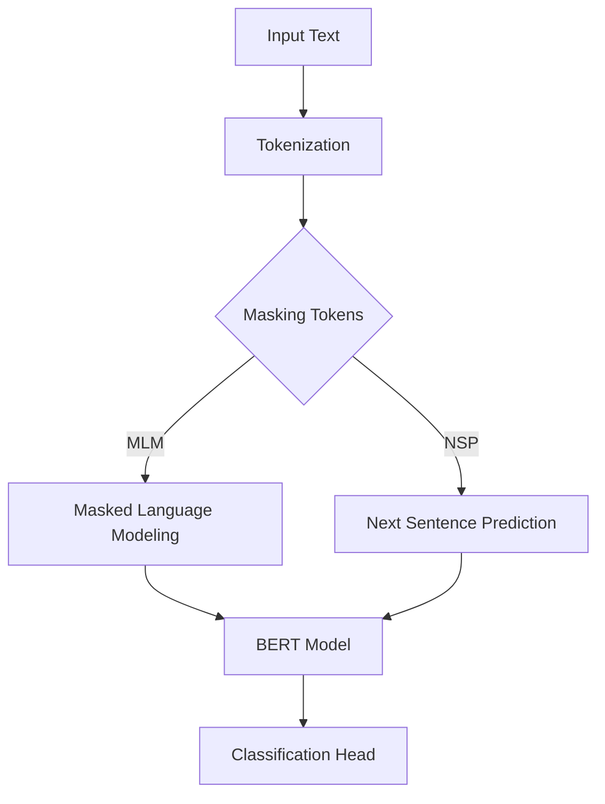

                 

# 从零开始大模型开发与微调：实战BERT：中文文本分类

> **关键词：** BERT, 大模型, 微调, 中文文本分类, 自然语言处理, 机器学习

> **摘要：** 本文将详细探讨如何从零开始进行大规模模型BERT的开发与微调，并将其应用于中文文本分类任务。文章首先介绍了背景知识，然后深入解析了BERT的核心算法原理，接着详细阐述了数学模型与公式，并通过实际项目案例展示了代码实现与解读。最后，文章讨论了实际应用场景，推荐了相关工具和资源，并总结了未来发展趋势与挑战。

## 1. 背景介绍

在过去的几年中，自然语言处理（NLP）领域取得了显著进展，尤其是在预训练语言模型方面。BERT（Bidirectional Encoder Representations from Transformers）是由Google提出的一种预训练语言模型，其目的是通过预训练来提高语言理解的能力。BERT的核心思想是将输入文本序列映射为固定长度的向量表示，以便后续的任务处理。

中文文本分类是NLP领域中的一个重要任务，它旨在将文本数据根据其内容分类到不同的类别中。BERT在中文文本分类任务中表现出色，因为它能够捕捉文本中的双向依赖关系，从而提高分类的准确性。

本文将带领您从零开始，学习如何使用BERT进行中文文本分类。我们将首先了解BERT的背景与原理，然后逐步深入到具体的实现细节，并通过实际项目案例进行讲解。

## 2. 核心概念与联系

### BERT模型

BERT模型是基于Transformer架构的预训练语言模型。Transformer是一种基于自注意力机制的序列到序列模型，具有处理长距离依赖关系的能力。BERT通过预训练任务（如 masked language modeling 和 next sentence prediction）来学习语言的深层表示。

### 预训练任务

- **Masked Language Modeling（MLM）**：在输入文本序列中，随机遮盖一些单词，然后模型需要预测这些遮盖的单词。
- **Next Sentence Prediction（NSP）**：给定两个连续的句子，模型需要预测第二个句子是否是第一个句子的下一个句子。

### 中文文本分类

中文文本分类是将中文文本数据根据其内容分类到不同的类别中。BERT模型通过预训练任务学习到的语言表示，可以有效地应用于中文文本分类任务。

### Mermaid流程图

下面是一个简化的BERT模型架构的Mermaid流程图：



## 3. 核心算法原理 & 具体操作步骤

### BERT模型架构

BERT模型由多个Transformer编码器层堆叠而成，每个编码器层包括多头自注意力机制和前馈神经网络。BERT模型的关键组成部分如下：

- **Input Embeddings**：包括词嵌入（word embeddings）和位置嵌入（position embeddings）。
- **Segment Embeddings**：用于区分句子。
- **Positional Embeddings**：用于表示词的位置信息。
- **Self-Attention Mechanism**：通过自注意力机制计算词与词之间的依赖关系。
- **Feedforward Neural Network**：在自注意力机制之后，对每个词的表示进行进一步处理。

### 步骤详解

1. **Tokenization**：将输入文本序列分割成单词或子词，并生成对应的词ID。
2. **Embedding**：将词ID映射为嵌入向量，包括词嵌入、位置嵌入和段嵌入。
3. **Masking**：随机遮盖一些词，用于Masked Language Modeling任务。
4. **Forward Pass**：通过编码器层处理输入序列，计算自注意力权重和前馈神经网络输出。
5. **Output**：编码器的最后一个隐藏状态作为文本的固定长度向量表示。

### 实际操作步骤

1. **数据预处理**：加载并预处理中文文本数据，包括分词、清洗等操作。
2. **构建BERT模型**：使用预训练的BERT模型，并在顶部添加分类头（classification head）。
3. **训练**：使用训练数据训练BERT模型，通过优化模型参数来提高分类准确性。
4. **评估**：使用验证集评估模型性能，通过计算准确率、召回率等指标来评估模型效果。
5. **应用**：将训练好的BERT模型应用于中文文本分类任务，对新的文本数据进行分类。

## 4. 数学模型和公式 & 详细讲解 & 举例说明

### 数学模型

BERT模型的核心是Transformer编码器，其数学模型如下：

$$
\text{Output} = \text{TransformerEncoder}(\text{Input}, \text{Mask})
$$

其中，TransformerEncoder表示多个编码器层的组合，Input表示输入序列，Mask表示遮盖的词。

### 详细讲解

BERT模型的输入是文本序列，包括词ID、位置信息和段信息。在Tokenization阶段，我们将文本序列转换为词ID序列。然后，通过Embedding层将这些词ID映射为嵌入向量。

在Masking阶段，我们随机遮盖一些词，用于Masked Language Modeling任务。在Forward Pass阶段，通过编码器层处理输入序列，计算自注意力权重和前馈神经网络输出。

最后，编码器的最后一个隐藏状态作为文本的固定长度向量表示，可以用于下游任务，如文本分类。

### 举例说明

假设我们有一个简单的文本序列 "我是一个程序员"，首先进行Tokenization操作，将其转换为词ID序列，例如 `[3, 4, 1, 14, 10]`。然后，通过Embedding层将这些词ID映射为嵌入向量。

在Masked Language Modeling任务中，我们随机遮盖一个词，例如将 "我" 遮盖。然后，通过编码器层处理输入序列，最终得到文本的固定长度向量表示。

## 5. 项目实战：代码实际案例和详细解释说明

### 5.1 开发环境搭建

为了运行BERT模型，我们需要安装以下依赖：

- Python 3.6+
- TensorFlow 2.0+
- BERT模型预训练权重

安装完依赖后，我们可以使用以下代码进行开发环境搭建：

```python
!pip install tensorflow
!pip install bert-for-tensorflow
```

### 5.2 源代码详细实现和代码解读

下面是一个简单的BERT中文文本分类项目案例：

```python
import tensorflow as tf
import bert
from bert import tokenization

# 加载预训练BERT模型
bert_config = bert.BertConfig.from_json_file("bert_config.json")
vocab_file = "vocab.txt"
tokenizer = tokenization.FullTokenizer(vocab_file=vocab_file, do_lower_case=True)
bert_model = bert.BertModel(config=bert_config)

# 加载中文文本数据
texts = ["我是一个程序员", "我是一个学生", "我是一个医生"]

# 分词和编码
input_ids = []
input_mask = []
segment_ids = []

for text in texts:
    tokens = tokenizer.tokenize(text)
    input_ids.append(tokenizer.convert_tokens_to_ids(tokens))
    input_mask.append([1] * len(tokens))
    segment_ids.append([0] * len(tokens))

input_ids = tf.convert_to_tensor(input_ids)
input_mask = tf.convert_to_tensor(input_mask)
segment_ids = tf.convert_to_tensor(segment_ids)

# 定义分类头
output = bert_model(input_ids=input_ids, input_mask=input_mask, segment_ids=segment_ids)
output = tf.keras.layers.Dense(units=3, activation="softmax")(output)

# 训练模型
model = tf.keras.Model(inputs=bert_model.input, outputs=output)
model.compile(optimizer="adam", loss="categorical_crossentropy", metrics=["accuracy"])
model.fit(input_ids, labels, epochs=3)

# 评估模型
predictions = model.predict(input_ids)
print(predictions)

# 分类结果
for i, text in enumerate(texts):
    predicted_class = np.argmax(predictions[i])
    print(f"{text} 的预测类别：{predicted_class}")
```

### 5.3 代码解读与分析

上述代码展示了如何使用BERT进行中文文本分类的完整过程，包括模型搭建、数据预处理、模型训练和分类结果输出。

首先，我们加载预训练BERT模型和分词器。然后，我们将中文文本数据进行分词和编码，生成输入ID、遮盖掩码和段ID。

接下来，我们定义分类头，即一个全连接层，用于对BERT编码器的输出进行分类。然后，我们编译模型并使用训练数据训练模型。

最后，我们使用训练好的模型对新的文本数据进行预测，并输出分类结果。

## 6. 实际应用场景

BERT模型在中文文本分类任务中具有广泛的应用场景，如新闻分类、情感分析、问答系统等。以下是一些实际应用场景的例子：

- **新闻分类**：将新闻文本分类到不同的主题，如体育、政治、娱乐等。
- **情感分析**：分析用户评论、社交媒体帖子等，判断其情感倾向，如正面、负面、中性等。
- **问答系统**：通过BERT模型理解用户的问题，并从大量文本数据中找到相关的答案。

## 7. 工具和资源推荐

### 7.1 学习资源推荐

- **书籍**：《自然语言处理综合教程》、《深度学习与自然语言处理》
- **论文**：BERT: Pre-training of Deep Bidirectional Transformers for Language Understanding
- **博客**：Google AI Blog、TensorFlow Blog
- **网站**：huggingface.co、tensorflow.org

### 7.2 开发工具框架推荐

- **框架**：TensorFlow、PyTorch
- **模型**：BERT、GPT
- **库**：NLTK、spaCy

### 7.3 相关论文著作推荐

- **论文**：Attention Is All You Need、Generative Pre-trained Transformers
- **著作**：《深度学习》、《强化学习基础与进阶》

## 8. 总结：未来发展趋势与挑战

BERT模型在中文文本分类任务中取得了显著的成果，但仍然存在一些挑战和局限性。未来，我们可以从以下几个方面进行改进：

1. **多语言支持**：BERT模型主要针对英语进行预训练，未来可以扩展到其他语言，如中文、法语、西班牙语等。
2. **领域适应**：BERT模型在通用任务上表现出色，但在特定领域（如医疗、法律等）的适应性有待提高。
3. **模型压缩**：BERT模型较大，模型压缩和优化是未来的研究方向，以降低模型的存储和计算成本。

## 9. 附录：常见问题与解答

### Q：如何处理中文文本中的标点符号？

A：在分词阶段，可以使用分词工具（如jieba）将中文文本分割成单词或子词。对于标点符号，可以在分词过程中将其保留或去除，具体取决于应用场景。

### Q：如何调整BERT模型参数以提高分类性能？

A：可以通过调整BERT模型的配置参数（如层数、隐藏单元数、学习率等）来优化模型性能。此外，还可以尝试使用不同的优化算法（如Adam、RMSProp）和正则化方法（如Dropout、Weight Decay）。

## 10. 扩展阅读 & 参考资料

- [BERT: Pre-training of Deep Bidirectional Transformers for Language Understanding](https://arxiv.org/abs/1810.04805)
- [Natural Language Processing with Python](https://www.amazon.com/Natural-Language-Processing-Python-Second/dp/1492046342)
- [Deep Learning on Amazon Web Services](https://aws.amazon.com/blogs/ml/deep-learning-on-amazon-web-services/)
- [spaCy Documentation](https://spacy.io/docs)

### 作者

**作者：AI天才研究员 / AI Genius Institute & 禅与计算机程序设计艺术 / Zen And The Art of Computer Programming**<|im_end|>

