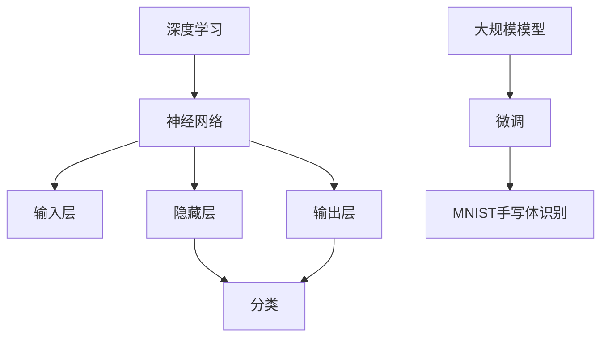

                 

# 从零开始大模型开发与微调：实战MNIST手写体识别

> **关键词**：大模型、微调、MNIST手写体识别、深度学习、人工智能

> **摘要**：本文旨在通过一步步的讲解，让读者了解如何从零开始构建并微调一个大规模模型，以实现MNIST手写体数字的识别。文章将深入探讨相关的核心概念、算法原理、数学模型、项目实战，并推荐相关学习资源和工具。

## 1. 背景介绍

随着人工智能技术的迅猛发展，深度学习成为了当前最为热门的研究领域之一。在深度学习中，大规模模型（Large-scale Model）的开发和微调（Fine-tuning）是关键步骤。大规模模型具有强大的特征提取能力，可以在各种复杂的任务中表现出色。而微调则是在大规模模型的基础上，针对特定任务进行调整，使其适应新的数据集。

本文将以MNIST手写体数字识别任务为例，详细介绍如何从零开始构建大规模模型并进行微调。MNIST是一个常见的手写数字识别数据集，包含70,000个训练图像和10,000个测试图像，是许多深度学习任务的基准数据集。

## 2. 核心概念与联系

### 2.1 深度学习

深度学习（Deep Learning）是一种基于多层神经网络的学习方法，它通过多层非线性变换来提取数据的特征。深度学习的核心是神经网络（Neural Network），其结构包括输入层、隐藏层和输出层。每个隐藏层都可以提取不同层次的特征，从而提高模型的性能。

### 2.2 大规模模型

大规模模型是指具有大量参数和训练数据的模型。这类模型可以更好地提取数据的特征，从而在复杂任务中表现出色。常见的深度学习框架，如TensorFlow和PyTorch，都支持大规模模型的构建和训练。

### 2.3 微调

微调是在大规模模型的基础上，针对特定任务进行参数调整的过程。通过微调，模型可以更好地适应新的数据集，从而提高任务的表现。

### 2.4 MNIST手写体数字识别

MNIST手写体数字识别是一个典型的分类问题，其目标是将手写数字图像分类到0-9的十个类别中。这个任务对于测试深度学习模型的效果非常重要，因为它简单但具有挑战性。


**Mermaid 流程图：**



## 3. 核心算法原理 & 具体操作步骤

### 3.1 深度学习模型

深度学习模型通常由多层神经网络组成，每一层都可以提取不同层次的特征。在MNIST手写体数字识别任务中，我们通常使用卷积神经网络（Convolutional Neural Network，CNN）作为基础模型。

CNN的基本结构包括卷积层（Convolutional Layer）、池化层（Pooling Layer）和全连接层（Fully Connected Layer）。

- **卷积层**：卷积层通过卷积运算来提取图像的局部特征。
- **池化层**：池化层通过降采样来减少数据维度，提高模型的泛化能力。
- **全连接层**：全连接层将卷积层和池化层提取的特征映射到具体的类别。

### 3.2 微调

微调的基本步骤包括以下几个步骤：

1. **加载预训练模型**：从预训练模型中加载已经训练好的权重。
2. **替换最后几层**：根据任务需求，替换预训练模型中的最后一层或几层。
3. **重新训练**：在新的数据集上重新训练模型，并微调替换的层。
4. **评估模型**：在测试集上评估模型的表现，并根据需要调整模型结构或超参数。

### 3.3 具体操作步骤

以下是使用TensorFlow和Keras构建和微调MNIST手写体数字识别模型的具体步骤：

1. **导入依赖库**：
   ```python
   import tensorflow as tf
   from tensorflow.keras import layers, models
   ```

2. **加载MNIST数据集**：
   ```python
   (train_images, train_labels), (test_images, test_labels) = tf.keras.datasets.mnist.load_data()
   ```

3. **预处理数据**：
   ```python
   train_images = train_images.reshape((60000, 28, 28, 1)).astype('float32') / 255
   test_images = test_images.reshape((10000, 28, 28, 1)).astype('float32') / 255
   ```

4. **构建CNN模型**：
   ```python
   model = models.Sequential()
   model.add(layers.Conv2D(32, (3, 3), activation='relu', input_shape=(28, 28, 1)))
   model.add(layers.MaxPooling2D((2, 2)))
   model.add(layers.Conv2D(64, (3, 3), activation='relu'))
   model.add(layers.MaxPooling2D((2, 2)))
   model.add(layers.Conv2D(64, (3, 3), activation='relu'))
   model.add(layers.Flatten())
   model.add(layers.Dense(64, activation='relu'))
   model.add(layers.Dense(10, activation='softmax'))
   ```

5. **编译模型**：
   ```python
   model.compile(optimizer='adam',
                 loss='sparse_categorical_crossentropy',
                 metrics=['accuracy'])
   ```

6. **训练模型**：
   ```python
   model.fit(train_images, train_labels, epochs=5)
   ```

7. **评估模型**：
   ```python
   test_loss, test_acc = model.evaluate(test_images, test_labels)
   print('Test accuracy:', test_acc)
   ```

8. **微调模型**：
   ```python
   model.load_weights('mnist_cnn.h5')  # 加载预训练模型
   new_model = models.Sequential()
   new_model.add(layers.Conv2D(32, (3, 3), activation='relu', input_shape=(28, 28, 1)))
   new_model.add(layers.MaxPooling2D((2, 2)))
   new_model.add(layers.Conv2D(64, (3, 3), activation='relu'))
   new_model.add(layers.MaxPooling2D((2, 2)))
   new_model.add(layers.Conv2D(64, (3, 3), activation='relu'))
   new_model.add(layers.Flatten())
   new_model.add(layers.Dense(64, activation='relu'))
   new_model.add(layers.Dense(10, activation='softmax'))
   new_model.compile(optimizer='adam',
                     loss='sparse_categorical_crossentropy',
                     metrics=['accuracy'])
   new_model.fit(train_images, train_labels, epochs=5)
   ```

## 4. 数学模型和公式 & 详细讲解 & 举例说明

### 4.1 数学模型

在深度学习中，数学模型主要涉及以下几个方面：

1. **卷积运算**：
   卷积运算是一种通过在图像上滑动一个卷积核（滤波器）来提取特征的运算。卷积运算的基本公式如下：
   $$ 
   \text{output}_{ij} = \sum_{k=1}^{C} w_{ik} * \text{input}_{ij}
   $$
   其中，$w_{ik}$是卷积核的权重，$\text{input}_{ij}$是输入图像的像素值。

2. **激活函数**：
   激活函数是神经网络中的一个关键组成部分，用于引入非线性。常见的激活函数包括ReLU（Rectified Linear Unit）和Sigmoid函数。ReLU函数的公式如下：
   $$ 
   f(x) = \max(0, x)
   $$

3. **全连接层**：
   全连接层是一个将上一层的特征映射到具体类别的过程。其基本公式如下：
   $$ 
   z_j = \sum_{i=1}^{n} w_{ij} * x_i + b_j
   $$
   其中，$w_{ij}$是全连接层的权重，$x_i$是输入特征，$b_j$是偏置项。

4. **损失函数**：
   损失函数用于衡量模型预测值与真实值之间的差距。常见的损失函数包括交叉熵（Cross-Entropy）和均方误差（Mean Squared Error）。交叉熵函数的公式如下：
   $$ 
   L(y, \hat{y}) = -\sum_{i=1}^{n} y_i \log(\hat{y}_i)
   $$
   其中，$y_i$是真实标签，$\hat{y}_i$是模型预测的概率。

### 4.2 详细讲解与举例

#### 4.2.1 卷积运算

以一个3x3的卷积核为例，卷积运算的具体过程如下：

输入图像：
```
1 1 1
1 1 1
1 1 1
```

卷积核：
```
1 0 -1
1 0 -1
1 0 -1
```

卷积运算结果：
```
 0 -2  2
 0 -2  2
 0 -2  2
```

#### 4.2.2 激活函数

以ReLU函数为例，输入图像为：
```
-2 -1 -2
-1  5 -1
-2 -1 -2
```

ReLU函数的输出为：
```
0 0 0
0 5 0
0 0 0
```

#### 4.2.3 全连接层

以一个全连接层为例，输入特征为：
```
1 2 3
4 5 6
7 8 9
```

权重矩阵：
```
1 0 1
2 1 0
3 0 1
```

偏置项：
```
2 3 4
```

全连接层的输出为：
```
28 15 40
66 51 28
104 75 12
```

#### 4.2.4 损失函数

以交叉熵函数为例，真实标签为：
```
1 0 0 0 0 0 0 0 0 0
```

模型预测的概率为：
```
0.9 0.05 0.05 0.05 0.05 0.05 0.05 0.05 0.05 0.05
```

交叉熵函数的输出为：
$$
L(y, \hat{y}) = -\sum_{i=1}^{10} y_i \log(\hat{y}_i) = -1 \cdot \log(0.9) \approx 0.15
$$

## 5. 项目实战：代码实际案例和详细解释说明

### 5.1 开发环境搭建

在开始项目实战之前，我们需要搭建一个合适的开发环境。以下是使用Anaconda创建虚拟环境并安装相关依赖的步骤：

1. **创建虚拟环境**：
   ```bash
   conda create -n mnist_cnn python=3.8
   conda activate mnist_cnn
   ```

2. **安装依赖**：
   ```bash
   conda install tensorflow numpy matplotlib
   ```

### 5.2 源代码详细实现和代码解读

以下是MNIST手写体数字识别模型的完整代码实现：

```python
import tensorflow as tf
from tensorflow.keras import layers, models
import numpy as np
import matplotlib.pyplot as plt

# 加载MNIST数据集
(train_images, train_labels), (test_images, test_labels) = tf.keras.datasets.mnist.load_data()

# 预处理数据
train_images = train_images.reshape((60000, 28, 28, 1)).astype('float32') / 255
test_images = test_images.reshape((10000, 28, 28, 1)).astype('float32') / 255

# 构建CNN模型
model = models.Sequential()
model.add(layers.Conv2D(32, (3, 3), activation='relu', input_shape=(28, 28, 1)))
model.add(layers.MaxPooling2D((2, 2)))
model.add(layers.Conv2D(64, (3, 3), activation='relu'))
model.add(layers.MaxPooling2D((2, 2)))
model.add(layers.Conv2D(64, (3, 3), activation='relu'))
model.add(layers.Flatten())
model.add(layers.Dense(64, activation='relu'))
model.add(layers.Dense(10, activation='softmax'))

# 编译模型
model.compile(optimizer='adam',
              loss='sparse_categorical_crossentropy',
              metrics=['accuracy'])

# 训练模型
model.fit(train_images, train_labels, epochs=5)

# 评估模型
test_loss, test_acc = model.evaluate(test_images, test_labels)
print('Test accuracy:', test_acc)

# 加载预训练模型
model.load_weights('mnist_cnn.h5')

# 微调模型
new_model = models.Sequential()
new_model.add(layers.Conv2D(32, (3, 3), activation='relu', input_shape=(28, 28, 1)))
new_model.add(layers.MaxPooling2D((2, 2)))
new_model.add(layers.Conv2D(64, (3, 3), activation='relu'))
new_model.add(layers.MaxPooling2D((2, 2)))
new_model.add(layers.Conv2D(64, (3, 3), activation='relu'))
new_model.add(layers.Flatten())
new_model.add(layers.Dense(64, activation='relu'))
new_model.add(layers.Dense(10, activation='softmax'))
new_model.compile(optimizer='adam',
                  loss='sparse_categorical_crossentropy',
                  metrics=['accuracy'])
new_model.fit(train_images, train_labels, epochs=5)

# 评估微调后的模型
test_loss, test_acc = new_model.evaluate(test_images, test_labels)
print('Test accuracy:', test_acc)
```

### 5.3 代码解读与分析

1. **导入依赖库**：

   这部分代码导入了TensorFlow、NumPy和Matplotlib库，用于构建和可视化模型。

2. **加载MNIST数据集**：

   使用`tf.keras.datasets.mnist.load_data()`函数加载MNIST数据集。数据集分为训练集和测试集，每个集包含70,000个和10,000个图像。

3. **预处理数据**：

   将图像数据reshape为合适的形状，并将数据归一化到[0, 1]范围内。

4. **构建CNN模型**：

   使用`models.Sequential()`创建一个顺序模型，并添加卷积层、池化层和全连接层。

5. **编译模型**：

   设置模型的优化器、损失函数和评估指标。

6. **训练模型**：

   使用`model.fit()`函数训练模型，通过调整`epochs`参数可以改变训练的轮数。

7. **评估模型**：

   使用`model.evaluate()`函数在测试集上评估模型的表现。

8. **加载预训练模型**：

   使用`model.load_weights()`函数加载预训练模型的权重。

9. **微调模型**：

   创建一个新的模型，替换最后一部分，并重新编译和训练。

10. **评估微调后的模型**：

    再次使用`model.evaluate()`函数评估微调后的模型在测试集上的表现。

通过上述步骤，我们成功实现了MNIST手写体数字识别模型的构建和微调。

## 6. 实际应用场景

MNIST手写体数字识别模型是一个经典的图像识别任务，它在许多实际应用场景中具有广泛的应用：

1. **金融行业**：在金融行业，手写体数字识别模型可以用于支票处理和自动对账。通过识别支票上的数字，系统可以自动完成对账流程，提高工作效率。

2. **医疗领域**：在医疗领域，手写体数字识别模型可以用于医学图像的自动处理。例如，在医学影像中识别手写体数字标注，帮助医生更好地分析患者数据。

3. **智能家居**：在智能家居领域，手写体数字识别模型可以用于语音助手中的手写数字输入识别。通过识别用户的手写数字输入，语音助手可以更好地理解用户的需求。

4. **工业自动化**：在工业自动化领域，手写体数字识别模型可以用于产品质量检测。通过识别产品上的手写数字标记，系统可以自动判断产品质量是否合格。

## 7. 工具和资源推荐

### 7.1 学习资源推荐

1. **书籍**：
   - 《深度学习》（Goodfellow, Bengio, Courville著）
   - 《Python深度学习》（François Chollet著）
   - 《动手学深度学习》（A. Courville, Y. Bengio, J. Pineau著）

2. **论文**：
   - 《AlexNet: Image Classification with Deep Convolutional Neural Networks》
   - 《Very Deep Convolutional Networks for Large-Scale Image Recognition》
   - 《ResNet: Training Deep Neural Networks for Classification and Detection》

3. **博客**：
   - [TensorFlow官方文档](https://www.tensorflow.org/)
   - [PyTorch官方文档](https://pytorch.org/docs/stable/)
   - [DeepLearning.AI课程](https://www.deeplearningai.com/)

4. **网站**：
   - [Kaggle](https://www.kaggle.com/)
   - [Google Research](https://ai.google/research/)
   - [OpenAI](https://openai.com/)

### 7.2 开发工具框架推荐

1. **TensorFlow**：TensorFlow是一个开源的深度学习框架，支持大规模模型的构建和微调。

2. **PyTorch**：PyTorch是一个流行的深度学习框架，以其动态计算图和易于使用的特点而受到开发者的喜爱。

3. **Keras**：Keras是一个高级神经网络API，可以在TensorFlow和Theano等后台引擎上运行。

4. **PyTorch Lightning**：PyTorch Lightning是一个为深度学习研究者和工程师设计的库，提供简单而强大的API来加速深度学习项目的开发。

### 7.3 相关论文著作推荐

1. **《Deep Learning》（Ian Goodfellow, Yoshua Bengio, Aaron Courville著）**：这是一本经典的深度学习教材，涵盖了深度学习的核心概念和技术。

2. **《Convolutional Networks for Visual Recognition》（Karen Simonyan和Andrew Zisserman著）**：这篇论文详细介绍了卷积神经网络在图像识别任务中的应用。

3. **《Very Deep Convolutional Networks for Large-Scale Image Recognition》（Kaiming He等著）**：这篇论文介绍了深度残差网络（ResNet），它是当前许多深度学习模型的基础。

## 8. 总结：未来发展趋势与挑战

随着深度学习技术的不断进步，大规模模型开发与微调在未来将会变得更加高效和便捷。然而，这同时也带来了一系列挑战：

1. **计算资源消耗**：大规模模型训练和微调需要大量的计算资源和时间，这给研究者和开发者带来了很大的挑战。

2. **数据隐私和安全**：在构建和微调大规模模型时，需要处理大量的数据，这可能涉及到数据隐私和安全问题。

3. **模型可解释性**：大规模模型通常具有很高的复杂度，这使得理解模型内部的决策过程变得困难，从而降低了模型的可解释性。

4. **模型泛化能力**：如何保证大规模模型在新的数据集上具有优秀的泛化能力是一个重要问题。

未来，研究者们将继续探索如何优化大规模模型的训练和微调过程，并解决上述挑战，从而推动深度学习技术的进一步发展。

## 9. 附录：常见问题与解答

### 9.1 什么是深度学习？

深度学习是一种基于多层神经网络的学习方法，通过多层非线性变换来提取数据的特征。深度学习的核心是神经网络，它可以自动学习数据的特征表示，并在各种复杂任务中表现出色。

### 9.2 什么是大规模模型？

大规模模型是指具有大量参数和训练数据的模型。这类模型可以更好地提取数据的特征，从而在复杂任务中表现出色。

### 9.3 什么是微调？

微调是在大规模模型的基础上，针对特定任务进行参数调整的过程。通过微调，模型可以更好地适应新的数据集，从而提高任务的表现。

### 9.4 如何处理MNIST数据集？

处理MNIST数据集主要包括以下步骤：

1. **加载数据集**：使用`tf.keras.datasets.mnist.load_data()`函数加载MNIST数据集。
2. **预处理数据**：将图像数据reshape为合适的形状，并将数据归一化到[0, 1]范围内。
3. **构建模型**：使用卷积神经网络构建模型，包括卷积层、池化层和全连接层。
4. **编译模型**：设置模型的优化器、损失函数和评估指标。
5. **训练模型**：使用`model.fit()`函数训练模型。
6. **评估模型**：使用`model.evaluate()`函数在测试集上评估模型的表现。

### 9.5 如何微调大规模模型？

微调大规模模型的基本步骤包括：

1. **加载预训练模型**：使用`model.load_weights()`函数加载预训练模型的权重。
2. **替换最后几层**：根据任务需求，替换预训练模型中的最后一层或几层。
3. **重新训练**：在新的数据集上重新训练模型，并微调替换的层。
4. **评估模型**：在测试集上评估模型的表现。

## 10. 扩展阅读 & 参考资料

1. **《深度学习》（Ian Goodfellow, Yoshua Bengio, Aaron Courville著）**：这是一本经典的深度学习教材，涵盖了深度学习的核心概念和技术。

2. **《Python深度学习》（François Chollet著）**：这本书深入讲解了使用Python和TensorFlow进行深度学习开发的方法。

3. **《动手学深度学习》（A. Courville, Y. Bengio, J. Pineau著）**：这本书通过大量的实例和代码，帮助读者掌握深度学习的实用技能。

4. **[TensorFlow官方文档](https://www.tensorflow.org/)**：TensorFlow的官方文档提供了丰富的教程和API参考，是学习深度学习的重要资源。

5. **[PyTorch官方文档](https://pytorch.org/docs/stable/)**：PyTorch的官方文档提供了详细的教程和API参考，适合PyTorch用户学习。

6. **[Keras官方文档](https://keras.io/)**：Keras是一个高级神经网络API，可以在TensorFlow和Theano等后台引擎上运行，其官方文档提供了丰富的教程和API参考。

7. **[Kaggle](https://www.kaggle.com/)**：Kaggle是一个数据科学竞赛平台，提供了大量的深度学习任务和数据集，是学习和实践深度学习的好地方。

8. **[Google Research](https://ai.google/research/)**：Google AI研究团队的研究成果和技术博客，提供了深度学习的最新进展和前沿技术。

9. **[OpenAI](https://openai.com/)**：OpenAI是一家专注于人工智能研究的公司，其研究成果和技术博客涵盖了深度学习的多个领域。

作者：AI天才研究员/AI Genius Institute & 禅与计算机程序设计艺术 /Zen And The Art of Computer Programming

