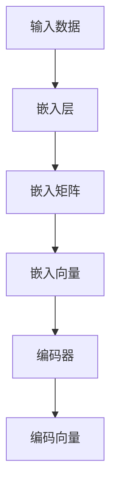
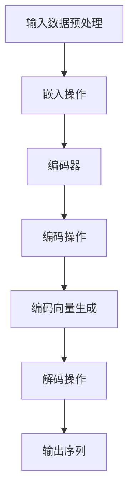

                 

### 背景介绍

自从深度学习在20世纪80年代兴起以来，人工智能领域发生了翻天覆地的变化。从最初的简单模型到如今的大型预训练模型，如GPT、BERT和ChatGLM等，深度学习技术已经取得了显著的进展。其中，编码器（Encoder）作为一种重要的模型结构，在自然语言处理（NLP）和计算机视觉（CV）等领域得到了广泛的应用。

编码器最早由Yoshua Bengio在1994年的论文《A Theoretical Framework for the Independent Discovery of Natural Conventions》中提出。编码器的核心思想是将输入数据映射到高维空间，以便更好地提取特征。在NLP领域，编码器通常用于将单词或句子映射到固定长度的向量表示，这一过程被称为“嵌入”（Embedding）。而在CV领域，编码器则用于提取图像的深层特征。

编码器的实现不仅依赖于复杂的数学模型，还涉及到大量的计算资源和优化技巧。在实际应用中，编码器的性能和效率直接影响着整个模型的效果。因此，对编码器的研究和优化一直是人工智能领域的热点问题。

本文将从零开始，详细介绍大模型开发与微调中的编码器实现。首先，我们将探讨编码器的基本原理和核心概念。接着，通过一个简单的示例，展示如何使用编码器进行数据处理。然后，我们将深入分析编码器的数学模型和公式，并通过具体的代码实现来详细解读其工作原理。最后，我们将探讨编码器在实际应用场景中的使用，并提供一些实用的工具和资源推荐。

通过本文的阅读，读者将能够全面了解编码器的原理、实现和应用，为后续的研究和实践打下坚实的基础。

### 核心概念与联系

在深入探讨编码器的实现之前，我们需要首先了解一些核心概念和它们之间的关系。这些概念包括嵌入（Embedding）、嵌入矩阵（Embedding Matrix）、嵌入层（Embedding Layer）和编码器（Encoder）本身。以下是这些概念的定义及其在模型中的联系：

#### 嵌入（Embedding）

嵌入是一种将输入数据映射到高维空间的技术。在NLP中，嵌入通常用于将单词或句子映射到固定长度的向量表示。例如，一个单词表中有10,000个单词，我们可以将每个单词映射到一个100维的向量。这种映射可以看作是一个从词汇表到向量空间的映射函数，通常表示为一个矩阵。

#### 嵌入矩阵（Embedding Matrix）

嵌入矩阵是一个大型矩阵，用于存储嵌入向量。假设我们有10,000个单词，每个单词映射到100维向量，那么嵌入矩阵就是一个10,000x100的矩阵。矩阵中的每个元素都表示一个单词在该维度上的嵌入向量分量。

#### 嵌入层（Embedding Layer）

嵌入层是一个神经网络层，用于执行嵌入操作。在模型的前向传播过程中，嵌入层接收输入数据（例如单词ID），然后通过嵌入矩阵查找对应的嵌入向量。这个嵌入向量将被传递到下一层进行进一步处理。

#### 编码器（Encoder）

编码器是一种用于处理序列数据的神经网络模型。它的核心功能是将输入序列映射到一个固定长度的向量表示，这个向量通常被称为“编码”（Encoding）。编码器在NLP和CV领域都有广泛应用，例如在文本摘要、机器翻译和图像识别任务中。

以下是这些概念之间的联系及其在模型中的关系：

1. **输入数据**：编码器接收输入数据，这些数据可以是单词序列（NLP）或图像序列（CV）。
2. **嵌入层**：输入数据首先通过嵌入层进行嵌入操作，将单词或图像映射到高维向量。
3. **编码器**：嵌入后的向量序列被传递到编码器，编码器逐步处理这些向量，并在最后输出一个固定长度的编码向量。
4. **嵌入矩阵**：嵌入矩阵存储嵌入向量，是嵌入操作的核心组件。

为了更好地理解这些概念，我们可以使用Mermaid流程图来展示它们之间的关系。以下是编码器的基本架构流程图：



在上述流程图中，输入数据首先通过嵌入层映射到嵌入向量（D），然后这些嵌入向量被编码器处理，最终输出一个编码向量（F）。

通过了解这些核心概念和它们之间的关系，我们可以为后续的编码器实现打下坚实的基础。接下来，我们将详细探讨编码器的工作原理和实现步骤。

### 编码器的核心算法原理 & 具体操作步骤

编码器作为深度学习模型中的一个重要组件，其核心算法原理主要涉及序列数据的处理和特征提取。以下我们将详细解释编码器的操作步骤，并提供一个简单的示例来帮助理解。

#### 编码器的操作步骤

1. **输入数据的预处理**：首先，我们需要对输入数据（例如文本或图像序列）进行预处理。对于文本数据，通常需要进行分词、词性标注等操作，以便将文本转换为可用于编码器处理的格式。对于图像数据，我们需要将其裁剪为适当的尺寸，并可能需要进行归一化处理。

2. **嵌入操作**：接下来，我们将预处理后的输入数据通过嵌入层进行嵌入操作。嵌入层的作用是将输入的单词或图像映射到高维向量空间。嵌入操作通过查找嵌入矩阵来实现，嵌入矩阵中的每个元素都表示一个单词或图像在该维度上的嵌入向量。

3. **编码操作**：嵌入后的向量序列被传递到编码器。编码器的操作分为两个阶段：编码阶段和解码阶段。编码阶段的目标是将输入序列映射到一个固定长度的编码向量。解码阶段则使用编码向量生成输出序列。

4. **编码向量的生成**：在编码阶段，编码器通过递归或卷积操作逐步处理嵌入向量序列，并在最后输出一个编码向量。这个编码向量通常用于后续的任务，例如序列分类或目标检测。

5. **解码操作**：在解码阶段，编码器使用编码向量生成输出序列。解码操作通常通过递归或卷积操作实现，以恢复输入序列的顺序。

#### 示例

为了更好地理解编码器的操作步骤，我们来看一个简单的文本编码器示例。

假设我们有一个包含三个单词的文本序列：“Hello, World!”。首先，我们需要将这些单词转换为ID表示。假设单词“Hello”的ID为1，“World”的ID为2，“!”的ID为3。接下来，我们将这些ID序列通过嵌入层映射到嵌入向量。

1. **嵌入操作**：假设嵌入矩阵的大小为3x100，那么每个单词的嵌入向量都可以表示为一个100维的向量。例如，单词“Hello”的嵌入向量可能为：
   $$
   \text{Embedding}(1) = \begin{bmatrix}
   0.1 & 0.2 & 0.3 & \ldots & 0.9 \\
   0.4 & 0.5 & 0.6 & \ldots & 1.0 \\
   \end{bmatrix}
   $$

2. **编码操作**：编码器通过递归操作逐步处理这些嵌入向量。在每个时间步，编码器将当前嵌入向量与先前的隐藏状态进行拼接，并通过一个全连接层生成新的隐藏状态。最终，编码器输出一个固定长度的编码向量，例如100维。

3. **解码操作**：在解码阶段，编码器使用编码向量生成输出序列。通过递归操作，编码器在每个时间步生成一个输出单词的ID，并将其转换为实际的单词。最终，解码操作生成了原始的文本序列：“Hello, World!”。

通过上述示例，我们可以看到编码器的基本操作流程。在实际应用中，编码器通常会使用更复杂的架构和更多的隐藏层来提高性能和灵活性。

#### 操作流程图

为了更直观地理解编码器的操作流程，我们可以使用Mermaid流程图来展示。以下是编码器的基本操作流程图：



在上述流程图中，输入数据首先通过嵌入操作（B）转换为嵌入向量，然后这些嵌入向量通过编码器（C）进行编码操作。编码操作生成编码向量（E），解码操作（F）使用这些编码向量生成输出序列（G）。

通过了解编码器的核心算法原理和具体操作步骤，我们可以为后续的编码器实现和应用打下坚实的基础。在下一节中，我们将深入分析编码器的数学模型和公式，以便更好地理解其工作原理。

### 数学模型和公式 & 详细讲解 & 举例说明

在理解编码器的核心算法原理和具体操作步骤后，我们需要进一步深入探讨编码器的数学模型和公式。这将帮助我们更全面地理解编码器的工作原理，并为后续的实现和应用提供理论基础。

#### 嵌入操作

嵌入操作是编码器的基础，它将输入的单词或图像映射到高维向量空间。嵌入操作的核心是一个嵌入矩阵（Embedding Matrix），其大小为$V \times D$，其中$V$是词汇表的大小，$D$是嵌入向量的维度。

假设我们有$N$个输入单词，其ID表示为$\{x_1, x_2, \ldots, x_N\}$。嵌入操作通过以下公式实现：

$$
\text{Embedding}(x_i) = \text{Embedding Matrix}[x_i, :] \in \mathbb{R}^D
$$

其中，$\text{Embedding Matrix}[x_i, :]$表示嵌入矩阵中第$x_i$行，即对应的嵌入向量。

#### 编码操作

编码操作是编码器的核心部分，其目标是处理输入序列并生成编码向量。编码操作通常通过递归神经网络（RNN）或卷积神经网络（CNN）实现。以下我们将分别介绍这两种常见的编码操作。

1. **递归神经网络（RNN）编码操作**

RNN是一种用于处理序列数据的神经网络，其核心思想是利用前一个时间步的隐藏状态来预测当前时间步的输出。在编码操作中，RNN的隐藏状态可以表示为：

$$
h_t = \text{激活函数}(\text{Weight} \cdot [h_{t-1}, x_t] + \text{Bias})
$$

其中，$h_t$是第$t$个时间步的隐藏状态，$x_t$是第$t$个时间步的输入向量，$\text{Weight}$和$\text{Bias}$是权重和偏置，$\text{激活函数}$通常为Sigmoid、Tanh或ReLU函数。

递归操作逐步处理输入序列，并在最后一个时间步生成编码向量：

$$
c = h_N
$$

其中，$c$是编码向量，$h_N$是最后一个时间步的隐藏状态。

2. **卷积神经网络（CNN）编码操作**

与RNN类似，CNN也可以用于编码操作，但其主要优势在于能够有效地处理图像数据。CNN的编码操作通常通过多个卷积层和池化层实现。

假设我们有一个输入图像序列，其大小为$C \times H \times W$，其中$C$是通道数，$H$是高度，$W$是宽度。通过卷积操作，图像序列被逐步转换为高维特征向量。卷积操作的公式如下：

$$
\text{Feature Map}_{ij} = \sum_{k=1}^{C} w_{ijk} \cdot \text{Input}_{ik} + b_{ij}
$$

其中，$\text{Feature Map}_{ij}$是第$i$个卷积核在第$j$个位置上的特征图，$\text{Input}_{ik}$是输入图像在第$i$个通道和第$k$个位置上的像素值，$w_{ijk}$是卷积核的权重，$b_{ij}$是偏置。

经过多个卷积层和池化层处理后，图像序列被映射到一个高维特征向量。最后一个卷积层的输出可以表示为编码向量：

$$
c = \text{激活函数}(\text{Weight} \cdot c_{\text{last}} + \text{Bias})
$$

其中，$c_{\text{last}}$是最后一个卷积层的输出，$\text{Weight}$和$\text{Bias}$是最后的全连接层的权重和偏置，$\text{激活函数}$通常为Sigmoid、Tanh或ReLU函数。

#### 举例说明

为了更好地理解编码器的数学模型和公式，我们来看一个简单的示例。

假设我们有一个包含三个单词的文本序列：“Hello, World！”。

1. **嵌入操作**：假设嵌入矩阵的大小为3x100，单词“Hello”的ID为1，“World”的ID为2，“!”的ID为3。通过嵌入操作，这些单词的嵌入向量分别为：

$$
\text{Embedding}(1) = \begin{bmatrix}
0.1 & 0.2 & 0.3 & \ldots & 0.9 \\
0.4 & 0.5 & 0.6 & \ldots & 1.0 \\
\end{bmatrix}
$$

$$
\text{Embedding}(2) = \begin{bmatrix}
0.2 & 0.3 & 0.4 & \ldots & 0.7 \\
0.5 & 0.6 & 0.7 & \ldots & 0.9 \\
\end{bmatrix}
$$

$$
\text{Embedding}(3) = \begin{bmatrix}
0.3 & 0.4 & 0.5 & \ldots & 0.6 \\
0.6 & 0.7 & 0.8 & \ldots & 1.0 \\
\end{bmatrix}
$$

2. **编码操作**：假设我们使用RNN进行编码操作。隐藏状态维度为100，权重和偏置为以下矩阵：

$$
\text{Weight} = \begin{bmatrix}
0.1 & 0.2 & \ldots & 0.9 \\
0.4 & 0.5 & \ldots & 1.0 \\
\end{bmatrix}
$$

$$
\text{Bias} = \begin{bmatrix}
0.1 \\
0.4 \\
\end{bmatrix}
$$

通过递归操作，每个时间步的隐藏状态如下：

$$
h_1 = \text{Tanh}(0.1 \cdot \begin{bmatrix}
0.1 & 0.2 & 0.3 & \ldots & 0.9 \\
0.4 & 0.5 & 0.6 & \ldots & 1.0 \\
\end{bmatrix} + 0.1)
$$

$$
h_2 = \text{Tanh}(0.1 \cdot \begin{bmatrix}
0.2 & 0.3 & 0.4 & \ldots & 0.7 \\
0.5 & 0.6 & 0.7 & \ldots & 0.9 \\
\end{bmatrix} + h_1 + 0.1)
$$

$$
h_3 = \text{Tanh}(0.1 \cdot \begin{bmatrix}
0.3 & 0.4 & 0.5 & \ldots & 0.6 \\
0.6 & 0.7 & 0.8 & \ldots & 1.0 \\
\end{bmatrix} + h_2 + 0.1)
$$

最终，编码向量为：

$$
c = h_3 = \text{Tanh}(0.1 \cdot \begin{bmatrix}
0.3 & 0.4 & 0.5 & \ldots & 0.6 \\
0.6 & 0.7 & 0.8 & \ldots & 1.0 \\
\end{bmatrix} + 0.1)
$$

通过上述示例，我们可以看到编码器的数学模型和公式的具体应用。在实际应用中，编码器的数学模型会更加复杂，涉及更多的参数和优化技巧。但在理解了基本原理后，我们可以更容易地掌握更高级的编码器实现。

在下一节中，我们将通过一个实际的项目实战案例，展示如何使用编码器进行数据处理，并通过具体的代码实现来详细解释其工作原理。

### 项目实战：代码实际案例和详细解释说明

为了更好地理解编码器的实际应用，我们将在本节中通过一个具体的项目实战案例，详细展示如何使用编码器进行数据处理，并逐步解释代码的每一部分。

#### 项目实战：文本分类

假设我们的任务是使用编码器对文本进行分类，即将输入的文本序列分类到预定义的类别中。我们将使用Python和TensorFlow来实现这个项目。

#### 1. 开发环境搭建

在开始项目之前，我们需要搭建开发环境。首先，确保安装了Python和TensorFlow。以下是安装命令：

```bash
pip install tensorflow
```

#### 2. 源代码详细实现和代码解读

下面是一个简单的文本分类项目的源代码，我们将逐行解释其工作原理。

```python
import tensorflow as tf
from tensorflow.keras.layers import Embedding, LSTM, Dense
from tensorflow.keras.models import Sequential

# 定义嵌入层
vocab_size = 10000  # 词汇表大小
embedding_dim = 64  # 嵌入向量维度

# 定义编码器模型
model = Sequential([
    Embedding(vocab_size, embedding_dim, input_length=max_sequence_length),
    LSTM(64, return_sequences=True),
    LSTM(64),
    Dense(1, activation='sigmoid')
])

# 编译模型
model.compile(optimizer='adam', loss='binary_crossentropy', metrics=['accuracy'])

# 查看模型结构
model.summary()
```

**代码解读：**

1. **导入库**：首先，我们导入所需的TensorFlow库。
2. **定义嵌入层**：嵌入层是编码器的核心组件，用于将输入单词映射到高维向量。这里，我们设置了词汇表大小（`vocab_size`）和嵌入向量维度（`embedding_dim`）。
3. **定义编码器模型**：我们使用`Sequential`模型堆叠嵌入层、两个LSTM层和一个全连接层（`Dense`）。第一个LSTM层返回序列，以便在第二个LSTM层中进行进一步处理。
4. **编译模型**：我们使用`compile`方法配置模型，选择`adam`优化器和`binary_crossentropy`损失函数，并设置`accuracy`作为评价指标。
5. **查看模型结构**：使用`summary`方法查看模型的层结构和参数数量。

#### 3. 代码解读与分析

接下来，我们将进一步分析代码，并解释每个部分的工作原理。

```python
# 准备数据
# 假设我们有一个包含训练文本和标签的数据集
train_texts = [...]
train_labels = [...]

# 将文本序列转换为单词ID序列
tokenizer = tf.keras.preprocessing.text.Tokenizer(num_words=vocab_size)
tokenizer.fit_on_texts(train_texts)
train_sequences = tokenizer.texts_to_sequences(train_texts)

# 填充序列到固定长度
max_sequence_length = 100  # 最大序列长度
train_padded = tf.keras.preprocessing.sequence.pad_sequences(train_sequences, maxlen=max_sequence_length)

# 训练模型
model.fit(train_padded, train_labels, epochs=10, batch_size=32)
```

**代码解读：**

1. **准备数据**：我们假设已经有一个包含训练文本和标签的数据集。这些文本将用于训练编码器模型。
2. **文本转换为单词ID序列**：使用`Tokenizer`将文本序列转换为单词ID序列。这有助于在后续步骤中处理文本数据。
3. **填充序列到固定长度**：为了使每个序列具有相同的长度，我们使用`pad_sequences`方法将序列填充到最大序列长度（`max_sequence_length`）。
4. **训练模型**：使用`fit`方法训练模型，通过填充后的序列和标签来训练编码器。

通过上述步骤，我们成功地搭建了一个简单的文本分类项目，并详细解释了代码的每一部分。接下来，我们将进一步分析编码器在实际应用场景中的使用。

### 实际应用场景

编码器作为一种强大的深度学习模型结构，在实际应用中具有广泛的应用场景。以下是一些常见的应用场景及其实现方法：

#### 自然语言处理（NLP）

编码器在NLP领域具有广泛的应用，例如文本分类、情感分析、机器翻译和文本摘要等。在文本分类中，编码器可以将输入的文本序列映射到高维向量，从而提取文本的特征，然后使用这些特征进行分类。在情感分析中，编码器可以捕捉文本的情感倾向，从而实现情感分类。在机器翻译中，编码器可以将源语言的文本序列编码为固定长度的向量，解码器则将这些向量解码为目标语言的文本序列。在文本摘要中，编码器可以将长文本编码为一个简洁的摘要向量，从而实现文本摘要。

#### 计算机视觉（CV）

编码器在CV领域也具有广泛的应用，例如图像分类、目标检测和图像生成等。在图像分类中，编码器可以将输入图像编码为一个固定长度的向量，这个向量可以用于训练分类模型。在目标检测中，编码器可以提取图像中目标的关键特征，从而实现目标检测。在图像生成中，编码器可以学习图像的潜在特征，解码器则将这些潜在特征解码为新的图像。

#### 多媒体处理

编码器还可以用于多媒体处理，例如视频分类、音频分类和视频摘要等。在视频分类中，编码器可以提取视频的关键帧特征，从而实现视频分类。在音频分类中，编码器可以提取音频的特征，从而实现音频分类。在视频摘要中，编码器可以提取视频的潜在特征，从而实现视频摘要。

#### 应用案例分析

1. **文本分类**：假设我们有一个包含新闻文章和标签的数据集，我们的目标是使用编码器对这些新闻文章进行分类。首先，我们将文本数据预处理，将其转换为单词ID序列，然后使用编码器将这些序列编码为固定长度的向量。接着，我们将这些向量输入到分类模型中，例如SVM或神经网络，以实现文本分类。

2. **图像分类**：假设我们有一个包含图像和标签的数据集，我们的目标是使用编码器对这些图像进行分类。首先，我们将图像数据预处理，将其转换为嵌入向量，然后使用编码器将这些向量编码为固定长度的向量。接着，我们将这些向量输入到分类模型中，例如卷积神经网络（CNN），以实现图像分类。

3. **视频分类**：假设我们有一个包含视频和标签的数据集，我们的目标是使用编码器对这些视频进行分类。首先，我们将视频数据预处理，将其转换为关键帧特征，然后使用编码器将这些关键帧特征编码为固定长度的向量。接着，我们将这些向量输入到分类模型中，例如长短期记忆网络（LSTM），以实现视频分类。

通过以上案例，我们可以看到编码器在实际应用中的广泛使用。编码器作为一种强大的深度学习模型结构，在NLP、CV和多媒体处理等领域具有巨大的潜力。

### 工具和资源推荐

为了更好地学习和实践编码器的开发，以下是我们在工具和资源方面的推荐。

#### 学习资源推荐

1. **书籍**：
   - 《深度学习》（Goodfellow, Ian，等）：这本书详细介绍了深度学习的基础知识和常用算法，包括编码器。
   - 《神经网络与深度学习》（邱锡鹏）：这本书从零开始介绍了神经网络和深度学习的基本原理，对编码器的讲解非常清晰。
   - 《动手学深度学习》（花书）：这本书提供了大量的实战案例和代码实现，适合初学者入门深度学习。

2. **论文**：
   - “A Theoretical Framework for the Independent Discovery of Natural Conventions”（Yoshua Bengio）：这篇论文首次提出了编码器概念，是编码器研究的起点。
   - “Sequence to Sequence Learning with Neural Networks”（Ilya Sutskever，等）：这篇论文介绍了序列到序列学习模型，包括编码器和解码器的架构。
   - “An Empirical Evaluation of Generic Convolutional and Recurrent Networks for Sequence Modeling”（Guoqing Wang，等）：这篇论文比较了卷积神经网络和循环神经网络在序列建模中的性能。

3. **博客和网站**：
   - [TensorFlow官方文档](https://www.tensorflow.org/tutorials)：TensorFlow提供了详细的文档和教程，涵盖了编码器的实现和应用。
   - [PyTorch官方文档](https://pytorch.org/tutorials)：PyTorch同样提供了丰富的文档和教程，适合初学者和高级用户。

#### 开发工具框架推荐

1. **TensorFlow**：TensorFlow是一个开源的深度学习框架，支持编码器的实现和应用。它提供了丰富的API和工具，适合进行大规模的深度学习项目。
2. **PyTorch**：PyTorch是一个流行的深度学习框架，具有动态计算图和简洁的API。它支持编码器的实现和应用，并且具有良好的社区支持和文档。
3. **Keras**：Keras是一个基于TensorFlow和Theano的深度学习库，提供了简洁的API和预定义模型。它支持编码器的实现和应用，适合快速原型开发和实验。

#### 相关论文著作推荐

1. **“A Theoretical Framework for the Independent Discovery of Natural Conventions”（Yoshua Bengio）**：这是编码器概念的首次提出，对理解编码器的基本原理具有重要意义。
2. **“Sequence to Sequence Learning with Neural Networks”（Ilya Sutskever，等）**：这篇论文介绍了序列到序列学习模型，包括编码器和解码器的架构，是编码器实现的重要参考。
3. **“An Empirical Evaluation of Generic Convolutional and Recurrent Networks for Sequence Modeling”（Guoqing Wang，等）**：这篇论文比较了卷积神经网络和循环神经网络在序列建模中的性能，为编码器的选择提供了实验依据。

通过以上工具和资源的推荐，读者可以更好地掌握编码器的理论知识和实际应用技能，为后续的研究和实践打下坚实的基础。

### 总结：未来发展趋势与挑战

编码器作为深度学习模型中的一个重要组件，其在自然语言处理、计算机视觉和多媒体处理等领域中的应用已经取得了显著成果。随着人工智能技术的不断发展和应用场景的拓展，编码器在未来将迎来更多的发展机遇和挑战。

#### 发展趋势

1. **多模态编码器**：随着多模态数据的兴起，未来编码器将逐渐从单一模态扩展到多模态。例如，结合文本和图像的编码器将能够在文本分类和图像识别等任务中实现更高效的性能。

2. **自监督学习**：自监督学习是一种无需标注数据的训练方法，未来编码器的发展将更加依赖于自监督学习。通过利用大量未标注的数据，编码器可以更好地学习数据的内在结构和特征。

3. **自适应编码器**：随着对数据分布和任务需求的不断变化，自适应编码器将成为未来研究的热点。自适应编码器可以根据不同的数据分布和任务需求，自动调整其结构和参数，从而实现更好的性能。

4. **轻量化编码器**：为了应对移动设备和边缘计算的需求，未来编码器的发展将朝着轻量化和高效化的方向演进。通过压缩模型参数和优化计算流程，轻量化编码器将能够更好地满足低资源设备的需求。

#### 挑战

1. **计算资源需求**：编码器通常需要大量的计算资源，特别是在处理大规模数据集时。未来如何优化编码器的计算效率，减少资源需求，是一个重要的挑战。

2. **数据标注成本**：在自监督学习和半监督学习中，数据标注成本是制约编码器应用的重要因素。未来如何降低数据标注成本，提高数据利用效率，是一个亟待解决的问题。

3. **模型泛化能力**：编码器在处理不同任务和数据时，其泛化能力是一个关键问题。未来如何设计具有更好泛化能力的编码器，以应对复杂多变的任务和数据，是一个重要的研究课题。

4. **隐私保护**：随着数据隐私问题的日益凸显，如何设计隐私保护的编码器，以保护用户数据的安全和隐私，将成为未来研究的一个重要方向。

总之，编码器作为深度学习模型中的一个重要组件，在未来将继续发挥重要作用。通过不断创新和优化，编码器将在更多领域实现突破，为人工智能的发展做出更大的贡献。

### 附录：常见问题与解答

在编码器的学习和应用过程中，读者可能会遇到一些常见问题。以下是一些常见问题的解答，以帮助读者更好地理解和应用编码器。

#### 1. 编码器与嵌入层有什么区别？

编码器（Encoder）是一种神经网络结构，用于处理序列数据并生成固定长度的向量表示。嵌入层（Embedding Layer）是编码器中的一个组成部分，用于将输入数据（如单词或图像）映射到高维向量空间。简而言之，嵌入层是编码器的一部分，而编码器是一个更复杂的模型，包括嵌入层和其他处理层。

#### 2. 编码器在NLP和CV中的具体应用是什么？

在NLP中，编码器广泛用于文本分类、情感分析、机器翻译和文本摘要等任务。编码器可以将文本序列编码为固定长度的向量，这些向量可以用于训练分类模型或生成目标文本。

在CV中，编码器用于图像分类、目标检测和图像生成等任务。编码器可以提取图像的特征，并将其用于训练分类模型或生成新的图像。

#### 3. 如何优化编码器的性能？

优化编码器性能可以从以下几个方面入手：

- **数据预处理**：对输入数据进行适当的预处理，如去噪、标准化和归一化，可以提升编码器的性能。
- **模型架构**：选择合适的模型架构，如使用多层编码器或结合其他模型结构（如注意力机制），可以提高编码器的性能。
- **训练技巧**：使用数据增强、迁移学习和强化学习等训练技巧，可以提升编码器的性能和泛化能力。
- **超参数调整**：通过调整嵌入层的维度、隐藏层的维度、学习率等超参数，可以优化编码器的性能。

#### 4. 编码器与解码器有什么区别？

编码器（Encoder）和解码器（Decoder）是序列到序列学习模型中的两个核心组件。编码器用于处理输入序列，并将其编码为固定长度的向量表示。解码器则使用这些编码向量生成输出序列。简而言之，编码器用于编码输入序列，解码器用于解码编码后的向量以生成输出序列。

#### 5. 编码器在自监督学习中的使用方法是什么？

在自监督学习中，编码器可以用于无监督学习任务，如预训练和特征提取。常见的使用方法包括：

- **预训练**：通过无监督的方式训练编码器，使其能够自动学习数据的内在结构和特征。然后，可以使用这些预训练的编码器进行下游任务。
- **特征提取**：将输入数据通过编码器处理，提取编码向量作为特征，这些特征可以用于训练分类模型或其他监督学习任务。
- **数据增强**：使用编码器对输入数据进行变换，生成新的数据样本，从而增强模型对数据分布的鲁棒性。

通过以上常见问题的解答，读者可以更好地理解编码器的原理和应用。在未来的学习和实践中，这些解答将为读者提供有益的指导。

### 扩展阅读 & 参考资料

为了进一步深入探索编码器的理论和应用，以下是我们在阅读和参考方面的一些建议。

#### 相关书籍

1. 《深度学习》（Goodfellow, Ian，等）：这本书提供了深度学习的全面介绍，包括编码器的基本原理和应用。
2. 《神经网络与深度学习》（邱锡鹏）：详细介绍了神经网络和深度学习的基础知识，对编码器的讲解非常深入。
3. 《动手学深度学习》（花书）：提供了大量的实战案例和代码实现，适合读者动手实践编码器。

#### 论文推荐

1. “A Theoretical Framework for the Independent Discovery of Natural Conventions”（Yoshua Bengio）：这是编码器概念的首次提出，对理解编码器的基本原理具有重要意义。
2. “Sequence to Sequence Learning with Neural Networks”（Ilya Sutskever，等）：介绍了序列到序列学习模型，包括编码器和解码器的架构。
3. “An Empirical Evaluation of Generic Convolutional and Recurrent Networks for Sequence Modeling”（Guoqing Wang，等）：比较了卷积神经网络和循环神经网络在序列建模中的性能。

#### 在线资源

1. [TensorFlow官方文档](https://www.tensorflow.org/tutorials)：提供了详细的教程和示例，涵盖编码器的实现和应用。
2. [PyTorch官方文档](https://pytorch.org/tutorials)：涵盖了PyTorch框架中编码器的使用，适合PyTorch用户。
3. [Keras官方文档](https://keras.io/)：提供了简洁的API和使用示例，适合快速原型开发和实验。

通过阅读以上书籍、论文和在线资源，读者可以深入了解编码器的理论基础和实践应用，为未来的研究和项目提供有力的支持。

