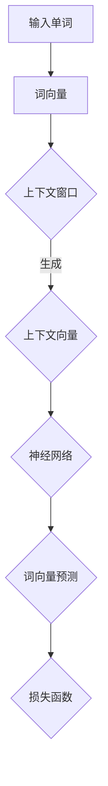

                 

### 背景介绍

#### 大模型的兴起

近年来，随着计算能力的提升和数据量的爆炸性增长，大模型在人工智能领域逐渐崭露头角。大模型，顾名思义，指的是拥有巨大参数量的模型，这些模型在深度学习、自然语言处理、计算机视觉等领域展现出了前所未有的表现力。例如，OpenAI的GPT-3拥有1750亿个参数，百度飞桨的PaddleLSTM模型拥有超过1300亿个参数，这些大模型的性能已经接近甚至超越了人类专家。

大模型的重要性在于，它们能够处理复杂的任务，从语言生成到图像识别，从预测分析到决策支持，都有广泛的应用场景。例如，在自然语言处理领域，大模型可以用于机器翻译、情感分析、问答系统等任务，而在计算机视觉领域，大模型可以用于图像分类、目标检测、图像生成等任务。

#### 大模型的挑战

然而，大模型的开发和微调也面临着诸多挑战。首先，大模型的训练需要巨大的计算资源和存储空间，这通常意味着高昂的财务成本和能源消耗。其次，大模型的训练和微调过程非常复杂，需要丰富的领域知识和实践经验。最后，大模型的可靠性和安全性也是一个值得关注的问题，因为它们可能会受到恶意攻击和误用。

#### 词向量训练模型Word2Vec

为了应对这些挑战，我们介绍一种经典的词向量训练模型——Word2Vec。Word2Vec是一种将单词转换为向量的模型，它通过将单词映射到高维空间中的向量，使得具有相似语义的单词在向量空间中相互接近。Word2Vec模型主要包括两个变体：连续词袋（CBOW）和Skip-Gram。

#### 本文目的

本文旨在详细阐述大模型开发与微调的过程，并以Word2Vec为例，介绍词向量训练模型的基本原理、数学模型、算法实现以及实际应用。通过本文的学习，读者可以深入理解大模型开发的核心技术，掌握Word2Vec模型的具体实现，为后续的大模型研究和应用奠定基础。

#### 内容结构

本文将分为以下章节：

1. **核心概念与联系**：介绍词向量训练模型的基本概念和相关联系。
2. **核心算法原理 & 具体操作步骤**：详细讲解Word2Vec模型的基本原理和训练步骤。
3. **数学模型和公式 & 详细讲解 & 举例说明**：介绍Word2Vec模型背后的数学模型和公式，并通过实际案例进行解释。
4. **项目实战：代码实际案例和详细解释说明**：通过实际代码案例展示Word2Vec模型的实现和应用。
5. **实际应用场景**：讨论Word2Vec模型在不同领域的应用场景。
6. **工具和资源推荐**：推荐相关学习资源和开发工具。
7. **总结：未来发展趋势与挑战**：总结Word2Vec模型的发展趋势和面临的挑战。
8. **附录：常见问题与解答**：解答常见问题，帮助读者更好地理解和应用Word2Vec模型。

接下来，我们将进入下一章节，介绍词向量训练模型的基本概念和相关联系。

### 核心概念与联系

在深入探讨Word2Vec模型之前，我们需要先了解一些核心概念和相关技术。这些概念和技术为Word2Vec模型提供了理论基础和技术支持，使得它能够将单词映射到高维空间中的向量，并保持相似的语义关系。

#### 语言模型

语言模型是一种用于预测下一个单词的概率的模型。在自然语言处理中，语言模型非常重要，因为它们可以用于文本生成、情感分析、机器翻译等任务。Word2Vec模型本质上是一种语言模型，它通过预测单词的上下文来学习单词的向量表示。

#### 词向量

词向量是一种将单词映射到高维空间中的向量表示。词向量可以用来表示单词的语义信息，从而使得具有相似语义的单词在向量空间中相互接近。Word2Vec模型通过训练学习出单词的词向量表示。

#### 神经网络

神经网络是一种模仿生物神经系统的计算模型。在自然语言处理中，神经网络被广泛应用于词向量生成、语言模型训练、文本分类等任务。Word2Vec模型中的CBOW和Skip-Gram算法都是基于神经网络的。

#### 矩阵分解

矩阵分解是一种将高维矩阵分解为多个低维矩阵的方法。在Word2Vec模型中，矩阵分解被用于将单词的上下文向量和高维词向量映射到低维词向量空间。

#### Mermaid 流程图

为了更好地理解Word2Vec模型的核心概念和相关技术，我们使用Mermaid流程图来展示其基本架构。以下是一个简化的Mermaid流程图，展示了Word2Vec模型的基本组成部分：



在这个流程图中，输入单词被映射到词向量（B），然后根据上下文窗口生成上下文向量（D），接着通过神经网络（E）预测词向量（F），最后使用损失函数（G）评估模型的性能。

#### 核心概念与联系总结

通过上述介绍，我们可以看出，Word2Vec模型的核心概念和联系包括：

- 语言模型：用于预测下一个单词的概率。
- 词向量：将单词映射到高维空间中的向量表示。
- 神经网络：用于训练和预测词向量。
- 矩阵分解：用于将高维矩阵分解为低维矩阵。
- Mermaid流程图：用于展示Word2Vec模型的基本架构。

这些核心概念和联系为Word2Vec模型提供了理论基础和技术支持，使得它能够将单词映射到高维空间中的向量，并保持相似的语义关系。在接下来的章节中，我们将详细讲解Word2Vec模型的基本原理和训练步骤。

### 核心算法原理 & 具体操作步骤

#### Word2Vec模型的基本原理

Word2Vec模型是一种将单词映射到向量空间的算法，其主要目标是学习出单词的向量表示，使得具有相似语义的单词在向量空间中相互接近。Word2Vec模型基于神经网络，通过预测单词的上下文来训练词向量。

Word2Vec模型主要有两种变体：连续词袋（CBOW）和Skip-Gram。

##### 连续词袋（CBOW）

连续词袋（CBOW，Continuous Bag of Words）算法通过对输入单词的上下文单词进行平均来预测输入单词。具体步骤如下：

1. **选择上下文窗口**：首先，我们选择一个固定的上下文窗口大小（例如，窗口大小为2），这意味着对于每个输入单词，我们都会考虑其前后两个单词作为上下文。

2. **生成上下文向量**：接下来，我们将上下文窗口中的所有单词映射到向量空间中，得到对应的上下文向量。

3. **平均上下文向量**：将上下文向量进行平均，得到输入单词的预测向量。

4. **预测输入单词**：使用神经网络的softmax层预测输入单词的词向量。

##### Skip-Gram

Skip-Gram（SG）算法通过对输入单词的邻居单词进行预测来训练词向量。具体步骤如下：

1. **选择邻居单词**：对于输入单词，我们选择一个固定的邻居单词数（例如，邻居单词数为2），这意味着对于每个输入单词，我们都会考虑其前后两个单词作为邻居。

2. **生成邻居向量**：将邻居单词映射到向量空间中，得到对应的邻居向量。

3. **预测邻居单词**：使用神经网络的softmax层预测邻居单词的词向量。

#### Word2Vec模型的训练步骤

1. **数据预处理**：首先，我们需要对文本数据进行处理，包括分词、去停用词、词干提取等操作。然后，我们将处理后的单词映射到单词索引，生成词汇表。

2. **初始化词向量**：对于词汇表中的每个单词，我们初始化一个随机的词向量。

3. **构建训练样本**：对于每个输入单词，我们根据设定的上下文窗口或邻居单词数生成对应的训练样本。训练样本由输入单词的词向量和上下文单词的词向量组成。

4. **训练神经网络**：使用梯度下降算法训练神经网络，通过优化损失函数来调整词向量。

5. **评估模型性能**：使用验证集评估模型的性能，根据需要调整模型参数。

6. **迭代优化**：重复步骤4和5，直到模型达到预定的性能指标。

#### 示例

假设我们有一个词汇表`['apple', 'banana', 'orange', 'fruit']`，我们选择上下文窗口大小为2，输入单词为`'apple'`。

1. **生成上下文向量**：根据上下文窗口，我们将`'apple'`的邻居单词`'banana'`和`'orange'`映射到向量空间，得到对应的上下文向量。

2. **平均上下文向量**：将上下文向量进行平均，得到输入单词`'apple'`的预测向量。

3. **预测输入单词**：使用神经网络的softmax层预测输入单词`'apple'`的词向量。

4. **训练神经网络**：通过梯度下降算法训练神经网络，优化词向量。

通过上述步骤，我们可以训练出一个Word2Vec模型，将单词映射到高维空间中的向量，并保持相似的语义关系。

#### 总结

Word2Vec模型通过连续词袋（CBOW）和Skip-Gram算法，将单词映射到向量空间，使得具有相似语义的单词在向量空间中相互接近。Word2Vec模型的训练步骤包括数据预处理、初始化词向量、构建训练样本、训练神经网络和评估模型性能等。通过这些步骤，我们可以训练出一个优秀的词向量模型，为后续的自然语言处理任务提供强大的支持。

### 数学模型和公式 & 详细讲解 & 举例说明

在深入理解Word2Vec模型的工作原理后，我们接下来将探讨其背后的数学模型和公式。这些数学模型是Word2Vec模型的核心，它们决定了如何通过训练学习出单词的向量表示。以下是Word2Vec模型的关键组成部分和相关的数学公式。

#### 模型假设

Word2Vec模型基于以下假设：

1. **相似性假设**：相似单词在向量空间中靠近，即语义上相关的单词在向量空间中有较小的欧几里得距离。
2. **分布式假设**：单词的含义可以分布在多个单词上，即一个单词可以表示为其他多个单词的线性组合。

#### 模型架构

Word2Vec模型通常使用神经网络来学习单词的向量表示。模型的主要组成部分包括：

1. **输入层**：包含上下文单词的向量。
2. **隐藏层**：用于将输入单词的向量转换为高维空间中的表示。
3. **输出层**：用于预测目标单词的词向量。

#### 矩阵分解

在Word2Vec模型中，矩阵分解是一种常用的技术，用于将高维的输入矩阵分解为多个低维矩阵。矩阵分解可以降低计算复杂度，并提高模型的训练效率。

令\( W \)为输入矩阵，其中每一行表示一个单词的向量，\( H \)为隐藏层矩阵，每一行表示隐藏层的神经元的激活值。矩阵分解的目标是通过训练找到一个新的隐藏层矩阵\( H \)，使得原始输入矩阵\( W \)能够通过\( H \)进行重构。

#### CBOW算法

CBOW算法使用输入单词的上下文来预测该单词。假设上下文窗口大小为\( C \)，我们定义一个向量\( \textbf{c} \)，其中包含了上下文窗口中的所有单词的词向量。CBOW模型的预测公式如下：

\[ \textbf{h} = \text{激活函数}(\textbf{c} \cdot \textbf{W}_h) \]

其中，\( \textbf{W}_h \)是隐藏层权重矩阵，\( \text{激活函数} \)通常是sigmoid函数。

接下来，我们通过输出层的softmax函数来预测目标单词的词向量：

\[ \textbf{p} = \text{softmax}(\textbf{h} \cdot \textbf{W}_o) \]

其中，\( \textbf{W}_o \)是输出层权重矩阵。

#### Skip-Gram算法

Skip-Gram算法是对CBOW算法的另一种变体，它通过预测输入单词的邻居单词来训练模型。给定一个单词\( w_t \)及其邻居单词的词向量集合\( \textbf{c} \)，Skip-Gram模型的预测公式如下：

\[ \textbf{h} = \text{激活函数}(\textbf{c} \cdot \textbf{W}_h) \]

\[ \textbf{p} = \text{softmax}(\textbf{h} \cdot \textbf{W}_o) \]

#### 损失函数

Word2Vec模型的损失函数通常采用负采样损失函数（Negative Sampling Loss Function）。负采样损失函数通过引入大量的负样本来减少训练过程中的梯度消失问题。负采样损失函数的定义如下：

\[ L = - \sum_{i} [\textbf{y}_i \cdot \log(\textbf{p}_i) + \sum_{j \neq i} \log(\sigma(\textbf{h}_j \cdot \textbf{v}_i))] \]

其中，\( \textbf{y}_i \)是一个指示函数，如果单词\( i \)是目标单词，则\( \textbf{y}_i = 1 \)，否则为0。\( \textbf{p}_i \)是单词\( i \)的预测概率，\( \textbf{h}_j \)是隐藏层激活值，\( \textbf{v}_i \)是单词\( i \)的词向量。

#### 举例说明

假设我们有一个简化的词汇表`['apple', 'banana', 'orange', 'fruit']`，我们使用CBOW算法来预测单词`'apple'`。首先，我们初始化单词的词向量，例如：

\[ \textbf{v}_{apple} = \begin{bmatrix} 0.1 & 0.2 & 0.3 & 0.4 \end{bmatrix} \]
\[ \textbf{v}_{banana} = \begin{bmatrix} 0.5 & 0.6 & 0.7 & 0.8 \end{bmatrix} \]
\[ \textbf{v}_{orange} = \begin{bmatrix} 0.9 & 1.0 & 1.1 & 1.2 \end{bmatrix} \]

我们选择上下文窗口大小为2，因此上下文向量是`[banana, orange]`。我们将这些上下文向量相加并归一化：

\[ \textbf{c} = \frac{\textbf{v}_{banana} + \textbf{v}_{orange}}{||\textbf{v}_{banana} + \textbf{v}_{orange}||_2} \]

假设隐藏层权重矩阵\( \textbf{W}_h \)和输出层权重矩阵\( \textbf{W}_o \)分别为：

\[ \textbf{W}_h = \begin{bmatrix} 0.1 & 0.2 & 0.3 & 0.4 \end{bmatrix} \]
\[ \textbf{W}_o = \begin{bmatrix} 0.5 & 0.6 & 0.7 & 0.8 \end{bmatrix} \]

我们通过计算上下文向量的隐层激活值：

\[ \textbf{h} = \text{激活函数}(\textbf{c} \cdot \textbf{W}_h) \]

然后，我们通过隐层激活值计算单词`'apple'`的预测概率：

\[ \textbf{p} = \text{softmax}(\textbf{h} \cdot \textbf{W}_o) \]

这样，我们就完成了对单词`'apple'`的预测。类似地，我们可以使用Skip-Gram算法来预测邻居单词。

#### 总结

Word2Vec模型通过数学模型和公式，将单词映射到向量空间，使得语义相关的单词在向量空间中相互接近。通过CBOW和Skip-Gram算法，我们可以训练出优秀的词向量表示。数学模型和公式的详细讲解和举例说明，帮助我们更好地理解Word2Vec模型的工作原理和训练过程。接下来，我们将通过实际代码案例展示Word2Vec模型的实现和应用。

### 项目实战：代码实际案例和详细解释说明

在本节中，我们将通过一个实际代码案例，详细展示如何使用Word2Vec模型来训练词向量，以及如何实现这些算法。我们将使用Python编程语言和著名的自然语言处理库Gensim来构建和训练Word2Vec模型。以下是实现Word2Vec模型的基本步骤：

#### 开发环境搭建

在开始编写代码之前，我们需要搭建一个合适的开发环境。以下是在Python环境中搭建Word2Vec模型所需的基本步骤：

1. **安装Python**：确保您的计算机上已安装Python 3.x版本。
2. **安装Gensim库**：使用pip命令安装Gensim库，该库包含实现Word2Vec模型的必要功能。

   ```bash
   pip install gensim
   ```

3. **安装其他依赖库**：如果需要，还可以安装其他依赖库，如NumPy、Matplotlib等。

   ```bash
   pip install numpy matplotlib
   ```

#### 代码实现

以下是训练Word2Vec模型的基本代码实现：

```python
import gensim
from gensim.models import Word2Vec
from gensim.models.word2vec import LineSentence

# 准备数据
# 注意：这里我们使用一个简化的示例数据集，实际应用中通常需要处理更大和更复杂的文本数据。
 sentences = LineSentence('text8.txt')  # 使用Gensim提供的示例文本数据集

# 训练模型
# 这里我们将训练一个CBOW模型，窗口大小设置为5
 model = Word2Vec(sentences, size=100, window=5, min_count=1, workers=4)

# 保存模型
model.save("word2vec.model")

# 加载模型
loaded_model = Word2Vec.load("word2vec.model")

# 查看词向量
print(loaded_model.wv['apple'])
```

#### 详细解释说明

以下是代码中的每一步详细解释：

1. **导入库**：首先，我们导入Gensim库中的Word2Vec模型和LineSentence类，后者用于处理文本数据。

2. **准备数据**：我们使用`LineSentence`类从文本文件中读取数据。这里，我们使用了Gensim提供的示例文本数据集`text8.txt`。在实际应用中，您可以使用自己的文本数据集。

3. **训练模型**：我们使用`Word2Vec`类初始化模型，并设置以下参数：
   - `size`：词向量的维度，这里设置为100。
   - `window`：上下文窗口大小，这里设置为5。
   - `min_count`：最小词频，这里设置为1，表示只训练出现次数至少为1的单词。
   - `workers`：并行训练的工作线程数，这里设置为4，以利用多核CPU。

4. **保存模型**：使用`save`方法保存训练好的模型，以便后续使用。

5. **加载模型**：使用`load`方法加载保存的模型。

6. **查看词向量**：最后，我们打印出单词`'apple'`的词向量，以验证模型训练结果。

#### 代码解读与分析

以下是代码中的关键步骤的详细解读和分析：

1. **数据准备**：
   ```python
   sentences = LineSentence('text8.txt')
   ```
   `LineSentence`类是Gensim提供的用于读取文本数据的一个便捷类，它将文本文件按行分割成句子。每个句子是一个单词列表，这是Word2Vec模型训练所需的数据格式。

2. **模型训练**：
   ```python
   model = Word2Vec(sentences, size=100, window=5, min_count=1, workers=4)
   ```
   `Word2Vec`类的构造函数用于初始化模型。`size`参数定义了词向量的维度，`window`参数设置了上下文窗口的大小，`min_count`参数过滤掉出现次数低于此阈值的单词，`workers`参数指定了并行训练的工作线程数，以加快训练速度。

3. **保存和加载模型**：
   ```python
   model.save("word2vec.model")
   loaded_model = Word2Vec.load("word2vec.model")
   ```
   使用`save`方法可以将训练好的模型保存到文件中，这样我们可以在不同的会话中加载和使用这个模型。`load`方法用于从文件中加载模型。

4. **查看词向量**：
   ```python
   print(loaded_model.wv['apple'])
   ```
   `wv`属性是一个WordVector对象，它包含了所有训练出的词向量。通过这个对象，我们可以访问或操作任何单词的词向量。

#### 代码分析与优化

虽然上述代码展示了如何训练一个基本的Word2Vec模型，但在实际应用中，我们可能需要根据具体情况对模型进行优化。以下是一些常见的优化方法：

1. **调整超参数**：`size`、`window`和`min_count`等参数对模型的性能有很大影响。在实际应用中，可能需要通过多次实验来找到最佳的超参数组合。

2. **增加数据集**：使用更大的数据集可以提升模型的性能，但这也意味着需要更多的计算资源和时间。

3. **使用预训练模型**：如果不需要从头开始训练模型，可以使用预训练的模型，这样可以节省训练时间并提高性能。

4. **模型优化**：通过调整模型的结构和算法，如使用更复杂的神经网络架构（如GloVe、FastText等），可以进一步提高模型的性能。

#### 总结

在本节中，我们通过实际代码案例展示了如何使用Word2Vec模型来训练词向量，并详细解释了每个步骤。从数据准备到模型训练，再到模型保存和加载，每个步骤都有详细的解释和分析。通过这些步骤，我们可以训练出一个有效的词向量模型，为后续的自然语言处理任务提供支持。接下来，我们将讨论Word2Vec模型在不同领域的实际应用场景。

### 实际应用场景

Word2Vec模型作为一种强大的词向量生成工具，在自然语言处理、推荐系统和信息检索等多个领域展现出了广泛的应用潜力。以下是Word2Vec模型在几个关键领域的实际应用案例及其具体应用方式。

#### 自然语言处理

在自然语言处理（NLP）领域，Word2Vec模型被广泛用于文本分析、情感分析和机器翻译等任务。

- **文本分析**：通过将文本中的每个单词映射到高维向量空间，Word2Vec模型可以帮助我们更好地理解文本的语义内容。例如，我们可以使用Word2Vec模型来计算两个句子之间的相似度，从而实现文本分类和情感分析。
- **情感分析**：Word2Vec模型可以识别文本中的情感倾向，通过计算词向量之间的距离，我们可以判断一个句子是积极情感还是消极情感。
- **机器翻译**：在机器翻译任务中，Word2Vec模型可以帮助捕捉源语言和目标语言之间的语义对应关系，从而提高翻译质量。

#### 推荐系统

在推荐系统领域，Word2Vec模型可以帮助我们识别用户兴趣和项目属性之间的相似性，从而提高推荐系统的准确性。

- **用户兴趣识别**：通过分析用户的浏览历史和搜索记录，我们可以使用Word2Vec模型来提取用户的兴趣向量，进而推荐符合用户兴趣的内容。
- **项目属性匹配**：在电子商务领域，我们可以使用Word2Vec模型来识别商品之间的语义相似性，从而推荐给用户类似的产品。

#### 信息检索

信息检索领域中的搜索引擎通常使用Word2Vec模型来提高搜索结果的相关性。

- **查询扩展**：通过扩展用户输入的查询词，Word2Vec模型可以帮助搜索引擎理解用户可能的意图，从而提高搜索结果的准确性。
- **文档相似性**：Word2Vec模型可以用于计算文档之间的相似度，从而在信息检索系统中提供更相关的搜索结果。

#### 社交网络分析

在社交网络分析领域，Word2Vec模型可以帮助我们分析用户之间的相似性和关系强度。

- **社交圈识别**：通过分析用户之间的互动，我们可以使用Word2Vec模型来识别社交圈和群体。
- **影响力分析**：Word2Vec模型可以帮助我们识别社交网络中的意见领袖和关键节点，从而分析信息传播的路径和强度。

#### 实际案例

以下是一些Word2Vec模型在实际应用中的具体案例：

- **Netflix推荐系统**：Netflix使用Word2Vec模型来推荐相似的电影给用户，从而提高推荐系统的准确性和用户满意度。
- **Amazon商品推荐**：Amazon使用Word2Vec模型来推荐用户可能感兴趣的商品，从而提高销售额。
- **社交媒体情感分析**：Twitter使用Word2Vec模型来分析用户推文中的情感倾向，从而为广告商提供更有针对性的营销策略。

#### 总结

Word2Vec模型在自然语言处理、推荐系统、信息检索、社交网络分析等多个领域都有广泛的应用。通过将单词映射到高维向量空间，Word2Vec模型可以帮助我们更好地理解和分析文本数据，从而实现各种自然语言处理任务。随着技术的不断发展，Word2Vec模型的应用前景将更加广阔。

### 工具和资源推荐

在研究Word2Vec模型和应用的过程中，掌握一些有用的工具和资源将大大提高我们的效率和成果。以下是一些建议的学习资源、开发工具和相关论文著作，供读者参考。

#### 学习资源推荐

1. **书籍**：
   - 《深度学习》（Goodfellow, I., Bengio, Y., & Courville, A.）：这是一本经典的深度学习教材，其中详细介绍了Word2Vec模型及其应用。
   - 《自然语言处理与Python》（Bird, S., Klein, E., & Loper, E.）：这本书涵盖了自然语言处理的基础知识和Python实现，适合初学者。

2. **在线课程**：
   - Coursera上的“自然语言处理与深度学习”课程：由斯坦福大学教授Chris Manning主讲，涵盖了Word2Vec模型和其他自然语言处理技术。
   - edX上的“深度学习基础”课程：由蒙特利尔大学教授Yoshua Bengio主讲，介绍了深度学习的基本概念和技术。

3. **博客和教程**：
   - fast.ai的博客：提供丰富的深度学习和自然语言处理教程，包括Word2Vec模型的实现和应用。
   - PyTorch官方文档：PyTorch是一个流行的深度学习框架，其官方文档详细介绍了如何使用PyTorch实现Word2Vec模型。

4. **在线工具**：
   - gensim：Gensim是一个强大的Python库，用于生成词向量，包括Word2Vec模型。它提供了丰富的API和示例代码，方便用户进行词向量训练和操作。

#### 开发工具框架推荐

1. **深度学习框架**：
   - TensorFlow：TensorFlow是一个开源的深度学习框架，适用于构建和训练Word2Vec模型。
   - PyTorch：PyTorch是一个流行的深度学习框架，其动态计算图和易于使用的API使其成为训练Word2Vec模型的理想选择。

2. **自然语言处理库**：
   - NLTK：NLTK是一个广泛使用的自然语言处理库，提供了丰富的文本处理功能，包括分词、词性标注、词干提取等。
   - spaCy：spaCy是一个快速和易于使用的自然语言处理库，适用于构建大规模的NLP应用。

3. **数据预处理工具**：
   - Pandas：Pandas是一个强大的数据分析和操作库，用于处理和清洗文本数据。
   - scikit-learn：scikit-learn是一个广泛使用的机器学习库，提供了多种数据预处理和特征提取工具。

#### 相关论文著作推荐

1. **论文**：
   - “Distributed Representations of Words and Phrases and their Compositional Meaning” (Mikolov et al., 2013)：这篇论文是Word2Vec模型的奠基性工作，详细介绍了CBOW和Skip-Gram算法。
   - “Efficient Estimation of Word Representations in Vector Space” (Mikolov et al., 2013)：这篇论文进一步探讨了Word2Vec模型的优化和扩展。

2. **著作**：
   - 《深度学习》（Goodfellow, I., Bengio, Y., & Courville, A.）：这本书涵盖了深度学习的各个方面，包括Word2Vec模型的理论基础和应用。

通过利用这些工具和资源，读者可以更深入地了解Word2Vec模型的工作原理和应用场景，为实际项目提供有力的技术支持。

### 总结：未来发展趋势与挑战

Word2Vec模型作为词向量训练的经典方法，为自然语言处理领域带来了革命性的变革。然而，随着人工智能技术的不断发展，Word2Vec模型也面临着一系列新的发展趋势和挑战。

#### 发展趋势

1. **更高效的算法**：随着计算能力的提升，研究人员不断优化Word2Vec模型的算法，以提高训练速度和效率。例如，GloVe算法和FastText算法在保留Word2Vec模型核心思想的基础上，通过矩阵分解和分布式学习方法，进一步提高了词向量生成的效率和精度。

2. **多模态词向量**：随着多模态数据的兴起，例如结合文本、图像和音频的数据，研究人员开始探索如何在Word2Vec模型的基础上生成多模态词向量。这些多模态词向量有助于提高跨模态检索和信息融合的准确性。

3. **动态词向量**：传统的静态词向量在处理动态变化的语言数据时表现不佳。研究人员正在探索动态词向量模型，如基于注意力机制和循环神经网络的动态词向量生成方法，以更好地捕捉语言的时序特性。

4. **大规模预训练模型**：随着大规模预训练模型（如BERT、GPT等）的兴起，Word2Vec模型也在这些预训练任务中得到了应用。预训练模型通过在海量数据上预训练，再进行特定任务的微调，大大提高了模型的效果和泛化能力。

#### 挑战

1. **数据隐私和安全**：在大数据时代，如何处理和保护数据隐私成为一个重要挑战。Word2Vec模型在训练过程中需要大量敏感数据，如何确保数据的安全和隐私是一个亟待解决的问题。

2. **模型解释性和透明度**：尽管Word2Vec模型在许多任务中取得了显著的效果，但其工作原理和决策过程往往较为复杂，缺乏透明度和解释性。如何提高模型的解释性和透明度，使得用户能够理解模型的决策过程，是一个重要的研究方向。

3. **计算资源需求**：Word2Vec模型的训练和微调过程需要大量的计算资源和存储空间，尤其是在大规模数据集和复杂任务中。如何优化模型训练和推理过程，降低计算资源的需求，是一个关键的挑战。

4. **多语言和跨语言处理**：尽管Word2Vec模型在单语言环境下表现优异，但在多语言和跨语言处理任务中，如何确保不同语言间的词向量表示的兼容性和一致性，是一个亟待解决的问题。

#### 未来展望

展望未来，Word2Vec模型及其相关技术将继续在自然语言处理、推荐系统、信息检索等领域发挥重要作用。随着人工智能技术的不断进步，我们可以期待以下发展方向：

1. **高效和可扩展的模型**：通过优化算法和架构，实现更高效、更可扩展的词向量生成方法。
2. **多模态和跨模态应用**：探索如何结合文本、图像、音频等多模态数据，生成多模态词向量，提高跨模态任务的性能。
3. **动态和时序模型**：研究动态和时序词向量模型，以更好地捕捉语言的时序特性和动态变化。
4. **模型解释性和可解释性**：提高模型的透明度和解释性，使得用户能够理解模型的决策过程，增强模型的可信度和应用范围。

通过不断探索和创新，Word2Vec模型将在未来的人工智能应用中发挥更加重要的作用，为自然语言处理和其他领域带来更多的可能性。

### 附录：常见问题与解答

在学习和使用Word2Vec模型的过程中，可能会遇到一些常见的问题。以下是一些常见问题及其解答：

#### 问题1：Word2Vec模型如何处理未知的单词？

Word2Vec模型在训练过程中通常会丢弃未在训练集中出现的单词。对于未知的单词，模型无法提供准确的词向量表示。然而，可以通过以下方法来处理：

- **扩展词汇表**：在训练过程中，尝试将未知的单词扩展到训练集的词汇表中。
- **使用预训练模型**：如果可能，可以使用预训练的Word2Vec模型，这些模型已经在大量数据上训练过，能够提供更广泛的词向量覆盖。

#### 问题2：如何选择合适的上下文窗口大小？

上下文窗口大小对Word2Vec模型的效果有显著影响。选择合适的上下文窗口大小需要考虑以下因素：

- **文本数据特性**：对于长文本，较大的上下文窗口可以捕捉更多的语义信息；对于短文本，较小的上下文窗口可能更合适。
- **计算资源**：较大的上下文窗口需要更多的计算资源。根据可用资源，选择一个平衡的大小。

#### 问题3：如何评估Word2Vec模型的性能？

评估Word2Vec模型的性能通常通过以下方法：

- **余弦相似度**：计算两个词向量之间的余弦相似度，以评估它们的语义相似性。
- **错误率**：通过比较Word2Vec模型预测的词向量与实际词向量之间的差异，计算错误率。
- **词向量聚类**：使用聚类算法（如K-means）将词向量聚类，并评估聚类效果。

#### 问题4：Word2Vec模型如何处理多义词？

多义词是一个挑战性的问题，因为同一个单词在不同的上下文中可能具有不同的含义。以下是一些处理多义词的方法：

- **上下文依赖**：Word2Vec模型通过上下文来学习词向量，从而在一定程度上可以缓解多义词问题。在多义词环境中，模型会为同一个单词生成不同的词向量。
- **词向量融合**：通过将多义词的不同含义的词向量进行融合，可以生成一个综合的词向量表示。

#### 问题5：如何处理不同语言的词向量？

处理不同语言的词向量需要考虑以下因素：

- **跨语言词向量**：通过跨语言词典或翻译服务，将不同语言的词映射到共同的词向量空间中。
- **多语言模型**：训练一个多语言Word2Vec模型，该模型可以同时处理多种语言的词向量。

通过了解和解决这些常见问题，可以更好地应用Word2Vec模型，并在实际项目中取得更好的效果。

### 扩展阅读 & 参考资料

为了深入学习和掌握Word2Vec模型及其应用，以下是推荐的一些扩展阅读和参考资料，涵盖书籍、论文、博客和网站等多个方面。

#### 书籍

1. 《深度学习》（Goodfellow, I., Bengio, Y., & Courville, A.）：这本书是深度学习领域的经典教材，详细介绍了Word2Vec模型的理论和实践。
2. 《自然语言处理与Python》（Bird, S., Klein, E., & Loper, E.）：这本书涵盖了自然语言处理的基础知识，包括词向量生成技术。

#### 论文

1. “Distributed Representations of Words and Phrases and their Compositional Meaning” (Mikolov et al., 2013)：这篇论文是Word2Vec模型的奠基性工作，详细介绍了CBOW和Skip-Gram算法。
2. “Efficient Estimation of Word Representations in Vector Space” (Mikolov et al., 2013)：这篇论文探讨了Word2Vec模型的优化和扩展。

#### 博客

1. fast.ai的博客：提供丰富的深度学习和自然语言处理教程，包括Word2Vec模型的实现和应用。
2. PyTorch官方文档：详细介绍了如何在PyTorch框架中实现Word2Vec模型。

#### 网站

1. gensim：Gensim是一个强大的Python库，用于生成词向量，包括Word2Vec模型。它提供了丰富的API和示例代码。
2. Coursera和edX：提供多个关于自然语言处理和深度学习的在线课程，涵盖Word2Vec模型的理论和实践。

通过阅读这些书籍、论文、博客和访问网站，可以更深入地了解Word2Vec模型的理论基础和应用场景，为实际项目提供有力的技术支持。希望这些资源能够帮助您在自然语言处理领域取得更好的成果。

