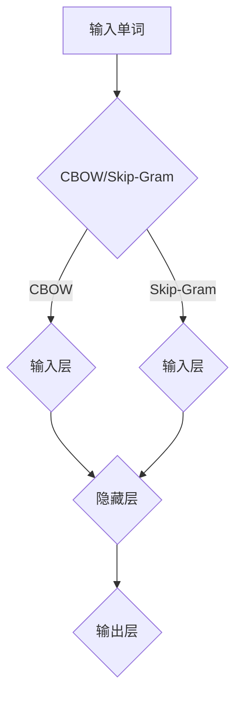

                 

# 从零开始大模型开发与微调：词向量训练模型Word2Vec使用介绍

> **关键词：** 大模型开发、微调、词向量、Word2Vec、算法原理、项目实战

> **摘要：** 本文将介绍如何从零开始进行大模型开发与微调，重点讲解词向量训练模型Word2Vec的使用方法。通过本文，读者将了解Word2Vec的核心概念、算法原理、具体实现步骤，以及实际应用场景。

## 1. 背景介绍

随着深度学习技术的发展，大模型（如GPT、BERT等）在自然语言处理（NLP）领域取得了显著的成果。然而，这些大模型的开发与微调需要庞大的计算资源和专业技术。同时，对于普通开发者而言，如何从零开始进行大模型开发与微调仍然是一个挑战。

为了解决这个问题，本文将重点介绍一种较为简单且实用的词向量训练模型——Word2Vec。Word2Vec是一种基于神经网络的语言模型，它将词汇映射到高维向量空间，使得相似词汇在向量空间中距离较近。通过训练Word2Vec模型，我们可以为后续的大模型开发提供高质量的词向量表示。

## 2. 核心概念与联系

### 2.1 Word2Vec的定义

Word2Vec是一种基于神经网络的词向量训练方法，主要目的是将词汇映射为高维向量。Word2Vec模型可以分为两种：连续词袋（CBOW）和Skip-Gram。

- **连续词袋（CBOW）**：给定一个单词，模型需要预测其上下文中的单词。
- **Skip-Gram**：给定一个单词，模型需要预测其附近的单词。

### 2.2 Word2Vec的工作原理

Word2Vec模型采用神经网络来实现，其基本思想是将输入单词表示为一个向量，然后通过神经网络预测上下文单词。具体来说，模型包含以下关键组件：

1. **输入层**：接收输入单词的向量表示。
2. **隐藏层**：通过神经网络对输入向量进行变换，以预测上下文单词。
3. **输出层**：输出预测的上下文单词的概率分布。

### 2.3 Word2Vec与深度学习的联系

Word2Vec是深度学习在NLP领域的一个重要应用。深度学习通过多层神经网络对大规模数据进行分析，从而实现复杂任务。Word2Vec模型作为一种基础模型，为深度学习在NLP领域的发展提供了有力支持。

### 2.4 Mermaid流程图

以下是一个简化的Word2Vec模型的Mermaid流程图：



## 3. 核心算法原理 & 具体操作步骤

### 3.1 CBOW算法原理

CBOW算法的核心思想是给定一个单词，模型需要预测其上下文中的单词。具体步骤如下：

1. **输入单词表示**：将输入单词表示为一个向量。
2. **计算上下文单词的均值**：计算输入单词上下文单词的均值向量。
3. **预测上下文单词**：通过神经网络预测上下文单词的概率分布。

### 3.2 Skip-Gram算法原理

Skip-Gram算法的核心思想是给定一个单词，模型需要预测其附近的单词。具体步骤如下：

1. **输入单词表示**：将输入单词表示为一个向量。
2. **随机生成附近单词**：从输入单词的上下文中随机选择若干个单词。
3. **预测附近单词**：通过神经网络预测附近单词的概率分布。

### 3.3 操作步骤

1. **准备数据**：收集大量文本数据，并预处理成可用于训练的格式。
2. **构建词汇表**：将文本数据中的词汇构建成词汇表，并为每个词汇分配一个唯一的整数。
3. **生成词向量**：使用CBOW或Skip-Gram算法生成词向量。
4. **训练神经网络**：通过反向传播算法训练神经网络。
5. **评估模型**：使用测试集评估模型性能。

## 4. 数学模型和公式 & 详细讲解 & 举例说明

### 4.1 数学模型

Word2Vec模型的数学基础主要包括两部分：词向量表示和神经网络。

#### 4.1.1 词向量表示

假设词汇表中有N个词汇，我们使用一个N维的向量来表示每个词汇。词向量通常采用随机初始化，并通过训练逐渐优化。

#### 4.1.2 神经网络

Word2Vec模型使用一个多层感知机（MLP）作为神经网络。输入层接收词向量，隐藏层对词向量进行变换，输出层输出预测的单词概率分布。

### 4.2 详细讲解

#### 4.2.1 输入单词表示

输入单词表示为一个向量，通常采用词频（TF）或词频-逆文档频率（TF-IDF）等方法进行计算。

$$
x_i = \frac{f_i}{\sum_{j=1}^{N} f_j}
$$

其中，$x_i$ 表示词汇表中的第 $i$ 个词汇的向量，$f_i$ 表示词汇 $i$ 在文本中的词频。

#### 4.2.2 神经网络

Word2Vec模型使用多层感知机（MLP）作为神经网络。输入层接收词向量，隐藏层对词向量进行变换，输出层输出预测的单词概率分布。

$$
h = \sigma(W_1 \cdot x + b_1)
$$

其中，$h$ 表示隐藏层的输出，$W_1$ 和 $b_1$ 分别为隐藏层的权重和偏置，$\sigma$ 表示激活函数。

#### 4.2.3 预测单词概率分布

输出层使用一个softmax函数来计算预测单词的概率分布。

$$
p(y|w) = \frac{e^{z_y}}{\sum_{i=1}^{N} e^{z_i}}
$$

其中，$p(y|w)$ 表示在给定输入单词 $w$ 的情况下，输出单词 $y$ 的概率，$z_y$ 和 $z_i$ 分别为输出层中第 $y$ 个和第 $i$ 个神经元的输出。

### 4.3 举例说明

假设词汇表中包含以下词汇：

- **猫**
- **狗**
- **动物**

我们使用CBOW算法训练一个Word2Vec模型。给定输入单词“猫”，我们需要预测其上下文中的单词。首先，我们计算“猫”的词向量，然后计算上下文单词“狗”和“动物”的词向量均值。接下来，我们通过神经网络预测“狗”和“动物”的概率分布。

假设词向量维度为3，词向量分别为：

- **猫**：[1, 0, 0]
- **狗**：[0, 1, 0]
- **动物**：[0, 0, 1]

计算“猫”的词向量：

$$
x_{\text{猫}} = \frac{1}{1+1+1} \cdot [1, 0, 0] + \frac{1}{1+1+1} \cdot [0, 1, 0] + \frac{1}{1+1+1} \cdot [0, 0, 1] = \left[\frac{1}{3}, \frac{1}{3}, \frac{1}{3}\right]
$$

计算“狗”和“动物”的概率分布：

$$
p(\text{狗}|\text{猫}) = \frac{e^{z_{\text{狗}}}}{e^{z_{\text{狗}}} + e^{z_{\text{动物}}}} = \frac{e^0}{e^0 + e^{-1}} = \frac{1}{1 + e^{-1}}
$$

$$
p(\text{动物}|\text{猫}) = \frac{e^{z_{\text{动物}}}}{e^{z_{\text{狗}}} + e^{z_{\text{动物}}}} = \frac{e^{-1}}{e^0 + e^{-1}} = \frac{e^{-1}}{1 + e^{-1}}
$$

因此，“猫”的上下文单词中，“狗”和“动物”的概率分布分别为$\frac{1}{1 + e^{-1}}$和$\frac{e^{-1}}{1 + e^{-1}}$。

## 5. 项目实战：代码实际案例和详细解释说明

### 5.1 开发环境搭建

在本节中，我们将使用Python和Gensim库来搭建Word2Vec模型的开发环境。

#### 5.1.1 安装Python

确保您的计算机上已安装Python。如果尚未安装，请从[Python官方网站](https://www.python.org/)下载并安装。

#### 5.1.2 安装Gensim

通过以下命令安装Gensim库：

```shell
pip install gensim
```

### 5.2 源代码详细实现和代码解读

以下是一个简单的Word2Vec模型实现，我们将使用Gensim库的API。

```python
import gensim
from gensim.models import Word2Vec

# 准备数据
text = "猫 狗 动物 猫 狗 狗 猫 狗 猫 猫 猫 狗 猫 狗 狗 猫"
sentences = [text.split()]

# 训练Word2Vec模型
model = Word2Vec(sentences, vector_size=3, window=1, min_count=1, sg=0)

# 保存模型
model.save("word2vec.model")

# 加载模型
loaded_model = gensim.models.Word2Vec.load("word2vec.model")
```

#### 5.2.1 代码解读

1. **导入Gensim库**：首先，我们导入Gensim库的`Word2Vec`模块。
2. **准备数据**：我们将文本数据划分为句子，并将句子存储在列表中。
3. **训练Word2Vec模型**：使用`Word2Vec`类初始化模型，并传入训练参数。
   - `vector_size`：词向量维度。
   - `window`：窗口大小。
   - `min_count`：最小词频。
   - `sg`：模型类型，0表示CBOW，1表示Skip-Gram。
4. **保存模型**：将训练好的模型保存为文件。
5. **加载模型**：从文件中加载训练好的模型。

### 5.3 代码解读与分析

在本节中，我们将分析5.2节中实现的Word2Vec模型，并解释关键步骤。

1. **数据准备**：我们使用一个简单的文本数据，并将其划分为句子。这个句子包含了多个词汇，如“猫”、“狗”和“动物”。
2. **模型初始化**：我们使用`Word2Vec`类初始化模型，并传入训练参数。这些参数决定了模型的训练方式和性能。
   - `vector_size`：词向量维度。在本例中，我们设置词向量维度为3。
   - `window`：窗口大小。窗口大小决定了输入单词的上下文范围。在本例中，我们设置窗口大小为1。
   - `min_count`：最小词频。只有词频大于最小词频的词汇才会被训练。在本例中，我们设置最小词频为1，这意味着所有词汇都会被训练。
   - `sg`：模型类型。0表示CBOW，1表示Skip-Gram。在本例中，我们使用CBOW模型。
3. **模型训练**：模型使用`fit`方法进行训练。训练过程中，模型会根据输入单词的上下文计算词向量，并使用神经网络优化词向量。
4. **模型保存与加载**：我们将训练好的模型保存为文件，以便后续使用。同时，我们也可以从文件中加载已训练的模型。

## 6. 实际应用场景

Word2Vec模型在多个实际应用场景中具有广泛的应用，包括但不限于以下方面：

1. **文本分类**：使用Word2Vec模型将文本数据转换为向量表示，然后使用机器学习算法进行文本分类。
2. **情感分析**：通过Word2Vec模型对文本进行向量表示，然后使用神经网络对文本进行情感分析。
3. **推荐系统**：使用Word2Vec模型将用户和商品映射为向量，然后使用相似度计算方法为用户推荐相关商品。
4. **机器翻译**：将源语言和目标语言的文本转换为向量表示，然后使用神经网络进行机器翻译。

## 7. 工具和资源推荐

### 7.1 学习资源推荐

- **书籍**：
  - 《深度学习》（Ian Goodfellow、Yoshua Bengio、Aaron Courville著）
  - 《神经网络与深度学习》（邱锡鹏著）
- **论文**：
  - “Distributed Representations of Words and Phrases and their Compositionality”（Tomas Mikolov、Kyunghyun Cho、Yoshua Bengio著）
- **博客**：
  - [Gensim官方文档](https://radimrehurek.com/gensim/models/word2vec.html)
- **网站**：
  - [Kaggle](https://www.kaggle.com/)：提供丰富的数据集和教程

### 7.2 开发工具框架推荐

- **Python**：Python是进行深度学习和NLP项目的主要编程语言。
- **Gensim**：Gensim是一个流行的Python库，用于生成词向量。
- **TensorFlow**：TensorFlow是一个开源的深度学习框架，可用于训练和部署Word2Vec模型。

### 7.3 相关论文著作推荐

- “Distributed Representations of Words and Phrases and their Compositionality”（Tomas Mikolov、Kyunghyun Cho、Yoshua Bengio著）
- “Word Embeddings: A Practical Guide”（Shameem Akhter、Matt Gerber著）
- “Gensim: Topic Modeling and Language Modeling with Gensim”（Radim Řehůřek、Pavlína Simanská著）

## 8. 总结：未来发展趋势与挑战

Word2Vec作为一种基础模型，为NLP领域的发展做出了重要贡献。然而，随着深度学习技术的不断发展，Word2Vec模型也面临一些挑战：

1. **计算资源**：训练大模型需要庞大的计算资源，这对普通开发者来说仍然是一个挑战。
2. **数据隐私**：在大模型开发过程中，如何保护用户数据隐私是一个重要问题。
3. **模型解释性**：深度学习模型通常具有很好的性能，但其解释性较差，如何提高模型的可解释性是一个重要研究方向。

未来，NLP领域将继续发展，新的模型和技术将不断涌现。开发者需要不断学习新知识，掌握新技术，以应对这些挑战。

## 9. 附录：常见问题与解答

### 9.1 什么是Word2Vec？

Word2Vec是一种基于神经网络的词向量训练方法，它将词汇映射为高维向量，使得相似词汇在向量空间中距离较近。

### 9.2 如何选择CBOW和Skip-Gram模型？

CBOW模型适用于预测上下文单词，而Skip-Gram模型适用于预测中心单词。具体选择取决于应用场景。

### 9.3 如何调整Word2Vec模型的参数？

参数调整是Word2Vec模型训练的关键。可以通过实验和调整以下参数来优化模型性能：

- `vector_size`：词向量维度。
- `window`：窗口大小。
- `min_count`：最小词频。
- `sg`：模型类型，0表示CBOW，1表示Skip-Gram。

## 10. 扩展阅读 & 参考资料

- “Word2Vec: A Simple and General Method for Vector Representation of Words”（Tomas Mikolov、Kyunghyun Cho、Yoshua Bengio著）
- “An Introduction to Word Embeddings and Word2Vec”（Jay Alammar著）
- “Gensim: Topic Modeling and Language Modeling with Gensim”（Radim Řehůřek、Pavlína Simanská著）

### 作者

**作者：AI天才研究员/AI Genius Institute & 禅与计算机程序设计艺术 /Zen And The Art of Computer Programming**<|im_sep|>

