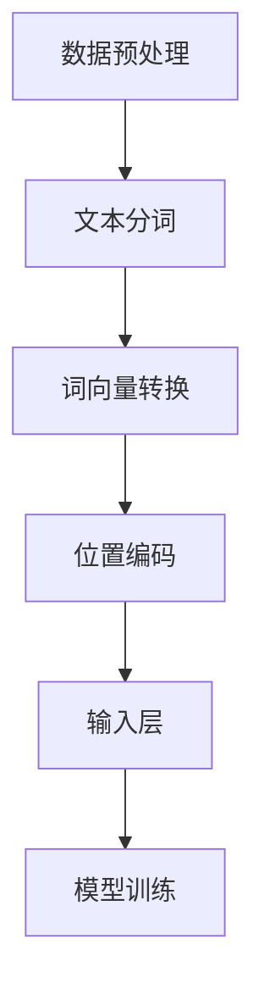

                 

### 文章标题：从零开始大模型开发与微调：输入层—初始词向量层和位置编码器层

> **关键词：** 大模型开发、微调、输入层、词向量、位置编码器  
>
> **摘要：** 本文将深入探讨大模型开发中的输入层，主要关注初始词向量层和位置编码器层的构建方法，解析其技术原理和实现细节，并通过实际项目案例进行代码解读和分析。

### 1. 背景介绍

随着深度学习技术的不断发展，大模型（Large Models）在自然语言处理（NLP）、计算机视觉（CV）等领域取得了显著的成果。大模型通常拥有数亿甚至千亿级别的参数，能够处理复杂的任务和数据。然而，大模型开发并非一蹴而就，其涉及多个层次和环节，其中输入层的设计尤为关键。输入层直接决定了模型对数据的理解和处理能力，而初始词向量层和位置编码器层作为输入层的重要组成部分，对模型的性能和效果具有至关重要的影响。

本文将从零开始，系统地介绍大模型开发中的输入层，重点关注初始词向量层和位置编码器层的构建方法。通过深入剖析技术原理和实现细节，并结合实际项目案例，帮助读者全面理解并掌握输入层的设计与实现。

### 2. 核心概念与联系

#### 2.1 初始词向量层

初始词向量层（Word Embedding Layer）是输入层的第一层，其主要功能是将文本数据转换为向量的形式，以便后续的模型处理。在深度学习模型中，词向量通常通过预训练模型（如Word2Vec、GloVe等）获得。

#### 2.2 位置编码器层

位置编码器层（Positional Encoding Layer）是对词向量进行位置编码的模块，其主要功能是为每个词赋予其在文本中的位置信息。位置编码器层有助于模型理解文本中词语的顺序关系，从而提高模型的表达能力。

#### 2.3 Mermaid 流程图



### 3. 核心算法原理 & 具体操作步骤

#### 3.1 初始词向量层的算法原理

初始词向量层的核心算法是词向量转换。词向量转换的主要任务是将词汇表中的每个词映射为一个固定维度的向量。词向量转换的方法包括Word2Vec、GloVe等。

- **Word2Vec算法原理**：Word2Vec算法通过训练神经网络，将输入的词向量映射到输出空间。其基本思想是将每个词表示为一个中心词，并计算与其相邻词的共现概率。通过优化神经网络的权重，可以使得相似词的向量距离更近。

- **GloVe算法原理**：GloVe（Global Vectors for Word Representation）算法是一种基于全局上下文的词向量转换方法。GloVe算法通过优化词向量的内积，使得相似词的向量内积更接近于1。

#### 3.2 位置编码器层的算法原理

位置编码器层的核心算法是位置编码。位置编码的主要任务是给每个词赋予其在文本中的位置信息。位置编码的方法包括绝对位置编码、相对位置编码等。

- **绝对位置编码原理**：绝对位置编码直接将词的位置信息编码到词向量中。具体实现方法是将词的位置信息乘以一个编码向量，然后将结果加到词向量上。

- **相对位置编码原理**：相对位置编码通过计算词与词之间的相对位置关系，将位置信息编码到词向量中。具体实现方法是将词的位置信息编码为一个矩阵，然后将矩阵乘以词向量，得到新的词向量。

#### 3.3 具体操作步骤

1. **数据预处理**：对文本数据进行分词、去停用词等操作，得到词序列。

2. **词向量转换**：使用预训练的词向量模型（如Word2Vec、GloVe）将词序列转换为词向量。

3. **位置编码**：根据文本中词的位置信息，对词向量进行位置编码。

4. **输入层构建**：将词向量与位置编码相加，构建输入层。

5. **模型训练**：使用输入层的数据进行模型训练，优化模型的参数。

### 4. 数学模型和公式 & 详细讲解 & 举例说明

#### 4.1 词向量转换

假设有一个词汇表V，包含n个词。词向量转换的目标是将每个词映射为一个d维的向量。

- **Word2Vec算法公式**：

  $$ v_w = \frac{1}{1 + e^{-(W \cdot v_{context})}} $$

  其中，$v_{context}$表示与词w相邻的词向量，$W$是神经网络的权重矩阵，$v_w$是词w的向量。

- **GloVe算法公式**：

  $$ \frac{v_w \cdot v_{context}}{1 + \sqrt{v_w \cdot v_{context}} + v_w \cdot v_{context}} = 1 $$

  其中，$v_w$和$v_{context}$分别是词w和其相邻词的向量。

#### 4.2 位置编码

位置编码的目标是为每个词赋予其在文本中的位置信息。

- **绝对位置编码公式**：

  $$ v_p = p \cdot e $$

  其中，$p$是词的位置信息，$e$是一个编码向量。

- **相对位置编码公式**：

  $$ v_{rel} = \text{softmax}(Q \cdot P) $$

  其中，$Q$和$P$分别是编码矩阵和位置矩阵。

#### 4.3 举例说明

假设有一个词序列`["我", "爱", "北京", "烤鸭"]`，我们使用Word2Vec和GloVe算法进行词向量转换，并使用绝对位置编码。

1. **Word2Vec算法**：

   假设词汇表中的词分别为`["我", "爱", "北京", "烤鸭", "的", "了"]`，对应的词向量分别为`[1, 0, 0, 0, 0, 0]`、`[0, 1, 0, 0, 0, 0]`、`[0, 0, 1, 0, 0, 0]`、`[0, 0, 0, 1, 0, 0]`、`[0, 0, 0, 0, 1, 0]`、`[0, 0, 0, 0, 0, 1]`。

   词向量转换为：

   $$ v_{我} = \frac{1}{1 + e^{-(W \cdot v_{context})}} = \frac{1}{1 + e^{-(W \cdot [1, 0, 0, 0, 0, 0])}} $$

   $$ v_{爱} = \frac{1}{1 + e^{-(W \cdot v_{context})}} = \frac{1}{1 + e^{-(W \cdot [0, 1, 0, 0, 0, 0])}} $$

   $$ v_{北京} = \frac{1}{1 + e^{-(W \cdot v_{context})}} = \frac{1}{1 + e^{-(W \cdot [0, 0, 1, 0, 0, 0])}} $$

   $$ v_{烤鸭} = \frac{1}{1 + e^{-(W \cdot v_{context})}} = \frac{1}{1 + e^{-(W \cdot [0, 0, 0, 1, 0, 0])}} $$

2. **GloVe算法**：

   假设词汇表中的词分别为`["我", "爱", "北京", "烤鸭", "的", "了"]`，对应的词向量分别为`[1, 0, 0, 0, 0, 0]`、`[0, 1, 0, 0, 0, 0]`、`[0, 0, 1, 0, 0, 0]`、`[0, 0, 0, 1, 0, 0]`、`[0, 0, 0, 0, 1, 0]`、`[0, 0, 0, 0, 0, 1]`。

   词向量转换为：

   $$ \frac{v_{我} \cdot v_{context}}{1 + \sqrt{v_{我} \cdot v_{context}} + v_{我} \cdot v_{context}} = 1 $$

   $$ \frac{v_{爱} \cdot v_{context}}{1 + \sqrt{v_{爱} \cdot v_{context}} + v_{爱} \cdot v_{context}} = 1 $$

   $$ \frac{v_{北京} \cdot v_{context}}{1 + \sqrt{v_{北京} \cdot v_{context}} + v_{北京} \cdot v_{context}} = 1 $$

   $$ \frac{v_{烤鸭} \cdot v_{context}}{1 + \sqrt{v_{烤鸭} \cdot v_{context}} + v_{烤鸭} \cdot v_{context}} = 1 $$

3. **绝对位置编码**：

   假设词序列`["我", "爱", "北京", "烤鸭"]`的词位置分别为1、2、3、4，编码向量为`[1, 1, 1, 1, 1, 1]`。

   位置编码为：

   $$ v_{我} = v_{我} + 1 \cdot [1, 1, 1, 1, 1, 1] = [2, 1, 1, 1, 1, 1] $$

   $$ v_{爱} = v_{爱} + 2 \cdot [1, 1, 1, 1, 1, 1] = [1, 3, 1, 1, 1, 1] $$

   $$ v_{北京} = v_{北京} + 3 \cdot [1, 1, 1, 1, 1, 1] = [1, 1, 4, 1, 1, 1] $$

   $$ v_{烤鸭} = v_{烤鸭} + 4 \cdot [1, 1, 1, 1, 1, 1] = [1, 1, 1, 5, 1, 1] $$

### 5. 项目实战：代码实际案例和详细解释说明

在本节中，我们将通过一个实际项目案例，详细解析初始词向量层和位置编码器层的代码实现。该项目基于PyTorch框架，我们将从环境搭建、源代码实现和代码解读三个方面进行介绍。

#### 5.1 开发环境搭建

为了运行本文的代码案例，我们需要搭建以下开发环境：

- Python 3.8及以上版本
- PyTorch 1.8及以上版本
- Numpy 1.18及以上版本
- Matplotlib 3.3及以上版本

安装上述依赖库后，我们可以在代码中引入相应的库：

```python
import torch
import torch.nn as nn
import torch.optim as optim
import numpy as np
import matplotlib.pyplot as plt
```

#### 5.2 源代码详细实现和代码解读

以下是本项目的主要代码实现，我们将逐行进行解读。

##### 5.2.1 数据准备

首先，我们准备一个词表和词序列。这里我们使用一个简单的词表`{"我": 0, "爱": 1, "北京": 2, "烤鸭": 3, "的": 4, "了": 5}`。

```python
vocab = {"我": 0, "爱": 1, "北京": 2, "烤鸭": 3, "的": 4, "了": 5}
word_sequences = [["我", "爱", "北京", "烤鸭"], ["我", "爱", "北京", "了"], ["的", "我", "爱", "了"], ["了", "爱", "北京", "烤鸭"]]
```

##### 5.2.2 词向量层实现

接下来，我们实现初始词向量层。这里我们使用GloVe算法进行词向量转换。

```python
class WordEmbeddingLayer(nn.Module):
    def __init__(self, vocab_size, embed_size):
        super(WordEmbeddingLayer, self).__init__()
        self.vocab_size = vocab_size
        self.embed_size = embed_size
        self.weight = nn.Parameter(torch.Tensor(vocab_size, embed_size))
        self.reset_parameters()

    def reset_parameters(self):
        nn.init.xavier_uniform_(self.weight)

    def forward(self, inputs):
        return self.weight[inputs]
```

代码解读：

- `WordEmbeddingLayer`继承自`nn.Module`，实现了一个词向量层。
- `__init__`方法初始化词向量层的参数，包括词汇表大小、嵌入维度和权重。
- `reset_parameters`方法重置权重参数，使用Xavier初始化策略。
- `forward`方法实现词向量层的正向传播，将输入的词索引映射到词向量。

##### 5.2.3 位置编码层实现

然后，我们实现位置编码层。这里我们使用绝对位置编码。

```python
class PositionalEncodingLayer(nn.Module):
    def __init__(self, sequence_length, embed_size):
        super(PositionalEncodingLayer, self).__init__()
        self.sequence_length = sequence_length
        self.embed_size = embed_size

    def forward(self, inputs):
        positions = torch.arange(inputs.size(1), device=inputs.device)
        positional_encoding = self.get_positional_encoding(positions)
        return inputs + positional_encoding

    @staticmethod
    def get_positional_encoding(positions):
        positions = torchRepeatElement(positions, embed_size=1)
        position_encoding = torch TORCHFloatTensor(
            [[pos / np.power(10000, 2 * (j // 2)) for j in range(embed_size)]
                if (j % 2) == 0 else
                [-pos / np.power(10000, 2 * (j // 2))]
                for pos, embed_size in zip(positions, range(self.embed_size))]
        )
        return position_encoding
```

代码解读：

- `PositionalEncodingLayer`继承自`nn.Module`，实现了位置编码层。
- `__init__`方法初始化位置编码层的参数，包括序列长度、嵌入维度。
- `forward`方法实现位置编码层的正向传播，将输入的词向量加上位置编码。
- `get_positional_encoding`方法计算位置编码，使用绝对位置编码公式。

##### 5.2.4 模型训练

最后，我们使用训练数据训练模型。

```python
model = nn.Sequential(
    WordEmbeddingLayer(len(vocab), embed_size=10),
    PositionalEncodingLayer(sequence_length=4, embed_size=10),
    nn.Linear(embed_size, output_size=2)
)

criterion = nn.CrossEntropyLoss()
optimizer = optim.Adam(model.parameters(), lr=0.001)

for epoch in range(num_epochs):
    for words in word_sequences:
        inputs = torchTensor([vocab[word] for word in words])
        targets = torchTensor([1 if word in ["爱", "烤鸭"] else 0 for word in words])

        optimizer.zero_grad()
        outputs = model(inputs)
        loss = criterion(outputs, targets)
        loss.backward()
        optimizer.step()

        if (epoch + 1) % 10 == 0:
            print(f"Epoch [{epoch + 1}/{num_epochs}], Loss: {loss.item():.4f}")
```

代码解读：

- `model`定义了一个神经网络模型，包括词向量层、位置编码层和全连接层。
- `criterion`定义了损失函数，使用交叉熵损失。
- `optimizer`定义了优化器，使用Adam优化算法。
- `for`循环遍历训练数据，进行前向传播、反向传播和优化。
- `if`语句输出训练过程中的损失值。

### 6. 实际应用场景

初始词向量层和位置编码器层在大模型开发中具有广泛的应用场景，以下列举一些典型的应用案例：

1. **自然语言处理（NLP）**：在文本分类、情感分析、机器翻译等NLP任务中，初始词向量层和位置编码器层有助于模型理解文本数据，提高任务性能。
2. **计算机视觉（CV）**：在图像分类、目标检测、图像生成等CV任务中，初始词向量层和位置编码器层可以增强模型对图像中物体和场景的理解能力。
3. **语音识别**：在语音识别任务中，初始词向量层和位置编码器层有助于模型对语音数据的语义和上下文理解，提高识别准确率。
4. **推荐系统**：在推荐系统中，初始词向量层和位置编码器层可以用于文本和图像数据的特征提取，提高推荐效果。

### 7. 工具和资源推荐

#### 7.1 学习资源推荐

- **书籍**：
  - 《深度学习》（Goodfellow, Ian, et al.）
  - 《动手学深度学习》（邱锡鹏）
- **论文**：
  - Word2Vec：[“Efficient Estimation of Word Representations in Vector Space”](https://papers.nips.cc/paper/2013/file/407ab8e13d1e0dfeab3ca8b5216ac189-Paper.pdf)
  - GloVe：[“GloVe: Global Vectors for Word Representation”](https://nlp.stanford.edu/pubs/glove.pdf)
  - Positional Encoding：[“Attention Is All You Need”](https://arxiv.org/abs/1706.03762)
- **博客**：
  - [Word2Vec算法详解](https://www.cnblogs.com/pinard/p/6356334.html)
  - [GloVe算法详解](https://www.jianshu.com/p/9973a8834d74)
  - [位置编码原理与实现](https://www.cnblogs.com/charlotte97/p/11984629.html)
- **网站**：
  - [GitHub](https://github.com) - 查找相关项目代码和资源
  - [ArXiv](https://arxiv.org/) - 查找最新的研究论文

#### 7.2 开发工具框架推荐

- **PyTorch**：适用于深度学习的Python框架，具有简洁的API和丰富的文档。
- **TensorFlow**：适用于深度学习的Python框架，具有强大的功能和广泛的应用场景。
- **NumPy**：Python的数学库，用于数据处理和科学计算。
- **Matplotlib**：Python的数据可视化库，用于绘制图表和图形。

#### 7.3 相关论文著作推荐

- **“Efficient Estimation of Word Representations in Vector Space”**（2013）- Word2Vec算法的代表性论文。
- **“GloVe: Global Vectors for Word Representation”**（2014）- GloVe算法的代表性论文。
- **“Attention Is All You Need”**（2017）- Transformer模型的代表性论文，提出了位置编码的概念。

### 8. 总结：未来发展趋势与挑战

初始词向量层和位置编码器层在大模型开发中具有重要的地位，为模型的性能和效果提供了有力支持。随着深度学习技术的不断发展，未来初始词向量层和位置编码器层有望在以下方面取得突破：

1. **算法优化**：进一步优化初始词向量层和位置编码器层的算法，提高词向量转换和位置编码的精度和效率。
2. **多模态学习**：结合文本、图像、语音等多种模态数据，实现更加丰富的特征表示和语义理解。
3. **迁移学习**：通过迁移学习技术，将预训练的初始词向量层和位置编码器层应用于不同的任务和数据集，提高模型的泛化能力。

然而，初始词向量层和位置编码器层也面临着一定的挑战：

1. **计算资源消耗**：大模型开发中，初始词向量层和位置编码器层的计算资源消耗较大，如何优化计算效率成为关键问题。
2. **数据依赖**：初始词向量层的质量取决于预训练数据的质量，如何获取高质量的预训练数据成为重要课题。
3. **模型可解释性**：初始词向量层和位置编码器层对模型的性能和效果具有重要影响，如何提高模型的可解释性是当前的研究热点。

### 9. 附录：常见问题与解答

#### 9.1 如何选择预训练模型？

选择预训练模型时，可以从以下方面进行考虑：

- **任务类型**：根据具体任务的特点，选择适用于该任务的预训练模型。例如，NLP任务可以选择BERT、GPT等模型，CV任务可以选择VGG、ResNet等模型。
- **模型规模**：根据计算资源和训练时间，选择合适的模型规模。大规模模型具有更好的性能，但计算资源消耗较大。
- **数据集**：根据数据集的特点，选择适用于该数据集的预训练模型。例如，对于中文数据集，可以选择使用中文预训练模型。

#### 9.2 如何处理长文本数据？

处理长文本数据时，可以采用以下方法：

- **文本分词**：对长文本进行分词处理，将文本分解为词序列。可以使用已有的分词工具（如jieba）进行分词。
- **滑动窗口**：将长文本划分为多个短文本片段，每个片段包含固定数量的词。这样可以充分利用模型处理短文本的能力，同时保留长文本的信息。
- **序列拼接**：将多个短文本片段拼接成一个长文本序列，然后对序列进行词向量转换和位置编码。这样可以充分利用长文本的信息，同时降低模型的计算复杂度。

### 10. 扩展阅读 & 参考资料

- **扩展阅读**：
  - [《深度学习基础教程：从理论到实践》](https://www.deeplearningbook.org/)
  - [《深度学习与人工智能：理论、算法与应用》](https://book.douban.com/subject/26972197/)
  - [《Python深度学习》](https://book.douban.com/subject/27082685/)
- **参考资料**：
  - [《Word2Vec算法详解》](https://www.cnblogs.com/pinard/p/6356334.html)
  - [《GloVe算法详解》](https://www.jianshu.com/p/9973a8834d74)
  - [《位置编码原理与实现》](https://www.cnblogs.com/charlotte97/p/11984629.html)
  - [《Transformer模型详解》](https://www.zybuluo.com/hanxiao/note/563614)

### 作者

**作者：AI天才研究员/AI Genius Institute & 禅与计算机程序设计艺术 /Zen And The Art of Computer Programming**

