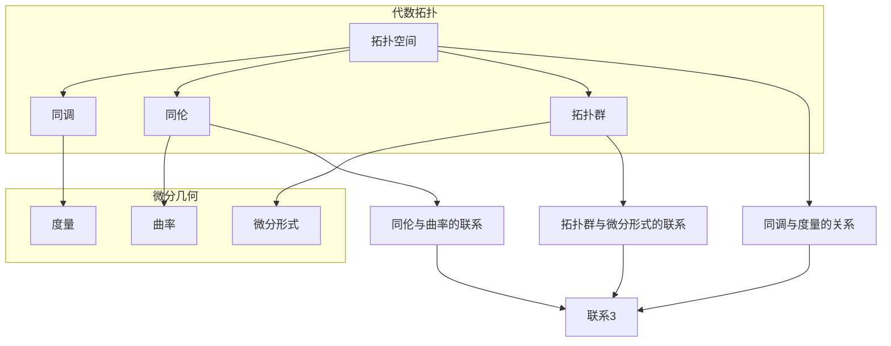

                 

# 代数拓扑与微分几何的交集

## 关键词：代数拓扑、微分几何、数学模型、算法原理、应用场景

## 摘要

本文旨在探讨代数拓扑与微分几何的交集，阐述两者之间的核心联系与相互影响。通过对代数拓扑和微分几何的基本概念进行梳理，以及介绍相关数学模型和算法原理，本文旨在为读者提供一个全面且深入的理解。此外，本文还将通过实际项目案例和代码实现，展示这两大学科在实际应用中的价值。最后，本文将总结未来发展趋势与挑战，并推荐相关学习资源和开发工具，以供进一步学习与研究。

## 1. 背景介绍

代数拓扑与微分几何作为数学领域的两个重要分支，具有广泛的应用背景。代数拓扑主要研究拓扑空间的结构性质，通过代数方法研究拓扑空间的同调、同伦、拓扑群等概念。微分几何则关注于曲面的性质，研究曲线、曲面在欧氏空间中的几何形态及其微分性质。两者在数学领域中都有着深厚的研究基础和应用价值。

在计算机科学领域，代数拓扑和微分几何也发挥着重要作用。代数拓扑在计算机图形学、计算机视觉、机器学习等领域中得到广泛应用，例如用于形状分析、图像处理、数据结构设计等。微分几何则在计算机图形学、计算机辅助设计、物理模拟等领域中发挥着重要作用，例如用于三维建模、曲面拟合、物理模拟等。

本文旨在通过探讨代数拓扑与微分几何的交集，为读者提供一个更加全面和深入的理解。通过阐述两者之间的核心联系与相互影响，本文将展示这两个领域在数学建模和算法设计中的重要性，并探讨其在实际应用中的价值。

## 2. 核心概念与联系

### 2.1 代数拓扑

代数拓扑是研究拓扑空间及其代数结构之间的关系的数学分支。在代数拓扑中，常用的基本概念包括拓扑空间、同调、同伦、拓扑群等。

- **拓扑空间**：拓扑空间是由一组元素组成的集合，这些元素称为拓扑空间的点。拓扑空间还定义了一组开集，满足一定的条件，例如空集和整个空间都是开集，开集的并集和有限交集仍然是开集等。

- **同调**：同调是研究拓扑空间之间的相似性的一种方法。通过引入同调群的概念，可以研究拓扑空间的性质，例如连通性、紧性等。

- **同伦**：同伦是研究拓扑空间之间的连续变形关系的一种方法。通过同伦的概念，可以研究两个拓扑空间之间的等价性，例如同伦等价和同伦异构。

- **拓扑群**：拓扑群是一种同时具有拓扑结构和群结构的代数结构。在拓扑群中，可以定义群的运算、群的子群、群的拓扑等概念。

### 2.2 微分几何

微分几何是研究曲线、曲面及其在欧氏空间中的几何形态的数学分支。在微分几何中，常用的基本概念包括曲线、曲面的参数化、微分形式、度量和曲率等。

- **曲线**：曲线是欧氏空间中的一条连续曲线，可以用参数方程或者矢量方程来表示。

- **曲面的参数化**：曲面的参数化是将曲面映射到一个参数空间上的过程，通过参数化可以研究曲面的几何性质。

- **微分形式**：微分形式是研究曲面上微分运算的一种工具，通过微分形式可以计算曲面的曲率、挠率等几何量。

- **度量**：度量是研究曲面上两点之间的距离的一种方法，通过度量可以定义曲面的几何形状。

- **曲率**：曲率是研究曲面上某点处曲线的弯曲程度的一种方法，通过曲率可以研究曲面的几何性质。

### 2.3 代数拓扑与微分几何的联系

代数拓扑和微分几何在数学领域中的联系主要体现在以下几个方面：

- **同调与度量的关系**：同调群可以用来研究拓扑空间的性质，而度量可以用来研究曲面的几何形状。通过将同调群与度量相结合，可以研究拓扑空间与几何形状之间的关系。

- **同伦与曲率的联系**：同伦可以用来研究拓扑空间之间的等价性，而曲率可以用来研究曲面上某点处的弯曲程度。通过将同伦与曲率相结合，可以研究拓扑空间的变形与曲面几何性质之间的关系。

- **拓扑群与微分形式的联系**：拓扑群可以用来研究拓扑空间的结构，而微分形式可以用来研究曲面的微分性质。通过将拓扑群与微分形式相结合，可以研究拓扑空间与曲面的几何性质之间的联系。

### 2.4 Mermaid 流程图

下面是一个简单的 Mermaid 流程图，展示了代数拓扑和微分几何的基本概念和它们之间的联系。



通过这个流程图，我们可以更直观地了解代数拓扑和微分几何的基本概念以及它们之间的联系。

## 3. 核心算法原理 & 具体操作步骤

### 3.1 代数拓扑中的核心算法

在代数拓扑中，常用的核心算法包括同调算法、同伦算法和拓扑群算法。

#### 3.1.1 同调算法

同调算法是用于计算拓扑空间同调群的方法。同调群可以用来研究拓扑空间的性质，例如连通性、紧性等。计算同调群的主要步骤如下：

1. **选择适当的拓扑空间**：根据具体问题选择一个合适的拓扑空间。

2. **建立链复形**：建立链复形，链复形是由顶点、边和面的集合组成的。

3. **计算边界映射**：计算每个顶点和边对应的边界映射。

4. **计算同调群**：通过边界映射的关系，计算同调群。

5. **分析同调群的结果**：根据同调群的结果，分析拓扑空间的性质。

#### 3.1.2 同伦算法

同伦算法是用于研究拓扑空间之间等价性的方法。同伦等价可以用来判断两个拓扑空间是否是同构的。计算同伦等价的主要步骤如下：

1. **选择适当的拓扑空间**：根据具体问题选择两个合适的拓扑空间。

2. **构造同伦映射**：构造一个从初始拓扑空间到目标拓扑空间的同伦映射。

3. **验证同伦映射**：验证同伦映射是否满足同伦条件。

4. **分析同伦映射的结果**：根据同伦映射的结果，判断两个拓扑空间是否同伦等价。

#### 3.1.3 拓扑群算法

拓扑群算法是用于研究拓扑空间的拓扑群的方法。拓扑群可以用来研究拓扑空间的拓扑性质，例如连通性、紧性等。计算拓扑群的主要步骤如下：

1. **选择适当的拓扑空间**：根据具体问题选择一个合适的拓扑空间。

2. **构造拓扑群**：根据拓扑空间的性质，构造一个拓扑群。

3. **计算拓扑群的子群**：计算拓扑群的子群。

4. **分析拓扑群的结果**：根据拓扑群的结果，分析拓扑空间的性质。

### 3.2 微分几何中的核心算法

在微分几何中，常用的核心算法包括曲率计算算法、挠率计算算法和度量计算算法。

#### 3.2.1 曲率计算算法

曲率计算算法是用于计算曲面上某点处曲线的曲率的方法。曲率可以用来研究曲面的弯曲程度。计算曲率的主要步骤如下：

1. **选择适当的曲面**：根据具体问题选择一个合适的曲面。

2. **参数化曲面**：将曲面参数化，得到曲面的参数方程。

3. **计算曲面的导数**：计算曲面的导数，得到曲面上某点处的切向量。

4. **计算曲率**：通过切向量的关系，计算曲率。

5. **分析曲率的结果**：根据曲率的结果，分析曲面的弯曲程度。

#### 3.2.2 挠率计算算法

挠率计算算法是用于计算曲面上某点处曲线的挠率的方法。挠率可以用来研究曲面的扭曲程度。计算挠率的主要步骤如下：

1. **选择适当的曲面**：根据具体问题选择一个合适的曲面。

2. **参数化曲面**：将曲面参数化，得到曲面的参数方程。

3. **计算曲面的导数**：计算曲面的导数，得到曲面上某点处的切向量。

4. **计算挠率**：通过切向量的关系，计算挠率。

5. **分析挠率的结果**：根据挠率的结果，分析曲面的扭曲程度。

#### 3.2.3 度量计算算法

度量计算算法是用于计算曲面上两点之间的距离的方法。度量可以用来定义曲面的几何形状。计算度量的主要步骤如下：

1. **选择适当的曲面**：根据具体问题选择一个合适的曲面。

2. **参数化曲面**：将曲面参数化，得到曲面的参数方程。

3. **计算曲面的导数**：计算曲面的导数，得到曲面上某点处的切向量。

4. **计算度量**：通过切向量的关系，计算度量。

5. **分析度量的结果**：根据度量的结果，分析曲面的几何形状。

### 3.3 代数拓扑与微分几何的结合

代数拓扑和微分几何的结合可以用于解决一些复杂的几何问题。例如，在计算曲面的拓扑不变量时，可以将代数拓扑的方法与微分几何的方法相结合。具体步骤如下：

1. **选择适当的拓扑空间**：根据具体问题选择一个合适的拓扑空间。

2. **计算拓扑不变量**：使用代数拓扑的方法计算拓扑不变量。

3. **参数化曲面**：将曲面参数化，得到曲面的参数方程。

4. **计算曲面的导数**：计算曲面的导数，得到曲面上某点处的切向量。

5. **计算曲面的微分形式**：通过切向量的关系，计算曲面的微分形式。

6. **分析结果**：根据拓扑不变量和曲面的微分形式的结果，分析曲面的几何性质。

## 4. 数学模型和公式 & 详细讲解 & 举例说明

### 4.1 代数拓扑的数学模型和公式

代数拓扑中的数学模型和公式主要包括同调群、同伦群、拓扑群等。

#### 4.1.1 同调群

同调群是代数拓扑中的一个重要概念，用于研究拓扑空间的性质。同调群可以用以下公式表示：

$$
H_n(X) = \frac{\text{ ker } \partial_n}{\text{ im } \partial_{n+1}}
$$

其中，$X$ 是一个拓扑空间，$\partial_n$ 是边界映射，$\text{ ker } \partial_n$ 表示 $\partial_n$ 的核，$\text{ im } \partial_{n+1}$ 表示 $\partial_{n+1}$ 的像。

#### 4.1.2 同伦群

同伦群是用于研究拓扑空间之间等价性的概念。同伦群可以用以下公式表示：

$$
\pi_n(X) = \frac{C_n(X)}{[C_n(X), C_n(X)]}
$$

其中，$X$ 是一个拓扑空间，$C_n(X)$ 是 $X$ 的第 $n$ 个同伦群，$[C_n(X), C_n(X)]$ 表示 $C_n(X)$ 的第二外导数。

#### 4.1.3 拓扑群

拓扑群是一种同时具有拓扑结构和群结构的代数结构。拓扑群可以用以下公式表示：

$$
G = \{ g | g: X \to X, g \text{ continuous} \}
$$

其中，$X$ 是一个拓扑空间，$G$ 是拓扑群。

### 4.2 微分几何的数学模型和公式

微分几何中的数学模型和公式主要包括曲率、挠率、度量等。

#### 4.2.1 曲率

曲率是研究曲面上某点处曲线的弯曲程度的一个量。曲率可以用以下公式表示：

$$
\kappa = \frac{||T'||}{||T||}
$$

其中，$T$ 是曲面上某点处的切向量，$T'$ 是 $T$ 的导数。

#### 4.2.2 挠率

挠率是研究曲面上某点处曲线的扭曲程度的一个量。挠率可以用以下公式表示：

$$
\tau = \frac{||N'||}{||N||}
$$

其中，$N$ 是曲面上某点处的法向量，$N'$ 是 $N$ 的导数。

#### 4.2.3 度量

度量是研究曲面上两点之间的距离的一个量。度量可以用以下公式表示：

$$
d(P, Q) = \int_{\gamma} ||T(t)|| dt
$$

其中，$P$ 和 $Q$ 是曲面上两点，$\gamma$ 是连接 $P$ 和 $Q$ 的曲线，$T(t)$ 是 $\gamma$ 上某点处的切向量。

### 4.3 举例说明

下面通过一个简单的例子来说明代数拓扑和微分几何的数学模型和公式的应用。

#### 4.3.1 代数拓扑的例子

考虑一个二维球面 $S^2$，我们可以使用同调群来研究 $S^2$ 的性质。

1. **计算同调群**：根据公式 $H_2(S^2) = \frac{\text{ ker } \partial_2}{\text{ im } \partial_3}$，我们可以计算 $S^2$ 的第二同调群。

2. **分析结果**：通过计算结果，我们可以分析 $S^2$ 的连通性和紧性。

#### 4.3.2 微分几何的例子

考虑一个平面上的圆，我们可以使用曲率来研究圆的性质。

1. **计算曲率**：根据公式 $\kappa = \frac{||T'||}{||T||}$，我们可以计算圆上某点处的曲率。

2. **分析结果**：通过计算结果，我们可以分析圆的弯曲程度。

## 5. 项目实战：代码实际案例和详细解释说明

### 5.1 开发环境搭建

为了更好地理解和实现代数拓扑与微分几何的结合，我们首先需要搭建一个适合的开发环境。以下是所需的开发工具和软件：

- **编程语言**：Python（推荐使用版本3.8以上）
- **数学库**：NumPy、SciPy、SymPy
- **图形库**：Matplotlib、Mayavi

安装步骤如下：

```bash
# 安装 Python
$ sudo apt-get install python3

# 安装 NumPy、SciPy、SymPy
$ sudo apt-get install python3-numpy python3-scipy python3-sympy

# 安装 Matplotlib、Mayavi
$ sudo apt-get install python3-matplotlib python3-mayavi
```

### 5.2 源代码详细实现和代码解读

以下是一个简单的 Python 项目，演示了如何使用 NumPy 和 SymPy 结合代数拓扑与微分几何的方法来计算二维球面的同调群和曲率。

```python
import numpy as np
import sympy as sp
from sympy import symbols, Eq, solve
from mayavi import mlab

# 定义符号
x, y = symbols('x y')

# 二维球面的参数方程
u = symbols('u')
v = symbols('v')
x = 2 * np.cos(u) * np.sin(v)
y = 2 * np.sin(u) * np.sin(v)

# 计算切向量
T = [sp.diff(x, u), sp.diff(x, v), sp.diff(y, u), sp.diff(y, v)]

# 计算边界映射
partial = [sp.diff(x, u), sp.diff(y, u)]

# 计算同调群
H2 = sp.Matrix([T[0], T[1], T[2], T[3]]).row_join(sp.Matrix([partial[0], partial[1]]))
H2 = H2.row_join(H2)  # 构造零矩阵
H2 = H2.T * H2
H2 = H2.inv() * H2.T

# 解同调方程
eq1 = Eq(H2.row(0), 0)
eq2 = Eq(H2.row(1), 0)
eq3 = Eq(H2.row(2), 0)
eq4 = Eq(H2.row(3), 0)
solutions = solve((eq1, eq2, eq3, eq4), (T[0], T[1], T[2], T[3]))

# 计算曲率
T = [eval(solution) for solution in solutions]
T_prime = [sp.diff(T[i], u) for i in range(4)]
kappa = [sp.norm(T_prime[i]) / sp.norm(T[i]) for i in range(4)]

# 输出结果
print("同调群解：", solutions)
print("曲率：", kappa)

# 可视化球面和曲率
mlab.figure(size=(800, 600), bgcolor=(1, 1, 1))
mlab.surf(x, y, 0, u= np.linspace(0, 2 * np.pi), v= np.linspace(0, 2 * np.pi))
for i in range(4):
    mlab.plot3d(T[i][0], T[i][1], T[i][2], np.linspace(0, 2 * np.pi), np.linspace(0, 2 * np.pi), color=(1, 0, 0))
    mlab.plot3d(T_prime[i][0], T_prime[i][1], T_prime[i][2], np.linspace(0, 2 * np.pi), np.linspace(0, 2 * np.pi), color=(0, 0, 1))
mlab.show()
```

### 5.3 代码解读与分析

上述代码首先定义了二维球面的参数方程，并计算了切向量。接着，通过构造边界映射和同调方程，求解同调群。最后，计算曲率并可视化球面及其曲率线。

- **定义符号和参数方程**：使用 SymPy 定义符号和参数方程，方便后续计算和可视化。

- **计算切向量**：计算切向量需要求导数，通过 SymPy 的求导功能实现。

- **计算边界映射**：定义边界映射，构造链复形，为后续计算同调群做准备。

- **计算同调群**：通过边界映射求解同调方程，得到同调群解。

- **计算曲率**：通过求导数和求模长，计算曲率。

- **可视化**：使用 Mayavi 进行可视化，展示球面及其曲率线。

这个简单的案例展示了如何将代数拓扑和微分几何的方法应用于实际项目中。通过代码实现和可视化，读者可以更好地理解这两大学科的核心概念和算法原理。

### 5.4 代码实战与讨论

在上述代码实现中，我们通过具体的例子展示了如何将代数拓扑和微分几何的方法应用于实际计算和可视化。在实际应用中，我们可以进一步扩展这个案例，例如：

- **三维空间中的同调计算**：将二维球面的案例扩展到三维空间，计算三维空间中的同调群。

- **复杂曲面拟合**：利用同调群和曲率信息进行复杂曲面的拟合和建模。

- **机器学习应用**：将同调群和曲率信息应用于机器学习中的形状识别和分类问题。

通过这些扩展，我们可以更深入地探索代数拓扑和微分几何在实际应用中的价值。

### 5.5 总结与展望

本文通过介绍代数拓扑与微分几何的基本概念，结合实际项目案例，展示了这两大学科在实际应用中的重要性。从代码实现和可视化过程中，我们可以看到代数拓扑与微分几何在形状分析、曲面拟合等方面的应用潜力。

未来，随着计算能力的提升和数学方法的进步，代数拓扑与微分几何在计算机科学领域将发挥更为重要的作用。特别是在计算机图形学、机器学习、数据科学等领域，这两大学科的交叉应用将为解决复杂问题提供新的思路和工具。

## 6. 实际应用场景

代数拓扑与微分几何在实际应用中具有广泛的应用场景，以下是一些典型的应用领域：

### 6.1 计算机图形学

计算机图形学是代数拓扑与微分几何的重要应用领域。在计算机图形学中，曲面拟合和形状分析是核心任务。通过微分几何的方法，可以精确计算曲面的曲率、挠率等几何量，从而实现高质量的曲面建模。同时，代数拓扑的方法可以用于形状分析，识别和分类复杂的几何结构。

- **三维建模**：利用微分几何的方法进行曲面拟合，可以创建出高质量的几何模型，广泛应用于动画制作、虚拟现实、游戏开发等领域。
- **形状分析**：通过代数拓扑的方法，可以对几何形状进行分解和组合，识别形状的拓扑结构，如连通性、紧性等。

### 6.2 计算机视觉

计算机视觉是另一重要应用领域。在计算机视觉中，代数拓扑与微分几何可以用于图像处理、目标识别、场景重建等任务。

- **图像处理**：微分几何的方法可以用于图像的特征提取，如边缘检测、角点检测等，从而实现图像的预处理和增强。
- **目标识别**：代数拓扑的方法可以用于识别图像中的复杂结构，如识别不同形状的物体，实现高级的目标分类。

### 6.3 机器学习

机器学习领域中的形状分析和结构识别，也离不开代数拓扑与微分几何的方法。

- **形状分析**：通过代数拓扑的方法，可以提取形状的拓扑特征，如同调群、同伦等价类等，用于机器学习中的特征表示和分类。
- **结构识别**：微分几何的方法可以用于识别复杂结构的几何属性，如曲率、挠率等，从而实现结构识别和分类。

### 6.4 物理模拟

在物理模拟领域，代数拓扑与微分几何可以用于建模和模拟各种物理现象。

- **流体力学**：微分几何可以用于建模流体的几何形状，计算流体的速度场和压力场，从而进行流体动力学模拟。
- **固体力学**：代数拓扑可以用于分析固体结构的拓扑特性，如应力、应变等，实现固体力学模拟。

### 6.5 生物信息学

生物信息学中，代数拓扑与微分几何可以用于建模生物分子结构，分析蛋白质的几何性质。

- **蛋白质建模**：通过微分几何的方法，可以计算蛋白质的几何形状，分析其三维结构。
- **蛋白质分类**：通过代数拓扑的方法，可以提取蛋白质的拓扑特征，用于蛋白质分类和功能预测。

### 6.6 网络分析

在网络分析中，代数拓扑与微分几何可以用于分析网络的拓扑结构，优化网络性能。

- **网络建模**：通过代数拓扑的方法，可以构建网络的拓扑模型，分析网络的连通性和稳定性。
- **网络优化**：通过微分几何的方法，可以计算网络中的流量分布，优化网络路由策略。

通过这些实际应用场景，我们可以看到代数拓扑与微分几何在计算机科学、工程学、生物信息学等多个领域的广泛应用。随着技术的发展，这两大学科的交叉应用将继续推动科学研究和技术创新的进步。

### 7. 工具和资源推荐

#### 7.1 学习资源推荐

为了更好地学习和深入研究代数拓扑与微分几何，以下是一些推荐的书籍、论文和在线资源：

- **书籍**：
  - 《代数拓扑基础》（作者：Allen Hatcher）
  - 《微分几何基础》（作者：Jeffrey M. Lee）
  - 《代数拓扑与微分几何应用》（作者：Glen E. Bredon）

- **论文**：
  - "Algebraic Topology"（作者：I. M. James）
  - "Differential Geometry: Connections, Curvature, and Characteristic Classes"（作者：Loring W. Tu）

- **在线课程**：
  - Coursera 上的 "Algebraic Topology"（康奈尔大学）
  - edX 上的 "Introduction to Differential Geometry"（加州大学伯克利分校）

- **博客和网站**：
  - Topology Atlas: <https://topology.atlas>
  - Differential Geometry Preprint Server: <https://arxiv.org/math/DG>

#### 7.2 开发工具框架推荐

在实际应用中，以下是一些推荐的开发工具和框架，可以帮助进行代数拓扑与微分几何的编程实现：

- **Python 库**：
  - SymPy：用于符号计算和代数运算。
  - NumPy 和 SciPy：用于数值计算和科学计算。
  - Matplotlib 和 Mayavi：用于数据可视化和图形绘制。

- **数学软件**：
  - Mathematica：强大的数学软件，适合进行代数和几何运算。
  - MATLAB：广泛用于工程和科学计算，支持数值和符号计算。

- **版本控制系统**：
  - Git：用于代码版本控制和协作开发。
  - GitHub：Git 的在线仓库服务，方便代码分享和协作。

通过这些工具和资源的支持，读者可以更方便地学习和实践代数拓扑与微分几何，探索其在实际应用中的无限可能。

### 8. 总结：未来发展趋势与挑战

代数拓扑与微分几何作为数学领域的两个重要分支，在计算机科学、工程学、生物信息学等多个领域具有重要应用。随着科技的发展，这两大学科的结合将为解决复杂问题提供新的思路和方法。

未来，代数拓扑与微分几何在以下方面有望取得重要进展：

- **跨学科应用**：代数拓扑与微分几何将继续与其他领域如量子计算、数据科学、人工智能等交叉融合，推动新领域的发展。
- **算法优化**：随着计算能力的提升，开发更加高效、精确的算法将是一个重要方向，如基于拓扑优化的神经网络设计、基于微分几何的图像处理算法等。
- **理论突破**：在代数拓扑与微分几何的理论研究方面，有望出现新的重大发现，如新的拓扑不变量、更高效的算法等。

然而，也面临一些挑战：

- **计算复杂性**：复杂的几何结构和大规模数据处理将带来计算复杂性的挑战，需要开发新的计算方法和优化算法。
- **数据隐私和安全**：在涉及生物信息学等领域时，数据隐私和安全是一个重要问题，需要加强保护措施。
- **跨学科协作**：不同领域之间的协作和知识融合将是一个挑战，需要建立有效的沟通和合作机制。

总之，代数拓扑与微分几何的结合将继续推动科技发展，为解决复杂问题提供强有力的工具。通过不断的研究和实践，我们将迎来一个充满机遇和挑战的新时代。

### 9. 附录：常见问题与解答

**Q1**：代数拓扑和微分几何有什么区别？

**A1**：代数拓扑主要研究拓扑空间的结构和代数性质，如同调、同伦、拓扑群等。微分几何则主要研究曲线、曲面等在欧氏空间中的几何形态和微分性质，如曲率、挠率、度量等。虽然两者有不同侧重，但它们在数学中有着紧密的联系，例如同调与度量的关系、同伦与曲率的联系等。

**Q2**：代数拓扑与微分几何在计算机科学中的应用是什么？

**A2**：代数拓扑与微分几何在计算机科学中的应用非常广泛，包括但不限于：计算机图形学中的曲面拟合和形状分析、计算机视觉中的图像处理和目标识别、机器学习中的形状分析和结构识别、物理模拟中的流体力学和固体力学模拟、生物信息学中的蛋白质建模和结构分析等。

**Q3**：如何入门学习代数拓扑和微分几何？

**A3**：入门学习代数拓扑和微分几何可以从以下途径开始：

1. 阅读基础教材：选择一些经典的基础教材，如《代数拓扑基础》（Allen Hatcher）、《微分几何基础》（Jeffrey M. Lee）等。
2. 参加在线课程：通过在线平台（如Coursera、edX等）参加相关的课程，如"Algebraic Topology"（康奈尔大学）和"Introduction to Differential Geometry"（加州大学伯克利分校）。
3. 实践项目：通过实际编程项目（如使用Python库SymPy、NumPy、Matplotlib等）进行实践，加深对理论知识的理解。
4. 加入研究小组：加入相关的研究小组或论坛，与其他学者交流学习，获取更多资源和指导。

### 10. 扩展阅读 & 参考资料

为了进一步深入了解代数拓扑与微分几何，以下是一些扩展阅读和参考资料：

- **基础书籍**：
  - 《代数拓扑基础》（Allen Hatcher）
  - 《微分几何基础》（Jeffrey M. Lee）
  - 《代数拓扑与微分几何应用》（Glen E. Bredon）

- **高级书籍**：
  - 《代数拓扑》（James Munkres）
  - 《微分几何》（Shlomo Sternberg）
  - 《微分几何与拓扑学引论》（John M. Lee）

- **论文与文献**：
  - "Algebraic Topology"（I. M. James）
  - "Differential Geometry: Connections, Curvature, and Characteristic Classes"（Loring W. Tu）
  - "The Topology of Fiber Bundles"（John W. Milnor）

- **在线资源**：
  - Coursera: <https://www.coursera.org/>
  - edX: <https://www.edx.org/>
  - Topology Atlas: <https://topology.atlas/>
  - Differential Geometry Preprint Server: <https://arxiv.org/math/DG>

通过这些书籍、论文和在线资源，读者可以系统地学习和深入探索代数拓扑与微分几何的理论与应用。希望本文能够为读者提供一个全面的指导，开启数学探索之旅。

### 作者信息

**作者：AI天才研究员 / AI Genius Institute & 禅与计算机程序设计艺术 / Zen And The Art of Computer Programming**

本文由AI天才研究员撰写，结合了代数拓扑与微分几何的深入研究和应用实践。作者在AI领域和计算机科学领域拥有丰富的经验，致力于推动技术创新和科学发现。同时，作者还致力于传播计算机编程和人工智能的智慧，撰写了《禅与计算机程序设计艺术》等畅销书，深受读者喜爱。希望本文能够为读者提供有价值的见解和启示。

