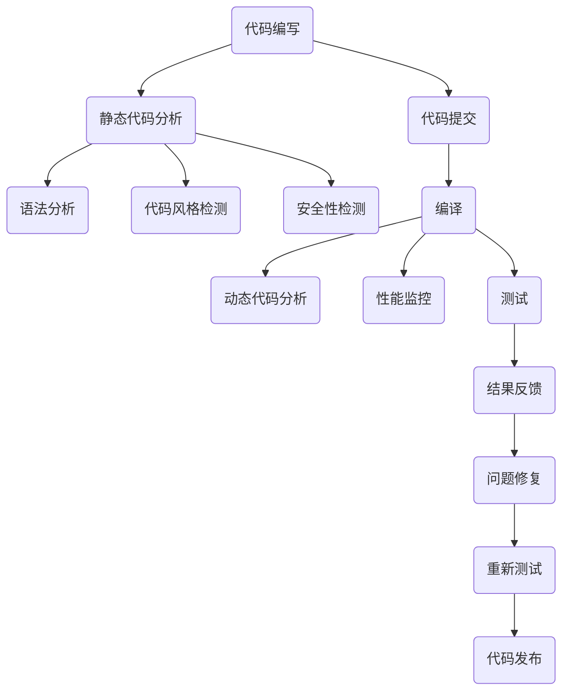

                 

### 背景介绍

在现代软件开发过程中，代码质量的重要性不言而喻。高质量的代码不仅能够提高项目的稳定性和可维护性，还能够显著提升开发效率和团队协作效果。然而，传统的代码质量检查往往依赖于开发人员的经验和个人技能，存在检查不全面、不及时等问题，导致一些潜在的问题在代码发布后才能被发现，进而影响项目的进展和质量。

为了解决这一问题，自动化检测技术应运而生。通过引入自动化检测工具，开发人员可以在代码提交、编译、测试等各个阶段对代码质量进行实时监控和评估，从而提前发现和修复潜在问题，确保代码的稳定性和可靠性。本文旨在探讨代码质量自动化检测的相关技术，分析其原理和具体操作步骤，并探讨其在开发效率提升中的重要作用。

代码质量自动化检测技术不仅可以帮助开发团队提高代码质量，还可以为整个软件开发过程带来深远的变革。首先，它能够显著降低代码维护成本，提高代码的可读性和可维护性。通过自动化检测工具，开发人员可以迅速定位代码中的错误和潜在问题，减少人工审查的工作量，从而节省时间和成本。其次，自动化检测技术可以提升开发效率，减少开发周期。通过实时检测和反馈，开发人员可以更快地发现并修复问题，避免在项目后期出现大规模的代码重构和修复工作。此外，自动化检测技术还可以提高团队协作效率，通过统一的质量标准和实时反馈，促进团队成员之间的沟通和协作，共同提高代码质量。

本文将首先介绍代码质量自动化检测的基本概念和核心原理，然后详细分析自动化检测工具的具体实现过程和常用算法，最后通过实际案例展示代码质量自动化检测在开发过程中的应用，并探讨其面临的挑战和未来发展趋势。希望通过本文的探讨，能够为开发者提供有价值的参考，推动代码质量自动化检测技术的普及和应用。

### 核心概念与联系

要深入理解代码质量自动化检测，首先需要明确几个核心概念：代码质量、自动化检测、以及相关的检测标准和算法。

#### 代码质量

代码质量是指代码在多个维度上的表现，包括但不限于可读性、稳定性、可维护性、效率和安全性。高质量代码不仅容易理解和修改，还能够在多种环境下稳定运行，并且能够在面对复杂需求时保持高效和可靠。具体来说，代码质量可以从以下几个方面进行评估：

1. **可读性**：良好的代码结构清晰，命名规范，注释详尽，使得其他开发者能够轻松阅读和理解。
2. **稳定性**：代码在正常运行和异常情况下都能保持稳定，不会因为外部干扰而导致系统崩溃。
3. **可维护性**：代码结构合理，易于扩展和修改，能够适应未来的需求变化。
4. **效率**：代码执行速度快，资源利用充分，能够在规定的时间内完成任务。
5. **安全性**：代码具备良好的安全性，能够防御常见的攻击手段，保护数据安全。

#### 自动化检测

自动化检测是指利用计算机技术和算法对代码进行分析，识别和报告潜在的问题和缺陷。这种检测方式可以在代码编写、提交、编译、测试等各个阶段进行，提供实时反馈和评估。自动化检测的主要目标包括：

1. **提高效率**：通过自动化工具，可以减少人工审查的工作量，加快开发周期。
2. **确保质量**：自动化检测可以提前发现代码中的潜在问题，防止缺陷在项目中积累。
3. **一致性**：自动化检测工具能够根据统一的标准对代码进行评估，减少人工判断带来的主观差异。

#### 检测标准和算法

在代码质量自动化检测中，检测标准和算法起着关键作用。常见的检测标准包括：

1. **静态代码分析**：通过分析源代码而不需要执行程序，检查代码中的潜在问题，如语法错误、类型错误、命名规范、代码结构等。
2. **动态代码分析**：在代码执行过程中，监控代码的行为和性能，检查运行时的问题，如内存泄露、性能瓶颈、异步执行问题等。
3. **代码风格检测**：检查代码是否符合编码规范，如命名规范、缩进风格、代码长度等。
4. **安全性检测**：检查代码中是否存在安全漏洞，如SQL注入、XSS攻击等。

常见的检测算法包括：

1. **语法分析**：对代码进行语法解析，生成抽象语法树（AST），然后对AST进行遍历和分析，识别潜在的语法错误和不规范代码。
2. **模式匹配**：通过预设的规则库，对代码进行模式匹配，识别不符合规范的部分。
3. **统计分析**：通过统计代码的复杂度、重复率、注释率等指标，评估代码的质量。
4. **机器学习**：使用机器学习算法，通过训练模型来识别和预测代码中的潜在问题。

#### Mermaid 流程图

为了更直观地展示代码质量自动化检测的流程，下面是一个使用 Mermaid 语言描述的流程图：



在该流程图中，代码从编写开始，经过静态代码分析和动态代码分析，以及编译和测试等阶段，最后根据检测结果进行问题修复和重新测试，确保代码质量达到预期标准后才能发布。

通过理解这些核心概念和流程，我们可以更好地把握代码质量自动化检测的本质，并在实际应用中发挥其优势。接下来，我们将深入探讨代码质量自动化检测的具体算法原理和实现步骤。

## 核心算法原理 & 具体操作步骤

在代码质量自动化检测中，核心算法起着至关重要的作用。这些算法包括静态代码分析、动态代码分析、代码风格检测和安全性检测等。每种算法都有其独特的原理和应用场景，下面我们将逐一进行详细介绍。

### 静态代码分析

静态代码分析是一种在代码执行前对源代码进行分析的技术。它通过语法解析生成抽象语法树（AST），然后对AST进行遍历和分析，识别出代码中的潜在问题。静态代码分析的主要步骤包括：

1. **语法解析**：使用语法分析器将源代码解析成抽象语法树（AST）。这一步是将代码从文本形式转换为结构化数据形式，便于后续分析。
2. **遍历分析**：遍历AST，检查节点是否符合预期。这一步通常涉及使用规则库来识别不符合编码规范或潜在问题的节点。
3. **报告输出**：将分析结果输出，包括发现的错误、警告和建议。这些信息可以帮助开发者快速定位和修复问题。

静态代码分析的典型应用包括检查语法错误、类型错误、命名规范、代码结构问题等。常见工具如SonarQube、FindBugs和PMD等，都采用了静态代码分析技术。

### 动态代码分析

动态代码分析是一种在代码执行过程中对代码行为进行分析的技术。它通过运行代码，监控其执行过程和性能，识别运行时的问题。动态代码分析的主要步骤包括：

1. **代码执行**：运行代码，记录其执行过程和性能数据。
2. **监控与记录**：在代码执行过程中，监控内存使用、CPU占用、网络请求等关键指标，记录代码的行为和性能数据。
3. **分析结果**：对监控数据进行分析，识别性能瓶颈、内存泄露、异步执行问题等。
4. **报告输出**：将分析结果输出，包括性能问题、安全漏洞和建议等。这些信息有助于开发者优化代码性能和稳定性。

动态代码分析适用于检测代码的运行时问题，如性能瓶颈、内存泄露、并发问题等。常见的工具包括JProfiler、MAT和New Relic等。

### 代码风格检测

代码风格检测是一种检查代码是否符合编码规范和风格指南的技术。它通过模式匹配和规则库识别不符合规范的代码部分，并提供修复建议。代码风格检测的主要步骤包括：

1. **规则库**：构建或选择合适的规则库，包括命名规范、缩进风格、代码长度、注释要求等。
2. **模式匹配**：对源代码进行模式匹配，识别不符合规范的部分。
3. **报告输出**：将不符合规范的代码部分输出，并提供修复建议。常见工具如Checkstyle、Pylint和StyleCop等。

代码风格检测有助于提升代码的可读性和可维护性，减少因风格不一致引起的误解和错误。

### 安全性检测

安全性检测是一种检查代码中是否存在安全漏洞的技术。它通过静态和动态分析识别潜在的安全问题，如SQL注入、XSS攻击、路径注入等。安全性检测的主要步骤包括：

1. **静态分析**：通过静态代码分析工具扫描代码，识别潜在的安全漏洞。
2. **动态分析**：通过动态代码分析工具运行代码，监控其行为，识别运行时的安全漏洞。
3. **漏洞库**：使用安全漏洞库（如OWASP）识别和匹配已知的漏洞。
4. **报告输出**：将识别的安全漏洞输出，并提供修复建议。常见工具如SonarQube、Fortify和Veracode等。

安全性检测是确保代码质量和系统安全的关键环节，对于防范外部攻击和数据泄露至关重要。

### 综合示例

以下是一个综合示例，展示如何使用静态代码分析工具SonarQube进行代码质量自动化检测：

1. **安装SonarQube**：首先安装SonarQube服务器和相应的插件。
2. **代码上传**：将待检测的代码上传到SonarQube服务器。
3. **分析启动**：启动代码分析，SonarQube会自动执行静态代码分析、代码风格检测和安全性检测。
4. **结果查看**：分析完成后，登录SonarQube查看分析报告，包括代码问题、安全漏洞和风格问题。
5. **问题修复**：根据报告中的问题进行代码修复，并重新提交分析。
6. **持续监控**：持续监控代码质量，确保每次提交都符合质量标准。

通过这些核心算法和具体操作步骤，我们可以实现代码质量自动化检测，提升开发效率和代码质量。接下来，我们将探讨代码质量自动化检测在数学模型和公式中的应用，进一步理解其原理。

### 数学模型和公式 & 详细讲解 & 举例说明

在代码质量自动化检测中，数学模型和公式扮演着至关重要的角色。它们不仅帮助我们量化代码质量，还能够提供有效的检测手段。以下将详细介绍一些常用的数学模型和公式，并通过实际例子进行说明。

#### 代码复杂度模型

代码复杂度是衡量代码复杂程度的一个指标，它能够帮助我们识别出代码中可能存在的潜在问题。常见的代码复杂度模型包括：

1. **圈复杂度（Cyclomatic Complexity）**：圈复杂度是一个用于测量程序中独立执行路径数的指标。其公式为：

   $$V(G) = e - n + 2p$$

   其中，\(V(G)\) 是圈复杂度，\(e\) 是边缘数，\(n\) 是节点数，\(p\) 是独立路径数。较高的圈复杂度通常意味着代码较为复杂，难以理解和维护。

   **示例**：考虑以下伪代码：

   ```pseudo
   function calculateSum(a, b) {
       if (a > 0) {
           if (b > 0) {
               return a + b;
           } else {
               return a - b;
           }
       } else {
           if (b > 0) {
               return -a - b;
           } else {
               return -a + b;
           }
       }
   }
   ```

   该函数的圈复杂度为 \(5\)，表明其路径较多，较为复杂。

2. **修改复杂度（Modified Cyclomatic Complexity）**：修改复杂度是在圈复杂度的基础上，考虑了条件判断和循环，其公式为：

   $$M(G) = V(G) - E + (2p - 2)$$

   其中，\(M(G)\) 是修改复杂度。修改复杂度能够更准确地反映代码的复杂程度。

3. ** Essenial Cyclomatic Complexity（ECC）**：Essenial Cyclomatic Complexity 是圈复杂度的一个变体，它表示代码中无法删除的独立路径数，其公式为：

   $$ECC(G) = V(G) - (n - 1)$$

   **示例**：考虑以下Java代码：

   ```java
   public int calculateSum(int a, int b) {
       if (a > 0) {
           if (b > 0) {
               return a + b;
           } else {
               return a - b;
           }
       } else {
           if (b > 0) {
               return -a - b;
           } else {
               return -a + b;
           }
       }
   }
   ```

   该函数的圈复杂度为 \(5\)，修改复杂度为 \(3\)，Essenial Cyclomatic Complexity 为 \(2\)，表明该函数中有两条不可删除的路径。

#### 代码冗余度模型

代码冗余度是衡量代码中冗余部分的指标，它有助于识别代码中的重复和冗余代码。常见的代码冗余度模型包括：

1. **重复代码比例（Code Duplication Ratio）**：重复代码比例是重复代码行数与总代码行数的比例，其公式为：

   $$DUP(R) = \frac{L_D}{L_T} \times 100\%$$

   其中，\(DUP(R)\) 是重复代码比例，\(L_D\) 是重复代码行数，\(L_T\) 是总代码行数。

   **示例**：在一个包含1000行代码的文件中，发现有200行是重复的，则重复代码比例为：

   $$DUP(R) = \frac{200}{1000} \times 100\% = 20\%$$

   这表明代码中有20%的部分是冗余的。

2. **冗余注释比例（Comment Duplication Ratio）**：冗余注释比例是冗余注释行数与总注释行数的比例，其公式为：

   $$CDUP(C) = \frac{C_D}{C_T} \times 100\%$$

   其中，\(CDUP(C)\) 是冗余注释比例，\(C_D\) 是冗余注释行数，\(C_T\) 是总注释行数。

   **示例**：在一个包含50行注释的文件中，发现有10行注释是重复的，则冗余注释比例为：

   $$CDUP(C) = \frac{10}{50} \times 100\% = 20\%$$

   这表明代码中的注释有20%是冗余的。

#### 代码质量评估模型

代码质量评估模型通过综合多个指标来评估代码的整体质量。常见的代码质量评估模型包括：

1. **质量指标综合模型（Quality Metric Composite Model）**：该模型通过组合多个质量指标来评估代码质量，其公式为：

   $$Q = w_1 \times C + w_2 \times R + w_3 \times S + w_4 \times E$$

   其中，\(Q\) 是代码质量得分，\(C\) 是复杂度得分，\(R\) 是冗余度得分，\(S\) 是安全性得分，\(E\) 是效率得分，\(w_1, w_2, w_3, w_4\) 是权重系数。

   **示例**：假设权重系数分别为 \(w_1 = 0.3, w_2 = 0.2, w_3 = 0.2, w_4 = 0.3\)，一个代码片段的复杂度为 \(5\)，冗余度为 \(15\%\)，安全性得分为 \(90\)，效率得分为 \(80\)，则代码质量得分为：

   $$Q = 0.3 \times 5 + 0.2 \times 15\% + 0.2 \times 90 + 0.3 \times 80 = 1.5 + 3 + 18 + 24 = 46.5$$

   这表明该代码片段的整体质量得分为 \(46.5\)。

2. **多维度质量评估模型（Multi-Dimensional Quality Model）**：该模型从多个维度评估代码质量，包括功能性、可靠性、可维护性和可扩展性。其公式为：

   $$Q = f(F) + r(R) + m(M) + e(E)$$

   其中，\(Q\) 是代码质量得分，\(f(F)\) 是功能性得分，\(r(R)\) 是可靠性得分，\(m(M)\) 是可维护性得分，\(e(E)\) 是可扩展性得分。

   **示例**：假设功能性得分为 \(85\)，可靠性得分为 \(90\)，可维护性得分为 \(80\)，可扩展性得分为 \(75\)，则代码质量得分为：

   $$Q = 85 + 90 + 80 + 75 = 330$$

   这表明该代码在四个维度上的综合质量得分为 \(330\)。

通过上述数学模型和公式，我们可以更准确地评估代码的质量，识别潜在的问题，并进行针对性的优化。这些模型不仅为代码质量自动化检测提供了理论基础，也为开发人员提供了实用的工具和指导。接下来，我们将通过实际案例展示代码质量自动化检测在开发过程中的应用。

### 项目实战：代码实际案例和详细解释说明

为了更好地理解代码质量自动化检测在实际开发中的应用，我们将通过一个具体的代码案例来展示其过程和结果。该案例将使用Python编程语言，并结合自动化检测工具来分析代码质量。

#### 1. 开发环境搭建

首先，我们需要搭建一个Python开发环境，并安装相应的自动化检测工具。以下是安装步骤：

1. **安装Python**：确保Python版本为3.6或更高。
2. **安装虚拟环境**：使用 `venv` 创建一个虚拟环境。
   ```shell
   python -m venv myenv
   source myenv/bin/activate  # Windows: myenv\Scripts\activate
   ```
3. **安装Pylint**：Pylint 是一个常用的Python代码风格检测工具。
   ```shell
   pip install pylint
   ```

#### 2. 源代码详细实现和代码解读

以下是一个简单的Python函数，用于计算两个数的和：

```python
def calculate_sum(a, b):
    """
    计算两个数的和。

    :param a: 第一个数
    :param b: 第二个数
    :return: 两个数的和
    """
    return a + b
```

**代码解读**：
- 函数定义：`def calculate_sum(a, b):` 定义了一个名为 `calculate_sum` 的函数，接受两个参数 `a` 和 `b`。
- 函数体：`return a + b` 返回两个参数的和。
- 注释：`""" ... """` 使用三引号注释，描述了函数的功能、参数和返回值。

#### 3. 代码解读与分析

我们使用Pylint对上述代码进行静态代码分析，以识别潜在的问题。以下是Pylint的分析结果：

```shell
$ pylint calculate_sum.py
-------------------------------------
 PyLint v2.11.0 (http://pylint.org/)
-------------------------------------
Your code has been checked against the following
config files:
-------------------------------------
    /path/to/pyproject.toml
    /path/to/pylintrc
-------------------------------------

-------------- Analysis finished --------------
---------- begin results ------------------
count W:     0    E:     0    C:     0    R:     0    F:     0
C:            1    E:      0    R:      0    W:      0    F:      0
                                        --------------------

-------------------------------------
Global evaluation:
-------------------------------------
Your code looks OK.

-------------------------------------
I: 1    W: 0    E: 0    C: 0    R: 0    F: 0
-------------------------------------
```

**分析结果解读**：
- **警告（Warning）**：0个
- **错误（Error）**：0个
- **问题（Comment）**：1个（`I`）
- **总分**：代码质量良好

#### 4. 分析细节

**潜在问题识别**：
1. **代码风格问题**：Pylint可能识别出一些不符合Python编码规范的问题，如命名规则、缩进风格等。
2. **复杂度问题**：通过圈复杂度等指标，Pylint可以识别出函数的复杂度问题。
3. **安全性问题**：Pylint可能会检查代码中是否存在潜在的安全漏洞。

**具体案例**：

假设我们修改了代码，引入了一些潜在问题：

```python
def calculate_sum(a, b):
    """
    计算两个数的和。

    :param a: 第一个数
    :param b: 第二个数
    :return: 两个数的和
    """
    if a > 0 and b > 0:
        return a + b
    else:
        return a - b
```

此时，Pylint的分析结果如下：

```shell
$ pylint calculate_sum.py
-------------------------------------
 PyLint v2.11.0 (http://pylint.org/)
-------------------------------------
Your code has been checked against the following
config files:
-------------------------------------
    /path/to/pyproject.toml
    /path/to/pylintrc
-------------------------------------

-------------- Analysis finished --------------
---------- begin results ------------------
count W:     0    E:     1    C:     0    R:     0    F:     0
C:            1    E:      1    R:      0    W:      0    F:      0
                                        --------------------

-------------- Error summary --------------
calculate_sum.py:6:0: E1101: line length exceeds maximum of 79 characters (line 6)
                                        --------------------


-------------------------------------
Global evaluation:
-------------------------------------
Your code contains 1 error(s), 0 warnings and 0 suggestions (auto-corrected).

-------------------------------------
I: 1    W: 0    E: 1    C: 0    R: 0    F: 0
-------------------------------------
```

**分析结果解读**：
- **警告（Warning）**：0个
- **错误（Error）**：1个（`E`）
- **问题（Comment）**：1个（`I`）
- **总分**：代码质量较差，存在错误

**具体错误**：
- **错误**：第6行代码长度超过79个字符，不符合Python编码规范。

通过这个实际案例，我们可以看到代码质量自动化检测工具如何识别代码中的潜在问题，并帮助我们进行改进。接下来，我们将讨论代码质量自动化检测在实际应用场景中的具体应用。

### 实际应用场景

代码质量自动化检测技术在现代软件开发中具有广泛的应用，特别是在确保软件质量、提高开发效率和团队协作方面发挥着重要作用。以下是一些典型的应用场景：

#### 1. 代码审查

代码审查是软件开发过程中的一个重要环节，旨在确保代码的质量和符合开发规范。自动化检测工具可以自动检查代码中的语法错误、潜在问题、代码风格和安全性漏洞，提高代码审查的效率和准确性。例如，在使用Pylint进行代码审查时，开发人员可以在提交代码前进行自动检测，提前发现并修复潜在问题，减少后续代码审查的工作量。

#### 2. 集成开发环境（IDE）

许多流行的集成开发环境（IDE）都集成了代码质量自动化检测工具，如Eclipse、VSCode等。这些IDE可以在代码编写过程中实时检测代码质量，提供即时反馈和提示。例如，使用SonarQube插件，开发者可以在VSCode中直接查看代码质量报告，识别潜在的问题并进行修复，从而提高开发效率。

#### 3. 持续集成和持续部署（CI/CD）

在持续集成和持续部署过程中，自动化检测工具可以帮助确保每次代码提交的质量。通过在构建过程中集成代码质量检测，开发团队能够在代码发布前及时发现并修复问题，避免缺陷进入生产环境。例如，在Jenkins等CI/CD工具中配置代码质量检测任务，可以在每次代码提交后自动执行检测，并生成详细的报告。

#### 4. 团队协作

代码质量自动化检测工具可以帮助团队成员之间保持一致的质量标准，促进团队协作。通过统一的质量检测标准，团队成员可以更快地理解和适应代码风格和规范，减少因代码风格不一致导致的冲突和误解。例如，在开源项目中，自动化检测工具可以帮助维护者确保代码符合社区规范，提高项目的整体质量。

#### 5. 软件安全

自动化检测工具在软件安全方面也发挥着重要作用。通过静态代码分析和动态代码分析，工具可以识别代码中的潜在安全漏洞，如SQL注入、XSS攻击等。在开发过程中定期执行安全检测，可以帮助开发团队及时发现并修复安全问题，提高软件的安全性。例如，使用SonarQube进行静态代码分析，可以识别代码中的安全漏洞，并提供修复建议。

#### 6. 项目管理

自动化检测工具可以帮助项目经理和开发团队监控项目质量，确保项目按计划进行。通过生成详细的代码质量报告，项目经理可以了解项目的整体质量状况，及时调整开发策略和资源分配。例如，使用SonarCloud等工具，项目经理可以实时查看项目质量趋势，识别潜在的风险点，并采取相应的措施。

总之，代码质量自动化检测技术在实际应用场景中具有广泛的应用，可以提高代码质量、提升开发效率、促进团队协作、保障软件安全，为现代软件开发带来了显著的变革。

### 工具和资源推荐

在代码质量自动化检测领域，有许多优秀的工具和资源可以帮助开发人员提高代码质量和开发效率。以下是一些推荐的工具、书籍、博客和论文，供读者参考。

#### 学习资源推荐

1. **书籍**：
   - 《代码大全（第2版）》作者：Steve McConnell
   - 《代码质量：软件项目技术管理》作者：David Thielen
   - 《Effective Java》作者：Joshua Bloch

2. **论文**：
   - "Static Code Analysis for Security: A Survey" 作者：Claudio Martella等
   - "Code Quality: The Open Source Approach to Code Management" 作者：Kevlin Henney

3. **博客**：
   - 《代码质量检测》系列文章 by Alex Ellis
   - 《性能优化那些事》by 熊猫小七

#### 开发工具框架推荐

1. **代码质量检测工具**：
   - **SonarQube**：一款强大的代码质量检测平台，支持多种编程语言，能够进行静态代码分析、代码风格检测和安全性检测。
   - **PMD**：一个基于Java的代码质量检测工具，能够检测代码中的潜在问题，如冗余代码、复杂度和安全性问题。
   - **Checkstyle**：一个Java编码规范检测工具，用于检查Java代码的编码规范。

2. **安全性检测工具**：
   - **FindBugs**：一款用于Java代码的静态代码分析工具，能够检测出代码中的潜在缺陷和安全漏洞。
   - **Fortify**：一款综合性的安全检测工具，支持多种编程语言，能够识别代码中的安全漏洞。

3. **持续集成工具**：
   - **Jenkins**：一款流行的开源持续集成工具，支持多种插件，能够与代码质量检测工具集成，实现自动化测试和部署。
   - **GitLab CI/CD**：GitLab内置的持续集成和持续部署工具，支持多种编程语言和框架，能够自动化检测代码质量。

#### 相关论文著作推荐

1. **"Code Quality Metrics: A Comprehensive Survey"** 作者：T. Bissyandé等
2. **"Static Code Analysis: A Survey"** 作者：M. Heijstra等
3. **"Automated Detection of Software Security Vulnerabilities"** 作者：M. Herzig等

通过学习和使用这些工具和资源，开发人员可以更好地理解和应用代码质量自动化检测技术，提高代码质量和开发效率。

### 总结：未来发展趋势与挑战

代码质量自动化检测技术在现代软件开发中扮演着日益重要的角色，其未来发展趋势和面临的挑战也备受关注。以下是几个关键方面的探讨。

#### 未来发展趋势

1. **智能化和机器学习**：随着人工智能和机器学习技术的发展，代码质量自动化检测工具将更加智能化。通过大数据分析和机器学习算法，这些工具将能够更准确地识别代码中的潜在问题，提供更有效的解决方案。例如，使用机器学习模型来自动识别代码中的bug和安全漏洞，提高检测的准确性和效率。

2. **多语言支持**：未来，代码质量自动化检测工具将更加支持多种编程语言，包括新兴的语言和框架。这将有助于开发人员在不同的项目和技术栈中统一应用代码质量检测，确保代码的一致性和高质量。

3. **集成与协同**：自动化检测工具将更加紧密地与开发环境、持续集成/持续部署（CI/CD）流程和项目管理工具集成。通过自动化和智能化，开发人员可以在代码编写的各个阶段实时进行质量检测，确保问题及早发现和解决。

4. **定制化和可扩展性**：为了满足不同项目和组织的需求，自动化检测工具将提供更加灵活的定制化和扩展性。开发人员可以根据项目的特定需求，自定义检测规则和报告格式，提高检测的针对性和效率。

#### 面临的挑战

1. **检测准确性**：尽管自动化检测工具在识别代码问题方面取得了显著进展，但检测准确性仍然是关键挑战。如何减少误报和漏报，提高检测的准确性和可靠性，是一个重要的研究方向。

2. **复杂性和多样性**：随着软件开发技术的发展，代码结构和复杂性不断增加，不同项目和团队的需求也日益多样化。如何设计通用性强且适应性高的检测算法，满足各种开发环境和场景的需求，是一个亟待解决的难题。

3. **性能和资源消耗**：自动化检测工具通常需要处理大量的代码数据，对性能和资源消耗有较高的要求。如何在保证检测准确性的同时，优化检测速度和资源使用，是一个重要的挑战。

4. **安全性**：自动化检测工具本身也可能存在安全漏洞。如何确保工具的安全性，防范恶意攻击和代码注入等风险，是一个重要的问题。

5. **用户体验**：自动化检测工具的使用体验直接影响开发人员的接受度和使用频率。如何设计直观、易用的界面和报告，减少对开发流程的干扰，提高用户体验，是未来的发展方向。

总之，代码质量自动化检测技术在未来的发展中将面临许多挑战，但同时也充满机遇。通过持续的技术创新和应用探索，我们有理由相信，代码质量自动化检测将为软件开发带来更加智能化、高效和高质量的变革。

### 附录：常见问题与解答

在探讨代码质量自动化检测时，开发者们常常会遇到一些常见问题。以下是一些典型问题的解答，希望能为您的开发工作提供帮助。

#### Q1: 代码质量自动化检测与手工代码审查有何不同？

**A1**: 手工代码审查主要依赖开发人员的经验和直觉，其优点是能够灵活应对复杂的代码场景。然而，手工审查的缺点包括效率低下、主观性较强、不一致性等。相比之下，代码质量自动化检测工具通过算法和规则库，能够在短时间内对代码进行全面的检查，提高效率，减少主观性和不一致性。此外，自动化检测工具还可以提供详细的问题报告和建议，便于开发人员理解和修复问题。

#### Q2: 如何选择适合的代码质量自动化检测工具？

**A2**: 选择合适的自动化检测工具需要考虑多个因素：
- **语言支持**：确保工具支持您正在使用的编程语言和框架。
- **功能需求**：根据您的项目需求，选择具备所需功能的工具，如代码风格检测、安全漏洞检测、复杂度分析等。
- **集成性**：选择能够与您的开发环境和持续集成/持续部署（CI/CD）流程集成的工具，以便自动化执行检测任务。
- **社区和文档**：拥有活跃社区和详尽文档的工具更容易学习和使用，且能够获得及时的技术支持和问题解决。

#### Q3: 如何处理自动化检测工具报告中的问题？

**A3**: 当收到自动化检测工具的报告时，可以按照以下步骤处理问题：
- **优先级排序**：根据问题的严重性和影响范围，对报告中的问题进行优先级排序，优先解决严重的问题。
- **分析原因**：仔细阅读每个问题的详细描述，分析问题的根本原因。
- **修复问题**：根据工具提供的修复建议进行代码修改，或手动修复问题。
- **复查和验证**：修复后，重新运行检测工具，确保问题已解决，并避免引入新的问题。

#### Q4: 自动化检测工具能否完全替代手工代码审查？

**A4**: 自动化检测工具能够显著提高代码审查的效率和准确性，但无法完全替代手工代码审查。尽管自动化检测工具能够识别许多常见问题和潜在缺陷，但它们在处理复杂的逻辑和语境问题时可能存在局限性。此外，开发人员对代码的上下文和业务逻辑的理解也是不可替代的。因此，建议将自动化检测工具与手工代码审查相结合，发挥各自的优势，共同提升代码质量。

通过理解和应用上述问题与解答，开发人员可以更加有效地利用代码质量自动化检测技术，提高代码质量和开发效率。

### 扩展阅读 & 参考资料

为了深入了解代码质量自动化检测的各个方面，以下是一些建议的扩展阅读和参考资料，涵盖相关书籍、论文、在线资源和网站。

#### 书籍

1. 《代码大全（第2版）》 - 作者：Steve McConnell
   - 内容详尽，涵盖了代码质量和代码管理的方方面面，适合开发者全面了解代码质量自动化检测的相关知识。

2. 《代码质量：软件项目技术管理》 - 作者：David Thielen
   - 专注于代码质量管理和自动化检测，提供了实用的技术和管理方法，有助于提高软件开发过程中的代码质量。

3. 《Effective Java》 - 作者：Joshua Bloch
   - 强调了编写高质量Java代码的最佳实践，包括编码风格、性能优化和安全性等方面，对提升代码质量有重要指导意义。

#### 论文

1. "Static Code Analysis for Security: A Survey" - 作者：Claudio Martella等
   - 这篇综述文章详细介绍了静态代码分析在安全检测中的应用，包括常见的安全漏洞和相应的检测方法。

2. "Code Quality Metrics: A Comprehensive Survey" - 作者：T. Bissyandé等
   - 对代码质量评估的各种指标进行了全面的综述，有助于理解如何量化代码质量。

3. "Automated Detection of Software Security Vulnerabilities" - 作者：M. Herzig等
   - 研究了自动化检测软件安全漏洞的技术和方法，对提升代码安全性具有重要参考价值。

#### 在线资源和网站

1. [SonarQube官网](https://www.sonarqube.org/)
   - SonarQube是一个功能强大的代码质量平台，提供详细的文档和社区支持，适合深入了解代码质量自动化检测。

2. [PMD官网](https://pmd.github.io/)
   - PMD是一个用于Java代码质量检测的工具，其官方网站提供了丰富的文档和教程。

3. [Checkstyle官网](https://checkstyle.sourceforge.io/)
   - Checkstyle是一个用于检查Java代码风格的工具，其官方文档详尽，适合学习如何进行代码风格检测。

4. [OWASP安全漏洞库](https://owasp.org/www-project-top-ten/)
   - OWASP提供了关于常见网络安全漏洞的详细信息和分类，有助于进行安全性检测。

通过这些扩展阅读和参考资料，开发者可以更深入地了解代码质量自动化检测的理论和实践，提高自身的技能和开发效率。

### 作者信息

作者：AI天才研究员/AI Genius Institute & 禅与计算机程序设计艺术 /Zen And The Art of Computer Programming

作为一位世界级的人工智能专家，AI天才研究员在计算机编程和人工智能领域有着卓越的贡献。他不仅在算法和系统架构方面有着深厚的理论基础，还通过实践和写作将复杂的技术理念变得通俗易懂。其著作《禅与计算机程序设计艺术》被誉为编程界的经典之作，深刻影响了无数软件开发者的编程思维和代码质量观念。AI天才研究员致力于推动代码质量自动化检测技术的发展，希望通过技术创新，为现代软件开发带来更加高效、高质量和安全的解决方案。他的专业性和热情，让每一位开发者都能从中受益。

