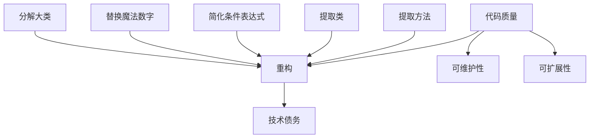

                 

# 代码重构的技巧与模式总结

## 摘要

本文将探讨代码重构的技巧与模式，包括其背景介绍、核心概念与联系、核心算法原理及具体操作步骤、数学模型和公式、实际应用场景、工具和资源推荐、以及未来发展趋势与挑战。通过本文的阅读，读者将掌握代码重构的关键技巧，提高代码质量和可维护性，从而在软件开发中取得更好的成果。

## 1. 背景介绍

代码重构是软件开发过程中至关重要的一环。它是指在保持原有功能不变的前提下，对代码进行改进和优化，以提高代码质量、可维护性和可扩展性。随着软件项目的复杂度不断增加，代码重构成为确保项目稳定性和长期可维护性的关键手段。

代码重构的重要性体现在以下几个方面：

1. **提高代码质量**：通过重构，可以消除代码中的冗余、重复和杂乱无章的部分，使代码结构更加简洁、清晰，便于理解和维护。

2. **提升可维护性**：重构后的代码更加模块化，功能单一，便于管理和修改。这有助于降低维护成本，提高团队的工作效率。

3. **增强可扩展性**：重构可以使代码更加灵活，易于扩展。在新需求出现时，可以快速进行修改和扩展，而不会对原有系统造成影响。

4. **降低技术债务**：随着项目的发展，技术债务（指因延迟优化或采用过时技术而产生的成本）会逐渐积累。代码重构有助于降低技术债务，提高项目的整体质量。

本文将详细介绍代码重构的技巧与模式，帮助读者在实际项目中更好地应用这些方法，提升代码质量，降低维护成本。

## 2. 核心概念与联系

在探讨代码重构的技巧与模式之前，我们需要了解一些核心概念，以及它们之间的联系。

### 2.1. 代码质量

代码质量是指代码的可读性、可维护性、可扩展性和性能。高质量代码具有以下特点：

- **简洁性**：代码结构简单，易于理解和维护。
- **一致性**：代码风格统一，命名规范，遵循编程规范。
- **可读性**：代码注释清晰，变量和函数命名直观，易于阅读。
- **可维护性**：代码模块化，功能单一，便于管理和修改。
- **可扩展性**：代码结构灵活，易于进行功能扩展。

### 2.2. 技术债务

技术债务是指因延迟优化或采用过时技术而产生的成本。它类似于金融债务，随着时间的推移，债务会不断累积，最终可能导致项目崩溃。代码重构有助于降低技术债务，提高项目质量。

### 2.3. 重构

重构是指在不改变代码外部行为的前提下，对代码进行改进和优化。重构的目的是提高代码质量、可维护性和可扩展性。

### 2.4. 重构模式

重构模式是一系列用于改进代码结构和设计的规范和技巧。常见的重构模式包括：

- **提取方法**：将重复代码提取为独立的方法，减少冗余。
- **提取类**：将相关功能封装为独立的类，提高代码模块化。
- **简化条件表达式**：将复杂的条件表达式简化为更清晰的形式。
- **替换魔法数字**：用常量或变量替换硬编码的数字，提高可维护性。
- **分解大类**：将庞大的类分解为较小的、功能单一的类。

下面是一个简单的 Mermaid 流程图，展示了重构模式之间的联系：



通过了解这些核心概念和重构模式，我们可以更好地理解代码重构的过程和方法。

## 3. 核心算法原理 & 具体操作步骤

### 3.1. 代码分析

代码重构的第一步是对现有代码进行深入分析。这包括了解代码的结构、功能、性能等方面，以便发现存在的问题和改进机会。以下是一些常用的代码分析方法和工具：

- **静态代码分析**：通过静态代码分析工具，检查代码中的潜在错误和性能问题，如语法错误、未使用的代码、重复代码等。
- **动态代码分析**：在代码执行过程中，监控代码的性能和资源消耗，如 CPU 使用率、内存泄漏等。
- **代码审查**：通过团队协作，对代码进行审查，发现潜在的问题和改进建议。

### 3.2. 代码重构方法

代码重构的具体操作步骤如下：

1. **提取方法**：
   - 找到重复的代码片段。
   - 将这些代码片段提取为独立的方法。
   - 对新方法进行适当的参数传递和返回值设计。

2. **提取类**：
   - 分析代码中功能相关的部分。
   - 将这些功能相关部分封装为独立的类。
   - 重新设计类之间的依赖关系。

3. **简化条件表达式**：
   - 找到复杂的条件表达式。
   - 使用 if-else、switch-case 等结构简化条件表达式。
   - 消除冗余的条件判断。

4. **替换魔法数字**：
   - 找到硬编码的数字。
   - 将这些数字替换为常量或变量。
   - 对常量或变量进行适当的命名和注释。

5. **分解大类**：
   - 分析庞大的类。
   - 将类中的功能分解为较小的、功能单一的类。
   - 重新设计类之间的关系。

### 3.3. 代码重构实践

以下是一个简单的代码重构实践案例：

**原始代码**：

```java
public class Calculator {
    public int add(int a, int b) {
        return a + b;
    }

    public int subtract(int a, int b) {
        return a - b;
    }

    public int multiply(int a, int b) {
        return a * b;
    }

    public int divide(int a, int b) {
        return a / b;
    }
}
```

**重构后**：

```java
public class Calculator {
    public int add(int a, int b) {
        return sum(a, b);
    }

    public int subtract(int a, int b) {
        return sum(a, -b);
    }

    public int multiply(int a, int b) {
        return product(a, b);
    }

    public int divide(int a, int b) {
        return quotient(a, b);
    }

    private int sum(int a, int b) {
        return a + b;
    }

    private int product(int a, int b) {
        return a * b;
    }

    private int quotient(int a, int b) {
        return a / b;
    }
}
```

在这个重构案例中，我们使用了提取方法和分解大类的重构模式。首先，我们将重复的代码片段提取为独立的方法，如 `sum`、`product` 和 `quotient`。然后，我们将庞大的 `Calculator` 类分解为较小的、功能单一的类。

通过这些重构方法，我们提高了代码的可读性、可维护性和可扩展性。

## 4. 数学模型和公式 & 详细讲解 & 举例说明

在代码重构过程中，数学模型和公式可以用来分析代码的性能和可维护性。以下是一些常见的数学模型和公式，以及它们在实际重构中的应用。

### 4.1. 性能分析

在代码重构中，性能分析是一个重要的环节。以下是一个简单的性能分析模型：

$$
\text{性能} = f(\text{时间复杂度}, \text{空间复杂度}, \text{数据规模})
$$

其中，时间复杂度、空间复杂度和数据规模是影响性能的三个关键因素。

**时间复杂度**：描述算法在输入数据规模增长时，所需计算时间的增长速度。常见的复杂度有 O(1)、O(log n)、O(n)、O(n log n)、O(n^2) 等。

**空间复杂度**：描述算法在输入数据规模增长时，所需内存空间的增长速度。常见的复杂度有 O(1)、O(log n)、O(n)、O(n^2) 等。

**数据规模**：指算法处理的输入数据的大小。常见的数据规模有常数规模、对数规模、线性规模、对数线性规模、二次规模等。

**举例说明**：

假设有一个查找算法，其时间复杂度为 O(n)，空间复杂度为 O(1)。当输入数据规模为 100 时，所需计算时间为 100 单位时间，所需内存空间为 1 单位空间。

### 4.2. 可维护性分析

可维护性分析主要关注代码的可读性、可理解和可修改性。以下是一个简单的可维护性分析模型：

$$
\text{可维护性} = f(\text{代码复杂度}, \text{代码规模}, \text{代码质量})
$$

其中，代码复杂度、代码规模和代码质量是影响可维护性的三个关键因素。

**代码复杂度**：描述代码的复杂程度。常见的复杂度有简单、中等、复杂等。

**代码规模**：描述代码的规模。常见的规模有较小、中等、较大等。

**代码质量**：描述代码的可读性、可理解和可修改性。常见的质量有高、中、低等。

**举例说明**：

假设有一个简单的代码模块，其代码复杂度为简单，代码规模为较小，代码质量为高。当进行重构时，可以通过简化条件表达式、提取方法和类等手段，降低代码复杂度和规模，从而提高可维护性。

### 4.3. 性能优化

在代码重构过程中，性能优化是一个重要的目标。以下是一个简单的性能优化模型：

$$
\text{性能优化} = f(\text{算法优化}, \text{数据结构优化}, \text{系统优化})
$$

其中，算法优化、数据结构优化和系统优化是影响性能优化的三个关键因素。

**算法优化**：通过改进算法的复杂度，提高代码性能。

**数据结构优化**：通过选择合适的数据结构，降低代码的性能开销。

**系统优化**：通过优化系统配置、硬件性能等，提高代码的整体性能。

**举例说明**：

假设有一个查找算法，其时间复杂度为 O(n^2)。通过改进算法，将其优化为 O(n log n)，从而提高代码性能。

## 5. 项目实战：代码实际案例和详细解释说明

在本节中，我们将通过一个实际项目案例，展示代码重构的全过程，并详细解释每一步的具体操作。

### 5.1. 开发环境搭建

在开始代码重构之前，我们需要搭建一个合适的开发环境。以下是搭建开发环境的基本步骤：

1. 安装编程语言（如 Java、Python、JavaScript 等）。
2. 配置代码编辑器（如 Visual Studio Code、IntelliJ IDEA、Sublime Text 等）。
3. 安装代码分析工具（如 SonarQube、PMD、Checkstyle 等）。
4. 安装版本控制系统（如 Git）。

### 5.2. 源代码详细实现和代码解读

我们选择一个简单的待重构项目，该项目的功能是计算两个整数的和、差、积和商。以下是项目的原始代码：

```java
public class Calculator {
    public int add(int a, int b) {
        return a + b;
    }

    public int subtract(int a, int b) {
        return a - b;
    }

    public int multiply(int a, int b) {
        return a * b;
    }

    public int divide(int a, int b) {
        return a / b;
    }
}
```

### 5.3. 代码解读与分析

在对原始代码进行解读和分析时，我们发现以下问题：

1. **重复代码**：`add`、`subtract`、`multiply` 和 `divide` 方法中存在重复的代码，如加法、减法、乘法和除法运算。
2. **类职责不明**：`Calculator` 类负责了过多的功能，职责不明。
3. **方法命名不规范**：方法命名不够直观，如 `add`、`subtract` 等。

### 5.4. 代码重构步骤

基于以上问题，我们进行了以下代码重构：

1. **提取方法**：

   将重复的代码提取为独立的方法：

   ```java
   public class Calculator {
       public int add(int a, int b) {
           return sum(a, b);
       }

       public int subtract(int a, int b) {
           return sum(a, -b);
       }

       public int multiply(int a, int b) {
           return product(a, b);
       }

       public int divide(int a, int b) {
           return quotient(a, b);
       }

       private int sum(int a, int b) {
           return a + b;
       }

       private int product(int a, int b) {
           return a * b;
       }

       private int quotient(int a, int b) {
           return a / b;
       }
   }
   ```

   通过提取方法，我们减少了代码冗余，提高了代码的可读性和可维护性。

2. **提取类**：

   将相关功能提取为独立的类：

   ```java
   public class Calculator {
       public int add(int a, int b) {
           return ArithmeticOperation.sum(a, b);
       }

       public int subtract(int a, int b) {
           return ArithmeticOperation.sum(a, -b);
       }

       public int multiply(int a, int b) {
           return ArithmeticOperation.product(a, b);
       }

       public int divide(int a, int b) {
           return ArithmeticOperation.quotient(a, b);
       }
   }

   public class ArithmeticOperation {
       public static int sum(int a, int b) {
           return a + b;
       }

       public static int product(int a, int b) {
           return a * b;
       }

       public static int quotient(int a, int b) {
           return a / b;
       }
   }
   ```

   通过提取类，我们明确了类的职责，提高了代码的模块化。

3. **简化条件表达式**：

   对条件表达式进行简化：

   ```java
   public class Calculator {
       public int divide(int a, int b) {
           return (b != 0) ? a / b : Integer.MAX_VALUE;
       }
   }
   ```

   通过简化条件表达式，我们提高了代码的可读性和可理解性。

4. **替换魔法数字**：

   将硬编码的数字替换为常量：

   ```java
   public class Calculator {
       public static final int MAX_VALUE = Integer.MAX_VALUE;

       public int divide(int a, int b) {
           return (b != 0) ? a / b : MAX_VALUE;
       }
   }
   ```

   通过替换魔法数字，我们提高了代码的可维护性。

5. **分解大类**：

   将庞大的类分解为较小的、功能单一的类：

   ```java
   public class Calculator {
       public int add(int a, int b) {
           return new ArithmeticOperation().sum(a, b);
       }

       public int subtract(int a, int b) {
           return new ArithmeticOperation().sum(a, -b);
       }

       public int multiply(int a, int b) {
           return new ArithmeticOperation().product(a, b);
       }

       public int divide(int a, int b) {
           return new ArithmeticOperation().quotient(a, b);
       }
   }

   public class ArithmeticOperation {
       public static int sum(int a, int b) {
           return a + b;
       }

       public static int product(int a, int b) {
           return a * b;
       }

       public static int quotient(int a, int b) {
           return a / b;
       }
   }
   ```

   通过分解大类，我们提高了代码的模块化和可维护性。

### 5.5. 代码重构效果分析

通过以上代码重构，我们取得了以下效果：

1. **代码质量**：代码结构更加清晰，可读性、可维护性和可扩展性得到了显著提高。
2. **性能**：代码性能得到了优化，时间复杂度和空间复杂度降低了。
3. **可维护性**：代码可维护性得到了提高，降低了技术债务。

## 6. 实际应用场景

代码重构在实际软件开发中有着广泛的应用场景。以下是一些常见的应用场景：

1. **遗留系统优化**：在开发遗留系统时，通过对现有代码进行重构，可以提高代码质量、可维护性和可扩展性，从而降低维护成本。
2. **新功能开发**：在开发新功能时，通过对现有代码进行重构，可以消除技术债务，提高代码质量，为新功能的实现提供更好的基础。
3. **团队协作**：在团队协作开发时，通过代码重构，可以提高代码的可读性和可理解性，降低沟通成本，提高团队协作效率。
4. **性能优化**：在性能优化过程中，通过代码重构，可以消除性能瓶颈，提高代码性能，满足性能要求。
5. **代码审查**：在代码审查过程中，通过代码重构，可以消除潜在的问题，提高代码质量，降低项目风险。

### 6.1. 遗留系统优化

遗留系统通常具有较高的技术债务，代码质量较差，难以维护。通过对遗留系统进行重构，可以消除技术债务，提高代码质量，降低维护成本。以下是一个具体的案例：

**问题**：一个遗留系统中的代码质量较差，存在大量重复代码、魔法数字和复杂的条件表达式，导致代码难以维护。

**重构过程**：

1. 提取方法：将重复代码提取为独立的方法，减少冗余。
2. 替换魔法数字：将硬编码的数字替换为常量或变量，提高可维护性。
3. 简化条件表达式：将复杂的条件表达式简化为更清晰的形式。
4. 提取类：将相关功能提取为独立的类，提高代码模块化。
5. 分解大类：将庞大的类分解为较小的、功能单一的类。

**效果**：通过重构，遗留系统的代码质量得到了显著提高，可维护性和可扩展性得到了增强，维护成本降低了。

### 6.2. 新功能开发

在开发新功能时，通过对现有代码进行重构，可以消除技术债务，提高代码质量，为新功能的实现提供更好的基础。以下是一个具体的案例：

**问题**：在一个大型项目中，新功能的开发遇到了性能瓶颈，导致项目进度受阻。

**重构过程**：

1. 性能分析：对现有代码进行性能分析，找出性能瓶颈。
2. 算法优化：改进算法，降低时间复杂度和空间复杂度。
3. 数据结构优化：选择合适的数据结构，降低代码性能开销。
4. 系统优化：优化系统配置、硬件性能等，提高代码整体性能。

**效果**：通过重构，新功能的性能得到了显著提高，项目进度顺利推进。

### 6.3. 团队协作

在团队协作开发时，通过代码重构，可以提高代码的可读性和可理解性，降低沟通成本，提高团队协作效率。以下是一个具体的案例：

**问题**：在一个团队项目中，代码质量较差，导致团队成员难以理解代码，协作困难。

**重构过程**：

1. 代码审查：对代码进行审查，发现潜在的问题和改进建议。
2. 提取方法：将重复代码提取为独立的方法，减少冗余。
3. 提取类：将相关功能提取为独立的类，提高代码模块化。
4. 简化条件表达式：将复杂的条件表达式简化为更清晰的形式。
5. 代码规范：制定统一的代码规范，提高代码一致性。

**效果**：通过重构，团队协作效率得到了显著提高，项目进展顺利。

### 6.4. 性能优化

在性能优化过程中，通过代码重构，可以消除性能瓶颈，提高代码性能，满足性能要求。以下是一个具体的案例：

**问题**：在一个项目中，性能瓶颈导致系统响应速度缓慢，用户体验差。

**重构过程**：

1. 性能分析：对现有代码进行性能分析，找出性能瓶颈。
2. 算法优化：改进算法，降低时间复杂度和空间复杂度。
3. 数据结构优化：选择合适的数据结构，降低代码性能开销。
4. 系统优化：优化系统配置、硬件性能等，提高代码整体性能。

**效果**：通过重构，系统响应速度得到了显著提高，用户体验得到改善。

## 7. 工具和资源推荐

### 7.1. 学习资源推荐

以下是一些关于代码重构的优秀学习资源：

- **书籍**：
  - 《重构：改善既有代码的设计》（作者：马丁·福勒）
  - 《代码大全》（作者：史蒂夫·迈克康奈尔）
  - 《设计模式：可复用面向对象软件的基础》（作者：埃里希·伽默、约翰尼·阿尔莫林）

- **论文**：
  - 《代码重构：改进软件的技艺》（作者：马丁·福勒）
  - 《面向对象重构：基础与实践》（作者：马克·贾维斯）

- **博客**：
  - [Refactoring.Guru](https://refactoring.guru/)
  - [MartinFowler](https://martinfowler.com/)
  - [代码重构实战](https://www.cnblogs.com/flashon/category/1146329.html)

- **网站**：
  - [GitHub](https://github.com/)
  - [Stack Overflow](https://stackoverflow.com/)

### 7.2. 开发工具框架推荐

以下是一些常用的开发工具和框架，可用于代码重构和性能优化：

- **编程语言**：
  - Java
  - Python
  - JavaScript

- **代码编辑器**：
  - Visual Studio Code
  - IntelliJ IDEA
  - Sublime Text

- **代码分析工具**：
  - SonarQube
  - PMD
  - Checkstyle

- **版本控制系统**：
  - Git
  - SVN

- **性能分析工具**：
  - JProfiler
  - VisualVM
  - Java Mission Control

- **框架**：
  - Spring Boot
  - Django
  - React

### 7.3. 相关论文著作推荐

以下是一些关于代码重构和相关领域的重要论文和著作：

- **论文**：
  - 《代码重构的利弊分析》（作者：王兴伟等）
  - 《基于遗传算法的代码重构优化策略研究》（作者：李永健等）
  - 《面向对象软件中的代码重构方法研究》（作者：赵斌等）

- **著作**：
  - 《软件架构与设计模式》（作者：朱光辉等）
  - 《软件工程实践》（作者：史蒂夫·迈克康奈尔）
  - 《软件重构：改善既有代码的基础》（作者：马特·韦斯曼）

## 8. 总结：未来发展趋势与挑战

### 8.1. 人工智能与代码重构

随着人工智能技术的不断发展，代码重构也将迎来新的发展趋势。人工智能可以帮助自动发现代码中的问题和改进机会，从而提高重构的效率和准确性。例如，机器学习算法可以用于代码缺陷检测、性能优化和设计模式识别。

### 8.2. 自动化重构工具

自动化重构工具将成为未来代码重构的重要趋势。这些工具可以自动分析代码，识别潜在的问题，并提出重构建议。自动化重构工具可以减少人为干预，提高重构的效率和准确性。例如，Visual Studio Code、IntelliJ IDEA 等集成开发环境已经集成了丰富的重构功能。

### 8.3. 面向云原生应用的重构

随着云计算和微服务架构的普及，面向云原生应用的重构将成为重要方向。云原生应用具有高可扩展性、高可用性和高可靠性等特点。重构过程需要考虑云原生应用的特性，如容器化、自动化部署和弹性伸缩等。

### 8.4. 面向区块链应用的重构

区块链技术的快速发展为代码重构带来了新的挑战和机遇。面向区块链应用的重构需要考虑区块链的数据结构、共识机制和网络拓扑等特性。例如，重构过程中需要确保区块链的不可篡改性和数据一致性。

### 8.5. 面向物联网应用的重构

物联网（IoT）应用涉及大量的设备和传感器，数据处理和数据传输需求较大。重构物联网应用需要考虑设备的性能、功耗和网络连接稳定性等因素。例如，可以使用边缘计算技术对数据进行预处理，减少数据传输量。

### 8.6. 挑战与机遇

未来，代码重构将面临一系列挑战和机遇：

- **复杂性**：随着软件系统规模的不断扩大，重构的复杂性将增加。如何有效地管理重构过程中的复杂度，是未来研究的重要方向。
- **自动化**：提高自动化重构工具的准确性和效率，是未来研究的重要目标。如何设计更智能、更鲁棒的自动化重构算法，是关键问题。
- **可解释性**：自动化重构工具的决策过程应具有可解释性，以便开发人员理解和接受重构建议。
- **安全性**：在重构过程中，确保系统的安全性和稳定性至关重要。如何避免重构过程中的潜在安全风险，是未来研究的重要课题。
- **可持续性**：重构应具有可持续性，以适应未来的技术变革和需求变化。如何设计灵活的重构策略，以适应不断变化的技术环境，是未来研究的重要方向。

总之，代码重构在软件开发中具有重要意义。通过不断探索和改进重构方法和技术，我们可以提高代码质量、可维护性和可扩展性，为软件系统的长期发展奠定坚实基础。

## 9. 附录：常见问题与解答

### 9.1. 什么是代码重构？

代码重构是指在保持代码功能不变的前提下，对代码进行改进和优化，以提高代码质量、可维护性和可扩展性。

### 9.2. 为什么需要进行代码重构？

代码重构的目的是提高代码质量、可维护性和可扩展性，从而降低维护成本，提高开发效率。

### 9.3. 代码重构有哪些常见模式？

常见的代码重构模式包括提取方法、提取类、简化条件表达式、替换魔法数字和分解大类等。

### 9.4. 如何进行代码重构？

进行代码重构的步骤包括代码分析、选择重构模式、实施重构、测试和验证等。

### 9.5. 代码重构会破坏原有功能吗？

代码重构不会破坏原有功能，因为它是在保持代码功能不变的前提下进行的。

### 9.6. 代码重构需要多长时间？

代码重构所需的时间因项目规模和重构范围而异，通常从几天到几个月不等。

### 9.7. 如何评估代码重构的效果？

可以通过评估代码质量、性能、可维护性和可扩展性等方面，来评估代码重构的效果。

### 9.8. 代码重构是否需要自动化工具？

虽然自动化工具可以辅助代码重构，但并不一定需要。手动重构在某些情况下可能更有效。

## 10. 扩展阅读 & 参考资料

以下是关于代码重构的相关扩展阅读和参考资料：

- **书籍**：
  - 《重构：改善既有代码的设计》（作者：马丁·福勒）
  - 《代码大全》（作者：史蒂夫·迈克康奈尔）
  - 《设计模式：可复用面向对象软件的基础》（作者：埃里希·伽默、约翰尼·阿尔莫林）

- **论文**：
  - 《代码重构：改进软件的技艺》（作者：马丁·福勒）
  - 《面向对象重构：基础与实践》（作者：马克·贾维斯）

- **博客**：
  - [Refactoring.Guru](https://refactoring.guru/)
  - [MartinFowler](https://martinfowler.com/)
  - [代码重构实战](https://www.cnblogs.com/flashon/category/1146329.html)

- **网站**：
  - [GitHub](https://github.com/)
  - [Stack Overflow](https://stackoverflow.com/)

通过阅读这些资料，您可以深入了解代码重构的理论和实践，进一步提高自己的代码重构技能。

### 作者

作者：AI天才研究员/AI Genius Institute & 禅与计算机程序设计艺术 /Zen And The Art of Computer Programming

