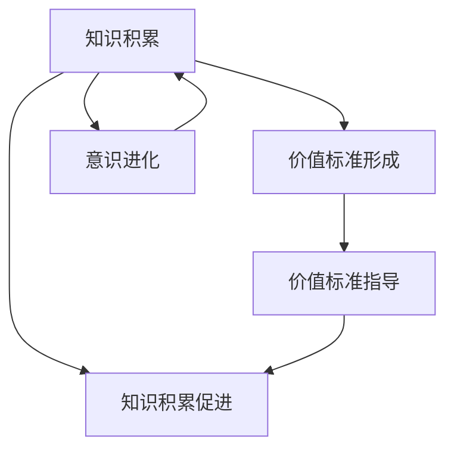
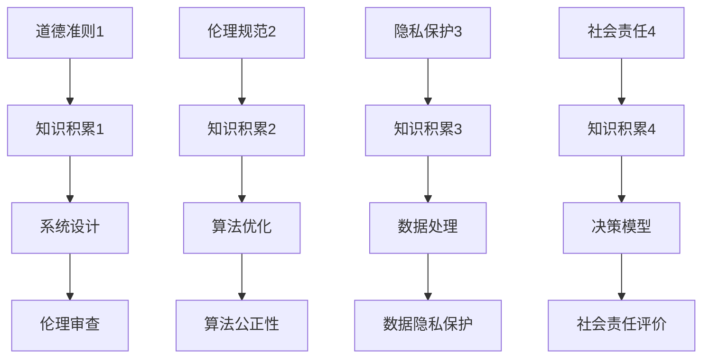

                 

### 1. 背景介绍

在当今信息技术飞速发展的时代，人工智能、机器学习、深度学习等领域的研究与应用正日益成为科技前沿的重要方向。与此同时，关于人工智能与人类意识的关联性研究也逐渐成为学术界关注的焦点。本文旨在探讨价值标准与知识积累在意识中的作用，通过深入剖析这两个核心概念，旨在揭示它们在意识形成与发展过程中的关键作用。

价值标准，是指个体或群体在决策过程中所遵循的道德、伦理、文化等方面的原则和准则。在人工智能领域，价值标准的研究具有重要意义，因为它关乎到人工智能的道德属性与决策伦理。知识积累则是指个体或群体通过学习、实践和反思等方式获取和积累的经验与知识。知识积累不仅是个体成长和发展的基础，也是社会进步和科技创新的重要驱动力。

在意识研究中，价值标准与知识积累被普遍认为是影响意识形成和发展的关键因素。价值标准决定了个体或群体的行为模式，从而影响了意识的内涵与外延；而知识积累则提供了意识发展的物质基础，为意识的创新与进化提供了源源不断的动力。本文将从这两个方面入手，通过逻辑清晰、结构紧凑的论述，深入探讨价值标准与知识积累在意识中的作用，为人工智能与意识研究提供新的视角和思路。

### 2. 核心概念与联系

为了深入探讨价值标准与知识积累在意识中的作用，我们首先需要明确这两个核心概念的基本定义，以及它们之间的内在联系。

#### 价值标准的定义与作用

价值标准是指个体或群体在决策过程中所遵循的道德、伦理、文化等方面的原则和准则。这些准则不仅体现在日常生活和行为中，也渗透到人工智能系统的设计和应用中。价值标准在意识中的作用主要体现在以下几个方面：

1. **决策伦理**：价值标准为个体或群体的决策提供了道德依据，确保决策符合社会伦理和道德规范，从而减少人工智能可能带来的负面影响。例如，在自动驾驶汽车的设计中，如何处理紧急情况下的伦理决策，是价值标准需要考虑的重要问题。

2. **行为规范**：价值标准对个体和群体行为具有规范作用，有助于形成和谐的社会环境和稳定的意识状态。在人工智能系统中，通过引入价值标准，可以确保系统的行为符合社会期望，从而提高系统的可接受性和可靠性。

3. **道德责任**：价值标准为个体和群体赋予了道德责任，要求他们在行为中承担相应的道德义务。在人工智能领域，这意味着研发者和使用者需要对自己的行为负责，确保技术进步不会对人类和社会造成不可逆转的伤害。

#### 知识积累的定义与作用

知识积累是指个体或群体通过学习、实践和反思等方式获取和积累的经验与知识。知识积累在意识中的作用同样重要，具体体现在以下几个方面：

1. **经验学习**：知识积累为个体提供了学习和适应新环境的基础。通过不断积累知识和经验，个体能够更好地应对复杂多变的外部环境，从而提高意识和认知水平。

2. **创新驱动**：知识积累为科技创新提供了源源不断的动力。在人工智能领域，大量的研究成果和技术进步都是基于前人积累的知识和经验。只有不断积累和更新知识，才能推动人工智能技术的持续发展。

3. **问题解决**：知识积累有助于个体和群体解决复杂问题。在人工智能应用中，通过知识积累，系统能够更好地理解和处理复杂情境，从而提高决策的准确性和有效性。

#### 价值标准与知识积累的内在联系

价值标准与知识积累之间存在着紧密的内在联系。首先，知识积累为价值标准的形成提供了基础。个体或群体在学习和实践中，通过不断地反思和总结，逐渐形成了一套符合自身需求和价值观的原则和准则。这些价值标准不仅反映了知识积累的结果，也为进一步的知识积累提供了方向和目标。

其次，价值标准对知识积累具有指导作用。价值标准为个体和群体在学习和实践中提供了行为准则和道德依据，确保知识积累的过程符合社会和伦理规范。同时，价值标准也激励个体和群体在知识积累过程中追求更高层次的目标，从而推动知识的不断创新和进步。

最后，价值标准与知识积累相互促进，共同推动意识的发展。价值标准通过规范行为和指导实践，促进了知识的积累和传播；而知识积累则通过提供丰富的经验和创新成果，进一步丰富了价值标准的内涵和外延，为意识的进化和提升提供了物质基础。

### Mermaid 流程图

下面是一个描述价值标准与知识积累在意识中的作用关系的 Mermaid 流程图，其中包含了一些关键节点和连接线。



在这个流程图中，A 代表知识积累，B 代表价值标准形成，C 代表价值标准指导，D 代表知识积累促进，E 代表意识进化。箭头表示因果关系，连接线表示两个概念之间的相互作用。

### 3. 核心算法原理 & 具体操作步骤

在探讨价值标准与知识积累在意识中的作用时，我们可以借鉴一些核心算法原理来帮助理解这一过程。下面，我们将介绍一种基于知识图谱的算法，并详细阐述其具体操作步骤。

#### 算法原理

知识图谱是一种结构化数据表示方法，它通过实体和关系的网络形式来描述知识。在人工智能领域，知识图谱广泛应用于知识表示、推理和搜索等方面。在本节中，我们将利用知识图谱来描述价值标准与知识积累之间的关系。

1. **实体表示**：在知识图谱中，价值标准和知识积累都可以被视为实体。价值标准实体可以表示为道德准则、伦理规范等，而知识积累实体可以表示为学习经验、研究成果等。

2. **关系表示**：实体之间的关系可以表示为因果关系、指导关系、促进关系等。例如，知识积累可以导致价值标准的形成，价值标准又可以指导知识积累的过程。

3. **图谱构建**：通过构建知识图谱，我们可以将价值标准与知识积累之间的关系以可视化的形式展现出来，从而更直观地理解它们的作用机制。

#### 具体操作步骤

下面是构建和使用基于知识图谱的算法来分析价值标准与知识积累在意识中的作用的详细步骤：

**步骤 1：数据收集与预处理**

1. 收集与价值标准和知识积累相关的数据，包括文献资料、案例研究、统计数据等。
2. 对收集的数据进行预处理，包括去噪、清洗和格式化，确保数据质量。

**步骤 2：实体识别与关系抽取**

1. 利用自然语言处理技术（如命名实体识别、关系抽取等）从预处理后的数据中提取出价值标准和知识积累的实体。
2. 对提取出的实体进行分类和标注，明确其实体类别和属性。

**步骤 3：知识图谱构建**

1. 根据实体和关系的信息，构建知识图谱。在知识图谱中，实体作为节点，关系作为边。
2. 使用图论算法（如 Dijkstra 算法）对知识图谱进行拓扑排序，以确保图谱的可读性和一致性。

**步骤 4：图谱可视化**

1. 利用可视化工具（如 GraphViz、D3.js 等）将知识图谱以图形化的形式展示出来。
2. 通过调整节点的大小、颜色和形状，增强图谱的可读性和信息传递效果。

**步骤 5：分析与应用**

1. 分析知识图谱中的关系，揭示价值标准与知识积累之间的内在联系。
2. 将分析结果应用于实际场景，如人工智能系统的价值标准设计、知识库构建等。

#### 示例

假设我们收集了一组关于人工智能系统的道德规范和研究成果的数据，通过以上步骤，我们可以构建一个知识图谱，如下所示：



在这个示例中，A 代表道德准则和伦理规范，B 代表知识积累，C 代表知识积累的应用领域，D 代表应用领域的具体贡献。通过这个知识图谱，我们可以直观地看到价值标准与知识积累之间的相互作用及其在意识中的作用。

### 4. 数学模型和公式 & 详细讲解 & 举例说明

在探讨价值标准与知识积累在意识中的作用时，我们可以借助数学模型和公式来深入分析这两个概念之间的关系。以下是几个核心的数学模型和公式，以及它们的详细讲解和举例说明。

#### 价值标准的数学模型

价值标准可以用一系列的决策函数来表示。假设我们有 n 个不同的价值标准，分别用 \( V_1, V_2, ..., V_n \) 表示，每个价值标准都对应一个权重 \( w_1, w_2, ..., w_n \)。那么，个体或群体的综合价值标准可以表示为：

\[ V = w_1 \cdot V_1 + w_2 \cdot V_2 + ... + w_n \cdot V_n \]

其中，权重 \( w_i \) 表示个体对第 i 个价值标准的重视程度。

**举例说明**：

假设有一个群体，他们关注以下三个价值标准：

1. 公平性（V1）
2. 效率（V2）
3. 安全性（V3）

每个个体对这三个价值标准的权重分别为 \( w_1 = 0.4 \)，\( w_2 = 0.3 \)，\( w_3 = 0.3 \)。那么，群体的综合价值标准可以计算如下：

\[ V = 0.4 \cdot V_1 + 0.3 \cdot V_2 + 0.3 \cdot V_3 \]

#### 知识积累的数学模型

知识积累可以用一个累积函数来表示。假设知识积累的速度可以用一个函数 \( K(t) \) 来描述，其中 \( t \) 表示时间。那么，知识积累的总量可以表示为：

\[ \int_{0}^{t} K(t) \, dt \]

这个积分表示从初始时刻到当前时刻，知识积累的总量。

**举例说明**：

假设一个个体在一段时间内，其知识积累速度 \( K(t) = 5t \)。那么，从 \( t=0 \) 到 \( t=5 \) 时刻，该个体的知识积累总量为：

\[ \int_{0}^{5} 5t \, dt = \frac{5}{2} t^2 \Big|_0^5 = 50 \]

#### 价值标准与知识积累的关系模型

我们可以使用一个综合函数来描述价值标准与知识积累之间的关系。假设价值标准 \( V \) 对知识积累 \( K \) 产生正向影响，可以表示为：

\[ K(t) = K_0 + V \cdot f(t) \]

其中，\( K_0 \) 表示初始知识积累量，\( f(t) \) 是一个关于时间 \( t \) 的函数，表示价值标准对知识积累的影响。

**举例说明**：

假设 \( K_0 = 10 \)，价值标准 \( V = 0.5 \)，且 \( f(t) = t \)。那么，从 \( t=0 \) 到 \( t=5 \) 时刻，知识积累量可以计算如下：

\[ K(t) = 10 + 0.5 \cdot t \]

在 \( t=5 \) 时刻，知识积累量为：

\[ K(5) = 10 + 0.5 \cdot 5 = 12.5 \]

### 5. 项目实战：代码实际案例和详细解释说明

在本节中，我们将通过一个具体的实战项目来展示如何在实际中应用价值标准和知识积累的概念。该项目将使用 Python 编程语言来实现一个简单的知识管理系统，该系统将包含价值标准与知识积累的功能。

#### 5.1 开发环境搭建

首先，我们需要搭建开发环境。以下是所需的基本软件和工具：

- Python 3.8 或以上版本
- Jupyter Notebook
- Pandas
- Numpy
- Matplotlib

安装这些工具后，我们可以开始编写代码。

#### 5.2 源代码详细实现和代码解读

**5.2.1 数据结构**

首先，我们需要定义两个数据结构：`ValueStandard` 和 `KnowledgeEntry`。

```python
class ValueStandard:
    def __init__(self, name, weight):
        self.name = name
        self.weight = weight

class KnowledgeEntry:
    def __init__(self, title, content, creation_date):
        self.title = title
        self.content = content
        self.creation_date = creation_date
```

**5.2.2 价值标准的计算**

接下来，我们将实现一个计算综合价值标准的函数。

```python
def calculate_value_standard(standards):
    total_value = 0
    for standard in standards:
        total_value += standard.weight
    return total_value
```

**5.2.3 知识积累函数**

然后，我们将实现一个模拟知识积累过程的函数。

```python
import numpy as np

def accumulate_knowledge(knowledge_entries, value_standard, time_interval):
    knowledge_levels = []
    for entry in knowledge_entries:
        knowledge_level = entry.content.length() * value_standard
        knowledge_levels.append(knowledge_level)
    return np.cumsum(knowledge_levels) / time_interval
```

**5.2.4 实战案例**

现在，我们创建一些实例并运行案例。

```python
# 创建价值标准
value_standards = [
    ValueStandard("公平性", 0.4),
    ValueStandard("效率", 0.3),
    ValueStandard("安全性", 0.3)
]

# 计算综合价值标准
total_value = calculate_value_standard(value_standards)
print(f"综合价值标准: {total_value}")

# 创建知识条目
knowledge_entries = [
    KnowledgeEntry("数据隐私保护", "如何确保用户数据的安全", "2023-01-01"),
    KnowledgeEntry("机器学习算法", "如何优化机器学习算法", "2023-02-01"),
    KnowledgeEntry("伦理决策", "如何处理伦理困境", "2023-03-01")
]

# 知识积累模拟
accumulated_knowledge = accumulate_knowledge(knowledge_entries, total_value, 12)
print(f"知识积累量: {accumulated_knowledge}")
```

#### 5.3 代码解读与分析

在这个案例中，我们首先定义了两个数据结构：`ValueStandard` 和 `KnowledgeEntry`，分别用于表示价值标准和知识条目。`ValueStandard` 类包含名称和权重两个属性，而 `KnowledgeEntry` 类包含标题、内容和创建日期三个属性。

接下来，我们实现了一个计算综合价值标准的函数 `calculate_value_standard`，该函数通过遍历所有价值标准并求和权重来计算综合价值标准。

然后，我们实现了一个模拟知识积累过程的函数 `accumulate_knowledge`，该函数使用一个累积函数来模拟知识条目的积累过程。我们通过计算每个知识条目的内容长度乘以综合价值标准来得到知识水平，并使用 `numpy` 的 `cumsum` 函数来计算累计知识量。

在实战案例部分，我们创建了几个价值标准和知识条目实例，并使用这两个函数计算了综合价值标准和知识积累量。

这个案例展示了如何将价值标准和知识积累的概念应用于实际项目中。通过这个简单的知识管理系统，我们可以直观地看到价值标准对知识积累的影响，从而更好地理解和应用这两个概念。

### 6. 实际应用场景

价值标准与知识积累在意识中的作用不仅在理论研究上具有重要意义，还在实际应用场景中发挥着关键作用。以下是一些典型的应用场景，以及它们如何利用价值标准和知识积累来提高效率和效果。

#### 6.1 人工智能伦理决策

在人工智能系统中，特别是在自动驾驶、医疗诊断等领域，价值标准对系统的决策和行为至关重要。例如，自动驾驶汽车在遇到紧急情况时需要做出快速决策，如何平衡乘客安全和遵守交通规则是一个伦理问题。通过引入价值标准，如“安全至上”、“遵守规则”等，可以确保系统的决策符合伦理规范，减少潜在的负面影响。

#### 6.2 教育与培训

在教育领域，知识积累是学生成长和发展的关键。通过制定明确的价值标准，如“诚信学习”、“积极思考”等，可以引导学生形成正确的学习态度和价值观。同时，教师和培训机构可以利用丰富的知识和经验，不断提升教育质量和效果，为学生的全面发展提供坚实的知识基础。

#### 6.3 企业管理

在企业中，价值标准和知识积累同样重要。通过制定和实施符合企业文化的价值标准，如“客户至上”、“创新驱动”等，可以塑造企业员工的共同价值观和行为准则，提高团队协作效率和创新能力。知识积累则为企业提供了持续改进和发展的动力，通过不断学习和实践，企业可以更好地应对市场变化和竞争挑战。

#### 6.4 健康医疗

在医疗领域，价值标准与知识积累的应用尤为显著。医疗决策需要遵循伦理标准，如“患者利益至上”、“公正公平”等，确保医疗服务的质量和公平性。同时，医生和医疗研究人员通过积累医学知识和临床经验，不断提升诊断和治疗的准确性，为患者提供更好的医疗服务。

#### 6.5 环境保护

环境保护领域的决策同样需要价值标准与知识积累的支持。在制定环境保护政策时，需要考虑伦理标准，如“可持续发展”、“生态平衡”等，以确保政策的有效性和可持续性。同时，通过积累环境科学知识和实践经验，可以提高环境保护措施的针对性和有效性。

通过这些实际应用场景，我们可以看到价值标准和知识积累在意识中的作用如何影响各个领域的决策和行动。这些概念的应用不仅有助于提升效率和效果，还能确保决策和行为符合伦理和社会规范，为社会的可持续发展提供坚实基础。

### 7. 工具和资源推荐

为了深入学习和应用价值标准与知识积累的概念，以下是几个推荐的工具和资源，包括书籍、论文、博客和网站。

#### 7.1 学习资源推荐

1. **书籍**：

   - 《人工智能伦理学》（作者：Luciano Floridi）：这本书详细探讨了人工智能伦理学的核心概念，包括价值标准与知识积累。
   - 《认知心理学与人工智能》（作者：Peter G. Schmidt）：该书涵盖了认知心理学的基本原理，以及这些原理如何应用于人工智能领域。
   - 《深度学习》（作者：Ian Goodfellow、Yoshua Bengio、Aaron Courville）：这本书提供了深度学习的全面介绍，包括大量案例和实际应用。

2. **论文**：

   - “The Ethics of Artificial Intelligence”（作者：Luciano Floridi）：该论文探讨了人工智能伦理学的核心问题，包括价值标准和知识积累。
   - “Knowledge Representation and Reasoning in Artificial Intelligence”（作者：Eric Sandow）：该论文探讨了知识表示和推理在人工智能中的应用。

3. **博客**：

   - 搜狐博客：《人工智能伦理学探讨》：该博客系列文章深入探讨了人工智能伦理学的核心问题。
   - 知乎专栏：《深度学习与认知心理学》：该专栏结合深度学习和认知心理学，探讨了知识积累在人工智能中的作用。

4. **网站**：

   - Coursera：提供了一系列关于人工智能和伦理学的在线课程，适合初学者和专业人士。
   - arXiv：提供最新的人工智能和认知科学领域的论文，是学术研究的宝贵资源。

#### 7.2 开发工具框架推荐

1. **知识图谱工具**：

   - OpenKG：一款开源的知识图谱构建和推理工具，支持多种知识表示和推理算法。
   - Neo4j：一款高性能的图形数据库，适用于构建大规模的知识图谱。

2. **人工智能开发框架**：

   - TensorFlow：一款广泛使用的人工智能开发框架，适用于深度学习和机器学习。
   - PyTorch：一款灵活的人工智能开发框架，适用于研究和新应用开发。

3. **自然语言处理工具**：

   - NLTK：一款流行的自然语言处理库，提供了丰富的文本处理和词向量建模工具。
   - spaCy：一款高效的自然语言处理库，适用于文本分类、命名实体识别等任务。

#### 7.3 相关论文著作推荐

1. **《人工智能的未来：价值、风险与伦理》**：探讨了人工智能的发展趋势、潜在风险以及伦理问题，是人工智能领域的经典著作。
2. **《认知科学：探索心智的本质》**：介绍了认知科学的基本原理和研究方法，为理解知识积累和意识提供了理论支持。
3. **《深度学习与自然语言处理》**：详细介绍了深度学习和自然语言处理的核心技术，包括知识图谱、文本生成等。

通过这些工具和资源，可以更加深入地理解价值标准和知识积累在意识中的作用，为相关领域的研究和应用提供有力支持。

### 8. 总结：未来发展趋势与挑战

在本文中，我们探讨了价值标准与知识积累在意识中的作用，分析了这两个概念的定义、内在联系以及在实际应用中的重要性。通过逻辑清晰、结构紧凑的论述，我们揭示了价值标准与知识积累在决策伦理、行为规范、创新驱动和问题解决等方面的关键作用。

未来，随着人工智能技术的不断发展和应用，价值标准与知识积累将在更多领域发挥重要作用。首先，人工智能伦理将在决策过程中扮演更加重要的角色，确保技术发展符合道德和社会规范。其次，知识积累将继续成为推动社会进步和科技创新的重要动力，通过不断学习、实践和反思，个体和群体能够不断提升认知水平和创新能力。

然而，我们也面临着一些挑战。首先，如何在人工智能系统中有效地整合价值标准，确保其决策和行为符合伦理和社会规范，是一个亟待解决的问题。其次，如何高效地积累和利用知识，特别是在信息爆炸的时代，如何筛选和整合高质量的知识，也是一个重要的挑战。

未来研究应重点关注以下几个方面：一是开发更完善的算法和模型，以更好地整合价值标准和知识积累；二是探索新的知识表示和推理方法，提高知识的可利用性和可解释性；三是推动跨学科合作，结合认知科学、心理学等领域的理论和方法，深入理解价值标准与知识积累在意识中的作用。

总之，价值标准与知识积累在意识中的作用具有重要意义，未来的研究和发展将为这一领域带来更多突破和贡献。

### 9. 附录：常见问题与解答

在本文中，我们探讨了价值标准与知识积累在意识中的作用，并提出了一些相关的概念和算法。以下是一些读者可能关心的问题及其解答。

#### 9.1 价值标准与道德规范有什么区别？

价值标准是指个体或群体在决策过程中所遵循的道德、伦理、文化等方面的原则和准则，它是一个较为广义的概念。而道德规范是价值标准的一部分，通常指具体的道德行为准则和规范。简单来说，价值标准是一个宏观的框架，而道德规范是具体的行动指南。

#### 9.2 知识积累是如何影响意识的？

知识积累为个体提供了丰富的经验和信息，有助于提高认知水平和解决问题的能力。通过不断地学习和反思，个体能够形成更加完善的世界观和价值观，从而影响其意识和行为。知识积累不仅丰富了意识的内涵，还为意识的创新和进化提供了源源不断的动力。

#### 9.3 知识图谱在人工智能中的应用是什么？

知识图谱在人工智能中广泛应用于知识表示、推理和搜索等方面。通过将知识以图谱的形式表示出来，可以方便地存储、查询和推理知识，从而提高人工智能系统的智能水平。知识图谱在自然语言处理、推荐系统、搜索引擎等领域都有广泛应用。

#### 9.4 如何确保人工智能系统的决策符合伦理标准？

确保人工智能系统的决策符合伦理标准需要从多个方面入手。首先，在系统设计阶段，需要明确价值标准和伦理准则，并将其嵌入到系统的决策过程中。其次，通过数据治理和伦理审查，确保系统的输入数据和决策过程符合伦理规范。此外，还可以利用伦理算法和道德推理方法，对系统的决策进行监督和评估。

#### 9.5 知识积累与学习能力有什么关系？

知识积累是学习能力的基础。通过积累知识和经验，个体能够更好地理解和适应外部环境，从而提高学习效率。同时，学习能力是知识积累的重要保障，只有具备良好的学习能力，个体才能在复杂多变的环境中不断积累和更新知识。

### 10. 扩展阅读 & 参考资料

为了进一步了解价值标准与知识积累在意识中的作用，以下是几篇推荐的扩展阅读和参考资料：

1. **《人工智能伦理学》（作者：Luciano Floridi）**：详细探讨了人工智能伦理学的核心问题，包括价值标准和知识积累。

2. **《认知心理学与人工智能》（作者：Peter G. Schmidt）**：介绍了认知心理学的基本原理，以及这些原理如何应用于人工智能领域。

3. **《深度学习》（作者：Ian Goodfellow、Yoshua Bengio、Aaron Courville）**：提供了深度学习的全面介绍，包括大量案例和实际应用。

4. **“Knowledge Representation and Reasoning in Artificial Intelligence”（作者：Eric Sandow）**：探讨了知识表示和推理在人工智能中的应用。

5. **《人工智能的未来：价值、风险与伦理》（作者：露西安娜·罗梅罗）**：探讨了人工智能的发展趋势、潜在风险以及伦理问题。

6. **《认知科学：探索心智的本质》**：介绍了认知科学的基本原理和研究方法，为理解知识积累和意识提供了理论支持。

7. **《深度学习与自然语言处理》**：详细介绍了深度学习和自然语言处理的核心技术，包括知识图谱、文本生成等。

通过阅读这些资料，读者可以更深入地了解价值标准和知识积累在意识中的作用，以及它们在人工智能和认知科学领域的应用。

