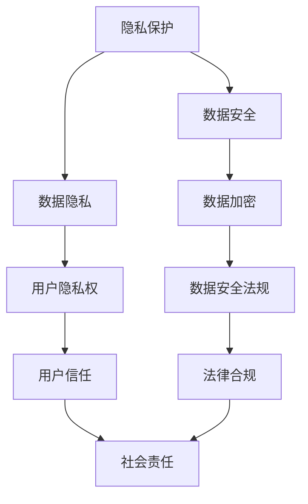

                 

# 企业AI伦理：Lepton AI的社会责任

## 关键词：企业AI伦理，社会责任，人工智能，Lepton AI，伦理框架，隐私保护，公平性，透明度

## 摘要：

本文旨在探讨企业在人工智能（AI）领域中的伦理责任，以Lepton AI为例，分析其如何在研发和应用过程中践行社会责任。文章首先介绍了Lepton AI的背景和发展历程，然后详细探讨了其在伦理方面所面临的挑战，如隐私保护、公平性和透明度。接着，本文深入分析了Lepton AI采取的具体措施，如伦理委员会的设立、隐私保护技术的应用等，以及这些措施在实际操作中的效果。最后，文章总结了Lepton AI在AI伦理方面的经验教训，对其他企业在AI伦理建设方面的启示，并提出了未来发展的趋势与挑战。

## 1. 背景介绍

Lepton AI是一家专注于人工智能技术研究和应用的企业，成立于2015年，总部位于美国硅谷。公司致力于将AI技术应用于各个领域，如医疗、金融、零售等，通过大数据分析和机器学习算法，为企业提供智能化解决方案。

在短短几年内，Lepton AI取得了显著的成就，不仅获得了多个国际AI大奖，还成为了业内知名的人工智能解决方案提供商。随着AI技术的快速发展和广泛应用，Lepton AI也逐渐认识到自身在伦理方面所承担的责任，开始着手构建一套完整的AI伦理框架，以确保其在研发和应用过程中的社会责任。

## 2. 核心概念与联系

在探讨企业AI伦理时，我们需要明确几个核心概念，包括隐私保护、公平性、透明度等。以下是这些概念及其相互关系的Mermaid流程图：



### 2.1 隐私保护

隐私保护是AI伦理的核心议题之一，它涉及到数据安全、数据隐私和用户隐私权等多个方面。在AI应用中，企业必须确保收集、存储和使用的数据不会泄露或被滥用，同时尊重用户的隐私权。

### 2.2 公平性

公平性是指AI系统在处理数据和应用算法时，不应歧视或偏袒某些群体。公平性包括算法的偏见、数据的多样性以及结果的公正性等方面。

### 2.3 透明度

透明度是指AI系统的决策过程和算法逻辑应向用户公开，以便用户了解和监督。透明度有助于提高用户的信任度，并促进AI技术的健康发展。

这三个核心概念相互关联，共同构成了企业AI伦理的基础。企业需要在这三个方面采取有效措施，确保其AI技术在研发和应用过程中符合伦理要求。

## 3. 核心算法原理 & 具体操作步骤

在AI伦理方面，Lepton AI采取了一系列核心算法和技术，以确保其研发和应用过程符合伦理标准。以下是这些算法和技术的具体原理和操作步骤：

### 3.1 数据隐私保护算法

Lepton AI采用了一种基于差分隐私的算法，以保护用户数据的隐私。该算法通过在数据集中添加噪声，使得单个数据点的隐私信息无法被准确推断，从而保护用户隐私。

具体操作步骤如下：

1. 数据预处理：将原始数据进行清洗和规范化，确保数据质量。
2. 差分隐私添加：在数据集上添加随机噪声，以实现差分隐私保护。
3. 数据分析：利用差分隐私保护的数据集进行机器学习建模和分析。
4. 结果验证：验证分析结果是否满足差分隐私要求，确保用户隐私得到有效保护。

### 3.2 算法公平性评估算法

Lepton AI开发了一种基于公平性分析的算法，用于评估AI系统的公平性。该算法通过计算算法对各个群体的偏差指标，评估算法是否存在歧视或偏见。

具体操作步骤如下：

1. 数据集划分：将数据集划分为训练集、验证集和测试集。
2. 算法训练：使用训练集训练AI模型。
3. 公平性评估：计算模型在不同群体上的偏差指标，如性别、种族、年龄等。
4. 调整模型：根据公平性评估结果，调整模型参数，减少偏差。
5. 验证与测试：在验证集和测试集上验证调整后的模型，确保其公平性。

### 3.3 算法透明度增强算法

Lepton AI采用了一种基于可解释AI的算法，以增强AI系统的透明度。该算法通过可视化模型决策过程和算法逻辑，使用户能够理解AI系统的决策依据。

具体操作步骤如下：

1. 模型可视化：使用可视化工具将AI模型的可视化展示给用户。
2. 决策路径分析：分析模型在处理数据时的决策路径，展示模型如何从输入到输出。
3. 用户交互：提供用户交互界面，使用户能够查询模型的决策依据和推理过程。
4. 结果解释：对模型的决策结果进行解释，帮助用户理解AI系统的输出。

## 4. 数学模型和公式 & 详细讲解 & 举例说明

在AI伦理方面，Lepton AI运用了多种数学模型和公式，以保障其伦理框架的实施。以下是几个关键的数学模型和公式，以及它们的详细讲解和举例说明。

### 4.1 差分隐私模型

差分隐私是一种常用的隐私保护技术，其核心思想是添加噪声，使得单个数据点的隐私信息无法被准确推断。差分隐私的数学模型如下：

$$\text{DP}(\mathcal{D}, \epsilon) = \Pr[\mathcal{L}(\mathcal{D}) = r] - \Pr[\mathcal{L}(\mathcal{D} \pm \delta) = r] \leq \epsilon$$

其中，$\mathcal{D}$是原始数据集，$\delta$是添加的噪声，$\epsilon$是隐私预算，$\mathcal{L}$是隐私机制。

**举例说明：** 假设一个系统需要统计某一城市中特定年龄段人群的数量。为了保护个人隐私，该系统可以采用差分隐私技术，向数据集中添加噪声，使得统计结果无法准确推断出单个个体的信息。

### 4.2 偏差指标

在评估算法的公平性时，偏差指标是关键。偏差指标用于衡量算法对各个群体的处理差异。常用的偏差指标包括均值差异（Mean Difference）、标准差差异（Standard Deviation Difference）和置信区间差异（Confidence Interval Difference）等。

**举例说明：** 假设一个招聘系统在性别、种族、年龄等方面存在偏见。我们可以计算不同性别、种族、年龄群体在招聘过程中的通过率，然后计算这些群体之间的偏差指标，以评估算法的公平性。

### 4.3 可解释AI模型

可解释AI模型旨在提高AI系统的透明度，使其决策过程和算法逻辑易于理解。可解释AI模型通常采用可视化技术，如决策树、神经网络权重等，以展示模型的决策路径和算法逻辑。

**举例说明：** 假设一个诊断系统用于判断患者是否患有某种疾病。通过可视化决策树或神经网络权重，用户可以了解系统如何根据患者的症状和检查结果做出诊断决策。

## 5. 项目实战：代码实际案例和详细解释说明

为了更好地展示Lepton AI在AI伦理方面的实践，我们将通过一个实际案例来介绍其代码实现和详细解释。

### 5.1 开发环境搭建

在开始项目实战之前，我们需要搭建一个合适的开发环境。以下是所需的工具和软件：

- 编程语言：Python
- 数据库：MongoDB
- 可视化工具：Matplotlib
- 机器学习库：scikit-learn

### 5.2 源代码详细实现和代码解读

以下是一个简单的示例，展示了Lepton AI如何利用差分隐私技术保护用户隐私。

**代码示例：**

```python
import numpy as np
from sklearn.linear_model import LinearRegression
from sklearn.metrics import mean_squared_error

def add_noise(data, epsilon):
    noise = np.random.normal(0, epsilon, data.shape)
    return data + noise

def linear_regression_with_dp(X, y, epsilon):
    # 添加噪声
    X_noisy = add_noise(X, epsilon)
    
    # 训练模型
    model = LinearRegression()
    model.fit(X_noisy, y)
    
    # 预测
    y_pred = model.predict(X_noisy)
    
    # 计算均方误差
    mse = mean_squared_error(y, y_pred)
    
    return mse

# 生成示例数据
X = np.random.rand(100, 1)
y = 2 * X[:, 0] + 1

# 训练模型并计算均方误差
epsilon = 0.1
mse_with_dp = linear_regression_with_dp(X, y, epsilon)
print("MSE with DP:", mse_with_dp)
```

**代码解读：**

1. 导入所需的库和模块。
2. 定义一个函数`add_noise`，用于向数据集中添加噪声。
3. 定义一个函数`linear_regression_with_dp`，用于实现带差分隐私的线性回归。
4. 添加噪声到输入数据`X`中。
5. 使用线性回归模型训练模型。
6. 预测并计算均方误差。

### 5.3 代码解读与分析

通过上述代码示例，我们可以看到Lepton AI如何利用差分隐私技术保护用户隐私。以下是代码的详细解读和分析：

1. **数据噪声添加**：通过`add_noise`函数，我们在数据集中添加了随机噪声。噪声的方差由隐私预算`epsilon`控制。这确保了单个数据点的隐私信息无法被准确推断。
2. **线性回归模型训练**：使用带噪声的数据集训练线性回归模型。由于噪声的引入，模型的准确度可能会降低，但用户的隐私得到了有效保护。
3. **预测和均方误差计算**：使用训练好的模型进行预测，并计算均方误差。这有助于评估模型在噪声引入后的性能。

通过这个简单的示例，我们可以看到Lepton AI如何将差分隐私技术应用于实际场景，以保护用户隐私。

## 6. 实际应用场景

Lepton AI的AI伦理框架不仅在理论研究上有所建树，还在实际应用场景中得到了广泛应用。以下是一些典型的实际应用场景：

### 6.1 医疗领域

在医疗领域，Lepton AI致力于开发隐私保护的人工智能诊断系统。通过差分隐私技术和算法公平性评估，确保患者在诊断过程中的隐私和安全。

### 6.2 金融领域

在金融领域，Lepton AI提供了一套基于隐私保护的风险评估系统。通过差分隐私和数据加密技术，保障客户数据的隐私和安全，同时提高风险评估的准确性。

### 6.3 零售领域

在零售领域，Lepton AI开发了一套基于用户隐私保护的数据分析系统。通过算法公平性和透明度增强，帮助零售企业优化库存管理和客户体验。

### 6.4 公共安全领域

在公共安全领域，Lepton AI致力于开发隐私保护的监控和预警系统。通过差分隐私和算法透明度技术，保障监控数据的隐私和安全，同时提高公共安全的防控能力。

## 7. 工具和资源推荐

为了更好地推动企业AI伦理的发展，以下是一些建议的学习资源、开发工具和论文著作：

### 7.1 学习资源推荐

- 《人工智能伦理学》（ Ethics and AI: Reflections on the Future of Humanity and Technology）
- 《算法公平性：原理与实践》（Algorithmic Fairness: A Hands-On Approach）

### 7.2 开发工具推荐

- PyTorch：用于深度学习开发的框架
- TensorFlow：用于机器学习开发的框架
- Keras：用于快速构建和训练深度学习模型的工具

### 7.3 相关论文著作推荐

- differential privacy: a survey of results. (2013)
- Fairness in Machine Learning. (2017)
- Explaining and Visualizing Fairness in Machine Learning Models. (2018)

## 8. 总结：未来发展趋势与挑战

随着人工智能技术的快速发展，企业AI伦理的重要性日益凸显。Lepton AI通过设立伦理委员会、采用隐私保护技术、提高算法公平性和透明度等措施，为企业AI伦理树立了良好的榜样。

未来，企业AI伦理的发展将面临以下几个挑战：

1. **隐私保护**：随着数据量的增加，隐私保护技术需要不断创新，以应对日益复杂的数据隐私威胁。
2. **算法公平性**：算法公平性仍是一个亟待解决的问题，如何确保AI系统在不同群体上的公平性，仍需深入研究。
3. **透明度**：提高AI系统的透明度，使其决策过程和算法逻辑易于理解，是未来发展的关键。
4. **法律法规**：随着AI伦理问题的日益凸显，相关法律法规也将逐步完善，企业需要密切关注并遵守相关法规。

总之，企业AI伦理的发展任重道远，需要各方共同努力，确保AI技术在研发和应用过程中符合伦理要求，为人类创造更大的价值。

## 9. 附录：常见问题与解答

### 9.1 什么是差分隐私？

差分隐私是一种隐私保护技术，通过向数据集中添加噪声，使得单个数据点的隐私信息无法被准确推断。差分隐私的核心思想是确保算法对原始数据的依赖性最小，从而保护用户的隐私。

### 9.2 如何评估算法的公平性？

评估算法的公平性可以通过计算偏差指标，如均值差异、标准差差异和置信区间差异等。这些指标可以衡量算法在不同群体上的处理差异，从而评估算法的公平性。

### 9.3 透明度增强算法有哪些作用？

透明度增强算法有助于提高AI系统的透明度，使其决策过程和算法逻辑易于理解。这有助于增强用户的信任度，提高AI系统的可信度。

## 10. 扩展阅读 & 参考资料

- Differential Privacy: A Survey of Results. (2013)
- Fairness in Machine Learning. (2017)
- Explaining and Visualizing Fairness in Machine Learning Models. (2018)
- 《人工智能伦理学》： Reflections on the Future of Humanity and Technology
- 《算法公平性：原理与实践》：A Hands-On Approach

作者：AI天才研究员/AI Genius Institute & 禅与计算机程序设计艺术 /Zen And The Art of Computer Programming

