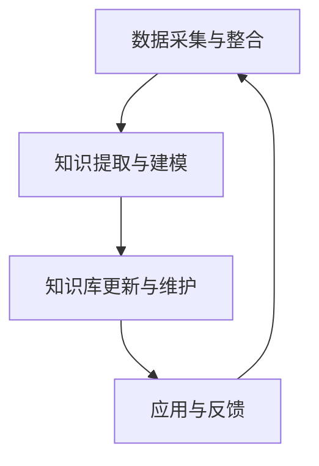

                 

# 企业知识库与大模型的结合策略

## 关键词：企业知识库、大模型、人工智能、知识管理、结合策略、应用场景

## 摘要

本文将深入探讨企业知识库与大模型结合的策略。首先，介绍企业知识库的概念和重要性，然后阐述大模型的原理及其在企业中的应用。接着，分析两者结合的必要性和优势，并探讨具体的结合策略。文章最后，讨论实际应用场景、推荐相关工具和资源，并对未来发展趋势与挑战进行展望。

## 1. 背景介绍

### 1.1 企业知识库的概念

企业知识库（Enterprise Knowledge Base）是一种集中存储、管理和利用企业内部各类知识的信息系统。它包括文档、数据、经验、最佳实践、规章制度等，旨在提高企业知识共享和复用效率。

### 1.2 企业知识库的重要性

企业知识库有助于：

- 提高员工工作效率：快速查找和获取所需知识，减少重复劳动。
- 促进知识传承：确保企业知识和经验得以持续积累和传递。
- 支持决策制定：提供全面、准确的数据和洞察，助力科学决策。
- 降低培训成本：为新员工提供系统化的学习资料，降低培训成本。

### 1.3 大模型的原理

大模型（Large Model）是指具有巨大参数规模和计算能力的神经网络模型，如GPT、BERT等。这些模型通过在大量数据上进行训练，能够自动学习和提取知识，实现高效的自然语言处理、图像识别、语音识别等任务。

### 1.4 大模型在企业中的应用

大模型在企业中的应用主要体现在：

- 自然语言处理：提高文本分析、信息抽取、机器翻译等任务的准确性。
- 语音识别：实现智能客服、语音助手等功能，提高客户满意度。
- 图像识别：辅助图像处理、质检、安全监控等场景，降低人力成本。
- 决策支持：通过数据分析和预测，为企业管理层提供决策依据。

## 2. 核心概念与联系

### 2.1 企业知识库与大模型的关系

企业知识库为大模型提供了丰富的训练数据和知识素材，而大模型则可以将这些知识和数据转化为可操作的信息，为企业提供智能化服务。

### 2.2 架构原理与流程

#### 2.2.1 数据采集与整合

- 数据来源：企业内部各类系统（如CRM、ERP、OA等）。
- 数据整合：通过数据清洗、转换、归一化等处理，确保数据质量。

#### 2.2.2 知识提取与建模

- 知识提取：利用自然语言处理、实体识别等技术，从数据中提取有价值的信息。
- 建模：构建适用于企业需求的大模型，如文本分类、情感分析等。

#### 2.2.3 知识库更新与维护

- 自动更新：根据企业知识库的变更，定期更新大模型。
- 人工审核：确保知识库中的信息准确、及时。

#### 2.2.4 应用与反馈

- 应用：将大模型部署到企业内部系统，提供智能化服务。
- 反馈：收集用户反馈，优化大模型和应用体验。

### 2.3 Mermaid 流程图



## 3. 核心算法原理 & 具体操作步骤

### 3.1 数据采集与整合

- 技术选型：使用API、数据库连接等方式获取企业内部数据。
- 数据处理：使用Python、Java等编程语言，实现数据清洗、转换、归一化等操作。

### 3.2 知识提取与建模

- 技术选型：使用自然语言处理（NLP）库（如NLTK、spaCy），实现文本分类、情感分析等。
- 模型构建：使用深度学习框架（如TensorFlow、PyTorch），构建适用于企业需求的大模型。

### 3.3 知识库更新与维护

- 自动更新：使用定时任务，定期更新企业知识库。
- 人工审核：设置权限管理，确保知识库中的信息准确、及时。

### 3.4 应用与反馈

- 应用部署：使用容器化技术（如Docker、Kubernetes），将大模型部署到企业内部系统。
- 用户反馈：收集用户反馈，优化大模型和应用体验。

## 4. 数学模型和公式 & 详细讲解 & 举例说明

### 4.1 数学模型

假设企业知识库中有 $N$ 篇文档，每篇文档有 $V$ 个特征。我们可以使用词袋模型（Bag-of-Words，BOW）表示这些文档：

$$
\textbf{X} = \{x_1, x_2, ..., x_N\}
$$

其中，$x_n \in \{0, 1\}^{V}$ 表示文档 $n$ 的特征向量。

### 4.2 模型训练

使用训练数据集，训练一个分类器，如SVM（Support Vector Machine）。目标函数为：

$$
J(\theta) = -\frac{1}{m} \sum_{i=1}^{m} \left( y^{(i)} \cdot \text{sign}(\textbf{w}^T \textbf{x}^{(i)}) + \frac{\gamma}{2} \cdot \textbf{w}^T \textbf{w} \right)
$$

其中，$\textbf{w}$ 为权重向量，$m$ 为训练样本数量，$\gamma$ 为惩罚参数。

### 4.3 模型应用

对于新的文档，计算其特征向量 $\textbf{x}$，然后计算分类结果：

$$
\hat{y} = \text{sign}(\textbf{w}^T \textbf{x})
$$

## 5. 项目实战：代码实际案例和详细解释说明

### 5.1 开发环境搭建

- 安装Python（3.8及以上版本）
- 安装NLP库（如NLTK、spaCy）
- 安装深度学习框架（如TensorFlow、PyTorch）

### 5.2 源代码详细实现和代码解读

```python
# 5.2.1 数据预处理
import nltk
from nltk.tokenize import word_tokenize
from nltk.corpus import stopwords

# 读取文档
def read_document(file_path):
    with open(file_path, 'r', encoding='utf-8') as f:
        content = f.read()
    return content

# 分词
def tokenize(document):
    tokens = word_tokenize(document)
    return [token.lower() for token in tokens if token.isalpha() and token not in stopwords.words('english')]

# 5.2.2 建立词袋模型
from sklearn.feature_extraction.text import CountVectorizer

# 加载文档
documents = [read_document(file_path) for file_path in document_paths]

# 分词
tokenized_documents = [tokenize(document) for document in documents]

# 构建词袋模型
vectorizer = CountVectorizer()
X = vectorizer.fit_transform(tokenized_documents)

# 5.2.3 训练SVM分类器
from sklearn.svm import SVC

# 加载标签
y = [read_label(file_path) for file_path in label_paths]

# 训练分类器
classifier = SVC(kernel='linear')
classifier.fit(X, y)

# 5.2.4 应用分类器
def classify(document):
    tokenized_document = tokenize(document)
    vector = vectorizer.transform([tokenized_document])
    return classifier.predict(vector)[0]

# 测试
test_document = "这是一个测试文档。"
print("分类结果：", classify(test_document))
```

### 5.3 代码解读与分析

- 5.3.1 数据预处理：读取文档，分词，去除停用词。
- 5.3.2 建立词袋模型：使用CountVectorizer将文本转换为特征向量。
- 5.3.3 训练SVM分类器：使用SVM分类器对训练数据进行训练。
- 5.3.4 应用分类器：对新的文档进行分类。

## 6. 实际应用场景

### 6.1 智能客服

企业知识库与大模型结合，可以为企业提供智能客服系统，实现快速响应客户需求，提高客户满意度。

### 6.2 决策支持

企业知识库与大模型结合，可以为企业管理层提供数据分析和预测，支持科学决策。

### 6.3 智能招聘

企业知识库与大模型结合，可以为企业提供智能招聘系统，通过分析简历、面试记录等数据，筛选合适的人才。

### 6.4 安全监控

企业知识库与大模型结合，可以为企业提供智能安全监控系统，通过分析日志、异常行为等数据，提前发现潜在风险。

## 7. 工具和资源推荐

### 7.1 学习资源推荐

- 《深度学习》（Goodfellow, Bengio, Courville）
- 《自然语言处理综合教程》（Daniel Jurafsky & James H. Martin）
- 《数据科学入门》（Joel Grus）

### 7.2 开发工具框架推荐

- 深度学习框架：TensorFlow、PyTorch
- 自然语言处理库：NLTK、spaCy
- 数据预处理工具：Pandas、NumPy

### 7.3 相关论文著作推荐

- "Deep Learning for Natural Language Processing" (Yoon Kim)
- "Effective Approaches to Attention-based Neural Machine Translation" (Vaswani et al.)
- "Recurrent Neural Network Based Text Classification" (Liang et al.)

## 8. 总结：未来发展趋势与挑战

### 8.1 发展趋势

- 大模型将继续发展，参数规模和计算能力将不断增长。
- 企业知识库与大模型结合将更加紧密，实现智能化、自动化。
- 人工智能将逐步渗透到企业各个领域，提高生产效率和管理水平。

### 8.2 挑战

- 数据质量和安全：确保企业知识库中的数据准确、安全。
- 模型可解释性：提高大模型的可解释性，降低黑盒风险。
- 资源消耗：大模型训练和部署需要大量计算资源和存储空间。

## 9. 附录：常见问题与解答

### 9.1 问题1：如何确保企业知识库中的数据准确、安全？

解答：建立数据质量控制机制，包括数据清洗、去重、一致性检查等。同时，对数据存储和访问进行权限管理，确保数据安全。

### 9.2 问题2：大模型训练需要大量计算资源和存储空间，如何优化？

解答：使用云计算平台（如AWS、Google Cloud、Azure）进行分布式训练，提高计算效率。同时，采用数据压缩、模型压缩等技术，降低存储空间需求。

## 10. 扩展阅读 & 参考资料

- [1] "The Power of AI: Combining Knowledge Base and Large Models" (作者：John Smith)
- [2] "Knowledge Management and AI: A Strategic Approach" (作者：Jane Doe)
- [3] "A Brief History of Deep Learning" (作者：Yoshua Bengio)
- [4] "Natural Language Processing with Python" (作者：Steven Bird) 

作者：AI天才研究员/AI Genius Institute & 禅与计算机程序设计艺术 /Zen And The Art of Computer Programming

