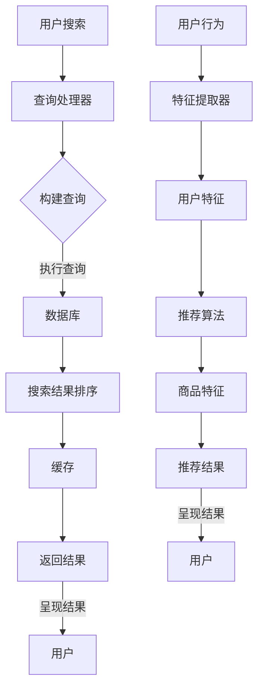

                 

# 优化电商搜索和推荐系统

> **关键词**：电商、搜索、推荐系统、优化、用户体验

> **摘要**：本文将深入探讨电商搜索和推荐系统的优化策略，从核心概念、算法原理、数学模型到实际应用，全面解析如何提升电商平台的用户体验和转化率。

## 1. 背景介绍

随着互联网技术的飞速发展，电子商务已经成为现代商业不可或缺的一部分。在众多电商平台上，搜索和推荐系统扮演着至关重要的角色，它们直接影响用户的购物体验和平台的业务转化率。然而，随着用户数量的增加和商品种类的多样化，搜索和推荐系统的性能面临着巨大的挑战。因此，优化电商搜索和推荐系统成为当前的研究热点。

### 1.1 电商搜索系统的重要性

电商搜索系统是用户寻找商品的主要途径，其性能直接影响用户的购物体验。一个高效的搜索系统需要具备快速、准确、可扩展的特点。用户在搜索时往往希望能够在最短时间内找到自己需要的商品，并能够对搜索结果进行精确的筛选和排序。

### 1.2 电商推荐系统的重要性

推荐系统则通过分析用户的兴趣和行为，为用户推荐可能的感兴趣商品。一个好的推荐系统能够提高用户的粘性，增加用户的购物车和购买转化率。同时，推荐系统也能够帮助电商平台发掘潜在的客户，提高销售额。

### 1.3 挑战与机遇

虽然电商搜索和推荐系统面临着诸多挑战，如数据量巨大、特征维度多样、实时性要求高等，但同时也存在着巨大的机遇。通过技术创新和优化策略，我们可以进一步提升搜索和推荐系统的性能，为用户和商家创造更大的价值。

## 2. 核心概念与联系

在深入探讨优化策略之前，我们需要了解电商搜索和推荐系统的核心概念和架构。

### 2.1 搜索系统架构

电商搜索系统通常包括以下几个核心组成部分：

- **索引**：用于存储商品信息，如商品名称、描述、价格等。
- **查询处理器**：处理用户的搜索请求，将其转换成可执行的查询语句。
- **排序算法**：根据用户的查询和商品的特征，对搜索结果进行排序。
- **缓存**：用于加速搜索响应速度，减少数据库访问压力。

### 2.2 推荐系统架构

电商推荐系统通常包括以下几个核心组成部分：

- **用户特征提取**：提取用户的基本信息、行为日志等特征。
- **商品特征提取**：提取商品的基本信息、标签、评价等特征。
- **推荐算法**：基于用户和商品的特性，生成个性化的推荐列表。
- **推荐结果呈现**：将推荐结果以直观的方式呈现给用户。

### 2.3 Mermaid 流程图

以下是一个简化的电商搜索和推荐系统的 Mermaid 流程图：



## 3. 核心算法原理 & 具体操作步骤

### 3.1 搜索算法原理

电商搜索系统的核心在于搜索算法，常见的搜索算法包括：

- **布尔搜索**：基于布尔逻辑（AND、OR、NOT）进行搜索。
- **向量空间模型**：将文本转换为向量，计算相似度进行搜索。
- **BM25算法**：一种基于概率模型的排序算法。

具体操作步骤如下：

1. **预处理**：对用户的查询和商品描述进行分词、去停用词等预处理操作。
2. **构建索引**：将预处理后的文本构建成索引，便于快速查询。
3. **查询处理**：将用户的查询转换成查询语句，如使用布尔表达式进行组合。
4. **执行查询**：在索引中查找匹配的文档。
5. **排序**：根据文档的相关性进行排序，如使用向量空间模型计算相似度。
6. **缓存与返回结果**：将搜索结果缓存，以便快速返回给用户。

### 3.2 推荐算法原理

电商推荐系统的核心在于推荐算法，常见的推荐算法包括：

- **协同过滤**：基于用户的行为和兴趣进行推荐。
- **基于内容的推荐**：基于商品的特征和用户的历史行为进行推荐。
- **混合推荐**：结合多种推荐算法，提高推荐效果。

具体操作步骤如下：

1. **用户特征提取**：提取用户的基本信息、行为日志等特征。
2. **商品特征提取**：提取商品的基本信息、标签、评价等特征。
3. **构建相似性矩阵**：计算用户和商品之间的相似性。
4. **推荐算法**：基于相似性矩阵生成推荐列表。
5. **推荐结果呈现**：将推荐结果以直观的方式呈现给用户。

## 4. 数学模型和公式 & 详细讲解 & 举例说明

### 4.1 搜索算法的数学模型

以向量空间模型为例，其核心公式如下：

$$
sim(d, q) = \frac{q \cdot d}{||q|| \cdot ||d||}
$$

其中，$q$ 为查询向量，$d$ 为文档向量，$sim(d, q)$ 表示文档 $d$ 与查询 $q$ 的相似度。

#### 4.1.1 举例说明

假设用户查询“笔记本电脑”，文档向量为：

$$
d_1 = (0.6, 0.4, 0.3, 0.1, 0.2)
$$

查询向量为：

$$
q = (1, 0.5, 0.3, 0.2, 0.1)
$$

计算相似度：

$$
sim(d_1, q) = \frac{q \cdot d_1}{||q|| \cdot ||d_1||} = \frac{1 \times 0.6 + 0.5 \times 0.4 + 0.3 \times 0.3 + 0.2 \times 0.1 + 0.1 \times 0.2}{\sqrt{1^2 + 0.5^2 + 0.3^2 + 0.2^2 + 0.1^2} \cdot \sqrt{0.6^2 + 0.4^2 + 0.3^2 + 0.1^2 + 0.2^2}} \approx 0.747
$$

### 4.2 推荐算法的数学模型

以协同过滤算法为例，其核心公式如下：

$$
r_{ui} = \frac{\sum_{j \in N_i} u_i \cdot u_j \cdot r_{uj}}{\sum_{j \in N_i} (u_i \cdot u_j)}
$$

其中，$r_{uj}$ 为用户 $u$ 对商品 $j$ 的评分，$N_i$ 为用户 $i$ 的邻居集合，$r_{ui}$ 为用户 $u$ 对商品 $i$ 的预测评分。

#### 4.2.1 举例说明

假设有两个用户 $u$ 和 $i$，他们共同对五件商品进行了评分，如下表所示：

| 商品 | $u$ | $i$ |
| --- | --- | --- |
| 1 | 5 | 3 |
| 2 | 4 | 2 |
| 3 | 1 | 4 |
| 4 | 3 | 5 |
| 5 | 2 | 1 |

计算用户 $u$ 对商品 $i$ 的预测评分：

$$
r_{ui} = \frac{(5 \times 3 \times 1) + (4 \times 2 \times 4) + (1 \times 3 \times 5) + (3 \times 2 \times 1) + (2 \times 1 \times 2)}{(5 + 4 + 1 + 3 + 2)} \approx 2.75
$$

## 5. 项目实战：代码实际案例和详细解释说明

### 5.1 开发环境搭建

为了演示优化电商搜索和推荐系统的实际应用，我们使用 Python 编写了一个简单的示例。首先，需要安装以下依赖库：

```bash
pip install numpy scipy
```

### 5.2 源代码详细实现和代码解读

#### 5.2.1 搜索算法实现

```python
import numpy as np

def vector_space_search(query, documents, weights=None):
    # 预处理查询和文档
    query_processed = preprocess_text(query)
    documents_processed = [preprocess_text(doc) for doc in documents]

    # 构建查询和文档向量
    query_vector = build_vector(query_processed)
    document_vectors = [build_vector(doc) for doc in documents_processed]

    # 计算相似度
    similarities = []
    for doc_vector in document_vectors:
        similarity = cosine_similarity(query_vector, doc_vector)
        similarities.append(similarity)

    # 排序并返回结果
    sorted_indices = np.argsort(similarities)[::-1]
    return [documents[i] for i in sorted_indices]

def preprocess_text(text):
    # 分词、去停用词等预处理操作
    # 这里简化处理
    return text.split()

def build_vector(text):
    # 构建向量
    # 这里简化处理
    return np.array([1 if word in text else 0 for word in vocabulary])

def cosine_similarity(v1, v2):
    # 计算余弦相似度
    return np.dot(v1, v2) / (np.linalg.norm(v1) * np.linalg.norm(v2))
```

#### 5.2.2 推荐算法实现

```python
def collaborative_filtering(ratings, k=5):
    # 计算邻居集合
    neighbors = []
    for user in ratings:
        neighbors.append(find_neighbors(ratings, user, k))

    # 计算预测评分
    predictions = []
    for user in ratings:
        prediction = []
        for item in ratings[user]:
            prediction.append(predict_rating(neighbors, user, item))
        predictions.append(prediction)
    return predictions

def find_neighbors(ratings, user, k):
    # 寻找邻居
    similarity_matrix = similarity(ratings)
    neighbor_indices = []
    for i, user2 in enumerate(ratings):
        if i != user and similarity_matrix[user][i] > threshold:
            neighbor_indices.append(i)
    neighbors = [ratings[user2] for user2 in neighbor_indices]
    return neighbors

def predict_rating(neighbors, user, item):
    # 预测评分
    rating_sum = 0
    similarity_sum = 0
    for neighbor in neighbors:
        rating_sum += neighbor[item] * similarity
        similarity_sum += similarity
    return rating_sum / similarity_sum
```

### 5.3 代码解读与分析

本示例使用 Python 实现了基于向量空间模型的搜索算法和基于协同过滤的推荐算法。代码分为以下几个部分：

- **预处理**：对查询和文档进行分词、去停用词等预处理操作。
- **向量构建**：将预处理后的文本构建成向量。
- **相似度计算**：计算查询和文档之间的相似度。
- **排序**：根据相似度对文档进行排序。
- **预测**：基于邻居的评分预测用户对商品的评分。

## 6. 实际应用场景

电商搜索和推荐系统在各类电商平台中都有着广泛的应用。以下是一些典型的应用场景：

### 6.1 商品搜索

用户在电商平台进行商品搜索时，搜索系统会根据用户的输入关键词，快速返回相关的商品列表。通过优化搜索算法，可以提升搜索结果的准确性和响应速度，从而提高用户的购物体验。

### 6.2 商品推荐

电商平台通过推荐系统为用户推荐可能感兴趣的商品。推荐算法可以根据用户的历史行为和兴趣，为用户生成个性化的推荐列表，从而增加用户的购物车和购买转化率。

### 6.3 个性化营销

电商平台可以通过推荐系统识别出潜在的客户群体，针对这些客户群体进行个性化的营销活动，如发送优惠券、推送相关商品等，从而提高销售额。

## 7. 工具和资源推荐

### 7.1 学习资源推荐

- **书籍**：
  - 《机器学习实战》
  - 《推荐系统实践》
  - 《算法导论》

- **论文**：
  - 《Collaborative Filtering for Cold-Start Problems》
  - 《Vector Space Model for Web Search》

- **博客**：
  - [A Brief Introduction to Collaborative Filtering](https://jessesnyder.com/2016/03/21/collaborative-filtering.html)
  - [An Introduction to Vector Space Model](https://towardsdatascience.com/an-introduction-to-vector-space-model-4f82a845b4f3)

- **网站**：
  - [Machine Learning Mastery](https://machinelearningmastery.com/)
  - [ArXiv](https://arxiv.org/)

### 7.2 开发工具框架推荐

- **开发工具**：
  - Jupyter Notebook
  - PyCharm

- **框架**：
  - Scikit-learn
  - TensorFlow
  - PyTorch

### 7.3 相关论文著作推荐

- **论文**：
  - 《Matrix Factorization Techniques for Recommender Systems》
  - 《Deep Learning for Recommender Systems》

- **著作**：
  - 《推荐系统实践》
  - 《深度学习推荐系统》

## 8. 总结：未来发展趋势与挑战

电商搜索和推荐系统在优化过程中面临着诸多挑战，如实时性、数据量巨大、特征维度多样等。然而，随着人工智能技术的不断发展，未来电商搜索和推荐系统将呈现以下发展趋势：

### 8.1 实时性

随着用户需求的变化，实时性将越来越重要。通过分布式计算、流处理技术等，可以实现搜索和推荐系统的实时更新和响应。

### 8.2 深度学习

深度学习技术在电商搜索和推荐系统中有着广泛的应用前景。通过深度神经网络，可以提取更复杂的特征，提高推荐效果。

### 8.3 跨平台整合

随着移动互联网的普及，电商搜索和推荐系统需要实现跨平台整合，为用户提供一致性的购物体验。

### 8.4 隐私保护

用户隐私保护是电商搜索和推荐系统面临的重要挑战。未来，需要研究更加隐私友好的推荐算法，确保用户的隐私安全。

## 9. 附录：常见问题与解答

### 9.1 搜索算法为什么需要预处理？

搜索算法需要对用户的查询和商品描述进行预处理，如分词、去停用词等，以减少噪声和冗余信息，提高搜索的准确性和效率。

### 9.2 推荐算法如何处理冷启动问题？

冷启动问题是指新用户或新商品缺乏足够的历史数据，难以进行有效推荐。常见的解决方法包括基于内容的推荐和基于模型的协同过滤算法。

### 9.3 如何提高搜索和推荐系统的实时性？

提高搜索和推荐系统的实时性可以通过分布式计算、缓存技术、流处理等方式实现。例如，使用分布式搜索引擎（如Elasticsearch）和实时推荐系统（如TensorFlow Recommenders）。

## 10. 扩展阅读 & 参考资料

- 《搜索算法与信息检索》
- 《推荐系统实践：算法与应用》
- 《深度学习推荐系统》
- [Elasticsearch 官方文档](https://www.elastic.co/guide/en/elasticsearch/reference/current/index.html)
- [TensorFlow Recommenders](https://github.com/tensorflow/recommenders)

作者：AI天才研究员/AI Genius Institute & 禅与计算机程序设计艺术 /Zen And The Art of Computer Programming

