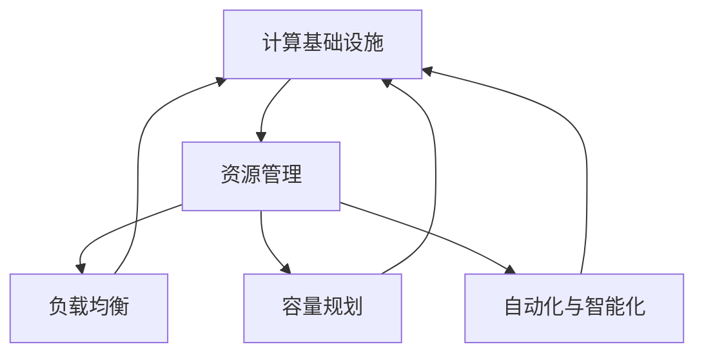

                 

### 背景介绍

#### 优化计算基础设施的必要性

在当今数字化时代，计算基础设施作为支撑企业业务和服务的基石，其性能和效率直接影响到业务的竞争力和用户体验。随着云计算、大数据、人工智能等技术的迅猛发展，数据量和计算需求呈现出爆炸式增长，传统的计算基础设施已难以满足不断增长的业务需求。

首先，数据量的激增带来了存储和计算压力。企业需要处理海量数据，包括结构化数据和非结构化数据，这些数据需要在存储和计算过程中得到有效的管理和处理。传统的计算基础设施往往难以应对如此庞大的数据规模，容易出现性能瓶颈。

其次，计算需求的多样化也增加了基础设施的复杂性。企业不仅需要处理传统的业务数据，还需要处理实时数据流、图像处理、机器学习等复杂计算任务。这些任务对计算资源的实时性和可靠性提出了更高的要求。

最后，市场竞争的加剧使得企业需要不断提升其业务响应速度和服务质量。为了在竞争中脱颖而出，企业需要优化计算基础设施，提高资源利用率，降低运营成本，并提供更高质量的服务。

#### 现有计算基础设施的问题

尽管计算基础设施在技术和硬件方面不断进步，但仍然存在一些亟待解决的问题：

1. **资源利用率低**：传统的计算基础设施往往采用静态分配资源的方式，导致资源利用率低下。当业务需求波动时，资源供需不平衡，导致资源浪费或性能下降。

2. **扩展性差**：许多传统的计算系统在扩展性方面存在瓶颈，难以适应业务需求的快速增长。扩展性差不仅影响了系统的性能，也增加了维护和升级的难度。

3. **可维护性差**：随着计算基础设施的复杂化，系统维护和管理的难度也在增加。传统的系统往往缺乏良好的模块化和标准化设计，使得故障排除和系统升级变得复杂和耗时。

4. **成本高**：传统的计算基础设施在硬件采购、运维和管理方面存在较高的成本。此外，硬件设备的过快淘汰也增加了企业的运营成本。

#### 优化计算基础设施的紧迫性

因此，优化计算基础设施已成为企业必须面对的紧迫任务。优化不仅有助于提升业务效率和竞争力，还能降低运营成本，提高资源利用率。以下是优化计算基础设施的几个紧迫性方面：

1. **提高性能**：优化计算基础设施可以提升数据处理速度和系统响应时间，从而提高业务运行效率。

2. **降低成本**：通过提高资源利用率和优化硬件采购，企业可以显著降低运营成本。

3. **增强灵活性**：优化后的计算基础设施可以更好地适应业务需求的变动，提供更灵活的扩展性和可维护性。

4. **提升用户体验**：优化的计算基础设施能够提供更高质量的服务，满足用户对速度、稳定性和安全性的要求。

5. **支持技术创新**：优化的基础设施为企业的技术创新提供了坚实的基础，使得企业能够更好地把握市场机遇。

综上所述，优化计算基础设施不仅是应对当前挑战的必要举措，也是企业长远发展的关键战略。接下来，我们将进一步探讨优化计算基础设施的核心概念、算法原理和实施步骤，帮助读者深入了解这一重要课题。

### 核心概念与联系

在深入探讨优化计算基础设施的策略之前，我们需要明确几个关键概念及其相互联系。以下是核心概念的定义和它们在计算基础设施中的重要作用：

#### 1. 计算基础设施

计算基础设施是指支撑企业业务运行的计算资源，包括硬件设备（如服务器、存储设备、网络设备等）、软件系统（如操作系统、数据库、应用软件等）以及服务和管理平台。计算基础设施是业务运行的物理和技术基础，其性能和效率直接影响到业务的运行效果。

#### 2. 资源管理

资源管理是指对计算基础设施中的各种资源进行有效分配和优化，以满足业务需求。资源管理包括硬件资源（如CPU、内存、存储等）和软件资源（如数据库连接、网络带宽等）的管理。通过资源管理，可以最大化资源利用效率，降低运营成本，并提高系统性能。

#### 3. 负载均衡

负载均衡是指通过合理的调度策略，将计算任务分配到不同的计算节点上，以避免单个节点过载，提高系统的整体性能。负载均衡技术可以分布在网络层面、应用层面和数据库层面，确保计算任务的高效执行。

#### 4. 容量规划

容量规划是指根据业务需求预测和计算资源利用率，对计算基础设施的规模和配置进行合理规划。通过容量规划，可以确保系统在面临高峰业务时不会出现性能瓶颈，同时避免资源过剩导致的浪费。

#### 5. 自动化与智能化

自动化与智能化是指利用自动化工具和人工智能技术，对计算基础设施进行自动化管理和优化。自动化技术可以减少人为干预，提高管理效率；而智能化技术可以通过数据分析和预测，提供更精准的资源管理策略。

#### 关联与相互作用

上述核心概念之间相互关联，共同作用于优化计算基础设施的过程。资源管理是优化计算基础设施的核心，它需要借助负载均衡技术来分配资源，并依据容量规划进行资源的动态调整。自动化与智能化则通过智能化算法和自动化工具，进一步提升资源管理的效率和准确性。

以下是一个简化的 Mermaid 流程图，展示了这些核心概念之间的相互作用：



在这个流程图中，计算基础设施作为整体系统，通过资源管理、负载均衡、容量规划以及自动化与智能化技术，实现基础设施的优化。资源管理是核心，它与其他概念紧密相连，共同推动计算基础设施的性能提升。

接下来，我们将深入探讨优化计算基础设施的核心算法原理和具体操作步骤，以便读者能够更全面地了解这一领域的实践方法。

### 核心算法原理 & 具体操作步骤

优化计算基础设施的核心算法通常基于几个基本原理，包括动态资源分配、负载均衡和智能化预测。以下是这些算法的基本原理和具体操作步骤：

#### 动态资源分配

动态资源分配算法通过实时监控系统的资源使用情况，动态调整资源的分配，以最大化资源利用率和系统性能。具体步骤如下：

1. **资源监控**：首先，系统需要实时监控计算资源的使用情况，包括CPU利用率、内存使用率、存储空间利用率等。这些数据可以通过系统监控工具（如Prometheus、Grafana等）收集。

2. **资源评估**：根据监控数据，系统评估当前资源的利用率。如果某个资源（如CPU或内存）的使用率超过预设的阈值，则认为该资源处于高负载状态。

3. **资源调整**：系统根据资源评估结果，动态调整资源的分配。例如，可以通过虚拟化技术（如KVM、VMware等）增加或减少虚拟机的资源分配，或者通过容器编排工具（如Kubernetes）调整容器资源限制。

4. **反馈机制**：系统需要建立反馈机制，监控资源调整后的效果，并根据反馈结果进行进一步优化。例如，如果调整后资源利用率下降，可以进一步增加资源分配；反之，则适当减少。

#### 负载均衡

负载均衡算法通过合理的调度策略，将计算任务分配到不同的计算节点上，避免单点过载，提高系统的整体性能。具体步骤如下：

1. **任务接收**：系统接收新的计算任务，这些任务可以来自外部用户请求或内部业务流程。

2. **负载评估**：系统对各个计算节点的负载情况进行评估，包括CPU利用率、内存使用率、网络带宽等。评估数据可以通过监控工具实时获取。

3. **调度策略**：根据负载评估结果，系统选择一个负载较低的节点分配新任务。常见的调度策略包括轮询调度、最小连接数调度、响应时间调度等。

4. **任务分配**：系统将新任务分配给选定的计算节点，并跟踪任务的执行状态。

5. **动态调整**：系统持续监控任务的执行状态，如果发现某个节点负载过高，则动态调整任务分配策略，重新分配任务以平衡负载。

#### 智能化预测

智能化预测算法通过分析历史数据和实时数据，预测未来的业务需求和资源需求，从而提前进行资源规划和优化。具体步骤如下：

1. **数据收集**：系统收集历史业务数据和实时监控数据，包括用户访问量、交易量、系统负载等。

2. **数据预处理**：对收集到的数据进行清洗、去噪、归一化等处理，以消除数据中的异常值和噪声。

3. **特征工程**：根据业务需求，提取数据中的关键特征，如时间间隔、用户行为、业务类型等。

4. **模型训练**：利用机器学习算法（如时间序列模型、回归模型、聚类模型等）对预处理后的数据进行训练，建立预测模型。

5. **预测结果**：模型根据历史数据和实时数据生成预测结果，预测未来一段时间内的业务需求和资源需求。

6. **资源调整**：根据预测结果，系统提前进行资源规划，如增加虚拟机、调整容器配置、增加存储空间等，以应对未来业务高峰。

通过动态资源分配、负载均衡和智能化预测，计算基础设施可以实现高效的资源利用、负载平衡和业务需求预测，从而提升整体性能和可靠性。这些算法的实现和优化需要依赖先进的监控工具、自动化工具和机器学习技术，为企业提供坚实的技术支持。

### 数学模型和公式 & 详细讲解 & 举例说明

为了深入理解计算基础设施优化中的数学模型和公式，我们将从资源利用率、负载均衡和预测模型三个方面进行详细讲解，并配以实例进行说明。

#### 资源利用率

资源利用率是评估计算基础设施性能的关键指标之一。资源利用率（Resource Utilization，RU）可以通过以下公式计算：

\[ \text{RU} = \frac{\text{实际使用资源}}{\text{总资源}} \]

其中，实际使用资源包括CPU、内存、存储等，而总资源则为计算基础设施中各资源的总量。

**实例**：假设某服务器CPU总容量为8核，当前CPU使用量为6核，则其资源利用率为：

\[ \text{RU} = \frac{6}{8} = 0.75 \]

即75%的CPU资源正在被使用。

#### 负载均衡

负载均衡涉及如何将任务分配到不同的计算节点，以避免单点过载。常见的负载均衡模型包括最小连接数调度和响应时间调度。

**最小连接数调度**：

\[ \text{Node}_{\text{min}} = \arg\min \left\{ \text{Connection}_{i} \right\} \]

其中，Node\_{min}表示当前连接数最少的节点，Connection\_{i}表示第i个节点的当前连接数。

**响应时间调度**：

\[ \text{Response Time}_{\text{min}} = \arg\min \left\{ \text{Response Time}_{i} \right\} \]

其中，ResponseTime\_{min}表示响应时间最短的节点，ResponseTime\_{i}表示第i个节点的响应时间。

**实例**：假设有三个计算节点，其当前连接数和响应时间如下：

| 节点 | 连接数 | 响应时间（ms） |
| ---- | ------ | ------------ |
| A    | 5      | 100          |
| B    | 3      | 150          |
| C    | 4      | 200          |

根据最小连接数调度，Node\_{min}为节点B（连接数最少）。根据响应时间调度，Node\_{min}为节点A（响应时间最短）。

#### 智能化预测

智能化预测通常采用机器学习算法，如时间序列模型和回归模型。以时间序列模型为例，常用的公式是：

\[ \hat{y}_{t} = \alpha \cdot \phi_t + \beta \]

其中，\(\hat{y}_{t}\)表示预测的下一时刻的值，\(\phi_t\)表示时间序列特征，\(\alpha\)和\(\beta\)为模型参数。

**实例**：假设我们有一个时间序列数据，如下表所示：

| 时间（t） | 业务量（y） |
| --------- | ---------- |
| 1         | 20         |
| 2         | 25         |
| 3         | 30         |
| 4         | 35         |
| 5         | 40         |

利用时间序列模型进行预测，可以估计下一时刻（t+1）的业务量。通过模型训练和参数优化，我们可以得到预测值：

\[ \hat{y}_{6} = \alpha \cdot \phi_6 + \beta \]

其中，\(\phi_6\)为第六个时间点的特征，\(\alpha\)和\(\beta\)为训练得到的参数。

#### 综合应用

在实际应用中，这些公式和模型通常需要综合使用，以便实现计算基础设施的优化。例如，我们可以使用资源利用率公式来评估当前系统的性能，使用负载均衡模型来分配计算任务，并使用预测模型来提前规划资源。

**实例**：假设我们根据预测模型预测到下一小时的业务量将增加20%，我们可以根据这一预测结果，提前增加虚拟机资源，确保系统能够应对高峰期的业务需求。同时，通过监控和评估资源利用率，我们可以在实际业务量增加时，动态调整资源分配，以确保系统稳定运行。

通过这些数学模型和公式的应用，我们可以实现计算基础设施的自动化和智能化优化，提高系统的性能和可靠性。

### 项目实战：代码实际案例和详细解释说明

为了更好地展示如何在实际项目中应用计算基础设施优化策略，我们将通过一个具体的代码案例来详细说明开发环境搭建、源代码实现和代码解读。

#### 开发环境搭建

首先，我们需要搭建一个适合进行计算基础设施优化实验的开发环境。以下是搭建环境所需的步骤：

1. **安装虚拟化平台**：我们选择KVM作为虚拟化平台，它能够高效地管理和虚拟化计算资源。安装KVM的步骤如下：
   ```bash
   sudo apt-get update
   sudo apt-get install qemu-kvm libvirt-daemon libvirt-clients bridge-utils
   sudo systemctl start libvirt-bin
   sudo systemctl enable libvirt-bin
   ```

2. **安装容器编排工具**：我们使用Kubernetes（K8s）作为容器编排工具，它能够帮助我们实现动态资源分配和负载均衡。安装Kubernetes的步骤如下：
   ```bash
   curl -s https://get.k8s.io | sh -
   ```

3. **安装监控工具**：为了实时监控系统性能，我们选择Prometheus和Grafana。安装步骤如下：
   ```bash
   sudo apt-get update
   sudo apt-get install apt-transport-https ca-certificates curl
   curl -s https://download.docker.com/linux/ubuntu/gpg | sudo apt-key add -
   add-apt-repository "deb [arch=amd64] https://download.docker.com/linux/ubuntu bionic stable"
   sudo apt-get update
   sudo apt-get install docker-ce
   docker run -d --name prometheus -p 9090:9090 prom/prometheus
   docker run -d --name grafana -p 3000:3000 grafana/grafana
   ```

4. **配置网络**：确保所有服务之间可以正常通信，配置合理的网络策略。可以使用Calico或者Flannel作为网络插件，具体步骤如下：
   ```bash
   kubectl create -f https://docs.projectcalico.org/manifests/calico.yaml
   ```

#### 源代码详细实现和代码解读

接下来，我们将展示一个简单的Kubernetes部署文件（YAML格式），该文件用于部署一个计算服务，并实现动态资源分配和负载均衡。

**Kubernetes部署文件（example-service.yaml）**：

```yaml
apiVersion: apps/v1
kind: Deployment
metadata:
  name: example-service
spec:
  replicas: 3
  selector:
    matchLabels:
      app: example
  template:
    metadata:
      labels:
        app: example
    spec:
      containers:
      - name: example-container
        image: example-image:latest
        resources:
          requests:
            memory: "256Mi"
            cpu: "500m"
          limits:
            memory: "512Mi"
            cpu: "1"
---
apiVersion: v1
kind: Service
metadata:
  name: example-service
spec:
  selector:
    app: example
  ports:
    - protocol: TCP
      port: 80
      targetPort: 8080
  type: LoadBalancer
```

**代码解读**：

- **Deployment对象**：该对象定义了一个名为`example-service`的部署，指定了3个副本（replicas），意味着Kubernetes会启动3个相同容器的实例。
- **Selector**：该字段用于匹配拥有`app: example`标签的Pod，确保Deployment可以正确地管理和更新容器。
- **Container配置**：容器配置指定了容器的名称（`example-container`）、使用的镜像（`example-image:latest`）以及资源请求（requests）和限制（limits）。
  - **Memory Requests and Limits**：内存请求为256Mi，意味着Kubernetes应确保容器有足够的内存可用；内存限制为512Mi，表示容器最多可以使用512Mi内存。
  - **CPU Requests and Limits**：CPU请求为500m（0.5CPU核心），CPU限制为1CPU核心。

- **Service对象**：该对象定义了一个名为`example-service`的服务，类型为`LoadBalancer`，表示Kubernetes应自动配置外部负载均衡器。服务使用选择器匹配部署的Pod，并将流量分配到这些Pod实例上。

#### 代码解读与分析

1. **动态资源分配**：Kubernetes根据容器请求的资源量动态分配计算资源。当系统负载增加时，Kubernetes会根据资源使用情况自动增加Pod副本数，以维持系统性能。
2. **负载均衡**：服务对象使用Kubernetes内置的负载均衡机制，将外部流量分配到不同的Pod实例上。当用户访问服务时，请求会被负载均衡器根据调度策略分配到不同的Pod实例上，从而实现负载均衡。
3. **监控与优化**：通过Prometheus和Grafana监控工具，可以实时监控系统资源使用情况，如CPU利用率、内存使用率、网络流量等。根据监控数据，可以进一步优化资源分配策略和调度策略。

通过这个案例，我们可以看到如何在实际项目中应用计算基础设施优化策略，实现动态资源分配、负载均衡和监控优化。这些策略不仅提高了系统的性能和可靠性，还降低了运营成本，为企业提供了高效、灵活的计算环境。

### 实际应用场景

优化计算基础设施的应用场景非常广泛，几乎覆盖了所有需要高效计算和数据处理的企业和行业。以下是一些典型的应用场景，以及如何通过优化计算基础设施来提高业务效率和用户体验：

#### 1. 云计算服务提供商

云计算服务提供商（如AWS、Azure、Google Cloud等）需要提供高性能、高可用的计算服务。通过优化计算基础设施，云计算服务提供商可以实现以下几个目标：

- **提高资源利用率**：通过动态资源分配和负载均衡，确保计算资源得到充分利用，减少资源浪费。
- **提升服务质量**：通过监控和自动化工具，确保服务的高可用性和快速响应，提高客户满意度。
- **降低运营成本**：通过优化硬件采购和资源管理，降低运营成本，提高利润率。

#### 2. 金融行业

金融行业对数据处理和计算速度有着极高的要求。优化计算基础设施可以帮助金融机构实现以下目标：

- **实时数据处理**：通过负载均衡和自动化资源管理，确保交易数据处理的高效性和实时性。
- **风险控制**：利用高效的计算基础设施，实时分析市场数据，进行风险控制和投资决策。
- **合规性管理**：确保合规性报告和分析的高效生成，满足监管要求。

#### 3. 电子商务平台

电子商务平台需要处理海量的订单和用户请求。优化计算基础设施可以帮助平台实现以下目标：

- **提升用户体验**：通过高效的资源管理和负载均衡，确保用户请求的快速响应，提高用户体验。
- **交易处理速度**：通过动态资源分配，确保交易处理的高效性和准确性。
- **库存管理**：实时处理库存数据，确保库存信息的准确性和及时更新。

#### 4. 制造业

制造业在生产流程中需要处理大量的数据，包括生产数据、质量数据等。优化计算基础设施可以帮助制造业实现以下目标：

- **生产优化**：通过实时数据分析，优化生产流程，提高生产效率。
- **质量控制**：利用高效的计算基础设施，快速分析质量数据，确保产品质量。
- **设备维护**：通过监控和分析设备数据，提前预测设备故障，进行预防性维护。

#### 5. 医疗保健行业

医疗保健行业需要处理大量的医疗数据，包括患者记录、诊断报告等。优化计算基础设施可以帮助医疗保健机构实现以下目标：

- **患者数据管理**：通过高效的计算基础设施，确保患者数据的存储、管理和访问的高效性。
- **诊断分析**：利用高效的计算资源，进行快速、准确的诊断分析。
- **科研支持**：通过强大的计算能力，支持医疗科研和药物研发。

#### 6. 媒体和娱乐行业

媒体和娱乐行业需要处理大量的视频、音频和图像数据。优化计算基础设施可以帮助该行业实现以下目标：

- **内容分发**：通过高效的计算基础设施，实现内容的快速分发和高质量播放。
- **数据存储**：确保大量媒体数据的存储和管理的高效性。
- **数据分析**：通过实时数据分析，优化用户体验和内容推荐。

通过这些实际应用场景可以看出，优化计算基础设施不仅能够提升业务效率和用户体验，还能够降低运营成本，为企业带来显著的经济效益。因此，优化计算基础设施已成为各行业提升竞争力、实现数字化转型的重要策略。

### 工具和资源推荐

为了帮助读者更好地掌握优化计算基础设施的相关知识，以下是一些学习资源、开发工具和推荐论文：

#### 学习资源推荐

1. **书籍**：
   - 《高性能计算基础设施：设计与实践》
   - 《云计算：概念、架构与实务》
   - 《大数据之路：阿里巴巴大数据实践》

2. **在线课程**：
   - Coursera上的“云计算基础”课程
   - Udacity的“分布式系统设计”纳米学位
   - edX上的“大数据分析与处理”课程

3. **博客和网站**：
   - Cloud Native Computing Foundation（CNCF）官方博客
   - Kubernetes官方文档
   - Cloud Academy的云计算课程和学习资源

#### 开发工具推荐

1. **监控工具**：
   - Prometheus
   - Grafana
   - ELK Stack（Elasticsearch, Logstash, Kibana）

2. **容器编排工具**：
   - Kubernetes
   - Docker
   - OpenShift

3. **虚拟化平台**：
   - KVM
   - VMware
   - Hyper-V

#### 相关论文著作推荐

1. **论文**：
   - "The Case for a Hybrid Architectural Model for Cloud Computing"
   - "Energy Efficient Resource Management in Data Centers"
   - "Performance Isolation in Multi-Tenant Systems: Challenges and Solutions"

2. **著作**：
   - 《云原生应用架构》
   - 《大数据系统架构：设计和优化方法》
   - 《深度学习在计算基础设施中的应用》

通过这些资源，读者可以系统地学习和实践优化计算基础设施的相关知识，掌握先进的技术和方法，提升自己在云计算和大数据领域的竞争力。

### 总结：未来发展趋势与挑战

随着云计算、大数据、人工智能等技术的快速发展，优化计算基础设施的重要性日益凸显。未来，优化计算基础设施将呈现出以下几个趋势和面临的挑战：

#### 发展趋势

1. **智能化与自动化**：随着人工智能技术的进步，未来计算基础设施将更加智能化，自动化工具和智能算法将在资源分配、负载均衡和故障预测等方面发挥关键作用。这将大大提高系统的效率和可靠性。

2. **边缘计算**：随着物联网和5G技术的普及，边缘计算成为优化计算基础设施的新热点。通过将计算任务分散到网络边缘，可以减少延迟，提高数据处理的实时性，从而满足高带宽、低延迟的应用需求。

3. **绿色计算**：随着环保意识的提升，绿色计算将成为未来优化计算基础设施的重要方向。通过采用能耗更低的硬件、优化算法和能耗管理策略，可以显著降低计算基础设施的能源消耗。

4. **多租户与安全**：随着云服务的普及，多租户环境中的安全和性能优化成为挑战。未来的计算基础设施需要提供更加安全、隔离的运行环境，确保不同租户的数据安全和业务性能。

#### 挑战

1. **资源利用率**：如何提高计算资源的利用率，避免资源浪费，是未来计算基础设施优化面临的主要挑战之一。动态资源分配和负载均衡技术需要不断发展和完善。

2. **可扩展性**：随着业务需求的增长，计算基础设施需要具备强大的扩展能力。如何设计可扩展的系统架构，支持快速扩展和灵活调整，是优化计算基础设施的重要问题。

3. **安全性与合规性**：多租户环境中的安全性和合规性管理是优化计算基础设施的难点。如何在保障数据安全和隐私的同时，满足不同行业和地区的合规要求，是一个巨大的挑战。

4. **能耗管理**：随着云计算和大数据中心规模的扩大，能耗管理成为优化计算基础设施的关键问题。如何在保证性能的前提下，降低能耗，实现绿色计算，是未来需要重点解决的问题。

#### 结论

优化计算基础设施是一项长期、复杂的任务，需要多方面的技术和管理策略。未来的发展将更加智能化、绿色化和边缘化，同时也将面临诸多挑战。通过不断探索和创新，优化计算基础设施将为企业和行业带来更高的效率和竞争力。

### 附录：常见问题与解答

#### 1. 什么是计算基础设施优化？

计算基础设施优化是指通过技术和管理手段，提高计算资源的利用率、系统性能和可靠性，以满足不断增长的业务需求。优化包括资源分配、负载均衡、自动化管理、能耗控制等方面。

#### 2. 动态资源分配如何工作？

动态资源分配通过实时监控系统的资源使用情况，根据资源需求的变化动态调整资源分配。例如，通过虚拟化技术或容器编排工具，根据当前资源使用情况自动增加或减少虚拟机或容器的资源配额。

#### 3. 负载均衡的主要目标是什么？

负载均衡的主要目标是确保计算任务在多个计算节点之间公平分配，避免单点过载，从而提高系统的整体性能和可靠性。负载均衡还可以提高系统的扩展性和灵活性。

#### 4. 如何监控计算基础设施的性能？

可以通过以下工具和方式监控计算基础设施的性能：
- **系统监控工具**：如Prometheus、Grafana等，用于实时监控CPU利用率、内存使用率、存储空间等关键指标。
- **日志分析工具**：如ELK Stack（Elasticsearch, Logstash, Kibana），用于收集和分析系统日志。
- **自动化工具**：如Kubernetes，用于监控和管理容器和虚拟机的运行状态。

#### 5. 优化计算基础设施的挑战是什么？

优化计算基础设施的挑战包括提高资源利用率、确保系统可扩展性、保障安全性和合规性，以及实现绿色计算，降低能耗等。

#### 6. 边缘计算如何优化计算基础设施？

边缘计算通过在网络的边缘节点（如物联网设备、数据中心边缘）部署计算资源，减少数据传输距离，降低延迟，提高数据处理的实时性。优化边缘计算基础设施需要设计高效的数据处理和资源管理策略。

### 扩展阅读 & 参考资料

为了深入了解计算基础设施优化，以下是推荐的扩展阅读和参考资料：

1. **书籍**：
   - 《云计算：概念、架构与实务》
   - 《大数据系统架构：设计和优化方法》
   - 《深度学习在计算基础设施中的应用》

2. **论文**：
   - "Energy Efficient Resource Management in Data Centers"
   - "Performance Isolation in Multi-Tenant Systems: Challenges and Solutions"
   - "The Case for a Hybrid Architectural Model for Cloud Computing"

3. **在线课程**：
   - Coursera上的“云计算基础”
   - Udacity的“分布式系统设计”纳米学位
   - edX上的“大数据分析与处理”

4. **官方网站和博客**：
   - Kubernetes官方文档
   - Cloud Native Computing Foundation（CNCF）官方博客
   - AWS官方文档中的计算基础设施优化相关内容

通过这些资源和阅读，读者可以进一步了解计算基础设施优化的最新技术和发展动态。

