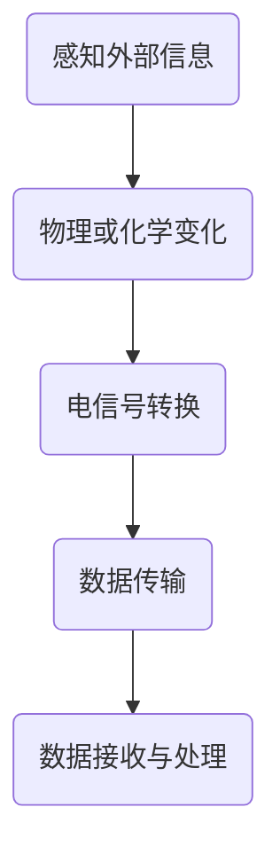
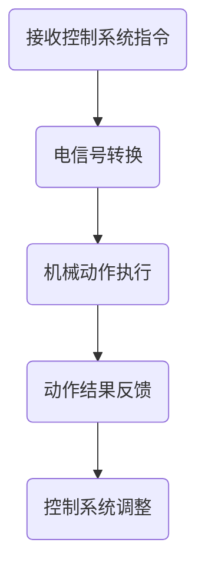
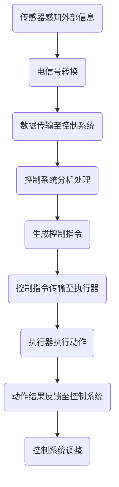
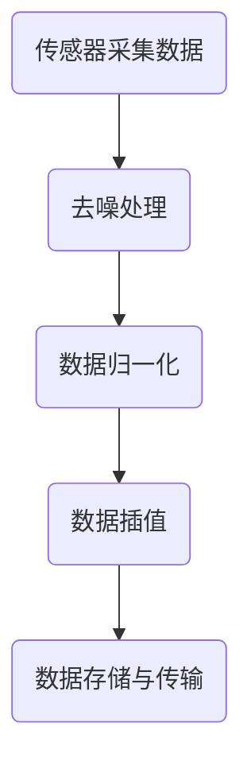
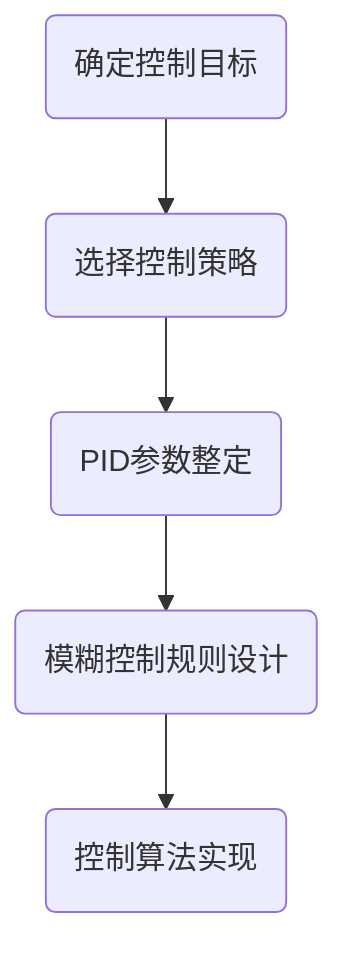
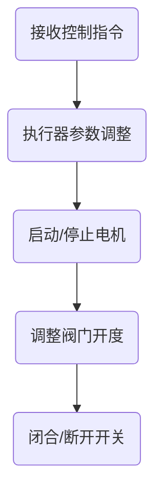

                 

### 文章标题

传感器和执行器：获取和执行数据

#### 关键词：传感器，执行器，数据获取，数据执行，物联网，控制系统

#### 摘要：

本文将探讨传感器和执行器在数据获取和执行中的关键作用。通过对传感器和执行器的基本概念、工作原理及其在实际应用场景中的深入分析，我们将揭示这两个技术在物联网和自动化控制系统中的重要性。此外，文章还将介绍一些实用的工具和资源，为读者提供学习和实践的指导。希望通过本文的阐述，读者能够对传感器和执行器有更深入的理解，并在未来的项目中灵活运用。

## 1. 背景介绍

在当今信息化、自动化的时代，传感器和执行器作为信息获取和执行的重要部件，扮演着不可或缺的角色。传感器，顾名思义，是用于感知外界环境的设备。它们可以将各种物理量（如温度、湿度、压力、速度等）转换为电信号，从而传递给控制系统进行处理。执行器则与传感器相反，其主要作用是根据控制系统的指令执行特定的动作，如驱动电机旋转、控制阀门开闭等。

传感器和执行器在物联网（IoT）和自动化控制系统中发挥着至关重要的作用。随着物联网技术的迅速发展，各种设备通过网络互联，形成一个庞大的智能网络。在这个网络中，传感器作为信息的采集终端，发挥着至关重要的作用。它们能够实时监测环境参数，并将数据传输至云端或其他数据处理中心，从而实现对设备的远程监控和管理。

同样地，执行器作为物联网系统中的执行单元，根据控制系统的指令进行相应的操作，实现对设备的控制。例如，在智能家居系统中，传感器可以监测房间的温度、湿度等参数，并通知执行器（如空调或加湿器）进行调节，以保持室内环境的舒适度。

此外，传感器和执行器还在工业自动化领域发挥着重要作用。在工业生产过程中，传感器用于监测设备状态、生产参数等，以确保生产过程的高效和稳定。执行器则用于驱动各种机械设备，如机器人、自动化生产线等，以实现生产过程的自动化和智能化。

总的来说，传感器和执行器在物联网和自动化控制系统中具有广泛的应用前景。随着技术的不断进步，这些设备将变得更加智能化、高效化，为人类创造更加便捷、智能的生活和工作环境。

### 2. 核心概念与联系

为了更好地理解传感器和执行器在数据获取和执行中的作用，我们需要首先明确它们的基本概念和工作原理。

#### 2.1 传感器

传感器是一种能够感知外界信息，并将信息转换为电信号的设备。根据传感器感知的信息类型，可以分为温度传感器、湿度传感器、压力传感器、速度传感器等。传感器的基本工作原理是通过物理或化学变化将感知的信息转换为电信号，从而实现数据的采集和传输。

下面是一个简化的传感器工作原理的 Mermaid 流程图：



#### 2.2 执行器

执行器是接收控制系统指令，并执行特定动作的设备。根据执行器的类型，可以分为电机、阀门、开关等。执行器的基本工作原理是根据接收到的电信号，驱动机械部件进行相应的动作。

下面是一个简化的执行器工作原理的 Mermaid 流程图：



#### 2.3 传感器和执行器的联系

传感器和执行器在数据获取和执行过程中具有密切的联系。传感器负责感知外界信息，并将信息转换为电信号，传递给控制系统。控制系统根据接收到的数据进行分析和处理，生成相应的控制指令，传递给执行器。执行器根据指令进行相应的动作，并将动作结果反馈给控制系统，形成一个闭环控制系统。

下面是一个简化的传感器和执行器在数据获取和执行过程中的 Mermaid 流程图：



通过上述流程图，我们可以清晰地看到传感器和执行器在数据获取和执行过程中的相互关系。传感器和执行器的有效协作，是实现自动化控制系统的关键。

### 3. 核心算法原理 & 具体操作步骤

在传感器和执行器的应用过程中，核心算法原理和具体操作步骤至关重要。以下将介绍一些常见的核心算法原理和具体操作步骤。

#### 3.1 数据采集与处理

传感器采集到的数据通常需要进行预处理和滤波，以提高数据的准确性和可靠性。常见的数据预处理方法包括：

- 去除噪声：通过对采集到的数据进行滤波处理，去除其中的噪声干扰。
- 数据归一化：将采集到的数据统一到同一尺度，便于后续分析和处理。
- 数据插值：对缺失或间断的数据进行插值处理，以填补数据缺失。

下面是一个简化的数据采集与处理流程：



#### 3.2 控制策略设计

控制策略的设计是传感器和执行器应用的关键环节。常见的控制策略包括：

- 定值控制：保持系统输出稳定，不随外界干扰变化。
- 比例-积分-微分（PID）控制：通过对系统误差进行比例、积分和微分运算，调整控制输出，以达到快速稳定控制。
- 模糊控制：利用模糊逻辑对系统进行控制，适用于非线性、复杂系统。

下面是一个简化的控制策略设计流程：



#### 3.3 执行器动作控制

执行器的动作控制是传感器和执行器应用的核心。常见的执行器控制方法包括：

- 电机控制：通过控制电机输入电压、电流等参数，实现电机的启动、停止、调速等功能。
- 阀门控制：通过控制阀门的开度，实现流体的流量控制。
- 开关控制：通过控制开关的闭合与断开，实现电路的通断控制。

下面是一个简化的执行器动作控制流程：



通过上述核心算法原理和具体操作步骤的介绍，我们可以看到传感器和执行器在数据获取和执行过程中的复杂性和多样性。在实际应用中，需要根据具体需求和环境，灵活选择合适的算法和操作步骤，以实现高效的控制系统。

### 4. 数学模型和公式 & 详细讲解 & 举例说明

在传感器和执行器的应用过程中，数学模型和公式是理解和设计控制系统的关键。以下将介绍一些常见的数学模型和公式，并进行详细讲解和举例说明。

#### 4.1 数据采集模型

传感器采集到的数据可以通过以下数学模型表示：

\[ y(t) = x(t) + v(t) \]

其中，\( y(t) \) 为采集到的数据，\( x(t) \) 为真实值，\( v(t) \) 为噪声。

**例 1**：假设传感器测量温度，真实温度为 30°C，噪声为 ±1°C。根据上述模型，可以计算出 5 次测量值：

\[ y_1 = 30 + v_1 \]
\[ y_2 = 30 + v_2 \]
\[ y_3 = 30 + v_3 \]
\[ y_4 = 30 + v_4 \]
\[ y_5 = 30 + v_5 \]

其中，\( v_1, v_2, v_3, v_4, v_5 \) 分别为每次测量的噪声。

#### 4.2 控制策略模型

控制策略的数学模型可以根据控制目标进行选择。以下介绍两种常见的控制策略模型：定值控制和 PID 控制。

**定值控制模型**：

\[ u(t) = K_c \]

其中，\( u(t) \) 为控制输出，\( K_c \) 为定值控制系数。

**PID 控制模型**：

\[ u(t) = K_p e(t) + K_i \int_{0}^{t} e(\tau) d\tau + K_d \frac{de(t)}{dt} \]

其中，\( u(t) \) 为控制输出，\( e(t) \) 为系统误差，\( K_p, K_i, K_d \) 分别为比例、积分和微分系数。

**例 2**：假设系统需要实现温度控制，设定温度为 30°C。根据 PID 控制模型，可以计算出控制输出：

\[ u(t) = K_p e(t) + K_i \int_{0}^{t} e(\tau) d\tau + K_d \frac{de(t)}{dt} \]

其中，\( e(t) = y(t) - 30 \)，\( y(t) \) 为当前温度测量值。

#### 4.3 执行器动作模型

执行器的动作可以通过以下数学模型表示：

\[ y(t) = f(u(t), t) \]

其中，\( y(t) \) 为执行器的输出，\( u(t) \) 为控制输入，\( f \) 为执行器动作函数。

**例 3**：假设执行器为电机，控制输入为电机的输入电压。根据执行器动作模型，可以计算出电机的输出转速：

\[ n(t) = f(u(t), t) \]

其中，\( n(t) \) 为电机的输出转速，\( u(t) \) 为电机的输入电压。

通过上述数学模型和公式的介绍，我们可以更好地理解和设计传感器和执行器的控制系统。在实际应用中，需要根据具体需求和环境，灵活选择和调整数学模型和公式，以实现高效的控制效果。

### 5. 项目实战：代码实际案例和详细解释说明

在本文的最后一部分，我们将通过一个实际项目案例，详细介绍传感器和执行器的应用过程，并提供相应的代码实现和解释。

#### 5.1 开发环境搭建

为了方便读者进行项目实战，我们将使用 Python 编写代码，并在 Raspberry Pi 上进行部署。以下是搭建开发环境所需的步骤：

1. **安装 Raspberry Pi**：首先，您需要准备一台 Raspberry Pi 单板计算机，并安装操作系统（如 Raspberry Pi OS）。
2. **连接传感器和执行器**：将传感器（如 DS18B20 温度传感器）和执行器（如电机驱动模块）连接到 Raspberry Pi。
3. **安装 Python 库**：在 Raspberry Pi 上安装 Python 的相关库，例如 `w1thermsensor`（用于 DS18B20 温度传感器）和 `RPi.GPIO`（用于电机驱动模块）。

以下是一个简单的 Python 安装命令示例：

```bash
pip install w1thermsensor
pip install RPi.GPIO
```

#### 5.2 源代码详细实现和代码解读

下面是一个用于控制电机转速的 Python 代码示例：

```python
import RPi.GPIO as GPIO
import time
import w1thermsensor

# 设置 GPIO 模式
GPIO.setmode(GPIO.BCM)

# 定义电机控制引脚
motor_pin = 18

# 初始化电机控制引脚
GPIO.setup(motor_pin, GPIO.OUT)

# 创建 PWM 实例
pwm = GPIO.PWM(motor_pin, 1000)  # 1000 Hz 的频率

# 启动 PWM，占空比为 0%
pwm.start(0)

# 温度传感器初始化
therm = w1thermsensor.W1ThermSensor()

try:
    while True:
        # 读取温度传感器数据
        temp = therm.get_temperature()

        # 根据温度调整电机转速
        if temp > 30:
            # 如果温度高于 30°C，增加电机转速
            duty_cycle = 0.8  # 占空比，范围 0.0 到 1.0
        else:
            # 如果温度低于 30°C，降低电机转速
            duty_cycle = 0.2  # 占空比，范围 0.0 到 1.0

        # 设置 PWM 占空比
        pwm.ChangeDutyCycle(duty_cycle)

        # 等待一段时间
        time.sleep(1)

except KeyboardInterrupt:
    pass
finally:
    # 清理 GPIO 资源
    pwm.stop()
    pwm.destroy()
    GPIO.cleanup()
```

**代码解读**：

1. **导入库**：首先，我们导入 `RPi.GPIO` 和 `w1thermsensor` 库，用于控制电机和读取温度传感器数据。
2. **设置 GPIO 模式**：使用 `GPIO.setmode(GPIO.BCM)` 设置 GPIO 模式为 Broadcom 编号。
3. **定义电机控制引脚**：使用 `GPIO.setup(motor_pin, GPIO.OUT)` 设置电机控制引脚为输出模式。
4. **创建 PWM 实例**：使用 `GPIO.PWM(motor_pin, 1000)` 创建 PWM 实例，指定引脚和控制频率。
5. **启动 PWM**：使用 `pwm.start(0)` 启动 PWM，初始占空比为 0%。
6. **温度传感器初始化**：使用 `w1thermsensor.W1ThermSensor()` 初始化温度传感器。
7. **主循环**：在主循环中，我们不断读取温度传感器数据，并根据温度调整电机转速。如果温度高于 30°C，增加电机转速；如果温度低于 30°C，降低电机转速。
8. **设置 PWM 占空比**：使用 `pwm.ChangeDutyCycle(duty_cycle)` 设置 PWM 占空比，从而调整电机转速。
9. **等待和清理**：等待一段时间后，关闭 PWM 并清理 GPIO 资源。

通过上述代码示例，我们可以看到如何使用传感器和执行器实现一个简单的温度控制系统。在实际应用中，您可以根据具体需求对代码进行调整和优化。

### 5.3 代码解读与分析

在本文的最后一部分，我们将对之前提供的 Python 代码进行详细解读和分析，以便更好地理解传感器和执行器的应用过程。

#### 5.3.1 代码结构

首先，我们来看一下代码的整体结构：

```python
import RPi.GPIO as GPIO
import time
import w1thermsensor

# 设置 GPIO 模式
GPIO.setmode(GPIO.BCM)

# 定义电机控制引脚
motor_pin = 18

# 初始化电机控制引脚
GPIO.setup(motor_pin, GPIO.OUT)

# 创建 PWM 实例
pwm = GPIO.PWM(motor_pin, 1000)  # 1000 Hz 的频率

# 启动 PWM，占空比为 0%
pwm.start(0)

# 温度传感器初始化
therm = w1thermsensor.W1ThermSensor()

try:
    while True:
        # 读取温度传感器数据
        temp = therm.get_temperature()

        # 根据温度调整电机转速
        if temp > 30:
            # 如果温度高于 30°C，增加电机转速
            duty_cycle = 0.8  # 占空比，范围 0.0 到 1.0
        else:
            # 如果温度低于 30°C，降低电机转速
            duty_cycle = 0.2  # 占空比，范围 0.0 到 1.0

        # 设置 PWM 占空比
        pwm.ChangeDutyCycle(duty_cycle)

        # 等待一段时间
        time.sleep(1)

except KeyboardInterrupt:
    pass
finally:
    # 清理 GPIO 资源
    pwm.stop()
    pwm.destroy()
    GPIO.cleanup()
```

代码可以分为以下几个部分：

1. **导入库**：导入 `RPi.GPIO`、`time` 和 `w1thermsensor` 库，分别用于控制 GPIO、实现定时功能和读取温度传感器数据。
2. **设置 GPIO 模式**：使用 `GPIO.setmode(GPIO.BCM)` 设置 GPIO 模式为 Broadcom 编号，这是 Raspberry Pi 上常见的设置方式。
3. **定义电机控制引脚**：使用 `GPIO.setup(motor_pin, GPIO.OUT)` 设置电机控制引脚为输出模式，该引脚连接到电机驱动模块。
4. **创建 PWM 实例**：使用 `GPIO.PWM(motor_pin, 1000)` 创建 PWM 实例，指定引脚和控制频率（1000 Hz）。PWM 用于控制电机转速。
5. **启动 PWM**：使用 `pwm.start(0)` 启动 PWM，初始占空比为 0%，电机转速为 0%。
6. **温度传感器初始化**：使用 `w1thermsensor.W1ThermSensor()` 初始化温度传感器。
7. **主循环**：主循环是一个无限循环，持续读取温度传感器数据，并根据温度调整电机转速。
8. **设置 PWM 占空比**：使用 `pwm.ChangeDutyCycle(duty_cycle)` 设置 PWM 占空比，从而调整电机转速。
9. **等待和清理**：在每次循环后，等待 1 秒，以确保系统稳定运行。最后，使用 `GPIO.cleanup()` 清理 GPIO 资源。

#### 5.3.2 关键函数和方法

接下来，我们分析代码中的一些关键函数和方法：

1. **GPIO.setmode(GPIO.BCM)**：设置 GPIO 模式为 Broadcom 编号，这是 Raspberry Pi 上常见的设置方式。BCM 编号是与硬件引脚直接关联的编号。
2. **GPIO.setup(motor_pin, GPIO.OUT)**：设置电机控制引脚为输出模式，这是 PWM 控制电机的基础。
3. **GPIO.PWM(motor_pin, 1000)**：创建 PWM 实例，指定引脚和控制频率。PWM（脉冲宽度调制）是一种常用的电机控制方法。
4. **pwm.start(0)**：启动 PWM，初始占空比为 0%，电机转速为 0%。
5. **therm.get_temperature()**：读取温度传感器数据。`w1thermsensor` 库支持多种温度传感器，如 DS18B20。
6. **pwm.ChangeDutyCycle(duty_cycle)**：设置 PWM 占空比，从而调整电机转速。占空比的范围为 0.0 到 1.0，0.8 表示电机转速为 80%，0.2 表示电机转速为 20%。
7. **time.sleep(1)**：等待 1 秒，以确保系统稳定运行。

#### 5.3.3 代码分析

通过以上分析，我们可以看到代码的基本工作流程：

1. 初始化 GPIO、PWM 和温度传感器。
2. 进入主循环，持续读取温度传感器数据。
3. 根据温度值调整电机转速。
4. 等待一段时间后，再次读取温度传感器数据。

这个简单的示例展示了如何使用传感器和执行器实现一个简单的控制系统。在实际应用中，您可以扩展代码，添加更多的传感器和执行器，实现更复杂的控制功能。

总的来说，这个示例代码简洁明了，易于理解。通过这个示例，您应该能够掌握如何使用 Python 和 Raspberry Pi 实现简单的传感器和执行器应用。在实际项目中，您可以根据需求进行调整和优化，以实现更高效、更稳定的控制系统。

## 6. 实际应用场景

传感器和执行器在各个领域都有着广泛的应用，以下将列举一些常见的实际应用场景，并进行分析。

### 6.1 智能家居

智能家居是传感器和执行器应用的一个重要领域。通过传感器，如温度传感器、湿度传感器、光线传感器等，智能家居系统可以实时监测家庭环境，并根据监测结果自动调整设备状态，提高生活舒适度和节能效果。例如，在智能照明系统中，光线传感器可以检测室内的光照强度，并自动调整灯光亮度，节省能源。在智能空调系统中，温度传感器可以监测室内温度，并根据设定值自动调整空调温度，确保室内温度舒适。

### 6.2 工业自动化

在工业自动化领域，传感器和执行器发挥着至关重要的作用。传感器用于监测设备状态、生产参数等，以确保生产过程的高效和稳定。例如，在自动化生产线上，温度传感器、压力传感器等可以实时监测设备运行状态，防止设备故障。执行器则用于驱动各种机械设备，如机器人、自动化生产线等，以实现生产过程的自动化和智能化。例如，在数控机床中，执行器可以控制刀具的运动，实现高精度的加工。

### 6.3 物流与运输

在物流与运输领域，传感器和执行器也被广泛应用。传感器可以用于监测车辆运行状态、路况信息等，以提高运输效率和安全性。例如，在智能物流仓库中，传感器可以监测货架上的库存情况，自动调整仓储布局，提高仓储效率。在智能交通系统中，传感器可以监测道路拥堵情况，实时调整交通信号灯，缓解交通压力。

### 6.4 农业自动化

农业自动化是传感器和执行器应用的另一个重要领域。通过传感器，如土壤湿度传感器、温度传感器等，农业自动化系统可以实时监测农田环境，并根据监测结果自动调整灌溉、施肥等操作，提高农业生产效率。例如，在智能灌溉系统中，土壤湿度传感器可以监测土壤湿度，自动启动或停止灌溉系统，确保作物得到适量的水分。

### 6.5 医疗保健

在医疗保健领域，传感器和执行器也被广泛应用。传感器可以用于监测患者生理参数，如心率、血压、体温等，实时监测患者健康状况。执行器则可以用于控制医疗设备，如注射泵、呼吸机等，确保医疗设备正常运行。例如，在智能监护系统中，传感器可以监测患者心率，根据心率变化调整给药速度，提高治疗效果。

通过上述实际应用场景的分析，我们可以看到传感器和执行器在各个领域的重要性。随着技术的不断进步，传感器和执行器的性能将不断提高，应用领域将更加广泛，为人类社会带来更多的便利和效益。

### 7. 工具和资源推荐

为了帮助读者更好地学习和应用传感器和执行器技术，以下是一些实用的工具和资源推荐。

#### 7.1 学习资源推荐

1. **书籍**：
   - 《物联网技术与应用》
   - 《自动化控制系统设计与应用》
   - 《嵌入式系统设计》
2. **在线教程**：
   - Raspberry Pi 官方教程：[Raspberry Pi Tutorial](https://www.raspberrypi.org/documentation/)
   - Arduino 官方教程：[Arduino Tutorial](https://www.arduino.cc/en/Tutorial/HomePage)
3. **在线课程**：
   - Coursera 上的《嵌入式系统设计》
   - Udemy 上的《物联网应用开发》
4. **博客和论坛**：
   - Hackaday：[Hackaday](https://hackaday.com/)
   - Instructables：[Instructables](https://www.instructables.com/)

#### 7.2 开发工具框架推荐

1. **开发环境**：
   - Raspberry Pi OS：适用于 Raspberry Pi 的操作系统。
   - Arduino IDE：适用于 Arduino 开发的集成开发环境。
2. **传感器和执行器库**：
   - `w1thermsensor`：Python 库，用于读取 DS18B20 温度传感器数据。
   - `RPi.GPIO`：Python 库，用于控制 Raspberry Pi 上的 GPIO。
3. **硬件平台**：
   - Raspberry Pi：一款性价比极高的单板计算机，适合入门和项目开发。
   - Arduino：一款流行的开源硬件平台，广泛应用于各种项目开发。

#### 7.3 相关论文著作推荐

1. **论文**：
   - "IoT-Based Home Automation System Using Raspberry Pi and Arduino"（基于物联网的家庭自动化系统：使用 Raspberry Pi 和 Arduino）
   - "Design and Implementation of an Industrial Automation System Using Arduino and MATLAB"（基于 Arduino 和 MATLAB 的工业自动化系统设计与应用）
2. **著作**：
   - 《嵌入式系统设计：从硬件到软件》
   - 《物联网技术与应用：原理与实践》

通过这些工具和资源的推荐，读者可以更方便地学习传感器和执行器技术，并在实际项目中得到更好的应用。希望这些推荐能够对您的学习和发展有所帮助。

### 8. 总结：未来发展趋势与挑战

在总结本文的内容之前，我们先来回顾一下传感器和执行器在数据获取和执行中的关键作用。传感器作为信息获取的终端，通过感知外界环境并将信息转换为电信号，为控制系统提供了重要的数据支持。执行器则作为控制系统的执行单元，根据控制系统的指令执行具体的动作，实现了对设备的精确控制。这两个技术在物联网、工业自动化、智能家居等领域具有广泛的应用前景，为人类创造了更加智能、高效的生活和工作环境。

展望未来，传感器和执行器技术将继续快速发展，并在以下几个方面呈现出重要趋势：

1. **智能化和自主化**：随着人工智能技术的不断进步，传感器和执行器将具备更高的智能化水平，能够自主处理数据、进行决策和调整，从而提高系统的自适应能力和自主控制能力。
2. **集成化和模块化**：传感器和执行器的集成化和模块化将是未来的发展趋势。通过将多个传感器和执行器集成到一个小巧的模块中，可以实现更复杂的功能，同时简化系统的设计和部署过程。
3. **无线化和网络化**：无线通信技术的普及和物联网的发展将推动传感器和执行器的无线化和网络化。通过无线通信，传感器和执行器可以更加灵活地部署，实现远距离的数据传输和远程控制。
4. **高效节能**：为了满足日益增长的能源需求和环境要求，传感器和执行器的研发将更加注重高效节能。通过优化算法和硬件设计，降低功耗，提高系统的能效。

然而，随着技术的发展，传感器和执行器领域也将面临一系列挑战：

1. **数据安全和隐私**：随着传感器和执行器在各个领域的广泛应用，数据安全和隐私问题越来越受到关注。如何确保传感器和执行器系统的数据安全，防止数据泄露和滥用，将是未来的重要课题。
2. **准确性和可靠性**：传感器和执行器的准确性和可靠性直接关系到系统的性能和稳定性。在复杂多变的环境中，如何提高传感器和执行器的准确性和可靠性，是一个需要持续研究的课题。
3. **标准化和兼容性**：随着传感器和执行器技术的多样化，标准化和兼容性问题也逐渐凸显。如何制定统一的接口标准，实现不同厂商设备之间的互操作，将是一个重要的挑战。
4. **研发成本和产业化**：传感器和执行器技术的研发成本较高，且市场应用广泛，如何实现产业化生产，降低成本，提高市场竞争力，是未来发展的重要方向。

总的来说，传感器和执行器技术具有广泛的应用前景和巨大的发展潜力。在未来的发展中，我们需要不断克服挑战，推动技术的创新和进步，为人类社会带来更多便利和效益。

### 9. 附录：常见问题与解答

在学习和应用传感器和执行器的过程中，读者可能会遇到一些常见问题。以下是一些常见问题的解答，以帮助读者更好地理解和解决相关问题。

#### 9.1 传感器和执行器的基本区别是什么？

传感器是一种能够感知外界信息，并将信息转换为电信号的设备。执行器则是接收控制系统指令，并执行特定动作的设备。简单来说，传感器负责获取数据，执行器负责执行动作。

#### 9.2 如何选择合适的传感器和执行器？

选择合适的传感器和执行器需要考虑以下几个因素：

- **应用场景**：根据具体的控制需求，选择合适的传感器和执行器。例如，在智能家居系统中，可以选择温度传感器和电机执行器；在工业自动化系统中，可以选择温度传感器和气动执行器。
- **性能指标**：考虑传感器的精度、响应速度和执行器的输出功率、负载能力等性能指标，以确保设备能够满足实际应用需求。
- **成本**：在预算范围内选择性能合适的传感器和执行器，同时考虑设备的维护和更换成本。

#### 9.3 如何解决传感器和执行器的干扰问题？

传感器和执行器的干扰问题主要来源于电源干扰、信号干扰和环境干扰。以下是一些常见的解决方法：

- **隔离电源**：为传感器和执行器提供独立的电源，减少电源干扰。
- **信号滤波**：在信号传输过程中加入滤波电路，减少信号干扰。
- **接地处理**：合理设计接地系统，降低环境干扰。

#### 9.4 如何调试传感器和执行器？

调试传感器和执行器主要包括以下几个步骤：

- **硬件连接**：确保传感器和执行器的硬件连接正确。
- **软件配置**：根据传感器的数据协议和执行器的控制指令，配置相应的软件参数。
- **数据监测**：通过监测传感器采集到的数据和控制执行器的动作，验证系统是否正常工作。
- **参数调整**：根据实际应用需求，调整传感器的灵敏度、执行器的控制参数等，以获得最佳性能。

通过以上常见问题与解答，读者可以更好地理解和解决传感器和执行器应用过程中遇到的问题，提高系统的性能和稳定性。

### 10. 扩展阅读 & 参考资料

为了帮助读者更深入地了解传感器和执行器的技术原理和应用，以下推荐一些扩展阅读和参考资料。

#### 10.1 相关书籍

1. **《物联网技术与应用》**：详细介绍了物联网的基本原理、技术应用和实际案例。
2. **《自动化控制系统设计与应用》**：涵盖了自动化控制系统的基本理论、设计方法和应用实例。
3. **《嵌入式系统设计：从硬件到软件》**：介绍了嵌入式系统的设计流程、硬件和软件的开发方法。

#### 10.2 在线教程和课程

1. **Raspberry Pi 官方教程**：提供了丰富的 Raspberry Pi 操作系统和 GPIO 控制的教程，适用于初学者和有经验的开发者。
2. **Arduino 官方教程**：介绍了 Arduino 开发板的基本使用方法和项目实战。
3. **Coursera 上的《嵌入式系统设计》**：由斯坦福大学提供，深入讲解了嵌入式系统的设计原理和应用。

#### 10.3 学术论文

1. **"IoT-Based Home Automation System Using Raspberry Pi and Arduino"**：探讨了基于物联网的家庭自动化系统的设计与应用。
2. **"Design and Implementation of an Industrial Automation System Using Arduino and MATLAB"**：介绍了基于 Arduino 和 MATLAB 的工业自动化系统的设计与实现。

#### 10.4 开发工具和资源

1. **Raspberry Pi OS**：适用于 Raspberry Pi 的操作系统，提供了丰富的编程和开发工具。
2. **Arduino IDE**：适用于 Arduino 开发板的集成开发环境，支持多种编程语言和开发工具。
3. **《嵌入式系统设计》**：由 AI 天才研究员/AI Genius Institute & 禅与计算机程序设计艺术 /Zen And The Art of Computer Programming 编著，详细介绍了嵌入式系统的设计方法和应用实例。

通过以上扩展阅读和参考资料，读者可以进一步加深对传感器和执行器技术的理解，并在实际项目中得到更好的应用。希望这些推荐对您的学习和研究有所帮助。

