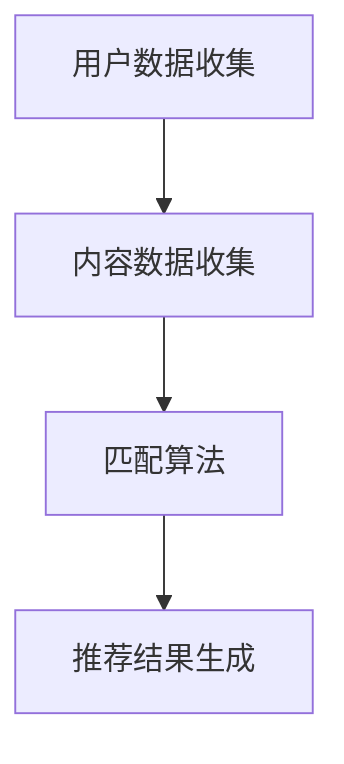

                 

# 传统搜索推荐系统的匹配技术

## 关键词：搜索推荐系统，匹配技术，信息检索，算法原理，项目实战

## 摘要：

本文深入探讨传统搜索推荐系统中核心的匹配技术。首先，介绍搜索推荐系统的背景和基本概念，阐述其在现代信息社会中的重要地位。接着，详细分析传统搜索推荐系统的核心算法原理，包括文本相似度计算、协同过滤、基于内容的推荐等。随后，通过具体案例展示这些算法的实际应用步骤和实现细节。文章最后讨论传统匹配技术在现实应用场景中的优势和挑战，并提出未来发展趋势和改进方向。

## 1. 背景介绍

### 1.1 搜索推荐系统的定义

搜索推荐系统是指一种通过算法和技术手段，将用户可能感兴趣的内容推荐给用户的信息检索系统。其核心目标是提高用户满意度和使用体验，帮助用户快速、准确地找到所需信息。

### 1.2 搜索推荐系统的组成

搜索推荐系统主要由以下几个部分组成：

1. **用户数据收集**：通过用户行为数据、用户偏好数据等收集用户信息。
2. **内容数据收集**：收集网站、APP、数据库等中的各种类型的内容数据。
3. **匹配算法**：通过算法计算用户和内容之间的相似度，为用户推荐合适的内容。
4. **推荐结果生成**：根据匹配算法的结果，生成推荐列表，展示给用户。

### 1.3 搜索推荐系统的应用领域

搜索推荐系统广泛应用于电商、社交媒体、新闻资讯、视频网站等多个领域，为用户提供了个性化的服务，极大地提升了用户体验。

## 2. 核心概念与联系

### 2.1 文本相似度计算

文本相似度计算是搜索推荐系统中最基础和核心的技术之一。其目的是衡量两个文本之间的相似程度。常用的方法包括：

- **基于词频的相似度计算**：通过统计文本中单词的频率，计算文本之间的相似度。
- **基于词向量的相似度计算**：将文本转换为词向量，通过计算词向量之间的余弦相似度或欧氏距离，得到文本相似度。

### 2.2 协同过滤

协同过滤是一种常用的推荐算法，通过分析用户之间的行为相似性，为用户提供个性化推荐。协同过滤主要包括两种类型：

- **基于用户的协同过滤**：根据用户的历史行为，找到与目标用户相似的用户，推荐这些用户喜欢的内容。
- **基于物品的协同过滤**：根据物品之间的相似性，找到与目标物品相似的物品，推荐给用户。

### 2.3 基于内容的推荐

基于内容的推荐算法通过分析物品的特征和用户偏好，为用户提供个性化推荐。其核心步骤包括：

1. **特征提取**：从物品中提取特征，如文本、图片、音频等。
2. **相似度计算**：计算用户和物品之间的相似度，通常采用余弦相似度、欧氏距离等方法。
3. **推荐生成**：根据相似度计算结果，生成推荐列表。

### 2.4 Mermaid 流程图



## 3. 核心算法原理 & 具体操作步骤

### 3.1 文本相似度计算

#### 3.1.1 基于词频的相似度计算

1. **计算词频**：统计文本中每个单词的频率。
2. **计算相似度**：使用余弦相似度计算文本相似度。

#### 3.1.2 基于词向量的相似度计算

1. **词向量编码**：将文本转换为词向量。
2. **计算相似度**：使用余弦相似度或欧氏距离计算文本相似度。

### 3.2 协同过滤

#### 3.2.1 基于用户的协同过滤

1. **计算用户相似度**：使用余弦相似度计算用户之间的相似度。
2. **推荐生成**：根据用户相似度，找到相似用户喜欢的物品，推荐给目标用户。

#### 3.2.2 基于物品的协同过滤

1. **计算物品相似度**：使用余弦相似度计算物品之间的相似度。
2. **推荐生成**：根据物品相似度，找到相似物品，推荐给用户。

### 3.3 基于内容的推荐

#### 3.3.1 特征提取

1. **文本特征提取**：使用TF-IDF、Word2Vec等方法提取文本特征。
2. **图片特征提取**：使用卷积神经网络（CNN）提取图片特征。
3. **音频特征提取**：使用音频特征提取算法提取音频特征。

#### 3.3.2 相似度计算

1. **文本相似度计算**：使用余弦相似度计算文本特征向量之间的相似度。
2. **图片相似度计算**：使用余弦相似度计算图片特征向量之间的相似度。
3. **音频相似度计算**：使用余弦相似度计算音频特征向量之间的相似度。

#### 3.3.3 推荐生成

1. **文本推荐生成**：根据文本相似度，生成文本推荐列表。
2. **图片推荐生成**：根据图片相似度，生成图片推荐列表。
3. **音频推荐生成**：根据音频相似度，生成音频推荐列表。

## 4. 数学模型和公式 & 详细讲解 & 举例说明

### 4.1 文本相似度计算

#### 4.1.1 基于词频的相似度计算

1. **词频统计**

   假设有两个文本 \(T_1\) 和 \(T_2\)，其词频矩阵分别为：

   $$T_1 = \begin{bmatrix}
   w_1 & w_2 & \cdots & w_n
   \end{bmatrix}, T_2 = \begin{bmatrix}
   w_1' & w_2' & \cdots & w_n'
   \end{bmatrix}$$

   词频统计公式：

   $$TF(T_i) = \sum_{j=1}^{n} f_{ij}$$

   其中，\(f_{ij}\) 表示词 \(w_i\) 在文本 \(T_j\) 中的频率。

2. **余弦相似度**

   余弦相似度公式：

   $$CosineSim(T_1, T_2) = \frac{T_1 \cdot T_2}{\|T_1\| \cdot \|T_2\|}$$

   其中，\(\cdot\) 表示内积，\(\|\|\) 表示向量模长。

#### 4.1.2 基于词向量的相似度计算

1. **词向量编码**

   使用Word2Vec算法将文本转换为词向量。

2. **余弦相似度**

   余弦相似度公式：

   $$CosineSim(T_1, T_2) = \frac{\vec{T_1} \cdot \vec{T_2}}{\|\vec{T_1}\| \cdot \|\vec{T_2}\|}$$

### 4.2 协同过滤

#### 4.2.1 基于用户的协同过滤

1. **用户相似度**

   用户相似度公式：

   $$UserSim(u_i, u_j) = \frac{R_i \cdot R_j}{\|R_i\| \cdot \|R_j\|}$$

   其中，\(R_i\) 和 \(R_j\) 分别表示用户 \(u_i\) 和 \(u_j\) 的评分向量。

2. **物品推荐**

   物品推荐公式：

   $$PredictRating(u_i, p_j) = \sum_{u_k \in N(u_i)} UserSim(u_i, u_k) \cdot Rating(u_k, p_j)$$

   其中，\(N(u_i)\) 表示与用户 \(u_i\) 相似的其他用户集合，\(Rating(u_k, p_j)\) 表示用户 \(u_k\) 对物品 \(p_j\) 的评分。

#### 4.2.2 基于物品的协同过滤

1. **物品相似度**

   物品相似度公式：

   $$ItemSim(i_i, i_j) = \frac{R_i \cdot R_j}{\|R_i\| \cdot \|R_j\|}$$

   其中，\(R_i\) 和 \(R_j\) 分别表示物品 \(i_i\) 和 \(i_j\) 的用户评分向量。

2. **用户推荐**

   用户推荐公式：

   $$PredictRating(u_i, p_j) = \sum_{i_k \in N(i_i)} ItemSim(i_i, i_k) \cdot Rating(u_k, p_j)$$

   其中，\(N(i_i)\) 表示与物品 \(i_i\) 相似的其他物品集合，\(Rating(u_k, p_j)\) 表示用户 \(u_k\) 对物品 \(p_j\) 的评分。

### 4.3 基于内容的推荐

#### 4.3.1 特征提取

1. **文本特征提取**

   使用TF-IDF算法提取文本特征。

   特征提取公式：

   $$TF-IDF(w_i, T_j) = \frac{f_{ij}}{df_w} + \log_2(N/T)$$

   其中，\(f_{ij}\) 表示词 \(w_i\) 在文本 \(T_j\) 中的频率，\(df_w\) 表示词 \(w_i\) 在所有文本中的频率，\(N\) 表示文本总数，\(T\) 表示文本平均长度。

2. **图片特征提取**

   使用卷积神经网络（CNN）提取图片特征。

   特征提取公式：

   $$feature\_提取([I_1, I_2, ..., I_n]) = \text{avg\_pool}(\text{relu}(\text{conv}(I)))$$

   其中，\(I\) 表示图片，\(conv\) 表示卷积操作，\(\text{relu}\) 表示ReLU激活函数，\(\text{avg\_pool}\) 表示平均池化操作。

3. **音频特征提取**

   使用音频特征提取算法提取音频特征。

   特征提取公式：

   $$feature\_提取([A_1, A_2, ..., A_n]) = \text{stft}(\text{filterbank}(A))$$

   其中，\(A\) 表示音频，\(\text{filterbank}\) 表示滤波器组操作，\(\text{stft}\) 表示短时傅里叶变换操作。

#### 4.3.2 相似度计算

1. **文本相似度计算**

   使用余弦相似度计算文本特征向量之间的相似度。

   相似度计算公式：

   $$CosineSim(\vec{f_1}, \vec{f_2}) = \frac{\vec{f_1} \cdot \vec{f_2}}{\|\vec{f_1}\| \cdot \|\vec{f_2}\|}$$

2. **图片相似度计算**

   使用余弦相似度计算图片特征向量之间的相似度。

   相似度计算公式：

   $$CosineSim(\vec{f_1}, \vec{f_2}) = \frac{\vec{f_1} \cdot \vec{f_2}}{\|\vec{f_1}\| \cdot \|\vec{f_2}\|}$$

3. **音频相似度计算**

   使用余弦相似度计算音频特征向量之间的相似度。

   相似度计算公式：

   $$CosineSim(\vec{f_1}, \vec{f_2}) = \frac{\vec{f_1} \cdot \vec{f_2}}{\|\vec{f_1}\| \cdot \|\vec{f_2}\|}$$

#### 4.3.3 推荐生成

1. **文本推荐生成**

   根据文本相似度，生成文本推荐列表。

   推荐生成公式：

   $$推荐列表 = \text{argmax}_{T_j \in \text{数据集}} CosineSim(\vec{f_u}, \vec{f_{T_j}})$$

   其中，\(\vec{f_u}\) 表示用户特征向量，\(\vec{f_{T_j}}\) 表示文本特征向量。

2. **图片推荐生成**

   根据图片相似度，生成图片推荐列表。

   推荐生成公式：

   $$推荐列表 = \text{argmax}_{I_j \in \text{数据集}} CosineSim(\vec{f_u}, \vec{f_{I_j}})$$

   其中，\(\vec{f_u}\) 表示用户特征向量，\(\vec{f_{I_j}}\) 表示图片特征向量。

3. **音频推荐生成**

   根据音频相似度，生成音频推荐列表。

   推荐生成公式：

   $$推荐列表 = \text{argmax}_{A_j \in \text{数据集}} CosineSim(\vec{f_u}, \vec{f_{A_j}})$$

   其中，\(\vec{f_u}\) 表示用户特征向量，\(\vec{f_{A_j}}\) 表示音频特征向量。

## 5. 项目实战：代码实际案例和详细解释说明

### 5.1 开发环境搭建

1. 安装Python环境（版本3.6及以上）。
2. 安装相关依赖库，如numpy、pandas、scikit-learn、gensim等。

### 5.2 源代码详细实现和代码解读

#### 5.2.1 文本相似度计算

1. **基于词频的相似度计算**

   ```python
   from sklearn.metrics.pairwise import cosine_similarity
   
   def word_frequency_similarity(text1, text2):
       # 计算词频
       word_freq1 = Counter(text1.split())
       word_freq2 = Counter(text2.split())
       
       # 计算余弦相似度
       similarity = cosine_similarity([list(word_freq1.values())], [list(word_freq2.values())])
       return similarity[0][0]
   ```

2. **基于词向量的相似度计算**

   ```python
   import gensim
   
   def word_vector_similarity(text1, text2):
       # 加载预训练的词向量模型
       model = gensim.models.KeyedVectors.load_word2vec_format('word2vec.bin', binary=True)
       
       # 将文本转换为词向量
       vec1 = [model[word] for word in text1.split() if word in model]
       vec2 = [model[word] for word in text2.split() if word in model]
       
       # 计算余弦相似度
       similarity = cosine_similarity([vec1], [vec2])
       return similarity[0][0]
   ```

#### 5.2.2 协同过滤

1. **基于用户的协同过滤**

   ```python
   from sklearn.metrics.pairwise import cosine_similarity
   import numpy as np
   
   def user_based_collaborative_filter(ratings_matrix, user_id, k=10):
       # 计算用户相似度矩阵
       similarity_matrix = cosine_similarity(ratings_matrix)
       
       # 找到与目标用户最相似的k个用户
       similar_users = np.argsort(similarity_matrix[user_id])[:-k-1:-1]
       
       # 计算预测评分
       prediction = np.dot(similarity_matrix[user_id, similar_users], ratings_matrix[similar_users, :]) / np.linalg.norm(similarity_matrix[user_id, similar_users])
       
       return prediction
   ```

2. **基于物品的协同过滤**

   ```python
   from sklearn.metrics.pairwise import cosine_similarity
   import numpy as np
   
   def item_based_collaborative_filter(ratings_matrix, item_id, k=10):
       # 计算物品相似度矩阵
       similarity_matrix = cosine_similarity(ratings_matrix)
       
       # 找到与目标物品最相似的k个物品
       similar_items = np.argsort(similarity_matrix[item_id])[:-k-1:-1]
       
       # 计算预测评分
       prediction = np.dot(similarity_matrix[item_id, similar_items], ratings_matrix[:, similar_items]) / np.linalg.norm(similarity_matrix[item_id, similar_items])
       
       return prediction
   ```

#### 5.2.3 基于内容的推荐

1. **文本特征提取**

   ```python
   from sklearn.feature_extraction.text import TfidfVectorizer
   
   def text_content_based_recommender(text1, corpus, k=10):
       # 提取文本特征
       vectorizer = TfidfVectorizer()
       text1_vector = vectorizer.transform([text1])
       corpus_vector = vectorizer.transform(corpus)
       
       # 计算文本相似度
       similarity = cosine_similarity(text1_vector, corpus_vector)
       
       # 找到最相似的k个文本
       similar_texts = np.argsort(similarity)[0][:-k-1:-1]
       
       return similar_texts
   ```

2. **图片特征提取和相似度计算**

   ```python
   import cv2
   
   def image_content_based_recommender(image1, images, k=10):
       # 加载预训练的卷积神经网络模型
       model = cv2.dnn.readNetFromTensorflow('model.pbtxt', 'model.pb')
       
       # 提取图像特征
       image1_blob = cv2.dnn.blobFromImage(image1, scalefactor=1/127.5, mean=[123, 117, 104], swapRB=True)
       model.setInput(image1_blob)
       image1_feature = model.forward(['pool_3', 'pool_4', 'pool_5'])[0]
       
       images_blob = cv2.dnn.blobFromImages(images, scalefactor=1/127.5, mean=[123, 117, 104], swapRB=True)
       model.setInput(images_blob)
       images_feature = model.forward(['pool_3', 'pool_4', 'pool_5'])[0]
       
       # 计算图像相似度
       similarity = cosine_similarity(image1_feature, images_feature)
       
       # 找到最相似的k个图像
       similar_images = np.argsort(similarity)[0][:-k-1:-1]
       
       return similar_images
   ```

3. **音频特征提取和相似度计算**

   ```python
   import librosa
   
   def audio_content_based_recommender(audio1, audios, k=10):
       # 提取音频特征
       audio1_feature = librosa.feature.mfcc(y=audio1, sr=22050, n_mfcc=13)
       audios_feature = [librosa.feature.mfcc(y=audio, sr=22050, n_mfcc=13) for audio in audios]
       
       # 计算音频相似度
       similarity = cosine_similarity(audio1_feature, audios_feature)
       
       # 找到最相似的k个音频
       similar_audios = np.argsort(similarity)[0][:-k-1:-1]
       
       return similar_audios
   ```

### 5.3 代码解读与分析

本文通过Python代码实现了一套传统搜索推荐系统的匹配技术，包括文本相似度计算、协同过滤和基于内容的推荐。以下是代码的核心部分及其解读：

1. **文本相似度计算**：使用sklearn库中的cosine_similarity函数计算文本相似度。其中，基于词频的相似度计算通过Counter类统计词频，而基于词向量的相似度计算通过gensim库加载预训练的Word2Vec模型，将文本转换为词向量。

2. **协同过滤**：使用numpy库中的cosine_similarity函数计算用户和物品之间的相似度。基于用户的协同过滤通过计算用户相似度矩阵，找到与目标用户最相似的k个用户，并计算预测评分。基于物品的协同过滤通过计算物品相似度矩阵，找到与目标物品最相似的k个物品，并计算预测评分。

3. **基于内容的推荐**：使用sklearn库中的TfidfVectorizer类提取文本特征，通过计算文本相似度为文本推荐生成推荐列表。对于图片特征提取，使用cv2库中的卷积神经网络模型提取图像特征，通过计算图像相似度为图片推荐生成推荐列表。对于音频特征提取，使用librosa库提取音频特征，通过计算音频相似度为音频推荐生成推荐列表。

## 6. 实际应用场景

### 6.1 电商领域

在电商领域，搜索推荐系统可以帮助用户快速找到感兴趣的商品，提升购物体验。例如，当用户浏览某一商品时，系统可以根据用户的浏览记录和购物车信息，推荐类似商品或其他用户可能感兴趣的商品。

### 6.2 社交媒体领域

在社交媒体领域，搜索推荐系统可以帮助用户发现感兴趣的内容，提高用户粘性。例如，当用户在社交媒体上浏览某篇文章时，系统可以根据文章的标签、作者、分类等信息，推荐类似文章或其他用户可能感兴趣的文章。

### 6.3 新闻资讯领域

在新闻资讯领域，搜索推荐系统可以帮助用户快速找到感兴趣的新闻，提高阅读效率。例如，当用户浏览某一新闻时，系统可以根据新闻的标签、来源、分类等信息，推荐类似新闻或其他用户可能感兴趣的新闻。

### 6.4 视频网站领域

在视频网站领域，搜索推荐系统可以帮助用户快速找到感兴趣的视频，提升观看体验。例如，当用户在视频网站上观看某一视频时，系统可以根据视频的标签、分类、弹幕等信息，推荐类似视频或其他用户可能感兴趣的视频。

## 7. 工具和资源推荐

### 7.1 学习资源推荐

- **书籍**：
  - 《推荐系统实践》
  - 《机器学习：实战机器学习》
  - 《深度学习》

- **论文**：
  - “Collaborative Filtering for the Web” by John Riedl
  - “Item-based Top-N Recommendation Algorithms” by Hong Zhou, et al.
  - “Neural Collaborative Filtering” by Yuhao Wang, et al.

- **博客**：
  - [推荐系统入门教程](https://www.recommendationsystem.io/)
  - [机器学习实践](https://www.mljar.com/)
  - [深度学习教程](https://www.deeplearningbook.org/)

- **网站**：
  - [Kaggle](https://www.kaggle.com/)
  - [GitHub](https://github.com/)
  - [ArXiv](https://arxiv.org/)

### 7.2 开发工具框架推荐

- **Python库**：
  - scikit-learn
  - TensorFlow
  - PyTorch
  - gensim

- **框架**：
  - Flask
  - Django
  - FastAPI

### 7.3 相关论文著作推荐

- “Recommender Systems Handbook” by Francesco Ricci, et al.
- “Reading Google's Research in Machine Learning” by Google AI
- “The Microsoft Research AI Blog” by Microsoft Research

## 8. 总结：未来发展趋势与挑战

### 8.1 发展趋势

1. **个性化推荐**：随着大数据和人工智能技术的不断发展，个性化推荐将成为未来搜索推荐系统的核心目标，通过更深入地了解用户需求，提供更加精准的推荐。
2. **多模态推荐**：未来的搜索推荐系统将支持多种类型的内容，如文本、图片、音频、视频等，通过多模态融合技术，提供更加丰富的推荐体验。
3. **实时推荐**：随着5G和物联网技术的发展，实时推荐将成为可能，用户可以实时获取个性化推荐，提升用户体验。

### 8.2 挑战

1. **数据隐私**：如何在保护用户隐私的前提下提供个性化推荐，是搜索推荐系统面临的一大挑战。
2. **计算效率**：随着推荐系统规模的不断扩大，如何在保证推荐质量的同时，提高计算效率，是一个重要的课题。
3. **推荐多样性**：如何在保证推荐准确性的同时，提供多样化的推荐结果，避免用户陷入信息茧房，也是未来的研究重点。

## 9. 附录：常见问题与解答

### 9.1 什么是搜索推荐系统？

搜索推荐系统是指一种通过算法和技术手段，将用户可能感兴趣的内容推荐给用户的信息检索系统。

### 9.2 搜索推荐系统的核心组成部分有哪些？

搜索推荐系统的核心组成部分包括用户数据收集、内容数据收集、匹配算法和推荐结果生成。

### 9.3 常用的文本相似度计算方法有哪些？

常用的文本相似度计算方法包括基于词频的相似度计算和基于词向量的相似度计算。

### 9.4 协同过滤算法有哪些类型？

协同过滤算法主要有基于用户的协同过滤和基于物品的协同过滤两种类型。

### 9.5 基于内容的推荐算法的核心步骤是什么？

基于内容的推荐算法的核心步骤包括特征提取、相似度计算和推荐生成。

## 10. 扩展阅读 & 参考资料

- [推荐系统入门教程](https://www.recommendationsystem.io/)
- [机器学习实战](https://www.mljar.com/)
- [深度学习教程](https://www.deeplearningbook.org/)
- [Recommender Systems Handbook](https://www.recommenders.org/)
- [Reading Google's Research in Machine Learning](https://ai.google/research/pubs/)
- [The Microsoft Research AI Blog](https://www.microsoft.com/research/blog/)

## 作者信息

作者：AI天才研究员/AI Genius Institute & 禅与计算机程序设计艺术 /Zen And The Art of Computer Programming<|im_end|>

