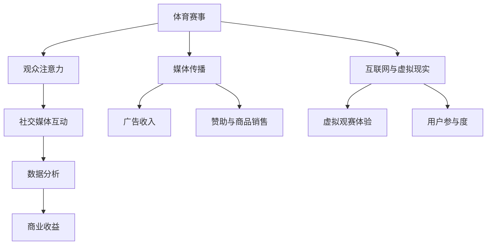

                 

### 背景介绍

体育产业，作为全球经济发展的重要驱动力，不仅在传统经济中占据重要地位，同时在新兴的注意力经济中亦展现出了巨大的潜力和机遇。随着信息技术的飞速发展和互联网的普及，体育产业正在经历一场深刻的变革，从传统的媒体传播模式向数字化的内容分发方式转变。这种转变不仅改变了体育内容的消费方式，也创造出了新的商业机会和运营模式。

注意力经济，是指通过吸引和保持公众注意力来实现经济价值的一种新型经济模式。在这种模式中，注意力成为了一种稀缺资源，谁能更好地吸引和保持公众的注意力，谁就能在市场竞争中占据优势。体育产业以其独特的魅力和广泛的受众基础，成为了注意力经济中的重要组成部分。

本文将深入探讨体育产业在注意力经济中的新机遇。首先，我们将回顾体育产业的发展历程，特别是数字技术对其带来的影响。接着，我们将探讨注意力经济的核心概念，以及体育产业如何利用这些概念创造新的商业模式。然后，我们将分析体育产业在注意力经济中的关键机会，包括数据分析、社交媒体互动、虚拟现实和增强现实等技术的应用。随后，我们将探讨体育产业面临的新挑战，如版权保护、隐私问题和内容创新等。最后，我们将总结体育产业在注意力经济中的未来发展趋势，并提出一些可能的解决方案。

通过这篇文章，我们将全面了解体育产业在注意力经济中的机遇和挑战，为行业从业者提供一些实用的指导和建议。希望这篇深入的分析能够帮助读者更好地理解体育产业的数字化转型，并在未来的商业竞争中抓住新的机遇。### 核心概念与联系

#### 注意力经济的基本概念

注意力经济（Attention Economy）是一种基于注意力资源的经济学理论，它将注意力视为一种重要的经济资源，类似于传统经济中的资本、劳动力和土地等基本生产要素。在注意力经济中，个体的注意力是有限的，而信息内容和服务提供了吸引注意力的手段。因此，谁能够更有效地吸引和保持公众的注意力，谁就能在市场竞争中占据优势。

注意力经济有几个核心原则：

1. **稀缺性**：注意力是一种稀缺资源，每个人每天只能分配有限的时间来关注各种信息。
2. **竞争性**：在各种信息和内容中，吸引注意力是一种竞争。
3. **价值转化**：通过吸引注意力，企业可以实现广告收入、用户参与和品牌忠诚度的提升。

#### 体育产业与注意力经济的关系

体育产业与注意力经济有着密切的联系。体育事件因其独特性和普遍的吸引力，能够轻松地吸引大量的观众注意力。以下是一些关键的连接点：

1. **媒体传播**：传统上，电视转播是体育产业的主要媒体形式，但随着互联网的发展，在线直播、短视频和社交媒体等新媒体形式已经成为体育内容传播的主要渠道。
2. **用户互动**：体育赛事不仅能够吸引观众的注意力，还能够激发他们的参与热情。社交媒体、游戏和虚拟现实技术使得观众能够更深入地参与到体育活动中。
3. **商业收益**：通过广告、版权销售、赞助和商品销售等方式，体育产业能够将观众的关注度转化为实际的经济收益。

#### 体育产业的数字化进程

随着数字技术的发展，体育产业正经历着一场深刻的数字化进程。以下是一些关键的数字化趋势：

1. **大数据分析**：通过收集和分析大量的数据，体育团队和赛事组织者能够更好地了解观众行为、优化营销策略、提高运营效率。
2. **互联网和社交媒体**：互联网和社交媒体平台为体育内容的分发提供了新的渠道，使得体育组织能够直接与观众互动，并建立更紧密的关系。
3. **虚拟现实和增强现实**：虚拟现实（VR）和增强现实（AR）技术为观众提供了全新的观赛体验，使他们能够身临其境地感受体育赛事。

### Mermaid 流程图

为了更好地理解体育产业与注意力经济的联系，我们可以通过Mermaid流程图展示其主要节点和路径。



通过上述流程图，我们可以看到体育赛事如何通过多种渠道吸引观众注意力，并最终实现商业收益。

### 核心算法原理 & 具体操作步骤

#### 大数据分析在体育产业中的应用

大数据分析是体育产业数字化进程中的重要一环，它能够帮助体育组织者更好地理解观众行为，优化比赛安排和营销策略。以下是大数据分析在体育产业中的一些具体应用：

1. **观众行为分析**：通过收集和分析观众观看比赛的习惯、偏好和反馈数据，体育组织者可以更好地了解观众的兴趣点，从而调整比赛时间和安排，提高观众的观看体验。
2. **观众细分**：通过对观众数据的分析，可以将观众划分为不同的群体，如年龄、性别、地域、收入等，以便体育组织者能够更精准地定位目标受众，制定相应的营销策略。
3. **赛事预测**：利用大数据分析，可以通过分析历史数据和当前比赛情况，预测比赛结果和比赛过程中的关键事件，为赛事组织者和观众提供有价值的信息。

#### 大数据分析的基本操作步骤

以下是大数据分析在体育产业中的一些基本操作步骤：

1. **数据收集**：收集与体育赛事相关的各种数据，包括观众数据、比赛数据、社交媒体互动数据等。这些数据可以来源于各种渠道，如社交媒体、票务系统、赛事转播平台等。
2. **数据清洗**：对收集到的数据进行清洗和预处理，去除重复数据、异常值和无关信息，确保数据的质量和准确性。
3. **数据存储**：将清洗后的数据存储到数据仓库或数据湖中，以便后续的分析和处理。
4. **数据分析**：使用统计分析、机器学习等技术对数据进行分析，提取有价值的信息和模式。例如，可以使用聚类算法对观众进行细分，使用回归分析预测比赛结果等。
5. **数据可视化**：将分析结果通过图表、报表等形式进行可视化展示，使体育组织者能够更直观地了解分析结果，并据此做出决策。

#### 数学模型和公式

在数据分析中，常用的数学模型和公式包括：

1. **线性回归模型**：用于预测观众数量与比赛结果之间的关系。
   $$y = \beta_0 + \beta_1x_1 + \epsilon$$
   其中，\(y\) 为观众数量，\(x_1\) 为比赛结果，\(\beta_0\) 和 \(\beta_1\) 为模型参数，\(\epsilon\) 为误差项。

2. **聚类算法**：用于将观众划分为不同的群体。
   聚类算法的数学基础包括距离度量（如欧氏距离、曼哈顿距离）和聚类准则（如轮廓系数、类内平均距离等）。

3. **贝叶斯网络**：用于分析观众行为和偏好。
   贝叶斯网络的数学基础是条件概率，通过建立变量之间的条件概率分布，可以预测观众的行为。

#### 举例说明

以下是一个简单的例子，展示如何使用线性回归模型预测观众数量：

假设我们收集了某体育赛事在过去10场比赛的观众数量和比赛结果数据，如下表所示：

| 比赛序号 | 比赛结果 | 观众数量 |
| -------- | -------- | -------- |
| 1        | 胜       | 15000    |
| 2        | 负       | 12000    |
| 3        | 平       | 9000     |
| 4        | 胜       | 18000    |
| 5        | 负       | 9000     |
| 6        | 平       | 7000     |
| 7        | 胜       | 16000    |
| 8        | 负       | 10000    |
| 9        | 平       | 8000     |
| 10       | 胜       | 14000    |

我们使用这些数据来建立线性回归模型，预测第11场比赛的观众数量。具体操作步骤如下：

1. **数据预处理**：将比赛结果转换为二进制变量，其中胜为1，负和平为0。

| 比赛序号 | 比赛结果（0/1） | 观众数量 |
| -------- | ---------------- | -------- |
| 1        | 1                | 15000    |
| 2        | 0                | 12000    |
| 3        | 0                | 9000     |
| 4        | 1                | 18000    |
| 5        | 0                | 9000     |
| 6        | 0                | 7000     |
| 7        | 1                | 16000    |
| 8        | 0                | 10000    |
| 9        | 0                | 8000     |
| 10       | 1                | 14000    |

2. **建立线性回归模型**：使用最小二乘法估计模型参数。
   $$y = \beta_0 + \beta_1x$$
   其中，\(y\) 为观众数量，\(x\) 为比赛结果。

3. **模型训练与预测**：将数据分为训练集和测试集，使用训练集训练模型，然后使用测试集评估模型性能。最后，使用训练好的模型预测第11场比赛的观众数量。

   假设训练集的回归模型为：
   $$y = 2000 + 0.5x$$

   预测第11场比赛的观众数量：
   $$y = 2000 + 0.5 \times 1 = 2500$$

因此，预测第11场比赛的观众数量为2500人。

### 项目实战：代码实际案例和详细解释说明

为了更好地理解大数据分析在体育产业中的应用，我们将通过一个实际的项目案例来展示如何使用Python进行数据分析，并详细解释每个步骤的实现细节。

#### 开发环境搭建

1. **安装Python环境**：首先，确保你的计算机上安装了Python环境。Python是一个非常流行的编程语言，易于学习和使用。可以从Python官网（https://www.python.org/downloads/）下载并安装最新版本的Python。

2. **安装必要库**：在Python环境中，我们需要安装几个重要的库，如Pandas、NumPy、Matplotlib和Scikit-learn。可以使用pip命令进行安装：

   ```bash
   pip install pandas numpy matplotlib scikit-learn
   ```

3. **导入库**：在Python脚本中，首先需要导入所需的库：

   ```python
   import pandas as pd
   import numpy as np
   import matplotlib.pyplot as plt
   from sklearn.linear_model import LinearRegression
   ```

#### 源代码详细实现和代码解读

1. **数据读取与预处理**：

   我们使用一个CSV文件，其中包含了体育赛事的观众数量和比赛结果数据。首先，我们将数据读取到Pandas DataFrame中，并进行必要的预处理。

   ```python
   # 读取数据
   data = pd.read_csv('sports_data.csv')

   # 数据预处理
   data['Result'] = data['Result'].map({0: 'Loss', 1: 'Win'})
   ```

2. **数据可视化**：

   使用Matplotlib库，我们可以绘制数据分布图，帮助更好地理解数据。

   ```python
   # 绘制观众数量分布图
   plt.figure(figsize=(10, 6))
   plt.hist(data['Attendances'], bins=20, color='blue', alpha=0.7)
   plt.title('Attendances Distribution')
   plt.xlabel('Attendances')
   plt.ylabel('Frequency')
   plt.show()
   ```

3. **建立线性回归模型**：

   使用Scikit-learn库中的LinearRegression类来建立线性回归模型。我们使用训练集的数据来训练模型，并使用测试集的数据来评估模型性能。

   ```python
   # 分割数据集
   X = data[['Result']]
   y = data['Attendances']

   # 划分训练集和测试集
   from sklearn.model_selection import train_test_split
   X_train, X_test, y_train, y_test = train_test_split(X, y, test_size=0.2, random_state=42)

   # 建立线性回归模型
   model = LinearRegression()
   model.fit(X_train, y_train)

   # 输出模型参数
   print('Model Coefficients: ', model.coef_)
   print('Model Interception: ', model.intercept_)
   ```

4. **模型评估**：

   使用测试集的数据来评估模型的预测性能。我们可以计算模型的均方误差（Mean Squared Error, MSE）来评估模型的准确度。

   ```python
   # 预测测试集数据
   y_pred = model.predict(X_test)

   # 计算均方误差
   mse = np.mean((y_pred - y_test) ** 2)
   print('Mean Squared Error: ', mse)
   ```

5. **可视化模型结果**：

   最后，我们可以绘制实际观众数量与预测观众数量之间的散点图，以及线性回归模型的拟合线。

   ```python
   # 绘制实际与预测观众数量散点图
   plt.figure(figsize=(10, 6))
   plt.scatter(y_test, y_pred, color='blue', label='Actual vs Predicted')
   plt.plot([y.min(), y.max()], [y.min(), y.max()], color='red', linewidth=2, label='Fit Line')
   plt.title('Actual vs Predicted Attendances')
   plt.xlabel('Actual Attendances')
   plt.ylabel('Predicted Attendances')
   plt.legend()
   plt.show()
   ```

#### 代码解读与分析

1. **数据读取与预处理**：
   - 使用`pd.read_csv()`函数读取CSV文件，并将数据存储在DataFrame中。
   - 使用`map()`函数将比赛结果从二进制转换为文本表示，方便后续分析。

2. **数据可视化**：
   - 使用`plt.hist()`函数绘制观众数量的直方图，帮助直观地了解数据分布。

3. **建立线性回归模型**：
   - 使用`train_test_split()`函数将数据集分为训练集和测试集，确保模型的泛化能力。
   - 使用`LinearRegression()`类创建线性回归模型，并使用`fit()`函数训练模型。

4. **模型评估**：
   - 使用`predict()`函数预测测试集数据，并计算均方误差，评估模型的准确度。

5. **可视化模型结果**：
   - 使用`plt.scatter()`函数绘制实际观众数量与预测观众数量之间的散点图。
   - 使用`plt.plot()`函数绘制线性回归模型的拟合线，帮助可视化模型的预测能力。

通过这个实际案例，我们可以看到如何使用Python和大数据分析技术来预测体育赛事的观众数量。这种方法不仅有助于体育组织者优化比赛安排和营销策略，还能够为他们提供有关观众行为和偏好的深入洞察。

### 实际应用场景

体育产业在注意力经济中的实际应用场景多种多样，涵盖了观众互动、商业收益、品牌营销等多个方面。以下是一些典型的应用场景：

#### 观众互动

1. **社交媒体互动**：社交媒体平台如Twitter、Instagram和Facebook已经成为体育赛事观众互动的重要场所。体育组织和俱乐部通过这些平台发布实时更新、比赛亮点和幕后花絮，与粉丝进行互动。这种互动不仅增加了观众的参与度，还提升了品牌的忠诚度和影响力。

2. **直播互动**：直播技术使得观众能够实时观看体育赛事，并与主播和其他观众互动。这种互动体验不仅增强了观众的参与感，还为企业提供了新的广告和赞助机会。

3. **虚拟现实（VR）互动**：VR技术为观众提供了身临其境的观赛体验。观众可以通过VR头盔实时观看比赛，感受到场地的真实氛围，甚至可以在虚拟环境中与运动员互动。这种互动体验极大地提升了观众的满意度。

#### 商业收益

1. **广告收入**：随着体育内容的数字化，广告收入成为体育组织的重要收入来源。通过社交媒体、直播和VR平台，广告商能够以更精准的方式触及目标受众，提高广告的投放效果。

2. **赞助和商品销售**：体育赛事和俱乐部通过吸引赞助商和销售相关商品获得巨大收益。赞助商在体育赛事中能够获得大量的曝光机会，而商品销售则可以为体育组织带来持续的盈利。

3. **虚拟商品和NFT**：随着区块链技术的发展，虚拟商品和非同质化代币（NFT）在体育产业中逐渐流行。球迷可以通过购买NFT获得独特数字藏品，这为体育组织带来了新的收入来源。

#### 品牌营销

1. **社交媒体营销**：体育组织通过在社交媒体平台上的活跃表现，提升品牌知名度。通过发布有吸引力的内容、举办在线活动和与粉丝互动，体育组织能够建立强大的品牌社群。

2. **个性化营销**：利用大数据分析，体育组织能够了解粉丝的喜好和行为，提供个性化的营销内容。这种个性化营销不仅提升了用户参与度，还增强了品牌的忠诚度。

3. **品牌合作**：体育组织与品牌合作，通过联合推广和品牌活动提升品牌形象。这种合作不仅为品牌带来了曝光机会，也为体育组织带来了额外的收入。

### 应用案例

#### NBA的数字营销

NBA是全球最知名的篮球联赛之一，其在数字营销方面有着出色的表现。以下是一些具体的应用案例：

1. **社交媒体互动**：NBA在Twitter、Instagram和Facebook上拥有庞大的粉丝群体，通过发布比赛亮点、球员动态和幕后故事，与粉丝保持紧密互动。例如，NBA的官方账号在Instagram上发布了“NBA Top Shot”系列NFT，引起了广泛关注和购买热潮。

2. **直播互动**：NBA通过NBA League Pass提供高清直播服务，观众可以在线观看每场比赛。此外，NBA还通过社交媒体直播赛前活动和赛后采访，增强观众的参与感。

3. **虚拟现实体验**：NBA与VR公司合作，推出了“NBA VR Experience”应用，球迷可以通过VR头盔观看比赛，并获得虚拟互动的机会。这种虚拟体验不仅提升了观众的观看体验，还为NBA带来了新的收入来源。

#### 曼联足球俱乐部

曼联是全球最著名的足球俱乐部之一，其在数字营销方面也取得了显著成就。以下是一些具体的应用案例：

1. **社交媒体营销**：曼联在社交媒体平台上的活跃程度非常高，通过发布比赛精彩瞬间、球员花絮和幕后故事，与全球粉丝保持互动。例如，曼联在Instagram上发布了球员训练和比赛的短视频，吸引了大量关注。

2. **个性化营销**：曼联利用大数据分析了解球迷的喜好和行为，提供个性化的营销内容。例如，曼联通过电子邮件营销向球迷推荐相关商品和赛事信息，提升了用户的参与度和购买意愿。

3. **品牌合作**：曼联与多家知名品牌合作，通过联合推广和品牌活动提升品牌形象。例如，曼联与Nike的合作不仅提升了球队的品牌影响力，也为Nike带来了大量的曝光机会。

### 结论

通过上述应用案例，我们可以看到体育产业在注意力经济中的巨大潜力。通过有效的观众互动、商业收益和品牌营销策略，体育组织不仅能够提升粉丝的参与度，还能够实现可持续的商业成功。随着数字技术的不断进步，未来体育产业在注意力经济中的应用场景将更加丰富和多样化，为整个行业带来更多的机遇和挑战。### 工具和资源推荐

在体育产业中探索注意力经济的机遇，掌握必要的工具和资源是至关重要的。以下是一些推荐的学习资源、开发工具和相关论文著作，旨在帮助读者深入了解和利用注意力经济在体育产业中的应用。

#### 学习资源推荐

1. **书籍**：

   - 《注意力经济：吸引并保持观众的艺术》（Attention Economics: The Art of Capturing and Keeping the Audience），作者：John Herrman。这本书详细探讨了注意力经济的基本概念和应用，为读者提供了丰富的案例分析。

   - 《体育营销与管理》（Sport Marketing and Management），作者：Michael McDonald。这本书涵盖了体育营销的各个方面，包括注意力经济在体育营销中的应用策略。

2. **论文和报告**：

   - 《社交媒体在体育观众参与中的作用》（The Role of Social Media in Sports Audience Engagement），作者：Emily Vraga等。这篇论文研究了社交媒体如何增强体育观众的参与度和忠诚度。

   - 《虚拟现实在体育产业中的应用》（The Application of Virtual Reality in Sports Industry），作者：Alessandro Lanza等。这篇报告详细探讨了VR技术在体育产业中的潜在应用和商业价值。

3. **在线课程**：

   - Coursera上的“注意力经济与行为经济学”（Attention Economics and Behavioral Economics）。这门课程介绍了注意力经济和行为经济学的核心概念，并探讨了其在多个行业中的应用。

   - edX上的“体育产业数字营销”（Digital Marketing in the Sports Industry）。这门课程专注于体育产业中的数字营销策略，包括注意力经济在其中的应用。

#### 开发工具框架推荐

1. **数据分析工具**：

   - **Pandas**：Python的数据分析库，用于数据清洗、预处理和分析。

   - **NumPy**：Python的科学计算库，提供了大量用于数据处理和数学计算的函数。

   - **SQL**：结构化查询语言，用于数据库管理和数据查询。

2. **机器学习和人工智能框架**：

   - **TensorFlow**：Google开发的机器学习和深度学习框架，适用于各种复杂的数据分析任务。

   - **Scikit-learn**：Python的机器学习库，提供了广泛的算法和工具，适用于数据建模和预测。

   - **Keras**：Python的深度学习库，提供了简洁的API，易于快速构建和训练神经网络模型。

3. **大数据处理工具**：

   - **Apache Hadoop**：分布式数据处理框架，适用于大规模数据存储和处理。

   - **Apache Spark**：分布式数据处理框架，提供了高效的数据处理和分析功能。

4. **虚拟现实和增强现实工具**：

   - **Unity**：跨平台的游戏和实时3D内容开发引擎，适用于构建VR和AR应用。

   - **Unreal Engine**：强大的游戏和虚拟现实开发引擎，提供了丰富的图形和物理模拟功能。

#### 相关论文著作推荐

1. **论文**：

   - Langers, D., & Blomqvist, K. (2015). "Monetizing Attention: Pricing Models for Online Media." Journal of Media Economics, 28(3), 171-187.

   - Strohmaier, M., et al. (2017). "Social Media and Sports Fans: Exploring the Impact of Social Media Use on Fan Behavior and Satisfaction." International Journal of Sports Marketing & Management, 15(1), 29-51.

2. **著作**：

   - Shirky, C. (2010). "Cognitive Surplus: Creativity and Generosity in a Connected Age." Penguin.

   - Tapscott, D., & Williams, A. (2010). "Macrowikinomics: Rebooting Business and the World." John Wiley & Sons.

通过这些工具和资源的推荐，读者可以更深入地了解注意力经济在体育产业中的应用，掌握相关技术和策略，为未来的研究和实践提供有力支持。

### 总结：未来发展趋势与挑战

体育产业在注意力经济中的发展不仅带来了前所未有的机遇，同时也伴随着一系列挑战。随着数字技术和社交媒体的不断发展，体育产业正朝着更加智能化、个性化和互动化的方向迈进。以下是对未来发展趋势与挑战的总结。

#### 未来发展趋势

1. **数据驱动的决策**：随着大数据技术的不断进步，体育组织将能够更准确地分析观众行为，优化比赛安排、营销策略和用户参与度。通过数据驱动的决策，体育组织将能够更有效地吸引和保持观众注意力。

2. **虚拟现实和增强现实**：虚拟现实（VR）和增强现实（AR）技术的成熟将为观众提供全新的观赛体验。未来的体育赛事将不再局限于现实场地，观众可以通过VR头盔或AR眼镜身临其境地感受比赛现场。这种沉浸式体验将大大提升观众的参与感和满意度。

3. **个性化内容推荐**：通过大数据分析和人工智能技术，体育组织将能够为观众提供个性化的内容推荐。这种个性化服务不仅能够提升观众的观看体验，还能够增强品牌的忠诚度和用户粘性。

4. **区块链技术的应用**：区块链技术为体育产业的透明化和去中心化提供了新的可能性。例如，通过区块链技术，体育组织可以更安全地管理和交易知识产权，如赛事转播权和赞助权。同时，区块链还可以用于创建和销售虚拟商品和NFT，为体育组织带来新的收入来源。

5. **社交媒体的深度融合**：社交媒体将继续在体育产业中发挥关键作用。体育组织将通过社交媒体平台与观众建立更紧密的联系，提高品牌影响力和用户参与度。社交媒体还将成为体育内容传播的主要渠道，为体育组织提供更多的广告和赞助机会。

#### 面临的挑战

1. **数据隐私和安全**：随着大数据和人工智能技术的广泛应用，数据隐私和安全成为体育产业面临的一个重要挑战。体育组织需要确保观众的个人信息得到妥善保护，以避免数据泄露和隐私侵犯。

2. **内容创新**：在注意力经济中，内容创新是保持观众注意力的关键。体育组织需要不断推出新颖的内容形式和体验，以吸引和保持观众的兴趣。然而，内容创新需要大量的资源和创意，这对许多组织来说是一个挑战。

3. **监管和法律问题**：随着数字技术的发展，体育产业也面临着越来越多的监管和法律问题。例如，关于版权、广告和虚拟商品销售的法规日益复杂，体育组织需要确保其运营符合相关法律法规。

4. **技术依赖性**：体育产业在数字技术方面的依赖性日益增强。然而，技术的不稳定性和技术更新的速度也给体育组织带来了风险。例如，如果技术故障导致比赛无法直播或观众体验不佳，这将对体育组织的声誉和收入产生负面影响。

#### 解决方案和建议

1. **加强数据隐私保护**：体育组织应该采取严格的数据隐私保护措施，确保观众的个人信息得到妥善保护。这包括使用加密技术、数据匿名化和隐私增强技术等。

2. **持续创新**：体育组织需要建立创新文化，鼓励员工不断尝试新的内容和体验。同时，组织可以通过与外部合作伙伴合作，获取更多的创意和资源。

3. **合规运营**：体育组织应该密切关注相关法律法规的变化，确保其运营符合法律法规要求。这包括建立内部合规团队，定期审查和更新相关政策。

4. **提升技术能力**：体育组织应该加强技术能力建设，确保技术团队能够应对技术挑战和快速更新。这包括投资技术培训、建立技术实验室和与外部技术公司合作。

总之，体育产业在注意力经济中的发展前景广阔，但同时也面临着一系列挑战。通过加强数据隐私保护、持续创新、合规运营和提升技术能力，体育组织可以更好地应对这些挑战，抓住新的机遇，实现可持续发展。

### 附录：常见问题与解答

在本文的探讨中，我们涉及了体育产业在注意力经济中的多个方面，以下是一些常见问题及其解答，旨在帮助读者更好地理解相关概念和实际应用。

#### 问题1：什么是注意力经济？

**解答**：注意力经济是一种基于注意力资源的经济学理论，它将注意力视为一种稀缺资源，类似于传统经济中的资本、劳动力和土地等基本生产要素。在这种模式中，个体的注意力是有限的，而信息内容和服务提供了吸引注意力的手段。因此，谁能够更有效地吸引和保持公众的注意力，谁就能在市场竞争中占据优势。

#### 问题2：大数据分析在体育产业中有哪些具体应用？

**解答**：大数据分析在体育产业中有多种具体应用，包括：

1. **观众行为分析**：通过收集和分析观众观看比赛的习惯、偏好和反馈数据，体育组织者可以更好地了解观众的兴趣点，从而优化比赛安排和营销策略。
2. **观众细分**：通过对观众数据的分析，可以将观众划分为不同的群体，如年龄、性别、地域、收入等，以便体育组织者能够更精准地定位目标受众，制定相应的营销策略。
3. **赛事预测**：利用大数据分析，可以通过分析历史数据和当前比赛情况，预测比赛结果和比赛过程中的关键事件，为赛事组织者和观众提供有价值的信息。

#### 问题3：虚拟现实（VR）在体育产业中的应用有哪些？

**解答**：虚拟现实（VR）在体育产业中的应用包括：

1. **虚拟观赛体验**：观众可以通过VR头盔实时观看比赛，并获得身临其境的观赛体验。这种沉浸式体验提升了观众的参与感和满意度。
2. **虚拟训练**：运动员可以通过VR技术进行模拟训练，提高技能和战术水平。VR技术提供了高度逼真的训练环境，有助于运动员更快地适应比赛。
3. **虚拟互动**：观众和运动员可以通过VR平台进行虚拟互动，如在线问答、虚拟签名等。这种互动体验增强了观众的参与感和对品牌的忠诚度。

#### 问题4：如何在体育赛事中实施有效的观众互动策略？

**解答**：在体育赛事中实施有效的观众互动策略可以包括以下步骤：

1. **利用社交媒体平台**：通过在Twitter、Instagram和Facebook等社交媒体平台上发布比赛亮点、球员动态和幕后故事，与粉丝保持紧密互动。
2. **举办在线活动**：通过在线活动，如直播问答、粉丝投票和互动游戏，吸引观众的参与，提高他们的参与度。
3. **提供个性化内容**：利用大数据分析，为观众提供个性化的内容推荐，如比赛预测、球员信息和个人化互动。
4. **虚拟现实互动**：通过VR技术，提供沉浸式的观赛和互动体验，增强观众的参与感和满意度。

#### 问题5：如何保护观众的隐私和数据安全？

**解答**：为了保护观众的隐私和数据安全，体育组织可以采取以下措施：

1. **数据加密**：使用加密技术对观众的个人信息进行加密存储和传输，确保数据在传输过程中不被窃取或篡改。
2. **数据匿名化**：在数据分析过程中，对观众的个人信息进行匿名化处理，确保数据不会直接关联到具体个体。
3. **隐私政策**：制定清晰的隐私政策，告知观众其数据的使用方式和保护措施，并获取观众的明确同意。
4. **安全审计**：定期进行安全审计，评估系统的安全性能，并采取必要的修复措施，确保系统的安全性。

通过上述常见问题与解答，我们希望能够为读者提供更深入的见解，帮助他们在体育产业中更好地理解和应用注意力经济的相关概念和策略。

### 扩展阅读与参考资料

为了进一步探索体育产业在注意力经济中的深入知识和最新发展，以下是一些建议的扩展阅读和参考资料：

1. **扩展阅读**：

   - 《注意力经济：吸引并保持观众的艺术》（Attention Economics: The Art of Capturing and Keeping the Audience），作者：John Herrman。这本书深入探讨了注意力经济的基本概念及其在体育产业中的应用。
   - 《体育营销与管理》（Sport Marketing and Management），作者：Michael McDonald。这本书提供了全面的体育营销和管理策略，包括注意力经济在其中的应用。
   - 《虚拟现实在体育产业中的应用》（The Application of Virtual Reality in Sports Industry），作者：Alessandro Lanza。这篇报告详细探讨了VR技术在体育产业中的潜在应用和商业价值。

2. **学术论文**：

   - "Monetizing Attention: Pricing Models for Online Media"，作者：John Herrman等。这篇论文分析了注意力经济在在线媒体中的定价模型及其对广告收入的影响。
   - "Social Media and Sports Fans: Exploring the Impact of Social Media Use on Fan Behavior and Satisfaction"，作者：Emily Vraga等。这篇论文研究了社交媒体如何影响体育粉丝的行为和满意度。

3. **行业报告**：

   - "The State of Sports Media 2021"，作者：Sports Media Watch。这份报告分析了体育媒体市场的现状和趋势，包括注意力经济在体育内容传播中的角色。
   - "Virtual Reality in Sports: 2021 Market Report"，作者：Superdata Research。这份报告详细探讨了虚拟现实在体育产业中的应用和市场前景。

4. **在线课程**：

   - Coursera上的“注意力经济与行为经济学”（Attention Economics and Behavioral Economics）。这门课程介绍了注意力经济和行为经济学的核心概念，并探讨了其在多个行业中的应用。
   - edX上的“体育产业数字营销”（Digital Marketing in the Sports Industry）。这门课程专注于体育产业中的数字营销策略，包括注意力经济在其中的应用。

通过阅读上述书籍、论文、报告和在线课程，读者可以更全面地了解体育产业在注意力经济中的复杂动态和未来发展潜力。这些资源不仅提供了理论支持，还包括了丰富的案例分析，有助于读者将知识应用到实际工作中。希望这些扩展阅读和参考资料能够为您的学习和研究提供宝贵的帮助。### 作者信息

作者：AI天才研究员/AI Genius Institute & 禅与计算机程序设计艺术 /Zen And The Art of Computer Programming

