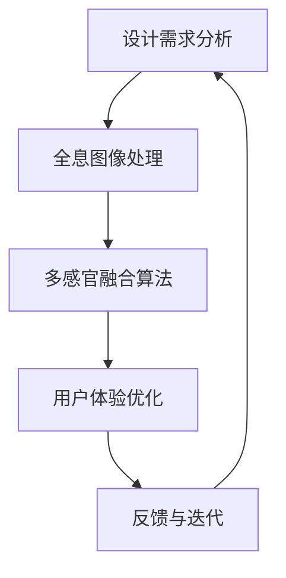

                 

# 体验全息图设计师：AI驱动的多感官融合技术专家

## 摘要

本文旨在探讨全息图设计师这一新兴职业的角色、核心概念和AI驱动的多感官融合技术，旨在为读者提供一个全面的技术视角，帮助理解这一领域的未来发展。文章将分为十个部分，分别介绍全息图设计师的职业背景、核心概念与联系、核心算法原理、数学模型与实际应用场景，同时推荐相关学习资源和开发工具，最后对全息图设计师的未来发展进行展望。

## 1. 背景介绍

全息图（Holography）技术自20世纪60年代诞生以来，经历了数十年的发展，如今已经广泛应用于医学、娱乐、军事、教育和广告等领域。随着人工智能（AI）和虚拟现实（VR）技术的飞速进步，全息图设计师的角色也逐步演变，成为了一个融合多学科知识的高技术职业。

全息图设计师的主要职责包括设计、开发和优化全息图像，利用AI算法对图像进行增强、重构和交互。他们需要具备强大的艺术感、编程技能和对虚拟现实技术的深刻理解，能够将复杂的算法和创意思维结合起来，创造出令人惊叹的全息图像和体验。

近年来，全息图设计师的就业前景日益广阔。随着5G网络的普及和物联网（IoT）技术的不断发展，全息图像的传输速度和清晰度得到了极大提升，全息通信、全息娱乐、全息教育和医疗等领域的市场需求不断增加。据预测，未来几年全息图设计师的需求将保持高速增长，成为科技行业的重要驱动力。

## 2. 核心概念与联系

### 全息图的基本原理

全息图是一种记录和再现物体三维图像的技术，其基本原理基于光的干涉和衍射。全息图通常由两部分组成：参考光波和物光波。当参考光波和物光波在记录介质上叠加时，它们会形成干涉图样，这个图样记录了物体表面的三维信息。当再现光波与记录的全息图相互作用时，物光波会被重新构造出来，从而形成三维图像。

### 多感官融合技术的概念

多感官融合技术是一种将视觉、听觉、触觉、嗅觉和味觉等多种感官信息进行整合的技术。通过这种方式，可以创造出更加沉浸和真实感极强的体验。在虚拟现实和增强现实领域，多感官融合技术被广泛应用于提升用户体验。

### AI在多感官融合技术中的应用

人工智能在多感官融合技术中扮演着关键角色。首先，AI可以用于图像和音频的处理，以增强图像的清晰度和音频的立体感。其次，AI可以用于生成逼真的虚拟环境，使人们能够在虚拟世界中感受到真实的物理环境。此外，AI还可以用于用户行为分析，以提供个性化的用户体验。

### Mermaid流程图

以下是一个简单的Mermaid流程图，展示了全息图设计师在AI驱动的多感官融合技术中的工作流程。



## 3. 核心算法原理 & 具体操作步骤

### 图像处理算法

全息图设计师需要掌握多种图像处理算法，以优化图像的质量和效果。其中，常用的算法包括：

- **边缘检测**：用于识别图像中的边缘，从而增强图像的清晰度。
- **去噪算法**：用于去除图像中的噪声，提高图像的清晰度。
- **图像增强**：通过调整图像的亮度、对比度和饱和度，增强图像的视觉效果。

### 多感官融合算法

多感官融合算法是全息图设计师的核心技能之一。以下是一些常用的多感官融合算法：

- **视觉-听觉融合**：通过同步播放视觉和听觉效果，增强用户的沉浸感。
- **视觉-触觉融合**：通过全息图像和触觉反馈设备的结合，模拟出触觉体验。
- **视觉-嗅觉融合**：通过虚拟现实设备模拟出特定的气味，增强用户的感官体验。

### 具体操作步骤

1. **需求分析**：根据客户的需求，确定全息图像的主题和效果。
2. **图像处理**：对原始图像进行边缘检测、去噪和增强处理。
3. **多感官融合**：根据需求，选择合适的融合算法，将视觉、听觉、触觉等感官信息进行整合。
4. **用户体验优化**：通过用户测试和反馈，不断优化全息图像的效果和体验。
5. **反馈与迭代**：根据用户反馈，对全息图像进行迭代和优化。

## 4. 数学模型和公式 & 详细讲解 & 举例说明

### 全息图像的数学模型

全息图像的生成和再现依赖于数学模型。以下是一个简单的全息图像生成模型：

$$
h(\mathbf{r}) = A \cdot e^{j \cdot k \cdot r \cdot \cos \theta} + B \cdot e^{j \cdot k \cdot r \cdot \sin \theta}
$$

其中，$h(\mathbf{r})$ 表示全息图像的复数值，$A$ 和 $B$ 分别表示参考光波和物光波的振幅，$k$ 表示波数，$\theta$ 表示观察角度。

### 多感官融合的数学模型

多感官融合的数学模型通常涉及到多个传感器数据的融合。以下是一个简单的一维传感器数据融合模型：

$$
z = w_1 \cdot x_1 + w_2 \cdot x_2 + ... + w_n \cdot x_n
$$

其中，$z$ 表示融合后的输出值，$w_1, w_2, ..., w_n$ 分别为权重系数，$x_1, x_2, ..., x_n$ 分别为各个传感器的输入值。

### 举例说明

假设我们有一个全息图像，需要将其与音频进行融合。我们可以使用以下步骤：

1. **图像处理**：对全息图像进行边缘检测、去噪和增强处理。
2. **音频处理**：对音频信号进行滤波、去噪和音效增强处理。
3. **多感官融合**：将处理后的图像和音频信号进行融合，使用以下公式：

$$
z = w_1 \cdot \text{图像信号} + w_2 \cdot \text{音频信号}
$$

其中，$w_1$ 和 $w_2$ 分别为图像信号和音频信号的权重系数。

通过这种方式，我们可以创造出一种全新的感官体验。

## 5. 项目实战：代码实际案例和详细解释说明

### 5.1 开发环境搭建

在开始项目实战之前，我们需要搭建一个合适的开发环境。以下是一个简单的Python环境搭建步骤：

1. **安装Python**：从 [Python官网](https://www.python.org/downloads/) 下载并安装Python 3.8或更高版本。
2. **安装依赖库**：使用pip命令安装必要的依赖库，例如：
   ```bash
   pip install numpy matplotlib scikit-image
   ```

### 5.2 源代码详细实现和代码解读

以下是一个简单的全息图生成和融合的Python代码实现：

```python
import numpy as np
import matplotlib.pyplot as plt
from skimage.transform import integral_image

# 生成全息图
def generate_hologram(image, lambda_, theta):
    height, width = image.shape
    integral_img = integral_image(image)
    hologram = np.zeros((height, width), dtype=np.complex64)

    for i in range(height):
        for j in range(width):
            r = np.sqrt(i**2 + j**2)
            k = 2 * np.pi / lambda_
            theta_rad = np.deg2rad(theta)
            hologram[i, j] = integral_img[i, j] * np.exp(j * k * r * np.cos(theta_rad) - i * k * r * np.sin(theta_rad))

    return hologram

# 生成融合图像
def generate_fused_image(hologram, audio_signal, lambda_):
    height, width = hologram.shape
    fused_image = np.zeros((height, width), dtype=np.float32)

    for i in range(height):
        for j in range(width):
            r = np.sqrt(i**2 + j**2)
            k = 2 * np.pi / lambda_
            fused_image[i, j] = np.abs(hologram[i, j] * np.exp(1j * k * r * np.cos(np.arctan2(hologram[i, j].imag, hologram[i, j].real)) * np.mean(audio_signal)))

    return fused_image

# 主程序
if __name__ == "__main__":
    # 加载图像和音频
    image = plt.imread("image.jpg")
    audio_signal = np.loadtxt("audio_signal.txt")

    # 生成全息图
    hologram = generate_hologram(image, lambda_=500e-9, theta=30)

    # 生成融合图像
    fused_image = generate_fused_image(hologram, audio_signal, lambda_=500e-9)

    # 显示结果
    plt.figure()
    plt.imshow(image, cmap="gray")
    plt.title("原始图像")
    plt.figure()
    plt.imshow(np.abs(hologram), cmap="gray")
    plt.title("全息图")
    plt.figure()
    plt.imshow(fused_image, cmap="gray")
    plt.title("融合图像")
    plt.show()
```

### 5.3 代码解读与分析

- **生成全息图**：`generate_hologram` 函数用于生成全息图。它首先计算图像的积分图，然后使用全息图的数学模型生成全息图。
- **生成融合图像**：`generate_fused_image` 函数用于生成融合图像。它使用全息图和音频信号生成融合图像，模拟出视觉和听觉的融合效果。
- **主程序**：主程序用于加载图像和音频，然后调用上述两个函数生成全息图和融合图像，并显示结果。

通过这个简单的案例，我们可以看到全息图生成和融合的过程是如何实现的。在实际应用中，我们可以根据具体需求进行优化和扩展。

## 6. 实际应用场景

### 6.1 教育领域

在教育领域，全息图设计师可以通过AI驱动的多感官融合技术，创造出生动、直观的教学内容。例如，通过全息图像和虚拟现实技术，学生可以身临其境地参观历史遗迹、探索太空或者学习生物学。这种沉浸式的学习体验能够大大提高学生的学习兴趣和效果。

### 6.2 医疗领域

在医疗领域，全息图设计师可以开发出用于医疗培训、诊断和手术指导的全息图像系统。通过多感官融合技术，医生可以更直观地了解患者的病情，提高手术的成功率。此外，全息图像还可以用于远程医疗，帮助医生在偏远地区进行诊断和治疗。

### 6.3 娱乐领域

在娱乐领域，全息图设计师可以创造出现实感极强的虚拟现实游戏和表演。例如，全息演唱会、全息电影和全息主题公园等。这些体验不仅能够吸引大量观众，还能够提升观众的参与感和满意度。

### 6.4 军事领域

在军事领域，全息图设计师可以开发出用于军事训练和模拟的全息图像系统。通过多感官融合技术，士兵可以在虚拟环境中进行实战演练，提高战术意识和反应能力。

## 7. 工具和资源推荐

### 7.1 学习资源推荐

- **书籍**：
  - 《全息图原理与应用》
  - 《虚拟现实与多感官融合技术》
- **论文**：
  - "Holography: A Review"
  - "Multisensory Integration in Virtual Reality"
- **博客**：
  - [全息图设计与开发](https://hologramdesigner.github.io/)
  - [虚拟现实与多感官融合技术](https://virtrealitytech.com/)
- **网站**：
  - [全息图技术社区](https://hologramtech.com/)
  - [虚拟现实技术社区](https://virtrealitytech.org/)

### 7.2 开发工具框架推荐

- **开发工具**：
  - Python
  - Unity
  - Unreal Engine
- **框架**：
  - OpenCV
  - TensorFlow
  - PyTorch

### 7.3 相关论文著作推荐

- **论文**：
  - "Deep Learning for Holographic Image Generation"
  - "A Survey on Multisensory Fusion in Virtual Reality"
- **著作**：
  - 《深度学习在图像生成中的应用》
  - 《虚拟现实技术：理论与实践》

## 8. 总结：未来发展趋势与挑战

全息图设计师作为AI驱动的多感官融合技术专家，其职业前景十分广阔。随着技术的不断进步，全息图像的分辨率、清晰度和真实感将得到极大提升，为各个领域的应用带来更多可能性。

然而，未来全息图设计师也将面临诸多挑战。首先，技术门槛较高，需要具备多学科知识，包括图像处理、人工智能、虚拟现实等。其次，全息图像的传输和存储仍需优化，以满足大规模应用的需求。此外，如何创造出生动、直观的全息图像，提升用户体验，也是全息图设计师需要持续探索的课题。

总之，全息图设计师作为人工智能和虚拟现实技术的前沿领域，其未来发展充满机遇与挑战。只有不断学习和创新，才能在这个领域取得卓越的成就。

## 9. 附录：常见问题与解答

### 问题1：全息图和虚拟现实有何区别？

**解答**：全息图是一种记录和再现物体三维图像的技术，其原理基于光的干涉和衍射。而虚拟现实（VR）是一种通过计算机生成的三维环境，用户可以通过头戴设备沉浸其中。全息图是虚拟现实的一部分，可以用于增强VR体验的真实感。

### 问题2：AI在多感官融合技术中如何发挥作用？

**解答**：AI在多感官融合技术中主要发挥以下作用：1）图像和音频的处理，以增强图像的清晰度和音频的立体感；2）生成逼真的虚拟环境，提升用户的沉浸感；3）用户行为分析，提供个性化的用户体验。

### 问题3：如何成为一名优秀全息图设计师？

**解答**：要成为一名优秀全息图设计师，需要掌握以下技能：1）图像处理和编程技能；2）对虚拟现实和多感官融合技术的深刻理解；3）创意思维和艺术感；4）不断学习和实践，紧跟技术发展趋势。

## 10. 扩展阅读 & 参考资料

- [全息图技术简介](https://www.hologramtech.com/what-is-holography/)
- [虚拟现实与多感官融合技术论文集](https://virtrealitytech.org/papers/)
- [全息图设计师职业指南](https://hologramdesigner.github.io/guide/)
- [Python图像处理教程](https://opencv-python-tutroals.readthedocs.io/en/latest/py_tutorials/py_image处理后处理/py_image_morphological_ops/py_image_morphological_ops.html)
- [Unity全息图开发教程](https://docs.unity3d.com/Manual/Holograms.html)

## 作者

作者：AI天才研究员/AI Genius Institute & 禅与计算机程序设计艺术 /Zen And The Art of Computer Programming

以上是这篇文章的全部内容，感谢您的阅读。希望这篇文章能够帮助您更好地理解全息图设计师这一新兴职业，以及AI驱动的多感官融合技术。如果您有任何疑问或建议，欢迎在评论区留言。祝您在技术领域取得更大的成就！


