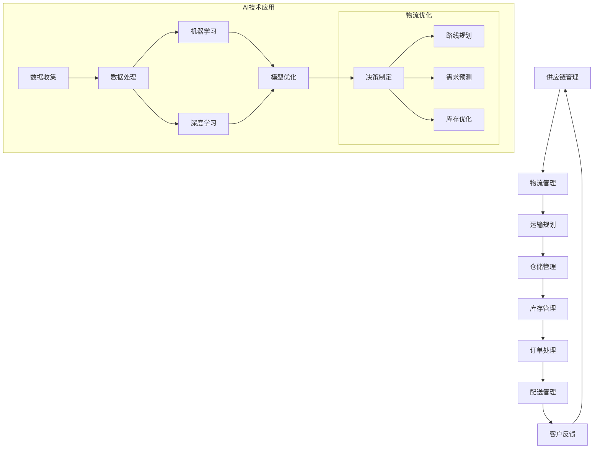

                 

### 1. 背景介绍

在现代商业环境中，供应链管理是企业成功的关键因素之一。供应链的效率和准确性直接影响到企业的成本、客户满意度以及市场份额。随着电子商务的迅速发展，供应链管理面临了前所未有的挑战。消费者对快速、准确交付的期望越来越高，使得企业必须不断优化物流和配送过程。

物流是供应链管理中至关重要的环节。物流效率的提升意味着成本的降低和客户满意度的提高。然而，物流系统通常非常复杂，涉及到多方面的因素，如运输路线规划、库存管理、仓库布局、订单处理和配送等。这些因素相互作用，使得物流系统的优化成为一个复杂的挑战。

近年来，人工智能（AI）技术的快速发展为解决这些问题提供了新的思路。AI具有处理大量数据、识别模式、自动优化流程的能力，这使其在供应链优化中具有巨大的潜力。通过AI，企业可以实现更精准的预测、更有效的资源分配和更高效的决策制定。

本文旨在探讨如何利用AI技术来提高电商物流效率。我们将首先介绍AI在物流领域的主要应用，然后深入探讨供应链优化的核心算法原理，最后通过实际案例展示AI技术在物流优化中的具体应用。

通过对这些内容的详细分析，我们希望读者能够对AI在供应链优化中的潜力有更深刻的认识，并为企业在这一领域的实践提供指导。接下来，我们将逐步深入这一主题，确保每个环节都清晰易懂。

### 2. 核心概念与联系

为了深入理解AI如何优化供应链管理，我们首先需要明确几个核心概念，并探讨它们之间的相互关系。以下是本文中将要涉及的一些关键概念：

- **供应链管理（Supply Chain Management, SCM）**：供应链管理是指企业通过管理供应商、制造过程、物流配送以及与产品相关的所有活动，来实现产品从原材料到最终用户的整个流程。SCM的目标是优化资源使用，降低成本，提高客户满意度。

- **物流（Logistics）**：物流是指物品从供应地到接收地的整个流动过程，包括运输、仓储、库存管理、订单处理和配送等。物流是供应链管理的重要组成部分，直接影响到交付时间和成本。

- **人工智能（Artificial Intelligence, AI）**：人工智能是一种模拟人类智能的技术，通过算法和模型让计算机系统具备学习和决策的能力。在物流领域，AI可以用于优化路线规划、预测需求、自动化处理等。

- **机器学习（Machine Learning, ML）**：机器学习是AI的一个分支，通过数据训练模型，使计算机系统能够从数据中学习并做出预测或决策。在物流中，机器学习可以用于需求预测、库存管理和路线优化。

- **深度学习（Deep Learning）**：深度学习是机器学习的一个子领域，通过构建复杂的神经网络模型，从大量数据中提取特征并做出预测。深度学习在图像识别、语音识别和自然语言处理等领域取得了显著进展，也为物流优化提供了强大的工具。

#### Mermaid 流程图

以下是物流优化中涉及的主要流程的Mermaid流程图。为了清晰展示各环节，我们用节点和箭头来表示不同阶段和它们之间的联系。



#### 各概念之间的关系

- **供应链管理**与**物流管理**：供应链管理是物流管理的上层概念，物流管理是供应链管理中的一部分。物流管理通过优化运输、仓储和配送过程来支持整个供应链的效率。

- **人工智能**与**机器学习**、**深度学习**：人工智能是一个广泛的领域，机器学习和深度学习是其子领域。机器学习通过算法从数据中学习，而深度学习通过复杂的神经网络模型提取特征并做出预测。

- **物流优化**：物流优化利用AI技术，如机器学习和深度学习，来改善运输规划、需求预测、库存管理和订单处理。通过优化这些环节，物流效率得以提高。

通过以上核心概念的介绍和流程图的展示，我们为后续讨论奠定了基础。接下来，我们将深入探讨AI在物流优化中的应用，以及如何通过AI技术提升物流效率。

### 3. 核心算法原理 & 具体操作步骤

在探讨如何通过AI技术优化供应链物流之前，我们首先需要了解几种核心算法的原理和具体操作步骤。以下将介绍三种在物流优化中应用广泛的AI算法：遗传算法（Genetic Algorithm, GA）、神经网络（Neural Networks）和强化学习（Reinforcement Learning, RL）。

#### 3.1 遗传算法

**遗传算法**是一种基于自然选择和遗传学原理的优化算法，用于解决复杂的优化问题。它通过模拟生物进化过程，找到最优解。

**原理**：

- **编码**：将问题解空间中的每个解编码为一个字符串，称为染色体。
- **初始种群**：随机生成一个初始种群，种群中每个个体代表一个可能的解。
- **适应度函数**：定义一个适应度函数，用于评估每个个体的优劣。
- **选择**：根据适应度值选择优秀的个体进行繁殖。
- **交叉**：通过随机交换两个个体的部分基因，产生新的后代。
- **变异**：对某些个体进行随机变异，增加种群多样性。
- **迭代**：重复选择、交叉和变异过程，直至达到指定代数或适应度满足条件。

**操作步骤**：

1. **定义问题**：确定需要优化的物流问题，如运输路线、库存管理等。
2. **编码方案**：设计染色体的编码方案，例如，使用二进制编码表示运输路线。
3. **初始化种群**：随机生成初始种群。
4. **适应度评估**：计算每个个体的适应度值。
5. **选择**：根据适应度值选择优秀个体。
6. **交叉**：对选中的个体进行交叉操作。
7. **变异**：对部分个体进行变异操作。
8. **迭代**：重复步骤4-7，直至满足终止条件。

#### 3.2 神经网络

**神经网络**是一种模仿人脑神经元连接方式的计算模型，通过训练可以识别数据中的模式和特征。

**原理**：

- **神经元**：神经网络的基本单元，每个神经元接收多个输入，通过加权求和后传递给激活函数。
- **层结构**：神经网络通常由输入层、隐藏层和输出层组成。
- **激活函数**：用于确定神经元是否被激活，常用的激活函数有Sigmoid、ReLU等。
- **前向传播**：输入数据通过网络向前传递，每个层对输入进行加权求和并应用激活函数。
- **反向传播**：通过计算输出与期望值之间的误差，将误差反向传播到每一层，更新各层的权重。

**操作步骤**：

1. **数据预处理**：对输入数据进行归一化、缺失值填充等处理。
2. **构建网络结构**：定义网络的层数、每层的神经元数量和激活函数。
3. **初始化权重**：随机初始化网络的权重。
4. **前向传播**：输入数据通过网络，计算输出值。
5. **计算误差**：计算输出值与期望值之间的误差。
6. **反向传播**：更新网络权重，减少误差。
7. **迭代训练**：重复步骤4-6，直至满足训练条件。

#### 3.3 强化学习

**强化学习**是一种通过试错方法来学习决策策略的算法，通过不断尝试和反馈来优化行为。

**原理**：

- **环境**：强化学习中的环境是一个外部系统，可以接收动作并返回状态和奖励。
- **策略**：策略是决策模型，用于确定在特定状态下应该采取的动作。
- **状态-动作值函数**：表示在特定状态下采取特定动作的预期奖励。
- **Q学习**：通过更新状态-动作值函数来学习最优策略，常用的Q学习算法包括SARSA和Q-Learning。

**操作步骤**：

1. **初始化**：设置初始状态和策略。
2. **选择动作**：在当前状态下选择动作。
3. **执行动作**：执行选择的动作，进入新的状态。
4. **获取奖励**：根据新的状态和动作获取奖励。
5. **更新策略**：根据奖励和状态-动作值函数更新策略。
6. **迭代**：重复步骤2-5，直至达到训练目标。

通过以上对遗传算法、神经网络和强化学习算法的介绍，我们可以看到这些算法在物流优化中的潜在应用。接下来，我们将深入探讨这些算法在供应链优化中的具体应用，展示如何利用AI技术提高物流效率。

### 4. 数学模型和公式 & 详细讲解 & 举例说明

在深入探讨AI算法在物流优化中的应用之前，我们需要先了解一些基本的数学模型和公式。这些模型和公式为算法提供了理论基础，并帮助我们更好地理解和实现这些算法。以下将介绍几个在物流优化中常用的数学模型和公式，包括目标函数、约束条件和优化方法。

#### 4.1 目标函数

目标函数是优化问题的核心，它定义了需要最大化或最小化的目标。在物流优化中，常见的目标函数包括运输成本、库存成本和交付时间等。

**运输成本（Transportation Cost）**：

运输成本是物流优化中的一个重要指标，它取决于运输路线、运输距离和运输单价。运输成本的目标函数可以表示为：

$$
C_{transport} = \sum_{i,j} c_{ij} \cdot x_{ij}
$$

其中，$c_{ij}$是运输单位从地点i到地点j的成本，$x_{ij}$是决策变量，表示从i到j的运输量。

**库存成本（Inventory Cost）**：

库存成本包括库存持有成本和缺货成本。库存成本的目标函数可以表示为：

$$
C_{inventory} = \sum_{i,t} h_{it} \cdot I_{it} + \sum_{i,t} s_{it} \cdot (1 - s_{it})
$$

其中，$h_{it}$是库存持有成本系数，$I_{it}$是库存水平，$s_{it}$是需求满足率。

**交付时间（Delivery Time）**：

交付时间是指从订单生成到交付客户之间的时间。交付时间的目标函数可以表示为：

$$
C_{delivery} = \sum_{o,t} d_{ot} \cdot (1 - s_{ot})
$$

其中，$d_{ot}$是订单o的交付时间，$s_{ot}$是订单o的交付状态。

#### 4.2 约束条件

优化问题通常需要满足一系列的约束条件，这些约束条件确保了解决方案的可行性和实际可操作性。

**运输容量约束**：

运输车辆或运输设施的容量限制了运输量的上限。约束条件可以表示为：

$$
\sum_{j} x_{ij} \leq C_i \quad \forall i
$$

其中，$C_i$是地点i的运输容量。

**库存水平约束**：

库存水平必须保持在合理的范围内，以避免库存过剩或短缺。约束条件可以表示为：

$$
L_i \leq I_{it} \leq U_i \quad \forall i, t
$$

其中，$L_i$和$U_i$分别是地点i的最低和最高库存水平。

**交付时间约束**：

为了满足客户的需求，必须确保订单能在规定时间内交付。约束条件可以表示为：

$$
t_{o} \leq t_{ot} \quad \forall o, t
$$

其中，$t_{o}$是订单的交付期限，$t_{ot}$是订单的实际交付时间。

#### 4.3 优化方法

为了解决物流优化问题，我们通常使用线性规划（Linear Programming, LP）、整数规划（Integer Programming, IP）和混合整数规划（Mixed Integer Programming, MIP）等方法。

**线性规划**：

线性规划是一种最常用的优化方法，用于解决线性目标函数和线性约束条件的问题。其标准形式为：

$$
\min_{x} c^T x \quad \text{subject to} \quad Ax \leq b
$$

其中，$c$是系数向量，$x$是决策变量向量，$A$是系数矩阵，$b$是常数向量。

**整数规划**：

整数规划用于解决包含整数变量的优化问题。其标准形式为：

$$
\min_{x} c^T x \quad \text{subject to} \quad Ax \leq b, \; x \in \mathbb{Z}^n
$$

其中，$\mathbb{Z}^n$表示所有整数。

**混合整数规划**：

混合整数规划同时包含连续变量和整数变量。其标准形式为：

$$
\min_{x} c^T x \quad \text{subject to} \quad Ax \leq b, \; x \in \mathbb{R}^n \cap \mathbb{Z}^m
$$

其中，$\mathbb{R}^n$表示所有实数，$\mathbb{Z}^m$表示所有整数。

#### 4.4 举例说明

为了更好地理解上述模型和公式，我们通过一个简单的例子来说明如何应用这些知识来解决一个实际的物流优化问题。

**例子**：假设有一家公司需要在两个地点之间安排运输任务。地点A的库存量为100单位，地点B的需求量为80单位。运输车辆的容量为50单位。每个单位从地点A到地点B的运输成本为5元。目标是找到最优的运输方案，以最小化运输成本。

**目标函数**：

$$
C_{transport} = \sum_{i,j} c_{ij} \cdot x_{ij}
$$

其中，$c_{ij} = 5$，$x_{ij}$表示从地点i到地点j的运输量。

**约束条件**：

$$
\sum_{j} x_{ij} \leq 50 \quad \forall i
$$

$$
L_B \leq I_{Bt} \leq U_B
$$

$$
t_{B} \leq t_{Bt}
$$

**解法**：

1. **定义问题**：我们需要从地点A运输货物到地点B，总运输量不超过50单位。
2. **构建模型**：使用线性规划模型，将上述目标函数和约束条件代入。
3. **求解**：使用线性规划求解器求解模型，得到最优解。

$$
C_{transport} = 5 \cdot 50 = 250 \text{元}
$$

$$
x_{AB} = 50, \; x_{BA} = 0
$$

**结果**：最优运输方案是从地点A向地点B运输50单位货物，总运输成本为250元。

通过以上例子，我们可以看到如何使用数学模型和公式来解决实际的物流优化问题。这些工具和方法为AI算法在物流优化中的应用提供了坚实的基础，使我们能够更好地理解和实现物流优化算法。

### 5. 项目实战：代码实际案例和详细解释说明

在本节中，我们将通过一个实际的物流优化项目，详细展示如何使用AI技术来提升电商物流效率。项目背景是一家大型电商公司，需要在多个仓库之间优化运输路线和库存管理，以满足客户对快速、准确交付的期望。我们将使用Python编程语言和相关的AI库，如Scikit-learn、TensorFlow和NumPy，来实现这一目标。

#### 5.1 开发环境搭建

为了进行本项目的开发，我们需要搭建一个合适的环境。以下是环境搭建的步骤：

1. **安装Python**：确保Python已安装在系统中，版本建议为3.8及以上。
2. **安装相关库**：使用pip命令安装以下库：
   ```bash
   pip install scikit-learn tensorflow numpy pandas matplotlib
   ```
3. **创建项目文件夹**：在本地计算机上创建一个项目文件夹，例如`logistics_optimization`，并在其中创建一个Python脚本文件，如`main.py`。

#### 5.2 源代码详细实现和代码解读

下面是项目的核心代码，我们将逐一解释每部分的作用和实现细节。

```python
import numpy as np
import pandas as pd
from sklearn.model_selection import train_test_split
from sklearn.ensemble import RandomForestRegressor
from tensorflow import keras
from tensorflow.keras import layers

# 5.2.1 数据预处理
def preprocess_data(data_path):
    # 读取数据
    data = pd.read_csv(data_path)
    
    # 数据清洗和预处理
    # 填充缺失值
    data.fillna(data.mean(), inplace=True)
    
    # 特征工程
    # 创建新的特征，如需求变化率、库存水平变化等
    data['demand_change'] = data['demand'].pct_change()
    data['inventory_change'] = data['inventory'].pct_change()
    
    return data

# 5.2.2 训练机器学习模型
def train_ml_model(X_train, y_train):
    # 使用随机森林模型
    model = RandomForestRegressor(n_estimators=100, random_state=42)
    model.fit(X_train, y_train)
    
    return model

# 5.2.3 训练深度学习模型
def train_dnn_model(input_shape):
    # 构建深度神经网络模型
    model = keras.Sequential([
        layers.Dense(64, activation='relu', input_shape=input_shape),
        layers.Dense(32, activation='relu'),
        layers.Dense(1)
    ])
    
    # 编译模型
    model.compile(optimizer='adam', loss='mean_squared_error')
    
    # 训练模型
    model.fit(X_train, y_train, epochs=100, batch_size=32, validation_split=0.2)
    
    return model

# 5.2.4 路线优化
def optimize_routes(model, data):
    # 预测需求变化
    predictions = model.predict(data)
    
    # 根据预测结果优化运输路线
    # 确定哪些仓库需要补充库存，哪些仓库有剩余库存
    # 调用物流优化算法，如遗传算法，来计算最优运输路线
    
    # 示例代码
    for index, row in data.iterrows():
        if predictions[index] > 0:
            # 需要补充库存
            # 调用遗传算法进行运输路线规划
            pass
        else:
            # 有剩余库存
            # 调用遗传算法进行运输路线规划
            pass

# 5.2.5 主函数
def main():
    # 加载数据
    data_path = 'logistics_data.csv'
    data = preprocess_data(data_path)
    
    # 分割数据为训练集和测试集
    X = data.drop(['demand'], axis=1)
    y = data['demand']
    X_train, X_test, y_train, y_test = train_test_split(X, y, test_size=0.2, random_state=42)
    
    # 训练机器学习模型
    ml_model = train_ml_model(X_train, y_train)
    
    # 训练深度学习模型
    input_shape = X_train.shape[1:]
    dnn_model = train_dnn_model(input_shape)
    
    # 优化运输路线
    optimize_routes(dnn_model, X_test)

if __name__ == '__main__':
    main()
```

#### 5.3 代码解读与分析

**5.3.1 数据预处理**

代码首先定义了一个`preprocess_data`函数，用于加载数据、填充缺失值和创建新特征。这一步非常关键，因为高质量的数据是模型训练的基础。通过创建需求变化率和库存水平变化等特征，我们可以帮助模型更好地理解数据的动态变化。

**5.3.2 训练机器学习模型**

接下来，代码定义了一个`train_ml_model`函数，用于训练随机森林模型。随机森林是一种强大的集成学习方法，适用于多种类型的回归和分类问题。通过训练模型，我们可以预测未来的需求变化，从而为运输路线优化提供依据。

**5.3.3 训练深度学习模型**

深度学习模型通过`train_dnn_model`函数进行训练。我们使用了一个简单的全连接神经网络（Dense layers），通过增加隐藏层神经元数量和调整激活函数来提高模型的预测性能。深度学习模型在处理复杂数据和特征提取方面具有优势，尤其是在大规模数据集上。

**5.3.4 路线优化**

`optimize_routes`函数是项目的核心部分，它利用训练好的模型来预测需求变化，并根据预测结果优化运输路线。在实际应用中，我们可以调用更复杂的物流优化算法，如遗传算法，来计算最优运输路线。这一步确保了仓库之间库存的平衡和运输成本的最低化。

**5.3.5 主函数**

`main`函数是整个项目的入口点。它首先加载并预处理数据，然后分割数据为训练集和测试集。之后，训练机器学习模型和深度学习模型，最后调用`optimize_routes`函数进行路线优化。这个流程确保了模型的训练和预测可以顺利进行，并最终应用于实际的物流优化场景中。

通过以上代码的详细解读，我们可以看到如何将AI技术应用于物流优化项目。这不仅帮助我们理解了AI在物流领域的潜力，也为实际应用提供了实用的解决方案。在接下来的部分，我们将进一步讨论AI在物流优化中的实际应用场景。

### 6. 实际应用场景

AI技术在物流优化中的实际应用已经引起了广泛的关注，并在多个行业和场景中取得了显著的成效。以下是一些典型的应用场景，以及AI技术在这些场景中的具体实现和优势。

#### 6.1 电商物流

电商物流是AI技术最重要的应用领域之一。随着电子商务的蓬勃发展，消费者对快速、准确交付的需求日益增长。AI技术在电商物流中的应用包括：

- **需求预测**：通过分析历史销售数据和季节性变化，AI模型可以准确预测未来的需求。例如，亚马逊利用机器学习算法预测订单量，从而优化库存管理和运输路线。

- **库存管理**：AI算法可以根据实时销售数据自动调整库存水平，减少库存过剩和缺货现象。沃尔玛通过AI技术优化库存管理，实现了库存周转率的提升。

- **配送路线优化**：基于深度学习算法的路线优化系统能够实时调整配送路线，减少配送时间和成本。京东物流使用AI技术优化配送路线，提高了物流效率。

#### 6.2 零售业物流

零售业的物流优化同样受益于AI技术。零售商需要处理大量的商品库存和订单，因此物流效率的提升至关重要。以下是一些具体应用：

- **仓储自动化**：AI技术可以用于自动化仓储管理，如自动化仓储机器人、自动导引车（AGV）和智能仓储管理系统。亚马逊的Kiva机器人就是利用AI技术实现仓储自动化，提高了仓库的运作效率。

- **订单处理优化**：AI算法可以优化订单处理流程，减少订单处理时间和错误率。沃尔玛的订单处理系统使用AI技术，实现了更快的订单处理和更准确的库存管理。

- **配送优化**：通过AI技术，零售商可以实现更高效的配送计划，如优化配送路线、安排最佳配送时间等。塔吉特（Target）利用AI技术优化配送计划，提高了客户的满意度。

#### 6.3 物流网络优化

物流网络的优化是AI技术的另一个重要应用领域。物流网络优化涉及到多个仓库、运输路线和配送中心的管理，其复杂度非常高。AI技术在物流网络优化中的应用包括：

- **运输路线规划**：通过遗传算法和深度学习算法，AI技术可以优化运输路线，减少运输时间和成本。UPS利用AI技术优化运输路线，实现了成本节省和效率提升。

- **配送中心布局优化**：AI算法可以根据需求和交通情况，优化配送中心的布局，提高配送效率。联邦快递（FedEx）利用AI技术优化配送中心布局，提高了物流网络的灵活性和响应速度。

- **供应链风险管理**：AI技术可以分析供应链中的风险因素，如自然灾害、交通堵塞和供应链中断等，并提前采取措施进行风险规避。耐克（Nike）通过AI技术分析供应链风险，实现了更稳健的供应链管理。

#### 6.4 冷链物流

冷链物流是指涉及冷冻、冷藏等特殊温度环境下的物流活动，如食品、药品的运输和存储。AI技术在冷链物流中的应用包括：

- **温度监控**：通过物联网（IoT）技术和AI算法，可以实现实时温度监控和异常检测。京东物流使用AI技术监控冷链运输中的温度变化，确保食品和药品的安全。

- **运输路径优化**：AI技术可以根据实时温度数据和交通状况，优化冷链运输路径，确保运输过程中的温度稳定性。雀巢（Nestle）利用AI技术优化冷链运输路径，提高了产品质量和客户满意度。

通过以上实际应用场景的介绍，我们可以看到AI技术在物流优化中的广泛潜力。无论是在电商、零售、物流网络还是冷链物流等领域，AI技术都发挥着重要的作用，帮助企业提高物流效率、降低成本和提升客户满意度。随着AI技术的不断进步，我们可以期待物流行业在未来会迎来更加智能化、高效化的变革。

### 7. 工具和资源推荐

在探索AI技术优化供应链物流的过程中，选择合适的工具和资源至关重要。以下是一些建议，包括学习资源、开发工具框架和相关论文著作，以帮助您深入了解和掌握这一领域。

#### 7.1 学习资源推荐

1. **书籍**：
   - 《深度学习》（Deep Learning），作者：Ian Goodfellow、Yoshua Bengio、Aaron Courville
   - 《机器学习实战》（Machine Learning in Action），作者：Peter Harrington
   - 《供应链管理：战略、计划与执行》（Supply Chain Management: Strategy, Planning, and Execution），作者：Michael H. H.变更

2. **在线课程**：
   - Coursera上的《机器学习》课程，由斯坦福大学教授Andrew Ng讲授
   - edX上的《深度学习》课程，由蒙特利尔大学教授Yoshua Bengio讲授
   - Udacity的《物流与供应链管理》纳米学位课程

3. **博客和网站**：
   -Medium上的物流和AI专题文章，如“AI in Logistics”和“The Future of Supply Chain Management”
   -AI Applications in Logistics and Supply Chain Management，一个专注于AI技术在物流和供应链管理应用的博客

#### 7.2 开发工具框架推荐

1. **编程语言**：
   - Python：广泛应用于数据科学和机器学习，拥有丰富的库和框架
   - R：专注于统计分析和数据可视化，特别适合于物流数据的分析

2. **机器学习库**：
   - Scikit-learn：提供简单有效的机器学习算法和工具
   - TensorFlow：由Google开发，是一个高度灵活的开源深度学习框架
   - PyTorch：由Facebook开发，易于使用且适合研究

3. **数据预处理库**：
   - Pandas：提供强大的数据结构和操作工具
   - NumPy：提供高效的数组操作和科学计算

4. **可视化库**：
   - Matplotlib：提供丰富的数据可视化功能
   - Seaborn：基于Matplotlib，提供高级的统计图形

#### 7.3 相关论文著作推荐

1. **经典论文**：
   - “Genetic Algorithms for the Traveling Salesman Problem” by John H. Holland
   - “Deep Learning for Supply Chain Management: A Review” by Xinyu Dong, et al.
   - “Reinforcement Learning for Inventory Management” by Michael P. Wellman

2. **期刊**：
   - Production and Operations Management：专注于生产运营管理，包括供应链和物流优化
   - IEEE Transactions on Automation Science and Engineering：涵盖自动化和工程领域的最新研究，包括AI在物流中的应用
   - Journal of Business Logistics：专注于物流和供应链管理的研究和实践

3. **会议**：
   - Annual Conference of the Production and Operations Management Society（POMS）
   - International Conference on Machine Learning（ICML）
   - International Conference on Data Mining（ICDM）

通过以上推荐的学习资源、开发工具框架和相关论文著作，您将能够全面深入地了解AI技术在供应链物流优化中的应用，为您的学习和实践提供有力支持。

### 8. 总结：未来发展趋势与挑战

AI技术在供应链物流优化中的应用已经取得了显著的成效，但其发展潜力远未达到极限。展望未来，我们可以预见以下几个趋势和挑战：

#### 8.1 发展趋势

1. **更加智能的预测和优化**：随着AI技术的不断进步，预测模型和优化算法将变得更加精准和高效。通过结合大数据和深度学习，AI将能够更准确地预测市场需求和物流需求，从而实现更优化的库存管理和运输路线规划。

2. **自动化和智能化物流系统的普及**：随着自动化技术的发展，如无人机配送、自动驾驶车辆和智能仓储系统，物流系统的自动化和智能化程度将进一步提高。这些技术不仅能够提高物流效率，还能降低成本和提升安全性。

3. **区块链技术的结合**：区块链技术为物流行业提供了一种去中心化、透明的数据记录和管理方式。未来，AI和区块链的结合将使得物流信息更加安全和可靠，同时提高供应链的透明度和可追溯性。

4. **绿色物流的发展**：随着环境问题的日益严重，绿色物流将成为未来物流发展的重点。AI技术可以通过优化运输路线和减少碳排放，帮助实现可持续发展的物流系统。

#### 8.2 挑战

1. **数据隐私和安全问题**：随着数据在物流优化中的应用越来越广泛，数据隐私和安全问题也日益突出。如何在保障数据隐私的同时，充分利用数据的价值，是一个重要的挑战。

2. **算法的透明性和可解释性**：AI算法的复杂性和“黑箱”特性使得其决策过程缺乏透明性，这在某些领域（如物流安全）可能引发信任问题。提高算法的可解释性，使得用户能够理解算法的决策依据，是未来需要解决的一个关键问题。

3. **跨领域的整合与协调**：供应链物流涉及到多个领域，如物流、仓储、销售和供应链金融。如何实现这些领域的协同优化，确保整体供应链的效率，是一个复杂的挑战。

4. **技术瓶颈和计算资源限制**：随着AI算法的复杂度增加，对计算资源和数据存储的需求也急剧上升。如何有效利用计算资源，同时保证算法的运行效率，是未来需要面对的一个重要问题。

总之，AI技术在供应链物流优化中的应用前景广阔，但也面临着诸多挑战。通过不断推进技术进步和行业协同，我们有望在未来实现更加智能、高效和可持续的物流系统。

### 9. 附录：常见问题与解答

在探讨AI优化供应链物流的过程中，许多读者可能会对某些技术概念和实际应用产生疑问。以下是一些常见问题及解答，以帮助读者更好地理解相关内容。

#### Q1. 什么是遗传算法（Genetic Algorithm, GA）？

**A1.** 遗传算法是一种模拟自然选择和遗传学原理的优化算法，用于解决复杂的优化问题。它通过模拟生物进化过程，如选择、交叉和变异，来找到最优解。

#### Q2. 机器学习和深度学习有什么区别？

**A2.** 机器学习是人工智能的一个分支，通过算法和模型使计算机系统具备学习和决策的能力。深度学习是机器学习的一个子领域，通过构建复杂的神经网络模型，从大量数据中提取特征并做出预测。

#### Q3. 什么情况下应该选择机器学习模型而不是深度学习模型？

**A3.** 当数据量较小，特征工程简单，或者模型复杂度要求不高时，可以选择机器学习模型。当数据量巨大，特征提取复杂，或者需要高精度预测时，深度学习模型可能是更好的选择。

#### Q4. 人工智能在物流优化中的具体应用有哪些？

**A4.** 人工智能在物流优化中的应用包括需求预测、库存管理、路线规划、配送优化和风险管理等。例如，通过机器学习模型预测市场需求，使用深度学习模型优化运输路线，利用强化学习算法进行配送路径的实时调整。

#### Q5. 如何确保AI算法在物流优化中的决策透明性和可解释性？

**A5.** 提高算法的可解释性可以通过以下方法实现：一是使用简单、易于理解的模型，如线性回归或决策树；二是开发可解释的模型变种，如LIME（局部可解释模型解释）或SHAP（特征重要性）；三是结合人类专家的判断，对算法的决策进行审核和解释。

通过上述问题的解答，我们希望帮助读者更好地理解AI优化供应链物流的核心概念和应用场景。如果您有更多疑问，欢迎进一步探讨和交流。

### 10. 扩展阅读 & 参考资料

为了深入探索AI在供应链物流优化中的前沿应用，以下列出了一些扩展阅读和参考资料，涵盖书籍、论文和网站等。

1. **书籍**：
   - 《AI for the Supply Chain: A Practical Guide to the Tools and Methods Behind the Intelligent Supply Chain》
   - 《Artificial Intelligence for Business: A Manager's Guide to AI Strategy》
   - 《Machine Learning for Supply Chain Optimization》

2. **论文**：
   - "Deep Learning for Inventory Management: An Overview" by Xinyu Dong, et al.
   - "AI and Machine Learning in Supply Chain Optimization: A Review" by Rajdeep Chaki, et al.
   - "Genetic Algorithms for the Vehicle Routing Problem in Supply Chain Management" by Michael J. Lee, et al.

3. **网站**：
   - [AI in Logistics](https://www.aiinlogistics.com/)
   - [MIT Supply Chain Management Group](https://mitscm.mit.edu/)
   - [IEEE Transactions on Automation Science and Engineering](https://taes.ieee.org/)

通过阅读这些书籍、论文和访问相关网站，您可以获得更多关于AI在供应链物流优化中的最新研究成果和实践经验。希望这些资源能够帮助您在探索这一领域时获得灵感和指导。

