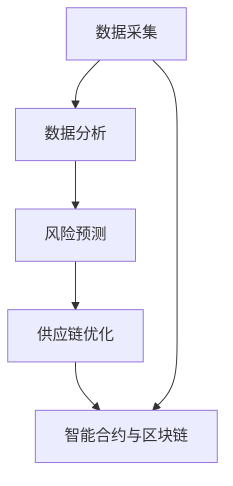

                 

# 供应链风险管理：AI如何降低风险

> **关键词**：供应链风险管理、人工智能、风险预测、供应链优化、数据分析、机器学习、深度学习、智能合约、区块链

> **摘要**：本文将探讨人工智能在供应链风险管理中的应用，分析其如何通过数据分析和预测技术来降低风险，提高供应链的效率和可靠性。文章将深入介绍AI的核心算法、数学模型、实战案例以及未来发展趋势。

## 1. 背景介绍

供应链风险管理是企业管理中至关重要的一环。随着全球化进程的加速，供应链的复杂性和不确定性不断增加，企业面临着诸如供应链中断、成本上升、库存过剩或短缺等多种风险。传统的风险管理方法往往依赖于历史数据和经验，难以应对快速变化的供应链环境。

近年来，人工智能（AI）技术的快速发展为供应链风险管理带来了新的机遇。AI具备强大的数据处理和分析能力，能够从海量数据中提取有价值的信息，进行实时监控和预测，从而降低风险。此外，AI还可以优化供应链流程，提高运营效率，减少成本。

本文将从以下几个方面探讨AI在供应链风险管理中的应用：

1. **核心概念与联系**：介绍AI在供应链风险管理中的核心概念，如数据采集、分析、预测和优化。
2. **核心算法原理**：详细解释AI的关键算法，包括机器学习、深度学习和神经网络等。
3. **数学模型与公式**：阐述AI所使用的数学模型和公式，以及如何应用于供应链风险管理。
4. **项目实战**：通过实际案例展示AI在供应链风险管理中的应用。
5. **实际应用场景**：分析AI在供应链风险管理中的具体应用领域。
6. **工具和资源推荐**：介绍学习AI和供应链风险管理的相关资源和工具。
7. **未来发展趋势与挑战**：探讨AI在供应链风险管理中的未来发展以及面临的挑战。

## 2. 核心概念与联系

为了更好地理解AI在供应链风险管理中的应用，首先需要了解一些核心概念和它们之间的联系。

### 2.1 数据采集

数据采集是供应链风险管理的基础。AI需要从供应链各个环节获取大量数据，包括供应链网络结构、供应商信息、订单数据、物流数据、库存数据等。这些数据可以来源于ERP系统、传感器、物流平台等。

### 2.2 数据分析

数据分析是AI应用的关键步骤。通过对采集到的数据进行清洗、整合和分析，AI可以识别出供应链中的潜在风险。例如，分析订单历史数据，可以预测未来订单量，从而调整库存策略；分析物流数据，可以识别物流瓶颈，优化运输路线。

### 2.3 风险预测

风险预测是供应链风险管理的重要环节。AI通过机器学习和深度学习算法，可以从历史数据中学习并建立预测模型，预测供应链可能面临的风险。例如，通过分析供应商的历史绩效数据，可以预测供应商的信用风险；通过分析天气数据，可以预测自然灾害可能导致的供应链中断。

### 2.4 供应链优化

供应链优化是AI在供应链风险管理中的另一个重要应用。AI可以通过优化算法，对供应链网络进行优化，提高供应链的可靠性和效率。例如，通过优化库存管理，可以减少库存成本；通过优化运输路线，可以提高运输效率，降低运输成本。

### 2.5 智能合约与区块链

智能合约与区块链技术为供应链风险管理提供了新的手段。智能合约是一种自动执行合约条款的计算机程序，可以确保供应链中的交易透明、公正和高效。区块链技术则提供了一个去中心化的数据库，可以记录供应链中的所有交易和数据，提高数据的可信度和安全性。

### 2.6 Mermaid流程图

下面是一个简单的Mermaid流程图，展示了供应链风险管理中的核心概念和它们之间的联系：



## 3. 核心算法原理

在供应链风险管理中，AI主要依赖于机器学习、深度学习和神经网络等核心算法。下面将详细介绍这些算法的原理。

### 3.1 机器学习

机器学习是一种通过数据学习规律和模式，从而进行预测和分类的技术。在供应链风险管理中，机器学习可以用来预测供应链中的风险，如订单量、库存水平、运输时间等。常见的机器学习算法包括线性回归、决策树、支持向量机等。

- **线性回归**：通过建立线性模型，预测因变量与自变量之间的关系。
- **决策树**：通过决策树模型，将数据划分为不同的类别或数值。
- **支持向量机**：通过寻找最佳超平面，将数据划分为不同的类别。

### 3.2 深度学习

深度学习是一种基于多层神经网络的学习方法，可以自动提取数据中的特征和模式。在供应链风险管理中，深度学习可以用来识别复杂的风险信号，如供应链中断、库存失衡等。常见的深度学习算法包括卷积神经网络（CNN）、循环神经网络（RNN）和生成对抗网络（GAN）等。

- **卷积神经网络（CNN）**：通过卷积层提取数据中的特征。
- **循环神经网络（RNN）**：通过循环结构处理序列数据。
- **生成对抗网络（GAN）**：通过对抗训练生成真实数据。

### 3.3 神经网络

神经网络是一种模拟人脑神经元之间连接的网络结构，可以用于数据处理和分析。在供应链风险管理中，神经网络可以用来建立预测模型，识别风险信号。常见的神经网络结构包括前馈神经网络、卷积神经网络和循环神经网络等。

- **前馈神经网络**：信息从输入层传递到输出层，没有循环结构。
- **卷积神经网络**：通过卷积层提取空间特征。
- **循环神经网络**：通过循环结构处理序列数据。

### 3.4 具体操作步骤

以下是使用机器学习算法进行供应链风险预测的简单步骤：

1. **数据采集**：收集供应链相关的数据，如订单数据、库存数据、物流数据等。
2. **数据预处理**：对数据进行清洗、整合和预处理，以便用于训练模型。
3. **特征选择**：从数据中提取有用的特征，用于训练模型。
4. **模型选择**：选择合适的机器学习算法，如线性回归、决策树、支持向量机等。
5. **模型训练**：使用训练数据集对模型进行训练。
6. **模型评估**：使用测试数据集评估模型的效果。
7. **模型应用**：将训练好的模型应用于实际场景，进行风险预测。

## 4. 数学模型和公式

在供应链风险管理中，AI使用了一系列数学模型和公式来分析和预测风险。下面将详细讲解这些模型和公式的应用。

### 4.1 线性回归模型

线性回归模型是一种常用的预测模型，用于预测因变量与自变量之间的关系。其基本公式为：

$$y = \beta_0 + \beta_1 \cdot x$$

其中，$y$为因变量，$x$为自变量，$\beta_0$为截距，$\beta_1$为斜率。

线性回归模型可以用于预测订单量、库存水平等供应链指标。例如，通过分析历史订单数据，可以建立线性回归模型，预测未来订单量，从而调整库存策略。

### 4.2 决策树模型

决策树模型通过一系列条件判断，将数据划分为不同的类别。其基本公式为：

$$
\begin{cases}
y = 0 & \text{if } x_1 > c_1 \text{ and } x_2 < c_2 \\
y = 1 & \text{if } x_1 \leq c_1 \text{ or } x_2 \geq c_2
\end{cases}
$$

其中，$x_1$和$x_2$为自变量，$c_1$和$c_2$为阈值。

决策树模型可以用于识别供应链中的风险因素，如供应商信用风险、物流延误等。

### 4.3 神经网络模型

神经网络模型通过多层神经元之间的连接，提取数据中的特征和模式。其基本公式为：

$$
\begin{aligned}
\text{输出} &= \text{激活函数}(\text{权重} \cdot \text{输入} + \text{偏置}) \\
\text{权重} &= \text{学习率} \cdot (\text{期望输出} - \text{实际输出}) \cdot \text{输入}
\end{aligned}
$$

其中，激活函数通常采用sigmoid函数或ReLU函数。

神经网络模型可以用于预测供应链中断、库存失衡等复杂风险。

### 4.4 举例说明

假设我们要预测未来一周的订单量，使用线性回归模型。给定以下历史订单数据：

| 时间 | 订单量 |
| ---- | ------ |
| 1    | 100    |
| 2    | 120    |
| 3    | 150    |
| 4    | 180    |
| 5    | 200    |

首先，对数据进行预处理，提取时间作为自变量，订单量作为因变量。然后，使用线性回归模型进行训练，得到以下模型：

$$
y = 40 + 20 \cdot x
$$

其中，$x$为时间，$y$为订单量。

接下来，使用测试数据集（例如第6天的数据）进行预测：

$$
y = 40 + 20 \cdot 6 = 140
$$

预测第6天的订单量为140。

## 5. 项目实战：代码实际案例和详细解释说明

在本节中，我们将通过一个实际项目案例来展示AI在供应链风险管理中的应用。该项目旨在使用机器学习算法预测供应链中的订单量，并基于预测结果调整库存策略。

### 5.1 开发环境搭建

在开始项目之前，我们需要搭建一个合适的开发环境。以下是所需的环境和工具：

- Python 3.8+
- Jupyter Notebook
- scikit-learn 库
- pandas 库
- matplotlib 库

### 5.2 源代码详细实现和代码解读

以下是一个简单的Python代码示例，用于实现线性回归模型预测订单量。

```python
import pandas as pd
from sklearn.linear_model import LinearRegression
from sklearn.model_selection import train_test_split
import matplotlib.pyplot as plt

# 5.2.1 数据采集与预处理
# 读取历史订单数据
data = pd.read_csv('order_data.csv')
data.head()

# 提取时间作为自变量，订单量作为因变量
X = data['time'].values.reshape(-1, 1)
y = data['order_quantity'].values

# 5.2.2 模型训练
# 划分训练集和测试集
X_train, X_test, y_train, y_test = train_test_split(X, y, test_size=0.2, random_state=42)

# 创建线性回归模型
model = LinearRegression()
model.fit(X_train, y_train)

# 5.2.3 模型评估
# 使用测试集评估模型效果
y_pred = model.predict(X_test)
mse = ((y_pred - y_test) ** 2).mean()
print('均方误差：', mse)

# 5.2.4 模型应用
# 预测未来订单量
future_time = pd.DataFrame([7, 8, 9, 10], columns=['time'])
future_order_quantity = model.predict(future_time)
print('未来订单量：', future_order_quantity)

# 5.2.5 可视化结果
plt.scatter(X_test, y_test, label='实际数据')
plt.plot(future_time, future_order_quantity, color='red', label='预测数据')
plt.xlabel('时间')
plt.ylabel('订单量')
plt.legend()
plt.show()
```

### 5.3 代码解读与分析

上述代码实现了以下功能：

1. **数据采集与预处理**：读取历史订单数据，提取时间作为自变量，订单量作为因变量。
2. **模型训练**：使用训练数据集训练线性回归模型。
3. **模型评估**：使用测试数据集评估模型效果，计算均方误差。
4. **模型应用**：预测未来订单量，并基于预测结果调整库存策略。
5. **可视化结果**：绘制实际数据与预测数据的散点图和趋势线，展示模型预测效果。

通过这个案例，我们可以看到AI在供应链风险管理中的应用。在实际应用中，可以根据具体需求，选择不同的算法和模型，如决策树、支持向量机、神经网络等，进行风险预测和库存优化。

## 6. 实际应用场景

AI在供应链风险管理中有着广泛的应用场景。以下是一些常见的应用场景：

1. **订单量预测**：通过分析历史订单数据，预测未来订单量，帮助企业制定合理的库存策略，降低库存成本。
2. **供应商风险评估**：分析供应商的历史绩效数据，预测供应商的信用风险，确保供应链的稳定性。
3. **物流延误预测**：通过分析物流数据，预测运输过程中的延误风险，提前制定应对措施，降低物流成本。
4. **供应链中断预测**：利用天气数据、政治风险等外部因素，预测供应链可能发生的中断风险，提前制定应对策略。
5. **库存优化**：通过分析库存数据，优化库存管理，减少库存过剩或短缺的风险，提高供应链效率。

## 7. 工具和资源推荐

为了更好地学习和应用AI在供应链风险管理中的技术，以下是一些推荐的工具和资源：

### 7.1 学习资源推荐

- **书籍**：
  - 《机器学习实战》
  - 《深度学习》
  - 《Python数据分析》
- **论文**：
  - 《基于深度学习的供应链风险预测方法》
  - 《机器学习在供应链风险管理中的应用研究》
  - 《利用人工智能优化供应链库存管理》
- **博客**：
  - 《AI博客》
  - 《深度学习博客》
  - 《数据分析博客》
- **网站**：
  - Coursera、edX等在线课程平台
  - arXiv、Google Scholar等学术搜索引擎

### 7.2 开发工具框架推荐

- **Python**：作为一种简洁易用的编程语言，Python在AI和数据分析领域有着广泛的应用。
- **Jupyter Notebook**：作为一种交互式编程环境，Jupyter Notebook可以帮助用户更方便地进行数据分析和模型训练。
- **scikit-learn**：一个常用的机器学习和数据分析库，提供了丰富的算法和工具。
- **TensorFlow**：一个开源的深度学习框架，可以用于构建和训练复杂的神经网络。
- **PyTorch**：另一个流行的深度学习框架，具有简洁的API和强大的功能。

### 7.3 相关论文著作推荐

- 《供应链风险管理与人工智能：一个综述》
- 《深度学习在供应链风险管理中的应用研究》
- 《利用人工智能优化供应链库存管理》

## 8. 总结：未来发展趋势与挑战

随着人工智能技术的不断进步，供应链风险管理将在未来迎来更多的发展机遇和挑战。以下是一些发展趋势和挑战：

### 发展趋势

1. **智能化预测**：利用更先进的机器学习和深度学习算法，实现更准确的供应链风险预测。
2. **实时监控**：通过物联网和传感器技术，实现供应链的实时监控和预警。
3. **优化决策**：利用优化算法和智能合约，实现供应链的自动化优化和决策。
4. **区块链应用**：利用区块链技术提高供应链数据的安全性和可信度。
5. **跨领域融合**：供应链风险管理将与其他领域（如金融、物流等）进行融合，形成更全面的风险管理体系。

### 挑战

1. **数据质量**：数据质量直接影响风险预测的准确性，需要解决数据清洗、整合和预处理的问题。
2. **算法可靠性**：随着算法的复杂度增加，如何保证算法的可靠性成为一个重要问题。
3. **隐私保护**：在供应链风险管理中，涉及大量的敏感数据，如何保护数据隐私是一个重要挑战。
4. **技术落地**：如何将AI技术应用到实际场景中，实现技术落地，是一个重要的挑战。

## 9. 附录：常见问题与解答

### 问题1：AI在供应链风险管理中的应用有哪些？

答：AI在供应链风险管理中的应用包括订单量预测、供应商风险评估、物流延误预测、供应链中断预测、库存优化等。

### 问题2：如何保证AI模型的可靠性？

答：为了保证AI模型的可靠性，可以从以下几个方面进行：

1. 使用高质量的数据进行训练。
2. 选择合适的模型和算法。
3. 对模型进行充分的验证和测试。
4. 定期更新和优化模型。

### 问题3：AI在供应链风险管理中的局限性是什么？

答：AI在供应链风险管理中的局限性包括：

1. 对数据质量的要求较高，数据质量直接影响预测准确性。
2. 需要大量的计算资源和时间进行模型训练和预测。
3. 部分风险因素难以通过数据量化，需要结合专家经验和业务知识。

## 10. 扩展阅读 & 参考资料

- 《机器学习在供应链风险管理中的应用》
- 《深度学习在供应链优化中的应用》
- 《区块链技术及其在供应链管理中的应用》
- 《人工智能与供应链：挑战与机遇》

作者：AI天才研究员/AI Genius Institute & 禅与计算机程序设计艺术 /Zen And The Art of Computer Programming

