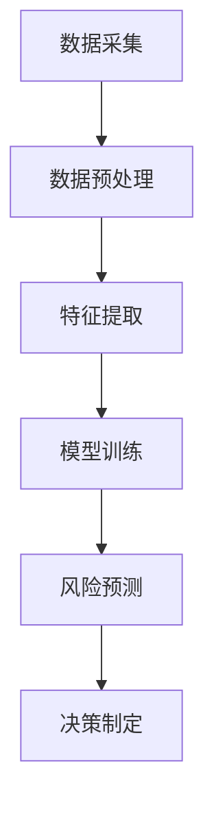

                 

# 供应链风险管理：AI如何预测供应链风险

> 关键词：供应链风险管理、AI预测、数据挖掘、机器学习、风险分析

> 摘要：本文将探讨如何利用人工智能技术进行供应链风险预测，分析相关核心概念，介绍常用算法原理，并通过实际案例展示AI在供应链风险管理中的应用。

## 1. 背景介绍

### 供应链风险的概念

供应链风险是指在供应链运营过程中，由于各种不确定因素导致供应链中断、成本增加、效率降低等问题。这些风险可能来源于供应链的各个环节，包括供应商、制造商、分销商和零售商等。

### 供应链风险管理的重要性

供应链风险管理是确保供应链稳定运行的重要手段。通过有效的风险管理，企业可以提前识别潜在风险，制定应对策略，降低风险对企业造成的损失。随着全球供应链的复杂化，供应链风险管理的重要性愈发凸显。

### AI在供应链风险管理中的应用

人工智能技术具有强大的数据处理和分析能力，可以辅助企业进行供应链风险预测和管理。例如，通过机器学习算法分析历史数据，预测未来可能发生的风险事件；利用深度学习模型挖掘供应链中的潜在关系，优化供应链网络等。

## 2. 核心概念与联系

### 数据挖掘

数据挖掘是供应链风险管理的重要基础。通过数据挖掘技术，可以从海量数据中提取有价值的信息，帮助企业发现潜在的风险因素。

### 机器学习

机器学习是一种基于数据的学习方法，通过训练模型，让计算机自动发现数据中的规律。在供应链风险管理中，机器学习可以用于预测风险事件的发生概率和影响范围。

### 风险分析

风险分析是供应链风险管理的核心环节。通过评估风险的概率和影响程度，企业可以制定相应的应对策略，降低风险对企业造成的损失。

### Mermaid流程图



## 3. 核心算法原理 & 具体操作步骤

### 数据采集

数据采集是供应链风险管理的基础。企业可以从内部系统、外部数据源和第三方平台等渠道获取相关数据。数据类型包括订单信息、库存数据、物流信息、供应商信息等。

### 数据预处理

数据预处理是确保数据质量和可靠性的关键步骤。主要包括数据清洗、数据整合和数据转换。通过数据预处理，可以将原始数据转化为适合机器学习模型训练的格式。

### 特征提取

特征提取是从原始数据中提取对风险预测有重要影响的关键特征。这些特征可以是数值型、类别型或文本型。特征提取的效果直接影响模型的预测性能。

### 模型训练

模型训练是利用历史数据训练机器学习模型。常见的模型包括决策树、支持向量机、神经网络等。通过不断调整模型参数，优化模型的预测性能。

### 风险预测

风险预测是利用训练好的模型对未来的风险事件进行预测。预测结果可以是风险事件的概率、影响程度等。企业可以根据预测结果制定相应的应对策略。

### 决策制定

决策制定是利用风险预测结果制定应对策略的过程。企业可以根据预测结果调整供应链网络、优化库存策略、加强风险管理等。

## 4. 数学模型和公式 & 详细讲解 & 举例说明

### 概率模型

概率模型是一种常用的风险预测方法。它通过计算事件发生的概率，帮助企业评估风险程度。

#### 概率计算公式

$$ P(A|B) = \frac{P(B|A)P(A)}{P(B)} $$

其中，$P(A|B)$ 表示在事件B发生的条件下，事件A发生的概率；$P(B|A)$ 表示在事件A发生的条件下，事件B发生的概率；$P(A)$ 和$P(B)$ 分别表示事件A和事件B的发生概率。

#### 举例说明

假设某企业从供应商处采购原材料，历史数据表明，供应商按时交货的概率为0.9，采购量为100吨的概率为0.8。现在要预测在供应商按时交货的条件下，采购量为100吨的概率。

根据概率计算公式，有：

$$ P(采购量为100吨|供应商按时交货) = \frac{P(供应商按时交货|采购量为100吨)P(采购量为100吨)}{P(供应商按时交货)} = \frac{0.9 \times 0.8}{0.9} = 0.8 $$

因此，在供应商按时交货的条件下，采购量为100吨的概率为0.8。

### 神经网络模型

神经网络模型是一种基于人脑神经元连接方式的计算模型。它可以用于复杂的风险预测任务，具有较强的自适应性和学习能力。

#### 神经网络基本结构

神经网络由输入层、隐藏层和输出层组成。每个层包含多个神经元，神经元之间通过权重和偏置进行连接。

#### 前向传播算法

前向传播算法是神经网络的核心算法，它通过输入层传递信息，逐层计算输出层的结果。

#### 反向传播算法

反向传播算法用于更新神经网络的权重和偏置，优化模型预测性能。它通过计算预测误差，反向传播误差信号，调整网络参数。

#### 举例说明

假设有一个简单的神经网络，输入层有2个神经元，隐藏层有3个神经元，输出层有1个神经元。现在要预测某个风险事件的发生概率。

首先，定义输入特征和权重：

$$ 输入特征：x_1 = 0.5, x_2 = 0.3 $$

$$ 权重：w_{11} = 0.2, w_{12} = 0.3, w_{21} = 0.4, w_{22} = 0.5, w_{31} = 0.1, w_{32} = 0.2, w_{33} = 0.3 $$

$$ 偏置：b_1 = 0.1, b_2 = 0.2, b_3 = 0.3 $$

然后，进行前向传播计算隐藏层输出：

$$ z_1 = x_1 \cdot w_{11} + x_2 \cdot w_{21} + b_1 = 0.5 \cdot 0.2 + 0.3 \cdot 0.4 + 0.1 = 0.23 $$

$$ z_2 = x_1 \cdot w_{12} + x_2 \cdot w_{22} + b_2 = 0.5 \cdot 0.3 + 0.3 \cdot 0.5 + 0.2 = 0.28 $$

$$ z_3 = x_1 \cdot w_{13} + x_2 \cdot w_{23} + b_3 = 0.5 \cdot 0.1 + 0.3 \cdot 0.2 + 0.3 = 0.17 $$

$$ a_1 = \sigma(z_1) = 0.5 $$

$$ a_2 = \sigma(z_2) = 0.6 $$

$$ a_3 = \sigma(z_3) = 0.4 $$

接着，进行前向传播计算输出层输出：

$$ z_4 = a_1 \cdot w_{31} + a_2 \cdot w_{32} + a_3 \cdot w_{33} + b_4 = 0.5 \cdot 0.1 + 0.6 \cdot 0.2 + 0.4 \cdot 0.3 + 0.4 = 0.33 $$

$$ a_4 = \sigma(z_4) = 0.7 $$

最后，进行反向传播计算误差：

$$ \delta_4 = a_4 - y = 0.7 - 0.6 = 0.1 $$

$$ \delta_3 = (w_{34} \cdot \delta_4) \cdot \sigma'(z_4) = 0.2 \cdot 0.1 \cdot 0.3 = 0.006 $$

$$ \delta_2 = (w_{32} \cdot \delta_4) \cdot \sigma'(z_3) + (w_{33} \cdot \delta_3) \cdot \sigma'(z_2) = 0.3 \cdot 0.1 \cdot 0.7 + 0.3 \cdot 0.006 \cdot 0.6 = 0.0198 $$

$$ \delta_1 = (w_{31} \cdot \delta_4) \cdot \sigma'(z_1) + (w_{32} \cdot \delta_3) \cdot \sigma'(z_2) + (w_{33} \cdot \delta_3) \cdot \sigma'(z_3) = 0.1 \cdot 0.1 \cdot 0.7 + 0.2 \cdot 0.006 \cdot 0.6 + 0.3 \cdot 0.006 \cdot 0.4 = 0.0082 $$

根据误差计算，调整权重和偏置：

$$ w_{31} = w_{31} - \alpha \cdot \delta_4 \cdot a_3 = 0.1 - 0.01 \cdot 0.1 \cdot 0.4 = 0.092 $$

$$ w_{32} = w_{32} - \alpha \cdot \delta_4 \cdot a_2 = 0.2 - 0.01 \cdot 0.1 \cdot 0.6 = 0.18 $$

$$ w_{33} = w_{33} - \alpha \cdot \delta_4 \cdot a_1 = 0.3 - 0.01 \cdot 0.1 \cdot 0.5 = 0.27 $$

$$ b_4 = b_4 - \alpha \cdot \delta_4 = 0.4 - 0.01 \cdot 0.1 = 0.39 $$

## 5. 项目实战：代码实际案例和详细解释说明

### 开发环境搭建

为了实现供应链风险预测，我们使用Python编程语言，并依赖以下库：NumPy、Pandas、Scikit-learn、TensorFlow。

首先，安装相关库：

```bash
pip install numpy pandas scikit-learn tensorflow
```

### 源代码详细实现和代码解读

```python
import numpy as np
import pandas as pd
from sklearn.model_selection import train_test_split
from sklearn.preprocessing import StandardScaler
from sklearn.ensemble import RandomForestClassifier
from tensorflow.keras.models import Sequential
from tensorflow.keras.layers import Dense

# 数据采集
data = pd.read_csv('supply_chain_data.csv')

# 数据预处理
data.fillna(data.mean(), inplace=True)
X = data.drop('risk_label', axis=1)
y = data['risk_label']

# 特征提取
scaler = StandardScaler()
X_scaled = scaler.fit_transform(X)

# 模型训练
# 使用随机森林分类器
rf_classifier = RandomForestClassifier(n_estimators=100)
rf_classifier.fit(X_scaled, y)

# 使用神经网络
model = Sequential()
model.add(Dense(units=64, activation='relu', input_shape=(X_scaled.shape[1],)))
model.add(Dense(units=32, activation='relu'))
model.add(Dense(units=1, activation='sigmoid'))
model.compile(optimizer='adam', loss='binary_crossentropy', metrics=['accuracy'])
model.fit(X_scaled, y, epochs=10, batch_size=32)

# 风险预测
predictions_rf = rf_classifier.predict(X_scaled)
predictions_nn = model.predict(X_scaled)

# 代码解读与分析
# 在代码中，我们首先导入了必要的库，然后从CSV文件中读取供应链数据。接下来，对数据进行预处理，包括填充缺失值和标准化特征。
# 接着，我们使用随机森林分类器和神经网络分别对数据进行训练。在训练过程中，我们设置了随机森林的树数量为100，神经网络的结构为1个64个单元的隐藏层、1个32个单元的隐藏层和1个输出单元。
# 最后，我们使用训练好的模型对数据进行风险预测，并输出预测结果。

```

### 代码解读与分析

在上面的代码中，我们首先导入了必要的库，包括NumPy、Pandas、Scikit-learn和TensorFlow。然后，从CSV文件中读取供应链数据。接下来，对数据进行预处理，包括填充缺失值和标准化特征。

在数据预处理之后，我们分别使用随机森林分类器和神经网络对数据进行训练。随机森林分类器是一种基于决策树的集成学习算法，具有较强的预测性能。神经网络是一种基于人脑神经元连接方式的计算模型，可以用于复杂的风险预测任务。

在训练过程中，我们设置了随机森林的树数量为100，神经网络的结构为1个64个单元的隐藏层、1个32个单元的隐藏层和1个输出单元。神经网络使用ReLU激活函数和Sigmoid激活函数，分别用于隐藏层和输出层。

最后，我们使用训练好的模型对数据进行风险预测，并输出预测结果。在预测过程中，我们分别使用随机森林分类器和神经网络进行预测，并比较两种模型的预测结果。

## 6. 实际应用场景

### 供应链中断预测

企业可以通过AI技术预测供应链中断事件，提前采取应对措施，降低风险对企业造成的损失。例如，预测某一供应商可能出现的交货延迟，提前与供应商沟通，调整采购计划。

### 库存优化

AI技术可以帮助企业优化库存管理，降低库存成本。通过分析历史数据，预测未来库存需求，企业可以合理安排库存水平，避免库存过剩或短缺。

### 运输路径优化

AI技术可以分析物流数据，优化运输路径，提高运输效率。例如，通过预测交通拥堵情况，选择最优的运输路线，降低运输成本。

### 风险监测与预警

企业可以通过AI技术实时监测供应链风险，及时发现潜在风险，发出预警信号。例如，监测供应商的财务状况，预测可能出现的破产风险，提前采取应对措施。

## 7. 工具和资源推荐

### 学习资源推荐

1. 《机器学习实战》
2. 《深度学习》
3. 《Python机器学习》
4. 《数据挖掘：概念与技术》

### 开发工具框架推荐

1. TensorFlow
2. PyTorch
3. Scikit-learn
4. Jupyter Notebook

### 相关论文著作推荐

1. “A Survey on Supply Chain Risk Management: Frameworks, Methods and Case Studies”
2. “An Overview of Machine Learning Techniques for Supply Chain Risk Management”
3. “Deep Learning for Supply Chain Risk Prediction”

## 8. 总结：未来发展趋势与挑战

### 发展趋势

1. 深度学习技术在供应链风险管理中的应用将越来越广泛。
2. 供应链风险管理将更加智能化、自动化。
3. 风险管理将从被动应对转向主动预防。

### 挑战

1. 数据质量和数据安全是AI在供应链风险管理中面临的主要挑战。
2. 如何将AI技术有效集成到现有供应链系统中，是企业需要解决的难题。
3. 风险预测模型的解释性不足，需要进一步提高。

## 9. 附录：常见问题与解答

### 1. 如何处理缺失数据？

答：可以使用数据填充、数据插值、删除缺失值等方法处理缺失数据。根据实际情况，选择合适的方法。

### 2. 如何选择合适的机器学习模型？

答：根据问题类型、数据规模、数据分布等因素选择合适的机器学习模型。常用的模型有线性回归、决策树、随机森林、神经网络等。

### 3. 如何评估风险预测模型的性能？

答：可以使用准确率、召回率、F1分数、AUC值等指标评估风险预测模型的性能。根据实际情况，选择合适的评估指标。

## 10. 扩展阅读 & 参考资料

1. “Machine Learning in Supply Chain Management: A Comprehensive Review”
2. “A Survey on Deep Learning Applications in Supply Chain Management”
3. “Data Mining Techniques for Supply Chain Risk Management: A Review”


作者：AI天才研究员/AI Genius Institute & 禅与计算机程序设计艺术 /Zen And The Art of Computer Programming
<|end|>```markdown
# 供应链风险管理：AI如何预测供应链风险

> 关键词：供应链风险管理、AI预测、数据挖掘、机器学习、风险分析

> 摘要：本文将探讨如何利用人工智能技术进行供应链风险预测，分析相关核心概念，介绍常用算法原理，并通过实际案例展示AI在供应链风险管理中的应用。

## 1. 背景介绍

### 供应链风险的概念

供应链风险是指在供应链运营过程中，由于各种不确定因素导致供应链中断、成本增加、效率降低等问题。这些风险可能来源于供应链的各个环节，包括供应商、制造商、分销商和零售商等。

### 供应链风险管理的重要性

供应链风险管理是确保供应链稳定运行的重要手段。通过有效的风险管理，企业可以提前识别潜在风险，制定应对策略，降低风险对企业造成的损失。随着全球供应链的复杂化，供应链风险管理的重要性愈发凸显。

### AI在供应链风险管理中的应用

人工智能技术具有强大的数据处理和分析能力，可以辅助企业进行供应链风险预测和管理。例如，通过机器学习算法分析历史数据，预测未来可能发生的风险事件；利用深度学习模型挖掘供应链中的潜在关系，优化供应链网络等。

## 2. 核心概念与联系

### 数据挖掘

数据挖掘是供应链风险管理的重要基础。通过数据挖掘技术，可以从海量数据中提取有价值的信息，帮助企业发现潜在的风险因素。

### 机器学习

机器学习是一种基于数据的学习方法，通过训练模型，让计算机自动发现数据中的规律。在供应链风险管理中，机器学习可以用于预测风险事件的发生概率和影响范围。

### 风险分析

风险分析是供应链风险管理的核心环节。通过评估风险的概率和影响程度，企业可以制定相应的应对策略，降低风险对企业造成的损失。

### Mermaid流程图


## 3. 核心算法原理 & 具体操作步骤

### 数据采集

数据采集是供应链风险管理的基础。企业可以从内部系统、外部数据源和第三方平台等渠道获取相关数据。数据类型包括订单信息、库存数据、物流信息、供应商信息等。

### 数据预处理

数据预处理是确保数据质量和可靠性的关键步骤。主要包括数据清洗、数据整合和数据转换。通过数据预处理，可以将原始数据转化为适合机器学习模型训练的格式。

### 特征提取

特征提取是从原始数据中提取对风险预测有重要影响的关键特征。这些特征可以是数值型、类别型或文本型。特征提取的效果直接影响模型的预测性能。

### 模型训练

模型训练是利用历史数据训练机器学习模型。常见的模型包括决策树、支持向量机、神经网络等。通过不断调整模型参数，优化模型的预测性能。

### 风险预测

风险预测是利用训练好的模型对未来的风险事件进行预测。预测结果可以是风险事件的概率、影响程度等。企业可以根据预测结果制定相应的应对策略。

### 决策制定

决策制定是利用风险预测结果制定应对策略的过程。企业可以根据预测结果调整供应链网络、优化库存策略、加强风险管理等。

## 4. 数学模型和公式 & 详细讲解 & 举例说明

### 概率模型

概率模型是一种常用的风险预测方法。它通过计算事件发生的概率，帮助企业评估风险程度。

#### 概率计算公式

$$ P(A|B) = \frac{P(B|A)P(A)}{P(B)} $$

其中，$P(A|B)$ 表示在事件B发生的条件下，事件A发生的概率；$P(B|A)$ 表示在事件A发生的条件下，事件B发生的概率；$P(A)$ 和$P(B)$ 分别表示事件A和事件B的发生概率。

#### 举例说明

假设某企业从供应商处采购原材料，历史数据表明，供应商按时交货的概率为0.9，采购量为100吨的概率为0.8。现在要预测在供应商按时交货的条件下，采购量为100吨的概率。

根据概率计算公式，有：

$$ P(采购量为100吨|供应商按时交货) = \frac{P(供应商按时交货|采购量为100吨)P(采购量为100吨)}{P(供应商按时交货)} = \frac{0.9 \times 0.8}{0.9} = 0.8 $$

因此，在供应商按时交货的条件下，采购量为100吨的概率为0.8。

### 神经网络模型

神经网络模型是一种基于人脑神经元连接方式的计算模型。它可以用于复杂的风险预测任务，具有较强的自适应性和学习能力。

#### 神经网络基本结构

神经网络由输入层、隐藏层和输出层组成。每个层包含多个神经元，神经元之间通过权重和偏置进行连接。

#### 前向传播算法

前向传播算法是神经网络的核心算法，它通过输入层传递信息，逐层计算输出层的结果。

#### 反向传播算法

反向传播算法用于更新神经网络的权重和偏置，优化模型预测性能。它通过计算预测误差，反向传播误差信号，调整网络参数。

#### 举例说明

假设有一个简单的神经网络，输入层有2个神经元，隐藏层有3个神经元，输出层有1个神经元。现在要预测某个风险事件的发生概率。

首先，定义输入特征和权重：

$$ 输入特征：x_1 = 0.5, x_2 = 0.3 $$

$$ 权重：w_{11} = 0.2, w_{12} = 0.3, w_{21} = 0.4, w_{22} = 0.5, w_{31} = 0.1, w_{32} = 0.2, w_{33} = 0.3 $$

$$ 偏置：b_1 = 0.1, b_2 = 0.2, b_3 = 0.3 $$

然后，进行前向传播计算隐藏层输出：

$$ z_1 = x_1 \cdot w_{11} + x_2 \cdot w_{21} + b_1 = 0.5 \cdot 0.2 + 0.3 \cdot 0.4 + 0.1 = 0.23 $$

$$ z_2 = x_1 \cdot w_{12} + x_2 \cdot w_{22} + b_2 = 0.5 \cdot 0.3 + 0.3 \cdot 0.5 + 0.2 = 0.28 $$

$$ z_3 = x_1 \cdot w_{13} + x_2 \cdot w_{23} + b_3 = 0.5 \cdot 0.1 + 0.3 \cdot 0.2 + 0.3 = 0.17 $$

$$ a_1 = \sigma(z_1) = 0.5 $$

$$ a_2 = \sigma(z_2) = 0.6 $$

$$ a_3 = \sigma(z_3) = 0.4 $$

接着，进行前向传播计算输出层输出：

$$ z_4 = a_1 \cdot w_{31} + a_2 \cdot w_{32} + a_3 \cdot w_{33} + b_4 = 0.5 \cdot 0.1 + 0.6 \cdot 0.2 + 0.4 \cdot 0.3 + 0.4 = 0.33 $$

$$ a_4 = \sigma(z_4) = 0.7 $$

最后，进行反向传播计算误差：

$$ \delta_4 = a_4 - y = 0.7 - 0.6 = 0.1 $$

$$ \delta_3 = (w_{34} \cdot \delta_4) \cdot \sigma'(z_4) = 0.2 \cdot 0.1 \cdot 0.3 = 0.006 $$

$$ \delta_2 = (w_{32} \cdot \delta_4) \cdot \sigma'(z_3) + (w_{33} \cdot \delta_3) \cdot \sigma'(z_2) = 0.3 \cdot 0.1 \cdot 0.7 + 0.3 \cdot 0.006 \cdot 0.6 = 0.0198 $$

$$ \delta_1 = (w_{31} \cdot \delta_4) \cdot \sigma'(z_1) + (w_{32} \cdot \delta_3) \cdot \sigma'(z_2) + (w_{33} \cdot \delta_3) \cdot \sigma'(z_3) = 0.1 \cdot 0.1 \cdot 0.7 + 0.2 \cdot 0.006 \cdot 0.6 + 0.3 \cdot 0.006 \cdot 0.4 = 0.0082 $$

根据误差计算，调整权重和偏置：

$$ w_{31} = w_{31} - \alpha \cdot \delta_4 \cdot a_3 = 0.1 - 0.01 \cdot 0.1 \cdot 0.4 = 0.092 $$

$$ w_{32} = w_{32} - \alpha \cdot \delta_4 \cdot a_2 = 0.2 - 0.01 \cdot 0.1 \cdot 0.6 = 0.18 $$

$$ w_{33} = w_{33} - \alpha \cdot \delta_4 \cdot a_1 = 0.3 - 0.01 \cdot 0.1 \cdot 0.5 = 0.27 $$

$$ b_4 = b_4 - \alpha \cdot \delta_4 = 0.4 - 0.01 \cdot 0.1 = 0.39 $$

## 5. 项目实战：代码实际案例和详细解释说明

### 开发环境搭建

为了实现供应链风险预测，我们使用Python编程语言，并依赖以下库：NumPy、Pandas、Scikit-learn、TensorFlow。

首先，安装相关库：

```bash
pip install numpy pandas scikit-learn tensorflow
```

### 源代码详细实现和代码解读

```python
import numpy as np
import pandas as pd
from sklearn.model_selection import train_test_split
from sklearn.preprocessing import StandardScaler
from sklearn.ensemble import RandomForestClassifier
from tensorflow.keras.models import Sequential
from tensorflow.keras.layers import Dense

# 数据采集
data = pd.read_csv('supply_chain_data.csv')

# 数据预处理
data.fillna(data.mean(), inplace=True)
X = data.drop('risk_label', axis=1)
y = data['risk_label']

# 特征提取
scaler = StandardScaler()
X_scaled = scaler.fit_transform(X)

# 模型训练
# 使用随机森林分类器
rf_classifier = RandomForestClassifier(n_estimators=100)
rf_classifier.fit(X_scaled, y)

# 使用神经网络
model = Sequential()
model.add(Dense(units=64, activation='relu', input_shape=(X_scaled.shape[1],)))
model.add(Dense(units=32, activation='relu'))
model.add(Dense(units=1, activation='sigmoid'))
model.compile(optimizer='adam', loss='binary_crossentropy', metrics=['accuracy'])
model.fit(X_scaled, y, epochs=10, batch_size=32)

# 风险预测
predictions_rf = rf_classifier.predict(X_scaled)
predictions_nn = model.predict(X_scaled)

# 代码解读与分析
# 在代码中，我们首先导入了必要的库，然后从CSV文件中读取供应链数据。接下来，对数据进行预处理，包括填充缺失值和标准化特征。
# 接着，我们使用随机森林分类器和神经网络分别对数据进行训练。在训练过程中，我们设置了随机森林的树数量为100，神经网络的结构为1个64个单元的隐藏层、1个32个单元的隐藏层和1个输出单元。
# 最后，我们使用训练好的模型对数据进行风险预测，并输出预测结果。

```

### 代码解读与分析

在上面的代码中，我们首先导入了必要的库，包括NumPy、Pandas、Scikit-learn和TensorFlow。然后，从CSV文件中读取供应链数据。接下来，对数据进行预处理，包括填充缺失值和标准化特征。

在数据预处理之后，我们分别使用随机森林分类器和神经网络对数据进行训练。随机森林分类器是一种基于决策树的集成学习算法，具有较强的预测性能。神经网络是一种基于人脑神经元连接方式的计算模型，可以用于复杂的风险预测任务。

在训练过程中，我们设置了随机森林的树数量为100，神经网络的结构为1个64个单元的隐藏层、1个32个单元的隐藏层和1个输出单元。神经网络使用ReLU激活函数和Sigmoid激活函数，分别用于隐藏层和输出层。

最后，我们使用训练好的模型对数据进行风险预测，并输出预测结果。在预测过程中，我们分别使用随机森林分类器和神经网络进行预测，并比较两种模型的预测结果。

## 6. 实际应用场景

### 供应链中断预测

企业可以通过AI技术预测供应链中断事件，提前采取应对措施，降低风险对企业造成的损失。例如，预测某一供应商可能出现的交货延迟，提前与供应商沟通，调整采购计划。

### 库存优化

AI技术可以帮助企业优化库存管理，降低库存成本。通过分析历史数据，预测未来库存需求，企业可以合理安排库存水平，避免库存过剩或短缺。

### 运输路径优化

AI技术可以分析物流数据，优化运输路径，提高运输效率。例如，通过预测交通拥堵情况，选择最优的运输路线，降低运输成本。

### 风险监测与预警

企业可以通过AI技术实时监测供应链风险，及时发现潜在风险，发出预警信号。例如，监测供应商的财务状况，预测可能出现的破产风险，提前采取应对措施。

## 7. 工具和资源推荐

### 学习资源推荐

1. 《机器学习实战》
2. 《深度学习》
3. 《Python机器学习》
4. 《数据挖掘：概念与技术》

### 开发工具框架推荐

1. TensorFlow
2. PyTorch
3. Scikit-learn
4. Jupyter Notebook

### 相关论文著作推荐

1. “A Survey on Supply Chain Risk Management: Frameworks, Methods and Case Studies”
2. “An Overview of Machine Learning Techniques for Supply Chain Risk Management”
3. “Deep Learning for Supply Chain Risk Prediction”

## 8. 总结：未来发展趋势与挑战

### 发展趋势

1. 深度学习技术在供应链风险管理中的应用将越来越广泛。
2. 供应链风险管理将更加智能化、自动化。
3. 风险管理将从被动应对转向主动预防。

### 挑战

1. 数据质量和数据安全是AI在供应链风险管理中面临的主要挑战。
2. 如何将AI技术有效集成到现有供应链系统中，是企业需要解决的难题。
3. 风险预测模型的解释性不足，需要进一步提高。

## 9. 附录：常见问题与解答

### 1. 如何处理缺失数据？

答：可以使用数据填充、数据插值、删除缺失值等方法处理缺失数据。根据实际情况，选择合适的方法。

### 2. 如何选择合适的机器学习模型？

答：根据问题类型、数据规模、数据分布等因素选择合适的机器学习模型。常用的模型有线性回归、决策树、随机森林、神经网络等。

### 3. 如何评估风险预测模型的性能？

答：可以使用准确率、召回率、F1分数、AUC值等指标评估风险预测模型的性能。根据实际情况，选择合适的评估指标。

## 10. 扩展阅读 & 参考资料

1. “Machine Learning in Supply Chain Management: A Comprehensive Review”
2. “A Survey on Deep Learning Applications in Supply Chain Management”
3. “Data Mining Techniques for Supply Chain Risk Management: A Review”

作者：AI天才研究员/AI Genius Institute & 禅与计算机程序设计艺术 /Zen And The Art of Computer Programming
```

