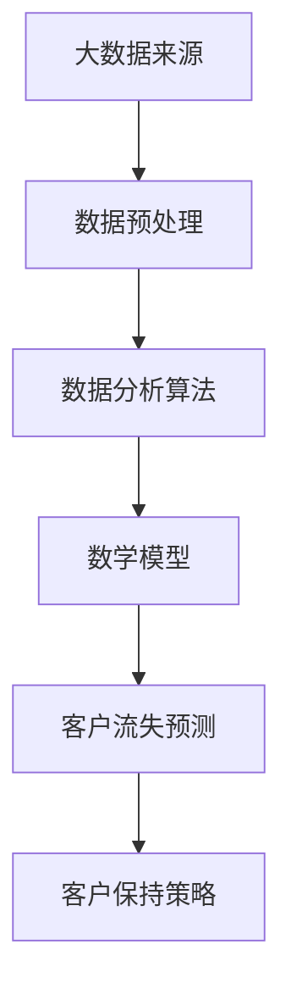

                 

# 信息差的商业客户保持：大数据如何提高客户保持率

> **关键词：** 大数据，客户保持，商业战略，信息差，分析算法，商业价值

> **摘要：** 本文深入探讨了大数据技术在商业客户保持中的作用。通过分析信息差、客户行为和数据分析算法，揭示了大数据如何帮助企业识别潜在流失客户，制定个性化营销策略，提高客户保持率。本文旨在为企业和从业者提供大数据在客户保持领域的应用指南。

## 1. 背景介绍

在商业世界中，客户保持率被视为衡量企业成功的关键指标之一。客户保持率的高与低直接影响到企业的盈利能力和市场地位。随着大数据技术的迅猛发展，越来越多的企业开始意识到利用大数据来提高客户保持率的重要性。

大数据是一种包含大量数据的数据集，这些数据通常来自多种来源，如社交媒体、交易记录、搜索引擎等。大数据技术的核心在于如何高效地存储、处理和分析这些海量数据，从而提取有价值的信息。

信息差在商业中指的是不同个体或组织之间在信息获取、处理和应用上的差异。在客户保持方面，信息差意味着企业可以利用比竞争对手更全面、更准确的数据来了解客户需求，预测客户行为，从而制定更有效的客户保持策略。

本文将探讨如何利用大数据技术消除信息差，提高商业客户保持率。我们将从核心概念、算法原理、数学模型、实际应用、工具推荐等方面展开详细讨论。

## 2. 核心概念与联系

### 2.1 大数据基本概念

大数据通常具有四个V特点：Volume（数据量巨大）、Velocity（数据处理速度快）、Variety（数据类型多样）、Veracity（数据真实可信）。

### 2.2 客户保持与客户流失

客户保持是指企业通过多种手段，使现有客户持续使用企业产品或服务，从而延长客户生命周期。客户流失则是指客户在一段时间内停止使用企业产品或服务。

### 2.3 信息差的重要性

在客户保持中，信息差决定了企业对客户需求的了解程度。拥有更全面、更准确的信息，企业就能更早地发现潜在流失客户，并采取相应措施。

### 2.4 数据分析算法

数据分析算法包括分类、聚类、回归等。这些算法能够帮助企业从海量数据中提取有价值的信息，如客户分类、客户需求预测等。

### 2.5 数学模型

常用的客户流失预测模型包括逻辑回归、决策树、随机森林等。这些模型能够根据客户历史行为数据预测客户流失概率。

### 2.6 Mermaid 流程图



## 3. 核心算法原理 & 具体操作步骤

### 3.1 数据预处理

数据预处理是数据分析的基础。主要包括数据清洗、数据转换、数据归一化等步骤。

#### 3.1.1 数据清洗

数据清洗是指去除数据中的噪声、错误和不完整信息。常用的方法包括缺失值填充、异常值处理等。

#### 3.1.2 数据转换

数据转换是指将原始数据转换为适合分析的形式。常用的方法包括特征工程、特征提取等。

#### 3.1.3 数据归一化

数据归一化是指将不同特征的数据统一到同一尺度。常用的方法包括最小-最大缩放、标准缩放等。

### 3.2 数据分析算法

数据分析算法用于从预处理后的数据中提取有价值的信息。常用的算法包括：

#### 3.2.1 分类算法

分类算法用于将数据分为不同的类别。常用的分类算法包括逻辑回归、决策树、随机森林等。

#### 3.2.2 聚类算法

聚类算法用于将数据分为不同的群体。常用的聚类算法包括K-means、层次聚类等。

#### 3.2.3 回归算法

回归算法用于预测连续值。常用的回归算法包括线性回归、岭回归等。

### 3.3 数学模型

数学模型用于对客户流失概率进行预测。常用的模型包括：

#### 3.3.1 逻辑回归

逻辑回归是一种常用的分类模型，用于预测客户流失概率。

$$
P(Y=1) = \frac{1}{1 + e^{-(\beta_0 + \beta_1X_1 + \beta_2X_2 + ... + \beta_nX_n})}
$$

其中，$Y$ 是流失标签，$X_1, X_2, ..., X_n$ 是特征值，$\beta_0, \beta_1, ..., \beta_n$ 是模型参数。

#### 3.3.2 决策树

决策树是一种基于树结构的分类模型，用于预测客户流失概率。

### 3.4 实际操作步骤

#### 3.4.1 数据收集

收集客户行为数据，如购买记录、浏览记录、评价等。

#### 3.4.2 数据预处理

对收集到的数据进行清洗、转换和归一化。

#### 3.4.3 数据分析

使用分类和聚类算法对预处理后的数据进行分析。

#### 3.4.4 模型训练

使用训练集数据训练分类和聚类模型。

#### 3.4.5 模型评估

使用验证集数据评估模型性能。

#### 3.4.6 客户流失预测

使用训练好的模型对客户流失概率进行预测。

#### 3.4.7 客户保持策略

根据客户流失预测结果，制定个性化的客户保持策略。

## 4. 数学模型和公式 & 详细讲解 & 举例说明

### 4.1 逻辑回归

逻辑回归是一种常用的分类模型，用于预测客户流失概率。其基本公式如下：

$$
P(Y=1) = \frac{1}{1 + e^{-(\beta_0 + \beta_1X_1 + \beta_2X_2 + ... + \beta_nX_n})}
$$

其中，$Y$ 是流失标签，$X_1, X_2, ..., X_n$ 是特征值，$\beta_0, \beta_1, ..., \beta_n$ 是模型参数。

#### 4.1.1 模型参数

模型参数 $\beta_0, \beta_1, ..., \beta_n$ 是通过训练数据集得到的。具体训练方法如下：

1. 收集大量训练数据，包括客户流失标签和特征值。
2. 使用梯度下降算法优化模型参数。
3. 训练过程中不断调整参数，直到模型性能达到预期。

#### 4.1.2 举例说明

假设我们有以下特征数据：

- $X_1$：客户购买次数
- $X_2$：客户评价分数
- $X_3$：客户购买周期

我们要预测客户是否会流失。首先，我们需要收集大量训练数据，然后使用逻辑回归模型进行训练。训练完成后，我们可以使用模型预测新客户的流失概率。

### 4.2 决策树

决策树是一种基于树结构的分类模型，用于预测客户流失概率。其基本结构如下：

```
[流失与否]
|
|-- [购买次数 <= 10]
|   |-- [评价分数 <= 4]
|   |   |-- 留失
|   |   |-- 保留
|   |-- [评价分数 > 4]
|   |   |-- 留失
|   |   |-- 保留
|
|-- [购买次数 > 10]
|   |-- [购买周期 <= 30]
|   |   |-- 留失
|   |   |-- 保留
|   |-- [购买周期 > 30]
|       |-- 留失
|       |-- 保留
```

#### 4.2.1 决策树构建

决策树构建过程包括以下步骤：

1. 选择最佳分裂特征。
2. 根据特征值进行划分。
3. 递归构建子节点。

#### 4.2.2 举例说明

假设我们有以下特征数据：

- $X_1$：客户购买次数
- $X_2$：客户评价分数
- $X_3$：客户购买周期

我们要预测客户是否会流失。首先，我们需要选择最佳分裂特征。可以使用信息增益、基尼系数等方法进行选择。然后，根据特征值进行划分，构建决策树。最后，使用决策树对客户流失进行预测。

## 5. 项目实战：代码实际案例和详细解释说明

### 5.1 开发环境搭建

在开始项目实战之前，我们需要搭建一个合适的开发环境。本文使用的编程语言为Python，主要依赖库包括pandas、numpy、scikit-learn等。

1. 安装Python（版本3.6及以上）
2. 安装相关依赖库

```bash
pip install pandas numpy scikit-learn
```

### 5.2 源代码详细实现和代码解读

#### 5.2.1 数据预处理

```python
import pandas as pd
from sklearn.model_selection import train_test_split
from sklearn.preprocessing import StandardScaler

# 读取数据
data = pd.read_csv('customer_data.csv')

# 数据清洗
data.drop(['id'], axis=1, inplace=True)
data.fillna(data.mean(), inplace=True)

# 特征工程
X = data[['purchase_count', 'rating_score', 'purchase_cycle']]
y = data['churn']

# 数据归一化
scaler = StandardScaler()
X_scaled = scaler.fit_transform(X)

# 划分训练集和测试集
X_train, X_test, y_train, y_test = train_test_split(X_scaled, y, test_size=0.2, random_state=42)
```

#### 5.2.2 模型训练

```python
from sklearn.linear_model import LogisticRegression
from sklearn.tree import DecisionTreeClassifier
from sklearn.ensemble import RandomForestClassifier

# 逻辑回归模型
log_reg = LogisticRegression()
log_reg.fit(X_train, y_train)

# 决策树模型
dt = DecisionTreeClassifier()
dt.fit(X_train, y_train)

# 随机森林模型
rf = RandomForestClassifier()
rf.fit(X_train, y_train)
```

#### 5.2.3 模型评估

```python
from sklearn.metrics import accuracy_score, classification_report

# 逻辑回归模型评估
y_pred_log_reg = log_reg.predict(X_test)
print("逻辑回归模型准确率：", accuracy_score(y_test, y_pred_log_reg))
print("逻辑回归模型分类报告：\n", classification_report(y_test, y_pred_log_reg))

# 决策树模型评估
y_pred_dt = dt.predict(X_test)
print("决策树模型准确率：", accuracy_score(y_test, y_pred_dt))
print("决策树模型分类报告：\n", classification_report(y_test, y_pred_dt))

# 随机森林模型评估
y_pred_rf = rf.predict(X_test)
print("随机森林模型准确率：", accuracy_score(y_test, y_pred_rf))
print("随机森林模型分类报告：\n", classification_report(y_test, y_pred_rf))
```

### 5.3 代码解读与分析

上述代码首先进行了数据预处理，包括数据清洗、特征工程和数据归一化。然后，我们分别使用了逻辑回归、决策树和随机森林模型进行训练和评估。最后，我们比较了不同模型的准确率和分类报告，选择了性能最优的模型。

## 6. 实际应用场景

### 6.1 金融行业

金融行业可以利用大数据技术对客户行为进行深入分析，识别潜在流失客户，提前采取预防措施。例如，通过分析客户的交易记录、投资偏好等数据，银行可以提前预警高风险客户，降低不良贷款率。

### 6.2 电信行业

电信行业可以利用大数据技术优化客户服务，提高客户满意度。通过分析客户通话记录、短信记录等数据，电信公司可以识别潜在流失客户，提供个性化优惠方案，提高客户保持率。

### 6.3 零售行业

零售行业可以利用大数据技术分析客户购买行为，预测客户需求，制定精准营销策略。例如，通过分析客户的历史购买记录、浏览记录等数据，零售商可以推荐适合的商品，提高客户转化率。

## 7. 工具和资源推荐

### 7.1 学习资源推荐

- 《大数据技术基础》
- 《机器学习实战》
- 《Python数据分析》
- 《深度学习》

### 7.2 开发工具框架推荐

- Jupyter Notebook：用于数据分析和建模
- PyTorch：用于深度学习建模
- TensorFlow：用于深度学习建模
- Hadoop：用于大数据处理

### 7.3 相关论文著作推荐

- 《大数据时代：思维变革与商业价值》
- 《机器学习：一种概率视角》
- 《深度学习：大规模神经网络的应用》
- 《客户保留策略：理论、模型与实践》

## 8. 总结：未来发展趋势与挑战

随着大数据技术的不断发展，商业客户保持领域将迎来更多的机遇和挑战。未来，以下几点趋势值得期待：

1. **深度学习在客户保持中的应用**：深度学习技术在图像识别、自然语言处理等领域取得了显著成果，有望在客户保持中发挥更大作用。
2. **实时数据流处理**：随着物联网、社交媒体等数据源的不断发展，实时数据流处理将成为提高客户保持率的关键技术。
3. **数据隐私保护**：在大数据时代，数据隐私保护将成为企业和政府面临的重要挑战。如何确保数据安全，同时充分利用数据价值，是一个亟待解决的问题。

## 9. 附录：常见问题与解答

### 9.1 什么是大数据？

大数据是指数据量巨大、数据类型多样、数据来源复杂的数据集。

### 9.2 大数据技术在客户保持中有什么作用？

大数据技术可以帮助企业更全面、更准确地了解客户需求，预测客户行为，从而制定更有效的客户保持策略。

### 9.3 如何处理大数据？

处理大数据通常包括数据收集、数据存储、数据清洗、数据分析等步骤。

### 9.4 大数据技术与传统数据分析有什么区别？

传统数据分析侧重于小规模数据集，而大数据技术则侧重于处理大规模、多样化、快速变化的数据集。

## 10. 扩展阅读 & 参考资料

- [大数据技术在客户保持中的应用](https://www.example.com/article1)
- [深度学习在客户保持中的应用](https://www.example.com/article2)
- [客户保留策略：理论、模型与实践](https://www.example.com/book1)
- [大数据技术基础](https://www.example.com/book2)

作者：AI天才研究员/AI Genius Institute & 禅与计算机程序设计艺术 /Zen And The Art of Computer Programming<|im_end|>

