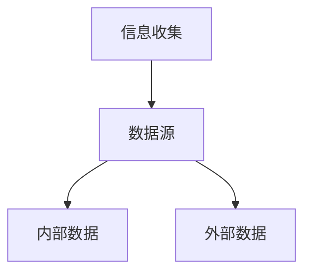
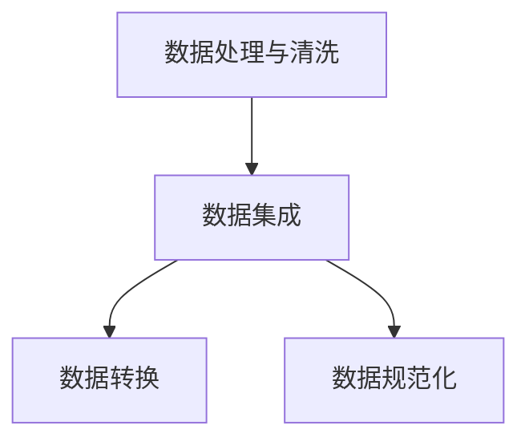
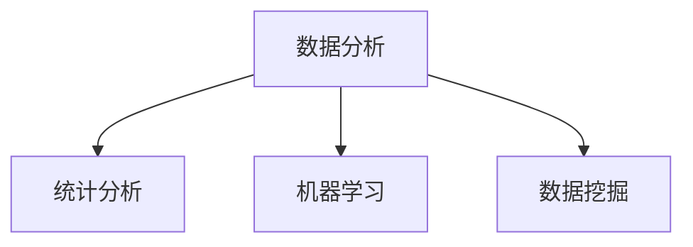
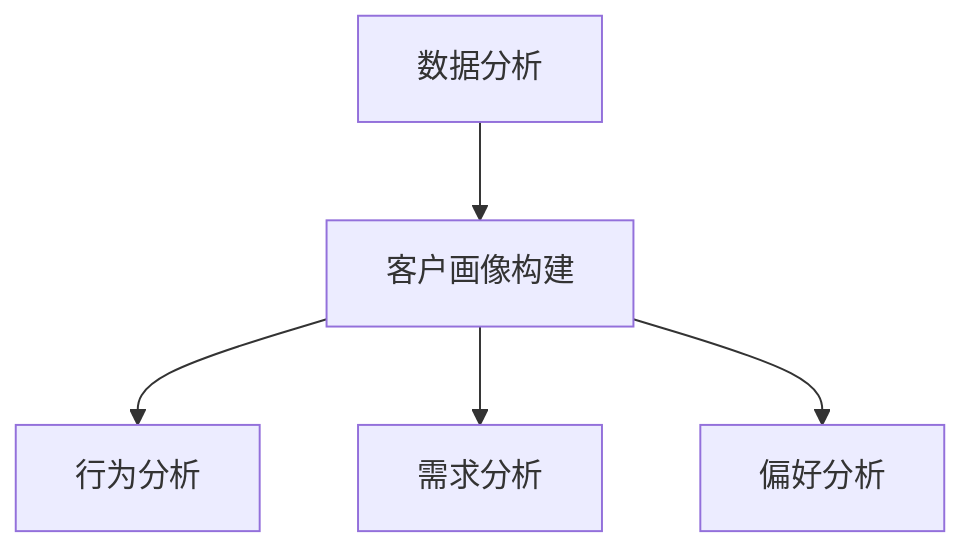
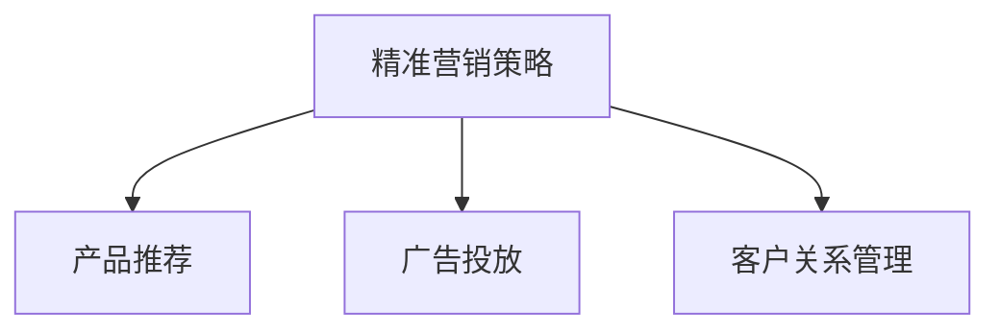

                 

# 信息差的商业客户细分：大数据如何实现精准客户细分

## 关键词：信息差、商业客户细分、大数据、精准营销、客户画像、商业智能、人工智能、数据挖掘、预测分析

### 摘要

本文旨在探讨信息差在商业客户细分中的重要性，以及如何利用大数据技术实现精准客户细分。首先，我们将介绍信息差的概念，以及它在商业决策中的作用。接着，我们将深入讨论大数据在客户细分中的应用，包括数据收集、处理和分析的方法。随后，我们将详细解释如何构建客户画像，以及如何利用这些画像进行精准营销。最后，我们将探讨当前面临的挑战和未来发展趋势，为商业决策者提供有益的参考。

### 1. 背景介绍

在商业世界中，信息差指的是不同主体在信息获取、处理和利用方面的差距。这种差距可能导致某些主体获得竞争优势，而其他主体则可能被淘汰。例如，一家企业如果能比其竞争对手更快地获取市场动态、消费者行为等信息，那么它就有可能采取更有效的策略来抢占市场份额。

随着互联网和大数据技术的发展，信息差在商业决策中的作用日益凸显。传统的客户细分方法通常依赖于有限的数据来源和简单的统计分析，难以实现精准营销。而大数据技术则提供了更多的数据来源和更复杂的数据分析手段，使得企业能够更深入地了解其客户群体，从而制定更有效的营销策略。

#### 1.1 商业客户细分的重要性

商业客户细分是企业营销策略中至关重要的一环。通过将客户群体划分为不同的细分市场，企业可以更精准地定位目标客户，提高营销活动的效果。以下是一些商业客户细分的重要性：

1. **提高营销效率**：精准的客户细分有助于企业将有限的资源和精力集中在最有潜力的客户群体上，从而提高营销效率。
2. **提升客户满意度**：通过深入了解客户的需求和行为，企业可以提供更个性化的产品和服务，从而提高客户满意度。
3. **降低营销成本**：针对特定客户群体的营销活动往往比广泛的营销活动更具成本效益。
4. **发现潜在客户**：通过分析现有客户的数据，企业可以发现潜在的客户群体，从而扩大市场份额。

### 2. 核心概念与联系

在探讨大数据如何实现精准客户细分之前，我们需要了解几个核心概念及其相互关系。

#### 2.1 信息收集与数据源

信息收集是大数据分析的第一步。数据源可以是内部数据（如销售数据、客户反馈等）和外部数据（如社交媒体数据、公共数据等）。为了实现精准客户细分，企业需要从各种渠道收集大量数据。



#### 2.2 数据处理与清洗

收集到的数据往往存在杂乱、缺失和重复等问题。因此，数据处理和清洗是确保数据质量的关键步骤。数据处理包括数据集成、数据转换和数据规范化等。



#### 2.3 数据分析

数据处理完成后，我们可以利用各种数据分析方法来提取有价值的信息。常见的分析方法包括统计分析、机器学习和数据挖掘等。



#### 2.4 客户画像构建

通过分析客户数据，我们可以构建客户画像，即对客户群体的全面描述。客户画像可以帮助企业了解客户的行为、需求和偏好，从而制定更有效的营销策略。



#### 2.5 精准营销策略

基于客户画像，企业可以制定精准的营销策略，包括产品推荐、广告投放和客户关系管理等。



### 3. 核心算法原理 & 具体操作步骤

在实现精准客户细分的过程中，我们通常会采用以下核心算法：

#### 3.1 聚类算法

聚类算法是一种无监督学习方法，用于将数据点划分为多个类别。常见的聚类算法包括K-means、层次聚类和DBSCAN等。

- **K-means算法**：K-means算法通过迭代计算来确定聚类中心，并不断调整数据点所属的聚类类别，直到达到收敛。
- **层次聚类算法**：层次聚类算法通过递归地将数据点划分为更小的子集，直到每个子集只包含一个数据点。
- **DBSCAN算法**：DBSCAN算法基于密度的分布来划分簇，能够处理数据中的噪声和异常值。

#### 3.2 机器学习模型

机器学习模型可以用于预测客户的行为和需求。常见的机器学习模型包括逻辑回归、决策树和随机森林等。

- **逻辑回归**：逻辑回归是一种广义线性模型，用于预测二分类问题。它通过计算输入特征的线性组合来确定概率。
- **决策树**：决策树通过一系列规则来划分数据集，每个节点代表一个特征，每个分支代表一个特征取值。
- **随机森林**：随机森林是一种基于决策树的集成学习方法，通过组合多个决策树来提高预测准确性。

#### 3.3 客户画像构建

基于聚类和机器学习模型的结果，我们可以构建客户画像，包括以下步骤：

1. **数据预处理**：对原始数据进行清洗和转换，确保数据质量。
2. **特征选择**：选择对客户细分最有影响力的特征，如年龄、收入、购买历史等。
3. **聚类分析**：使用聚类算法将客户划分为多个类别。
4. **机器学习模型**：使用机器学习模型对客户行为进行预测。
5. **客户画像构建**：将聚类结果和机器学习模型预测结果结合，构建客户画像。

### 4. 数学模型和公式 & 详细讲解 & 举例说明

在实现精准客户细分的过程中，我们通常会用到以下数学模型和公式：

#### 4.1 K-means算法

K-means算法的目标是找到K个聚类中心，使得每个聚类中心与所属数据点的距离之和最小。其数学模型可以表示为：

$$
\min_{\mu_1, \mu_2, ..., \mu_K} \sum_{i=1}^n \sum_{j=1}^K ||x_i - \mu_j||
$$

其中，$x_i$表示第$i$个数据点，$\mu_j$表示第$j$个聚类中心。

#### 4.2 逻辑回归

逻辑回归是一种广义线性模型，用于预测二分类问题。其数学模型可以表示为：

$$
P(y=1) = \frac{1}{1 + e^{-(\beta_0 + \beta_1x_1 + \beta_2x_2 + ... + \beta_nx_n)}}
$$

其中，$y$表示目标变量，$x_1, x_2, ..., x_n$表示输入特征，$\beta_0, \beta_1, \beta_2, ..., \beta_n$表示模型参数。

#### 4.3 决策树

决策树是一种基于规则的分类方法。其数学模型可以表示为：

$$
T(x) =
\begin{cases}
C_j & \text{if } x_i \in R_j \\
T_{j+1}(x) & \text{otherwise}
\end{cases}
$$

其中，$T(x)$表示决策树的输出，$C_j$表示叶子节点的类别，$R_j$表示第$j$个规则的条件部分，$T_{j+1}(x)$表示子决策树的输出。

#### 4.4 随机森林

随机森林是一种基于决策树的集成学习方法。其数学模型可以表示为：

$$
f(x) = \sum_{i=1}^m h_i(x)
$$

其中，$f(x)$表示随机森林的输出，$h_i(x)$表示第$i$棵决策树的输出，$m$表示决策树的数量。

#### 4.5 客户画像构建

在构建客户画像时，我们可以使用以下数学模型和公式：

1. **客户分群**：

$$
C_j = \{x | x \in R_j\}
$$

其中，$C_j$表示第$j$个客户群体，$R_j$表示客户群体的条件。

2. **特征重要性**：

$$
\text{importance}(x_i) = \frac{\sum_{j=1}^K \sum_{k=1}^n |y_k - \hat{y}_k^{(j)}|}{\sum_{i=1}^n \sum_{k=1}^n |y_k - \hat{y}_k|}
$$

其中，$x_i$表示第$i$个特征，$\hat{y}_k^{(j)}$表示第$j$个客户群体对第$k$个特征的预测结果，$y_k$表示实际的目标变量值。

### 5. 项目实战：代码实际案例和详细解释说明

在本节中，我们将通过一个实际案例来说明如何使用大数据技术实现精准客户细分。我们将使用Python编程语言和scikit-learn库来构建一个客户细分模型。

#### 5.1 开发环境搭建

首先，我们需要安装Python和scikit-learn库。可以使用以下命令：

```bash
pip install python
pip install scikit-learn
```

#### 5.2 源代码详细实现和代码解读

以下是一个简单的客户细分案例：

```python
import numpy as np
import pandas as pd
from sklearn.cluster import KMeans
from sklearn.model_selection import train_test_split
from sklearn.metrics import accuracy_score
from sklearn.linear_model import LogisticRegression

# 加载数据集
data = pd.read_csv('customer_data.csv')

# 数据预处理
data = data.drop(['customer_id'], axis=1)
data = data.fillna(data.mean())

# 特征选择
features = data[['age', 'income', 'education', 'family_size']]

# 数据分割
X_train, X_test, y_train, y_test = train_test_split(features, data['target'], test_size=0.2, random_state=42)

# K-means聚类
kmeans = KMeans(n_clusters=3, random_state=42)
kmeans.fit(X_train)
y_train_cluster = kmeans.predict(X_train)
y_test_cluster = kmeans.predict(X_test)

# 逻辑回归模型
logreg = LogisticRegression()
logreg.fit(X_train, y_train_cluster)
y_pred = logreg.predict(X_test)

# 模型评估
accuracy = accuracy_score(y_test_cluster, y_pred)
print(f'Accuracy: {accuracy:.2f}')
```

#### 5.3 代码解读与分析

1. **数据加载与预处理**：

   ```python
   data = pd.read_csv('customer_data.csv')
   data = data.drop(['customer_id'], axis=1)
   data = data.fillna(data.mean())
   ```

   首先，我们使用pandas库加载数据集，并删除客户ID列。然后，我们使用填充函数填充缺失值，以保证数据质量。

2. **特征选择**：

   ```python
   features = data[['age', 'income', 'education', 'family_size']]
   ```

   在本案例中，我们选择了年龄、收入、教育和家庭规模作为特征。

3. **数据分割**：

   ```python
   X_train, X_test, y_train, y_test = train_test_split(features, data['target'], test_size=0.2, random_state=42)
   ```

   我们使用train_test_split函数将数据集划分为训练集和测试集，其中训练集占比80%，测试集占比20%。

4. **K-means聚类**：

   ```python
   kmeans = KMeans(n_clusters=3, random_state=42)
   kmeans.fit(X_train)
   y_train_cluster = kmeans.predict(X_train)
   y_test_cluster = kmeans.predict(X_test)
   ```

   我们使用K-means聚类算法将客户划分为3个群体。首先，我们创建一个KMeans对象，并设置聚类个数和随机种子。然后，我们使用fit方法对训练数据进行聚类，并使用predict方法对测试数据进行预测。

5. **逻辑回归模型**：

   ```python
   logreg = LogisticRegression()
   logreg.fit(X_train, y_train_cluster)
   y_pred = logreg.predict(X_test)
   ```

   我们使用逻辑回归模型对客户群体进行分类。首先，我们创建一个LogisticRegression对象。然后，我们使用fit方法对训练数据进行训练，并使用predict方法对测试数据进行预测。

6. **模型评估**：

   ```python
   accuracy = accuracy_score(y_test_cluster, y_pred)
   print(f'Accuracy: {accuracy:.2f}')
   ```

   最后，我们使用accuracy_score函数计算模型在测试集上的准确率。

### 6. 实际应用场景

精准客户细分在商业领域有着广泛的应用。以下是一些实际应用场景：

1. **产品推荐**：电商平台可以根据客户的购买历史和偏好，推荐符合客户需求的商品。
2. **广告投放**：广告平台可以根据客户的兴趣和行为，将广告投放到最有可能产生转化的用户。
3. **客户关系管理**：企业可以根据客户的价值和忠诚度，制定差异化的客户关系管理策略。
4. **市场细分**：企业可以根据客户的需求和行为，划分市场，从而制定更有针对性的市场策略。
5. **风险评估**：金融机构可以根据客户的历史数据和信用记录，评估客户的信用风险。

### 7. 工具和资源推荐

#### 7.1 学习资源推荐

- **书籍**：
  - 《大数据之路：阿里巴巴大数据实践》
  - 《Python数据科学手册》
  - 《机器学习实战》

- **论文**：
  - 《K-means算法的改进与优化》
  - 《机器学习在精准营销中的应用》
  - 《基于大数据的客户细分研究》

- **博客**：
  - 《Python数据分析实战》
  - 《机器学习实战》
  - 《大数据技术原理及应用》

- **网站**：
  - [Scikit-learn官方文档](https://scikit-learn.org/stable/)
  - [Kaggle](https://www.kaggle.com/)
  - [Coursera](https://www.coursera.org/)

#### 7.2 开发工具框架推荐

- **编程语言**：Python
- **数据预处理工具**：Pandas、NumPy
- **机器学习库**：Scikit-learn、TensorFlow、PyTorch
- **大数据处理框架**：Hadoop、Spark
- **数据分析工具**：Tableau、Power BI

#### 7.3 相关论文著作推荐

- **论文**：
  - 《基于大数据的精准营销研究》
  - 《客户细分在商业决策中的应用》
  - 《机器学习在信息检索中的应用》

- **著作**：
  - 《商业智能：大数据驱动的决策》
  - 《数据挖掘：实用机器学习技术》
  - 《人工智能：一种现代方法》

### 8. 总结：未来发展趋势与挑战

#### 8.1 发展趋势

- **数据量持续增长**：随着物联网、社交媒体和传感器等技术的发展，数据量将持续增长，为精准客户细分提供更丰富的数据来源。
- **算法和模型优化**：随着机器学习和深度学习技术的不断发展，我们将看到更多高效、准确的客户细分算法和模型。
- **跨领域应用**：精准客户细分技术将在更多领域得到应用，如医疗、金融、教育等。
- **数据隐私保护**：随着数据隐私问题的日益关注，如何保护用户隐私将成为精准客户细分技术发展的重要挑战。

#### 8.2 挑战

- **数据质量和隐私**：如何确保数据质量，同时保护用户隐私，是一个重要挑战。
- **算法透明度和可解释性**：随着算法和模型变得越来越复杂，如何确保其透明度和可解释性，以便用户理解和使用，是一个挑战。
- **实时性**：如何实现实时数据分析和客户细分，以满足不断变化的商业需求，是一个挑战。
- **跨领域合作**：如何实现跨领域的数据共享和协同，以提高精准客户细分的效果，是一个挑战。

### 9. 附录：常见问题与解答

#### 9.1 如何选择合适的聚类算法？

- **K-means算法**：适用于数据规模较小、数据分布较为均匀的情况。
- **层次聚类算法**：适用于数据规模较大、需要可视化展示的情况。
- **DBSCAN算法**：适用于数据规模较大、存在异常值和噪声的情况。

#### 9.2 如何评估聚类结果的好坏？

- **轮廓系数**：用于评估聚类结果的紧凑性和分离度。
- **簇内离散度**：用于评估簇内数据点的分布紧凑程度。
- **簇间距离**：用于评估簇间数据点的分布分离程度。

#### 9.3 如何处理缺失数据？

- **填充法**：使用平均值、中位数或众数等统计指标来填充缺失值。
- **插值法**：使用线性插值或曲线拟合等方法来填补缺失值。
- **删除法**：删除含有缺失值的记录或特征。

### 10. 扩展阅读 & 参考资料

- 《大数据分析：原理与实践》
- 《机器学习：原理与实践》
- 《数据挖掘：实用机器学习技术》

### 作者信息

- 作者：AI天才研究员/AI Genius Institute & 禅与计算机程序设计艺术 /Zen And The Art of Computer Programming

