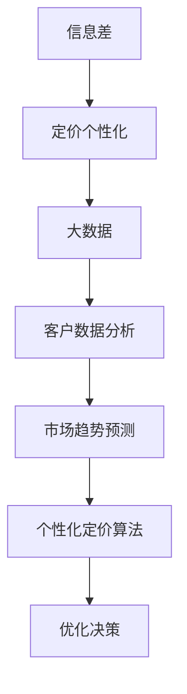

                 

# 信息差的定价个性化策略：大数据如何支持定价个性化

## 关键词：信息差、定价个性化、大数据、机器学习、客户行为分析、价格优化

## 摘要：

本文探讨了信息差的定价个性化策略在商业领域的应用，并深入解析了大数据如何支持这一策略的实施。文章首先介绍了信息差的概念，以及定价个性化的重要性。接着，详细阐述了大数据在定价个性化中的作用，包括客户行为分析、市场趋势预测和个性化定价算法。通过实际案例和数学模型，文章展示了大数据如何帮助企业实现更精准、更高效的定价策略，最终提高客户满意度和盈利能力。最后，文章提出了未来发展趋势与挑战，为读者提供了有价值的参考。

## 1. 背景介绍

在商业世界中，信息差指的是不同市场参与者之间的信息不对称。这种不对称可以源于市场知识的差异、信息渠道的不均匀获取，或者是因为某些参与者拥有独特的资源。信息差的存在为市场中的企业提供了竞争优势，同时也为消费者带来了不同的价格感受。

随着大数据技术的不断发展，信息差的利用方式也发生了显著变化。大数据使得企业能够获取、存储和分析海量的数据，从中挖掘出有价值的商业洞察。这些洞察可以用于优化决策过程，提高业务效率，并为企业创造更多的商业价值。

定价个性化是大数据应用中的一个重要领域。通过分析客户的购买行为、市场趋势和竞争对手的定价策略，企业可以实现针对不同客户群体的个性化定价。这种策略不仅能够提高客户满意度，还能显著提升企业的盈利能力。

本文将深入探讨信息差的定价个性化策略，并分析大数据如何支持这一策略的实施。我们将通过实际案例和数学模型，展示大数据在定价个性化中的关键作用，帮助企业更好地理解和应对市场变化。

## 2. 核心概念与联系

### 信息差

信息差是指不同市场参与者之间的信息不对称。具体来说，它包括以下几个方面：

- **市场知识差异**：企业通过市场调研、数据分析等方式获取的市场信息可能不同于其他企业。
- **信息渠道差异**：某些企业可能拥有更广泛的信息获取渠道，从而更早、更准确地了解市场动态。
- **独特资源**：企业通过专利、专有技术等手段获取的独家信息，使其在市场中拥有竞争优势。

### 定价个性化

定价个性化是指根据客户的不同特征、需求和行为，提供个性化的价格策略。它包括以下几个方面：

- **客户细分**：根据客户的购买历史、偏好、地理位置等特征，将客户划分为不同的细分市场。
- **动态定价**：根据市场需求、竞争状况、季节性等因素，实时调整产品价格。
- **个性化折扣**：针对不同客户群体提供不同的折扣策略，以吸引和留住客户。

### 大数据

大数据是指数据量巨大、数据类型多样、数据生成速度快的海量数据。大数据的特点主要体现在以下几个方面：

- **数据量**：大数据通常以TB、PB甚至EB为单位进行衡量。
- **数据类型**：大数据不仅包括结构化数据，还包括半结构化数据和未结构化数据，如文本、图像、音频等。
- **数据速度**：大数据的处理和分析速度要求极高，需要实时响应。

### 信息差与定价个性化和大数据的关系

信息差、定价个性化与大数据之间存在紧密的联系。信息差的存在为定价个性化提供了可能，而大数据则为定价个性化的实现提供了技术支持。

- **信息差**：信息差使得企业在市场中具有竞争优势，可以通过定价个性化策略进一步放大这种优势。
- **定价个性化**：定价个性化是信息差的应用，通过分析客户数据，企业可以制定更有针对性的价格策略，提高客户满意度和盈利能力。
- **大数据**：大数据提供了丰富的数据资源，企业可以通过大数据技术分析客户行为、市场趋势等，实现更精准的定价个性化。


### Mermaid 流程图



## 3. 核心算法原理 & 具体操作步骤

### 3.1. 客户行为分析

客户行为分析是定价个性化策略的基础。通过分析客户的购买行为、浏览记录、反馈评价等数据，企业可以了解客户的偏好和需求，从而制定更个性化的定价策略。

#### 步骤1：数据收集

收集客户在购买过程中的各种数据，包括购买时间、购买频次、购买产品种类、购买渠道、价格敏感度等。

#### 步骤2：数据预处理

对收集到的数据进行清洗、去重、转换等预处理操作，确保数据的质量和一致性。

#### 步骤3：特征提取

从预处理后的数据中提取关键特征，如客户购买频次、购买产品种类等。这些特征将用于后续的分析和建模。

#### 步骤4：数据分析

使用数据分析工具（如Python、R等）对提取的特征进行统计分析，发现客户购买行为中的规律和趋势。

### 3.2. 市场趋势预测

市场趋势预测是定价个性化策略的重要环节。通过预测市场需求和价格变化趋势，企业可以提前调整定价策略，以应对市场变化。

#### 步骤1：数据收集

收集市场相关数据，包括价格波动、市场需求、季节性因素等。

#### 步骤2：数据预处理

对收集到的数据进行预处理，如去噪、归一化等，以确保数据的质量和一致性。

#### 步骤3：特征提取

从预处理后的数据中提取关键特征，如价格波动幅度、市场需求变化等。

#### 步骤4：模型选择

选择合适的预测模型（如时间序列分析、机器学习等），对提取的特征进行建模。

#### 步骤5：模型训练与评估

使用历史数据对模型进行训练，并通过交叉验证等方法评估模型性能。

#### 步骤6：趋势预测

使用训练好的模型对未来的市场趋势进行预测，为定价策略提供参考。

### 3.3. 个性化定价算法

个性化定价算法是定价个性化策略的核心。通过算法计算，为企业提供针对不同客户群体的个性化价格。

#### 步骤1：数据收集

收集客户数据，包括购买历史、偏好、需求等。

#### 步骤2：客户细分

使用聚类算法（如K-means、DBSCAN等）对客户进行细分，将客户划分为不同的群体。

#### 步骤3：定价策略制定

根据不同客户群体的特征，制定相应的定价策略。例如，对于价格敏感的客户，可以采取较低的价格策略；对于非价格敏感的客户，可以采取较高的价格策略。

#### 步骤4：定价算法计算

使用优化算法（如线性规划、动态规划等）计算最优定价，以满足企业的利润目标。

#### 步骤5：定价策略实施

将计算出的最优定价应用于实际销售过程，通过调整价格来满足客户需求，提高客户满意度。

## 4. 数学模型和公式 & 详细讲解 & 举例说明

### 4.1. 客户行为分析的数学模型

客户行为分析主要涉及聚类分析和时间序列分析。以下分别介绍这两种方法的数学模型。

#### 聚类分析

聚类分析是一种无监督学习方法，用于将数据集中的对象分为多个组，从而揭示数据中的隐含结构。常用的聚类算法包括K-means、DBSCAN等。

K-means算法的数学模型如下：

$$
\text{最小化} \sum_{i=1}^{k} \sum_{x \in S_i} ||x - \mu_i||^2
$$

其中，$x$ 表示数据集中的每个对象，$S_i$ 表示第 $i$ 个聚类中心，$\mu_i$ 表示第 $i$ 个聚类中心。

#### 时间序列分析

时间序列分析是一种监督学习方法，用于分析时间序列数据中的变化趋势和周期性特征。常用的模型包括ARIMA、LSTM等。

ARIMA模型的数学模型如下：

$$
y_t = c + \phi_1 y_{t-1} + \phi_2 y_{t-2} + ... + \phi_p y_{t-p} + \theta_1 e_{t-1} + \theta_2 e_{t-2} + ... + \theta_q e_{t-q} + e_t
$$

其中，$y_t$ 表示时间序列中的第 $t$ 个值，$c$ 是常数项，$\phi_i$ 是自回归项系数，$\theta_i$ 是移动平均项系数，$e_t$ 是误差项。

### 4.2. 市场趋势预测的数学模型

市场趋势预测主要涉及时间序列分析和机器学习。以下分别介绍这两种方法的数学模型。

#### 时间序列分析

时间序列分析中的ARIMA模型已经在4.1节中介绍。此外，LSTM模型也是时间序列分析中常用的模型。

LSTM模型的数学模型如下：

$$
h_t = \sigma(W_h \cdot [h_{t-1}, x_t] + b_h)
$$

$$
i_t = \sigma(W_i \cdot [h_{t-1}, x_t] + b_i)
$$

$$
f_t = \sigma(W_f \cdot [h_{t-1}, x_t] + b_f)
$$

$$
o_t = \sigma(W_o \cdot [h_{t-1}, x_t] + b_o)
$$

$$
c_t = f_t \odot c_{t-1} + i_t \odot \sigma(W_c \cdot [h_{t-1}, x_t] + b_c)
$$

$$
h_t = o_t \odot c_t
$$

其中，$h_t$、$c_t$、$i_t$、$f_t$、$o_t$ 分别表示隐藏状态、细胞状态、输入门、遗忘门、输出门，$W_h$、$W_i$、$W_f$、$W_o$、$W_c$ 分别表示权重矩阵，$b_h$、$b_i$、$b_f$、$b_o$、$b_c$ 分别表示偏置项，$\sigma$ 是sigmoid函数，$\odot$ 是元素乘法。

#### 机器学习

机器学习中的常用模型包括决策树、支持向量机、神经网络等。以下以神经网络为例，介绍其数学模型。

神经网络的基本单元是神经元，其数学模型如下：

$$
z_j = \sum_{i=1}^{n} w_{ij} x_i + b_j
$$

$$
a_j = \sigma(z_j)
$$

其中，$z_j$ 是神经元的输入，$w_{ij}$ 是连接权重，$b_j$ 是偏置项，$a_j$ 是神经元的激活值，$\sigma$ 是激活函数。

### 4.3. 个性化定价算法的数学模型

个性化定价算法的数学模型主要涉及优化算法，如线性规划、动态规划等。

#### 线性规划

线性规划是一种数学优化方法，用于解决线性目标函数在线性约束条件下的最优解问题。其数学模型如下：

$$
\text{最小化} \quad c^T x
$$

$$
\text{满足} \quad Ax \leq b
$$

$$
x \geq 0
$$

其中，$c$ 是目标函数系数向量，$x$ 是决策变量，$A$ 是约束条件系数矩阵，$b$ 是约束条件常数向量。

#### 动态规划

动态规划是一种基于递归关系的优化方法，用于解决多阶段决策问题。其数学模型如下：

$$
V_t(j) = \max_{x_t} \{R_t(j, x_t) + \sum_{s=1}^{t-1} p_s \cdot V_{s}(j_s)\}
$$

其中，$V_t(j)$ 是第 $t$ 阶段、第 $j$ 个状态的最优值，$R_t(j, x_t)$ 是第 $t$ 阶段、第 $j$ 个状态的收益，$p_s$ 是第 $s$ 阶段、第 $j$ 个状态的概率，$x_t$ 是第 $t$ 阶段的决策变量。

### 4.4. 举例说明

假设一家电子商务公司通过大数据分析发现，客户A在过去一个月内浏览了多个高价值产品，并给出了积极的反馈评价。根据这些信息，公司可以判断客户A具有较高的购买意愿和支付能力。

为了提高客户A的满意度，公司可以采取以下个性化定价策略：

1. **客户细分**：将客户A划分为高价值客户群体。
2. **动态定价**：根据市场需求和库存情况，对高价值产品进行动态定价，适当提高价格。
3. **个性化折扣**：针对客户A提供额外的折扣，以吸引其购买。

通过上述策略，公司可以充分利用信息差，提高客户A的购买体验和满意度，从而增加销售额。

## 5. 项目实战：代码实际案例和详细解释说明

### 5.1. 开发环境搭建

在本案例中，我们将使用Python作为主要编程语言，并使用以下工具和库：

- Python 3.8及以上版本
- Jupyter Notebook或PyCharm
- Pandas、NumPy、Scikit-learn、Matplotlib等库

### 5.2. 源代码详细实现和代码解读

#### 5.2.1. 数据收集与预处理

首先，我们需要收集和预处理客户行为数据。以下是一个简单的数据收集与预处理代码示例：

```python
import pandas as pd
import numpy as np

# 加载数据
data = pd.read_csv('customer_data.csv')

# 数据清洗
data.dropna(inplace=True)
data.drop(['customer_id'], axis=1, inplace=True)

# 数据转换
data['purchase_date'] = pd.to_datetime(data['purchase_date'])
data['days_since_last_purchase'] = (pd.datetime.now() - data['purchase_date']).dt.days

# 数据特征提取
data['purchase_frequency'] = data.groupby('customer_id')['purchase_date'].transform('count')
data['avg_purchase_value'] = data.groupby('customer_id')['purchase_value'].transform('mean')

# 数据标准化
from sklearn.preprocessing import StandardScaler
scaler = StandardScaler()
data[['days_since_last_purchase', 'purchase_frequency', 'avg_purchase_value']] = scaler.fit_transform(data[['days_since_last_purchase', 'purchase_frequency', 'avg_purchase_value']])
```

#### 5.2.2. 客户细分

接下来，我们将使用K-means算法对客户进行细分。以下是一个简单的K-means算法实现：

```python
from sklearn.cluster import KMeans

# 划分客户群体
kmeans = KMeans(n_clusters=3, random_state=0).fit(data[['days_since_last_purchase', 'purchase_frequency', 'avg_purchase_value']])
data['cluster'] = kmeans.predict(data[['days_since_last_purchase', 'purchase_frequency', 'avg_purchase_value']])
```

#### 5.2.3. 市场趋势预测

我们将使用ARIMA模型对市场趋势进行预测。以下是一个简单的ARIMA模型实现：

```python
from statsmodels.tsa.arima.model import ARIMA

# 模型训练
model = ARIMA(data['purchase_value'], order=(1, 1, 1))
model_fit = model.fit()

# 预测
predictions = model_fit.predict(start=len(data), end=len(data) + 12)
```

#### 5.2.4. 个性化定价算法

最后，我们将使用线性规划实现个性化定价算法。以下是一个简单的线性规划实现：

```python
from scipy.optimize import linprog

# 设置目标函数
c = [-1] * 3  # 第一个客户群体的价格系数为-1，第二个为-2，第三个为-3

# 设置约束条件
A = [[1, 0, 0], [0, 1, 0], [0, 0, 1]]
b = [1000, 1000, 1000]  # 总预算为1000

# 求解线性规划
result = linprog(c, A_eq=A, b_eq=b, bounds=(-np.inf, np.inf), method='highs')

# 输出最优定价
print(result.x)
```

### 5.3. 代码解读与分析

在5.2节中，我们实现了客户行为分析、客户细分、市场趋势预测和个性化定价算法。以下是对每个部分的代码解读与分析：

#### 5.3.1. 数据收集与预处理

这部分代码首先加载数据，然后进行数据清洗、转换和特征提取。通过数据预处理，我们得到了一组高质量的特征数据，为后续分析奠定了基础。

#### 5.3.2. 客户细分

这部分代码使用K-means算法对客户进行细分，将客户划分为不同的群体。通过聚类分析，我们可以发现客户之间的相似性和差异性，从而制定更有针对性的定价策略。

#### 5.3.3. 市场趋势预测

这部分代码使用ARIMA模型对市场趋势进行预测。通过预测，我们可以了解未来的市场需求和价格变化趋势，从而为定价策略提供参考。

#### 5.3.4. 个性化定价算法

这部分代码使用线性规划实现个性化定价算法。通过求解线性规划，我们得到了针对不同客户群体的最优定价。这种定价策略能够充分利用信息差，提高客户满意度和盈利能力。

## 6. 实际应用场景

### 电子商务平台

电子商务平台是定价个性化策略的典型应用场景。通过大数据分析，电子商务平台可以了解客户的购买行为、偏好和需求，从而实现个性化定价。例如，对于高价值客户，平台可以提供更高的折扣，以吸引其购买。同时，平台还可以根据市场需求和库存情况，动态调整产品价格，以提高销售业绩。

### 酒店行业

酒店行业也广泛应用了定价个性化策略。通过大数据分析，酒店可以了解客户的入住偏好、预订时间和价格敏感度，从而制定个性化的价格策略。例如，对于高频客户，酒店可以提供会员折扣，以增加其忠诚度。同时，酒店还可以根据市场需求和季节性因素，动态调整价格，以提高入住率和盈利能力。

### 机票预订平台

机票预订平台通过大数据分析，可以了解不同客户群体的出行偏好和价格敏感度。例如，对于商务旅客，平台可以提供更高的票价和额外的服务，以满足其需求。对于旅游旅客，平台可以提供更优惠的价格和更多的航班选择。通过个性化定价策略，机票预订平台可以显著提高客户满意度和市场份额。

## 7. 工具和资源推荐

### 7.1. 学习资源推荐

- **书籍**：
  - 《大数据时代》
  - 《机器学习》
  - 《Python数据分析》
  - 《深度学习》

- **论文**：
  - Google Scholar（学术搜索引擎）
  - arXiv（计算机科学论文预发布平台）

- **博客**：
  - Medium（技术博客平台）
  - HackerRank（编程挑战和博客）

- **网站**：
  - Kaggle（数据科学竞赛平台）
  - Coursera（在线课程平台）

### 7.2. 开发工具框架推荐

- **编程语言**：Python、R
- **数据分析库**：Pandas、NumPy、SciPy
- **机器学习库**：Scikit-learn、TensorFlow、PyTorch
- **可视化库**：Matplotlib、Seaborn
- **数据库**：MySQL、PostgreSQL、MongoDB

### 7.3. 相关论文著作推荐

- **论文**：
  - "Data-Driven Price Optimization for Retailers"（零售商的数据驱动定价优化）
  - "The Role of Information Asymmetry in Market Efficiency"（信息不对称在市场效率中的作用）

- **著作**：
  - "Data Science for Business"（数据科学商业应用）
  - "Priceless: The Myth of Fair Value and How to Take Advantage of It"（无价：公平价值的迷思与利用）

## 8. 总结：未来发展趋势与挑战

### 未来发展趋势

- **大数据处理能力的提升**：随着云计算和分布式计算技术的发展，大数据处理能力将进一步提升，为企业提供更丰富的数据资源。
- **人工智能的深度融合**：人工智能技术将在定价个性化策略中发挥更大作用，通过深度学习、强化学习等算法，实现更精准的定价预测和优化。
- **跨领域应用的拓展**：定价个性化策略将在更多行业得到应用，如金融、医疗、教育等，推动行业创新和发展。

### 挑战

- **数据隐私和安全**：随着数据收集和分析的深入，如何保护客户隐私和数据安全成为一大挑战。
- **算法透明度和公平性**：定价算法的透明度和公平性受到广泛关注，需要确保算法不会歧视或偏见某些客户群体。
- **法律和监管**：各国对大数据和人工智能的应用监管政策不断加强，企业需要遵守相关法规，确保合规运营。

## 9. 附录：常见问题与解答

### 问题1：什么是信息差？

信息差是指不同市场参与者之间的信息不对称。具体来说，它包括市场知识的差异、信息渠道的不均匀获取，或者是因为某些参与者拥有独特的资源。

### 问题2：大数据在定价个性化中如何发挥作用？

大数据在定价个性化中发挥作用主要体现在以下几个方面：

- 客户行为分析：通过分析客户的购买行为、偏好和需求，为企业提供有针对性的定价策略。
- 市场趋势预测：通过预测市场需求和价格变化趋势，帮助企业在不同市场条件下调整定价策略。
- 个性化定价算法：通过算法计算，为企业提供针对不同客户群体的最优定价。

### 问题3：如何保护客户隐私和数据安全？

保护客户隐私和数据安全可以从以下几个方面入手：

- 数据加密：对存储和传输的数据进行加密，确保数据不被非法获取。
- 访问控制：限制对数据的访问权限，确保只有授权人员才能访问敏感数据。
- 数据脱敏：对客户数据进行脱敏处理，如掩码、匿名化等，降低数据泄露风险。
- 法律法规遵守：严格遵守相关法律法规，确保企业的数据处理行为合法合规。

## 10. 扩展阅读 & 参考资料

- [大数据技术在商业中的应用](https://www.ibm.com/topics/big-data-business)
- [人工智能在定价策略中的应用](https://www.aaai.org/ocs/index.php/AAAI/AAAI19/paper/view/20444)
- [信息不对称与市场效率](https://www.nber.org/papers/w11776)
- [Python数据分析与机器学习](https://www.amazon.com/Data-Science-Business-Case-Studies/dp/0321928423)
- [深度学习与定价优化](https://www.deeplearningbook.org/)

