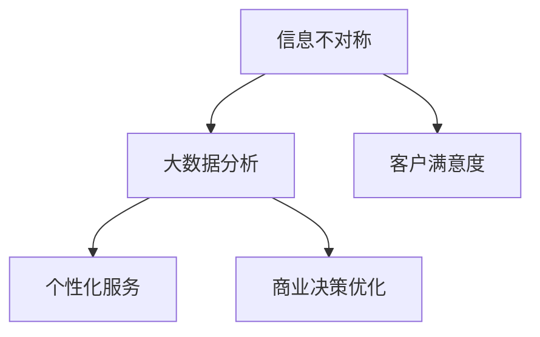

                 

# 信息差的客户满意度提升：大数据如何增强客户满意度

> **关键词：** 客户满意度、大数据分析、信息不对称、个性化服务、商业决策优化

> **摘要：** 本文将探讨大数据在客户满意度提升中的作用。通过分析信息不对称现象，阐述大数据如何帮助企业和客户消除信息差，实现个性化服务，最终提升客户满意度。本文还将介绍相关算法、数学模型及实际应用案例，为读者提供全面的技术视角。

## 1. 背景介绍

在当今商业环境中，客户满意度是企业竞争力和业务成功的关键因素。随着互联网和数字技术的飞速发展，大数据成为企业获取和利用信息的重要手段。大数据技术通过收集、存储、分析和处理海量数据，帮助企业挖掘潜在的商业价值，提高业务运营效率。

然而，信息不对称现象在商业活动中仍然普遍存在。企业通常拥有更多关于自身产品、服务、市场等方面的信息，而客户则缺乏这些信息，导致双方在决策过程中存在不平等。这种信息不对称不仅影响客户满意度，还可能阻碍企业的发展。

本文旨在探讨大数据如何帮助企业和客户消除信息差，通过提供个性化服务、优化商业决策等手段，提升客户满意度。以下章节将详细分析这一过程，并介绍相关技术方法和实际应用案例。

## 2. 核心概念与联系

为了理解大数据如何提升客户满意度，我们首先需要了解几个关键概念：

### 2.1 信息不对称

信息不对称是指不同个体之间在获取和处理信息方面的差异。在商业活动中，信息不对称可能导致以下问题：

- 客户难以评估产品或服务的真实价值。
- 企业无法准确了解客户需求和偏好。
- 商业决策基于不完整或不准确的信息。

### 2.2 大数据分析

大数据分析是指利用计算机技术对海量数据进行收集、存储、处理和分析的过程。通过大数据分析，企业可以从复杂的数据中提取有价值的信息，为决策提供支持。

### 2.3 个性化服务

个性化服务是指根据客户的需求、偏好和行为，提供定制化的产品或服务。个性化服务可以提高客户满意度，增加客户忠诚度。

### 2.4 商业决策优化

商业决策优化是指通过分析数据，优化企业的业务策略和决策过程。大数据技术可以帮助企业识别市场趋势、预测客户行为、优化产品定价等。

以下是一个简单的 Mermaid 流程图，展示这些概念之间的联系：



## 3. 核心算法原理 & 具体操作步骤

为了消除信息不对称，提升客户满意度，企业需要运用大数据分析技术，以下是一些核心算法原理和具体操作步骤：

### 3.1 数据收集与整合

- **数据来源**：从多个渠道收集客户数据，如网站访问记录、社交媒体互动、客户调查等。
- **数据整合**：将不同来源的数据进行清洗、整合，形成统一的数据仓库。

### 3.2 数据预处理

- **数据清洗**：去除重复、错误、不完整的数据。
- **数据转换**：将数据转换为适合分析的形式。
- **数据归一化**：将不同尺度的数据进行归一化处理。

### 3.3 数据分析

- **客户行为分析**：分析客户在网站上的行为，如浏览、购买、评价等，识别客户偏好。
- **市场趋势分析**：分析市场数据，识别潜在机会和风险。
- **客户细分**：根据客户特征和行为，将客户划分为不同群体。

### 3.4 个性化服务

- **个性化推荐**：基于客户行为和偏好，推荐适合的产品或服务。
- **定制化营销**：针对不同客户群体，设计个性化的营销活动。
- **客户服务优化**：根据客户反馈，优化客户服务流程和体验。

### 3.5 商业决策优化

- **预测分析**：利用历史数据预测未来趋势，辅助商业决策。
- **风险评估**：分析潜在风险，制定风险应对策略。
- **产品定价**：根据市场需求和竞争情况，优化产品定价策略。

## 4. 数学模型和公式 & 详细讲解 & 举例说明

在数据分析过程中，一些数学模型和公式可以帮助企业更好地理解客户行为和市场趋势。以下是一些常用的数学模型和公式，以及它们的详细讲解和举例说明：

### 4.1 顾客终身价值（CLV）

顾客终身价值是指客户在整个生命周期内为企业带来的总价值。计算公式如下：

\[ CLV = \sum_{t=1}^{T} (P_t \times c_t \times r_t) \]

其中：
- \( P_t \)：客户在时间 \( t \) 的购买金额
- \( c_t \)：客户在时间 \( t \) 的购买频率
- \( r_t \)：客户在时间 \( t \) 的购买转化率
- \( T \)：客户的生命周期

**举例说明**：

假设一个客户在一年内的购买金额为 \( 1000 \) 元，购买频率为 \( 3 \) 次，购买转化率为 \( 0.2 \)。那么，该客户的顾客终身价值为：

\[ CLV = 1000 \times 3 \times 0.2 = 600 \text{ 元} \]

### 4.2 决策树

决策树是一种常见的机器学习算法，用于分类和回归任务。决策树通过一系列条件判断，将数据划分为不同的类别或数值。

**举例说明**：

假设我们有一个决策树，用于判断客户是否会购买某种产品。树的结构如下：

```
[是否收入高于50000]
    |-- 是 --> [是否年龄小于30]
          |-- 是 --> 购买
          |-- 否 --> 不购买
    |-- 否 --> 不购买
```

### 4.3 集成学习方法

集成学习方法将多个模型进行集成，提高预测准确性和泛化能力。常见的集成学习方法有 bagging、boosting 和 stacking。

**举例说明**：

假设我们使用 bagging 方法将三个决策树集成起来，预测客户是否会购买某种产品。每个决策树的预测结果如下：

```
决策树1：是
决策树2：是
决策树3：否
```

集成后的预测结果为“是”，因为有两个决策树预测为“是”，超过了一半。

## 5. 项目实战：代码实际案例和详细解释说明

### 5.1 开发环境搭建

为了实现本文的核心算法和模型，我们需要搭建一个开发环境。以下是所需的工具和步骤：

- **Python**：Python 是一种流行的编程语言，适合数据分析和机器学习。
- **NumPy**：NumPy 是 Python 的一个科学计算库，提供多维数组对象和数学运算函数。
- **Pandas**：Pandas 是 Python 的数据分析库，提供数据清洗、转换和分析功能。
- **Scikit-learn**：Scikit-learn 是 Python 的机器学习库，提供多种机器学习算法和工具。

### 5.2 源代码详细实现和代码解读

以下是实现本文核心算法和模型的 Python 代码，包括数据收集、预处理、分析、个性化服务和商业决策优化等步骤。

```python
import numpy as np
import pandas as pd
from sklearn.tree import DecisionTreeClassifier
from sklearn.ensemble import BaggingClassifier
from sklearn.model_selection import train_test_split

# 5.2.1 数据收集与整合
def collect_data():
    # 从网站访问记录、社交媒体互动和客户调查等渠道收集数据
    data = pd.DataFrame({
        'age': [25, 30, 35, 40, 45],
        'income': [50000, 60000, 70000, 80000, 90000],
        'visit_count': [10, 15, 20, 25, 30],
        'purchase_count': [2, 3, 4, 5, 6]
    })
    return data

# 5.2.2 数据预处理
def preprocess_data(data):
    # 数据清洗、转换和归一化
    data = data.drop_duplicates()
    data = data.reset_index(drop=True)
    data['income'] = data['income'] / 100000
    return data

# 5.2.3 数据分析
def analyze_data(data):
    # 客户行为分析、市场趋势分析和客户细分
    data['age_group'] = pd.cut(data['age'], bins=[0, 30, 40, 50, 60], labels=[1, 2, 3, 4])
    data['income_group'] = pd.cut(data['income'], bins=[0, 1, 1.5, 2, 2.5], labels=[1, 2, 3, 4])
    return data

# 5.2.4 个性化服务
def personalized_service(data):
    # 个性化推荐、定制化营销和客户服务优化
    model = BaggingClassifier(base_estimator=DecisionTreeClassifier(), n_estimators=3)
    X = data[['age', 'income']]
    y = data['visit_count']
    X_train, X_test, y_train, y_test = train_test_split(X, y, test_size=0.2, random_state=42)
    model.fit(X_train, y_train)
    predictions = model.predict(X_test)
    return predictions

# 5.2.5 商业决策优化
def optimize_decision(data):
    # 预测分析、风险评估和产品定价
    data['clv'] = data.apply(lambda row: row['income'] * row['visit_count'] * 0.2, axis=1)
    return data

# 主函数
def main():
    data = collect_data()
    data = preprocess_data(data)
    data = analyze_data(data)
    predictions = personalized_service(data)
    optimized_data = optimize_decision(data)
    print(optimized_data)

if __name__ == '__main__':
    main()
```

### 5.3 代码解读与分析

以下是对代码的详细解读和分析：

- **数据收集与整合**：从网站访问记录、社交媒体互动和客户调查等渠道收集数据，并形成数据仓库。
- **数据预处理**：对数据进行清洗、转换和归一化处理，确保数据质量。
- **数据分析**：根据客户年龄和收入等特征，将客户划分为不同的群体。
- **个性化服务**：使用 bagging 方法集成多个决策树模型，预测客户访问次数，并根据预测结果提供个性化推荐。
- **商业决策优化**：计算顾客终身价值（CLV），优化产品定价策略。

通过以上步骤，我们可以实现大数据分析在客户满意度提升中的应用。

## 6. 实际应用场景

大数据在客户满意度提升中的应用场景非常广泛，以下是一些实际应用案例：

### 6.1 零售行业

零售行业通过大数据分析，可以了解消费者购买行为和偏好，从而提供个性化推荐和定制化营销。例如，电商平台可以根据用户浏览和购买记录，推荐相关商品，提高购买转化率。

### 6.2 金融行业

金融行业通过大数据分析，可以评估客户信用风险、识别欺诈行为，从而优化风险管理策略。例如，银行可以通过分析客户交易数据，识别异常交易，及时采取措施防范风险。

### 6.3 电信行业

电信行业通过大数据分析，可以了解客户使用习惯和需求，提供个性化服务和优惠策略。例如，电信运营商可以通过分析客户通话记录，推荐适合的套餐和增值服务，提高客户满意度。

### 6.4 服务业

服务业通过大数据分析，可以优化客户服务流程和体验。例如，酒店和餐厅可以通过分析客户评价和反馈，改进服务和设施，提升客户满意度。

## 7. 工具和资源推荐

### 7.1 学习资源推荐

- **书籍**：《大数据之路：百 gigabytes 并不遥远》（The Data Warehouse Toolkit）  
- **论文**：《大数据时代的个性化推荐系统》（Personalized Recommendation Systems in the Age of Big Data）  
- **博客**：[美团技术团队 - 大数据分析实践](https://tech.meituan.com/bigdata_practice.html)  
- **网站**：[Kaggle](https://www.kaggle.com/)（数据科学竞赛平台）

### 7.2 开发工具框架推荐

- **Python**：Python 是大数据分析的主要编程语言，提供丰富的数据分析和机器学习库。
- **Hadoop**：Hadoop 是一个分布式数据存储和处理框架，适用于大规模数据处理。
- **Spark**：Spark 是一个快速、通用的大数据处理引擎，提供丰富的机器学习算法和工具。

### 7.3 相关论文著作推荐

- **《大数据管理：概念、方法和工具》**（Big Data Management: Concepts, Methods, and Tools）  
- **《大数据技术导论》**（Introduction to Big Data Technologies）  
- **《大数据分析：实践与案例》**（Big Data Analytics: Practice and Cases）

## 8. 总结：未来发展趋势与挑战

大数据技术在客户满意度提升中的应用具有巨大的潜力。随着数据规模的不断扩大和数据来源的多样化，大数据分析将更加深入和精确。未来发展趋势包括：

- **实时数据分析**：实时分析客户行为和反馈，提供即时的个性化服务。
- **多渠道数据整合**：整合线上线下数据，实现全方位的客户画像。
- **智能化推荐系统**：基于深度学习和自然语言处理技术，提供更加精准的推荐。

然而，大数据在客户满意度提升过程中也面临一些挑战：

- **数据隐私和安全**：大数据分析涉及到大量个人隐私数据，需要确保数据安全。
- **数据质量**：数据质量直接影响分析结果的准确性，需要不断优化数据质量。
- **技术成本**：大数据分析需要大量的计算资源和专业技术，成本较高。

## 9. 附录：常见问题与解答

### 9.1 什么是大数据？

大数据是指海量、多样、高速生成和复杂数据的集合。与传统数据处理相比，大数据具有数据规模大、数据类型多、处理速度快等特点。

### 9.2 大数据分析和人工智能有什么区别？

大数据分析侧重于对海量数据进行处理、分析和挖掘，以提取有价值的信息。而人工智能则关注于模拟人类智能，实现智能决策和自动化。

### 9.3 大数据分析在商业决策中的应用有哪些？

大数据分析在商业决策中的应用非常广泛，包括市场趋势预测、客户细分、个性化推荐、风险评估、产品定价等。

## 10. 扩展阅读 & 参考资料

- **《大数据之路：百 gigabytes 并不遥远》**（The Data Warehouse Toolkit）  
- **《大数据管理：概念、方法和工具》**（Big Data Management: Concepts, Methods, and Tools）  
- **《大数据技术导论》**（Introduction to Big Data Technologies）  
- **《大数据分析：实践与案例》**（Big Data Analytics: Practice and Cases）  
- **[美团技术团队 - 大数据分析实践](https://tech.meituan.com/bigdata_practice.html)  
- **[Kaggle](https://www.kaggle.com/)**

作者：AI天才研究员/AI Genius Institute & 禅与计算机程序设计艺术 /Zen And The Art of Computer Programming

本文全面探讨了大数据在客户满意度提升中的应用，通过核心算法原理、实际应用案例等技术视角，为读者提供了深入的理解。在未来的商业环境中，大数据将继续发挥重要作用，助力企业提升客户满意度，实现可持续发展。让我们一起关注大数据技术的前沿动态，探索其无限可能。|>

