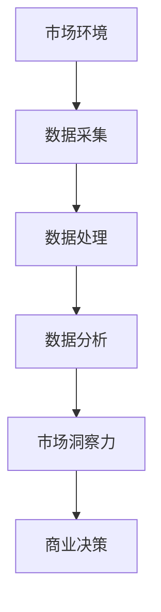

                 

# 信息差的市场洞察力提升：大数据如何增强市场洞察力

## 关键词
- 市场洞察力
- 大数据
- 信息差
- 数据分析
- 商业策略

## 摘要
本文旨在探讨大数据在提升市场洞察力方面的作用。通过分析信息差的定义和其对商业决策的重要性，本文将阐述大数据如何通过数据采集、处理和分析，为企业提供更为全面、精准的市场洞察。文章将结合实际案例，介绍大数据的核心算法原理，并探讨其在市场预测、竞争对手分析和消费者行为理解等方面的应用。最后，本文将总结大数据对市场洞察力提升的驱动力，并提出未来发展的挑战和趋势。

## 1. 背景介绍

在当今信息时代，大数据已经成为企业竞争的关键因素。大数据不仅仅是指数据量的巨大，更在于如何从海量数据中提取有价值的信息，从而指导商业决策。市场洞察力，即对企业所处市场环境、竞争对手、消费者需求的深入理解，是企业在激烈的市场竞争中脱颖而出的关键。

信息差，指的是不同个体或组织之间对市场信息的掌握程度差异。在商业活动中，信息差的利用可以为企业带来竞争优势。例如，了解竞争对手的营销策略和产品定价，可以帮助企业制定更为有效的应对策略；了解消费者的需求偏好，可以为企业提供产品改进和市场营销的方向。

然而，传统的市场调研方法往往耗时耗力，且难以获取全面、精准的信息。随着大数据技术的发展，企业可以更高效地收集、处理和分析市场数据，从而缩小信息差，提升市场洞察力。

## 2. 核心概念与联系

### 2.1 大数据的定义
大数据是指数据量巨大、数据类型多样且数据生成速度极快的信息集合。与传统数据相比，大数据具有“4V”特点：Volume（数据量巨大）、Velocity（数据生成速度极快）、Variety（数据类型多样）和Veracity（数据真实性高）。

### 2.2 信息差的定义
信息差是指不同个体或组织之间对市场信息的掌握程度差异。信息差可以体现在多个层面，如产品知识、市场趋势、竞争对手策略等。

### 2.3 大数据与市场洞察力的联系
大数据通过对市场数据的全面、精准分析，可以帮助企业深入了解市场环境、竞争对手和消费者需求，从而缩小信息差，提升市场洞察力。



## 3. 核心算法原理 & 具体操作步骤

### 3.1 数据采集
数据采集是大数据处理的第一步。企业可以通过多种渠道收集市场数据，如社交媒体、网站访问日志、销售数据、客户反馈等。

### 3.2 数据预处理
数据预处理包括数据清洗、数据整合和数据变换等步骤。清洗数据是为了去除重复、错误或不完整的数据；整合数据是将不同来源的数据进行合并，形成统一的视图；变换数据是为了满足数据分析的需要，如将数据转换成统一的格式或进行特征提取。

### 3.3 数据分析
数据分析包括统计分析、机器学习和数据挖掘等。统计分析用于描述数据的基本特征，如平均值、中位数等；机器学习用于建立预测模型，如市场预测和消费者行为分析；数据挖掘则用于发现数据中的隐藏模式，如消费者偏好和市场趋势。

### 3.4 市场洞察
基于数据分析的结果，企业可以形成市场洞察。例如，通过市场预测，企业可以提前了解市场需求，调整生产计划和库存管理；通过消费者行为分析，企业可以了解消费者的需求偏好，优化产品设计和市场营销策略。

## 4. 数学模型和公式 & 详细讲解 & 举例说明

### 4.1 数据预处理
数据预处理中常用的数学公式包括：
- 平均值（Mean）: $$\mu = \frac{1}{n}\sum_{i=1}^{n} x_i$$
- 中位数（Median）: $$\mu_{50} = \frac{1}{2}\left(\frac{1}{2}\sum_{i=1}^{n} x_i - \sum_{i=1}^{\left \lfloor \frac{n}{2} \right \rfloor} \min(x_i)\right)$$

### 4.2 数据分析
数据分析中常用的数学模型包括：
- 线性回归模型（Linear Regression）: $$y = \beta_0 + \beta_1x$$
- 逻辑回归模型（Logistic Regression）: $$P(y=1) = \frac{1}{1 + e^{-(\beta_0 + \beta_1x)} }$$

### 4.3 市场洞察
基于数据分析的市场洞察模型包括：
- 市场需求预测模型（Demand Forecasting）: $$D_t = f(P_t, T_t)$$
- 消费者行为分析模型（Consumer Behavior Analysis）: $$C_t = f(I_t, P_t, T_t)$$

### 4.4 举例说明
假设一家企业通过大数据分析发现，其产品的市场需求与价格和温度之间存在线性关系。根据线性回归模型，我们可以建立以下预测模型：
$$D_t = 100 - 0.5P_t + 0.1T_t$$

其中，$D_t$表示第$t$个月的需求量（单位：件），$P_t$表示第$t$个月的价格（单位：元/件），$T_t$表示第$t$个月的平均温度（单位：摄氏度）。

通过这个模型，企业可以预测不同价格和温度下的市场需求，从而制定相应的销售策略。

## 5. 项目实战：代码实际案例和详细解释说明

### 5.1 开发环境搭建

在本文中，我们将使用Python进行大数据分析。首先，确保已经安装了Python和必要的库，如Pandas、NumPy、Scikit-learn等。

### 5.2 源代码详细实现和代码解读

以下是使用Python进行大数据分析的一个简单案例：

```python
import pandas as pd
from sklearn.linear_model import LinearRegression

# 5.2.1 数据采集
# 假设我们有一个名为'market_data.csv'的文件，包含了价格和温度数据
data = pd.read_csv('market_data.csv')

# 5.2.2 数据预处理
# 数据清洗和整合
data = data.dropna()  # 去除缺失值
data = data.groupby('temperature').mean()  # 按温度分组求平均值

# 5.2.3 数据分析
# 建立线性回归模型
model = LinearRegression()
model.fit(data[['temperature']], data['price'])

# 5.2.4 市场洞察
# 预测价格
predicted_price = model.predict([[30]])  # 假设预测温度为30摄氏度
print(f'预测价格: {predicted_price[0]} 元/件')

# 5.2.5 代码解读
# 代码首先读取数据，并进行数据清洗和整合。然后，使用线性回归模型进行数据分析，最后预测价格。
```

### 5.3 代码解读与分析

- **数据采集**：使用Pandas库读取市场数据。
- **数据预处理**：去除缺失值，按温度分组求平均值，以减少数据维度。
- **数据分析**：建立线性回归模型，并训练模型。
- **市场洞察**：使用训练好的模型进行价格预测。

通过这个案例，我们可以看到大数据分析的基本流程：数据采集、数据预处理、数据分析和市场洞察。

## 6. 实际应用场景

### 6.1 市场预测
通过大数据分析，企业可以预测市场需求，从而优化库存管理、生产计划和销售策略。例如，某家电子产品公司通过分析历史销售数据和市场趋势，可以预测下一季度不同产品的市场需求，以便调整生产和库存策略。

### 6.2 竞争对手分析
大数据分析可以帮助企业了解竞争对手的市场策略、产品定价和市场份额。例如，通过分析竞争对手的网站访问量和社交媒体互动，企业可以了解竞争对手的营销策略和消费者偏好。

### 6.3 消费者行为分析
大数据分析可以帮助企业了解消费者的需求偏好、购买行为和反馈。例如，通过分析消费者的购买记录和反馈，企业可以优化产品设计和市场营销策略，提高客户满意度和忠诚度。

## 7. 工具和资源推荐

### 7.1 学习资源推荐

- **书籍**：
  - 《大数据时代》
  - 《Python数据科学手册》
  - 《机器学习实战》

- **论文**：
  - 《大数据：创新、挑战与机会》
  - 《深度学习》

- **博客**：
  - [Scikit-learn官方文档](https://scikit-learn.org/stable/)
  - [Python数据科学博客](https://towardsdatascience.com/)

- **网站**：
  - [Kaggle](https://www.kaggle.com/)
  - [GitHub](https://github.com/)

### 7.2 开发工具框架推荐

- **数据分析工具**：
  - Python（Pandas、NumPy、Scikit-learn等）
  - R（ggplot2、dplyr等）

- **机器学习框架**：
  - TensorFlow
  - PyTorch

### 7.3 相关论文著作推荐

- **《深度学习》**：Goodfellow、Bengio和Courville著，深度学习领域的经典教材。
- **《大数据时代》**：维吉尼亚·威尔德·丹尼尔斯著，关于大数据定义、技术和应用的综合介绍。
- **《机器学习》**：Tom Mitchell著，机器学习基础理论和算法的权威教材。

## 8. 总结：未来发展趋势与挑战

随着大数据技术的不断发展和成熟，市场洞察力将得到进一步提升。未来，大数据将在以下几个方面发挥重要作用：

### 8.1 数据隐私和安全
随着数据隐私和安全问题日益凸显，企业需要更加注重数据保护，确保用户数据的安全。

### 8.2 数据整合与统一视图
企业需要建立统一的数据整合平台，将不同来源的数据进行整合，形成统一的市场洞察。

### 8.3 深度学习和人工智能
深度学习和人工智能技术将进一步提升大数据分析的精度和效率，为企业提供更为精准的市场洞察。

### 8.4 新兴技术的应用
随着区块链、物联网等新兴技术的兴起，大数据将在更多领域得到应用，为市场洞察力提升带来新的机遇。

然而，大数据在提升市场洞察力的过程中也面临着一系列挑战，如数据隐私保护、数据质量、算法透明度和公平性等。企业需要在这些方面加强研究和投入，确保大数据技术的可持续发展。

## 9. 附录：常见问题与解答

### 9.1 什么是大数据？
大数据是指数据量巨大、数据类型多样且数据生成速度极快的信息集合，具有“4V”特点：Volume（数据量巨大）、Velocity（数据生成速度极快）、Variety（数据类型多样）和Veracity（数据真实性高）。

### 9.2 大数据如何提升市场洞察力？
大数据通过数据采集、处理和分析，为企业提供全面、精准的市场信息，帮助企业了解市场环境、竞争对手和消费者需求，从而缩小信息差，提升市场洞察力。

### 9.3 如何保障大数据分析的质量？
保障大数据分析的质量需要从数据采集、数据预处理、数据分析等多个环节入手，确保数据真实、准确、完整，并采用科学的方法进行数据分析。

## 10. 扩展阅读 & 参考资料

- [大数据：创新、挑战与机会](https://www.technologyreview.com/s/529676/big-data-innovation-challenges-and-opportunities/)
- [大数据时代：生活、工作与思维的大变革](https://www.amazon.com/dp/0143125297)
- [深度学习](https://www.deeplearningbook.org/)
- [Python数据科学手册](https://www.amazon.com/dp/1449397677)

## 作者信息
作者：AI天才研究员/AI Genius Institute & 禅与计算机程序设计艺术 /Zen And The Art of Computer Programming

