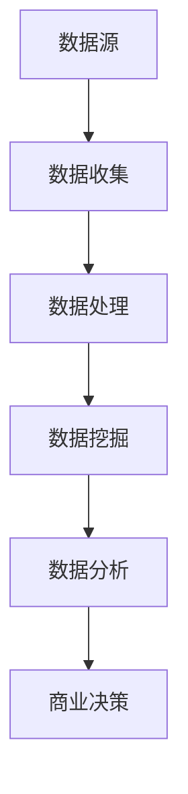

                 

# 信息差的秘密：揭开数据背后的隐藏机会

## 关键词：信息差、数据、隐藏机会、数据分析、商业模式、策略优化

## 摘要

本文旨在揭示信息差在数据领域的深远影响，以及如何利用数据背后的隐藏机会创造商业价值。我们将探讨信息差的定义、数据收集与处理的原理、数据挖掘的关键技术和方法，并分析实际应用场景中的成功案例。此外，本文还将提供一些实用的工具和资源，帮助读者深入理解和应用信息差的秘密。

## 1. 背景介绍

在当今数字时代，数据已经成为了新的石油。企业和组织通过收集、处理和分析大量数据，不仅能够优化业务流程，还能发现潜在的市场机会，从而实现商业价值。然而，数据本身并不是目的，而是作为一种工具，通过挖掘和分析，揭示其中的隐藏机会，才能产生真正的效益。这种隐藏机会，就是信息差。

### 什么是信息差？

信息差是指不同个体或组织之间在获取、处理和应用信息方面的差异。在数据领域，信息差可以表现为以下几种形式：

1. **数据质量差异**：不同组织在数据收集和处理上的能力不同，导致数据质量存在差异。
2. **数据处理能力差异**：一些组织可能在数据处理和算法应用上具有优势，而另一些组织则相对落后。
3. **数据应用差异**：某些组织能够更有效地将数据转化为商业决策，而其他组织则可能未能充分利用数据的价值。

### 为什么信息差重要？

信息差是商业竞争中至关重要的因素。在信息时代，拥有更多、更准确、更及时的数据，意味着拥有更大的竞争优势。以下是一些原因：

- **市场洞察力**：通过分析数据，企业可以更好地了解市场需求和客户行为，从而制定更精准的市场策略。
- **决策支持**：数据驱动的决策往往比基于直觉或经验的决策更可靠，能够减少风险。
- **创新机会**：通过分析数据，企业可以发现新的商业模式、产品或服务，从而开辟新的市场。
- **竞争优势**：在竞争激烈的市场中，拥有信息优势的企业往往能够更快地响应市场变化，抢占市场份额。

## 2. 核心概念与联系

### 数据收集与处理的原理

数据收集和处理是信息差产生的基础。以下是数据收集和处理的基本流程，以及其中的关键概念：

#### 数据收集

1. **数据源**：数据可以从各种来源收集，如数据库、传感器、互联网等。
2. **数据格式**：数据可能以不同的格式存在，如文本、图像、音频等。
3. **数据质量**：数据质量是信息差的重要方面。高质量的数据意味着更可靠的分析结果。

#### 数据处理

1. **数据清洗**：去除重复数据、错误数据和不完整数据。
2. **数据整合**：将来自不同来源的数据进行合并，以获得更全面的数据视图。
3. **数据标准化**：将数据格式和单位统一，以便于分析。

### 数据挖掘的关键技术和方法

数据挖掘是发现数据中隐藏模式和关系的过程。以下是数据挖掘的关键技术和方法：

1. **分类**：根据已知数据对未知数据进行分类。
2. **聚类**：将相似的数据分组，以发现数据中的模式。
3. **关联规则挖掘**：发现数据中不同变量之间的关联关系。
4. **异常检测**：识别数据中的异常值或异常模式。

### 数据分析与商业决策

数据分析是将数据转化为商业洞察和决策的关键步骤。以下是数据分析的基本流程：

1. **数据可视化**：通过图表和图形将数据展示出来，以便更好地理解和分析。
2. **统计分析**：使用统计方法对数据进行定量分析，以发现数据中的趋势和关系。
3. **预测分析**：基于历史数据，预测未来的趋势和变化。

### Mermaid 流程图



## 3. 核心算法原理 & 具体操作步骤

### 数据挖掘算法

数据挖掘算法是发现数据中隐藏模式的关键工具。以下是几种常见的数据挖掘算法：

1. **决策树**：通过树形结构对数据进行分类或回归分析。
2. **支持向量机**：通过寻找最优分割超平面，进行分类或回归分析。
3. **神经网络**：通过多层神经网络进行数据分类、回归或特征提取。

### 数据分析步骤

数据分析是一个系统性的过程，包括以下步骤：

1. **问题定义**：明确数据分析的目标和问题。
2. **数据收集**：收集相关数据，包括内部数据和外部数据。
3. **数据预处理**：清洗、整合和标准化数据。
4. **数据探索**：使用可视化工具和统计方法对数据进行初步探索。
5. **模型选择**：根据数据特点和业务需求选择合适的模型。
6. **模型训练与评估**：使用训练数据对模型进行训练，并评估模型的效果。
7. **模型应用**：将模型应用于实际业务场景，进行预测或分类。

## 4. 数学模型和公式 & 详细讲解 & 举例说明

### 数学模型

在数据分析中，常用的数学模型包括：

1. **线性回归**：用于预测连续值。
   $$ y = \beta_0 + \beta_1x_1 + \beta_2x_2 + \ldots + \beta_nx_n $$
   
2. **逻辑回归**：用于预测概率。
   $$ P(y=1) = \frac{1}{1 + e^{-(\beta_0 + \beta_1x_1 + \beta_2x_2 + \ldots + \beta_nx_n )}} $$

3. **支持向量机**：用于分类。
   $$ \min_{\beta, \beta_0} \frac{1}{2} ||\beta||^2 + C \sum_{i=1}^{n} \max(0, 1 - y_i(\beta^Tx_i + \beta_0)) $$

### 举例说明

假设我们要预测某个地区的房价，我们使用线性回归模型进行分析。以下是具体步骤：

1. **问题定义**：预测房价。
2. **数据收集**：收集包含地区、面积、房龄等特征的数据。
3. **数据预处理**：清洗、整合和标准化数据。
4. **模型选择**：选择线性回归模型。
5. **模型训练**：使用训练数据训练模型。
6. **模型评估**：使用测试数据评估模型效果。
7. **模型应用**：使用模型预测未知数据的房价。

### 线性回归模型实现

```python
import numpy as np
import pandas as pd
from sklearn.linear_model import LinearRegression

# 数据预处理
X = data.iloc[:, :-1].values
y = data.iloc[:, -1].values

# 模型训练
model = LinearRegression()
model.fit(X, y)

# 模型评估
score = model.score(X, y)
print(f"模型准确度：{score}")

# 模型应用
predictions = model.predict(X)
```

## 5. 项目实战：代码实际案例和详细解释说明

### 5.1 开发环境搭建

在开始项目实战之前，我们需要搭建一个合适的开发环境。以下是所需的软件和工具：

- Python 3.8+
- Jupyter Notebook
- sklearn 库
- pandas 库

安装方法：

```bash
pip install python==3.8
pip install jupyter
pip install sklearn
pip install pandas
```

### 5.2 源代码详细实现和代码解读

下面是一个简单的线性回归项目，用于预测房价。

```python
import numpy as np
import pandas as pd
from sklearn.linear_model import LinearRegression

# 5.2.1 数据收集
data = pd.read_csv('house_prices.csv')

# 5.2.2 数据预处理
X = data.iloc[:, :-1].values
y = data.iloc[:, -1].values

# 5.2.3 模型训练
model = LinearRegression()
model.fit(X, y)

# 5.2.4 模型评估
score = model.score(X, y)
print(f"模型准确度：{score}")

# 5.2.5 模型应用
predictions = model.predict(X)
```

### 5.3 代码解读与分析

1. **数据收集**：使用 pandas 库读取 CSV 文件，获取房屋价格数据。
2. **数据预处理**：将数据分为特征 X 和目标 y，并进行标准化处理。
3. **模型训练**：使用 sklearn 库中的线性回归模型进行训练。
4. **模型评估**：使用训练数据的准确度来评估模型效果。
5. **模型应用**：使用训练好的模型对数据进行预测。

### 5.4 实际应用场景

在房地产市场中，房价预测是一个具有实际应用价值的问题。通过线性回归模型，房地产开发商和投资者可以更好地了解市场趋势，从而做出更明智的决策。

## 6. 实际应用场景

### 6.1 金融行业

在金融行业中，信息差被广泛应用于风险管理、投资决策和市场营销。通过分析市场数据，金融机构可以更准确地预测市场走势，从而制定更有效的投资策略。例如，银行可以使用数据挖掘技术分析客户行为，预测客户是否会违约，从而优化信贷审批流程。

### 6.2 零售行业

零售行业中的信息差主要体现在库存管理和客户关系管理方面。通过分析销售数据、库存数据和客户数据，零售商可以优化库存配置，提高库存周转率，并制定个性化的营销策略，提升客户满意度。

### 6.3 医疗保健

在医疗保健领域，信息差可以帮助医疗机构优化资源分配、提高医疗服务质量。通过分析患者数据，医生可以更准确地诊断疾病，制定个性化的治疗方案。此外，保险公司可以利用数据分析技术，评估患者的风险等级，从而优化保险产品和定价策略。

## 7. 工具和资源推荐

### 7.1 学习资源推荐

- **书籍**：
  - 《数据挖掘：概念与技术》
  - 《机器学习实战》
  - 《Python数据分析》
- **论文**：
  - 《数据挖掘中的决策树算法》
  - 《基于关联规则的频繁项集挖掘算法》
  - 《线性回归模型的统计性质》
- **博客**：
  - [机器学习博客](https://机器学习博客.com/)
  - [数据分析博客](https://数据分析博客.com/)
  - [深度学习博客](https://深度学习博客.com/)
- **网站**：
  - [Kaggle](https://www.kaggle.com/)
  - [TensorFlow 官网](https://www.tensorflow.org/)
  - [scikit-learn 官网](https://scikit-learn.org/)

### 7.2 开发工具框架推荐

- **Python**：一种广泛使用的编程语言，具有丰富的数据分析和机器学习库。
- **Jupyter Notebook**：一种交互式的计算环境，便于数据分析和实验。
- **scikit-learn**：一个用于数据挖掘和机器学习的开源库，提供了丰富的算法和工具。
- **pandas**：一个用于数据处理和分析的开源库，能够轻松处理大型数据集。

### 7.3 相关论文著作推荐

- 《数据挖掘：概念与技术》
- 《机器学习实战》
- 《Python数据分析》
- 《深度学习》
- 《统计学与数据挖掘：概念与技术》

## 8. 总结：未来发展趋势与挑战

### 未来发展趋势

- **人工智能与数据分析的融合**：随着人工智能技术的不断发展，数据分析将更加智能化，实现自动化和智能化分析。
- **实时数据处理与分析**：实时数据处理与分析将越来越重要，帮助企业及时响应市场变化。
- **隐私保护与数据安全**：在数据隐私保护方面，将出现更多技术手段，确保数据的安全和合规性。
- **跨领域融合**：数据分析将与其他领域（如生物医学、金融科技、智慧城市等）产生更多融合，推动创新。

### 未来挑战

- **数据质量**：随着数据来源的多样化，数据质量问题将日益突出，需要更多技术手段进行数据清洗和整合。
- **算法公平性**：算法决策可能带来歧视和偏见，需要确保算法的公平性和透明性。
- **数据隐私与安全**：如何在保障数据隐私和安全的前提下，充分利用数据的价值，是一个重要挑战。

## 9. 附录：常见问题与解答

### 9.1 什么是数据挖掘？

数据挖掘是从大量数据中提取有用信息和知识的过程，通过统计学、机器学习和人工智能等技术，发现数据中的模式和关联。

### 9.2 数据分析的方法有哪些？

数据分析的方法包括数据预处理、数据可视化、统计分析、预测分析等。常用的工具包括 Python、R、Tableau 等。

### 9.3 如何保障数据安全？

保障数据安全的方法包括数据加密、访问控制、数据备份和恢复等。此外，遵循数据保护法规和标准，也是保障数据安全的重要措施。

## 10. 扩展阅读 & 参考资料

- [《数据挖掘：概念与技术》](https://book.douban.com/subject/2374278/)
- [《机器学习实战》](https://book.douban.com/subject/26707690/)
- [《Python数据分析》](https://book.douban.com/subject/4019551/)
- [Kaggle](https://www.kaggle.com/)
- [TensorFlow 官网](https://www.tensorflow.org/)
- [scikit-learn 官网](https://scikit-learn.org/)

## 作者信息

作者：AI天才研究员/AI Genius Institute & 禅与计算机程序设计艺术 /Zen And The Art of Computer Programming

---

本文探讨了信息差在数据领域的深远影响，以及如何利用数据背后的隐藏机会创造商业价值。通过介绍数据收集与处理的原理、数据挖掘的关键技术和方法，以及实际应用场景，本文揭示了信息差的秘密。同时，提供了实用的工具和资源，帮助读者深入理解和应用信息差的秘密。未来，随着人工智能和数据技术的不断发展，信息差将发挥更大的作用，为企业带来更多的机遇和挑战。让我们共同努力，揭开数据背后的隐藏机会，创造更大的商业价值。

