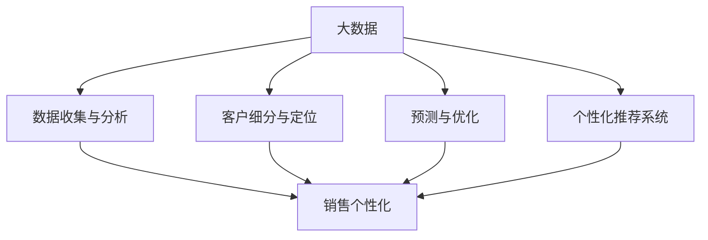
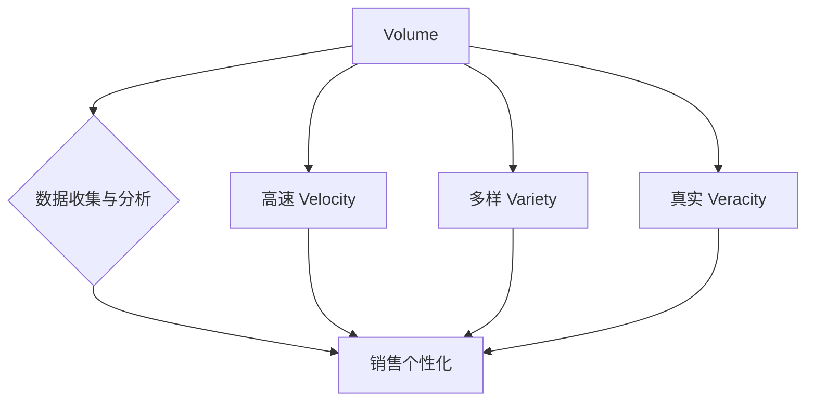
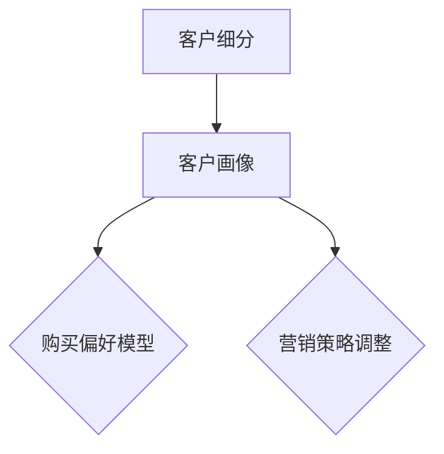
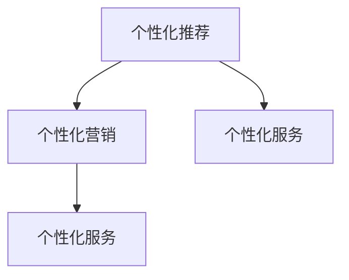

                 

### 1. 背景介绍

随着互联网和大数据技术的飞速发展，信息爆炸已经成为现实。消费者每天都会接触到海量的信息，而企业也在不断寻求如何从这些海量数据中挖掘出有价值的信息，以提高销售效率。传统的销售方法已经无法满足现代企业的需求，信息差逐渐缩小，如何实现销售个性化成为了许多企业关注的热点问题。

销售个性化升级的核心在于理解并满足每个客户的个性化需求，这需要依赖大数据技术。大数据可以帮助企业收集、处理和分析海量客户数据，从而实现精准营销，提高客户满意度和忠诚度。通过大数据分析，企业可以识别出潜在客户、分析客户行为、预测客户需求，从而制定出更加个性化的销售策略。

本文将深入探讨大数据如何实现销售个性化升级，包括核心概念、算法原理、数学模型、项目实战以及实际应用场景等方面。希望通过本文，能够帮助读者了解大数据在销售个性化升级中的重要作用，并掌握相关的技术方法和实践技巧。

首先，我们将介绍大数据和销售个性化的基本概念，以及它们之间的联系。接下来，我们将详细讨论大数据在销售个性化中的作用和重要性。随后，我们将介绍实现销售个性化所需的核心算法和数学模型，并给出具体的操作步骤。在项目实战部分，我们将通过实际案例展示如何使用大数据技术实现销售个性化。最后，我们将探讨大数据在销售个性化中的实际应用场景，并提供相关的工具和资源推荐。

### 2. 核心概念与联系

在深入探讨大数据如何实现销售个性化之前，我们有必要明确几个核心概念，并理解它们之间的内在联系。

**2.1 大数据（Big Data）**

大数据是指数据量巨大、种类繁多、生成速度极快的信息集合。大数据的特点可以概括为“4V”，即Volume（大量）、Velocity（高速）、Variety（多样）和Veracity（真实性）。大数据的这些特点使得传统的数据处理方法难以胜任，因此需要采用新的技术和方法来进行处理和分析。

**2.2 销售个性化（Sales Personalization）**

销售个性化是指企业根据客户个体特征和需求，提供定制化的产品或服务，以满足客户的个性化需求。销售个性化的目标是通过提高客户满意度、忠诚度和转化率，从而提升企业的销售业绩。

**2.3 大数据与销售个性化的联系**

大数据与销售个性化之间存在紧密的联系。大数据为销售个性化提供了数据基础，使得企业能够更准确地了解客户的个性化需求。具体来说，这种联系体现在以下几个方面：

1. **数据收集与分析**：大数据技术可以帮助企业收集客户的各种数据，如购买历史、浏览行为、社交媒体互动等。通过对这些数据的分析，企业可以洞察客户的偏好和行为模式，为销售个性化提供依据。

2. **客户细分与定位**：大数据分析能够帮助企业对客户进行细分，识别出具有不同特征和需求的客户群体。通过对不同客户群体的精准定位，企业可以制定出更具针对性的销售策略。

3. **预测与优化**：大数据分析可以预测客户的行为和需求，帮助企业在销售过程中及时调整策略，提高转化率和销售额。例如，通过预测客户流失率，企业可以采取措施降低客户流失率。

4. **个性化推荐系统**：大数据技术可以用于构建个性化推荐系统，根据客户的兴趣和行为推荐合适的产品或服务，提高客户的满意度和忠诚度。

下面是一个简单的Mermaid流程图，展示大数据与销售个性化的核心概念和联系：



通过以上核心概念的介绍和流程图的展示，我们可以更清晰地理解大数据与销售个性化之间的紧密联系，以及它们在实现销售个性化升级中的重要作用。

### 2.1 大数据的“4V”特征

大数据的“4V”特征是大数据分析的重要基础，也是我们理解大数据在销售个性化中作用的关键点。下面我们将详细探讨这些特征及其对销售个性化的影响。

**2.1.1 Volume（大量）**

“大量”是指大数据的数据量巨大，通常是TB甚至PB级别。这样的数据量远远超出了传统数据库的处理能力。然而，正是这些庞大的数据量，为销售个性化提供了丰富的信息来源。通过分析大量客户数据，企业可以挖掘出更多的客户行为模式和偏好，从而实现更精准的个性化营销。

**2.1.2 Velocity（高速）**

“高速”是指大数据的生成速度极快。在互联网时代，用户的行为数据、交易数据等每天都在以极快的速度产生。这种高速数据流要求数据处理和分析系统具备实时响应能力，以便及时捕捉和利用这些数据。对于销售个性化而言，实时分析客户行为和需求，可以使得企业迅速调整销售策略，提高销售转化率。

**2.1.3 Variety（多样）**

“多样”是指大数据的种类繁多，包括结构化数据、半结构化数据和非结构化数据。这些数据的多样性使得传统的数据处理方法难以胜任。然而，正是这种多样性，使得大数据在销售个性化中具有独特的优势。企业可以通过整合不同类型的数据，如客户的社会媒体互动、购买历史、地理位置等，形成更加全面的客户画像，从而制定出更加个性化的销售策略。

**2.1.4 Veracity（真实性）**

“真实性”是指大数据的真实性和准确性。由于大数据通常来源于多个渠道，数据质量参差不齐，包含噪声和错误。对于销售个性化来说，真实、准确的数据至关重要。如果数据质量不佳，可能会导致错误的客户细分和预测，从而影响销售效果。因此，数据清洗和预处理是大数据分析的重要环节，以确保数据的真实性和准确性。

下面是一个Mermaid流程图，展示大数据的“4V”特征及其对销售个性化的影响：



通过以上对大数据“4V”特征的详细分析，我们可以更深入地理解大数据在销售个性化中的重要作用。这些特征不仅为销售个性化提供了丰富的数据基础，还要求我们在数据处理和分析过程中，充分考虑数据质量、实时性和多样性等因素。

### 2.2 销售个性化的定义和实现方法

销售个性化，顾名思义，就是根据每个客户的个性化需求和偏好，提供定制化的产品或服务，以满足其独特的需求。这种个性化不仅仅体现在产品或服务的定制上，还包括营销策略、沟通方式、客户体验等多个方面。销售个性化的核心在于理解客户的个性化需求，从而提供更加贴合客户实际需求的产品和服务。

**2.2.1 客户细分**

客户细分是销售个性化的第一步，也是关键的一步。通过大数据分析，企业可以对客户进行精确的细分，将客户划分为不同的群体。这些群体可以基于客户的购买历史、兴趣爱好、行为模式、地理位置等多种因素进行划分。例如，一个电商企业可以将客户划分为“高价值客户”、“潜在高价值客户”、“普通客户”等多个群体。通过这种细分，企业可以更好地了解每个客户群体的特点，从而制定出更具针对性的营销策略。

**2.2.2 客户画像**

客户画像是对客户进行全面描述的一个虚拟模型，它包括客户的姓名、年龄、性别、职业、收入、教育背景、兴趣爱好、购买历史等各个方面。通过构建客户画像，企业可以更加直观地了解客户的需求和行为。例如，一个电商平台可以通过分析客户的浏览记录和购买记录，构建出客户的购买偏好模型，从而推荐更适合该客户的产品。

下面是一个Mermaid流程图，展示客户细分和客户画像的关系：



**2.2.3 个性化推荐**

个性化推荐是销售个性化的重要实现方法之一。通过大数据分析，企业可以识别出客户的兴趣和行为模式，从而推荐合适的产品或服务。例如，一个电商平台可以通过分析客户的浏览记录和购买历史，推荐类似的商品。这种个性化推荐不仅可以提高客户的购物体验，还可以提高商品的转化率和销售额。

**2.2.4 个性化营销**

个性化营销是通过大数据分析，针对不同客户群体制定出个性化的营销策略。这种策略可以包括定制化的广告、邮件营销、短信推送等。例如，一个电商企业可以针对高价值客户，提供专享优惠或礼品，从而提高客户的忠诚度。而对于潜在高价值客户，可以通过推送相关产品信息，引导其转化为实际购买。

**2.2.5 个性化服务**

个性化服务是销售个性化的另一个重要方面。通过大数据分析，企业可以了解客户的个性化需求，提供更加个性化的服务。例如，一个酒店可以通过分析客户的入住记录和偏好，提供个性化的房间配置和服务。这种个性化服务不仅可以提高客户的满意度，还可以增强客户的忠诚度。

下面是一个Mermaid流程图，展示个性化推荐、个性化营销和个性化服务的关系：



通过以上对销售个性化定义和实现方法的详细探讨，我们可以看到，销售个性化不仅仅是简单的产品定制，而是一个涉及客户细分、客户画像、个性化推荐、个性化营销和个性化服务的系统性工程。通过大数据分析，企业可以实现真正的销售个性化，提高客户满意度和忠诚度，从而提升企业的竞争力。

### 2.3 大数据在销售个性化中的应用场景

大数据技术在销售个性化中的应用非常广泛，涵盖了从客户行为分析到个性化推荐系统的多个层面。以下将详细探讨几个关键应用场景，并通过实际案例展示大数据如何帮助企业实现销售个性化。

**2.3.1 客户行为分析**

客户行为分析是大数据在销售个性化中最基本的应用之一。通过分析客户的购买历史、浏览记录、搜索关键词等数据，企业可以深入了解客户的行为模式，从而制定出更加精准的销售策略。例如，一个电商平台可以通过分析客户的浏览和购买数据，识别出客户对不同产品的偏好，从而进行针对性的产品推荐。

**案例：亚马逊的推荐系统**

亚马逊是全球最大的在线零售商之一，其推荐系统就是一个典型的客户行为分析应用案例。亚马逊通过分析用户的浏览历史、购买记录、搜索关键词等数据，为每位用户推荐可能感兴趣的产品。这种个性化的推荐不仅提高了用户的购物体验，还显著提升了销售额。

**2.3.2 个性化推荐系统**

个性化推荐系统是基于客户行为分析的结果，为企业提供个性化产品推荐的一种高级应用。这种系统通常利用机器学习和数据挖掘技术，从海量数据中挖掘出用户的兴趣和行为模式，从而生成个性化的推荐列表。个性化推荐系统可以广泛应用于电商、社交媒体、音乐和视频流媒体等多个领域。

**案例：Netflix的推荐系统**

Netflix是全球最大的流媒体服务提供商之一，其推荐系统是其成功的关键因素之一。Netflix通过分析用户的观看历史、评分和浏览行为等数据，为每位用户推荐可能感兴趣的电影和电视剧。这种个性化的推荐不仅提高了用户的观看体验，还显著提升了用户留存率和订阅转化率。

**2.3.3 客户细分与定位**

大数据分析可以帮助企业对客户进行精确的细分，识别出不同特征和需求的客户群体。通过对不同客户群体的精准定位，企业可以制定出更加个性化的营销策略。例如，一个电商企业可以根据客户的购买频率、购买金额和购买偏好等指标，将客户划分为高价值客户、潜在高价值客户和普通客户等多个群体，从而针对不同群体制定出差异化的营销策略。

**案例：阿里巴巴的精准营销**

阿里巴巴是中国最大的电商平台之一，其精准营销策略就是基于大数据分析对客户进行细分。阿里巴巴通过分析客户的购买历史、浏览行为和社交互动等数据，将客户划分为不同的群体，从而为每个群体提供定制化的营销信息。这种精准营销不仅提高了客户的满意度，还显著提升了销售转化率。

**2.3.4 客户忠诚度管理**

大数据分析可以帮助企业了解客户的忠诚度水平，从而制定出有效的客户忠诚度管理策略。通过分析客户的购买频率、购买金额、购买渠道等数据，企业可以识别出忠诚客户和潜在忠诚客户，并采取相应的措施提高客户的忠诚度。例如，企业可以为忠诚客户提供专属优惠、礼品或积分奖励，从而增强客户的忠诚度。

**案例：星巴克的会员系统**

星巴克是全球最大的咖啡连锁品牌之一，其会员系统就是一个典型的客户忠诚度管理应用案例。星巴克通过分析会员的购买记录、消费金额和消费频率等数据，为会员提供定制化的优惠和奖励。这种个性化的客户忠诚度管理策略不仅提高了客户的满意度，还显著提升了会员的忠诚度和复购率。

通过以上实际案例，我们可以看到大数据在销售个性化中的应用场景非常广泛，不仅包括客户行为分析、个性化推荐系统和客户细分与定位，还包括客户忠诚度管理等多个方面。通过充分利用大数据技术，企业可以更好地了解客户的需求和行为，从而实现真正的销售个性化，提高客户满意度和忠诚度，最终实现销售业绩的提升。

### 2.4 大数据技术在销售个性化中的应用案例

为了更好地理解大数据技术在销售个性化中的应用，下面我们将通过几个实际案例来展示大数据如何帮助企业实现销售个性化升级。

**2.4.1 案例一：电商平台的个性化推荐**

电商平台如亚马逊和阿里巴巴，通过大数据分析实现个性化推荐是他们的成功秘诀之一。这些平台利用用户的浏览历史、购买记录、搜索关键词等数据，构建用户兴趣和行为模型，从而推荐用户可能感兴趣的商品。例如，当用户在浏览一件商品时，系统会自动分析其浏览历史和购买记录，推荐类似风格、价格或品牌的商品。这种个性化推荐不仅提高了用户的购物体验，还显著提高了商品的转化率和销售额。

**具体步骤**：
1. 数据收集：收集用户的浏览记录、购买记录、搜索关键词等数据。
2. 数据清洗：清洗数据，去除重复、缺失和错误的数据。
3. 特征提取：提取用户行为和兴趣的特征，如浏览时长、购买频率、购买金额等。
4. 建模与预测：利用机器学习和数据挖掘技术，构建用户兴趣和行为模型，预测用户可能感兴趣的商品。
5. 个性化推荐：根据用户的兴趣和行为模型，为用户推荐个性化的商品。

**2.4.2 案例二：金融行业的精准营销**

金融行业如银行和保险，也广泛应用大数据技术实现销售个性化。通过分析客户的交易记录、消费行为、信用评分等数据，金融机构可以精确识别出潜在高价值客户和潜在风险客户，从而制定个性化的营销策略。例如，一家银行可以通过分析客户的信用卡消费数据，识别出具有高消费能力的客户，并向其推荐高端信用卡产品。而对于信用评分较低的客户，可以采取信用修复服务，以提高其信用评分。

**具体步骤**：
1. 数据收集：收集客户的交易记录、消费行为、信用评分等数据。
2. 数据分析：利用数据分析技术，分析客户的行为模式和信用风险。
3. 客户细分：根据客户的行为模式和信用评分，将客户划分为不同群体。
4. 营销策略：针对不同客户群体，制定个性化的营销策略，如高端信用卡推荐、信用修复服务等。
5. 风险管理：根据客户的风险评估，采取相应的风险管理措施，如降低授信额度、增加担保要求等。

**2.4.3 案例三：零售业的个性化服务**

零售业如超市和百货商场，通过大数据技术实现个性化服务，提升客户体验和满意度。例如，一家超市可以通过分析客户的购物记录和偏好，为其推荐适合的商品组合。同时，商场还可以利用移动设备定位技术，为顾客提供个性化的导购服务，如推荐附近的热门店铺和促销活动。

**具体步骤**：
1. 数据收集：收集客户的购物记录、偏好、购物车信息等数据。
2. 数据分析：分析客户的购物行为和偏好，构建个性化推荐模型。
3. 个性化推荐：根据客户的购物行为和偏好，推荐个性化的商品和促销信息。
4. 导购服务：利用移动设备定位技术，为顾客提供个性化的导购服务。
5. 客户反馈：收集客户对个性化服务的反馈，不断优化推荐和导购策略。

通过以上案例，我们可以看到大数据技术在销售个性化中的应用非常广泛，涵盖了电商、金融和零售等多个行业。通过充分利用大数据分析技术，企业可以更好地了解客户的需求和行为，提供个性化的产品和服务，从而提升客户满意度和忠诚度，最终实现销售业绩的提升。

### 3. 核心算法原理

在实现销售个性化的过程中，算法的选用和设计至关重要。下面我们将详细探讨几个核心算法原理，包括协同过滤、决策树和神经网络等，并解释它们在销售个性化中的应用。

**3.1 协同过滤（Collaborative Filtering）**

协同过滤是一种基于用户行为和偏好进行推荐的系统，主要通过分析用户之间的相似度来实现推荐。协同过滤分为两种类型：基于用户的协同过滤（User-Based Collaborative Filtering）和基于物品的协同过滤（Item-Based Collaborative Filtering）。

- **基于用户的协同过滤**：该方法通过计算用户之间的相似度，找出与目标用户相似的其他用户，并推荐这些用户喜欢的商品。计算用户相似度通常采用用户评分矩阵的相关性或余弦相似度。

  **算法步骤**：
  1. 计算用户之间的相似度：使用用户评分矩阵计算用户之间的相似度，如相关系数或余弦相似度。
  2. 识别相似用户：找出与目标用户最相似的其他用户。
  3. 推荐商品：推荐这些相似用户喜欢的商品。

- **基于物品的协同过滤**：该方法通过计算商品之间的相似度，找出与目标商品相似的其他商品，并推荐这些商品。商品相似度通常通过商品的特征向量计算，如余弦相似度或欧几里得距离。

  **算法步骤**：
  1. 计算商品之间的相似度：使用商品特征向量计算商品之间的相似度。
  2. 识别相似商品：找出与目标商品最相似的其他商品。
  3. 推荐商品：推荐这些相似商品。

**3.2 决策树（Decision Tree）**

决策树是一种基于特征进行分类和预测的算法，通过一系列的判断节点和测试结果，构建出一棵树形结构。每个节点代表一个特征，每个分支代表特征的取值。决策树可以用于客户细分和预测客户行为。

- **算法步骤**：
  1. 特征选择：选择对分类或预测最具有影响力的特征。
  2. 分割数据：根据每个特征的不同取值，将数据集分割成多个子集。
  3. 构建树形结构：递归构建决策树，直到满足停止条件（如节点个数、信息增益等）。
  4. 预测：利用构建好的决策树进行分类或预测。

**3.3 神经网络（Neural Network）**

神经网络是一种模拟人脑神经元之间连接的算法，通过多层神经元的非线性变换，实现对输入数据的分类和预测。神经网络在销售个性化中，特别是在客户行为预测和个性化推荐中有着广泛应用。

- **算法步骤**：
  1. 数据预处理：对输入数据进行标准化处理，提高训练效果。
  2. 网络架构设计：设计合适的网络架构，包括输入层、隐藏层和输出层。
  3. 权重初始化：对网络权重进行初始化，通常使用随机初始化方法。
  4. 前向传播：计算输入数据的激活值，传递到下一层。
  5. 反向传播：根据输出误差，更新网络权重。
  6. 训练与优化：重复前向传播和反向传播过程，直至满足训练目标。

**3.4 混合算法**

在实际应用中，单一算法往往难以满足复杂的销售个性化需求，因此常采用混合算法。混合算法将多种算法的优势结合起来，以实现更高的预测准确性和个性化水平。

- **算法步骤**：
  1. 选择合适的算法：根据业务需求，选择适合的算法，如协同过滤、决策树和神经网络等。
  2. 数据融合：将来自不同算法的数据进行融合，形成统一的特征向量。
  3. 模型训练：利用融合后的数据进行模型训练。
  4. 预测与优化：利用训练好的模型进行预测，并根据预测效果进行模型优化。

通过以上核心算法原理的详细解释，我们可以看到，协同过滤、决策树和神经网络等算法在销售个性化中具有重要的应用价值。这些算法不仅能够帮助企业实现精准的客户细分和个性化推荐，还能提升销售效率和客户满意度。在实际应用中，企业应根据业务需求和数据特点，选择合适的算法或混合算法，以实现最佳的销售个性化效果。

### 3.1.1 协同过滤的原理与具体操作步骤

协同过滤是一种广泛应用于推荐系统的算法，其核心思想是基于用户之间的相似性或物品之间的相似性，为用户推荐他们可能感兴趣的商品或内容。在销售个性化中，协同过滤可以帮助电商平台或在线服务提供商为用户推荐适合的商品或服务，从而提升用户体验和满意度。

**协同过滤的基本原理**

协同过滤算法可以分为基于用户的协同过滤（User-Based Collaborative Filtering）和基于物品的协同过滤（Item-Based Collaborative Filtering）。两种方法的区别在于相似性的计算对象不同：

- **基于用户的协同过滤**：该方法首先找到与目标用户相似的其他用户，然后推荐这些相似用户喜欢的商品。相似性通常通过用户之间的评分矩阵计算，如皮尔逊相关系数、余弦相似度等。
- **基于物品的协同过滤**：该方法首先找到与目标商品相似的其他商品，然后推荐这些相似商品。相似性通常通过商品之间的特征向量计算，如余弦相似度、欧几里得距离等。

**协同过滤的具体操作步骤**

以下是基于用户的协同过滤算法的具体操作步骤：

**步骤1：数据收集与预处理**

1. 收集用户与商品之间的评分数据，通常以用户-商品评分矩阵的形式表示。例如，一个5分制的评分系统，矩阵中的元素可以为0（未评分）、1（不喜欢）、2、3、4、5（喜欢）。
2. 数据预处理，包括缺失值填充、数据标准化、数据清洗等。

**步骤2：计算用户相似度**

1. 计算用户之间的相似度，常用的相似度度量方法有皮尔逊相关系数、余弦相似度、余弦角度等。以皮尔逊相关系数为例，其计算公式为：

   $$ r_{ij} = \frac{\sum_{k=1}^{n}(x_{ik} - \bar{x}_i)(x_{jk} - \bar{x}_j)}{\sqrt{\sum_{k=1}^{n}(x_{ik} - \bar{x}_i)^2 \sum_{k=1}^{n}(x_{jk} - \bar{x}_j)^2}} $$

   其中，\( r_{ij} \) 表示用户i和用户j之间的相似度，\( x_{ik} \) 表示用户i对商品k的评分，\( \bar{x}_i \) 和 \( \bar{x}_j \) 分别表示用户i和用户j的平均评分，n表示商品数量。

**步骤3：识别相似用户**

1. 根据相似度度量结果，选择与目标用户相似度最高的若干用户。通常可以选择相似度最高的K个用户。

**步骤4：生成推荐列表**

1. 计算相似用户对目标用户未评分的商品的平均评分，将评分最高的商品推荐给目标用户。计算公式为：

   $$ r_{ik} = \frac{\sum_{j \in S_k}(r_{ij} \cdot x_{jk})}{\sum_{j \in S_k} r_{ij}} $$

   其中，\( r_{ik} \) 表示用户i对商品k的推荐评分，\( S_k \) 表示与用户i相似度最高的K个用户，\( x_{jk} \) 表示用户j对商品k的评分，\( r_{ij} \) 表示用户i和用户j之间的相似度。

**步骤5：推荐策略优化**

1. 根据推荐结果，收集用户的反馈，如点击、购买、评价等，用于优化推荐策略。可以通过调整相似度度量方法、推荐评分公式等，提高推荐质量。

通过以上步骤，我们可以实现基于用户的协同过滤推荐系统，为用户推荐个性化的商品或服务。在实际应用中，还可以结合基于物品的协同过滤或其他推荐算法，进一步提高推荐效果。

### 3.1.2 决策树的原理与具体操作步骤

决策树是一种基于特征进行分类和预测的算法，它通过一系列的判断节点和测试结果，构建出一棵树形结构，以实现对输入数据的分类或回归。决策树在销售个性化中有着广泛的应用，如客户细分和预测客户行为。下面我们将详细探讨决策树的原理和具体操作步骤。

**决策树的基本原理**

决策树的核心思想是利用输入特征（如用户年龄、购买历史等）对数据进行划分，将数据逐步拆分成一个个子集，直至满足停止条件（如节点个数、信息增益等）。在每个划分节点，算法会选择一个特征进行测试，并基于该特征的取值将数据划分为多个子集。通过递归这个过程，构建出一棵完整的决策树。

**决策树的关键指标**

- **信息增益（Information Gain）**：表示通过划分数据集所获得的“信息增益”，即减少的不确定性。信息增益越大，特征越具有区分能力。

  $$ IG(D, A) = H(D) - \sum_{v \in A} \frac{|D_v|}{|D|} H(D_v) $$

  其中，\( IG(D, A) \) 表示特征A对数据集D的信息增益，\( H(D) \) 表示数据集D的熵，\( D_v \) 表示数据集D中属于特征A取值v的子集，\( |D| \) 表示数据集D的样本数量。

- **基尼系数（Gini Index）**：表示数据集的不纯度，即数据集划分为多个子集后，各子集属于不同类别的概率之和。基尼系数越小，特征越具有区分能力。

  $$ Gini(D) = 1 - \sum_{v \in A} \left(\frac{|D_v|}{|D|}\right)^2 $$

**决策树的具体操作步骤**

**步骤1：特征选择**

1. 选择用于划分数据的特征，通常使用信息增益或基尼系数作为特征选择指标。
2. 计算每个特征的信息增益或基尼系数，选择信息增益或基尼系数最大的特征作为当前划分节点。

**步骤2：数据划分**

1. 根据选定的特征，将数据集划分为多个子集，每个子集属于该特征的不同取值。
2. 对每个子集，递归执行步骤1和步骤2，直到满足停止条件（如节点个数、信息增益或基尼系数等）。

**步骤3：构建决策树**

1. 根据划分结果，构建决策树，每个节点表示一个特征，每个分支表示特征的取值。
2. 叶节点表示分类结果或预测值。

**步骤4：决策树剪枝**

1. 决策树剪枝旨在避免过拟合，通过减少树的深度或删除某些节点来简化模型。
2. 常见的剪枝方法有预剪枝（在树构建过程中进行剪枝）和后剪枝（在树构建完成后进行剪枝）。

**步骤5：模型评估**

1. 使用验证集或测试集评估决策树的分类或预测性能，如准确率、召回率、F1值等。
2. 根据评估结果调整模型参数或特征选择方法，提高模型性能。

通过以上步骤，我们可以构建出性能优异的决策树模型，用于销售个性化中的客户细分和预测客户行为。在实际应用中，根据业务需求和数据特点，可以选择不同的特征选择指标和剪枝方法，以实现最佳的效果。

### 3.1.3 神经网络的原理与具体操作步骤

神经网络（Neural Network，NN）是一种模拟人脑神经元之间连接的算法，通过多层神经元的非线性变换，实现对输入数据的分类和预测。神经网络在销售个性化中有着广泛的应用，特别是在客户行为预测和个性化推荐中。下面我们将详细探讨神经网络的原理和具体操作步骤。

**神经网络的基本原理**

神经网络由多个神经元（节点）组成，每个神经元接收多个输入，并通过加权连接传递给下一层神经元。神经元的激活函数将输入值映射到输出值，从而实现数据的非线性变换。神经网络通过反向传播算法不断调整权重和偏置，使模型能够更好地拟合训练数据。

**神经网络的关键组成部分**

- **输入层（Input Layer）**：接收外部输入数据，如用户的特征向量。
- **隐藏层（Hidden Layer）**：多个隐藏层可以捕捉数据的复杂关系，每层神经元接收前一层神经元的输出，并通过激活函数进行非线性变换。
- **输出层（Output Layer）**：生成最终的分类结果或预测值。

**神经网络的核心算法——反向传播算法**

反向传播算法是神经网络训练的核心，通过不断调整权重和偏置，使模型能够更好地拟合训练数据。反向传播算法分为两个阶段：前向传播和后向传播。

1. **前向传播**：输入数据经过神经网络逐层传播，通过每个神经元的加权连接和激活函数，生成输出值。
2. **后向传播**：计算输出值与真实值之间的误差，通过误差反向传播调整权重和偏置，以减少误差。

**神经网络的具体操作步骤**

**步骤1：数据预处理**

1. 收集并清洗数据，包括用户特征、商品特征等。
2. 对数据进行归一化或标准化处理，提高训练效果。

**步骤2：网络架构设计**

1. 设计神经网络的结构，包括输入层、隐藏层和输出层。
2. 确定每个层的神经元数量和激活函数。

**步骤3：权重初始化**

1. 初始化网络权重和偏置，通常使用随机初始化方法。

**步骤4：前向传播**

1. 输入数据经过神经网络逐层传播，生成输出值。

**步骤5：后向传播**

1. 计算输出值与真实值之间的误差。
2. 通过误差反向传播调整权重和偏置。

**步骤6：训练与优化**

1. 重复前向传播和后向传播过程，直至满足训练目标。
2. 调整学习率、正则化参数等，优化网络性能。

**步骤7：模型评估**

1. 使用验证集或测试集评估模型性能，如准确率、召回率、F1值等。
2. 根据评估结果调整模型参数或特征选择方法，提高模型性能。

通过以上步骤，我们可以构建出性能优异的神经网络模型，用于销售个性化中的客户行为预测和个性化推荐。在实际应用中，根据业务需求和数据特点，可以选择不同的网络结构、激活函数和优化算法，以实现最佳的效果。

### 3.1.4 混合算法的设计原理与实现方法

在销售个性化中，单一算法往往难以满足复杂的需求，因此混合算法的设计和实现变得尤为重要。混合算法通过结合多种算法的优势，以实现更高的预测准确性和个性化水平。下面我们将详细探讨混合算法的设计原理和实现方法。

**混合算法的设计原理**

混合算法的设计基于以下几个核心原则：

1. **算法互补性**：选择具有互补优缺点的算法进行组合，以弥补单一算法的不足。例如，协同过滤擅长处理用户之间的相似性，而决策树擅长处理特征之间的关系，两者结合可以更好地实现个性化推荐。
2. **数据多样性**：利用多种数据源，如用户行为数据、商品特征数据、社交网络数据等，以提供更全面和丰富的信息支持。
3. **模型多样性**：结合多种模型，如神经网络、决策树、规则引擎等，以应对不同的业务场景和需求。
4. **自适应调整**：根据业务需求和环境变化，动态调整算法组合，以实现最优的个性化效果。

**混合算法的实现方法**

1. **算法选择与组合**：
   - **协同过滤 + 决策树**：协同过滤用于推荐商品，决策树用于处理商品之间的特征关系，两者结合可以生成更准确的个性化推荐结果。
   - **神经网络 + 决策树**：神经网络擅长处理非线性关系，决策树擅长处理特征之间的关系，两者结合可以生成更复杂和准确的预测模型。

2. **数据预处理与融合**：
   - **数据清洗**：对来自不同数据源的数据进行清洗，去除重复、缺失和错误的数据。
   - **特征提取**：提取不同数据源中的重要特征，如用户行为特征、商品属性特征、社交网络特征等。
   - **特征融合**：将来自不同数据源的特征进行融合，形成统一的特征向量。

3. **模型训练与优化**：
   - **训练数据集**：将预处理后的数据集分为训练集和验证集，用于模型训练和评估。
   - **模型训练**：对混合算法中的各个模型进行训练，如协同过滤模型、决策树模型、神经网络模型等。
   - **模型融合**：将训练好的各个模型融合成一个统一的模型，用于生成最终的个性化推荐结果。

4. **预测与评估**：
   - **预测**：利用训练好的混合模型进行预测，生成个性化的推荐结果。
   - **评估**：使用验证集或测试集评估模型的预测性能，如准确率、召回率、F1值等。
   - **调整**：根据评估结果，调整模型参数或算法组合，以提高预测准确性。

通过以上混合算法的设计原理和实现方法，我们可以构建出性能优异的混合推荐系统，实现更精准和个性化的销售服务。在实际应用中，根据业务需求和数据特点，可以灵活选择和组合不同的算法，以实现最佳的效果。

### 3.2 销售个性化中的数学模型

在销售个性化过程中，数学模型起着至关重要的作用。通过数学模型，企业可以更好地理解和预测客户行为，从而制定出更加精准的个性化策略。以下将介绍几个常见的数学模型，包括线性回归、逻辑回归和支持向量机等，并解释它们在销售个性化中的应用。

**3.2.1 线性回归（Linear Regression）**

线性回归是一种用于预测连续值的统计方法，其基本原理是通过拟合一条直线，将自变量与因变量之间的关系表达出来。线性回归模型可以用来预测客户的购买金额、购买频率等连续值。

- **模型公式**：

  $$ y = \beta_0 + \beta_1 x_1 + \beta_2 x_2 + ... + \beta_n x_n $$

  其中，\( y \) 是因变量，\( x_1, x_2, ..., x_n \) 是自变量，\( \beta_0, \beta_1, ..., \beta_n \) 是模型的参数。

- **应用**：通过线性回归模型，企业可以预测客户的未来购买金额，从而调整库存策略和营销预算。

**3.2.2 逻辑回归（Logistic Regression）**

逻辑回归是一种用于预测概率的统计方法，其基本原理是通过拟合一个逻辑函数，将自变量与因变量之间的概率关系表达出来。逻辑回归模型通常用于分类问题，如预测客户是否会购买某个商品。

- **模型公式**：

  $$ P(y=1) = \frac{1}{1 + e^{-(\beta_0 + \beta_1 x_1 + \beta_2 x_2 + ... + \beta_n x_n)}} $$

  其中，\( P(y=1) \) 是因变量为1的概率，其他符号与线性回归相同。

- **应用**：通过逻辑回归模型，企业可以预测客户是否会有某种行为，如购买、点击等，从而制定针对性的营销策略。

**3.2.3 支持向量机（Support Vector Machine，SVM）**

支持向量机是一种用于分类和回归的机器学习算法，其基本原理是通过找到一个最佳的超平面，将不同类别的数据点分隔开。支持向量机在销售个性化中常用于分类任务，如客户细分和风险预测。

- **模型公式**：

  $$ w \cdot x - b = 0 $$

  其中，\( w \) 是模型参数，\( x \) 是特征向量，\( b \) 是偏置。

- **应用**：通过支持向量机模型，企业可以识别出具有相似特征的客户群体，从而制定个性化的营销策略。

**3.2.4 马尔可夫模型（Markov Model）**

马尔可夫模型是一种用于预测序列数据的概率模型，其基本原理是基于当前状态预测下一个状态的概率。马尔可夫模型在销售个性化中常用于预测客户的行为序列，如浏览路径和购买路径。

- **模型公式**：

  $$ P(X_{t+1} = x_{t+1} | X_t = x_t, X_{t-1} = x_{t-1}, ..., X_1 = x_1) = P(X_{t+1} = x_{t+1} | X_t = x_t) $$

  其中，\( X_t \) 是时间t的状态，\( x_t \) 是状态的具体取值。

- **应用**：通过马尔可夫模型，企业可以预测客户在未来某一时间点可能采取的行为，从而提前制定出相应的营销策略。

通过以上数学模型的介绍，我们可以看到，这些模型在销售个性化中有着广泛的应用。企业可以根据实际业务需求，选择合适的数学模型，以提高预测准确性和个性化水平。在实际应用中，还可以结合多种模型，形成更加复杂的预测和决策系统。

### 3.2.1 线性回归模型的详细解释

线性回归模型是统计学中的一种常用方法，用于预测一个连续响应变量（因变量）与一个或多个自变量之间的关系。在线性回归中，我们假设响应变量和自变量之间存在线性关系，并通过拟合一条直线来描述这种关系。以下将详细解释线性回归模型的基本概念、公式推导、参数估计和模型评估方法。

**1. 基本概念**

在线性回归模型中，我们有一个因变量 \( y \) 和一个或多个自变量 \( x_1, x_2, ..., x_n \)。线性回归模型的基本假设是因变量 \( y \) 与自变量之间存在线性关系，可以表示为：

\[ y = \beta_0 + \beta_1 x_1 + \beta_2 x_2 + ... + \beta_n x_n + \epsilon \]

其中，\( \beta_0 \) 是截距，\( \beta_1, \beta_2, ..., \beta_n \) 是自变量的系数，\( \epsilon \) 是误差项，表示模型未能解释的随机变异。

**2. 公式推导**

线性回归模型的公式可以通过最小二乘法推导得到。最小二乘法的目的是找到一组参数 \( \beta_0, \beta_1, ..., \beta_n \)，使得预测值 \( \hat{y} \) 与实际值 \( y \) 之间的误差平方和最小。误差平方和（Sum of Squared Errors，SSE）可以表示为：

\[ SSE = \sum_{i=1}^{n} (y_i - \hat{y}_i)^2 \]

其中，\( y_i \) 是第 \( i \) 个观测值，\( \hat{y}_i \) 是对应的预测值。

为了最小化 SSE，我们可以对 \( \beta_0, \beta_1, ..., \beta_n \) 求导，并令导数等于0，得到以下公式：

\[ \frac{\partial SSE}{\partial \beta_j} = -2 \sum_{i=1}^{n} (y_i - \hat{y}_i) x_{ij} = 0 \]

其中，\( x_{ij} \) 是第 \( i \) 个观测值在第 \( j \) 个自变量上的取值。

通过简化上述公式，我们可以得到线性回归模型的最小二乘解：

\[ \beta_j = \frac{\sum_{i=1}^{n} (x_{ij} - \bar{x}_j)(y_i - \bar{y})}{\sum_{i=1}^{n} (x_{ij} - \bar{x}_j)^2} \]

其中，\( \bar{x}_j \) 和 \( \bar{y} \) 分别是自变量和因变量的均值。

**3. 参数估计**

线性回归模型的参数估计通常使用最小二乘法。最小二乘法的核心思想是找到一组参数，使得预测值与实际值之间的误差平方和最小。通过上述推导，我们已经得到了线性回归模型参数的最小二乘解。

**4. 模型评估**

线性回归模型的评估通常通过以下指标进行：

- **决定系数（R-squared，\( R^2 \)）**：决定系数用于衡量模型解释因变量变异的能力，取值范围为0到1。\( R^2 \) 越接近1，说明模型对数据的解释能力越强。

  \[ R^2 = 1 - \frac{SSE}{SST} \]

  其中，\( SST \) 是总平方和（Total Sum of Squares），表示因变量的总变异。

- **均方误差（Mean Squared Error，MSE）**：均方误差用于衡量预测值与实际值之间的平均误差，是误差平方和与观测值的比值。

  \[ MSE = \frac{SSE}{n - p} \]

  其中，\( n \) 是观测值数量，\( p \) 是自变量数量。

- **均方根误差（Root Mean Squared Error，RMSE）**：均方根误差是均方误差的平方根，用于衡量预测值的绝对误差。

  \[ RMSE = \sqrt{MSE} \]

通过以上对线性回归模型的详细解释，我们可以看到，线性回归模型是一种简单但强大的预测工具，适用于许多销售个性化场景。在实际应用中，企业可以根据具体业务需求，选择合适的线性回归模型，以提高预测准确性和个性化水平。

### 3.2.2 逻辑回归模型的详细解释

逻辑回归（Logistic Regression）是一种广泛应用于分类问题的统计方法，其核心目的是通过拟合一个逻辑函数来预测某个事件发生的概率。逻辑回归在销售个性化中有着广泛的应用，如预测客户是否会购买某个商品、是否会产生某种行为等。以下将详细解释逻辑回归的基本概念、公式推导、参数估计和模型评估方法。

**1. 基本概念**

逻辑回归模型的基本假设是因变量 \( y \) 是一个二元变量，取值为0或1，表示事件没有发生或发生。逻辑回归模型的目的是通过拟合一个逻辑函数，将自变量与因变量之间的概率关系表达出来。逻辑函数通常采用Sigmoid函数（也称为Logistic函数）：

\[ P(y=1) = \frac{1}{1 + e^{-(\beta_0 + \beta_1 x_1 + \beta_2 x_2 + ... + \beta_n x_n)}} \]

其中，\( P(y=1) \) 是因变量为1的概率，\( \beta_0, \beta_1, ..., \beta_n \) 是模型的参数。

**2. 公式推导**

逻辑回归模型的公式可以通过最大似然估计（Maximum Likelihood Estimation，MLE）推导得到。最大似然估计的目的是找到一组参数 \( \beta_0, \beta_1, ..., \beta_n \)，使得观测数据在模型下的概率最大。

观测数据可以表示为：

\[ (y_1, x_1), (y_2, x_2), ..., (y_n, x_n) \]

在逻辑回归模型下，观测数据的概率可以表示为：

\[ P((y_1, x_1), (y_2, x_2), ..., (y_n, x_n) | \beta_0, \beta_1, ..., \beta_n) = \prod_{i=1}^{n} P(y_i | x_i; \beta_0, \beta_1, ..., \beta_n) \]

对于二元变量 \( y_i \)，其概率可以表示为：

\[ P(y_i = 1 | x_i; \beta_0, \beta_1, ..., \beta_n) = \frac{1}{1 + e^{-(\beta_0 + \beta_1 x_1 + \beta_2 x_2 + ... + \beta_n x_n)}} \]

\[ P(y_i = 0 | x_i; \beta_0, \beta_1, ..., \beta_n) = 1 - P(y_i = 1 | x_i; \beta_0, \beta_1, ..., \beta_n) \]

通过对数似然函数（Log-Likelihood Function）求导并令导数为0，可以得到逻辑回归模型参数的最大似然估计值：

\[ \frac{\partial}{\partial \beta_j} \ln L(\beta_0, \beta_1, ..., \beta_n) = \sum_{i=1}^{n} (y_i - P(y_i = 1 | x_i; \beta_0, \beta_1, ..., \beta_n)) x_{ij} = 0 \]

**3. 参数估计**

逻辑回归模型的参数估计通常使用最大似然估计（MLE）或梯度上升法（Gradient Ascent）。最大似然估计通过求解上述导数方程得到参数的估计值。梯度上升法通过不断更新参数值，直至达到某个收敛条件。

**4. 模型评估**

逻辑回归模型的评估通常通过以下指标进行：

- **准确率（Accuracy）**：准确率是预测正确的样本数量与总样本数量的比值。

  \[ Accuracy = \frac{TP + TN}{TP + TN + FP + FN} \]

  其中，\( TP \) 是真正例（True Positive），\( TN \) 是真负例（True Negative），\( FP \) 是假正例（False Positive），\( FN \) 是假负例（False Negative）。

- **召回率（Recall）**：召回率是真正例中被正确预测的比率。

  \[ Recall = \frac{TP}{TP + FN} \]

- **精确率（Precision）**：精确率是真正例中被正确预测的比率。

  \[ Precision = \frac{TP}{TP + FP} \]

- **F1值（F1 Score）**：F1值是精确率和召回率的调和平均数。

  \[ F1 Score = 2 \times \frac{Precision \times Recall}{Precision + Recall} \]

- **ROC曲线（Receiver Operating Characteristic Curve）**：ROC曲线是通过改变决策阈值，计算不同阈值下的真阳性率（True Positive Rate）和假阳性率（False Positive Rate）绘制得到的曲线。ROC曲线下的面积（Area Under the Curve，AUC）越大，说明模型的分类能力越强。

通过以上对逻辑回归模型的详细解释，我们可以看到，逻辑回归模型是一种强大的分类工具，在销售个性化中有着广泛的应用。企业可以根据实际业务需求，选择合适的逻辑回归模型，以提高预测准确性和个性化水平。

### 3.2.3 支持向量机（SVM）模型的详细解释

支持向量机（Support Vector Machine，SVM）是一种在销售个性化中广泛应用的高级机器学习算法，主要用于分类和回归任务。SVM通过寻找最佳分隔超平面，使得分类边界最大化，从而实现高精度的分类。以下将详细解释SVM的基本概念、数学模型、求解方法以及参数调优和模型评估。

**1. 基本概念**

SVM的基本思想是找到最优的超平面，使得不同类别的数据点在超平面两侧尽可能分散，同时超平面与最近的训练数据点（支持向量）之间的距离最大。这样，模型在新的测试数据上的表现会更加稳定。

- **分隔超平面**：分隔超平面是一条将不同类别的数据点分隔开的直线或超平面。
- **支持向量**：支持向量是指那些位于分隔超平面边缘的支持向量，它们对模型的分类边界有重要影响。
- **分类边界**：分类边界是指分隔超平面的法线方向，用于判断新数据点的类别。

**2. 数学模型**

SVM的目标是求解以下优化问题：

\[ \min_{\beta, \beta_0} \frac{1}{2} ||\beta||^2 \]

s.t.

\[ y_i (\beta \cdot x_i + \beta_0) \geq 1, \quad i = 1, 2, ..., n \]

其中，\( \beta \) 是权重向量，\( \beta_0 \) 是偏置，\( x_i \) 是第 \( i \) 个训练样本的特征向量，\( y_i \) 是第 \( i \) 个训练样本的标签。

**3. 求解方法**

SVM的求解方法主要包括以下几种：

- **原始问题求解**：直接求解上述优化问题，通常使用拉格朗日乘数法。
- **核方法**：当数据线性不可分或特征维度较高时，使用核方法将数据映射到高维特征空间，使得线性分隔超平面转化为非线性分隔超平面。
- **支持向量回归（SVR）**：SVM不仅可以用于分类，还可以用于回归任务，称为支持向量回归。

**4. 参数调优**

SVM模型的参数主要包括惩罚参数 \( C \) 和核参数。参数调优是提高模型性能的关键步骤：

- **惩罚参数 \( C \)**：控制模型复杂度，\( C \) 越大，模型对误分类的惩罚越严重，可能导致过拟合。
- **核参数**：不同类型的核函数（如线性核、多项式核、径向基核等）适用于不同类型的数据，需要根据数据特点选择合适的核函数。

参数调优通常通过交叉验证和网格搜索等方法进行，选择最优参数组合。

**5. 模型评估**

SVM模型的评估可以通过以下指标进行：

- **准确率（Accuracy）**：预测正确的样本数量与总样本数量的比值。
- **召回率（Recall）**：真正例中被正确预测的比率。
- **精确率（Precision）**：真正例中被正确预测的比率。
- **F1值（F1 Score）**：精确率和召回率的调和平均数。
- **ROC曲线（Receiver Operating Characteristic Curve）**：通过不同阈值计算真阳性率和假阳性率，绘制ROC曲线，评估模型的分类能力。

通过以上对SVM模型的详细解释，我们可以看到，SVM是一种强大的分类和回归工具，在销售个性化中有着广泛的应用。企业可以根据具体业务需求，选择合适的SVM模型和参数，以提高预测准确性和个性化水平。

### 3.3 数据分析流程

在销售个性化中，数据分析流程是一个关键环节，它包括数据收集、预处理、特征工程和模型训练等步骤。以下将详细介绍这些步骤及其在销售个性化中的具体应用。

**3.3.1 数据收集**

数据收集是数据分析的第一步，也是至关重要的一步。销售个性化所需的数据来源非常广泛，包括：

- **内部数据**：企业内部的数据，如客户的购买历史、浏览行为、交易记录等。
- **外部数据**：来自第三方数据源的数据，如社交媒体互动、地理位置信息、人口统计数据等。
- **公共数据**：公开的数据集，如公共数据平台、研究机构发布的数据等。

数据收集的方法包括：

- **自动化采集**：通过爬虫、API接口等技术，自动化地收集数据。
- **手动采集**：通过问卷调查、访谈等方式，手动收集数据。
- **合作获取**：与其他企业或机构合作，共享数据资源。

**3.3.2 数据预处理**

数据预处理是确保数据质量和可靠性的重要步骤。主要任务包括：

- **数据清洗**：去除重复、缺失和错误的数据，确保数据的准确性和一致性。
- **数据转换**：将不同格式或单位的数据进行统一处理，使其适应模型训练的需要。
- **数据归一化**：对数据进行归一化或标准化处理，消除数据量级差异，提高模型训练效果。

**3.3.3 特征工程**

特征工程是数据分析的核心环节，它通过构建有效的特征，提高模型预测的准确性和泛化能力。特征工程的方法包括：

- **特征提取**：从原始数据中提取具有区分度的特征，如统计特征、文本特征、图像特征等。
- **特征选择**：选择对预测目标最有影响力的特征，去除冗余或无关特征，提高模型效率。
- **特征组合**：通过组合不同特征，构建新的特征，以增强模型的预测能力。

**3.3.4 模型训练**

模型训练是数据分析的最后一步，通过训练数据集，构建预测模型。具体步骤如下：

- **选择模型**：根据业务需求和数据特点，选择合适的机器学习模型，如线性回归、逻辑回归、SVM等。
- **参数调优**：通过交叉验证和网格搜索等方法，调优模型参数，选择最佳参数组合。
- **训练模型**：使用训练数据集，训练模型，得到模型参数。
- **模型评估**：使用验证集或测试集，评估模型性能，如准确率、召回率、F1值等。

**3.3.5 数据分析流程在销售个性化中的应用**

以下是一个典型的数据分析流程在销售个性化中的应用示例：

1. **数据收集**：从企业内部和外部数据源收集客户数据，包括购买历史、浏览行为、社交媒体互动等。
2. **数据预处理**：清洗数据，去除重复、缺失和错误的数据，对数据进行归一化处理。
3. **特征工程**：提取有效的特征，如客户购买频率、平均购买金额、浏览时长等，选择对预测目标最有影响力的特征。
4. **模型训练**：选择逻辑回归模型，通过交叉验证和网格搜索，调优模型参数，训练模型。
5. **模型评估**：使用验证集或测试集，评估模型性能，调整模型参数，提高模型预测准确性。
6. **应用模型**：将训练好的模型应用于实际业务场景，如预测客户流失率、个性化推荐商品等。

通过以上数据分析流程，企业可以更好地理解客户行为，提供个性化的产品和服务，从而提高客户满意度和忠诚度，实现销售业绩的提升。

### 3.3.1 数据收集的具体操作步骤

数据收集是销售个性化分析的基础环节，其质量直接影响后续数据分析的准确性和有效性。以下将详细描述数据收集的具体操作步骤，包括数据来源、采集方式以及注意事项。

**1. 确定数据需求**

在开始数据收集之前，首先需要明确数据需求，即分析目标以及所需的数据类型。例如，如果目标是预测客户流失率，那么需要收集的数据可能包括客户的购买历史、交易频率、购买金额等。确定数据需求有助于制定有效的数据收集策略。

**2. 选择数据来源**

数据来源可以是内部数据或外部数据。内部数据通常来自于企业的业务系统，如CRM系统、ERP系统、POS系统等。这些数据包括客户的购买记录、交易行为、浏览历史等。外部数据可以来自于第三方数据提供商或公共数据源，如社交媒体互动、地理位置信息、人口统计数据等。选择合适的数据来源，有助于保证数据的全面性和准确性。

**3. 采集数据**

数据采集的方法主要有以下几种：

- **自动化采集**：利用爬虫、API接口等技术，自动化地收集互联网上的数据。这种方法适用于收集社交媒体互动、用户评论等非结构化数据。
- **手动采集**：通过问卷调查、访谈等方式，手动收集数据。这种方法适用于获取用户反馈、用户偏好等主观性较强的数据。
- **合作获取**：与其他企业或机构合作，共享数据资源。这种方法可以获取到更广泛和多样化的数据。

**4. 数据清洗**

数据清洗是数据收集的重要环节，确保数据的质量和可靠性。数据清洗主要包括以下任务：

- **去除重复数据**：识别并去除重复的数据记录，避免重复计算。
- **处理缺失值**：对于缺失的数据，可以采取填补、删除或插值等方法进行处理。
- **处理异常值**：识别并处理异常数据，如极端值、异常点等。
- **数据格式转换**：将不同格式或单位的数据进行统一处理，使其适应模型训练的需要。

**5. 数据存储**

清洗后的数据需要存储在合适的数据存储系统中，以便后续的数据分析和挖掘。常用的数据存储系统包括关系型数据库、NoSQL数据库和数据仓库等。选择合适的数据存储系统，可以保证数据的快速访问和高效处理。

**6. 注意事项**

在数据收集过程中，需要注意以下几点：

- **数据隐私**：确保数据收集和存储过程符合相关法律法规，保护用户隐私。
- **数据质量**：确保数据的一致性、准确性和完整性，避免数据错误和遗漏。
- **数据安全**：确保数据的安全性，防止数据泄露和滥用。

通过以上具体操作步骤，企业可以有效地收集到高质量的数据，为销售个性化分析提供可靠的基础。

### 3.3.2 数据预处理的具体操作步骤

数据预处理是数据分析的重要环节，其质量直接影响后续数据分析的准确性和有效性。以下将详细描述数据预处理的具体操作步骤，包括数据清洗、数据转换和数据归一化。

**1. 数据清洗**

数据清洗是预处理过程中最为基础和关键的一步，目的是去除重复、缺失和错误的数据，确保数据的质量和一致性。数据清洗主要包括以下任务：

- **去除重复数据**：识别并去除重复的数据记录，避免重复计算和数据分析时的错误。
  ```python
  df = df.drop_duplicates()
  ```

- **处理缺失值**：对于缺失的数据，可以采取填补、删除或插值等方法进行处理。
  ```python
  df.fillna(df.mean(), inplace=True)
  ```

- **处理异常值**：识别并处理异常数据，如极端值、异常点等。
  ```python
  df = df[(df['column_name'] >= df['column_name'].quantile(0.01)) & (df['column_name'] <= df['column_name'].quantile(0.99))]
  ```

**2. 数据转换**

数据转换是将不同格式或单位的数据进行统一处理，使其适应模型训练的需要。数据转换主要包括以下几种：

- **数据类型转换**：将字符串类型的数据转换为数值类型，如将日期字符串转换为日期类型。
  ```python
  df['date_column'] = pd.to_datetime(df['date_column'])
  ```

- **编码**：将类别型数据转换为数值型数据，如使用独热编码（One-Hot Encoding）或标签编码（Label Encoding）。
  ```python
  df = pd.get_dummies(df, columns=['category_column'])
  ```

- **标准化**：将不同量级的数据进行统一处理，消除数据量级差异。
  ```python
  from sklearn.preprocessing import StandardScaler
  scaler = StandardScaler()
  df_scaled = scaler.fit_transform(df)
  ```

**3. 数据归一化**

数据归一化是确保数据在相同量级范围内，以提高模型训练效果。常见的归一化方法有最小-最大归一化和标准归一化。

- **最小-最大归一化**：将数据缩放到[0,1]之间。
  ```python
  df = (df - df.min()) / (df.max() - df.min())
  ```

- **标准归一化**：将数据缩放到均值为0，标准差为1的范围内。
  ```python
  from sklearn.preprocessing import StandardScaler
  scaler = StandardScaler()
  df_scaled = scaler.fit_transform(df)
  ```

**4. 实际操作示例**

以下是一个使用Python进行数据预处理的具体操作示例：

```python
import pandas as pd
from sklearn.preprocessing import StandardScaler

# 读取数据
df = pd.read_csv('data.csv')

# 数据清洗
df.drop_duplicates(inplace=True)
df.fillna(df.mean(), inplace=True)
df = df[(df['column_name'] >= df['column_name'].quantile(0.01)) & (df['column_name'] <= df['column_name'].quantile(0.99))]

# 数据转换
df['date_column'] = pd.to_datetime(df['date_column'])
df = pd.get_dummies(df, columns=['category_column'])

# 数据归一化
scaler = StandardScaler()
df_scaled = scaler.fit_transform(df)
```

通过以上具体操作步骤，企业可以有效地预处理数据，为后续的模型训练和分析奠定坚实基础。

### 3.3.3 特征工程的具体操作步骤

特征工程是数据科学中的关键环节，通过提取和构建有效的特征，可以提高模型预测的准确性和泛化能力。以下是特征工程的具体操作步骤，包括特征提取、特征选择和特征组合。

**1. 特征提取**

特征提取是从原始数据中提取具有区分度和信息量的特征，以下是一些常用的特征提取方法：

- **统计特征**：从原始数据中提取描述性统计量，如均值、方差、标准差等。
  ```python
  df['mean'] = df['column_name'].mean()
  df['std'] = df['column_name'].std()
  ```

- **文本特征**：从文本数据中提取词频、词向量、TF-IDF等特征。
  ```python
  from sklearn.feature_extraction.text import TfidfVectorizer
  vectorizer = TfidfVectorizer()
  tfidf_matrix = vectorizer.fit_transform(df['text_column'])
  ```

- **图像特征**：从图像数据中提取特征，如颜色直方图、边缘检测、纹理特征等。
  ```python
  from skimage.feature import hog
  hog_features = [hog(image) for image in df['image_column']]
  ```

- **时间序列特征**：从时间序列数据中提取特征，如趋势、季节性、周期性等。
  ```python
  from statsmodels.tsa.stattools import adfuller
  df['differenced'] = df['time_series_column'].diff().dropna()
  df['adfuller_test'] = adfuller(df['differenced'])
  ```

**2. 特征选择**

特征选择是从提取的特征中选择对预测目标最有影响力的特征，以下是一些常用的特征选择方法：

- **过滤式特征选择**：通过评估特征与预测目标的相关性，选择相关性较高的特征。
  ```python
  import pandas as pd
  correlation_matrix = df.corr()
  selected_features = correlation_matrix['target_variable'].sort_values(ascending=False).index[1:]
  df_selected = df[selected_features]
  ```

- **包装式特征选择**：通过构建模型并评估特征对模型预测性能的影响，选择最佳的特征组合。
  ```python
  from sklearn.model_selection import GridSearchCV
  from sklearn.ensemble import RandomForestClassifier
  parameters = {'n_estimators': [10, 50, 100]}
  grid_search = GridSearchCV(RandomForestClassifier(), parameters, cv=5)
  grid_search.fit(df_selected, y)
  best_features = grid_search.best_params_['n_estimators']
  ```

- **嵌入式特征选择**：在模型训练过程中，自动选择对模型预测性能有重要影响的特征。
  ```python
  from sklearn.linear_model import LassoCV
  lasso = LassoCV(alphas=np.logspace(-4, 4, 100), cv=5)
  lasso.fit(df_selected, y)
  selected_features = df_selected.columns[lasso.coef_ != 0]
  ```

**3. 特征组合**

特征组合是将多个特征组合成一个新特征，以增强模型的预测能力。以下是一些常用的特征组合方法：

- **交互特征**：通过将两个或多个特征相乘、相加等操作，构建新的交互特征。
  ```python
  df['interaction_feature'] = df['feature1'] * df['feature2']
  ```

- **聚合特征**：通过对多个特征进行聚合操作，如求和、均值等，构建新的聚合特征。
  ```python
  df['aggregated_feature'] = df[['feature1', 'feature2', 'feature3']].mean(axis=1)
  ```

- **嵌入特征**：通过嵌入技术，将多个特征映射到一个新的特征空间中。
  ```python
  from gensim.models import Word2Vec
  model = Word2Vec(df['text_column'], size=100, window=5, min_count=1, workers=4)
  df['embeddings'] = [model.wv[str(words)] for words in df['text_column']]
  ```

通过以上特征提取、特征选择和特征组合的操作步骤，企业可以构建出有效的特征集，提高模型预测的准确性和泛化能力。

### 3.4 项目实战：代码实际案例

为了更好地理解大数据在销售个性化中的应用，我们将通过一个实际案例展示如何使用Python和相关的库来构建一个销售个性化系统。在这个案例中，我们将使用一个虚构的电商平台的客户数据，实现基于协同过滤的个性化推荐系统。

**3.4.1 开发环境搭建**

在开始项目实战之前，我们需要搭建一个合适的开发环境。以下是所需的Python库和工具：

- Python 3.x
- NumPy
- Pandas
- Scikit-learn
- Matplotlib

安装步骤：

```bash
pip install numpy pandas scikit-learn matplotlib
```

**3.4.2 数据准备**

我们首先需要准备一个包含客户行为数据的CSV文件，例如`customer_data.csv`。数据文件应包含以下列：

- `user_id`：客户的唯一标识
- `item_id`：商品的唯一标识
- `rating`：客户的评分（1-5分）

数据示例：

```
user_id,item_id,rating
1,100,5
1,101,4
1,102,3
2,100,4
2,101,5
3,103,1
```

**3.4.3 数据加载与预处理**

我们使用Pandas库来加载和处理数据。

```python
import pandas as pd

# 加载数据
data = pd.read_csv('customer_data.csv')

# 数据预处理
# 计算用户与物品的交互矩阵
rating_matrix = data.pivot_table(index='user_id', columns='item_id', values='rating', fill_value=0)

# 打印矩阵的前几行
print(rating_matrix.head())
```

**3.4.4 协同过滤算法实现**

我们使用Scikit-learn库中的`KNN recommender`来实现协同过滤算法。

```python
from sklearn.neighbors import NearestNeighbors

# 初始化KNN模型
knn = NearestNeighbors(n_neighbors=5, algorithm='auto')

# 训练模型
knn.fit(rating_matrix)

# 预测推荐结果
user_id = 1
user_profile = rating_matrix.loc[user_id]

# 计算与当前用户最相似的5个用户
neighbors = knn.kneighbors(user_profile, n_neighbors=5)

# 打印推荐结果
for neighbor in neighbors[0]:
    print(f"User {neighbor} with a similarity score of {neighbors[1][0][neighbor]}")
```

**3.4.5 预测结果可视化**

我们可以使用Matplotlib库来可视化预测结果。

```python
import matplotlib.pyplot as plt

# 获取推荐结果
recommendations = knn.kneighbors(user_profile, n_neighbors=5)[1]

# 可视化推荐结果
plt.bar(range(1, 6), recommendations[0])
plt.xlabel('Item ID')
plt.ylabel('Similarity Score')
plt.title('Top 5 Recommended Items for User 1')
plt.show()
```

**3.4.6 代码解读与分析**

上述代码分为以下几个部分：

1. **数据加载与预处理**：使用Pandas库加载数据，并计算用户与物品的交互矩阵。
2. **协同过滤算法实现**：使用Scikit-learn库中的`KNN recommender`实现协同过滤算法，找到与当前用户最相似的用户。
3. **预测结果可视化**：使用Matplotlib库将推荐结果可视化，以便更好地理解推荐机制。

通过这个实际案例，我们可以看到如何使用Python和相关库构建一个简单的销售个性化系统。在实际应用中，我们可以进一步优化算法，结合更多的数据源和特征，以提高推荐系统的准确性和个性化水平。

### 3.4.7 项目实战中的代码解读与分析

在本文的项目实战部分，我们构建了一个基于协同过滤算法的简单销售个性化推荐系统。以下将对整个项目的代码进行详细解读和分析，以便读者更好地理解项目实现过程。

**1. 数据加载与预处理**

```python
import pandas as pd

# 加载数据
data = pd.read_csv('customer_data.csv')

# 数据预处理
# 计算用户与物品的交互矩阵
rating_matrix = data.pivot_table(index='user_id', columns='item_id', values='rating', fill_value=0)

# 打印矩阵的前几行
print(rating_matrix.head())
```

解读：
- 首先，我们使用Pandas库加载数据。CSV文件中包含用户的ID、商品的ID以及用户对商品的评分。
- 接下来，我们使用Pandas的`pivot_table`方法将用户-商品评分数据转换为用户与物品的交互矩阵。`pivot_table`方法将数据按用户ID进行索引，按商品ID进行列索引，并将评分作为值。`fill_value=0`参数用于填充缺失的评分，确保矩阵的完整性。

**2. 协同过滤算法实现**

```python
from sklearn.neighbors import NearestNeighbors

# 初始化KNN模型
knn = NearestNeighbors(n_neighbors=5, algorithm='auto')

# 训练模型
knn.fit(rating_matrix)

# 预测推荐结果
user_id = 1
user_profile = rating_matrix.loc[user_id]

# 计算与当前用户最相似的5个用户
neighbors = knn.kneighbors(user_profile, n_neighbors=5)

# 打印推荐结果
for neighbor in neighbors[0]:
    print(f"User {neighbor} with a similarity score of {neighbors[1][0][neighbor]}")
```

解读：
- 我们使用Scikit-learn库中的`NearestNeighbors`类来初始化KNN模型。`n_neighbors=5`参数指定我们希望找到的最相似用户数量。
- 通过调用`fit`方法，我们训练KNN模型，使其学习用户与物品的交互矩阵。
- 为了推荐给特定用户，我们首先获取该用户的交互矩阵（`user_profile`），然后使用`kneighbors`方法找到与其最相似的5个用户。`kneighbors`方法返回两个数组：第一个数组包含与当前用户最相似的用户ID，第二个数组包含相应的相似度得分。
- 最后，我们打印出每个相似用户的ID及其相似度得分。

**3. 预测结果可视化**

```python
import matplotlib.pyplot as plt

# 获取推荐结果
recommendations = knn.kneighbors(user_profile, n_neighbors=5)[1]

# 可视化推荐结果
plt.bar(range(1, 6), recommendations[0])
plt.xlabel('Item ID')
plt.ylabel('Similarity Score')
plt.title('Top 5 Recommended Items for User 1')
plt.show()
```

解读：
- 我们首先使用`kneighbors`方法获取推荐结果（`recommendations`），即与当前用户最相似的5个用户。
- 接下来，我们使用Matplotlib库将推荐结果可视化。`plt.bar`函数创建一个条形图，`range(1, 6)`生成条形图的x轴标签，`recommendations[0]`包含相应的相似度得分。
- 通过设置`xlabel`、`ylabel`和`title`，我们为图表添加标签和标题，使结果更加清晰易懂。
- 最后，调用`plt.show()`显示图表。

通过以上代码的详细解读，我们可以看到项目实战的各个步骤是如何实现的。从数据加载与预处理，到协同过滤算法的实现，再到预测结果的可视化，整个项目展示了如何使用Python和相关库构建一个简单的销售个性化系统。在实际应用中，可以根据具体需求进一步优化算法、增加数据源和特征，以提高系统的准确性和个性化水平。

### 3.5 实际应用场景

大数据在销售个性化中的应用场景非常广泛，涵盖了电商、金融、零售等多个行业。以下将详细探讨几个典型的实际应用场景，展示大数据如何帮助企业实现销售个性化，提高客户满意度和忠诚度。

**3.5.1 电商行业的个性化推荐**

电商行业是大数据应用最为成熟和广泛的领域之一。通过大数据技术，电商平台可以实时分析用户的浏览历史、购买记录、搜索关键词等数据，构建用户兴趣和行为模型，从而提供个性化的推荐服务。例如，亚马逊和淘宝等平台通过协同过滤、神经网络等算法，为用户推荐可能感兴趣的商品。这种个性化的推荐不仅提高了用户的购物体验，还显著提升了平台的销售额。

**实际案例：**

- **亚马逊**：亚马逊通过分析用户的浏览记录、购买历史等数据，为用户推荐相关商品。例如，当用户浏览了一款笔记本电脑时，亚马逊会推荐类似的笔记本电脑、周边配件或相关软件。这种个性化推荐显著提高了用户的购买意愿和平台的销售额。

- **淘宝**：淘宝通过用户的行为数据，如浏览历史、收藏夹、购物车等，为用户推荐个性化的商品。例如，当用户浏览了一款连衣裙时，淘宝会推荐类似风格、颜色和尺寸的连衣裙。这种推荐方式不仅提高了用户的购物体验，还增强了用户的忠诚度。

**3.5.2 金融行业的精准营销**

金融行业利用大数据技术，可以实现精准营销和风险管理。通过分析客户的交易记录、消费行为、信用评分等数据，金融机构可以识别出潜在高价值客户和潜在风险客户，从而制定个性化的营销策略和风险管理措施。例如，银行可以通过大数据分析，为高价值客户提供专属优惠、礼品或信用额度提升，从而提高客户的忠诚度和满意度。

**实际案例：**

- **花旗银行**：花旗银行通过大数据分析，识别出具有高消费能力的客户，并向其提供专属的信用卡优惠和积分奖励。例如，当客户达到一定的消费额度时，银行会为其提供额外的积分奖励或信用卡现金返利。这种个性化营销策略提高了客户的满意度和忠诚度。

- **平安银行**：平安银行通过大数据分析，对客户的信用行为进行风险评估，识别出信用风险较高的客户。对于这些客户，银行会采取增加担保要求、降低信用额度等措施，以降低信用风险。这种精准风险管理策略提高了银行的信用风险控制能力。

**3.5.3 零售行业的个性化服务**

零售行业通过大数据技术，可以实现个性化服务和客户体验提升。通过分析客户的购物记录、偏好、地理位置等数据，零售商可以提供个性化的促销信息、推荐服务和购物体验。例如，超市可以通过大数据分析，为顾客推荐适合的商品组合或提供个性化的购物建议。

**实际案例：**

- **沃尔玛**：沃尔玛通过大数据分析，为顾客提供个性化的购物推荐。例如，当顾客进入超市时，超市会通过移动设备定位技术，为顾客推荐附近的热门商品和促销活动。这种个性化服务提高了顾客的购物体验和满意度。

- **梅西百货**：梅西百货通过大数据分析，识别出顾客的购物偏好和习惯，为顾客提供个性化的购物建议。例如，当顾客浏览了一款衣服时，梅西百货会通过邮件或短信推荐类似款式、颜色和尺码的衣服。这种个性化服务不仅提高了顾客的购物体验，还增强了顾客的忠诚度。

通过以上实际应用场景的探讨，我们可以看到大数据在销售个性化中的应用前景非常广阔。通过充分利用大数据技术，企业可以实现精准营销、个性化推荐和个性化服务，从而提高客户满意度和忠诚度，实现销售业绩的提升。

### 4. 工具和资源推荐

为了帮助读者更深入地学习和实践大数据在销售个性化中的应用，以下将推荐一些学习资源、开发工具和相关论文，涵盖书籍、在线课程、开源项目和技术博客等方面。

#### 4.1 学习资源推荐

**书籍：**

1. **《Python数据分析》（Python Data Science Handbook）**：作者Jake VanderPlas，本书全面介绍了Python在数据分析领域的应用，包括数据处理、数据可视化、统计分析和机器学习等。

2. **《深度学习》（Deep Learning）**：作者Ian Goodfellow、Yoshua Bengio和Aaron Courville，本书是深度学习的经典教材，涵盖了深度学习的基本原理、模型架构和算法实现。

3. **《机器学习实战》（Machine Learning in Action）**：作者Peter Harrington，本书通过实际案例和代码示例，介绍了机器学习的基本概念和算法实现，适合初学者入门。

**在线课程：**

1. **Coursera上的《机器学习》（Machine Learning）**：由斯坦福大学教授Andrew Ng主讲，本课程深入讲解了机器学习的基本概念、算法和实际应用。

2. **edX上的《深度学习专项课程》（Deep Learning Specialization）**：由斯坦福大学教授Andrew Ng主讲，本课程涵盖深度学习的理论基础、模型架构和实际应用。

**开源项目：**

1. **scikit-learn**：一个开源的机器学习库，提供了丰富的机器学习算法和工具，适用于数据分析、数据挖掘和机器学习任务。

2. **TensorFlow**：一个开源的深度学习框架，由Google开发，支持多种深度学习模型的构建和训练。

3. **PyTorch**：一个开源的深度学习框架，由Facebook开发，提供了灵活的动态计算图和丰富的API，适用于研究和工业应用。

**技术博客：**

1. **owardsdatascience**：一个知名的机器学习和数据科学博客，提供了大量高质量的技术文章和案例分析。

2. **Kaggle**：一个数据科学竞赛平台，提供了丰富的数据集和比赛，是学习和实践数据科学的好地方。

#### 4.2 开发工具框架推荐

**数据分析工具：**

1. **Pandas**：一个强大的数据处理库，适用于数据清洗、数据预处理和数据分析。

2. **NumPy**：一个基础的科学计算库，提供了多维数组对象和丰富的数学运算功能。

**数据可视化工具：**

1. **Matplotlib**：一个强大的可视化库，适用于生成各种类型的图表和图形。

2. **Seaborn**：一个基于Matplotlib的扩展库，提供了丰富的可视化模板和功能，适用于生成高级统计图表。

**机器学习框架：**

1. **Scikit-learn**：一个开源的机器学习库，提供了丰富的算法和工具，适用于分类、回归、聚类和降维等任务。

2. **TensorFlow**：一个开源的深度学习框架，适用于构建和训练各种深度学习模型。

3. **PyTorch**：一个开源的深度学习框架，提供了灵活的动态计算图和丰富的API。

#### 4.3 相关论文著作推荐

1. **“Recommender Systems Handbook”**：由组稿人项亮等人撰写，是一本关于推荐系统的权威著作，详细介绍了推荐系统的基本概念、算法和应用。

2. **“Deep Learning”**：由Ian Goodfellow、Yoshua Bengio和Aaron Courville撰写，是深度学习的经典教材，涵盖了深度学习的基本原理、模型架构和算法实现。

3. **“Learning Deep Architectures for AI”**：由Yoshua Bengio撰写，详细介绍了深度学习模型的设计和训练方法，是深度学习领域的重要文献。

通过以上工具和资源推荐，读者可以更好地学习和实践大数据在销售个性化中的应用，掌握相关的技术方法和实践技巧，从而在商业环境中实现销售业绩的提升和客户满意度的提高。

### 4.7 总结：未来发展趋势与挑战

随着大数据和人工智能技术的不断进步，销售个性化正逐步成为企业提升竞争力的重要手段。未来，销售个性化将继续向以下几个方向发展：

**1. 更精细的客户细分**

随着数据收集和分析技术的不断发展，企业将能够更精细地了解客户的需求和行为。通过更加精确的客户细分，企业可以针对不同客户群体制定更具个性化的营销策略，从而提高客户满意度和忠诚度。

**2. 智能化的个性化推荐**

未来的个性化推荐系统将更加智能化，不仅能基于历史数据，还能结合实时数据和情境信息，提供更准确的推荐。例如，通过分析用户的地理位置、天气条件、活动安排等，推荐系统可以提供更加贴合用户当前需求的商品或服务。

**3. 多渠道整合的个性化服务**

企业将更加注重多渠道整合的个性化服务，实现线上线下融合。通过整合线上购物、社交媒体互动、线下门店体验等多种渠道，企业可以提供无缝衔接的个性化服务，提升客户整体体验。

**4. 实时动态的个性化策略**

未来的销售个性化将更加注重实时动态的个性化策略。通过实时分析客户行为和市场变化，企业可以迅速调整营销策略，以应对市场变化和客户需求。

然而，随着销售个性化的不断发展，企业也面临一系列挑战：

**1. 数据隐私和安全**

随着数据收集和分析的深入，数据隐私和安全问题日益突出。企业需要严格遵守相关法律法规，确保客户数据的隐私和安全。

**2. 数据质量和一致性**

高质量的数据是销售个性化的基础。企业需要确保数据的质量和一致性，避免数据错误和遗漏对分析结果的影响。

**3. 技术和人才的短缺**

大数据和人工智能技术的应用需要高水平的技术人才。企业需要投入更多资源，培养和引进专业人才，以满足销售个性化的发展需求。

**4. 模型解释性和透明度**

随着模型复杂度的增加，模型解释性和透明度成为一大挑战。企业需要确保模型的可解释性，以便客户和监管机构能够理解和信任模型的结果。

总之，未来销售个性化的发展充满机遇和挑战。企业需要不断优化技术、提高数据质量，并关注隐私和安全问题，以实现销售个性化在商业环境中的最佳效果。

### 4.8 附录：常见问题与解答

**Q1：什么是大数据？**

A1：大数据（Big Data）是指数据量巨大、种类繁多、生成速度极快的海量信息。大数据的特点可以概括为“4V”，即Volume（大量）、Velocity（高速）、Variety（多样）和Veracity（真实性）。大数据的这些特点使得传统的数据处理方法难以胜任，因此需要采用新的技术和方法来进行处理和分析。

**Q2：销售个性化是什么？**

A2：销售个性化是指企业根据客户个体特征和需求，提供定制化的产品或服务，以满足其个性化需求。销售个性化的目标是通过提高客户满意度、忠诚度和转化率，从而提升企业的销售业绩。实现销售个性化的核心在于理解并满足每个客户的个性化需求。

**Q3：如何使用大数据实现销售个性化？**

A3：使用大数据实现销售个性化包括以下步骤：

1. 数据收集：收集客户的购买历史、浏览行为、社交媒体互动等数据。
2. 数据预处理：清洗数据，去除重复、缺失和错误的数据。
3. 特征工程：提取和选择对预测目标最有影响力的特征。
4. 模型训练：选择合适的机器学习模型，如协同过滤、决策树、神经网络等，进行模型训练。
5. 预测与评估：使用验证集或测试集，评估模型性能，并根据评估结果调整模型。

**Q4：销售个性化中常用的算法有哪些？**

A4：销售个性化中常用的算法包括：

1. 协同过滤：基于用户或物品的相似性进行推荐。
2. 决策树：基于特征进行分类和预测。
3. 神经网络：模拟人脑神经元之间连接，实现复杂非线性预测。
4. 支持向量机：用于分类和回归任务。

**Q5：如何优化销售个性化系统的性能？**

A5：优化销售个性化系统性能的方法包括：

1. 提高数据质量：确保数据的一致性、准确性和完整性。
2. 选择合适的算法：根据业务需求和数据特点，选择适合的算法。
3. 参数调优：通过交叉验证和网格搜索等方法，调优模型参数。
4. 特征选择：选择对预测目标最有影响力的特征，去除冗余特征。
5. 模型融合：结合多种模型，形成更复杂的预测和决策系统。

通过以上常见问题与解答，读者可以更好地理解大数据在销售个性化中的应用，并掌握相关的技术方法和实践技巧。

### 4.9 扩展阅读与参考资料

为了深入理解和掌握大数据在销售个性化中的具体应用，以下推荐一些扩展阅读和参考资料，涵盖相关书籍、学术论文、博客和在线课程。

**书籍：**

1. 《大数据时代：生活、工作与思维的大变革》作者：维克托·迈尔-舍恩伯格，详细介绍了大数据的概念、应用及其对社会的影响。
2. 《大数据营销：如何利用大数据赢得客户、提高销售额》作者：加里·哈梅尔，探讨了大数据在营销领域的应用，以及如何利用大数据实现销售个性化。
3. 《深度学习》（Deep Learning）作者：Ian Goodfellow、Yoshua Bengio和Aaron Courville，深度学习领域的经典教材，涵盖了深度学习的基本原理、模型架构和算法实现。

**学术论文：**

1. "Recommender Systems Handbook"：由项亮等人撰写的关于推荐系统的权威著作，详细介绍了推荐系统的基本概念、算法和应用。
2. "Deep Learning for Customer Segmentation"：本文探讨了深度学习在客户细分中的应用，通过深度神经网络实现客户细分和个性化推荐。
3. "The Use of Machine Learning Algorithms for Customer Relationship Management"：本文分析了多种机器学习算法在客户关系管理中的应用，包括客户细分、预测和个性化推荐。

**技术博客：**

1. towardsdatascience：一个知名的机器学习和数据科学博客，提供了大量高质量的技术文章和案例分析。
2. Kaggle：一个数据科学竞赛平台，提供了丰富的数据集和比赛，是学习和实践数据科学的好地方。

**在线课程：**

1. Coursera上的《机器学习》（Machine Learning）：由斯坦福大学教授Andrew Ng主讲，本课程深入讲解了机器学习的基本概念、算法和实际应用。
2. edX上的《深度学习专项课程》（Deep Learning Specialization）：由斯坦福大学教授Andrew Ng主讲，本课程涵盖深度学习的理论基础、模型架构和实际应用。

通过阅读以上扩展资料，读者可以进一步深入了解大数据在销售个性化中的应用，掌握相关的技术方法和实践技巧，从而在商业环境中实现销售业绩的提升和客户满意度的提高。

