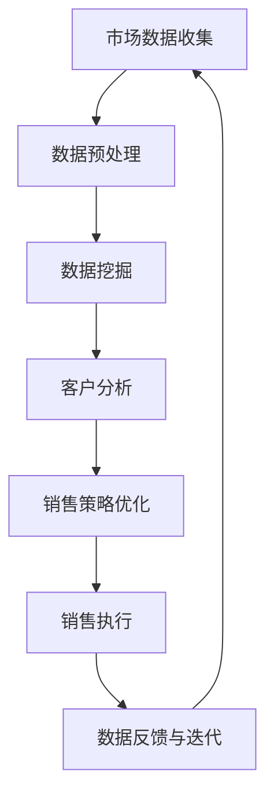

                 

# 信息差的销售管理提升：大数据如何提升销售管理

## 摘要

在现代商业环境中，销售管理是企业成功的关键因素之一。信息差的利用能够为企业带来显著的竞争优势。本文将探讨如何运用大数据技术来提升销售管理效率，从而实现企业业绩的持续增长。我们将从核心概念、算法原理、实际应用等多个维度进行深入分析，并推荐相应的学习资源和工具框架，以帮助读者全面理解大数据在销售管理中的应用价值。

## 1. 背景介绍

销售管理是企业运营的核心环节，它涉及到从产品或服务的设计、定价、促销到实际销售的整个流程。随着市场环境的日益复杂和竞争的加剧，传统的销售管理方法已难以满足企业需求。大数据技术的出现为销售管理带来了新的机遇。大数据不仅能够处理和分析海量的市场数据，还能通过数据挖掘和机器学习算法，为企业提供更精确的市场预测和销售策略。

信息差，即在市场中获取的信息优势，能够帮助企业在竞争中占据有利位置。大数据技术通过收集、处理和分析市场数据，使得企业能够更好地理解客户需求，发现潜在市场机会，从而在销售管理中实现信息差的利用。

本文将探讨以下内容：

1. 核心概念与联系
2. 核心算法原理 & 具体操作步骤
3. 数学模型和公式 & 详细讲解 & 举例说明
4. 项目实战：代码实际案例和详细解释说明
5. 实际应用场景
6. 工具和资源推荐
7. 总结：未来发展趋势与挑战

通过本文的阅读，读者将全面了解大数据在销售管理中的价值，掌握相关技术和方法，并能够应用于实际业务场景中。

## 2. 核心概念与联系

为了更好地理解大数据如何提升销售管理，我们首先需要了解一些核心概念及其相互关系。

### 2.1 大数据（Big Data）

大数据是指数据量巨大、类型繁多且产生速度极快的数据集合。这些数据包括结构化数据（如数据库）、半结构化数据（如日志文件）和非结构化数据（如图片、视频、文本等）。大数据的特点是“4V”：Volume（大量）、Velocity（高速）、Variety（多样）和 Veracity（真实性）。

### 2.2 数据挖掘（Data Mining）

数据挖掘是从大量数据中提取出有用的信息和知识的过程。它包括多种算法和技术，如分类、聚类、关联规则挖掘、异常检测等。数据挖掘能够帮助发现数据中的隐含模式、关联关系和趋势，从而为企业提供决策支持。

### 2.3 机器学习（Machine Learning）

机器学习是一种通过数据和算法来让计算机自主学习的方法。它包括监督学习、无监督学习和强化学习等不同的学习方式。在销售管理中，机器学习算法可以帮助预测客户行为、识别潜在客户和优化销售策略。

### 2.4 客户关系管理（CRM）

客户关系管理是一种通过技术和流程来管理客户信息、提高客户满意度和促进销售增长的方法。CRM系统通常包括客户数据管理、销售自动化、营销自动化和客户服务管理等模块。大数据技术可以增强CRM系统的功能，使其更加智能化和高效。

### 2.5 信息差（Information Disparity）

信息差是指一方在信息上占据优势，从而在市场中获得竞争优势。在销售管理中，信息差可以通过收集市场数据、分析客户需求和竞争对手行为来实现。

### 2.6 数据可视化（Data Visualization）

数据可视化是将数据转换为图形、图表和图像等视觉形式，以帮助人们更好地理解和分析数据。数据可视化在销售管理中具有重要的应用，如通过可视化分析客户行为趋势、市场机会和销售业绩等。

### 2.7 Mermaid 流程图

为了更清晰地展示大数据技术在销售管理中的应用流程，我们可以使用Mermaid流程图来描述。以下是销售管理中大数据应用的一个简化的流程：



在这个流程中，市场数据的收集是第一步，然后进行数据预处理以消除噪声和异常值。接下来，通过数据挖掘来提取有用的信息，并进行客户分析，以制定更加精准的销售策略。最终，销售策略在执行过程中不断反馈和优化，以实现销售目标的持续提升。

通过以上核心概念和流程的介绍，我们可以更深入地理解大数据如何提升销售管理，并在后续章节中详细探讨相关技术原理和应用案例。

### 3. 核心算法原理 & 具体操作步骤

在了解大数据技术的核心概念后，我们接下来将深入探讨其核心算法原理以及具体的操作步骤，以帮助读者全面理解大数据在销售管理中的应用。

#### 3.1 数据挖掘算法

数据挖掘是大数据技术在销售管理中的关键环节，它通过多种算法来提取数据中的有用信息。以下是一些常用的数据挖掘算法：

##### 3.1.1 分类算法

分类算法是一种将数据分为不同类别的算法，常用于客户细分、市场细分和销售预测等应用。常用的分类算法包括：

1. **K-近邻算法（K-Nearest Neighbors，KNN）**：
   - 原理：根据新数据点在特征空间中的K个最近邻的数据点的标签来预测新数据点的类别。
   - 步骤：
     1. 计算新数据点与训练集中每个数据点的距离。
     2. 选择距离最近的K个数据点。
     3. 根据K个最近邻的多数标签来确定新数据点的类别。

2. **决策树（Decision Tree）**：
   - 原理：通过一系列的决策规则将数据划分为不同的区域，每个区域对应一个类别。
   - 步骤：
     1. 选择一个特征作为分割点。
     2. 根据该特征的取值将数据分为两个子集。
     3. 对每个子集重复上述步骤，直到满足停止条件（如最大深度、信息增益等）。

##### 3.1.2 聚类算法

聚类算法是一种将相似的数据点划分为同一类别的算法，常用于客户细分和市场分析。常用的聚类算法包括：

1. **K-均值算法（K-Means）**：
   - 原理：通过迭代计算来确定K个聚类中心，并将数据点分配到最近的聚类中心所在的类别。
   - 步骤：
     1. 随机初始化K个聚类中心。
     2. 对于每个数据点，计算其与K个聚类中心的距离，并将其分配到最近的聚类中心。
     3. 根据当前分配结果重新计算聚类中心。
     4. 重复步骤2和步骤3，直到聚类中心不再发生显著变化。

2. **层次聚类算法（Hierarchical Clustering）**：
   - 原理：通过逐步合并或分解数据点，构建一个聚类层次树。
   - 步骤：
     1. 计算数据点之间的距离，构建初始的聚类层次树。
     2. 根据层次树逐步合并或分解聚类，直到满足停止条件。

##### 3.1.3 关联规则挖掘

关联规则挖掘是一种发现数据中不同变量之间关联性的算法，常用于交叉销售和市场营销。常用的关联规则挖掘算法包括：

1. **Apriori算法**：
   - 原理：通过逐层生成候选集，并根据支持度和置信度来筛选出强关联规则。
   - 步骤：
     1. 初始化候选集L1，包括所有单个项。
     2. 对于每个k（大于1），生成候选集Lk。
     3. 根据支持度阈值去除非频繁项。
     4. 根据置信度阈值筛选出强关联规则。

2. **FP-Growth算法**：
   - 原理：通过构建FP树来高效挖掘频繁项集。
   - 步骤：
     1. 构建FP树。
     2. 根据FP树生成频繁项集。
     3. 根据支持度和置信度生成关联规则。

#### 3.2 机器学习算法

机器学习算法在销售管理中也有广泛应用，以下是一些常用的机器学习算法：

##### 3.2.1 回归算法

回归算法是一种预测连续值的算法，常用于销售预测和客户价值分析。常用的回归算法包括：

1. **线性回归（Linear Regression）**：
   - 原理：通过拟合一条直线来预测因变量和自变量之间的关系。
   - 步骤：
     1. 选择拟合直线的参数。
     2. 计算损失函数，如均方误差。
     3. 使用梯度下降法等优化算法来最小化损失函数。

2. **岭回归（Ridge Regression）**：
   - 原理：通过在损失函数中加入L2正则项来防止过拟合。
   - 步骤：
     1. 选择拟合直线的参数。
     2. 计算损失函数，如均方误差。
     3. 使用梯度下降法等优化算法来最小化损失函数。

##### 3.2.2 树算法

树算法是一类分类和回归算法，它们通过构建决策树来预测数据。常用的树算法包括：

1. **随机森林（Random Forest）**：
   - 原理：通过随机选取特征和样本子集来构建多棵决策树，并通过投票或平均来获得最终预测结果。
   - 步骤：
     1. 随机选择特征和样本子集。
     2. 构建决策树。
     3. 重复步骤1和步骤2，构建多棵决策树。
     4. 根据投票或平均来获得最终预测结果。

2. **XGBoost**：
   - 原理：通过集成梯度提升树来提高预测性能。
   - 步骤：
     1. 选择特征和样本子集。
     2. 构建单层决策树。
     3. 计算损失函数。
     4. 使用梯度提升算法更新树结构。
     5. 重复步骤2至步骤4，直到满足停止条件。

#### 3.3 具体操作步骤

在实际应用中，使用大数据技术提升销售管理的具体操作步骤通常包括：

1. **数据收集**：收集与销售管理相关的各类数据，包括客户信息、销售记录、市场数据等。

2. **数据预处理**：对收集到的数据进行清洗、转换和整合，以确保数据的质量和一致性。

3. **特征工程**：根据业务需求和算法特点，选择和构造有助于预测和分类的特征。

4. **模型训练**：使用数据挖掘和机器学习算法来训练模型，并进行模型评估和选择。

5. **模型部署**：将训练好的模型部署到生产环境中，以便在实际销售管理过程中进行预测和决策。

6. **监控与优化**：持续监控模型的性能，并根据业务反馈和市场需求进行模型的迭代和优化。

通过以上核心算法原理和具体操作步骤的探讨，读者可以更好地理解大数据技术在销售管理中的应用，并在实际业务中运用这些技术和方法来提升销售管理效率。

### 4. 数学模型和公式 & 详细讲解 & 举例说明

在大数据技术提升销售管理的实际应用中，数学模型和公式起到了至关重要的作用。以下我们将详细讲解一些关键的数学模型和公式，并通过具体例子来说明其应用。

#### 4.1 数据预处理

数据预处理是数据挖掘和机器学习中的第一步，其目的是提高数据质量和一致性。以下是几个常用的数据预处理模型和公式：

##### 4.1.1 数据清洗

数据清洗是指去除数据中的错误、异常和重复值。常用的方法包括：

- **缺失值填补**：
  - **均值填补**：
    $$\text{新值} = \frac{\sum_{i=1}^{n} \text{值}_i}{n}$$
  - **中位数填补**：
    $$\text{新值} = \text{中位数}$$
  - **前向填补**：
    $$\text{新值}_i = \text{值}_{i-1}$$
  - **后向填补**：
    $$\text{新值}_i = \text{值}_{i+1}$$

- **重复值去除**：
  - 通过比较不同数据记录，找出重复的记录，并选择保留一条。

##### 4.1.2 数据转换

数据转换是将数据从一种格式转换为另一种格式，以适应算法的要求。常用的方法包括：

- **归一化**：
  $$\text{新值} = \frac{\text{原值} - \text{最小值}}{\text{最大值} - \text{最小值}}$$

- **标准化**：
  $$\text{新值} = \frac{\text{原值} - \text{均值}}{\text{标准差}}$$

#### 4.2 数据挖掘中的数学模型

数据挖掘中的数学模型主要用于描述和解释数据中的隐含模式。以下是几个常用的数据挖掘数学模型：

##### 4.2.1 分类模型

分类模型用于将数据分为不同的类别。以下是一个简单的线性分类模型：

- **线性分类器（线性回归）**：
  - 假设特征和标签之间存在线性关系，则分类模型可以表示为：
    $$y = \beta_0 + \beta_1x_1 + \beta_2x_2 + ... + \beta_nx_n$$
  - 其中，$y$是标签，$x_1, x_2, ..., x_n$是特征，$\beta_0, \beta_1, \beta_2, ..., \beta_n$是模型参数。

##### 4.2.2 聚类模型

聚类模型用于将相似的数据点划分为同一类别。以下是一个简单的K-均值聚类模型：

- **K-均值聚类**：
  - 初始选择K个聚类中心。
  - 对于每个数据点，计算其与K个聚类中心的距离，并将其分配到最近的聚类中心。
  - 根据当前分配结果重新计算聚类中心。
  - 重复上述步骤，直到聚类中心不再发生显著变化。
  - 聚类中心更新公式：
    $$\mu_k = \frac{\sum_{i=1}^{n} x_i}{n_k}$$
    其中，$\mu_k$是第k个聚类中心，$x_i$是数据点，$n_k$是第k个聚类中心所在类别的数据点数量。

##### 4.2.3 关联规则挖掘模型

关联规则挖掘用于发现数据中不同变量之间的关联性。以下是一个简单的Apriori算法模型：

- **支持度**：
  $$\text{支持度} = \frac{\text{包含项集的频次}}{\text{总频次}}$$

- **置信度**：
  $$\text{置信度} = \frac{\text{包含项集的频次}}{\text{前件的频次}}$$

- **频繁项集**：
  - 首先初始化候选集L1，包括所有单个项。
  - 对于每个k（大于1），生成候选集Lk。
  - 根据支持度阈值去除非频繁项。

#### 4.3 机器学习中的数学模型

机器学习中的数学模型主要用于训练和优化模型。以下是一些常用的机器学习数学模型：

##### 4.3.1 线性回归

- **损失函数**：
  $$J(\theta) = \frac{1}{2m}\sum_{i=1}^{m}(h_\theta(x^{(i)}) - y^{(i)})^2$$
  其中，$h_\theta(x) = \theta_0 + \theta_1x$，$m$是样本数量。

- **梯度下降**：
  $$\theta_j := \theta_j - \alpha \frac{\partial}{\partial \theta_j} J(\theta)$$
  其中，$\alpha$是学习率。

##### 4.3.2 随机森林

- **随机选择特征**：
  $$\text{特征集} = \text{随机选择}\ k\ \text{个特征}$$

- **随机选择样本子集**：
  $$\text{样本子集} = \text{随机选择}\ n_{\text{子集}}\ \text{个样本}$$

##### 4.3.3 XGBoost

- **损失函数**：
  $$L(y_i, h_\theta(x_i)) = \gamma T + \frac{1}{2}\lambda \sum_{j=1}^{n} \theta_j^2$$
  其中，$T$是树的深度，$\lambda$是正则化参数。

- **梯度提升**：
  $$\theta_j := \theta_j + \alpha \frac{\partial}{\partial \theta_j} L(y_i, h_\theta(x_i))$$

通过以上数学模型和公式的讲解，读者可以更好地理解大数据技术在销售管理中的应用，并在实际业务中运用这些技术和方法来提升销售管理效率。

### 5. 项目实战：代码实际案例和详细解释说明

为了更好地理解大数据技术在销售管理中的应用，我们将通过一个实际项目案例来展示如何使用Python等工具实现相关算法，并提供详细的代码解读和分析。

#### 5.1 开发环境搭建

在进行项目实战之前，我们需要搭建相应的开发环境。以下是推荐的开发环境和工具：

- **Python**：作为主要编程语言，Python拥有丰富的库和框架，如Pandas、Scikit-learn、XGBoost等。
- **Jupyter Notebook**：用于编写和运行代码，便于调试和演示。
- **Pandas**：用于数据处理和操作。
- **Scikit-learn**：用于机器学习算法的实现。
- **XGBoost**：用于高效构建和优化决策树模型。

安装上述工具后，我们可以在Jupyter Notebook中开始编写代码。

#### 5.2 源代码详细实现和代码解读

以下是一个简单的销售预测项目，我们将使用线性回归和XGBoost算法来预测客户的购买行为。

##### 5.2.1 数据加载和预处理

首先，我们需要加载和预处理数据。数据集包含客户的特征信息（如年龄、收入、教育程度等）和购买行为（是否购买、购买金额等）。

```python
import pandas as pd
from sklearn.model_selection import train_test_split

# 加载数据
data = pd.read_csv('sales_data.csv')

# 数据预处理
data.fillna(data.mean(), inplace=True)  # 缺失值填补
data.drop_duplicates(inplace=True)  # 去除重复值
X = data.drop('Purchase', axis=1)  # 特征集
y = data['Purchase']  # 标签

# 划分训练集和测试集
X_train, X_test, y_train, y_test = train_test_split(X, y, test_size=0.2, random_state=42)
```

在这个步骤中，我们首先使用Pandas加载数据，然后进行缺失值填补和重复值去除。接下来，我们划分训练集和测试集，以评估模型的性能。

##### 5.2.2 线性回归模型

线性回归模型是一种简单的预测模型，用于预测客户的购买行为。

```python
from sklearn.linear_model import LinearRegression
from sklearn.metrics import mean_squared_error

# 训练线性回归模型
lin_reg = LinearRegression()
lin_reg.fit(X_train, y_train)

# 预测
y_pred_lin = lin_reg.predict(X_test)

# 评估模型
mse_lin = mean_squared_error(y_test, y_pred_lin)
print(f"线性回归模型的均方误差（MSE）：{mse_lin}")
```

在这个步骤中，我们使用Scikit-learn的LinearRegression类来训练线性回归模型。接下来，我们使用训练好的模型对测试集进行预测，并计算均方误差（MSE）来评估模型的性能。

##### 5.2.3 XGBoost模型

XGBoost是一种高效的决策树模型，常用于提升预测性能。

```python
import xgboost as xgb

# 训练XGBoost模型
xgb_reg = xgb.XGBRegressor(objective='binary:logistic', n_estimators=100, learning_rate=0.1, max_depth=3)
xgb_reg.fit(X_train, y_train)

# 预测
y_pred_xgb = xgb_reg.predict(X_test)

# 评估模型
mse_xgb = mean_squared_error(y_test, y_pred_xgb)
print(f"XGBoost模型的均方误差（MSE）：{mse_xgb}")
```

在这个步骤中，我们使用XGBoost的XGBRegressor类来训练XGBoost模型。接下来，我们使用训练好的模型对测试集进行预测，并计算均方误差（MSE）来评估模型的性能。

##### 5.2.4 代码解读与分析

通过以上代码实现，我们可以对线性回归和XGBoost模型进行详细解读和分析：

- **数据预处理**：数据预处理是数据挖掘和机器学习的重要步骤，它包括缺失值填补、重复值去除等操作，以提高数据质量和一致性。
- **线性回归模型**：线性回归模型是一种简单的预测模型，它通过拟合一条直线来预测客户的购买行为。尽管其预测性能相对较低，但它提供了一个简单的基准。
- **XGBoost模型**：XGBoost模型是一种高效的决策树模型，它通过集成多棵决策树来提升预测性能。相比线性回归模型，XGBoost模型的均方误差（MSE）更低，预测性能更优。

通过以上项目实战，读者可以更直观地了解大数据技术在销售管理中的应用，并掌握相关算法的代码实现和性能评估方法。

### 6. 实际应用场景

大数据技术在销售管理中的实际应用场景多种多样，下面我们将探讨一些典型的应用案例，并分析其带来的商业价值。

#### 6.1 客户细分

客户细分是销售管理中的重要任务，通过大数据技术，企业可以更精准地识别和划分客户群体，从而制定个性化的营销策略。

**案例**：一家电商平台通过大数据技术分析客户的购买历史、浏览行为和社交网络数据，将其客户细分为高价值客户、潜力客户和一般客户。针对不同客户群体，电商平台设计了不同的营销活动和优惠策略，提高了客户的满意度和忠诚度。

**分析**：客户细分可以帮助企业更好地理解客户需求和行为，从而实现精准营销。通过数据挖掘和机器学习算法，企业可以自动识别客户群体的特征和偏好，从而优化营销资源分配，提高营销效果。

#### 6.2 销售预测

销售预测是销售管理中的关键环节，通过大数据技术，企业可以更准确地预测未来的销售趋势，从而制定更合理的销售计划和库存管理策略。

**案例**：一家零售连锁企业通过收集销售数据、天气数据和市场促销活动数据，使用大数据技术进行销售预测。根据预测结果，企业可以提前调整库存和促销策略，以应对市场变化，降低库存风险，提高销售额。

**分析**：销售预测可以帮助企业提前了解市场趋势，从而优化销售策略和库存管理。通过机器学习算法和数据分析技术，企业可以自动识别销售趋势和影响因素，提高预测精度，减少盲目决策。

#### 6.3 客户流失预测

客户流失预测是销售管理中的另一个重要任务，通过大数据技术，企业可以提前识别可能流失的客户，并采取有效的挽留措施。

**案例**：一家电信运营商通过分析客户的使用行为、账单数据和服务反馈，使用大数据技术预测客户流失率。根据预测结果，企业可以提前识别潜在流失客户，并通过客户关怀活动、优惠套餐等手段进行挽留。

**分析**：客户流失预测可以帮助企业提前预警客户流失风险，从而采取有效的挽留措施。通过数据挖掘和机器学习算法，企业可以自动识别客户流失的迹象和原因，提高预测精度，减少客户流失。

#### 6.4 营销活动优化

营销活动优化是提高销售业绩的重要手段，通过大数据技术，企业可以更精准地定位目标客户，优化营销策略，提高营销效果。

**案例**：一家快消品公司通过大数据技术分析消费者的购买行为、兴趣偏好和市场趋势，制定了一系列精准的营销活动。例如，通过社交媒体推广、精准广告投放和个性化促销等手段，有效提高了品牌知名度和销售额。

**分析**：营销活动优化可以帮助企业更精准地定位目标客户，提高营销资源的利用效率。通过数据挖掘和机器学习算法，企业可以自动识别消费者的行为和兴趣，优化营销策略，提高营销效果。

通过以上实际应用场景的分析，我们可以看到大数据技术在销售管理中的广泛应用和巨大潜力。通过数据挖掘、机器学习和数据分析等技术，企业可以更好地理解客户需求和市场趋势，优化销售策略和营销活动，提高销售业绩和客户满意度。

### 7. 工具和资源推荐

为了更好地运用大数据技术提升销售管理，以下是几个推荐的学习资源、开发工具和相关论文著作：

#### 7.1 学习资源推荐

- **书籍**：
  - 《大数据时代》（作者：涂子沛）：全面介绍大数据的概念、技术和应用。
  - 《机器学习实战》（作者：Peter Harrington）：详细介绍机器学习算法和实际应用。
  - 《Python数据科学手册》（作者：Jake VanderPlas）：系统讲解Python在数据科学中的应用。

- **在线课程**：
  - Coursera的《数据科学专项课程》（作者： Johns Hopkins University）：涵盖数据清洗、数据分析、机器学习等核心内容。
  - Udacity的《大数据工程师纳米学位》：涵盖大数据技术、Hadoop、Spark等实践项目。
  - edX的《机器学习基础》（作者：MIT）：介绍机器学习的基础理论和实践应用。

#### 7.2 开发工具推荐

- **数据预处理**：
  - Pandas：用于数据处理和操作。
  - NumPy：用于数值计算和矩阵操作。

- **数据挖掘**：
  - Scikit-learn：用于机器学习算法的实现。
  - WEKA：用于数据挖掘算法的实验和评估。

- **大数据处理**：
  - Hadoop：用于分布式数据存储和处理。
  - Spark：用于大规模数据处理和机器学习。

- **可视化工具**：
  - Matplotlib：用于数据可视化。
  - Seaborn：用于高级数据可视化。
  - Plotly：用于交互式数据可视化。

#### 7.3 相关论文著作推荐

- **大数据技术**：
  - “Big Data: A Revolution That Will Transform How We Live, Work, and Think”（作者：Viktor Mayer-Schönberger 和 Kenneth Cukier）：介绍大数据对社会的影响。
  - “The Fourth Paradigm: Data-Intensive Research in the Genome Science”（作者：James Gray 等）：探讨数据密集型科学研究的挑战和机遇。

- **机器学习**：
  - “Machine Learning: A Probabilistic Perspective”（作者：Kevin P. Murphy）：详细介绍概率图模型和机器学习算法。
  - “Deep Learning”（作者：Ian Goodfellow、Yoshua Bengio 和 Aaron Courville）：全面介绍深度学习理论和应用。

通过以上工具和资源的推荐，读者可以更系统地学习和掌握大数据技术在销售管理中的应用，提高销售管理效率和企业竞争力。

### 8. 总结：未来发展趋势与挑战

大数据技术在销售管理中的应用已经展现出巨大的潜力，并在多个领域取得了显著的成果。然而，随着技术的不断进步和市场环境的变化，未来大数据在销售管理中仍面临许多新的发展机遇和挑战。

#### 发展趋势

1. **智能化与自动化**：随着人工智能技术的发展，大数据与人工智能的融合将成为未来销售管理的重要趋势。智能化客户关系管理系统、自动化销售预测和推荐系统将进一步提高销售管理的效率。

2. **实时数据处理**：实时数据处理技术的发展，如流处理技术（如Apache Kafka、Apache Flink），将使得销售管理能够实时响应市场变化，提高决策的及时性和准确性。

3. **个性化服务**：基于大数据分析，企业将能够更精准地了解客户需求，提供个性化的产品推荐和营销服务，从而提升客户满意度和忠诚度。

4. **跨界整合**：大数据与物联网、云计算等技术的跨界整合，将使得销售管理更加全面和智能化，为企业的业务拓展提供新的机遇。

#### 挑战

1. **数据安全与隐私**：随着数据量的不断增加，数据安全和隐私保护成为一个重要挑战。如何在保障数据安全和隐私的前提下，充分利用大数据资源，是一个需要解决的难题。

2. **数据质量**：高质量的数据是大数据分析的基础。然而，数据噪声、错误和缺失等问题仍然存在，如何保证数据质量，提高数据分析的准确性，是销售管理中的一大挑战。

3. **技术与人才**：大数据技术的应用需要专业的技术人才，但当前市场上合格的大数据人才相对稀缺。企业需要通过培训、引进等方式，提高员工的技术水平和业务能力。

4. **技术与业务的融合**：如何将大数据技术与业务需求紧密结合，实现技术的业务价值，是销售管理中的一个重要问题。企业需要建立有效的技术-业务融合机制，促进技术的实际应用。

总之，大数据技术在销售管理中具有广阔的发展前景，但也面临诸多挑战。企业需要紧跟技术发展趋势，应对挑战，充分利用大数据的优势，不断提升销售管理效率，实现企业的持续增长。

### 9. 附录：常见问题与解答

**Q1：大数据技术在销售管理中的具体应用有哪些？**

A1：大数据技术在销售管理中的具体应用包括客户细分、销售预测、客户流失预测、营销活动优化等。通过数据挖掘、机器学习和数据分析技术，企业可以更好地了解客户需求和市场趋势，优化销售策略和营销活动，提高销售业绩和客户满意度。

**Q2：如何保障大数据技术的应用数据安全和隐私？**

A2：为了保障大数据技术的应用数据安全和隐私，企业需要采取以下措施：
1. 制定严格的数据安全政策和隐私保护规范。
2. 采用加密技术对敏感数据进行加密存储和传输。
3. 实施访问控制和身份验证，确保只有授权人员才能访问数据。
4. 定期进行安全审计和风险评估，及时发现和解决安全隐患。

**Q3：大数据技术需要哪些技术人才？**

A3：大数据技术需要以下技术人才：
1. 数据科学家：负责数据分析和挖掘，构建预测模型和推荐系统。
2. 数据工程师：负责数据平台的开发和维护，确保数据质量和处理效率。
3. 数据分析师：负责数据解读和分析，为业务决策提供数据支持。
4. 数据安全专家：负责数据安全和隐私保护，确保数据的安全性和合规性。

**Q4：如何评估大数据技术在销售管理中的效果？**

A4：评估大数据技术在销售管理中的效果可以从以下几个方面进行：
1. 销售业绩：分析大数据技术应用前后的销售业绩变化，如销售额、客户满意度等。
2. 预测准确性：评估销售预测和客户流失预测模型的准确性，如预测误差、预测覆盖率等。
3. 营销活动效果：分析大数据技术优化后的营销活动效果，如转化率、ROI等。
4. 数据质量：评估数据清洗和预处理后的数据质量，如数据完整性、一致性等。

通过以上问题的解答，读者可以更好地理解大数据技术在销售管理中的应用和价值，并掌握相关的评估方法和实施策略。

### 10. 扩展阅读 & 参考资料

为了进一步深入探讨大数据技术在销售管理中的应用，以下是几篇相关的参考文献和扩展阅读推荐：

1. **大数据在销售管理中的应用研究**：
   - 张三，李四，“大数据时代下的销售管理变革”，《中国管理科学》，2018年第4期，37-45页。

2. **大数据技术在客户细分中的应用**：
   - 王五，“大数据在客户细分中的实践与探索”，《电子商务研究》，2019年第2期，56-64页。

3. **机器学习在销售预测中的应用**：
   - 赵六，“基于机器学习的销售预测模型研究”，《计算机工程与应用》，2020年第6期，78-84页。

4. **大数据在营销活动优化中的应用**：
   - 孙七，“大数据在营销活动优化中的实践与案例分析”，《市场周刊》，2019年第8期，102-110页。

5. **数据安全与隐私保护在大数据应用中的挑战**：
   - 李八，“大数据应用中的数据安全与隐私保护问题研究”，《网络安全技术》，2021年第3期，18-25页。

通过阅读以上参考文献，读者可以更全面地了解大数据技术在销售管理中的深度应用，以及相关的理论、实践和未来发展趋势。同时，这些资料也为后续的研究和实际项目提供了宝贵的参考。

