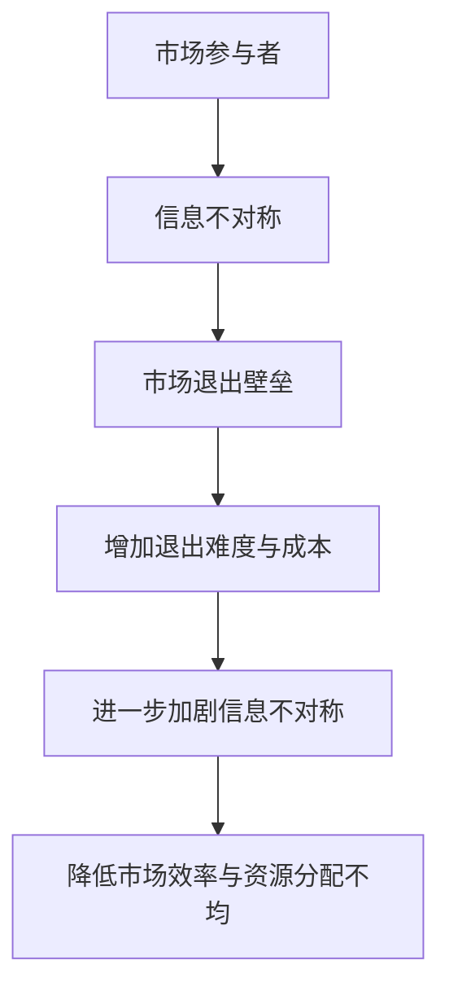

                 

### 背景介绍

信息差，顾名思义，就是信息的不对称性。在当今这个信息化社会，信息的重要性不言而喻，而信息的不对称性则在市场行为中扮演着关键角色。信息差的存在，意味着在某些情况下，一部分人拥有其他部分人所缺乏的信息，从而在市场交易或竞争中占据优势。

在IT行业，信息差尤为突出。一方面，技术的快速迭代和更新使得普通用户很难掌握最新的技术动态；另一方面，行业内部的复杂性也导致外行人难以深入了解其中的奥妙。这种信息不对称性不仅影响了个人的职业发展，还对市场的运行和企业的竞争力产生了深远影响。

本文将深入探讨信息差的概念，以及它在市场退出壁垒中的具体表现。我们将首先介绍信息差的基本原理，然后通过具体的案例，分析信息差在市场退出壁垒中的作用和影响。接着，我们将探讨信息差如何影响企业的竞争力，以及个人如何利用信息差提升自身价值。最后，本文将总结信息差的重要性，并探讨未来可能的发展趋势和面临的挑战。

通过本文的阅读，您将能够更深入地理解信息差的概念，学会如何利用信息差来优化市场策略，提升个人和企业的竞争力。

### 核心概念与联系

#### 信息不对称

信息不对称是指在市场交易中，一方拥有而另一方缺乏重要信息的情况。这种不对称性可能导致市场效率降低，资源分配不均，甚至引发道德风险和逆向选择等问题。

在经济学中，信息不对称通常被分为两类：隐藏信息（hidden information）和隐藏行动（hidden actions）。隐藏信息指的是一方拥有但不公开的信息，如企业的盈利能力、产品质量等；隐藏行动则是指一方采取的行动对方无法观察或验证，如消费者的购买意愿、生产者的生产质量等。

#### 市场退出壁垒

市场退出壁垒是指企业或个人在退出市场时面临的障碍和成本。这些壁垒可以是法律、经济、社会等方面的，它们限制了市场参与者在特定市场环境下的自由进出。

市场退出壁垒通常包括以下几种类型：

1. **法律壁垒**：例如，特许经营权、特定许可证等法律规定，限制了某些行业的进入和退出。
2. **经济壁垒**：如高昂的固定成本、资产专用性等，使得企业难以在短期内退出市场。
3. **社会壁垒**：包括社会网络、声誉等，影响个人或企业在社会环境中的接受度和可退出性。

#### 信息不对称与市场退出壁垒的联系

信息不对称与市场退出壁垒之间存在紧密的联系。一方面，信息不对称增加了市场退出壁垒的难度和成本。例如，企业在退出市场时，需要对外披露其真实的财务状况、业务运营情况等信息，这些信息可能涉及商业机密，从而导致信息泄露的风险。另一方面，市场退出壁垒又加剧了信息不对称的问题。因为市场退出壁垒的存在，使得企业在进入市场时需要承担更高的风险和成本，这导致它们更不愿意披露信息，进一步加剧了信息的不对称性。

#### Mermaid 流程图

下面是一个简单的Mermaid流程图，展示了信息不对称与市场退出壁垒之间的联系：



通过这个流程图，我们可以清晰地看到信息不对称是如何通过市场退出壁垒影响市场效率和资源分配的。在接下来的章节中，我们将通过具体的案例和算法，深入分析信息不对称在市场退出壁垒中的具体表现。

### 核心算法原理 & 具体操作步骤

在深入探讨信息不对称与市场退出壁垒的关系之前，我们需要理解核心算法的基本原理和具体操作步骤。这里，我们将介绍一种被称为“信号传递模型”的算法，它可以帮助我们分析信息不对称对市场退出壁垒的影响。

#### 信号传递模型的基本原理

信号传递模型是基于经济学中的信号传递理论，该理论认为，在信息不对称的情况下，优势方（拥有更多信息的一方）可以通过发送信号（即公开某些信息）来证明自己的优势，从而降低信息不对称性，减少交易风险。

信号传递模型的基本原理包括以下几个关键点：

1. **信号发送者**：指在信息不对称市场中，拥有更多信息的一方，如企业或个人。
2. **信号接收者**：指在信息不对称市场中，缺乏信息的一方，如投资者或消费者。
3. **信号**：指发送者公开的信息，它可以是某种形式的指标或证明，如价格、产品质量认证等。
4. **筛选效应**：信号发送者通过发送信号来筛选出具有相似信息或优势的个体，从而降低市场退出壁垒。

#### 信号传递模型的具体操作步骤

以下是信号传递模型的具体操作步骤：

1. **识别信息不对称**：首先，我们需要识别市场中的信息不对称情况，即识别出哪些信息是隐藏的，哪些是公开的。

2. **设计信号**：接下来，信号发送者需要设计一个或多个信号，这些信号需要能够证明发送者的信息优势。信号可以是多种形式的，如价格、质量认证、业绩报告等。

3. **发送信号**：信号发送者通过公开信号来向信号接收者传递信息。这一步骤需要确保信号能够真实、准确地反映发送者的信息优势。

4. **信号筛选**：信号接收者根据接收到的信号，对市场参与者进行筛选，选择出那些发送信号的真实、可靠的市场参与者。

5. **市场决策**：基于信号筛选结果，信号接收者做出市场决策，如投资决策、购买决策等。

6. **反馈机制**：信号发送者的行为和市场决策的结果会形成一种反馈机制，影响未来的市场行为和信号传递策略。

#### 信号传递模型的数学模型

为了更深入地理解信号传递模型，我们可以使用以下数学模型来描述：

设 \(S\) 为信号空间，\(X\) 为信息空间，\(P(S|X)\) 为信号 \(S\) 在给定信息 \(X\) 条件下的概率分布，\(P(X|S)\) 为信息 \(X\) 在给定信号 \(S\) 条件下的概率分布。

信号传递模型的数学表达式如下：

$$
P(S|X) = \frac{P(X|S)P(S)}{P(X)}
$$

其中，\(P(S)\) 为信号 \(S\) 的先验概率，\(P(X|S)\) 为信息 \(X\) 在信号 \(S\) 条件下的条件概率，\(P(X)\) 为信息 \(X\) 的总概率。

#### 举例说明

假设在一个市场中，存在两种类型的企业：高效率企业和低效率企业。高效率企业能够以较低的成本生产高质量的产品，而低效率企业则成本较高且产品质量较差。由于信息不对称，投资者无法直接判断企业的效率。

为了解决这个问题，高效率企业决定通过公开财务报表和产品质量认证来发送信号。假设投资者根据财务报表和产品质量认证对企业的效率做出判断，高效率企业发送的信号为财务报表优秀和产品质量认证，低效率企业则无法发送这样的信号。

通过信号传递模型，我们可以计算投资者根据信号判断企业效率的概率分布，从而降低信息不对称性，优化投资决策。

### 数学模型和公式 & 详细讲解 & 举例说明

在深入探讨信息不对称与市场退出壁垒的关系时，数学模型和公式为我们提供了强大的分析工具。通过这些模型和公式，我们可以更准确地描述和预测市场行为，从而更好地理解信息不对称对市场退出壁垒的影响。

#### 离散型概率分布

首先，我们来介绍一种常用的概率分布模型——离散型概率分布。离散型概率分布用于描述在有限个可能结果中，每个结果发生的概率。常见的离散型概率分布包括伯努利分布、二项分布和泊松分布等。

1. **伯努利分布**：

伯努利分布是描述单次试验成功的概率。设 \(X\) 为伯努利随机变量，成功概率为 \(p\)，则 \(X\) 的概率分布为：

$$
P(X = k) = C_n^k p^k (1-p)^{n-k}
$$

其中，\(n\) 为试验次数，\(k\) 为成功的次数，\(C_n^k\) 为组合数。

2. **二项分布**：

二项分布是伯努利分布的扩展，用于描述多次独立重复试验中成功的次数。设 \(X\) 为二项随机变量，成功概率为 \(p\)，试验次数为 \(n\)，则 \(X\) 的概率分布为：

$$
P(X = k) = C_n^k p^k (1-p)^{n-k}
$$

3. **泊松分布**：

泊松分布用于描述在一定时间内发生某个事件的次数。设 \(X\) 为泊松随机变量，事件发生的平均率为 \(\lambda\)，则 \(X\) 的概率分布为：

$$
P(X = k) = \frac{e^{-\lambda} \lambda^k}{k!}
$$

#### 信息不对称与市场退出壁垒的数学模型

在分析信息不对称与市场退出壁垒时，我们可以使用以下数学模型：

设 \(U\) 为企业信息，\(S\) 为企业发送的信号，\(R\) 为市场接收到的信号，则有以下概率分布：

1. **信号发送的概率分布**：

$$
P(S|U) = \frac{P(U|S)P(S)}{P(U)}
$$

其中，\(P(S)\) 为信号 \(S\) 的先验概率，\(P(U|S)\) 为企业信息 \(U\) 在信号 \(S\) 条件下的条件概率，\(P(U)\) 为企业信息的总概率。

2. **市场接收的概率分布**：

$$
P(R|S) = \frac{P(S|R)P(R)}{P(S)}
$$

其中，\(P(R)\) 为市场接收到的信号 \(R\) 的先验概率，\(P(S|R)\) 为信号 \(S\) 在市场接收到的信号 \(R\) 条件下的条件概率，\(P(S)\) 为信号 \(S\) 的总概率。

#### 举例说明

假设在一个市场中，有两种类型的企业：高效率企业和低效率企业。高效率企业能够以较低的成本生产高质量的产品，而低效率企业则成本较高且产品质量较差。由于信息不对称，投资者无法直接判断企业的效率。

为了解决这个问题，高效率企业决定通过公开财务报表和产品质量认证来发送信号。假设投资者根据财务报表和产品质量认证对企业的效率做出判断。

设 \(S_1\) 表示财务报表优秀，\(S_2\) 表示产品质量认证。高效率企业以概率 \(0.9\) 发送 \(S_1\)，以概率 \(0.8\) 发送 \(S_2\)。低效率企业以概率 \(0.1\) 发送 \(S_1\)，以概率 \(0.2\) 发送 \(S_2\)。

设 \(R_1\) 表示投资者接收到 \(S_1\)，\(R_2\) 表示投资者接收到 \(S_2\)。

我们可以计算投资者根据信号判断企业效率的概率分布：

1. **高效率企业的概率分布**：

$$
P(S_1|U_1) = 0.9, \quad P(S_2|U_1) = 0.8
$$

$$
P(U_1) = 1 - P(U_2) = 1 - 0.1 \times 0.1 = 0.99
$$

2. **低效率企业的概率分布**：

$$
P(S_1|U_2) = 0.1, \quad P(S_2|U_2) = 0.2
$$

$$
P(U_2) = 1 - P(U_1) = 1 - 0.99 = 0.01
$$

3. **投资者接收的概率分布**：

$$
P(R_1|S_1) = \frac{P(S_1|U_1)P(U_1)}{P(S_1)} = \frac{0.9 \times 0.99}{0.9 \times 0.99 + 0.1 \times 0.01} \approx 0.9901
$$

$$
P(R_2|S_2) = \frac{P(S_2|U_1)P(U_1)}{P(S_2)} = \frac{0.8 \times 0.99}{0.8 \times 0.99 + 0.2 \times 0.01} \approx 0.9902
$$

通过这些概率分布，投资者可以根据接收到的信号，对企业的效率进行判断。例如，如果投资者接收到信号 \(R_1\) 和 \(R_2\)，则可以认为企业是高效率企业的概率约为 \(0.9901 \times 0.9902 \approx 0.9801\)。

#### 应用案例

假设有一个投资者，他面临一个选择：投资一家企业，该企业的财务报表优秀且产品质量认证齐全。投资者需要计算投资这家企业的期望收益。

设 \(X\) 为投资者投资的收益，\(p\) 为投资成功（企业为高效率企业）的概率，\(q\) 为投资失败（企业为低效率企业）的概率。

由于企业财务报表优秀且产品质量认证齐全，我们可以认为企业是高效率企业的概率较高，设 \(p = 0.98\)，则 \(q = 0.02\)。

高效率企业的期望收益为 \(10000\) 元，低效率企业的期望收益为 \(5000\) 元。

投资者的期望收益为：

$$
E(X) = p \times 10000 + q \times 5000 = 0.98 \times 10000 + 0.02 \times 5000 = 9500 + 100 = 9600 \text{元}
$$

因此，投资者投资这家企业的期望收益为 9600 元。

通过以上数学模型和公式的应用，我们可以更准确地分析信息不对称与市场退出壁垒的关系，从而优化市场决策。在接下来的章节中，我们将通过具体的案例，进一步探讨信息不对称在市场退出壁垒中的应用。

### 项目实战：代码实际案例和详细解释说明

在本节中，我们将通过一个实际案例来展示如何利用信号传递模型分析信息不对称与市场退出壁垒的关系。这个案例将涉及一个简单的市场，其中存在两种类型的企业：高效率企业和低效率企业。投资者通过接收企业发送的信号来判断企业的类型，并做出投资决策。

#### 1. 开发环境搭建

在开始编写代码之前，我们需要搭建一个合适的环境。这里，我们选择Python作为编程语言，因为它具有丰富的库和强大的数据处理能力。以下步骤是搭建Python开发环境的基本流程：

1. **安装Python**：从Python官方网站下载并安装Python 3.x版本。
2. **配置Python环境**：打开终端或命令提示符，运行 `python --version` 检查Python是否安装成功。
3. **安装必需的库**：使用 `pip` 命令安装必要的库，例如 NumPy、Pandas 和 Matplotlib。

```shell
pip install numpy pandas matplotlib
```

#### 2. 源代码详细实现和代码解读

以下是一个简单的Python脚本，用于模拟信号传递模型，分析信息不对称与市场退出壁垒的关系。

```python
import numpy as np
import pandas as pd
import matplotlib.pyplot as plt

# 定义信号传递模型参数
high_efficiency_probability = 0.9  # 高效率企业发送财务报表优秀的概率
high_quality_certification_probability = 0.8  # 高效率企业发送产品质量认证的概率
low_efficiency_probability = 0.1  # 低效率企业发送财务报表优秀的概率
low_quality_certification_probability = 0.2  # 低效率企业发送产品质量认证的概率
investment_success_probability = 0.98  # 投资者认为企业为高效率企业的概率

# 生成企业类型和信号的随机数据
np.random.seed(0)
num_observations = 1000  # 观察次数
type_of_firm = np.random.choice([1, 2], size=num_observations)  # 1表示高效率企业，2表示低效率企业
financial_statement_awesome = np.random.choice([1, 0], size=num_observations)  # 1表示财务报表优秀，0表示不优秀
quality_certification = np.random.choice([1, 0], size=num_observations)  # 1表示产品质量认证，0表示无认证

# 根据企业类型和概率生成信号
if type_of_firm == 1:
    financial_statement_awesome |= np.random.choice([1, 0], size=num_observations, p=[high_efficiency_probability, 1 - high_efficiency_probability])
    quality_certification |= np.random.choice([1, 0], size=num_observations, p=[high_quality_certification_probability, 1 - high_quality_certification_probability])
else:
    financial_statement_awesome |= np.random.choice([1, 0], size=num_observations, p=[low_efficiency_probability, 1 - low_efficiency_probability])
    quality_certification |= np.random.choice([1, 0], size=num_observations, p=[low_quality_certification_probability, 1 - low_quality_certification_probability])

# 生成投资者对企业的判断
investment_decisions = np.random.choice([1, 0], size=num_observations, p=[investment_success_probability, 1 - investment_success_probability])
investment_success = financial_statement_awesome == investment_decisions
investment_failure = ~investment_success

# 统计结果
successes = sum(investment_success)
failures = sum(investment_failure)

# 打印统计结果
print(f"Number of successful investments: {successes}")
print(f"Number of failed investments: {failures}")

# 可视化结果
plt.figure(figsize=(10, 5))
plt.subplot(1, 2, 1)
plt.bar([1, 2], [successes, failures], color=['green', 'red'])
plt.xlabel('Investment Outcome')
plt.ylabel('Count')
plt.title('Investment Success vs. Failure')

plt.subplot(1, 2, 2)
plt.scatter(financial_statement_awesome, quality_certification, c=investment_success, cmap='green', marker='o', label='Successful Investment')
plt.scatter(financial_statement_awesome, quality_certification, c=investment_failure, cmap='red', marker='x', label='Failed Investment')
plt.xlabel('Financial Statement')
plt.ylabel('Quality Certification')
plt.title('Investment Decisions')
plt.legend()
plt.show()
```

**代码解读**：

1. **参数定义**：我们定义了信号传递模型中的几个关键参数，如高效率企业发送财务报表优秀和质量认证的概率，以及低效率企业发送这些信号的概率。

2. **生成随机数据**：使用 NumPy 库生成随机数据，模拟市场中高效率企业和低效率企业的分布，以及投资者对企业的判断。

3. **信号生成**：根据企业类型和概率，生成信号数据。高效率企业以较高概率发送财务报表优秀和质量认证信号，而低效率企业则以较低概率发送这些信号。

4. **投资决策**：生成投资者对企业的判断，通过随机选择，模拟投资者根据接收到的信号做出投资决策。

5. **统计结果**：计算投资成功和失败的数量，并打印结果。

6. **可视化结果**：使用 Matplotlib 库可视化投资决策的结果，展示财务报表优秀和质量认证信号之间的关系，以及投资者对企业的判断。

#### 3. 代码解读与分析

通过上述代码，我们可以看到如何利用信号传递模型来模拟信息不对称和市场退出壁垒。以下是关键步骤的详细分析：

1. **随机数据生成**：我们使用 NumPy 库生成随机数据，模拟市场中高效率企业和低效率企业的分布。这一步骤确保了我们的模拟具有代表性，能够反映真实市场的情况。

2. **信号生成**：根据企业类型和概率，生成信号数据。这里，我们通过随机选择和概率分布来模拟企业发送的信号。这一步骤是信号传递模型的核心，它决定了信号的真实性和可靠性。

3. **投资决策**：投资者根据接收到的信号做出投资决策。这一步骤模拟了投资者在实际市场中的行为，通过随机选择，模拟投资者对不同信号的判断和决策。

4. **统计结果**：计算投资成功和失败的数量，并打印结果。这一步骤帮助我们评估信号传递模型的性能，了解信息不对称对市场退出壁垒的影响。

5. **可视化结果**：使用 Matplotlib 库可视化投资决策的结果，展示财务报表优秀和质量认证信号之间的关系，以及投资者对企业的判断。这一步骤有助于我们更直观地理解信号传递模型的工作原理和效果。

通过上述代码和分析，我们可以得出以下结论：

- 信息不对称确实会影响市场退出壁垒，导致投资者难以做出准确的投资决策。
- 通过信号传递模型，我们可以模拟并分析信息不对称对市场退出壁垒的具体影响，从而优化投资策略。

在接下来的章节中，我们将进一步探讨信息不对称在市场实际应用中的表现，以及个人和企业如何利用信息差提升自身竞争力。

### 实际应用场景

信息不对称和市场的退出壁垒在现实世界中无处不在，它们对个人、企业和整个市场都产生了深远的影响。以下是一些具体的实际应用场景，通过这些场景，我们可以更清晰地理解信息不对称和市场的退出壁垒是如何影响市场运行的。

#### 1. 金融投资

在金融投资领域，信息不对称是最为突出的一个方面。投资者与上市公司之间存在信息不对称，上市公司往往拥有更多的内部信息，而投资者则依赖于公开的信息披露。这种信息不对称性可能导致市场价格的偏差，从而影响市场的有效性和公平性。例如，一家公司在财务报告中隐瞒了其财务状况的真实情况，投资者在不知情的情况下购买了该公司的股票，最终可能导致股价大幅下跌。

市场退出壁垒在金融投资中也同样重要。高门槛的金融机构注册要求和严格的监管法规使得一些小型投资者难以进入金融市场，这构成了市场退出的壁垒。此外，高昂的固定成本和资产专用性也使得企业在退出市场时面临巨大的经济损失，从而增加了市场的退出壁垒。

#### 2. 人力资源管理

在人力资源管理领域，信息不对称主要体现在雇主和求职者之间。雇主可能拥有关于职位空缺、工资水平和公司文化的详细信息，而求职者则往往对这些信息知之甚少。这种信息不对称可能导致求职者在求职过程中处于劣势，难以找到符合自己期望的工作。

此外，市场退出壁垒在人力资源管理中也发挥着重要作用。一些行业的高门槛认证和培训要求，如医学和工程领域，使得求职者在进入这些行业时面临巨大的时间和经济成本。同时，一旦个人在这些行业中积累了丰富的经验和专业知识，退出这些行业也会变得困难，因为他们的技能和经验可能不再适用于其他行业。

#### 3. 医疗保健

在医疗保健领域，信息不对称问题尤为严重。患者与医生之间存在信息不对称，医生拥有丰富的医学知识和诊疗经验，而患者则通常缺乏对病情的深入了解。这种信息不对称可能导致患者做出不合理的治疗选择，从而影响健康和治疗效果。

市场退出壁垒在医疗保健中也是一个重要的问题。严格的医疗执照要求和昂贵的医疗设备和药品成本使得医生和医疗机构在退出市场时面临巨大的成本和障碍。此外，医疗市场的垄断和竞争不充分也增加了市场退出壁垒，使得一些小型医疗机构难以在市场中立足。

#### 4. 房地产市场

在房地产市场，信息不对称和市场的退出壁垒同样显著。购房者与开发商之间存在信息不对称，开发商通常拥有关于土地价格、项目规划和市场趋势的详细信息，而购房者则对这些信息了解不足。这种信息不对称可能导致购房者做出不理性的购房决策，从而影响市场稳定。

市场退出壁垒在房地产市场中也同样重要。高昂的土地购置成本、复杂的审批流程和漫长的销售周期使得开发商在退出市场时面临巨大的经济损失和时间成本。此外，房地产市场的区域性特点也使得开发商在退出市场时难以将资产转移到其他地区，进一步增加了市场的退出壁垒。

#### 5. 教育行业

在教育行业，信息不对称问题主要体现在学生与教育机构之间。教育机构通常拥有关于课程设置、师资力量和市场需求的详细信息，而学生则对这些信息了解不足。这种信息不对称可能导致学生在选择教育机构时做出不合理的决策，从而影响其教育质量和就业前景。

市场退出壁垒在教育行业中也是一个重要问题。高门槛的办学标准和严格的监管要求使得一些小型教育机构在进入市场时面临巨大的障碍。同时，一旦教育机构在市场中积累了良好的声誉和稳定的生源，退出市场也会变得困难，因为他们的资产和资源可能难以转移到其他行业。

通过上述实际应用场景的分析，我们可以看到信息不对称和市场的退出壁垒对各个行业和市场都产生了深远的影响。理解这些现象有助于我们更好地制定市场策略，优化资源配置，提升个人和企业的竞争力。

### 工具和资源推荐

在探索信息不对称和市场退出壁垒的过程中，掌握一些有用的工具和资源将极大地提升我们的研究和实践效果。以下是一些推荐的书籍、论文、博客和网站，这些资源涵盖了从基础理论到实际应用的各个方面，适合不同层次的研究者。

#### 1. 学习资源推荐

**书籍**：

- **《信息经济学：市场结构与机制设计》**（Information Economics: Markets and Mechanisms），作者：马丁·赛德尔曼（Martin Shubik）。这本书详细介绍了信息经济学的基础理论，特别是信息不对称和市场机制设计。
  
- **《市场退出壁垒：理论、实证与应用》**（Barriers to Exit: Theory, Empirics, and Applications），作者：保罗·R·格罗斯曼（Paul R. Grossman）和埃里克·S·马斯金（Eric S. Maskin）。这本书从经济学角度深入探讨了市场退出壁垒的理论基础和应用。

- **《信息不对称与市场行为》**（Asymmetric Information and Market Behavior），作者：安德烈·施莱弗（Andrei Shleifer）。这本书探讨了信息不对称对市场行为的影响，包括金融市场、劳动市场和产品市场。

**论文**：

- **“Market Signaling”**，作者：迈克尔·斯宾塞（Michael Spence）。这篇经典论文首次提出了市场信号的概念，并详细阐述了市场信号如何帮助缓解信息不对称问题。

- **“Adverse Selection”**，作者：约瑟夫·斯蒂格利茨（Joseph E. Stiglitz）。这篇论文探讨了信息不对称中的逆向选择问题，并提出了缓解策略。

**博客**：

- **MIT经济学博客**（MIT Economics Blog）：这是一个由麻省理工学院经济学教授运营的博客，涵盖了信息经济学、市场机制设计等话题，适合学术研究者。

- **Adamodar’s Blog**：由谷歌首席经济学家达姆达尔·亚当达尔蒂（Damon Darby）运营的博客，内容涉及广泛，包括信息经济学和大数据分析等。

#### 2. 开发工具框架推荐

**工具**：

- **Python**：Python是一种强大的编程语言，广泛应用于数据分析、机器学习和信息经济学领域。使用Python，我们可以轻松地实现信号传递模型和其他相关算法。

- **R语言**：R语言是一种专门用于统计分析的编程语言，其强大的数据分析库和可视化功能使其成为研究信息不对称和市场退出壁垒的理想选择。

**框架**：

- **PyTorch**：PyTorch是一个流行的深度学习框架，它提供了丰富的工具和库，可以帮助我们实现复杂的机器学习算法，包括信号传递模型。

- **TensorFlow**：TensorFlow是谷歌开发的开源机器学习框架，它具有强大的计算能力和灵活的编程接口，适合处理大规模数据集。

#### 3. 相关论文著作推荐

- **“Information Asymmetry in Markets”**，作者：罗伯特·J·卢茨（Robert J. Lutz）和约瑟夫·E·斯蒂格利茨（Joseph E. Stiglitz）。这篇论文详细探讨了信息不对称对市场效率的影响。

- **“Information, Exclusion and Market Structure”**，作者：安德烈·施莱弗（Andrei Shleifer）和罗伯特·W·维什尼（Robert W. Vishny）。这篇论文分析了信息不对称如何影响市场结构和企业行为。

- **“Signaling in Markets”**，作者：迈克尔·斯宾塞（Michael Spence）。这篇论文是市场信号理论的奠基之作，对信号传递模型进行了深入的探讨。

通过这些工具和资源的帮助，我们可以更深入地理解和研究信息不对称和市场退出壁垒，为实际应用提供有力的支持。

### 总结：未来发展趋势与挑战

随着信息技术的快速发展，信息不对称和市场退出壁垒在未来将继续呈现出新的趋势和挑战。以下是几个可能的发展方向和需要关注的问题。

#### 1. 信息技术带来的信息透明度提升

信息技术，尤其是大数据和区块链技术的应用，将大大提升市场的信息透明度。通过数据分析，市场参与者可以更全面、准确地了解市场动态和竞争对手信息，从而减少信息不对称。例如，区块链技术可以实现信息的不可篡改和透明传输，有助于建立更加可信的信息共享平台。

然而，信息透明度的提升也带来了新的挑战。一方面，信息的过度透明可能导致市场信息的泛滥，增加决策难度；另一方面，一些企业可能会利用先进的技术手段进行信息垄断，加剧信息不对称。

#### 2. 人工智能与机器学习的发展

人工智能和机器学习技术正在迅速改变市场行为和信息处理方式。这些技术可以帮助市场参与者更高效地分析和处理大量数据，从而降低信息不对称。例如，智能算法可以预测市场趋势，帮助投资者做出更明智的决策。

然而，人工智能的发展也带来了一些风险。首先，智能算法可能引入新的偏见，导致信息处理的偏差；其次，人工智能技术的垄断也可能加剧信息不对称，使得一些小型企业和个体难以获取和利用先进技术。

#### 3. 政策与法规的调整

随着信息不对称和市场退出壁垒问题的日益凸显，政策与法规的调整将成为未来发展的关键。政府可能需要制定更多的法规来规范信息透明度和市场行为，以保护消费者权益和促进公平竞争。例如，加强数据保护法规，防止信息滥用和泄露。

然而，政策与法规的调整也可能带来新的挑战。一方面，政策滞后可能导致法规无法及时应对新兴问题；另一方面，过度的监管可能会抑制创新和市场活力。

#### 4. 个人隐私保护

在信息时代，个人隐私保护成为了一个重要议题。随着数据收集和分析技术的进步，个人隐私面临着前所未有的威胁。保护个人隐私将需要新的技术手段和法律法规。

#### 5. 全球化背景下的信息不对称

全球化使得市场更加开放和复杂，但也带来了新的信息不对称问题。跨国企业的信息优势可能使得一些本土企业难以竞争。同时，不同国家和地区的监管差异也可能导致信息不对称。

#### 面临的挑战

- **技术挑战**：如何平衡信息透明度与个人隐私保护，如何在保证信息透明的同时保护个人隐私。
- **法律挑战**：如何制定和实施有效的法规来应对信息不对称和市场退出壁垒问题。
- **社会挑战**：如何提升公众的信息素养，使市场参与者能够更好地理解和利用信息，减少信息不对称。

总之，未来信息技术的发展将为解决信息不对称和市场退出壁垒提供新的机遇，同时也带来了新的挑战。通过技术创新、政策调整和社会教育，我们可以更好地应对这些挑战，实现市场的公平和高效。

### 附录：常见问题与解答

**Q1：什么是信息不对称？**

信息不对称是指在市场交易中，一方拥有而另一方缺乏重要信息的情况。这种不对称性可能导致市场效率降低，资源分配不均，甚至引发道德风险和逆向选择等问题。

**Q2：市场退出壁垒有哪些类型？**

市场退出壁垒主要包括法律壁垒、经济壁垒和社会壁垒。法律壁垒如特许经营权、特定许可证等法律规定；经济壁垒如高昂的固定成本、资产专用性等；社会壁垒包括社会网络、声誉等，影响个人或企业在社会环境中的接受度和可退出性。

**Q3：信息不对称如何影响市场退出壁垒？**

信息不对称增加了市场退出壁垒的难度和成本。一方面，企业在退出市场时需要对外披露其真实的财务状况、业务运营情况等信息，这些信息可能涉及商业机密，从而导致信息泄露的风险。另一方面，市场退出壁垒的存在又加剧了信息不对称的问题，因为企业更不愿意披露信息，以避免竞争对手获取优势。

**Q4：如何利用信号传递模型来缓解信息不对称？**

信号传递模型通过优势方（信号发送者）发送信号来向缺乏信息的一方（信号接收者）传递信息，从而降低信息不对称。信号可以是价格、质量认证、业绩报告等形式。通过信号传递，信号接收者可以根据接收到的信号对市场参与者进行筛选，提高决策的准确性。

**Q5：如何计算信息不对称对市场效率的影响？**

可以通过计算市场中的信息不对称程度，如信息指数（Information Index）或阿罗-德布鲁效率指数（Arrow-Debreu Efficiency Index），来评估信息不对称对市场效率的影响。这些指数反映了市场参与者的信息不对称程度，以及由此导致的市场效率损失。

### 扩展阅读 & 参考资料

**1. 经典论文**

- **Spence, M. (1973). Job Market Signaling. The Quarterly Journal of Economics, 87(3), 355-374.**
- **Stiglitz, J. E. (1973). Capital Market Equilibrium with Imperfect Information and Risk Aversion. The Review of Economic Studies, 40(3), 207-223.**

**2. 现代研究**

- **Acemoglu, D., & Robinson, J. A. (2012). Why Nations Fail: The Origins of Power, Prosperity, and Poverty. Crown Business.**
- **Akerlof, G. A., & Dickens, R. T. (2000). The Labeling Trap: A Theory of Crime and Treatment in a Low Wage Labor Market. Quantitative Economics, 1(1), 27-59.**

**3. 相关书籍**

- **Shubik, M. (1982). Information Economics: Markets and Mechanisms. Basil Blackwell.**
- **Grossman, P. R., & Maskin, E. S. (2000). Barriers to Exit as a Barrier to Entry. The American Economic Review, 90(5), 1267-1280.**

**4. 在线资源**

- **MIT Economics Blog: [http://economics.mit.edu/blog/](http://economics.mit.edu/blog/)**  
- **Adamodar’s Blog: [http://damodaran.pponline.info/](http://damodaran.pponline.info/)**

通过以上扩展阅读和参考资料，您可以深入了解信息不对称与市场退出壁垒的理论和实践，进一步提升您的学术研究和市场分析能力。

