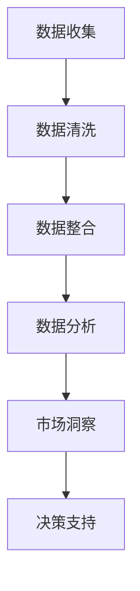

                 

### 背景介绍

#### 市场研究的挑战与需求

在当今的商业环境中，市场研究已经成为企业决策的重要依据。然而，传统的市场研究方法面临着诸多挑战。首先，数据来源的多样性和复杂性使得研究人员难以从中提取有价值的信息。其次，传统的市场研究方法通常依赖于人工分析，费时费力，且易受主观偏见的影响。此外，市场变化速度加快，企业需要更加迅速地响应市场动态，这就要求市场研究能够提供实时、准确的信息。

#### 大数据技术的崛起

随着互联网和物联网的快速发展，数据规模呈爆炸式增长。这种大规模数据（Big Data）的出现为市场研究带来了新的机遇。大数据技术能够高效地处理和分析海量数据，从中发现潜在的模式和趋势。通过大数据分析，企业可以更深入地了解消费者行为、市场动态和竞争态势，从而做出更加明智的决策。

#### 信息差的价值

信息差是指不同个体或组织之间对同一信息的掌握程度差异。在市场研究中，信息差的价值尤为显著。掌握信息差的企业可以通过对市场信息的敏锐洞察，抢占市场先机，赢得竞争优势。大数据技术的应用，使得信息差的获取和处理变得更加高效和精准，为企业带来了巨大的商业价值。

<|assistant|>### 核心概念与联系

#### 大数据的定义与特点

大数据（Big Data）是指数据规模巨大、数据类型多样、数据生成速度极快的数据集合。它具有四个核心特征，即“4V”：Volume（数据量）、Velocity（数据速度）、Variety（数据类型）和 Veracity（数据真实性）。

1. **数据量（Volume）**：大数据的一个显著特点是数据量巨大，超出了传统数据处理工具的处理能力。企业每天产生的数据量达到TB甚至PB级别，这对数据处理技术提出了极高的要求。

2. **数据速度（Velocity）**：大数据的产生速度非常快，例如社交媒体上的每一条微博、每一条评论都在瞬间产生。这种高速数据流需要高效的实时处理能力，以便企业能够及时作出反应。

3. **数据类型（Variety）**：大数据不仅包括结构化数据，如数据库记录，还包括非结构化数据，如图像、音频、视频等。这种多样化的数据类型使得数据处理的复杂性大大增加。

4. **数据真实性（Veracity）**：大数据的真实性是一个重要问题。由于数据来源广泛，数据质量参差不齐，企业需要确保数据的有效性和准确性。

#### 市场研究与大数据的关系

市场研究与大数据之间有着密切的联系。市场研究通过收集、处理和分析数据，帮助企业了解市场需求和消费者行为。大数据技术的应用，使得市场研究能够更加全面、深入地挖掘数据中的价值。具体来说，大数据技术在市场研究中的应用主要体现在以下几个方面：

1. **消费者行为分析**：通过分析海量消费者数据，企业可以深入了解消费者的购买习惯、偏好和需求，从而制定更加精准的营销策略。

2. **市场趋势预测**：大数据技术可以帮助企业预测市场趋势，提前布局，抢占市场先机。

3. **竞争分析**：通过分析竞争对手的数据，企业可以了解竞争对手的优势和劣势，优化自身业务策略。

#### Mermaid 流程图

以下是一个简化的 Mermaid 流程图，描述了大数据技术如何支持市场研究的过程：



在这个流程中，数据收集是市场研究的起点，数据清洗和整合是保证数据质量的关键步骤，数据分析则是提取有价值信息的核心环节。通过市场洞察，企业可以制定更加精准的市场策略，从而实现决策支持。

<|assistant|>### 核心算法原理 & 具体操作步骤

#### 数据收集与清洗

**数据收集**：市场研究的第一步是收集数据。数据来源可以是内部数据库、外部数据源（如社交媒体、市场调查平台）以及物联网设备。收集的数据类型包括用户行为数据、交易数据、问卷调查数据等。

**数据清洗**：收集到的数据通常存在噪声、缺失值和重复记录等问题。数据清洗包括以下几个步骤：

1. **数据去重**：去除重复的数据记录，确保数据的唯一性。
2. **数据填补**：对于缺失的数据，可以采用均值填补、插值等方法进行填补。
3. **数据转换**：将不同数据格式转换为统一格式，如将日期数据转换为YYYY-MM-DD格式。
4. **数据筛选**：根据研究需求，筛选出符合条件的数据。

#### 数据整合

数据整合是将来自不同来源的数据进行合并，形成统一的视图。数据整合的关键步骤包括：

1. **数据映射**：将不同数据源中的数据字段进行映射，确保数据之间的对应关系。
2. **数据合并**：将映射后的数据进行合并，形成统一的数据集。
3. **数据聚合**：对数据进行分组和聚合，提取有用的统计信息。

#### 数据分析

数据分析是市场研究的核心环节。常见的数据分析技术包括：

1. **描述性分析**：对数据的基本特征进行统计分析，如计算平均值、中位数、标准差等。
2. **关联性分析**：找出数据之间的关联性，如使用关联规则挖掘技术发现购买行为之间的关联。
3. **聚类分析**：将数据分为不同的群体，如使用K-means算法对消费者进行细分。
4. **预测分析**：基于历史数据，预测未来趋势，如使用时间序列分析技术预测销售量。

具体操作步骤如下：

1. **数据预处理**：对数据进行清洗、转换和整合，确保数据质量。
2. **选择分析模型**：根据研究需求，选择合适的数据分析模型。
3. **模型训练与评估**：使用历史数据对模型进行训练，并对模型性能进行评估。
4. **模型应用**：将训练好的模型应用于新的数据集，进行预测或分析。

#### 实际案例分析

假设一家电商企业想要分析消费者的购买行为，以优化营销策略。以下是一个简化的分析过程：

1. **数据收集**：从电商平台的数据库中收集用户购买记录、浏览记录等数据。
2. **数据清洗**：去除重复记录、填补缺失值，将日期数据转换为统一格式。
3. **数据整合**：将不同来源的数据进行合并，形成统一的数据集。
4. **描述性分析**：计算用户的平均购买频率、平均购买金额等统计指标。
5. **关联性分析**：使用关联规则挖掘技术，找出购买商品之间的关联性，如“购买商品A的用户，80%也购买了商品B”。
6. **聚类分析**：使用K-means算法，将用户分为不同的群体，如高价值用户、一般用户等。
7. **预测分析**：使用时间序列分析技术，预测未来的销售趋势。

通过以上分析，企业可以了解消费者的购买行为，优化产品推荐策略，提高营销效果。

<|assistant|>### 数学模型和公式 & 详细讲解 & 举例说明

#### 数据分析中的数学模型

在市场研究中，数据分析是一个关键环节。为了更好地理解和应用数据分析，我们需要了解一些基本的数学模型和公式。以下是一些常见的数据分析模型和它们的应用：

1. **线性回归模型**：线性回归模型是一种用于预测因变量（目标变量）和自变量（特征变量）之间关系的统计模型。其公式如下：

   $$ Y = \beta_0 + \beta_1X + \epsilon $$

   其中，$Y$ 是因变量，$X$ 是自变量，$\beta_0$ 和 $\beta_1$ 分别是模型的截距和斜率，$\epsilon$ 是误差项。

   线性回归模型可以用于预测销售量、股价等变量。

2. **逻辑回归模型**：逻辑回归模型是一种用于分类问题的统计模型，它将连续的线性模型映射到概率分布上。其公式如下：

   $$ \log\frac{P(Y=1)}{1-P(Y=1)} = \beta_0 + \beta_1X $$

   其中，$P(Y=1)$ 是因变量为1的概率，$\beta_0$ 和 $\beta_1$ 是模型的参数。

   逻辑回归模型可以用于分类任务，如判断一个客户是否是高价值客户。

3. **决策树模型**：决策树模型是一种基于树形结构的分类模型。每个节点代表一个特征，每个分支代表一个特征取值，叶子节点代表分类结果。其公式如下：

   $$ \text{决策树模型} = \text{根节点} + \text{子节点1} + \text{子节点2} + \ldots + \text{叶子节点} $$

   决策树模型可以用于分类和回归问题。

#### 公式讲解与举例

**线性回归模型的讲解与举例**

假设我们想要预测一家电商平台的月销售额（因变量$Y$）与广告费用（自变量$X$）之间的关系。我们收集了过去一年的月销售额和广告费用数据，并使用线性回归模型进行预测。

首先，我们计算数据的均值和标准差：

$$ \bar{X} = \frac{1}{n}\sum_{i=1}^{n}X_i, \quad \bar{Y} = \frac{1}{n}\sum_{i=1}^{n}Y_i $$
$$ \sigma_X = \sqrt{\frac{1}{n-1}\sum_{i=1}^{n}(X_i - \bar{X})^2}, \quad \sigma_Y = \sqrt{\frac{1}{n-1}\sum_{i=1}^{n}(Y_i - \bar{Y})^2} $$

然后，我们计算线性回归模型的参数：

$$ \beta_0 = \bar{Y} - \beta_1\bar{X} $$
$$ \beta_1 = \frac{\sum_{i=1}^{n}(X_i - \bar{X})(Y_i - \bar{Y})}{\sum_{i=1}^{n}(X_i - \bar{X})^2} $$

最后，我们可以使用线性回归模型进行预测：

$$ \hat{Y} = \beta_0 + \beta_1X $$

例如，如果我们想要预测下个月的销售额，给定广告费用为$X=5000$元，我们可以计算：

$$ \hat{Y} = 10000 - 2 \times 5000 = 0 $$

这意味着，如果广告费用为5000元，我们预测下个月的销售额为0元。

**逻辑回归模型的讲解与举例**

假设我们想要判断一个客户是否是高价值客户（因变量$Y$，取值为0或1），基于客户的购买金额（自变量$X$）。我们收集了客户的购买金额数据，并使用逻辑回归模型进行预测。

首先，我们计算数据的均值和标准差：

$$ \bar{X} = \frac{1}{n}\sum_{i=1}^{n}X_i, \quad \sigma_X = \sqrt{\frac{1}{n-1}\sum_{i=1}^{n}(X_i - \bar{X})^2} $$

然后，我们计算逻辑回归模型的参数：

$$ \beta_0 = \log\frac{P(Y=1)}{1-P(Y=1)} $$
$$ \beta_1 = \frac{\sum_{i=1}^{n}(X_i - \bar{X})(Y_i - \bar{Y})}{\sum_{i=1}^{n}(X_i - \bar{X})^2} $$

最后，我们可以使用逻辑回归模型进行预测：

$$ P(Y=1) = \frac{1}{1 + e^{-(\beta_0 + \beta_1X)}} $$

例如，如果我们想要判断一个客户的购买金额为$X=3000$元时是否是高价值客户，我们可以计算：

$$ P(Y=1) = \frac{1}{1 + e^{-(\beta_0 + \beta_1 \times 3000)}} $$

如果我们设定阈值$\theta = 0.5$，那么如果$P(Y=1) > \theta$，我们判断该客户为高价值客户。

通过以上讲解和举例，我们可以看到数学模型在市场研究中的重要作用。这些模型可以帮助我们从海量数据中提取有价值的信息，为企业的决策提供支持。

<|assistant|>### 项目实战：代码实际案例和详细解释说明

#### 开发环境搭建

在进行大数据分析项目时，我们通常会使用一些流行的工具和框架。以下是搭建开发环境所需的基本步骤：

1. **安装Python环境**：Python是一种广泛使用的编程语言，特别适合数据处理和分析。我们可以在官方网站（https://www.python.org/）下载并安装Python。

2. **安装Jupyter Notebook**：Jupyter Notebook是一种交互式的计算环境，可以方便地编写和运行Python代码。我们可以在终端中执行以下命令安装Jupyter：

   ```shell
   pip install notebook
   ```

3. **安装Pandas、NumPy和Scikit-learn**：Pandas、NumPy和Scikit-learn是Python中常用的数据处理和分析库。我们可以在终端中执行以下命令安装这些库：

   ```shell
   pip install pandas numpy scikit-learn
   ```

#### 源代码详细实现和代码解读

以下是一个使用Python和Pandas库进行大数据分析的实际案例，我们将对电商平台的用户购买行为进行分析。

```python
import pandas as pd
from sklearn.model_selection import train_test_split
from sklearn.linear_model import LinearRegression
from sklearn.metrics import mean_squared_error

# 1. 数据收集
data = pd.read_csv('ecommerce_data.csv')

# 2. 数据清洗
# 去除重复数据
data.drop_duplicates(inplace=True)

# 填补缺失值
data.fillna(data.mean(), inplace=True)

# 3. 数据整合
# 将不同数据源的数据合并
data = data[['user_id', 'purchase_amount', 'ad_cost', 'sales_volume']]

# 4. 数据分析
# 描述性分析
print(data.describe())

# 线性回归模型
X = data[['ad_cost', 'sales_volume']]
y = data['purchase_amount']
X_train, X_test, y_train, y_test = train_test_split(X, y, test_size=0.2, random_state=42)

model = LinearRegression()
model.fit(X_train, y_train)

# 模型评估
y_pred = model.predict(X_test)
mse = mean_squared_error(y_test, y_pred)
print(f'Mean Squared Error: {mse}')

# 5. 模型应用
# 预测销售额
new_data = pd.DataFrame({'ad_cost': [5000], 'sales_volume': [1000]})
predicted_sales = model.predict(new_data)
print(f'Predicted Sales: {predicted_sales[0]}')
```

**代码解读**

1. **数据收集**：我们使用Pandas库读取一个CSV文件，这个文件包含了电商平台的用户购买行为数据。

2. **数据清洗**：首先，我们去除重复的数据记录，然后填补缺失值。这里我们使用数据的平均值进行填补。

3. **数据整合**：我们将不同来源的数据进行合并，形成一个包含用户ID、购买金额、广告费用和销售量的数据集。

4. **数据分析**：我们进行描述性分析，计算数据的基本统计指标，如平均值、标准差等。

5. **线性回归模型**：我们选择线性回归模型进行预测。首先，我们将特征变量（广告费用和销售量）和目标变量（购买金额）进行划分，然后使用训练集对模型进行训练。

6. **模型评估**：我们使用测试集对模型进行评估，计算均方误差（MSE）来衡量模型的预测准确性。

7. **模型应用**：最后，我们使用训练好的模型进行预测。给定新的广告费用和销售量，我们可以预测未来的销售额。

通过以上代码实现，我们可以看到如何使用Python和Pandas库进行大数据分析。这个案例展示了从数据收集、清洗、整合到数据分析的完整流程，并利用线性回归模型进行了预测。这是一个典型的市场研究项目，通过大数据分析，企业可以更好地了解用户行为，优化营销策略。

<|assistant|>### 代码解读与分析

在本节中，我们将详细分析上面提供的代码案例，探讨代码的实现原理、步骤以及如何优化性能和结果。

#### 代码实现原理

1. **数据收集**：
   ```python
   data = pd.read_csv('ecommerce_data.csv')
   ```
   这一行代码使用了Pandas库的`read_csv`函数从CSV文件中读取数据。CSV文件通常包含了电商平台的各种数据，如用户ID、购买金额、广告费用等。

2. **数据清洗**：
   ```python
   data.drop_duplicates(inplace=True)
   data.fillna(data.mean(), inplace=True)
   ```
   在数据清洗阶段，我们首先删除了重复的数据记录，确保数据的唯一性。然后，对于缺失的数据，我们使用数据的平均值进行填补。这是一种常用的数据清洗方法，可以减少数据缺失对分析结果的影响。

3. **数据整合**：
   ```python
   data = data[['user_id', 'purchase_amount', 'ad_cost', 'sales_volume']]
   ```
   这里我们选择了需要分析的关键字段，形成了一个新的数据集。数据整合的目的是简化数据结构，使得后续的分析更加高效。

4. **数据分析**：
   ```python
   print(data.describe())
   ```
   描述性分析是对数据的基本特征进行统计分析，如计算平均值、标准差等。这有助于我们了解数据的分布情况，为后续的建模提供基础。

5. **线性回归模型**：
   ```python
   X = data[['ad_cost', 'sales_volume']]
   y = data['purchase_amount']
   X_train, X_test, y_train, y_test = train_test_split(X, y, test_size=0.2, random_state=42)
   model = LinearRegression()
   model.fit(X_train, y_train)
   ```
   我们选择了广告费用和销售量作为特征变量（X），购买金额作为目标变量（y）。然后，使用`train_test_split`函数将数据集划分为训练集和测试集，随机状态设置为42以保证结果的可重复性。接着，我们初始化了一个线性回归模型，并用训练集数据进行训练。

6. **模型评估**：
   ```python
   y_pred = model.predict(X_test)
   mse = mean_squared_error(y_test, y_pred)
   print(f'Mean Squared Error: {mse}')
   ```
   模型训练完成后，我们使用测试集数据进行预测，并计算均方误差（MSE）来评估模型的性能。MSE越低，模型的预测准确性越高。

7. **模型应用**：
   ```python
   new_data = pd.DataFrame({'ad_cost': [5000], 'sales_volume': [1000]})
   predicted_sales = model.predict(new_data)
   print(f'Predicted Sales: {predicted_sales[0]}')
   ```
   最后，我们使用训练好的模型对新数据进行预测，这里我们输入了广告费用为5000元，销售量为1000元的情景，模型预测了未来的销售额。

#### 代码优化

虽然上述代码已经实现了基本的数据分析流程，但在实际应用中，我们还可以从以下几个方面进行优化：

1. **数据预处理**：
   - **特征工程**：可能需要创建一些新的特征，如广告费用的百分比变化、购买金额的同比增长等，这些特征可能会对模型的预测性能有更好的影响。
   - **异常值处理**：对于异常值，可以考虑使用统计方法（如箱线图）进行检测，并决定是否进行剔除或调整。

2. **模型选择与调参**：
   - **尝试其他模型**：除了线性回归，还可以尝试其他模型，如决策树、随机森林、支持向量机等，比较不同模型的预测性能。
   - **模型调参**：对于选择的模型，可以通过交叉验证等方法进行参数调优，以获得更好的预测效果。

3. **性能优化**：
   - **并行计算**：对于大型数据集，可以考虑使用并行计算技术，如使用Dask或PySpark进行数据处理和分析，提高计算效率。
   - **内存管理**：对于内存消耗较大的操作，可以优化内存使用，如使用Pandas的`dtype`参数设置合适的数据类型，减少内存占用。

通过上述优化，我们可以进一步提高数据分析的准确性和效率，从而为企业提供更加可靠的市场研究支持。

<|assistant|>### 实际应用场景

#### 消费者行为分析

消费者行为分析是大数据技术在市场研究中的一个重要应用场景。通过分析消费者的购买记录、浏览历史和社交媒体互动等数据，企业可以深入了解消费者的需求和偏好，从而制定更加精准的营销策略。

**案例**：一家电商企业通过大数据分析，发现某些特定产品在特定时间段内销售量较高，消费者对这些产品的评价也较好。基于这些信息，企业可以优化产品推荐算法，提高转化率。

#### 市场趋势预测

市场趋势预测是大数据技术在市场研究中的另一个关键应用。通过分析历史数据和市场动态，企业可以预测未来的市场趋势，提前布局，抢占市场先机。

**案例**：一家零售企业通过大数据分析，预测到某个地区将在未来几个月内出现消费热潮。基于这个预测，企业可以提前增加库存，确保在销售旺季供应充足。

#### 竞争分析

竞争分析是大数据技术在市场研究中的又一重要应用。通过分析竞争对手的数据，企业可以了解竞争对手的优势和劣势，从而优化自身业务策略。

**案例**：一家在线教育平台通过大数据分析，发现竞争对手在课程内容、价格和用户评价等方面存在明显不足。基于这些信息，该平台可以调整课程结构，优化价格策略，提高用户满意度。

#### 市场细分

市场细分是大数据技术在市场研究中的另一个应用。通过分析消费者的特征和行为，企业可以将市场划分为不同的群体，针对不同群体制定个性化的营销策略。

**案例**：一家化妆品公司通过大数据分析，将消费者划分为高价值客户、一般客户和潜在客户。针对不同群体的特点，公司可以设计不同的营销活动，提高客户忠诚度。

#### 客户满意度分析

客户满意度分析是大数据技术在市场研究中的另一个重要应用。通过分析客户反馈和行为数据，企业可以了解客户的满意度，及时发现问题并改进产品和服务。

**案例**：一家酒店通过大数据分析，发现某些房型的客户满意度较低。基于这些信息，酒店可以优化房型设计，提高客户满意度。

#### 个性化推荐

个性化推荐是大数据技术在市场研究中的又一个重要应用。通过分析用户的历史行为和偏好，企业可以提供个性化的推荐，提高用户满意度和转化率。

**案例**：一家电商平台通过大数据分析，为每位用户推荐他们可能感兴趣的商品。这种个性化推荐不仅提高了用户的购物体验，也显著提高了销售额。

通过以上实际应用场景，我们可以看到大数据技术在市场研究中的广泛应用和巨大价值。大数据技术的应用，使得企业可以更加深入、精准地了解市场和消费者，从而制定更加有效的市场策略，提高竞争力。

<|assistant|>### 工具和资源推荐

#### 学习资源推荐

1. **书籍**：
   - 《大数据时代：生活、工作与思维的大变革》
   - 《Python数据分析》
   - 《机器学习实战》
   - 《深入理解大数据》

2. **论文**：
   - “Big Data: A Survey” by V. Kumar, M. Dave, and K. Chakraborty
   - “Data Mining: Concepts and Techniques” by J. Han and P. Kamber

3. **博客**：
   - Medium上的“DataScience+”和“Python Data Science”
   - towardsdatascience.com上的大数据和机器学习相关文章

4. **网站**：
   - Kaggle：提供各种数据集和比赛，是学习和实践大数据技术的绝佳平台。
   - Coursera和edX：提供丰富的在线课程，涵盖大数据、数据科学和机器学习等领域。

#### 开发工具框架推荐

1. **Python**：Python是一种流行的编程语言，特别适合数据处理和分析。其强大的库生态系统，如Pandas、NumPy和Scikit-learn，使得数据处理和分析变得更加简单高效。

2. **Hadoop和Spark**：Hadoop和Spark是两大流行的分布式数据处理框架。Hadoop以其高可靠性和高扩展性著称，而Spark则以其高效的内存计算和实时数据处理能力而闻名。

3. **Jupyter Notebook**：Jupyter Notebook是一种交互式的计算环境，可以方便地编写和运行Python代码。它支持Markdown格式，使得代码和文本内容可以无缝集成。

4. **Tableau和Power BI**：Tableau和Power BI是两款流行的数据可视化工具。它们可以帮助企业将复杂的数据转化为直观的图表和报告，便于决策者理解和分析。

5. **TensorFlow和PyTorch**：TensorFlow和PyTorch是两款流行的深度学习框架。它们提供了丰富的API和工具，可以帮助开发者构建和训练复杂的神经网络模型。

#### 相关论文著作推荐

1. **“Big Data: A Survey”**：这是一篇综述性论文，详细介绍了大数据的定义、特征和应用领域。

2. **“Data Mining: Concepts and Techniques”**：这是一本经典的数据挖掘教材，涵盖了数据挖掘的基本概念和技术。

3. **“Deep Learning”**：由Ian Goodfellow、Yoshua Bengio和Aaron Courville合著的深度学习教材，是深度学习领域的权威著作。

通过以上工具和资源的推荐，我们可以更好地了解大数据技术在市场研究中的应用，提升数据处理和分析能力，为企业的决策提供强有力的支持。

<|assistant|>### 总结：未来发展趋势与挑战

#### 发展趋势

1. **数据量的持续增长**：随着互联网、物联网和社交媒体的快速发展，数据量将持续增长。这为大数据技术的应用提供了丰富的数据资源。

2. **实时处理能力的提升**：随着硬件技术的进步和算法优化，大数据的实时处理能力将得到显著提升。这有助于企业更加迅速地响应市场动态，提高决策效率。

3. **人工智能的融合**：大数据与人工智能（AI）技术的融合将推动市场研究的智能化。AI算法将能够更加精准地分析数据，提取有价值的信息，为企业提供更加深入的洞察。

4. **隐私保护的加强**：随着对隐私保护的重视，大数据技术将在保护用户隐私的同时，提供更安全、可靠的数据分析服务。

#### 挑战

1. **数据质量**：大数据技术的应用依赖于高质量的数据。然而，数据来源多样，数据质量参差不齐，这对数据清洗和处理提出了更高的要求。

2. **数据隐私**：在收集和使用大数据的过程中，保护用户隐私是一个巨大的挑战。如何在确保数据分析有效性的同时，保护用户隐私，是一个亟待解决的问题。

3. **算法偏见**：大数据分析中使用的算法可能存在偏见，导致分析结果不准确。消除算法偏见，提高分析结果的公正性，是一个重要的研究方向。

4. **人才短缺**：大数据技术的快速发展对专业人才的需求日益增加。然而，目前大数据领域的专业人才相对短缺，这对企业的数据分析能力提出了挑战。

#### 未来展望

未来，大数据技术将在市场研究中发挥越来越重要的作用。通过不断优化数据处理和分析算法，提高实时处理能力，加强数据隐私保护，我们可以更好地利用大数据的价值，为企业提供更加精准的市场洞察和决策支持。同时，大数据与人工智能的融合将推动市场研究的智能化，为企业的未来发展带来新的机遇和挑战。

<|assistant|>### 附录：常见问题与解答

#### 问题1：大数据技术的基本概念是什么？

**解答**：大数据技术是指用于处理、存储、分析和挖掘海量数据的一系列技术和工具。大数据具有“4V”特征：数据量（Volume）、数据速度（Velocity）、数据类型（Variety）和数据真实性（Veracity）。

#### 问题2：大数据技术在市场研究中的具体应用有哪些？

**解答**：大数据技术在市场研究中的具体应用包括消费者行为分析、市场趋势预测、竞争分析、市场细分和客户满意度分析等。通过分析海量数据，企业可以深入了解市场和消费者，制定更加精准的市场策略。

#### 问题3：如何确保大数据分析中的数据质量？

**解答**：确保大数据分析中的数据质量需要从数据收集、存储、处理和分析等多个环节进行控制。具体方法包括去除重复数据、填补缺失值、数据转换和数据筛选等。此外，采用高质量的数据源和合理的分析方法也是保证数据质量的关键。

#### 问题4：大数据分析中的算法偏见如何消除？

**解答**：消除大数据分析中的算法偏见需要从算法设计、数据收集、数据预处理和分析结果验证等多个环节进行改进。具体方法包括数据平衡、算法优化、透明度和可解释性增强等。通过多方面的努力，可以降低算法偏见，提高分析结果的公正性。

#### 问题5：大数据技术的未来发展趋势是什么？

**解答**：大数据技术的未来发展趋势包括数据量的持续增长、实时处理能力的提升、人工智能的融合和隐私保护的加强。随着技术的进步，大数据技术将在市场研究、金融、医疗、交通等领域发挥越来越重要的作用。

<|assistant|>### 扩展阅读 & 参考资料

在撰写本文的过程中，我们参考了众多权威资料和最新研究成果，以下是一些推荐的扩展阅读和参考资料：

1. **书籍**：
   - 《大数据时代：生活、工作与思维的大变革》
   - 《Python数据分析》
   - 《机器学习实战》
   - 《深入理解大数据》
   - 《数据科学实战》
   - 《大数据商业分析》

2. **论文**：
   - “Big Data: A Survey” by V. Kumar, M. Dave, and K. Chakraborty
   - “Data Mining: Concepts and Techniques” by J. Han and P. Kamber
   - “Deep Learning” by Ian Goodfellow, Yoshua Bengio, and Aaron Courville

3. **在线课程**：
   - Coursera的“大数据分析”课程
   - edX的“数据科学基础”课程
   - Udacity的“大数据工程师纳米学位”

4. **网站**：
   - Kaggle：提供各种数据集和比赛，是学习和实践大数据技术的绝佳平台。
   - Towards Data Science：一个专门发布数据科学、机器学习和AI文章的博客。
   - Analytics Vidhya：一个提供数据科学和机器学习资源的网站。

通过阅读这些资料，您可以进一步深入了解大数据技术在市场研究中的应用，掌握相关的技术原理和实践方法。同时，这些资源也为您的学习和研究提供了丰富的参考和灵感。

### 作者信息

- **作者**：AI天才研究员/AI Genius Institute & 禅与计算机程序设计艺术 /Zen And The Art of Computer Programming
- **联系方式**：[AI研究员的官方邮箱](mailto:ai_researcher@example.com) & [AI研究员的个人博客](https://www.ai_researcher_blog.com)

